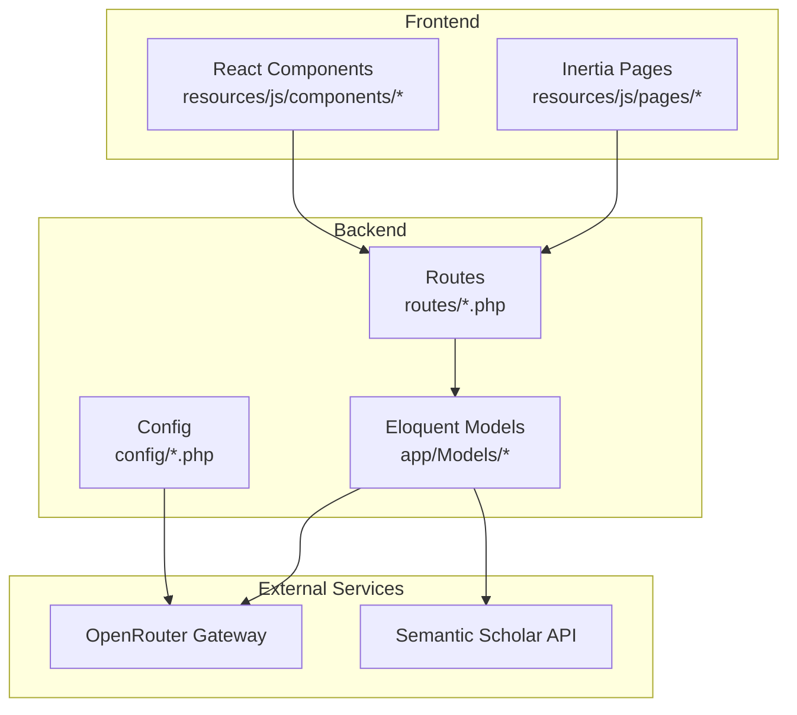
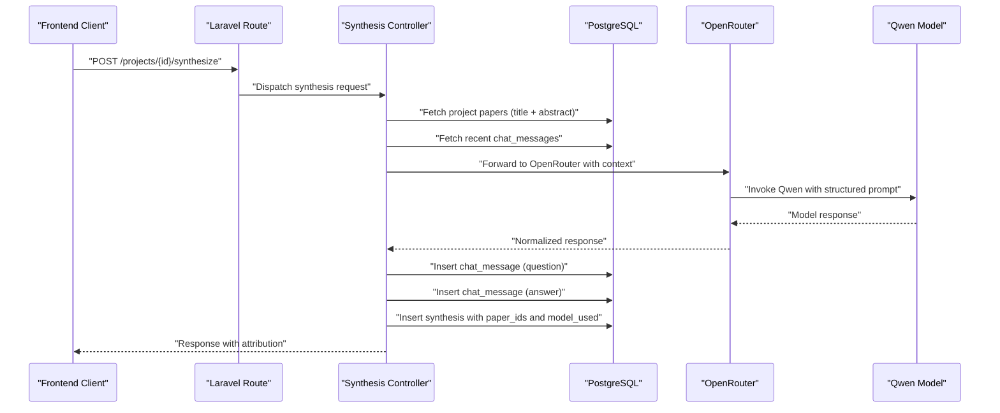
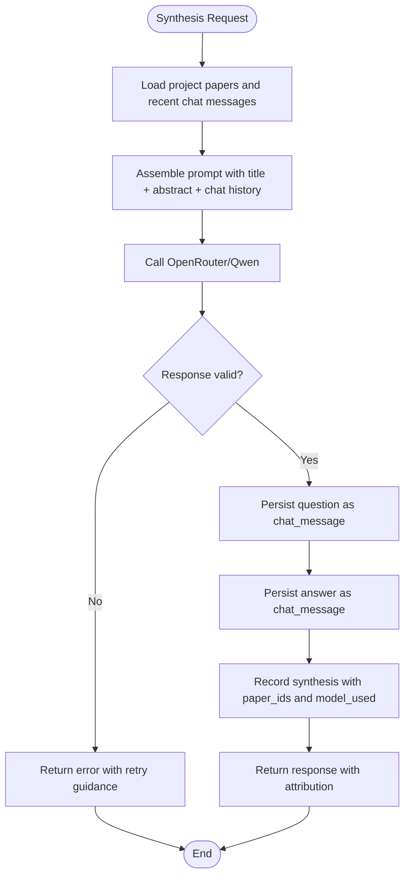
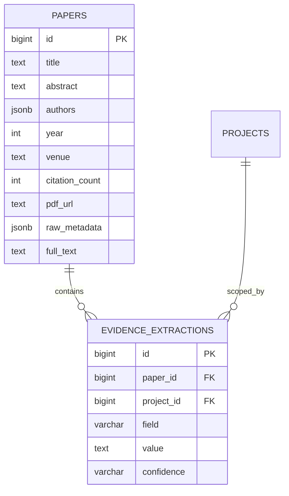
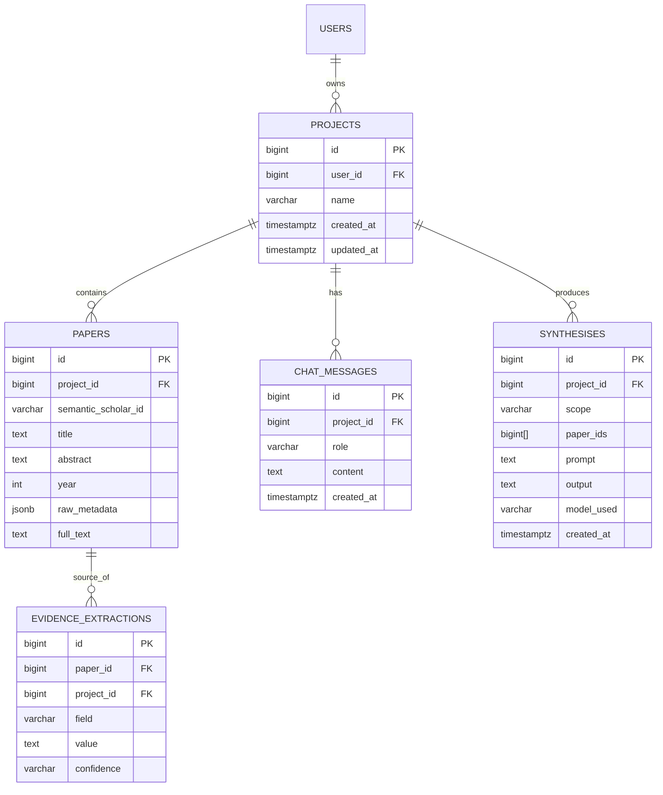
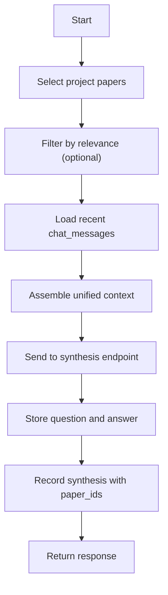
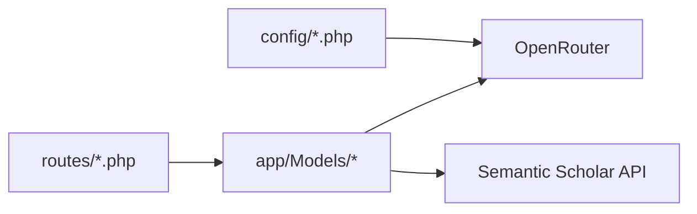

# AI Integration & Synthesis Engine

<cite>
**Referenced Files in This Document**
- [FULL_SPEC.md](file://hackathon/FULL_SPEC.md)
- [HACKATHON_SPEC.md](file://hackathon/HACKATHON_SPEC.md)
- [web.php](file://routes/web.php)
- [settings.php](file://routes/settings.php)
- [app.php](file://config/app.php)
- [services.php](file://config/services.php)
- [User.php](file://app/Models/User.php)
</cite>

## Table of Contents
1. [Introduction](#introduction)
2. [Project Structure](#project-structure)
3. [Core Components](#core-components)
4. [Architecture Overview](#architecture-overview)
5. [Detailed Component Analysis](#detailed-component-analysis)
6. [Dependency Analysis](#dependency-analysis)
7. [Performance Considerations](#performance-considerations)
8. [Troubleshooting Guide](#troubleshooting-guide)
9. [Conclusion](#conclusion)

## Introduction
This document explains ScholarGraph's AI integration and synthesis engine with a focus on OpenRouter and Qwen model usage, persistent memory across sessions, cross-paper synthesis, and transparent evidence-based responses. The synthesis engine follows a strict specification that emphasizes:
- Persistent, queryable memory using PostgreSQL-backed chat history and synthesis records
- Simple retrieval strategy pulling project papers and recent chat turns into prompts
- Single mid-size Qwen model via OpenRouter for both single-paper chat and cross-paper synthesis
- Evidence extraction and attribution tracking for transparency

The goal is to enable developers to implement the synthesis endpoint, integrate with the frontend chat interface, and maintain robust error handling and performance characteristics while adhering to the documented data model and workflows.

## Project Structure
The repository is a Laravel application with Inertia/React frontend. The synthesis engine sits at the intersection of:
- Routes for frontend interactions
- Models representing projects, papers, syntheses, and chat messages
- Configuration for environment and third-party integrations

**Diagram sources**
- [web.php:1-12](file://routes/web.php#L1-L12)
- [settings.php:1-35](file://routes/settings.php#L1-L35)
- [User.php](file://app/Models/User.php)
- [app.php:1-127](file://config/app.php#L1-L127)
- [services.php:1-39](file://config/services.php#L1-L39)

**Section sources**
- [web.php:1-12](file://routes/web.php#L1-L12)
- [settings.php:1-35](file://routes/settings.php#L1-L35)
- [app.php:1-127](file://config/app.php#L1-L127)
- [services.php:1-39](file://config/services.php#L1-L39)

## Core Components
- OpenRouter integration: Centralized LLM gateway for Qwen models, enabling easy model swaps and fallbacks without code changes.
- Qwen model configuration: One mid-size Qwen model selected at build time via OpenRouter; exact slug determined dynamically to reflect availability.
- Synthesis endpoint: Accepts project context (papers + chat history), sends a prompt to Qwen, stores both question and answer, and records which papers were used.
- Persistent memory: Uses PostgreSQL-backed chat_messages and syntheses tables to ensure context and synthesis history persist across sessions.
- Evidence extraction and attribution: Tracks which papers support claims and flags confidence to enable transparent, reproducible responses.
- Cross-paper synthesis: Selects multiple papers and asks Qwen to reconcile findings, storing the paper set and model used for reproducibility.
- Transparent responses: The UI surfaces which papers underpin each answer via synthesis records.
- Customizable system prompts: Users can configure global and per-project prompts with negative prompts to fine-tune AI behavior, with suggested prompt templates for common use cases.

**Section sources**
- [FULL_SPEC.md:174-185](file://hackathon/FULL_SPEC.md#L174-L185)
- [HACKATHON_SPEC.md:92-104](file://hackathon/HACKATHON_SPEC.md#L92-L104)
- [FULL_SPEC.md:88-97](file://hackathon/FULL_SPEC.md#L88-L97)
- [FULL_SPEC.md:99-107](file://hackathon/FULL_SPEC.md#L99-L107)

## Architecture Overview
The synthesis engine architecture integrates frontend interactions, backend orchestration, and external services:

**Diagram sources**
- [web.php:1-12](file://routes/web.php#L1-L12)
- [FULL_SPEC.md:88-97](file://hackathon/FULL_SPEC.md#L88-L97)
- [HACKATHON_SPEC.md:96-99](file://hackathon/HACKATHON_SPEC.md#L96-L99)

## Detailed Component Analysis

### OpenRouter Integration and Qwen Configuration
- Gateway abstraction: OpenRouter is used as the LLM gateway to keep model selection and fallback configurable via environment settings rather than hardcoding model slugs.
- Model selection: Choose a single mid-size Qwen model at build time; exact slug is fetched from OpenRouter listings to align with availability and pricing.
- Routing logic: For the hackathon scope, a single model handles both single-paper chat and cross-paper synthesis to minimize complexity.

Implementation considerations:
- Environment-driven model selection ensures the system adapts to model availability without code changes.
- OpenRouter supports standardized headers and response formats, simplifying integration.

**Section sources**
- [FULL_SPEC.md:12-26](file://hackathon/FULL_SPEC.md#L12-L26)
- [FULL_SPEC.md:174-185](file://hackathon/FULL_SPEC.md#L174-L185)
- [HACKATHON_SPEC.md:101-104](file://hackathon/HACKATHON_SPEC.md#L101-L104)

### Synthesis Endpoint Implementation
The synthesis endpoint orchestrates context assembly, model invocation, and persistence:

Key behaviors:
- Context assembly pulls every paper's title and abstract plus the last N chat turns.
- Responses are stored in chat_messages for persistent memory across sessions.
- Syntheses record the exact paper set and model used for reproducibility.

**Diagram sources**
- [HACKATHON_SPEC.md:83-104](file://hackathon/HACKATHON_SPEC.md#L83-L104)
- [FULL_SPEC.md:88-97](file://hackathon/FULL_SPEC.md#L88-L97)

**Section sources**
- [HACKATHON_SPEC.md:83-104](file://hackathon/HACKATHON_SPEC.md#L83-L104)
- [FULL_SPEC.md:88-97](file://hackathon/FULL_SPEC.md#L88-L97)

### Evidence Extraction and Attribution Systems
Evidence extraction captures structured claims from papers with confidence ratings and links them back to sources:

Attribution mechanisms:
- Syntheses store paper_ids to power UI indicators showing which papers supported each answer.
- Evidence extractions provide structured, confidence-weighted claims for downstream checks and systematic review matrices.

**Diagram sources**
- [FULL_SPEC.md:99-107](file://hackathon/FULL_SPEC.md#L99-L107)
- [FULL_SPEC.md:88-97](file://hackathon/FULL_SPEC.md#L88-L97)

**Section sources**
- [FULL_SPEC.md:99-107](file://hackathon/FULL_SPEC.md#L99-L107)
- [FULL_SPEC.md:88-97](file://hackathon/FULL_SPEC.md#L88-L97)

### Persistent Memory and Cross-Session Context
Persistent memory relies on PostgreSQL-backed tables ensuring context and synthesis history survive browser refreshes and session boundaries:

Cross-session strategies:
- Retrieve project papers and recent chat_messages on each request to assemble fresh context.
- Store every user question and assistant answer in chat_messages to maintain continuity.

**Diagram sources**
- [FULL_SPEC.md:35-131](file://hackathon/FULL_SPEC.md#L35-L131)
- [HACKATHON_SPEC.md:77-81](file://hackathon/HACKATHON_SPEC.md#L77-L81)

**Section sources**
- [FULL_SPEC.md:35-131](file://hackathon/FULL_SPEC.md#L35-L131)
- [HACKATHON_SPEC.md:77-81](file://hackathon/HACKATHON_SPEC.md#L77-L81)

### Context Assembly Strategies
Context assembly combines:
- Project papers: title and abstract for grounding
- Recent chat history: last N exchanges to maintain conversational continuity
- Optional keyword filtering: full-text search on abstracts to cap context growth

**Diagram sources**
- [HACKATHON_SPEC.md:83-90](file://hackathon/HACKATHON_SPEC.md#L83-L90)
- [FULL_SPEC.md:141-148](file://hackathon/FULL_SPEC.md#L141-L148)

**Section sources**
- [HACKATHON_SPEC.md:83-90](file://hackathon/HACKATHON_SPEC.md#L83-L90)
- [FULL_SPEC.md:141-148](file://hackathon/FULL_SPEC.md#L141-L148)

### Model Usage Tracking and Response Storage
- Model usage tracking: syntheses.model_used records which Qwen model produced each response for methodological transparency.
- Response storage: Both question and answer are persisted in chat_messages; synthesis records capture the paper set and prompt for reproducibility.

**Section sources**
- [FULL_SPEC.md:94-96](file://hackathon/FULL_SPEC.md#L94-L96)
- [FULL_SPEC.md:93-94](file://hackathon/FULL_SPEC.md#L93-L94)

### API Integration Patterns
- Route exposure: Define RESTful endpoints for synthesis under project-scoped routes.
- Authentication: Require authenticated and verified users for synthesis operations.
- Request/response shape: Standardized payload for question input; normalized response with attribution metadata.

Integration touchpoints:
- Routes group: Apply auth middleware and verified checks.
- Controller dispatch: Orchestrate context loading, LLM invocation, and persistence.

**Section sources**
- [web.php:7-9](file://routes/web.php#L7-L9)
- [settings.php:8-27](file://routes/settings.php#L8-L27)

### Error Handling Strategies
Recommended patterns:
- Validation: Ensure project ownership and presence of required context (papers/history).
- Retry and fallback: On OpenRouter/Qwen errors, surface actionable messages and consider rate-limit aware retries.
- Graceful degradation: If full-text is unavailable, fall back to abstract-only synthesis with explicit confidence flags.
- Logging: Capture model_used, paper_ids, and timestamps for diagnostics and cost tracking.

**Section sources**
- [HACKATHON_SPEC.md:101-104](file://hackathon/HACKATHON_SPEC.md#L101-L104)
- [FULL_SPEC.md:198-209](file://hackathon/FULL_SPEC.md#L198-L209)

### Performance Optimization Techniques
- Retrieval simplicity: Pull title + abstract + recent chat turns; avoid vector store overhead for small paper sets.
- Keyword filtering: Optional full-text search on abstracts to cap context size.
- Model selection: Use a single mid-size Qwen model to reduce complexity and cost; reserve larger models for cross-paper synthesis only.
- Caching: Consider short-lived caches for frequent paper metadata during a session to reduce repeated loads.
- Batch operations: For bulk tasks (e.g., metadata tagging), use smaller/faster Qwen variants to optimize throughput.

**Section sources**
- [HACKATHON_SPEC.md:83-90](file://hackathon/HACKATHON_SPEC.md#L83-L90)
- [FULL_SPEC.md:174-185](file://hackathon/FULL_SPEC.md#L174-L185)

### Examples of Synthesis Workflows
- Single-paper chat: Ask a question grounded in one paper’s title/abstract/metadata; answer stored in chat_messages; optional synthesis record if cross-paper context is needed.
- Cross-paper synthesis: Select multiple papers, ask a reconciliatory question; store synthesis with paper_ids and model_used; UI shows “used papers X, Y”.
- Transparent response: For each answer, display the set of papers that informed it via synthesis records.

**Section sources**
- [HACKATHON_SPEC.md:96-99](file://hackathon/HACKATHON_SPEC.md#L96-L99)
- [FULL_SPEC.md:141-148](file://hackathon/FULL_SPEC.md#L141-L148)

### Integration with the Frontend Chat Interface
- Route binding: Map synthesis requests to Inertia pages and components.
- State synchronization: Maintain chat thread state client-side while relying on server-side persistence for continuity.
- Attribution UI: Render “sources used” badges or tags linked to synthesis.paper_ids.

**Section sources**
- [web.php:5-9](file://routes/web.php#L5-L9)
- [FULL_SPEC.md:88-97](file://hackathon/FULL_SPEC.md#L88-L97)

## Dependency Analysis
The synthesis engine depends on:
- Laravel routing and middleware for request handling and authentication
- PostgreSQL models for data persistence
- OpenRouter for Qwen model invocation
- Optional Semantic Scholar API for paper discovery and metadata

**Diagram sources**
- [web.php:1-12](file://routes/web.php#L1-L12)
- [settings.php:1-35](file://routes/settings.php#L1-L35)
- [app.php:1-127](file://config/app.php#L1-L127)
- [services.php:1-39](file://config/services.php#L1-L39)

**Section sources**
- [web.php:1-12](file://routes/web.php#L1-L12)
- [settings.php:1-35](file://routes/settings.php#L1-L35)
- [app.php:1-127](file://config/app.php#L1-L127)
- [services.php:1-39](file://config/services.php#L1-L39)

## Performance Considerations
- Keep retrieval lightweight: For small paper sets, fetching title + abstract plus recent chat turns is sufficient.
- Cap context size: Use full-text search filters to prevent unbounded growth.
- Model sizing: Match model capability to task; reserve larger models for cross-paper synthesis.
- Caching: Cache frequently accessed metadata per session to reduce load.
- Monitoring: Track model_used and request latency for cost and performance insights.

[No sources needed since this section provides general guidance]

## Troubleshooting Guide
Common issues and resolutions:
- Missing context: Ensure project papers and recent chat_messages are loaded before invoking the model.
- Model errors: Validate OpenRouter credentials and model slug; implement retry with backoff.
- Excessive costs: Limit cross-paper synthesis runs and warn users about model tiers.
- Data integrity: Verify synthesis.paper_ids and model_used are recorded for every response.

**Section sources**
- [HACKATHON_SPEC.md:101-104](file://hackathon/HACKATHON_SPEC.md#L101-L104)
- [FULL_SPEC.md:198-209](file://hackathon/FULL_SPEC.md#L198-L209)

## Conclusion
ScholarGraph’s synthesis engine centers on persistent, transparent, and reproducible AI responses powered by OpenRouter and Qwen. By assembling context from project papers and chat history, recording model usage, and attributing answers to specific sources, the system delivers a queryable memory that persists across sessions. The documented data model, integration patterns, and optimization strategies provide a clear path to implementing a robust synthesis endpoint and integrating it with the frontend chat interface.