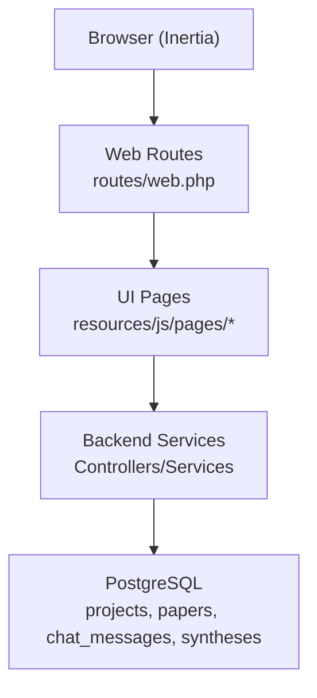
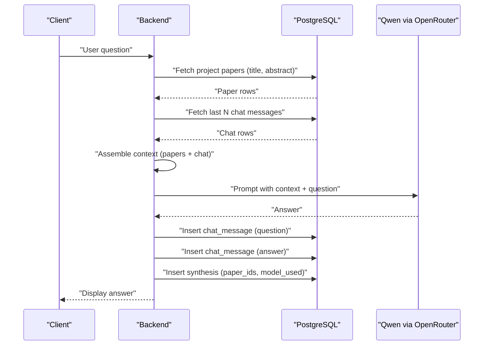
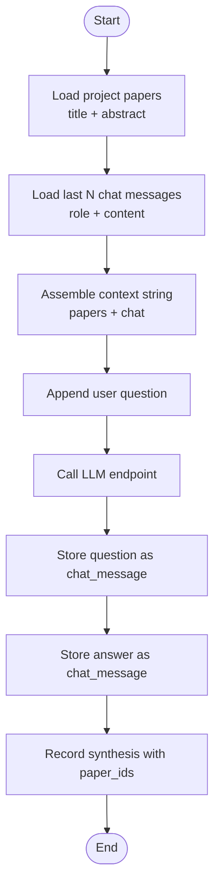
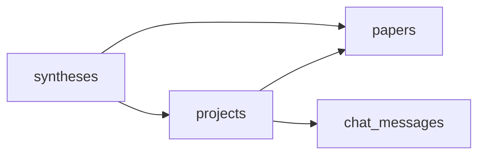

# Context Management & Assembly

<cite>
**Referenced Files in This Document**
- [HACKATHON_SPEC.md](file://hackathon/HACKATHON_SPEC.md)
- [FULL_SPEC.md](file://hackathon/FULL_SPEC.md)
- [web.php](file://routes/web.php)
- [architecture.md](file://.agents/skills/laravel-best-practices/rules/architecture.md)
- [architecture.md](file://.claude/skills/laravel-best-practices/rules/architecture.md)
</cite>

## Table of Contents
1. [Introduction](#introduction)
2. [Project Structure](#project-structure)
3. [Core Components](#core-components)
4. [Architecture Overview](#architecture-overview)
5. [Detailed Component Analysis](#detailed-component-analysis)
6. [Dependency Analysis](#dependency-analysis)
7. [Performance Considerations](#performance-considerations)
8. [Troubleshooting Guide](#troubleshooting-guide)
9. [Conclusion](#conclusion)

## Introduction
This document explains how ScholarGraph constructs the AI context for research synthesis and chat. The system combines project papers (title + abstract), chat history, and user questions to form a persistent, queryable context that survives session boundaries. The specification defines a minimal yet robust mechanism: on each turn, the backend retrieves all papers' titles and abstracts for the project and the last N chat messages, assembles them into a prompt, and stores the resulting synthesis with explicit provenance.

## Project Structure
The repository follows a Laravel application layout with Inertia frontend integration. The context management and assembly logic is primarily defined in the hackathon specifications, which outline the data model and retrieval strategy. Routes are minimal and delegate UI rendering to the frontend.

**Diagram sources**
- [web.php:1-12](file://routes/web.php#L1-L12)

**Section sources**
- [web.php:1-12](file://routes/web.php#L1-L12)

## Core Components
- Projects: logical containers grouping papers and chat interactions.
- Papers: documents associated with a project, storing title, abstract, and metadata.
- Chat messages: persisted conversation history enabling session persistence.
- Syntheses: logged answers with explicit provenance (paper IDs) for traceability.
- Customizable prompts: Global and per-project system prompts with negative prompts that are composed and appended to the context.

These components underpin the context assembly: every AI turn pulls the project's paper corpus (title + abstract) and recent chat messages, then stores the synthesis outcome with the exact papers used. The system prompt is resolved by composing global and project prompts, then appending negative prompts as a "Do NOT" section.

**Section sources**
- [HACKATHON_SPEC.md:39-75](file://hackathon/HACKATHON_SPEC.md#L39-L75)
- [FULL_SPEC.md:35-97](file://hackathon/FULL_SPEC.md#L35-L97)

## Architecture Overview
The context assembly architecture ensures persistence and reproducibility:
- Data retrieval: SQL queries fetch all papers for a project and the last N chat messages.
- Context assembly: the retrieved data is formatted into a unified context string.
- LLM invocation: the assembled context is sent to the LLM endpoint.
- Storage: the question-answer pair is stored as a chat message, and the synthesis is recorded with paper provenance.

**Diagram sources**
- [HACKATHON_SPEC.md:77-104](file://hackathon/HACKATHON_SPEC.md#L77-L104)
- [FULL_SPEC.md:141-148](file://hackathon/FULL_SPEC.md#L141-L148)

## Detailed Component Analysis

### Data Model and Retrieval
The minimal data model supports efficient retrieval:
- projects: identifies the user-scoped container.
- papers: per-project documents with title and abstract.
- chat_messages: ordered conversation history with role and content.
- syntheses: records answers with paper provenance and model metadata.

Retrieval strategy:
- Pull all papers for the project (title + abstract).
- Pull the last N chat messages (role + content).
- Assemble into a single context string for the LLM.

Optional enhancement:
- Keyword-relevance filtering via PostgreSQL full-text search on abstracts to cap context growth.

**Section sources**
- [HACKATHON_SPEC.md:39-75](file://hackathon/HACKATHON_SPEC.md#L39-L75)
- [HACKATHON_SPEC.md:83-90](file://hackathon/HACKATHON_SPEC.md#L83-L90)
- [FULL_SPEC.md:44-59](file://hackathon/FULL_SPEC.md#L44-L59)

### Context Assembly Algorithm
The assembly algorithm combines project papers and chat history into a cohesive prompt:
1. Retrieve project papers (title + abstract).
2. Retrieve recent chat messages (last N).
3. Concatenate into a single context string with clear delimiters.
4. Resolve the system prompt by composing global and project prompts, then appending negative prompts.
5. Prepend the user's new question to form the final prompt.
6. Send to the LLM endpoint.
7. Persist the question-answer pair as chat messages.
8. Record the synthesis with the set of papers used.

**System Prompt Resolution:**
- If `use_global_prompt` is enabled and a global system prompt exists, include it.
- If a project-specific system prompt exists, include it.
- Compose both prompts together (global first, then project).
- If neither exists, use the default response guidelines.
- Append negative prompts (global + project) as a "## Do NOT" section.

**Diagram sources**
- [HACKATHON_SPEC.md:95-104](file://hackathon/HACKATHON_SPEC.md#L95-L104)
- [FULL_SPEC.md:88-97](file://hackathon/FULL_SPEC.md#L88-L97)

**Section sources**
- [HACKATHON_SPEC.md:92-104](file://hackathon/HACKATHON_SPEC.md#L92-L104)
- [FULL_SPEC.md:141-148](file://hackathon/FULL_SPEC.md#L141-L148)

### Context Window Management
To prevent unbounded growth:
- Limit the number of recent chat messages (N) to control context length.
- Optionally apply keyword-relevance filtering on abstracts to reduce the number of papers included.
- For very large projects, consider iterative retrieval or chunking strategies.

**Section sources**
- [HACKATHON_SPEC.md:83-90](file://hackathon/HACKATHON_SPEC.md#L83-L90)

### Filtering Strategies for Large Contexts
- Full-text search: leverage PostgreSQL GIN indexes on title and body fields to quickly filter relevant papers.
- Keyword-based relevance: rank or filter by keywords present in the user's question.
- Hybrid approach: combine top-k papers by relevance with recent chat messages.

**Section sources**
- [FULL_SPEC.md:59](file://hackathon/FULL_SPEC.md#L59)
- [FULL_SPEC.md:78](file://hackathon/FULL_SPEC.md#L78)

### Optimization Techniques
- Minimize round-trips: batch queries for papers and chat messages in a single transaction.
- Indexing: ensure GIN indexes on searchable fields (titles, notes bodies).
- Caching: cache frequently accessed metadata for short-lived sessions.
- Parallelization: fetch papers and chat concurrently when safe and beneficial.
- Request-scoped context propagation: use a request-scoped context facility to avoid manual argument passing across layers.

**Section sources**
- [.agents/skills/laravel-best-practices/rules/architecture.md:146-158](file://.agents/skills/laravel-best-practices/rules/architecture.md#L146-L158)
- [.claude/skills/laravel-best-practices/rules/architecture.md:146-158](file://.claude/skills/laravel-best-practices/rules/architecture.md#L146-L158)

### Examples of Context Construction
- Scenario A: Fresh project with 3 papers and no prior chat.
  - Context: 3 × (title + abstract) + user question.
- Scenario B: Project with 5 papers and 10 prior chat messages.
  - Context: 5 × (title + abstract) + last 10 chat messages + user question.
- Scenario C: After page refresh (session boundary).
  - Context: Same as Scenario B, demonstrating persistence across sessions.

**Section sources**
- [HACKATHON_SPEC.md:14-17](file://hackathon/HACKATHON_SPEC.md#L14-L17)
- [HACKATHON_SPEC.md:77-80](file://hackathon/HACKATHON_SPEC.md#L77-L80)

## Dependency Analysis
The context assembly depends on:
- Data model: projects → papers, projects → chat_messages, syntheses → papers.
- Retrieval: SQL queries for papers and chat messages.
- Storage: inserts for chat_messages and syntheses.

**Diagram sources**
- [HACKATHON_SPEC.md:39-75](file://hackathon/HACKATHON_SPEC.md#L39-L75)
- [FULL_SPEC.md:35-97](file://hackathon/FULL_SPEC.md#L35-L97)

**Section sources**
- [HACKATHON_SPEC.md:39-75](file://hackathon/HACKATHON_SPEC.md#L39-L75)
- [FULL_SPEC.md:35-97](file://hackathon/FULL_SPEC.md#L35-L97)

## Performance Considerations
- Keep N small enough to fit within the LLM's context window.
- Use indexing and full-text search to limit the number of papers included.
- Batch and parallelize retrievals where appropriate.
- Monitor query latency and consider connection pooling and query caching for repeated reads.

## Troubleshooting Guide
- Empty context: verify project membership and ensure papers are associated with the project.
- Missing chat history: confirm chat messages are stored with the correct project ID and ordering.
- Excessive context: reduce N or enable keyword-relevance filtering.
- Provenance mismatch: ensure synthesis records include the exact paper IDs used.

**Section sources**
- [HACKATHON_SPEC.md:77-104](file://hackathon/HACKATHON_SPEC.md#L77-L104)
- [FULL_SPEC.md:88-97](file://hackathon/FULL_SPEC.md#L88-L97)

## Conclusion
ScholarGraph's context management is intentionally simple and robust: it retrieves all relevant papers and recent chat messages, assembles them into a single prompt, and stores the synthesis with explicit provenance. This design satisfies the hackathon track's requirement for persistent, queryable memory while remaining easy to implement and maintain.