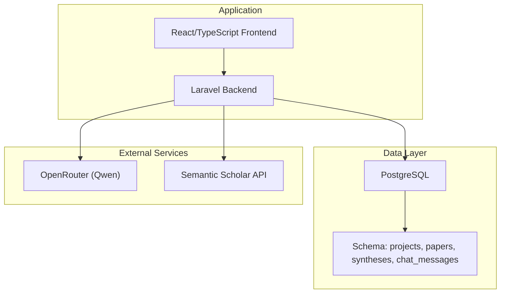
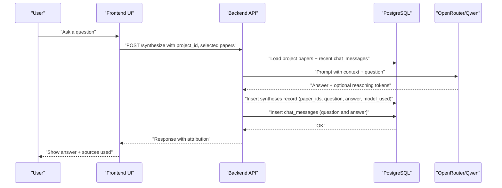
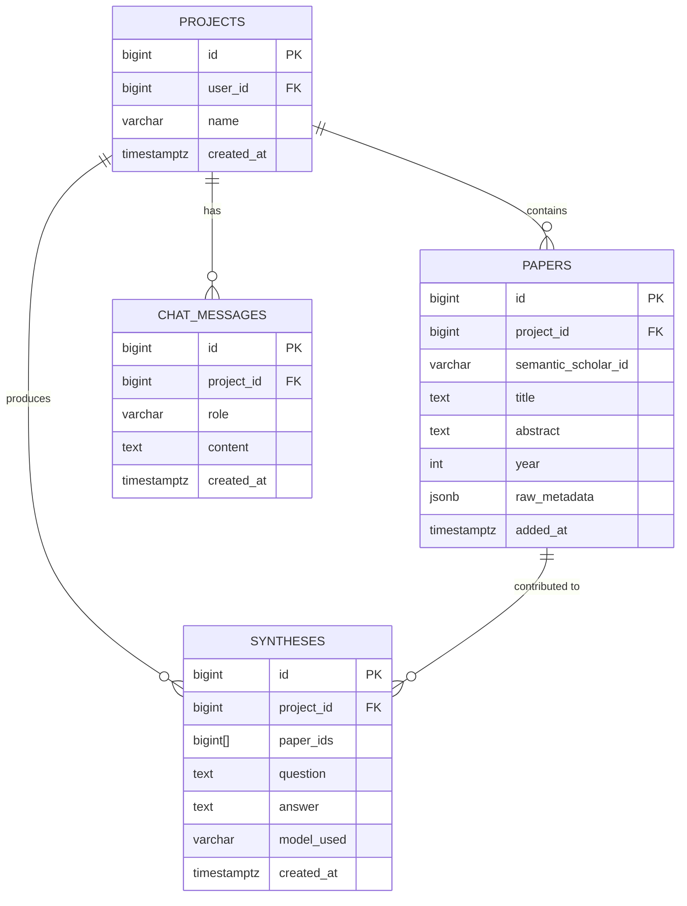
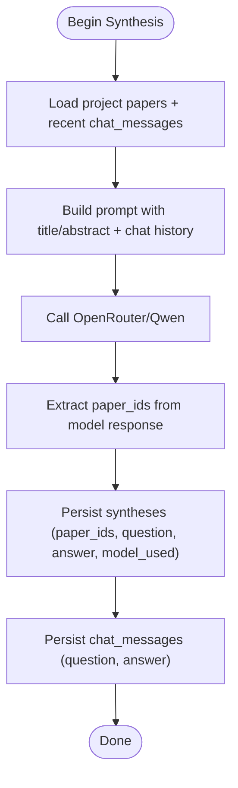
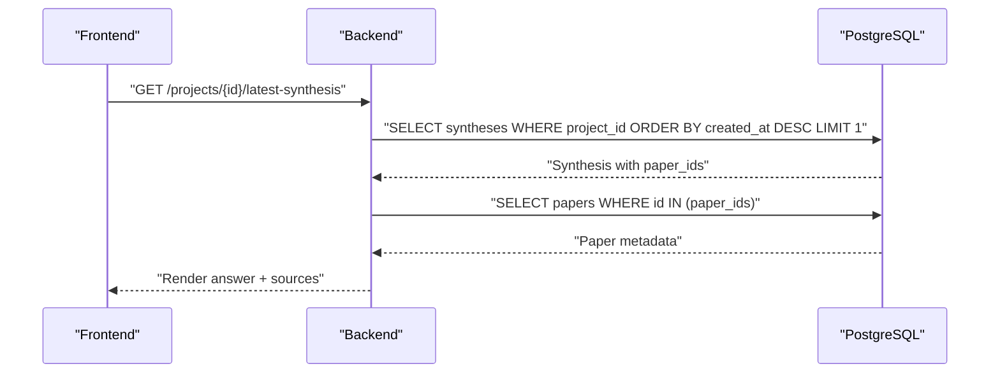
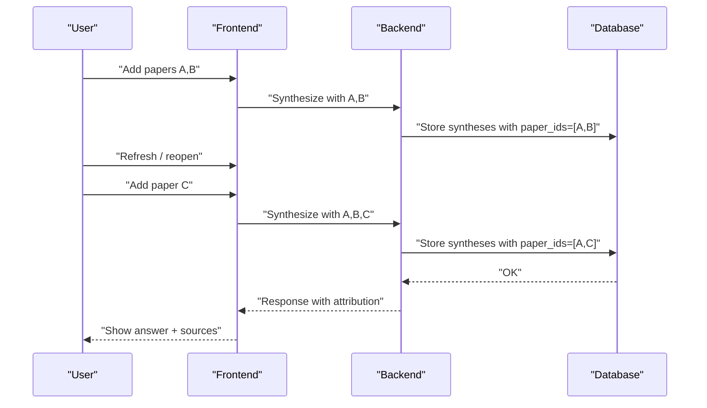
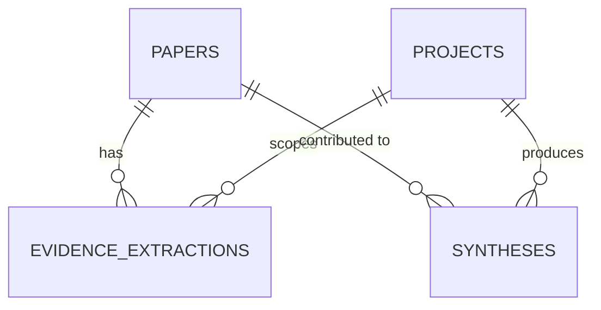
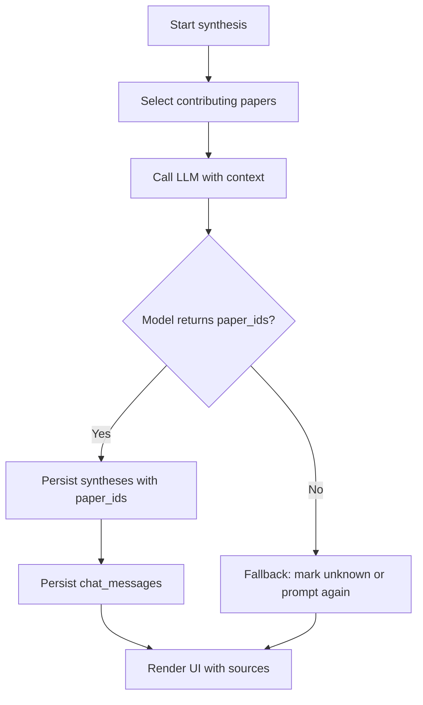
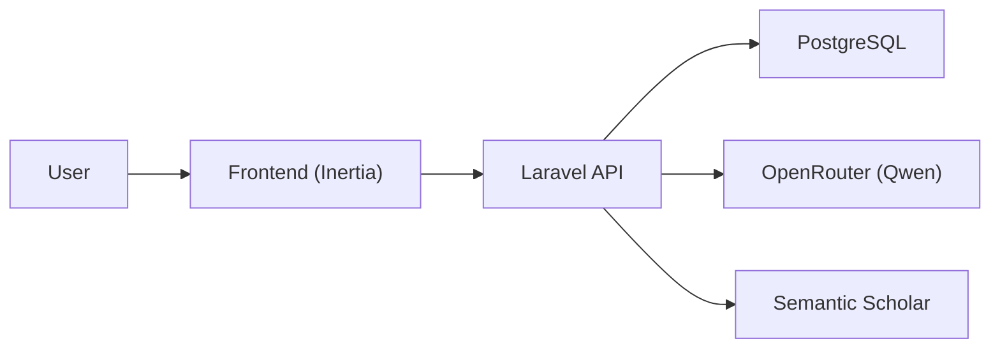

# Evidence Extraction & Attribution

<cite>
**Referenced Files in This Document**
- [HACKATHON_SPEC.md](file://hackathon/HACKATHON_SPEC.md)
- [FULL_SPEC.md](file://hackathon/FULL_SPEC.md)
- [composer.json](file://composer.json)
</cite>

## Table of Contents
1. [Introduction](#introduction)
2. [Project Structure](#project-structure)
3. [Core Components](#core-components)
4. [Architecture Overview](#architecture-overview)
5. [Detailed Component Analysis](#detailed-component-analysis)
6. [Dependency Analysis](#dependency-analysis)
7. [Performance Considerations](#performance-considerations)
8. [Troubleshooting Guide](#troubleshooting-guide)
9. [Conclusion](#conclusion)

## Introduction
This document explains the evidence extraction and attribution system designed to produce transparent AI responses grounded in specific papers. The core mechanism tracks which papers contribute to each answer through the paper_ids array in the syntheses table. It covers:
- How synthesis records capture evidence attribution
- The evidence linking mechanism and response storage with paper references
- UI integration patterns for displaying sources used
- Examples of end-to-end attribution workflows
- Data modeling for tracking evidence relationships
- Implementation patterns ensuring accurate source attribution across synthesis steps

The specification defines a minimal, persistent-memory-focused data model sufficient to demonstrate transparent synthesis and source attribution during a hackathon scope.

## Project Structure
The repository follows a Laravel application structure with frontend assets and a focused hackathon scope. The evidence extraction and attribution system is primarily defined by the PostgreSQL schema described in the hackathon specifications.

**Diagram sources**
- [HACKATHON_SPEC.md:39-75](file://hackathon/HACKATHON_SPEC.md#L39-L75)
- [composer.json:11-18](file://composer.json#L11-L18)

**Section sources**
- [HACKATHON_SPEC.md:1-137](file://hackathon/HACKATHON_SPEC.md#L1-L137)
- [composer.json:11-32](file://composer.json#L11-L32)

## Core Components
The evidence extraction and attribution system centers on four core entities that enable persistent, queryable memory and transparent synthesis:

- projects: Groups papers and synthesis records under a user-scoped container
- papers: Stores paper metadata and optionally full-text for synthesis
- syntheses: Captures answers, associated paper sets (paper_ids), and model provenance
- chat_messages: Provides persistent context by storing the project’s conversation history

Key attributes for attribution:
- syntheses.paper_ids: Array of paper identifiers used in a synthesis
- syntheses.question and syntheses.answer: Grounded response content
- syntheses.model_used: Identifies the model used for reproducibility
- chat_messages: Supplies conversational context for each turn

These tables are defined in the hackathon scope and provide the foundation for transparent AI responses.

**Section sources**
- [HACKATHON_SPEC.md:39-75](file://hackathon/HACKATHON_SPEC.md#L39-L75)

## Architecture Overview
The synthesis and attribution pipeline integrates external LLM inference with persistent storage to ensure every answer is traceable to specific papers and conversation turns.

**Diagram sources**
- [HACKATHON_SPEC.md:77-99](file://hackathon/HACKATHON_SPEC.md#L77-L99)
- [FULL_SPEC.md:88-97](file://hackathon/FULL_SPEC.md#L88-L97)

## Detailed Component Analysis

### Syntheses: Evidence Attribution Records
Syntheses store the answer, the set of contributing papers, and model metadata. The paper_ids array is the primary mechanism for attribution.

**Diagram sources**
- [HACKATHON_SPEC.md:39-75](file://hackathon/HACKATHON_SPEC.md#L39-L75)

Implementation highlights:
- paper_ids stores the concrete set of paper identifiers used in a synthesis
- question and answer are persisted alongside paper_ids for reproducible auditing
- model_used enables methodological transparency and cost tracking

**Section sources**
- [HACKATHON_SPEC.md:58-66](file://hackathon/HACKATHON_SPEC.md#L58-L66)
- [FULL_SPEC.md:88-97](file://hackathon/FULL_SPEC.md#L88-L97)

### Evidence Linking Mechanism
Evidence linking connects synthesis outputs to the papers that informed them. The linking occurs implicitly through the paper_ids array and explicitly through chat_messages that frame each synthesis within a conversation.

**Diagram sources**
- [HACKATHON_SPEC.md:77-99](file://hackathon/HACKATHON_SPEC.md#L77-L99)

**Section sources**
- [HACKATHON_SPEC.md:77-99](file://hackathon/HACKATHON_SPEC.md#L77-L99)

### Response Storage with Paper References
Responses are stored in two complementary places:
- syntheses: Contains the answer, the contributing paper set, and model metadata
- chat_messages: Stores the conversational context enabling persistent memory across sessions

This separation ensures:
- Transparent attribution via paper_ids
- Persistent context retrieval for subsequent turns
- Reproducible synthesis with model provenance

**Section sources**
- [HACKATHON_SPEC.md:68-74](file://hackathon/HACKATHON_SPEC.md#L68-L74)
- [HACKATHON_SPEC.md:58-66](file://hackathon/HACKATHON_SPEC.md#L58-L66)

### UI Integration for Showing Sources Used
The UI surfaces attribution by rendering the list of papers identified in syntheses.paper_ids. The recommended approach:
- Fetch the latest synthesis for a project
- Resolve paper metadata (title, authors, year) for each paper_id
- Render a “Sources used” panel below the answer

**Diagram sources**
- [HACKATHON_SPEC.md:58-66](file://hackathon/HACKATHON_SPEC.md#L58-L66)

**Section sources**
- [HACKATHON_SPEC.md:58-66](file://hackathon/HACKATHON_SPEC.md#L58-L66)

### Examples of Evidence Attribution Workflows
End-to-end example: Cross-session synthesis with mixed prior/new papers
- Session 1: Add papers A and B; ask a question; observe synthesis with paper_ids = [A,B]
- Session 2: Refresh page; add paper C; ask a follow-up question that depends on A and C
- Result: Synthesis with paper_ids = [A,C], and chat_messages preserves the conversational context

**Diagram sources**
- [HACKATHON_SPEC.md:14-17](file://hackathon/HACKATHON_SPEC.md#L14-L17)
- [HACKATHON_SPEC.md:77-81](file://hackathon/HACKATHON_SPEC.md#L77-L81)

**Section sources**
- [HACKATHON_SPEC.md:14-17](file://hackathon/HACKATHON_SPEC.md#L14-L17)
- [HACKATHON_SPEC.md:77-81](file://hackathon/HACKATHON_SPEC.md#L77-L81)

### Data Modeling for Tracking Evidence Relationships
The minimal schema supports robust attribution:
- projects: Ownership and scoping
- papers: Metadata and optional full-text
- syntheses: Attribution (paper_ids), question, answer, model_used
- chat_messages: Persistent context

Optional extension (from the full spec): evidence_extractions for systematic review
- evidence_extractions: Per-paper, per-field extractions with confidence flags
- Useful for building structured matrices and supporting synthesis claims

**Diagram sources**
- [FULL_SPEC.md:99-107](file://hackathon/FULL_SPEC.md#L99-L107)
- [FULL_SPEC.md:88-97](file://hackathon/FULL_SPEC.md#L88-L97)

**Section sources**
- [FULL_SPEC.md:99-107](file://hackathon/FULL_SPEC.md#L99-L107)
- [FULL_SPEC.md:88-97](file://hackathon/FULL_SPEC.md#L88-L97)

### Implementation Patterns for Accurate Source Attribution
To maintain accurate attribution throughout synthesis:
- Capture paper_ids during synthesis: Extract the set of paper identifiers used to form the answer
- Persist both question and answer: Enable reproducibility and auditability
- Record model_used: Support methodological transparency and cost tracking
- Use chat_messages for context: Ensure continuity across sessions without losing attribution
- Surface attribution in UI: Render paper metadata for each paper_id in paper_ids

**Diagram sources**
- [HACKATHON_SPEC.md:96-99](file://hackathon/HACKATHON_SPEC.md#L96-L99)

**Section sources**
- [HACKATHON_SPEC.md:96-99](file://hackathon/HACKATHON_SPEC.md#L96-L99)

## Dependency Analysis
The system relies on external services and internal persistence. Composer dependencies indicate the Laravel stack and Inertia for frontend integration.

**Diagram sources**
- [composer.json:11-18](file://composer.json#L11-L18)
- [HACKATHON_SPEC.md:96-104](file://hackathon/HACKATHON_SPEC.md#L96-L104)

**Section sources**
- [composer.json:11-18](file://composer.json#L11-L18)
- [HACKATHON_SPEC.md:96-104](file://hackathon/HACKATHON_SPEC.md#L96-L104)

## Performance Considerations
- Retrieval simplicity: For a hackathon, avoid vector stores; pull project papers (title + abstract) and recent chat_messages into prompts
- Optional relevance filtering: Consider Postgres full-text search on abstracts to cap context growth
- Model selection: Use a single mid-size Qwen model for synthesis to reduce complexity and cost
- Cost awareness: Cross-paper synthesis is the most expensive; surface warnings for large paper sets

**Section sources**
- [HACKATHON_SPEC.md:83-91](file://hackathon/HACKATHON_SPEC.md#L83-L91)
- [HACKATHON_SPEC.md:101-104](file://hackathon/HACKATHON_SPEC.md#L101-L104)

## Troubleshooting Guide
Common issues and remedies:
- Missing paper_ids in synthesis: Ensure the model response includes explicit references to paper identifiers; if absent, prompt the model to enumerate contributing papers
- Stale context after refresh: Verify chat_messages are retrieved per turn; the spec emphasizes fresh retrieval from Postgres each turn
- Inconsistent attribution across sessions: Confirm paper_ids are persisted with each synthesis and that UI resolves paper metadata for each identifier
- Confusion between minimal and full specs: The hackathon scope uses a minimal schema; the full spec adds systematic review tables for deeper analysis

**Section sources**
- [HACKATHON_SPEC.md:77-81](file://hackathon/HACKATHON_SPEC.md#L77-L81)
- [HACKATHON_SPEC.md:58-66](file://hackathon/HACKATHON_SPEC.md#L58-L66)

## Conclusion
The evidence extraction and attribution system achieves transparent AI responses by anchoring each synthesis to specific papers via the paper_ids array in the syntheses table. Together with persistent chat_messages and a straightforward retrieval strategy, it demonstrates persistent, queryable memory and clear source attribution—essential for reproducible research assistance. The minimal schema suffices for a hackathon demonstration, while the full spec outlines extensions for systematic review and deeper evidence modeling.