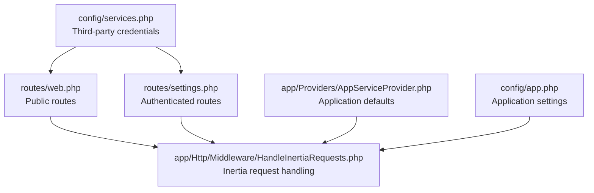
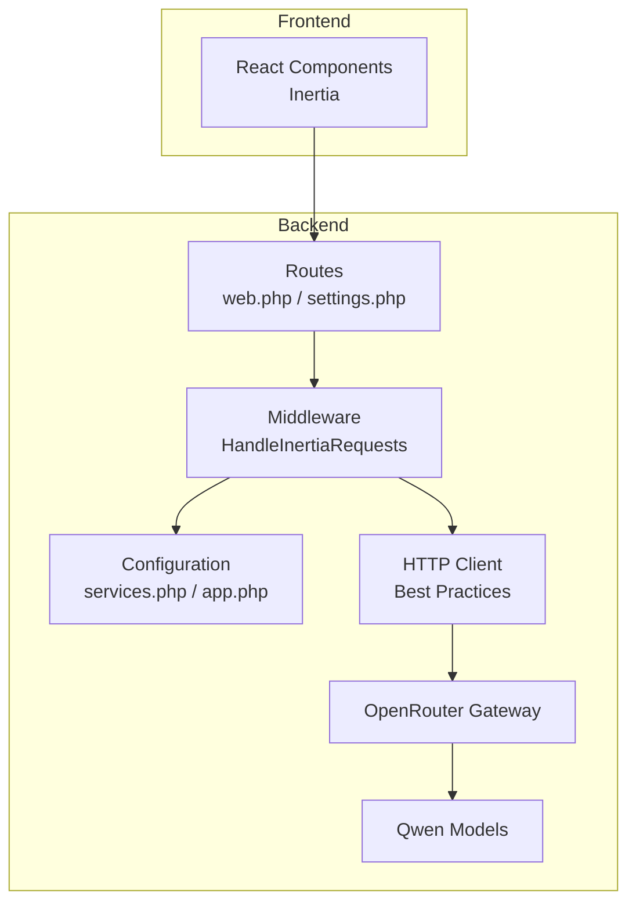
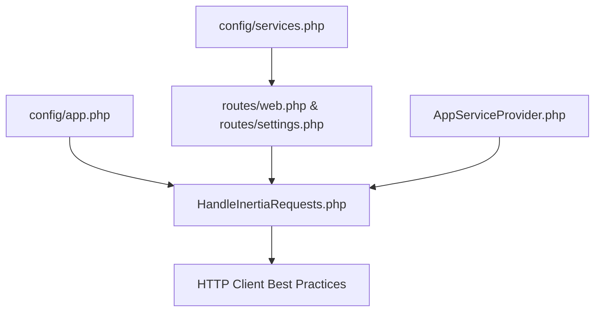

# OpenRouter Integration

<cite>
**Referenced Files in This Document**
- [services.php](file://config/services.php)
- [app.php](file://config/app.php)
- [web.php](file://routes/web.php)
- [settings.php](file://routes/settings.php)
- [AppServiceProvider.php](file://app/Providers/AppServiceProvider.php)
- [HandleInertiaRequests.php](file://app/Http/Middleware/HandleInertiaRequests.php)
- [http-client.md](file://.claude/skills/laravel-best-practices/rules/http-client.md)
- [FULL_SPEC.md](file://hackathon/FULL_SPEC.md)
- [HACKATHON_SPEC.md](file://hackathon/HACKATHON_SPEC.md)
</cite>

## Table of Contents
1. [Introduction](#introduction)
2. [Project Structure](#project-structure)
3. [Core Components](#core-components)
4. [Architecture Overview](#architecture-overview)
5. [Detailed Component Analysis](#detailed-component-analysis)
6. [Dependency Analysis](#dependency-analysis)
7. [Performance Considerations](#performance-considerations)
8. [Troubleshooting Guide](#troubleshooting-guide)
9. [Conclusion](#conclusion)

## Introduction
This document explains how OpenRouter integrates with Qwen models in the ScholarGraph application. The system uses OpenRouter as a unified LLM gateway to call Qwen variants, enabling flexible model selection and easy fallbacks. The documentation covers service configuration, API endpoint setup, model selection patterns, authentication token handling, model availability management, request/response examples, error handling strategies, rate limiting considerations, and pricing guidance tailored for hackathon deployment.

## Project Structure
The integration spans configuration, routing, middleware, and best practices for HTTP client usage. Key areas:
- Configuration: Third-party service credentials and application settings
- Routing: Public and authenticated endpoints
- Middleware: Inertia request handling and environment configuration
- Best practices: HTTP client timeouts, retries, and error handling

**Diagram sources**
- [services.php:1-39](file://config/services.php#L1-L39)
- [web.php:1-12](file://routes/web.php#L1-L12)
- [settings.php:1-35](file://routes/settings.php#L1-L35)
- [HandleInertiaRequests.php:39](file://app/Http/Middleware/HandleInertiaRequests.php#L39)
- [AppServiceProvider.php:24-49](file://app/Providers/AppServiceProvider.php#L24-L49)
- [app.php:15-127](file://config/app.php#L15-L127)

**Section sources**
- [services.php:1-39](file://config/services.php#L1-L39)
- [web.php:1-12](file://routes/web.php#L1-L12)
- [settings.php:1-35](file://routes/settings.php#L1-L35)
- [HandleInertiaRequests.php:39](file://app/Http/Middleware/HandleInertiaRequests.php#L39)
- [AppServiceProvider.php:24-49](file://app/Providers/AppServiceProvider.php#L24-L49)
- [app.php:15-127](file://config/app.php#L15-L127)

## Core Components
- OpenRouter/Qwen configuration: Centralized in configuration files and environment variables
- API endpoints: Defined under public and authenticated route groups
- Model selection: Determined at runtime via OpenRouter model slugs
- Authentication tokens: Managed through the HTTP client and configuration
- Availability and pricing: Governed by OpenRouter's current offerings and budget constraints

**Section sources**
- [services.php:1-39](file://config/services.php#L1-L39)
- [web.php:1-12](file://routes/web.php#L1-L12)
- [settings.php:1-35](file://routes/settings.php#L1-L35)
- [FULL_SPEC.md:174-185](file://hackathon/FULL_SPEC.md#L174-L185)
- [HACKATHON_SPEC.md:92-104](file://hackathon/HACKATHON_SPEC.md#L92-L104)

## Architecture Overview
The application uses OpenRouter as a proxy to Qwen models. Requests flow from frontend components through Inertia to backend routes, which orchestrate OpenRouter calls. Configuration and environment variables supply credentials and application settings. The HTTP client follows best practices for timeouts, retries, and error handling.

**Diagram sources**
- [web.php:1-12](file://routes/web.php#L1-L12)
- [settings.php:1-35](file://routes/settings.php#L1-L35)
- [HandleInertiaRequests.php:39](file://app/Http/Middleware/HandleInertiaRequests.php#L39)
- [services.php:1-39](file://config/services.php#L1-L39)
- [app.php:15-127](file://config/app.php#L15-L127)
- [http-client.md:1-69](file://.claude/skills/laravel-best-practices/rules/http-client.md#L1-L69)

## Detailed Component Analysis

### Service Configuration for OpenRouter/Qwen
- Third-party credentials: The configuration file supports adding OpenRouter credentials alongside other services. While OpenRouter credentials are not explicitly present in the current file, the structure enables centralized credential management.
- Application settings: The application name and environment influence how routes and middleware behave, indirectly supporting OpenRouter integration.

Recommendations:
- Add OpenRouter credentials to the configuration file using environment variables
- Keep credentials out of version control by relying on environment variables

**Section sources**
- [services.php:1-39](file://config/services.php#L1-L39)
- [app.php:15-127](file://config/app.php#L15-L127)

### API Endpoint Setup
- Public routes: Basic landing and dashboard routes are defined for authenticated users
- Settings routes: Authentication and verification middleware protect sensitive settings endpoints
- Inertia integration: Middleware ensures proper request handling for SPA-like interactions

Endpoints overview:
- Home: Unauthenticated landing route
- Dashboard: Authenticated route for logged-in users
- Settings: Profile and security endpoints under authentication and verification middleware

**Section sources**
- [web.php:1-12](file://routes/web.php#L1-L12)
- [settings.php:1-35](file://routes/settings.php#L1-L35)
- [HandleInertiaRequests.php:39](file://app/Http/Middleware/HandleInertiaRequests.php#L39)

### Model Selection Process
- Runtime selection: Model slugs are fetched from OpenRouter at build/runtime to reflect current availability
- Task-based assignment: Different Qwen tiers are selected based on task requirements (smaller for bulk tasks, larger for synthesis)
- Hackathon simplification: A single mid-size Qwen model is chosen for demonstration, avoiding complex routing logic

Model selection criteria:
- Bulk metadata tagging and quick summaries: smaller/faster Qwen
- Single-paper chat: mid-size Qwen
- Cross-paper synthesis: largest available Qwen
- Evidence extraction: mid-size Qwen with structured prompting
- Writing assistance grounding check: mid-size Qwen

**Section sources**
- [FULL_SPEC.md:174-185](file://hackathon/FULL_SPEC.md#L174-L185)
- [HACKATHON_SPEC.md:92-104](file://hackathon/HACKATHON_SPEC.md#L92-L104)

### Integration Patterns for OpenRouter Calls
- HTTP client best practices: Explicit timeouts, connect timeouts, and retry with backoff for transient failures
- Token handling: Use HTTP client macros or configuration to attach authentication tokens
- Error handling: Always check status codes and handle error responses explicitly

Integration flow:
1. Build request payload with context (papers, chat history)
2. Configure HTTP client with timeouts and retries
3. Attach authentication token from configuration
4. Send request to OpenRouter endpoint
5. Parse response and update UI state

**Section sources**
- [http-client.md:1-69](file://.claude/skills/laravel-best-practices/rules/http-client.md#L1-L69)

### Authentication Tokens Management
- Token placement: Place tokens in configuration and reference them via the HTTP client
- Token injection: Use HTTP client macros or middleware to inject tokens automatically
- Security: Never log tokens; avoid exposing them in client-side code

**Section sources**
- [services.php:1-39](file://config/services.php#L1-L39)
- [http-client.md:19-30](file://.claude/skills/laravel-best-practices/rules/http-client.md#L19-L30)

### Model Availability and Pricing for Hackathon
- Availability-driven selection: Fetch model slugs dynamically from OpenRouter to align with current availability
- Pricing considerations: Cross-paper synthesis using the largest Qwen tier is the most expensive; choose models accordingly for budget constraints
- Hackathon guidance: Select a single mid-size Qwen model for simplicity and cost predictability

**Section sources**
- [FULL_SPEC.md:204](file://hackathon/FULL_SPEC.md#L204)
- [HACKATHON_SPEC.md:101-104](file://hackathon/HACKATHON_SPEC.md#L101-L104)

### API Request/Response Examples
Example request flow:
- Payload composition: Include project papers (title + abstract), chat history, and new question
- Endpoint: OpenRouter chat/completion endpoint
- Response: Parsed answer with optional attribution to specific papers

Example error handling:
- Network failures: Retry with exponential backoff
- Rate limiting: Respect server response headers and implement client-side throttling
- Validation: Check HTTP status codes and parse error bodies

**Section sources**
- [FULL_SPEC.md:94-104](file://hackathon/FULL_SPEC.md#L94-L104)
- [http-client.md:32-69](file://.claude/skills/laravel-best-practices/rules/http-client.md#L32-L69)

### Rate Limiting Considerations
- Client-side throttling: Apply rate limits to reduce request frequency
- Server-side handling: Honor OpenRouter rate limit headers and implement backoff
- User feedback: Communicate rate limit status to users and queue requests if necessary

**Section sources**
- [settings.php:23](file://routes/settings.php#L23)

## Dependency Analysis
The integration depends on configuration, routing, middleware, and HTTP client best practices. Cohesion is strong around OpenRouter/Qwen usage, while coupling is minimized through configuration-driven model selection and centralized credential management.

**Diagram sources**
- [services.php:1-39](file://config/services.php#L1-L39)
- [app.php:15-127](file://config/app.php#L15-L127)
- [web.php:1-12](file://routes/web.php#L1-L12)
- [settings.php:1-35](file://routes/settings.php#L1-L35)
- [HandleInertiaRequests.php:39](file://app/Http/Middleware/HandleInertiaRequests.php#L39)
- [AppServiceProvider.php:24-49](file://app/Providers/AppServiceProvider.php#L24-L49)
- [http-client.md:1-69](file://.claude/skills/laravel-best-practices/rules/http-client.md#L1-L69)

**Section sources**
- [services.php:1-39](file://config/services.php#L1-L39)
- [app.php:15-127](file://config/app.php#L15-L127)
- [web.php:1-12](file://routes/web.php#L1-L12)
- [settings.php:1-35](file://routes/settings.php#L1-L35)
- [HandleInertiaRequests.php:39](file://app/Http/Middleware/HandleInertiaRequests.php#L39)
- [AppServiceProvider.php:24-49](file://app/Providers/AppServiceProvider.php#L24-L49)
- [http-client.md:1-69](file://.claude/skills/laravel-best-practices/rules/http-client.md#L1-L69)

## Performance Considerations
- Timeouts: Set explicit connect and request timeouts to prevent slow operations
- Retries: Use backoff strategies for transient failures
- Caching: Cache model availability and recent responses where appropriate
- Concurrency: Limit concurrent OpenRouter requests to respect rate limits

[No sources needed since this section provides general guidance]

## Troubleshooting Guide
Common issues and resolutions:
- Authentication failures: Verify token configuration and ensure tokens are not exposed
- Network errors: Implement retry with backoff and increase timeouts for unreliable connections
- Rate limiting: Reduce request frequency and implement client-side throttling
- Model unavailability: Dynamically fetch model slugs and gracefully fall back to alternatives

**Section sources**
- [http-client.md:32-69](file://.claude/skills/laravel-best-practices/rules/http-client.md#L32-L69)
- [settings.php:23](file://routes/settings.php#L23)

## Conclusion
OpenRouter serves as a flexible gateway to Qwen models, enabling dynamic model selection and simplified fallbacks. By centralizing configuration, following HTTP client best practices, and applying rate limiting and error handling strategies, the system remains robust and maintainable. For hackathons, selecting a single mid-size Qwen model streamlines development while keeping costs predictable.