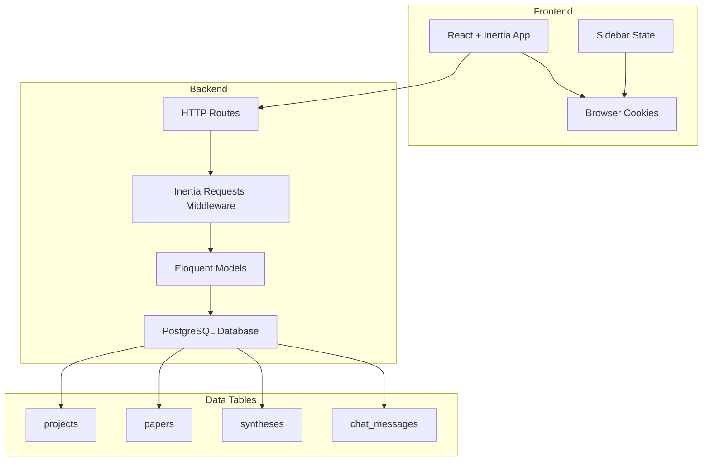
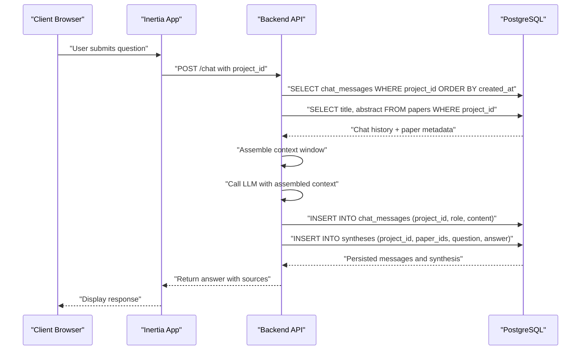
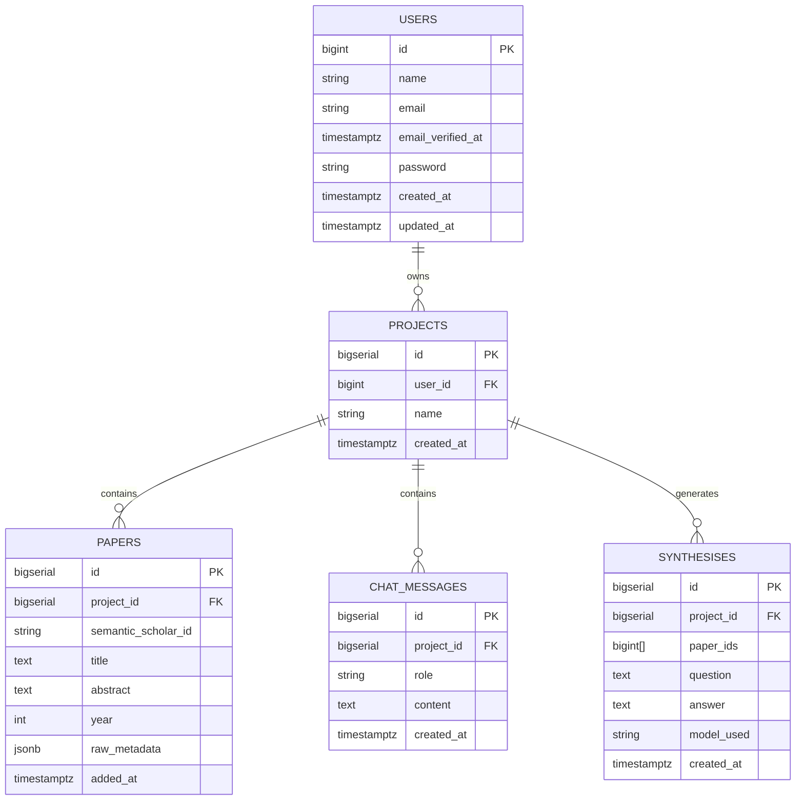
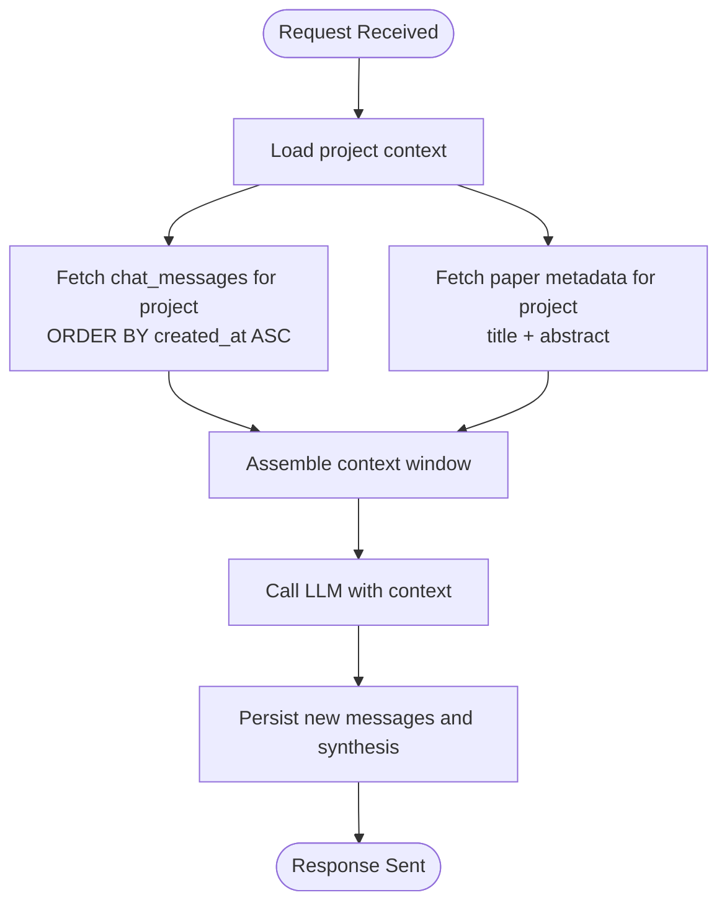
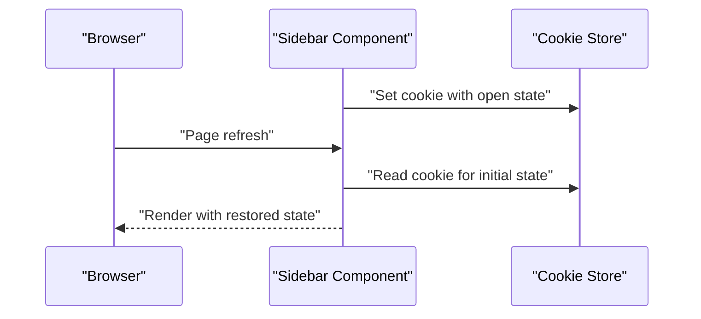
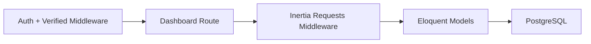
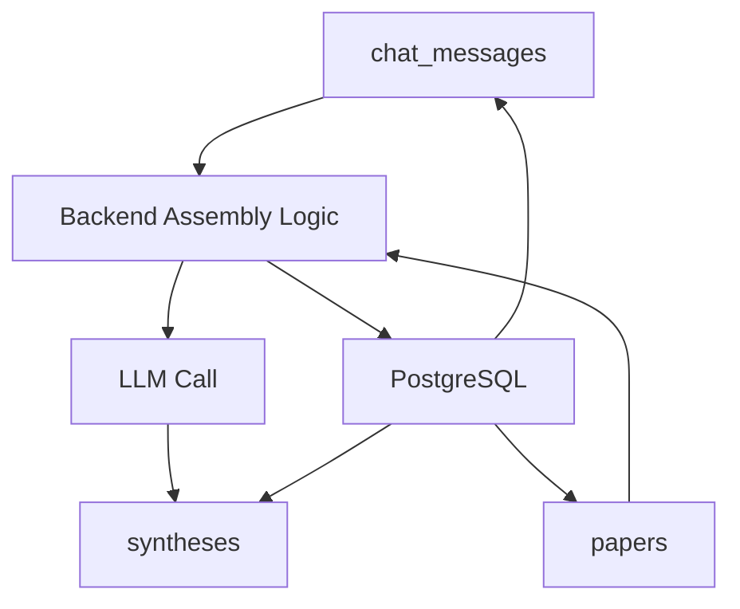

# Persistent Memory System

<cite>
**Referenced Files in This Document**
- [HACKATHON_SPEC.md](file://hackathon/HACKATHON_SPEC.md)
- [FULL_SPEC.md](file://hackathon/FULL_SPEC.md)
- [web.php](file://routes/web.php)
- [settings.php](file://routes/settings.php)
- [User.php](file://app/Models/User.php)
- [HandleInertiaRequests.php](file://app/Http/Middleware/HandleInertiaRequests.php)
- [sidebar.tsx](file://resources/js/components/ui/sidebar.tsx)
</cite>

## Table of Contents
1. [Introduction](#introduction)
2. [Project Structure](#project-structure)
3. [Core Components](#core-components)
4. [Architecture Overview](#architecture-overview)
5. [Detailed Component Analysis](#detailed-component-analysis)
6. [Dependency Analysis](#dependency-analysis)
7. [Performance Considerations](#performance-considerations)
8. [Troubleshooting Guide](#troubleshooting-guide)
9. [Conclusion](#conclusion)

## Introduction
This document explains the persistent memory system that enables cross-session recall in the research assistant. The system centers on storing conversation history in a dedicated table and reassembling project context on each request so that the AI can recall information from previous sessions without losing context after browser refreshes or session boundaries. The design relies on a simple, robust approach: on every turn, the backend pulls the project's full chat history and relevant paper content from the database to form the agent's context window.

Key goals:
- Maintain conversation history across sessions using a durable chat_messages table
- Reassemble project context on each request by combining chat history and paper metadata
- Ensure memory persistence through database-backed state, not in-memory server state
- Demonstrate cross-session recall with a clear workflow that spans multiple sessions

## Project Structure
The persistent memory system is part of a larger research assistant application with the following relevant structure:
- Routes define entry points for authenticated dashboards and settings
- Middleware integrates with the frontend framework to maintain session state
- The frontend stores UI state (like sidebar visibility) in cookies for continuity across refreshes
- The hackathon specification defines the minimal data model and retrieval strategy

**Diagram sources**
- [web.php:1-12](file://routes/web.php#L1-L12)
- [settings.php:1-35](file://routes/settings.php#L1-L35)
- [HandleInertiaRequests.php](file://app/Http/Middleware/HandleInertiaRequests.php)
- [sidebar.tsx:51-92](file://resources/js/components/ui/sidebar.tsx#L51-L92)

**Section sources**
- [web.php:1-12](file://routes/web.php#L1-L12)
- [settings.php:1-35](file://routes/settings.php#L1-L35)
- [sidebar.tsx:51-92](file://resources/js/components/ui/sidebar.tsx#L51-L92)

## Core Components
The persistent memory system is built around four core tables defined in the hackathon specification. These tables collectively enable cross-session recall by anchoring the agent's context to durable, queryable data:

- projects: Associates projects with users and timestamps
- papers: Stores paper metadata and optional full-text for synthesis
- syntheses: Records answers and which papers were used to derive them
- chat_messages: Stores conversation turns with roles and timestamps

The retrieval strategy is intentionally simple for the hackathon scope:
- Pull every paper's title and abstract for the project
- Include the last N chat turns
- Send this combined context to the LLM to produce grounded answers

This approach avoids building a vector store and instead leverages straightforward SQL queries to assemble context on each request.

**Section sources**
- [HACKATHON_SPEC.md:39-75](file://hackathon/HACKATHON_SPEC.md#L39-L75)
- [HACKATHON_SPEC.md:83-91](file://hackathon/HACKATHON_SPEC.md#L83-L91)

## Architecture Overview
The persistent memory architecture ensures that every request rebuilds the agent's context from the database, guaranteeing continuity across sessions:

**Diagram sources**
- [HACKATHON_SPEC.md:68-75](file://hackathon/HACKATHON_SPEC.md#L68-L75)
- [HACKATHON_SPEC.md:92-104](file://hackathon/HACKATHON_SPEC.md#L92-L104)

## Detailed Component Analysis

### Database Design and Relationships
The minimal data model supports persistent, queryable memory with clear relationships:

**Diagram sources**
- [HACKATHON_SPEC.md:39-75](file://hackathon/HACKATHON_SPEC.md#L39-L75)
- [FULL_SPEC.md:32-131](file://hackathon/FULL_SPEC.md#L32-L131)

### Chat Message Persistence and Session Continuity
The chat_messages table is central to cross-session recall. Each message includes:
- project_id: ties the message to a specific project
- role: distinguishes user and assistant messages
- content: the textual exchange
- created_at: chronological ordering for context assembly

On each request, the backend retrieves all chat_messages for the project ordered by timestamp, ensuring the agent always sees the complete conversation history regardless of session boundaries.

**Diagram sources**
- [HACKATHON_SPEC.md:68-75](file://hackathon/HACKATHON_SPEC.md#L68-L75)
- [HACKATHON_SPEC.md:77-81](file://hackathon/HACKATHON_SPEC.md#L77-L81)

**Section sources**
- [HACKATHON_SPEC.md:68-75](file://hackathon/HACKATHON_SPEC.md#L68-L75)

### UI State Persistence Across Refreshes
While not part of the core memory system, the frontend stores UI state (such as sidebar visibility) in cookies to maintain a seamless user experience across refreshes. This complements the backend's persistent memory by keeping the interface predictable.

**Diagram sources**
- [sidebar.tsx:83-84](file://resources/js/components/ui/sidebar.tsx#L83-L84)

**Section sources**
- [sidebar.tsx:51-92](file://resources/js/components/ui/sidebar.tsx#L51-L92)

### Authentication and Request Flow Integration
Authenticated routes and middleware integrate with the frontend framework to ensure requests carry the proper session context. The dashboard route requires authentication and verified emails, aligning with the persistent memory feature being available only to authenticated users.

**Diagram sources**
- [web.php:7-9](file://routes/web.php#L7-L9)
- [HandleInertiaRequests.php](file://app/Http/Middleware/HandleInertiaRequests.php)

**Section sources**
- [web.php:7-9](file://routes/web.php#L7-L9)
- [settings.php:15-27](file://routes/settings.php#L15-L27)
- [HandleInertiaRequests.php](file://app/Http/Middleware/HandleInertiaRequests.php)

## Dependency Analysis
The persistent memory system depends on:
- Database tables for durable storage of conversations and project context
- Backend logic to assemble context from chat_messages and papers
- Frontend integration to present results and maintain UI continuity
- Authentication and middleware to secure access to memory-enabled features

**Diagram sources**
- [HACKATHON_SPEC.md:68-75](file://hackathon/HACKATHON_SPEC.md#L68-L75)
- [HACKATHON_SPEC.md:58-66](file://hackathon/HACKATHON_SPEC.md#L58-L66)

**Section sources**
- [HACKATHON_SPEC.md:39-75](file://hackathon/HACKATHON_SPEC.md#L39-L75)

## Performance Considerations
For long research sessions with many papers and messages, consider these optimization strategies:
- Limit the number of recent chat messages included in the context window to control token usage
- Use database indexes on frequently queried columns (e.g., project_id, created_at) to speed up context retrieval
- Apply simple keyword filtering on paper abstracts to reduce context size when appropriate
- Batch writes for chat_messages and syntheses to minimize round trips
- Cache infrequent metadata (e.g., user preferences) at the application level to reduce database load

These measures help maintain responsiveness while preserving the system's persistent, queryable nature.

## Troubleshooting Guide
Common issues and resolutions:
- Messages not appearing across sessions: Verify that project_id is correctly passed with each request and that chat_messages are inserted with the correct role and content
- Excessive context size causing token limit errors: Reduce the number of recent messages or apply keyword filtering on paper abstracts
- Missing paper context: Ensure papers are associated with the project and that the query fetches title and abstract fields
- Authentication barriers: Confirm that the dashboard route requires authentication and verified emails, and that middleware is properly configured

**Section sources**
- [web.php:7-9](file://routes/web.php#L7-L9)
- [settings.php:15-27](file://routes/settings.php#L15-L27)
- [HACKATHON_SPEC.md:83-91](file://hackathon/HACKATHON_SPEC.md#L83-L91)

## Conclusion
The persistent memory system achieves cross-session recall by anchoring the agent's context to durable database tables. Every request reconstructs the context from chat_messages and paper metadata, ensuring continuity across browser refreshes and session boundaries. This design satisfies the hackathon track's core requirement: a visible demonstration that the agent remembers and synthesizes across sessions, with queryable provenance recorded in syntheses for transparency.