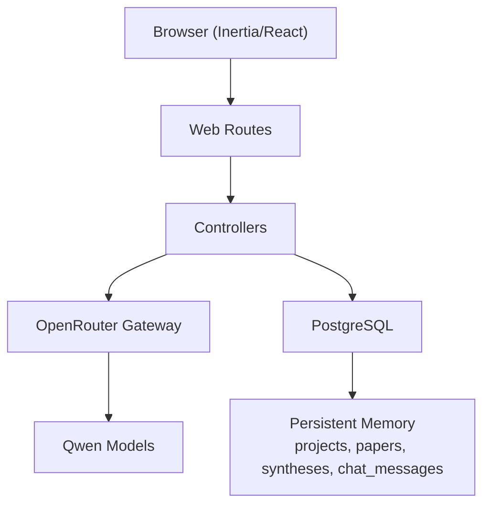
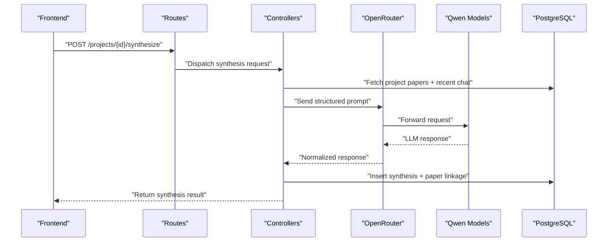
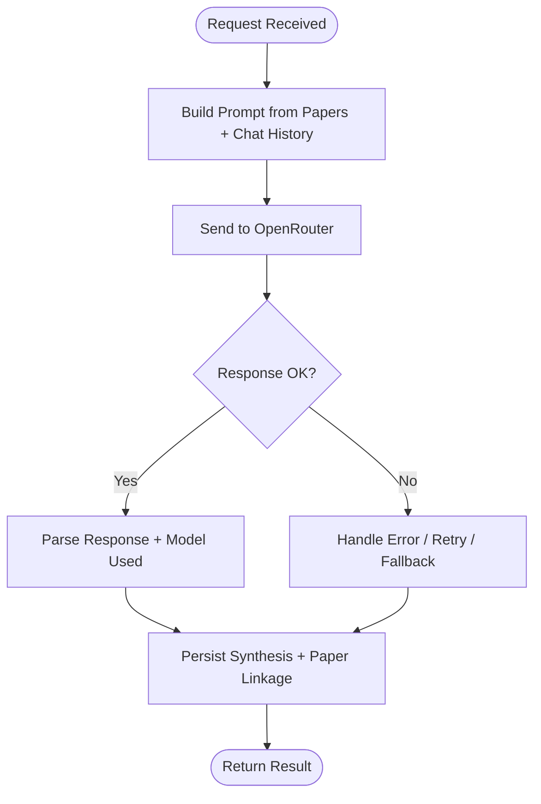
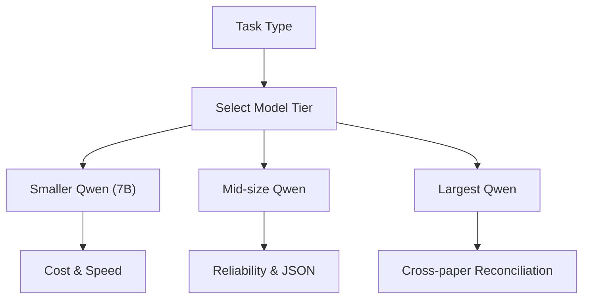
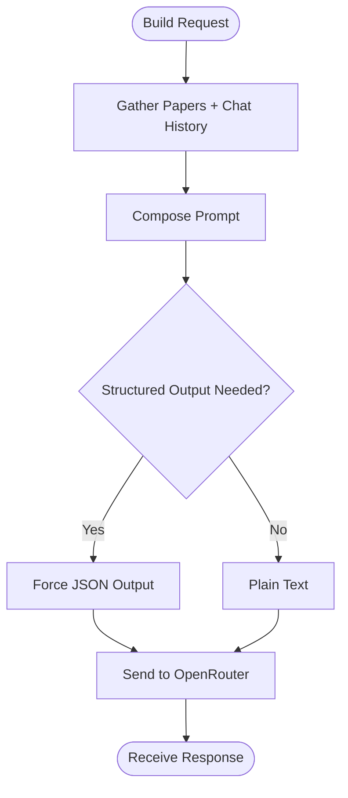
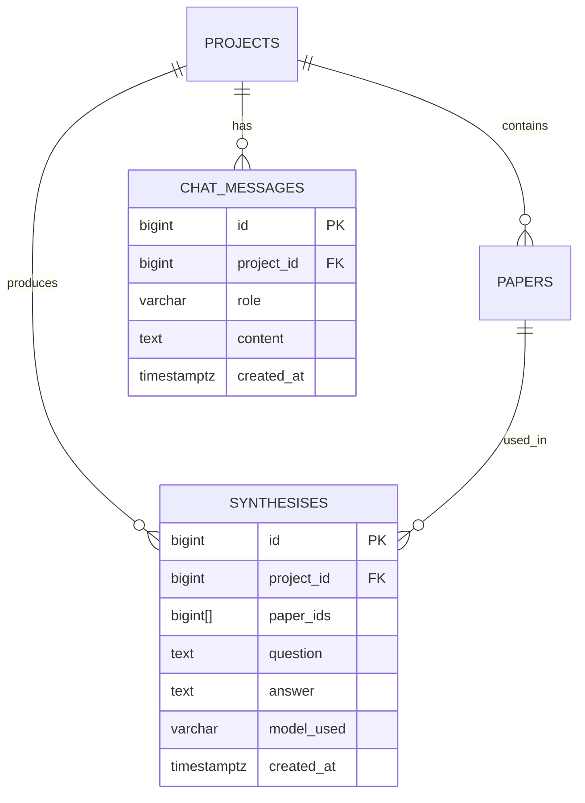
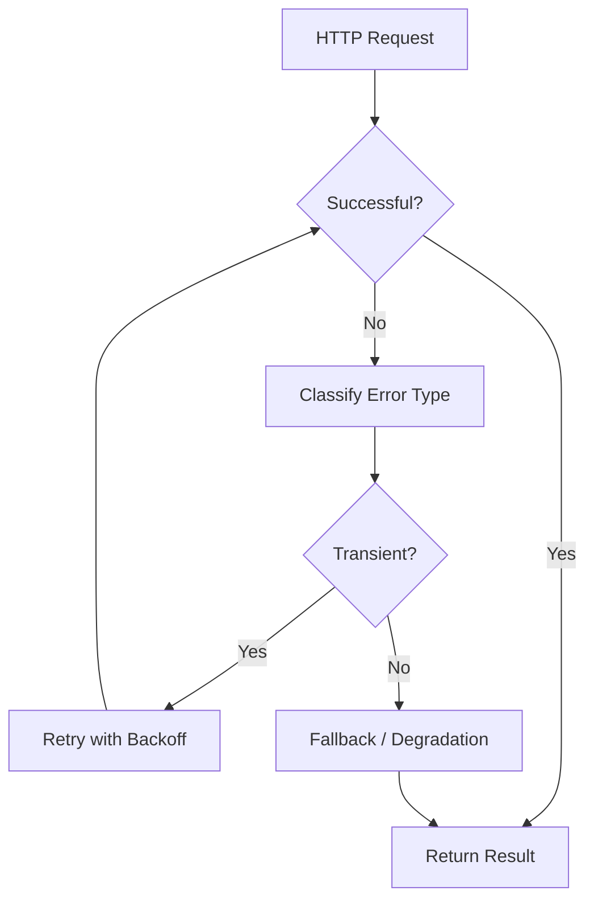
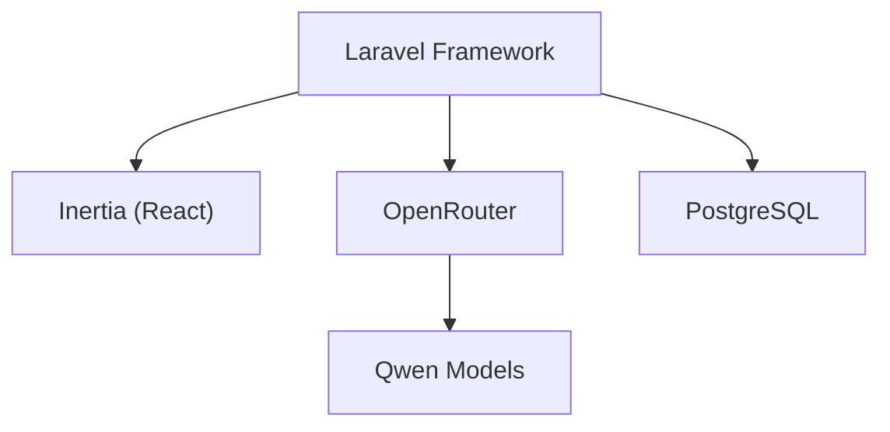

# AI Integration & Model Configuration

<cite>
**Referenced Files in This Document**
- [FULL_SPEC.md](file://hackathon/FULL_SPEC.md)
- [HACKATHON_SPEC.md](file://hackathon/HACKATHON_SPEC.md)
- [RULES.md](file://hackathon/RULES.md)
- [web.php](file://routes/web.php)
- [services.php](file://config/services.php)
- [composer.json](file://composer.json)
- [http-client.md](file://.agents/skills/laravel-best-practices/rules/http-client.md)
- [http-client.md](file://.claude/skills/laravel-best-practices/rules/http-client.md)
</cite>

## Table of Contents
1. [Introduction](#introduction)
2. [Project Structure](#project-structure)
3. [Core Components](#core-components)
4. [Architecture Overview](#architecture-overview)
5. [Detailed Component Analysis](#detailed-component-analysis)
6. [Dependency Analysis](#dependency-analysis)
7. [Performance Considerations](#performance-considerations)
8. [Troubleshooting Guide](#troubleshooting-guide)
9. [Conclusion](#conclusion)
10. [Appendices](#appendices)

## Introduction
This document explains the AI integration patterns and model configuration for synthesis endpoints in the ScholarGraph project. The system uses Qwen models via OpenRouter as the LLM gateway. It covers model selection criteria, parameter tuning, request formatting, response parsing, error handling, retry mechanisms, fallback strategies, and performance monitoring approaches. The goal is to enable reliable, scalable, and maintainable AI-powered synthesis and chat experiences.

## Project Structure
The repository follows a Laravel backend with Inertia/React frontend. AI synthesis and chat endpoints are part of the web application routes and rely on OpenRouter for Qwen model access. Configuration for third-party services resides in the services configuration file, while HTTP client best practices for external API calls are documented in skill guides.

**Diagram sources**
- [web.php:1-12](file://routes/web.php#L1-L12)
- [FULL_SPEC.md:12-25](file://hackathon/FULL_SPEC.md#L12-L25)
- [FULL_SPEC.md:88-97](file://hackathon/FULL_SPEC.md#L88-L97)

**Section sources**
- [web.php:1-12](file://routes/web.php#L1-L12)
- [services.php:1-39](file://config/services.php#L1-L39)
- [composer.json:11-19](file://composer.json#L11-L19)

## Core Components
- OpenRouter integration: Centralized LLM gateway for Qwen models, enabling model swapping and fallbacks via configuration changes.
- Qwen model configuration: Model selection aligned to tasks (smaller for bulk tasks, mid-size for chat/synthesis, largest for cross-paper synthesis).
- API request formatting: Structured prompts combining project papers (titles/abstracts) and chat history; optional structured output for reliability.
- Response parsing: Extract model-used identifier, synthesis content, and paper linkage for UI attribution.
- Error handling and retries: Explicit timeouts, retry with backoff, and graceful degradation for transient failures.
- Fallback strategies: Provider-level fallback via OpenRouter configuration for outages or rate limits.
- Performance monitoring: Token usage tracking, latency metrics, and cost-aware model selection.

**Section sources**
- [FULL_SPEC.md:174-185](file://hackathon/FULL_SPEC.md#L174-L185)
- [HACKATHON_SPEC.md:92-104](file://hackathon/HACKATHON_SPEC.md#L92-L104)
- [http-client.md:1-161](file://.agents/skills/laravel-best-practices/rules/http-client.md#L1-L161)
- [http-client.md:1-161](file://.claude/skills/laravel-best-practices/rules/http-client.md#L1-L161)

## Architecture Overview
The synthesis and chat flow integrates the frontend, backend routes, controllers, OpenRouter, and PostgreSQL storage. The backend constructs prompts from stored papers and chat history, sends them to OpenRouter/Qwen, and persists results with attribution to source papers.

**Diagram sources**
- [web.php:1-12](file://routes/web.php#L1-L12)
- [FULL_SPEC.md:88-97](file://hackathon/FULL_SPEC.md#L88-L97)
- [FULL_SPEC.md:95-96](file://hackathon/FULL_SPEC.md#L95-L96)

## Detailed Component Analysis

### OpenRouter Integration Pattern
- Role: Acts as the LLM gateway to abstract provider and model selection.
- Benefits: Enables one-line configuration changes for model swaps and fallbacks without code modifications.
- Implementation pattern: Configure base URL and authentication via environment variables; route all synthesis/chat requests through OpenRouter endpoints.

**Diagram sources**
- [FULL_SPEC.md:19-25](file://hackathon/FULL_SPEC.md#L19-L25)
- [FULL_SPEC.md:88-97](file://hackathon/FULL_SPEC.md#L88-L97)

**Section sources**
- [FULL_SPEC.md:19-25](file://hackathon/FULL_SPEC.md#L19-L25)
- [services.php:1-39](file://config/services.php#L1-L39)

### Qwen Model Configuration and Selection Criteria
- Task-driven model tiers:
  - Bulk metadata tagging and quick abstract summaries: smaller/faster Qwen (cost-sensitive).
  - Single-paper chat and evidence extraction: mid-size Qwen (comprehension and reliability).
  - Cross-paper synthesis: largest available Qwen (highest-stakes output).
- Dynamic model slugs: Pull from OpenRouter’s current Qwen listing at build time to avoid hardcoding.
- Structured output: Prefer JSON for evidence extraction to improve reliability.

**Diagram sources**
- [FULL_SPEC.md:174-185](file://hackathon/FULL_SPEC.md#L174-L185)

**Section sources**
- [FULL_SPEC.md:174-185](file://hackathon/FULL_SPEC.md#L174-L185)
- [HACKATHON_SPEC.md:101-104](file://hackathon/HACKATHON_SPEC.md#L101-L104)

### API Request Formatting for Synthesis/Chat
- Prompt construction:
  - Context: All project papers’ titles and abstracts.
  - Chat history: Last N turns to bound context window.
  - Question: New user query.
- Structured prompting:
  - For evidence extraction: Force JSON output to simplify parsing.
  - For grounding checks: Compare claims against stored extractions/syntheses.
- Headers and authentication:
  - Use OpenRouter base URL and API key via environment configuration.
  - Set explicit timeouts and connect timeouts to fail fast.

**Diagram sources**
- [HACKATHON_SPEC.md:96-99](file://hackathon/HACKATHON_SPEC.md#L96-L99)
- [FULL_SPEC.md:179-182](file://hackathon/FULL_SPEC.md#L179-L182)

**Section sources**
- [HACKATHON_SPEC.md:96-99](file://hackathon/HACKATHON_SPEC.md#L96-L99)
- [FULL_SPEC.md:179-182](file://hackathon/FULL_SPEC.md#L179-L182)

### Response Parsing and Attribution
- Extract model_used identifier to record which Qwen model produced the result.
- Parse synthesis content and associate it with the specific papers used (paper_ids).
- Store both question and answer in chat_messages; persist synthesis with paper linkage for UI attribution.

**Diagram sources**
- [FULL_SPEC.md:35-77](file://hackathon/FULL_SPEC.md#L35-L77)
- [FULL_SPEC.md:88-97](file://hackathon/FULL_SPEC.md#L88-L97)

**Section sources**
- [FULL_SPEC.md:88-97](file://hackathon/FULL_SPEC.md#L88-L97)

### Error Handling, Retries, and Fallbacks
- Explicit timeouts: Set request and connect timeouts to fail fast.
- Retry with backoff: Use exponential delays for transient failures; restrict to connection and server errors.
- Graceful degradation: Distinguish 404 vs. 500 responses; surface user-friendly messages for missing resources.
- Fallback strategies: Switch providers or models via OpenRouter configuration for outages or rate limits.

**Diagram sources**
- [.agents/skills/laravel-best-practices/rules/http-client.md:32-59](file://.agents/skills/laravel-best-practices/rules/http-client.md#L32-L59)
- [.claude/skills/laravel-best-practices/rules/http-client.md:32-59](file://.claude/skills/laravel-best-practices/rules/http-client.md#L32-L59)

**Section sources**
- [.agents/skills/laravel-best-practices/rules/http-client.md:3-59](file://.agents/skills/laravel-best-practices/rules/http-client.md#L3-L59)
- [.claude/skills/laravel-best-practices/rules/http-client.md:3-59](file://.claude/skills/laravel-best-practices/rules/http-client.md#L3-L59)

### Parameter Tuning and Prompt Engineering
- Temperature and max tokens: Tune temperature for creativity vs. consistency; cap max tokens to control cost and latency.
- Structured output: Enforce JSON for evidence extraction to reduce parsing ambiguity.
- Prompt templates: Include explicit instructions for grounding claims and citing sources.

**Section sources**
- [FULL_SPEC.md:179-182](file://hackathon/FULL_SPEC.md#L179-L182)
- [HACKATHON_SPEC.md:101-104](file://hackathon/HACKATHON_SPEC.md#L101-L104)

### Examples of Model Configuration and Request/Response
- Model configuration: Select a mid-size Qwen model via OpenRouter at build time; store model_used in synthesis records.
- Request example: Combine project papers (title + abstract) and recent chat history with the new question.
- Response example: Return normalized answer text and paper_ids for UI attribution.

**Section sources**
- [HACKATHON_SPEC.md:96-104](file://hackathon/HACKATHON_SPEC.md#L96-L104)
- [FULL_SPEC.md:95-96](file://hackathon/FULL_SPEC.md#L95-L96)

## Dependency Analysis
- Laravel framework and Inertia provide the backend and frontend integration.
- OpenRouter serves as the external LLM provider; configuration is managed via environment variables and the services configuration.
- PostgreSQL stores persistent memory (projects, papers, syntheses, chat_messages).

**Diagram sources**
- [composer.json:11-19](file://composer.json#L11-L19)
- [FULL_SPEC.md:12-25](file://hackathon/FULL_SPEC.md#L12-L25)
- [services.php:1-39](file://config/services.php#L1-L39)

**Section sources**
- [composer.json:11-19](file://composer.json#L11-L19)
- [services.php:1-39](file://config/services.php#L1-L39)

## Performance Considerations
- Token budgeting: Monitor token usage per request; prefer smaller models for bulk tasks to reduce cost.
- Latency optimization: Use explicit timeouts, limit context window, and avoid unnecessary pooling.
- Cost control: Align model selection to task importance; prefer JSON output to reduce rework.
- Observability: Track request duration, error rates, and model usage for capacity planning.

[No sources needed since this section provides general guidance]

## Troubleshooting Guide
- Timeout errors: Increase connectTimeout and timeout for OpenRouter; ensure network connectivity.
- Rate limiting: Implement retry with backoff; consider switching models/providers via OpenRouter configuration.
- Parsing failures: Enforce structured output (JSON) for evidence extraction; validate response shape before persistence.
- Provider outages: Use provider-level fallbacks configured in OpenRouter; degrade gracefully by returning cached or summarized content.

**Section sources**
- [.agents/skills/laravel-best-practices/rules/http-client.md:3-59](file://.agents/skills/laravel-best-practices/rules/http-client.md#L3-L59)
- [.claude/skills/laravel-best-practices/rules/http-client.md:3-59](file://.claude/skills/laravel-best-practices/rules/http-client.md#L3-L59)
- [FULL_SPEC.md:19-25](file://hackathon/FULL_SPEC.md#L19-L25)

## Conclusion
By centralizing LLM access through OpenRouter, aligning model selection to task requirements, enforcing structured prompting, and implementing robust error handling and fallbacks, the synthesis endpoints achieve reliability, scalability, and maintainability. Persistent memory storage ensures cross-session recall, while observability enables continuous improvement.

[No sources needed since this section summarizes without analyzing specific files]

## Appendices

### Appendix A: AI Usage Rules and Compliance
- Participation in the hackathon requires adherence to Qwen Cloud rules and eligibility criteria.

**Section sources**
- [RULES.md:65-80](file://hackathon/RULES.md#L65-L80)