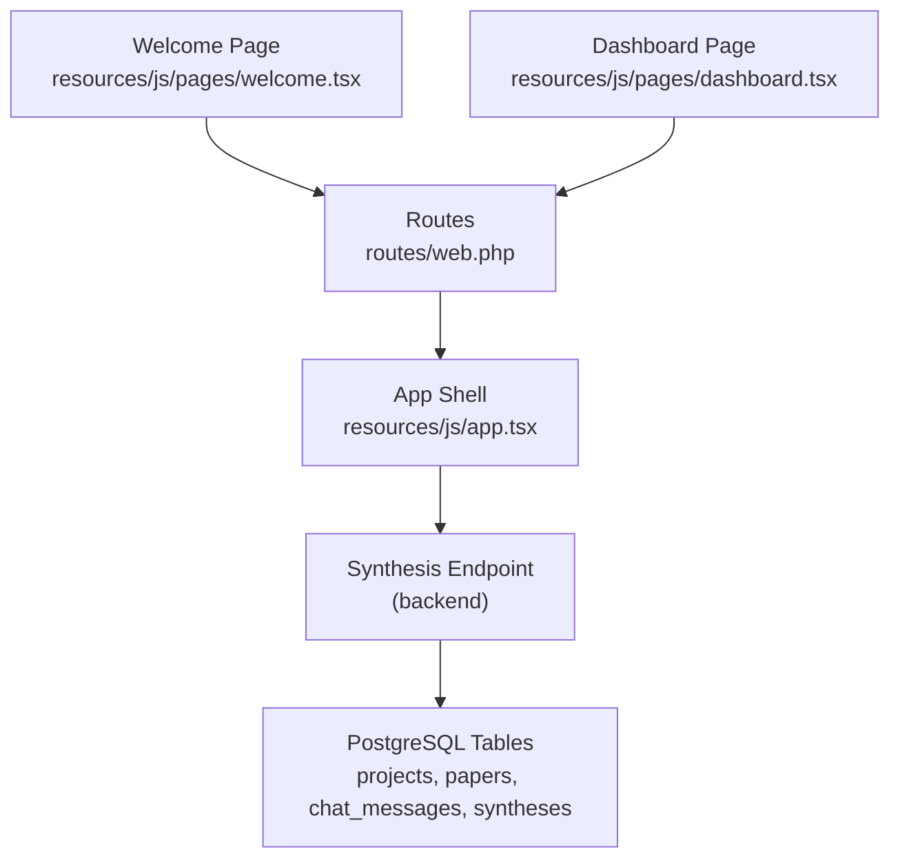
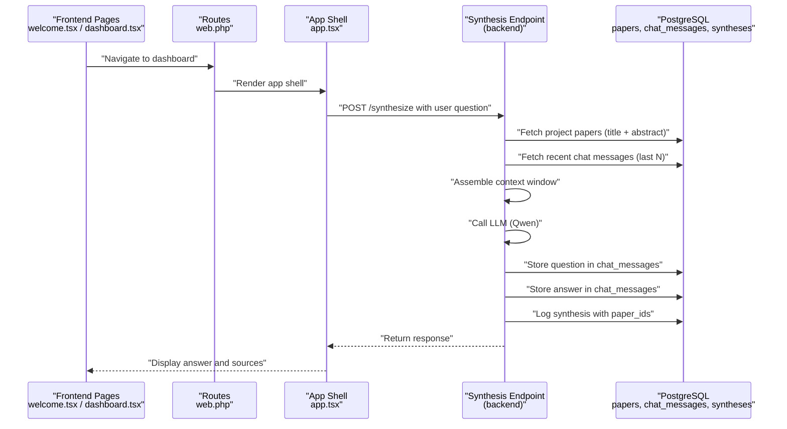
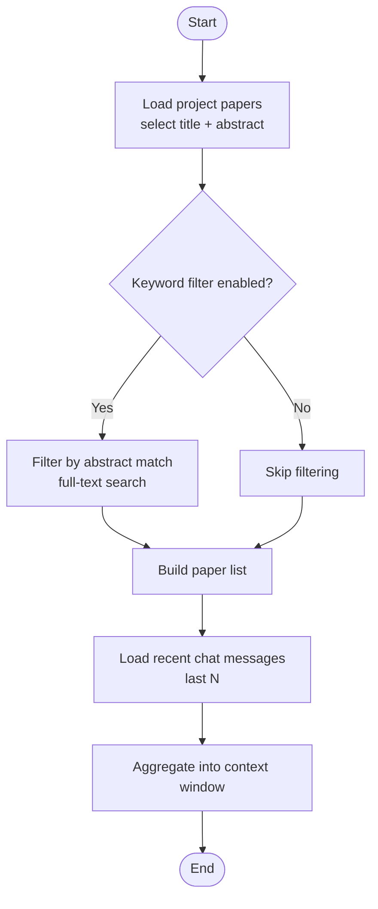
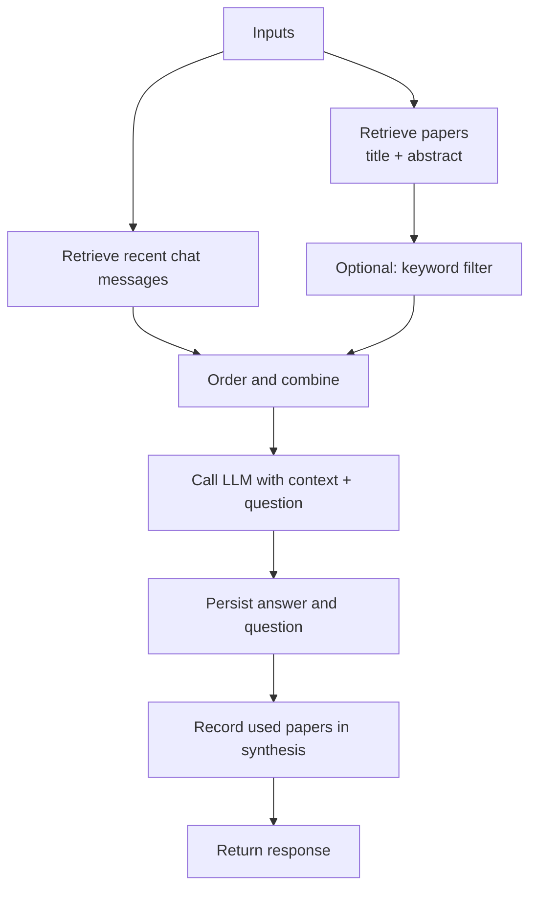
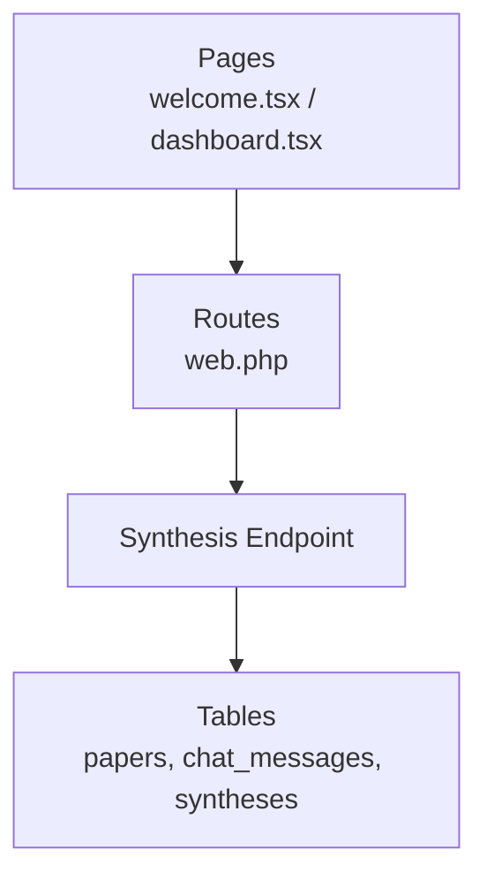

# Context Assembly Process

<cite>
**Referenced Files in This Document**
- [HACKATHON_SPEC.md](file://hackathon/HACKATHON_SPEC.md)
- [FULL_SPEC.md](file://hackathon/FULL_SPEC.md)
- [web.php](file://routes/web.php)
- [app.tsx](file://resources/js/app.tsx)
- [dashboard.tsx](file://resources/js/pages/dashboard.tsx)
- [welcome.tsx](file://resources/js/pages/welcome.tsx)
</cite>

## Table of Contents
1. [Introduction](#introduction)
2. [Project Structure](#project-structure)
3. [Core Components](#core-components)
4. [Architecture Overview](#architecture-overview)
5. [Detailed Component Analysis](#detailed-component-analysis)
6. [Dependency Analysis](#dependency-analysis)
7. [Performance Considerations](#performance-considerations)
8. [Troubleshooting Guide](#troubleshooting-guide)
9. [Conclusion](#conclusion)

## Introduction
This document explains the context assembly process used by synthesis endpoints to collect, filter, and format information for AI responses. The process centers on combining:
- Project papers (titles and abstracts)
- Chat history (last N exchanges)
- User context (optional, e.g., explicit instructions or selections)

The goal is to assemble a bounded, relevant context window for each synthesis turn while preserving persistent memory across sessions. The approach emphasizes simplicity for the hackathon scope: pull all relevant items from the database per turn rather than maintaining server-side state.

## Project Structure
The synthesis context pipeline spans frontend pages and backend routes. The frontend renders the UI and triggers requests, while the backend routes orchestrate context assembly and LLM calls.

**Diagram sources**
- [web.php:1-12](file://routes/web.php#L1-L12)
- [app.tsx](file://resources/js/app.tsx)
- [dashboard.tsx](file://resources/js/pages/dashboard.tsx)
- [welcome.tsx](file://resources/js/pages/welcome.tsx)

**Section sources**
- [web.php:1-12](file://routes/web.php#L1-L12)
- [app.tsx](file://resources/js/app.tsx)
- [dashboard.tsx](file://resources/js/pages/dashboard.tsx)
- [welcome.tsx](file://resources/js/pages/welcome.tsx)

## Core Components
- Data model for context sources:
  - Projects: container for user sessions and ownership
  - Papers: per-paper metadata and abstracts
  - Chat messages: persisted conversation history
  - Syntheses: logged answers with associated paper sets

- Retrieval strategy:
  - Pull all papers for the project (title + abstract)
  - Pull recent chat messages (last N turns)
  - Combine into a single context window for the synthesis endpoint

- Storage of synthesis outcomes:
  - Persist both question and answer in chat_messages
  - Record which papers were used in syntheses.paper_ids for traceability

**Section sources**
- [HACKATHON_SPEC.md:39-75](file://hackathon/HACKATHON_SPEC.md#L39-L75)
- [HACKATHON_SPEC.md:83-104](file://hackathon/HACKATHON_SPEC.md#L83-L104)
- [FULL_SPEC.md:27-131](file://hackathon/FULL_SPEC.md#L27-L131)

## Architecture Overview
The synthesis context assembly follows a predictable flow: UI triggers a request, backend gathers context from the database, and the LLM generates a response. The response is stored for persistence and future sessions.

**Diagram sources**
- [web.php:1-12](file://routes/web.php#L1-L12)
- [app.tsx](file://resources/js/app.tsx)
- [dashboard.tsx](file://resources/js/pages/dashboard.tsx)
- [welcome.tsx](file://resources/js/pages/welcome.tsx)
- [HACKATHON_SPEC.md:77-104](file://hackathon/HACKATHON_SPEC.md#L77-L104)

## Detailed Component Analysis

### Data Retrieval Patterns
- Paper retrieval:
  - Fetch all papers belonging to the project
  - Select relevant fields: title and abstract
  - Optional: apply a simple keyword filter using PostgreSQL full-text search on abstracts

- Chat history retrieval:
  - Fetch the last N chat messages for the project
  - Include role and content to reconstruct conversation context

- Aggregation:
  - Concatenate paper entries and chat messages into a single context window
  - Maintain order: earlier items appear first, followed by recent chat messages

**Diagram sources**
- [HACKATHON_SPEC.md:83-90](file://hackathon/HACKATHON_SPEC.md#L83-L90)
- [HACKATHON_SPEC.md:77-82](file://hackathon/HACKATHON_SPEC.md#L77-L82)

**Section sources**
- [HACKATHON_SPEC.md:83-90](file://hackathon/HACKATHON_SPEC.md#L83-L90)
- [HACKATHON_SPEC.md:77-82](file://hackathon/HACKATHON_SPEC.md#L77-L82)

### Filtering Mechanisms
- Keyword-relevance filter:
  - Use PostgreSQL full-text search on paper abstracts
  - Limit context growth by selecting only relevant abstracts
  - Keep this optional to simplify initial builds

- Ordering and selection:
  - Papers: order by recency or relevance score if computed
  - Chat: order chronologically, newest first

**Section sources**
- [HACKATHON_SPEC.md:83-90](file://hackathon/HACKATHON_SPEC.md#L83-L90)

### Aggregation Strategies
- Context window composition:
  - Place paper entries first, then recent chat messages
  - Respect a maximum token/window limit by truncating or limiting counts

- Metadata extraction:
  - Extract minimal fields: title, abstract, role, content
  - Avoid heavy transformations; keep payloads compact

- Relevance scoring (optional):
  - Compute a simple score based on keyword matches
  - Rank papers before assembling the context window

**Section sources**
- [HACKATHON_SPEC.md:77-82](file://hackathon/HACKATHON_SPEC.md#L77-L82)
- [HACKATHON_SPEC.md:83-90](file://hackathon/HACKATHON_SPEC.md#L83-L90)

### Context Transformation Pipeline
- Input: project identifier, user question, optional filters
- Processing:
  - Retrieve papers and chat messages
  - Optionally filter by keywords
  - Assemble ordered context
  - Call LLM with the assembled context and question
- Output: answer, persisted question-answer pair, and recorded paper set

**Diagram sources**
- [HACKATHON_SPEC.md:77-104](file://hackathon/HACKATHON_SPEC.md#L77-L104)

**Section sources**
- [HACKATHON_SPEC.md:77-104](file://hackathon/HACKATHON_SPEC.md#L77-L104)

### Examples of Context Building Workflows
- Workflow 1: Basic synthesis
  - Retrieve all papers and recent chat messages
  - Assemble context and submit to LLM
  - Store the resulting question-answer pair and record used papers

- Workflow 2: Keyword-filtered synthesis
  - Apply a keyword filter to reduce context size
  - Proceed with assembly and LLM call
  - Store results as above

- Workflow 3: Session continuity
  - On refresh, reassemble context from persisted chat and paper data
  - Maintain continuity across sessions without server-side state

**Section sources**
- [HACKATHON_SPEC.md:77-104](file://hackathon/HACKATHON_SPEC.md#L77-L104)
- [HACKATHON_SPEC.md:83-90](file://hackathon/HACKATHON_SPEC.md#L83-L90)

### Performance Optimization Techniques
- Minimize database load:
  - Use targeted SELECT queries with only required columns
  - Apply LIMIT clauses for recent chat messages
- Reduce context size:
  - Enable keyword filtering to prune irrelevant papers
  - Truncate long abstracts or limit the number of papers
- Caching:
  - Cache frequently accessed paper metadata
  - Cache recent chat segments per project
- Indexing:
  - Ensure full-text search indexes on abstract/title fields
  - Use appropriate PostgreSQL GIN indexes for fast filtering

**Section sources**
- [HACKATHON_SPEC.md:83-90](file://hackathon/HACKATHON_SPEC.md#L83-L90)
- [FULL_SPEC.md:27-131](file://hackathon/FULL_SPEC.md#L27-L131)

### Error Handling for Missing or Incomplete Context Data
- Missing papers:
  - Gracefully handle empty paper lists
  - Provide a fallback message and suggest adding papers
- Missing chat history:
  - Treat absence as a fresh start
  - Initialize with a system message guiding the model
- Partial metadata:
  - Skip entries with missing abstract/title
  - Log warnings for incomplete records
- Storage failures:
  - Retry storing chat messages and syntheses
  - Use transactions to maintain consistency

**Section sources**
- [HACKATHON_SPEC.md:77-104](file://hackathon/HACKATHON_SPEC.md#L77-L104)

## Dependency Analysis
The synthesis context pipeline depends on:
- Frontend pages (welcome.tsx, dashboard.tsx) to render UI and trigger requests
- Routes (web.php) to map URLs to handlers
- Backend synthesis endpoint to assemble context and call the LLM
- Database tables (papers, chat_messages, syntheses) for persistent storage

**Diagram sources**
- [web.php:1-12](file://routes/web.php#L1-L12)
- [dashboard.tsx](file://resources/js/pages/dashboard.tsx)
- [welcome.tsx](file://resources/js/pages/welcome.tsx)
- [HACKATHON_SPEC.md:39-75](file://hackathon/HACKATHON_SPEC.md#L39-L75)

**Section sources**
- [web.php:1-12](file://routes/web.php#L1-L12)
- [dashboard.tsx](file://resources/js/pages/dashboard.tsx)
- [welcome.tsx](file://resources/js/pages/welcome.tsx)
- [HACKATHON_SPEC.md:39-75](file://hackathon/HACKATHON_SPEC.md#L39-L75)

## Performance Considerations
- Keep context windows bounded to avoid excessive token usage
- Use efficient queries with proper indexing
- Consider pagination for very large projects
- Monitor LLM latency and implement timeouts
- Cache static metadata when safe to do so

## Troubleshooting Guide
- Symptom: Empty context window
  - Cause: No papers or chat messages found
  - Action: Verify project membership and add at least one paper

- Symptom: Slow responses
  - Cause: Large context or missing indexes
  - Action: Enable keyword filtering and ensure full-text indexes exist

- Symptom: Inconsistent session continuity
  - Cause: Not re-fetching persisted chat and paper data
  - Action: Ensure backend reloads chat_messages and papers on each request

**Section sources**
- [HACKATHON_SPEC.md:77-104](file://hackathon/HACKATHON_SPEC.md#L77-L104)
- [HACKATHON_SPEC.md:83-90](file://hackathon/HACKATHON_SPEC.md#L83-L90)

## Conclusion
The context assembly process for synthesis endpoints is intentionally simple and robust: gather all relevant papers and recent chat messages, optionally filter by keywords, and present a coherent context window to the LLM. This approach ensures persistent, queryable memory across sessions without complex server-side state, meeting the hackathon’s core requirement.