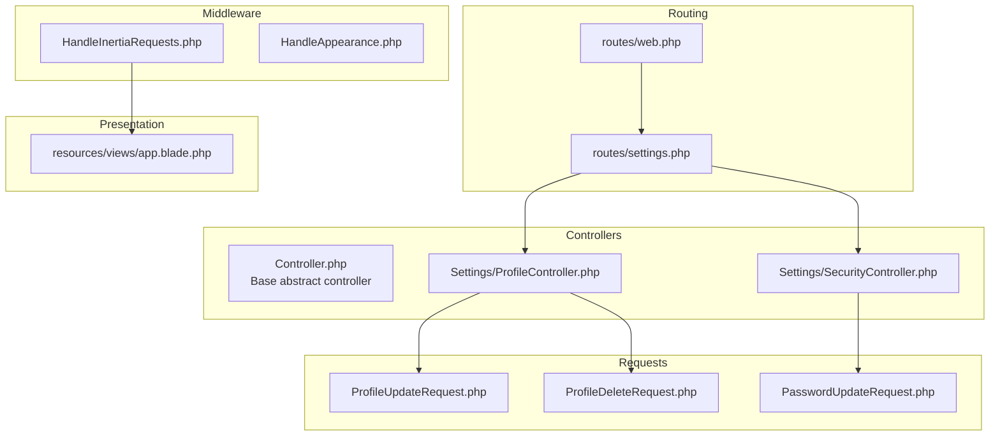
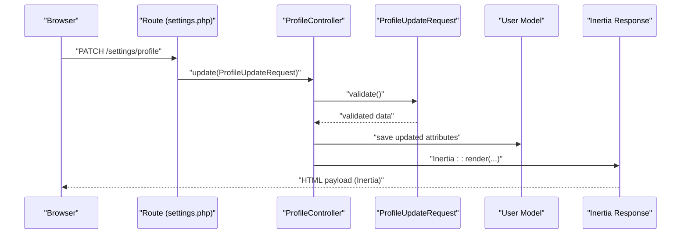
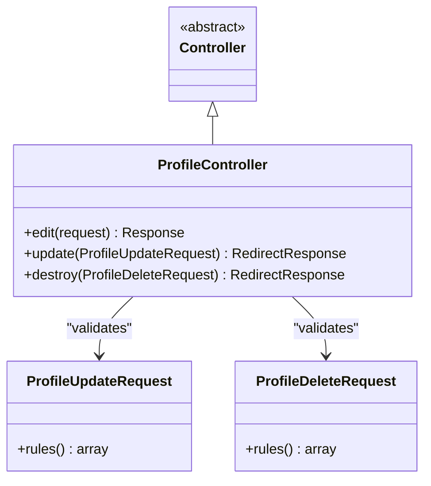
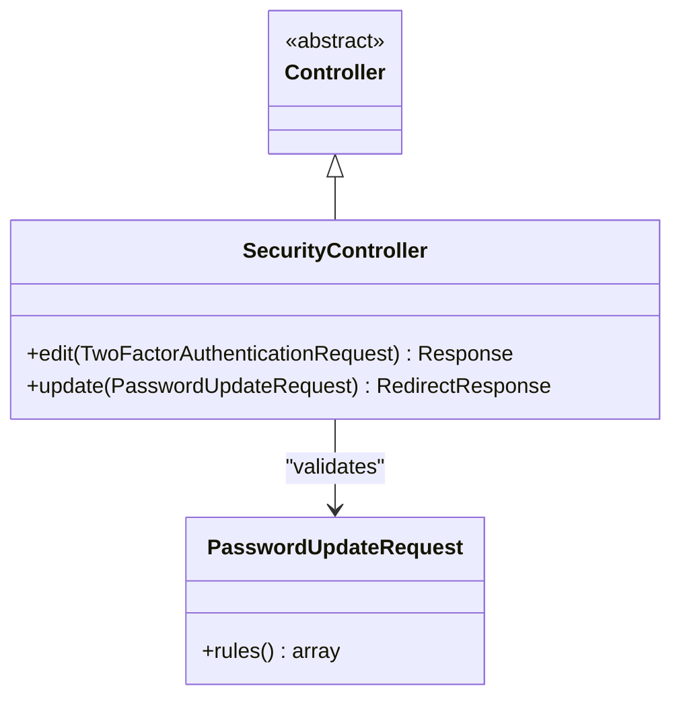
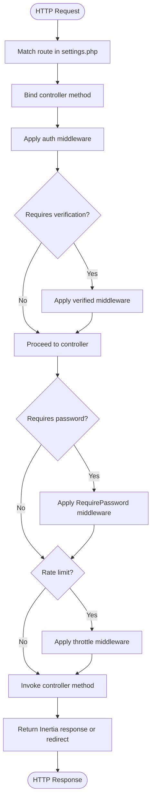
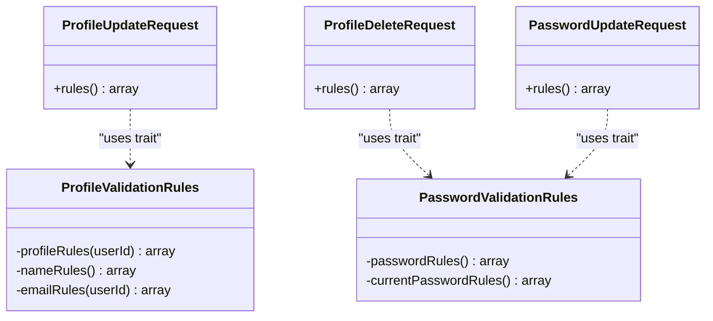
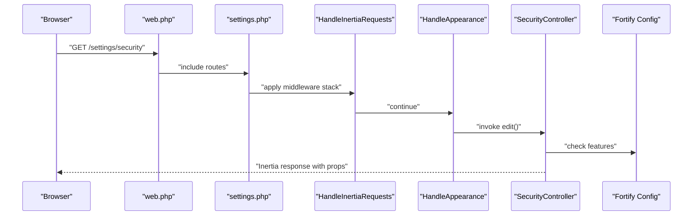
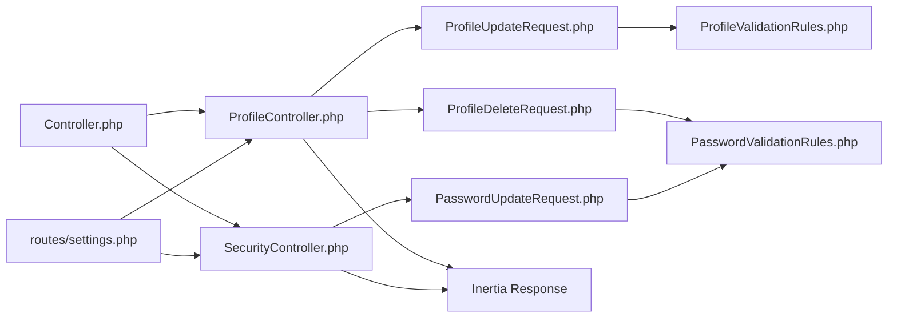

# Controller Structure & Routing

<cite>
**Referenced Files in This Document**
- [Controller.php](file://app/Http/Controllers/Controller.php)
- [ProfileController.php](file://app/Http/Controllers/Settings/ProfileController.php)
- [SecurityController.php](file://app/Http/Controllers/Settings/SecurityController.php)
- [web.php](file://routes/web.php)
- [settings.php](file://routes/settings.php)
- [ProfileUpdateRequest.php](file://app/Http/Requests/Settings/ProfileUpdateRequest.php)
- [ProfileDeleteRequest.php](file://app/Http/Requests/Settings/ProfileDeleteRequest.php)
- [PasswordUpdateRequest.php](file://app/Http/Requests/Settings/PasswordUpdateRequest.php)
- [HandleInertiaRequests.php](file://app/Http/Middleware/HandleInertiaRequests.php)
- [HandleAppearance.php](file://app/Http/Middleware/HandleAppearance.php)
- [ProfileValidationRules.php](file://app/Concerns/ProfileValidationRules.php)
- [PasswordValidationRules.php](file://app/Concerns/PasswordValidationRules.php)
- [app.blade.php](file://resources/views/app.blade.php)
- [fortify.php](file://config/fortify.php)
</cite>

## Table of Contents
1. [Introduction](#introduction)
2. [Project Structure](#project-structure)
3. [Core Components](#core-components)
4. [Architecture Overview](#architecture-overview)
5. [Detailed Component Analysis](#detailed-component-analysis)
6. [Dependency Analysis](#dependency-analysis)
7. [Performance Considerations](#performance-considerations)
8. [Troubleshooting Guide](#troubleshooting-guide)
9. [Conclusion](#conclusion)

## Introduction
This document explains the synthesis endpoint controller structure and routing implementation for the settings domain. It focuses on the abstract controller base class, inheritance patterns, and method organization; documents route definitions, URL patterns, and parameter binding; and demonstrates request handling patterns, response formatting, and integration with Laravel’s routing system and middleware chain. Practical examples show proper controller implementation and best practices for endpoint organization.

## Project Structure
The settings endpoints are organized under dedicated controllers and grouped in a dedicated routes file. Controllers inherit from a shared base class and use form requests for validation. Middleware integrates Inertia for server-rendered SPA-like experiences.

**Diagram sources**
- [web.php:1-12](file://routes/web.php#L1-L12)
- [settings.php:1-35](file://routes/settings.php#L1-L35)
- [Controller.php:1-9](file://app/Http/Controllers/Controller.php#L1-L9)
- [ProfileController.php:1-63](file://app/Http/Controllers/Settings/ProfileController.php#L1-L63)
- [SecurityController.php:1-67](file://app/Http/Controllers/Settings/SecurityController.php#L1-L67)
- [ProfileUpdateRequest.php:1-23](file://app/Http/Requests/Settings/ProfileUpdateRequest.php#L1-L23)
- [ProfileDeleteRequest.php:1-25](file://app/Http/Requests/Settings/ProfileDeleteRequest.php#L1-L25)
- [PasswordUpdateRequest.php:1-26](file://app/Http/Requests/Settings/PasswordUpdateRequest.php#L1-L26)
- [HandleInertiaRequests.php:1-48](file://app/Http/Middleware/HandleInertiaRequests.php#L1-L48)
- [HandleAppearance.php:1-24](file://app/Http/Middleware/HandleAppearance.php#L1-L24)
- [app.blade.php:1-49](file://resources/views/app.blade.php#L1-L49)

**Section sources**
- [web.php:1-12](file://routes/web.php#L1-L12)
- [settings.php:1-35](file://routes/settings.php#L1-L35)

## Core Components
- Abstract base controller: Provides a namespace foundation for all controllers in the application.
- Settings controllers:
  - ProfileController: Handles profile editing, updates, and deletion.
  - SecurityController: Handles security settings, password updates, and passkey/two-factor features.
- Request classes: Encapsulate validation rules and enforce preconditions via form requests.
- Middleware: Integrates Inertia rendering and manages shared data and appearance handling.

Key implementation highlights:
- Controllers extend the base abstract controller and return either Inertia responses or redirects.
- Form requests centralize validation and leverage traits for reusable rules.
- Routes bind controller methods to URLs with explicit HTTP verbs and optional middleware.

**Section sources**
- [Controller.php:1-9](file://app/Http/Controllers/Controller.php#L1-L9)
- [ProfileController.php:1-63](file://app/Http/Controllers/Settings/ProfileController.php#L1-L63)
- [SecurityController.php:1-67](file://app/Http/Controllers/Settings/SecurityController.php#L1-L67)
- [ProfileUpdateRequest.php:1-23](file://app/Http/Requests/Settings/ProfileUpdateRequest.php#L1-L23)
- [ProfileDeleteRequest.php:1-25](file://app/Http/Requests/Settings/ProfileDeleteRequest.php#L1-L25)
- [PasswordUpdateRequest.php:1-26](file://app/Http/Requests/Settings/PasswordUpdateRequest.php#L1-L26)

## Architecture Overview
The routing system delegates to controllers that render Inertia pages or redirect after performing actions. Middleware ensures authenticated sessions and shared application state.

**Diagram sources**
- [settings.php:11-13](file://routes/settings.php#L11-L13)
- [ProfileController.php:31-44](file://app/Http/Controllers/Settings/ProfileController.php#L31-L44)
- [ProfileUpdateRequest.php:1-23](file://app/Http/Requests/Settings/ProfileUpdateRequest.php#L1-L23)

## Detailed Component Analysis

### Abstract Base Controller
- Purpose: Establishes a common namespace for all controllers.
- Role: Acts as a marker for inheritance and future shared behavior.

Implementation pattern:
- Minimal base class enabling consistent inheritance across feature-specific controllers.

Best practices:
- Keep the base class intentionally lightweight; place cross-cutting concerns in middleware or traits.

**Section sources**
- [Controller.php:1-9](file://app/Http/Controllers/Controller.php#L1-L9)

### ProfileController
Responsibilities:
- Render the profile settings page.
- Update user profile attributes with validation.
- Delete the user account with password confirmation.

Method organization:
- edit(Request): Returns an Inertia response for the profile page.
- update(ProfileUpdateRequest): Validates, persists changes, flashes feedback, and redirects.
- destroy(ProfileDeleteRequest): Confirms current password, logs out, deletes the user, invalidates session, and redirects.

Request handling patterns:
- Uses ProfileUpdateRequest for validation and ProfileDeleteRequest for destructive actions.
- Leverages MustVerifyEmail interface detection and session status for rendering.

Response formatting:
- Returns Inertia::render for page loads.
- Returns RedirectResponse for post-actions.

**Diagram sources**
- [Controller.php:1-9](file://app/Http/Controllers/Controller.php#L1-L9)
- [ProfileController.php:1-63](file://app/Http/Controllers/Settings/ProfileController.php#L1-L63)
- [ProfileUpdateRequest.php:1-23](file://app/Http/Requests/Settings/ProfileUpdateRequest.php#L1-L23)
- [ProfileDeleteRequest.php:1-25](file://app/Http/Requests/Settings/ProfileDeleteRequest.php#L1-L25)

**Section sources**
- [ProfileController.php:1-63](file://app/Http/Controllers/Settings/ProfileController.php#L1-L63)
- [ProfileUpdateRequest.php:1-23](file://app/Http/Requests/Settings/ProfileUpdateRequest.php#L1-L23)
- [ProfileDeleteRequest.php:1-25](file://app/Http/Requests/Settings/ProfileDeleteRequest.php#L1-L25)

### SecurityController
Responsibilities:
- Render the security settings page with feature flags and passkey listings.
- Update the user’s password with validation and throttling.

Method organization:
- edit(TwoFactorAuthenticationRequest): Builds props for Inertia, including two-factor and passkey capabilities.
- update(PasswordUpdateRequest): Updates the password, flashes feedback, and returns to the previous page.

Request handling patterns:
- Uses PasswordUpdateRequest for robust password validation and current password confirmation.
- Integrates Fortify features to conditionally expose controls.

Response formatting:
- Returns Inertia::render for page loads.
- Returns RedirectResponse for post-actions.

**Diagram sources**
- [Controller.php:1-9](file://app/Http/Controllers/Controller.php#L1-L9)
- [SecurityController.php:1-67](file://app/Http/Controllers/Settings/SecurityController.php#L1-L67)
- [PasswordUpdateRequest.php:1-26](file://app/Http/Requests/Settings/PasswordUpdateRequest.php#L1-L26)

**Section sources**
- [SecurityController.php:1-67](file://app/Http/Controllers/Settings/SecurityController.php#L1-L67)
- [PasswordUpdateRequest.php:1-26](file://app/Http/Requests/Settings/PasswordUpdateRequest.php#L1-L26)

### Route Definitions and Parameter Binding
URL patterns and bindings:
- GET /settings/profile → ProfileController@edit
- PATCH /settings/profile → ProfileController@update
- DELETE /settings/profile → ProfileController@destroy
- GET /settings/security → SecurityController@edit (with RequirePassword middleware)
- PUT /settings/password → SecurityController@update (with throttle middleware)
- GET /settings/appearance → Inertia page (no controller action)
- GET /.well-known/passkey-endpoints → JSON route returning route names

Parameter binding:
- Route parameters are not used; controllers receive the Request object and optionally validated form requests.
- Named routes enable consistent linking across templates and controllers.

Middleware chain:
- auth: Ensures the user is authenticated.
- verified: Ensures the user’s email is verified (for certain endpoints).
- RequirePassword: Enforces password confirmation for sensitive actions.
- throttle: Limits rate of password update attempts.

**Diagram sources**
- [settings.php:1-35](file://routes/settings.php#L1-L35)

**Section sources**
- [settings.php:1-35](file://routes/settings.php#L1-L35)

### Request Handling Patterns and Validation
Validation rules are encapsulated in form requests and composed using traits:
- ProfileUpdateRequest: Delegates to ProfileValidationRules for name/email rules.
- ProfileDeleteRequest: Uses PasswordValidationRules for current password confirmation.
- PasswordUpdateRequest: Uses PasswordValidationRules for current and new password validation.

**Diagram sources**
- [ProfileValidationRules.php:1-52](file://app/Concerns/ProfileValidationRules.php#L1-L52)
- [PasswordValidationRules.php:1-30](file://app/Concerns/PasswordValidationRules.php#L1-L30)
- [ProfileUpdateRequest.php:1-23](file://app/Http/Requests/Settings/ProfileUpdateRequest.php#L1-L23)
- [ProfileDeleteRequest.php:1-25](file://app/Http/Requests/Settings/ProfileDeleteRequest.php#L1-L25)
- [PasswordUpdateRequest.php:1-26](file://app/Http/Requests/Settings/PasswordUpdateRequest.php#L1-L26)

**Section sources**
- [ProfileUpdateRequest.php:1-23](file://app/Http/Requests/Settings/ProfileUpdateRequest.php#L1-L23)
- [ProfileDeleteRequest.php:1-25](file://app/Http/Requests/Settings/ProfileDeleteRequest.php#L1-L25)
- [PasswordUpdateRequest.php:1-26](file://app/Http/Requests/Settings/PasswordUpdateRequest.php#L1-L26)
- [ProfileValidationRules.php:1-52](file://app/Concerns/ProfileValidationRules.php#L1-L52)
- [PasswordValidationRules.php:1-30](file://app/Concerns/PasswordValidationRules.php#L1-L30)

### Integration with Laravel Routing and Middleware
Routing integration:
- Routes are defined in settings.php and included from web.php.
- Inertia routes are declared with Route::inertia for SPA-like pages.

Middleware integration:
- HandleInertiaRequests: Sets the root Inertia template and shares global data (application name, auth state, sidebar state).
- HandleAppearance: Shares the appearance cookie value globally for theming.

Fortify integration:
- Fortify features influence controller behavior (e.g., two-factor and passkey availability).
- Fortify configuration governs guarded routes, rate limits, and feature toggles.

**Diagram sources**
- [web.php:1-12](file://routes/web.php#L1-L12)
- [settings.php:15-27](file://routes/settings.php#L15-L27)
- [HandleInertiaRequests.php:1-48](file://app/Http/Middleware/HandleInertiaRequests.php#L1-L48)
- [HandleAppearance.php:1-24](file://app/Http/Middleware/HandleAppearance.php#L1-L24)
- [SecurityController.php:1-67](file://app/Http/Controllers/Settings/SecurityController.php#L1-L67)
- [fortify.php:1-178](file://config/fortify.php#L1-L178)

**Section sources**
- [web.php:1-12](file://routes/web.php#L1-L12)
- [settings.php:1-35](file://routes/settings.php#L1-L35)
- [HandleInertiaRequests.php:1-48](file://app/Http/Middleware/HandleInertiaRequests.php#L1-L48)
- [HandleAppearance.php:1-24](file://app/Http/Middleware/HandleAppearance.php#L1-L24)
- [SecurityController.php:1-67](file://app/Http/Controllers/Settings/SecurityController.php#L1-L67)
- [fortify.php:1-178](file://config/fortify.php#L1-L178)

## Dependency Analysis
The controllers depend on:
- Base controller class for inheritance.
- Form requests for validation.
- Inertia for rendering and flash messaging.
- Fortify for feature flags and password policies.

**Diagram sources**
- [Controller.php:1-9](file://app/Http/Controllers/Controller.php#L1-L9)
- [ProfileController.php:1-63](file://app/Http/Controllers/Settings/ProfileController.php#L1-L63)
- [SecurityController.php:1-67](file://app/Http/Controllers/Settings/SecurityController.php#L1-L67)
- [ProfileUpdateRequest.php:1-23](file://app/Http/Requests/Settings/ProfileUpdateRequest.php#L1-L23)
- [ProfileDeleteRequest.php:1-25](file://app/Http/Requests/Settings/ProfileDeleteRequest.php#L1-L25)
- [PasswordUpdateRequest.php:1-26](file://app/Http/Requests/Settings/PasswordUpdateRequest.php#L1-L26)
- [ProfileValidationRules.php:1-52](file://app/Concerns/ProfileValidationRules.php#L1-L52)
- [PasswordValidationRules.php:1-30](file://app/Concerns/PasswordValidationRules.php#L1-L30)
- [settings.php:1-35](file://routes/settings.php#L1-L35)

**Section sources**
- [settings.php:1-35](file://routes/settings.php#L1-L35)
- [ProfileController.php:1-63](file://app/Http/Controllers/Settings/ProfileController.php#L1-L63)
- [SecurityController.php:1-67](file://app/Http/Controllers/Settings/SecurityController.php#L1-L67)

## Performance Considerations
- Prefer minimal queries in controllers; eager-load associations when needed.
- Use targeted selects in controllers to reduce payload size (as seen in passkey listings).
- Apply rate limiting middleware judiciously to protect sensitive endpoints.
- Keep Inertia responses lean by sharing only necessary data via middleware.

## Troubleshooting Guide
Common issues and resolutions:
- Validation failures: Ensure form requests are bound to controller methods and that rules align with user state (e.g., email uniqueness excluding the current user).
- Redirect loops: Verify route names and redirection targets; confirm session state after destructive actions.
- Feature visibility: Confirm Fortify feature flags and environment configuration when two-factor or passkeys are unavailable.
- Middleware ordering: Confirm auth and verified middleware precede sensitive actions; ensure appearance and inertia middleware are applied consistently.

**Section sources**
- [ProfileController.php:1-63](file://app/Http/Controllers/Settings/ProfileController.php#L1-L63)
- [SecurityController.php:1-67](file://app/Http/Controllers/Settings/SecurityController.php#L1-L67)
- [settings.php:1-35](file://routes/settings.php#L1-L35)
- [HandleInertiaRequests.php:1-48](file://app/Http/Middleware/HandleInertiaRequests.php#L1-L48)
- [HandleAppearance.php:1-24](file://app/Http/Middleware/HandleAppearance.php#L1-L24)
- [fortify.php:1-178](file://config/fortify.php#L1-L178)

## Conclusion
The settings endpoints demonstrate a clean separation of concerns: routes define URL patterns and middleware, controllers encapsulate business logic and response formatting, and form requests centralize validation. This structure promotes maintainability, testability, and scalability while integrating seamlessly with Laravel’s routing and Inertia middleware ecosystem.