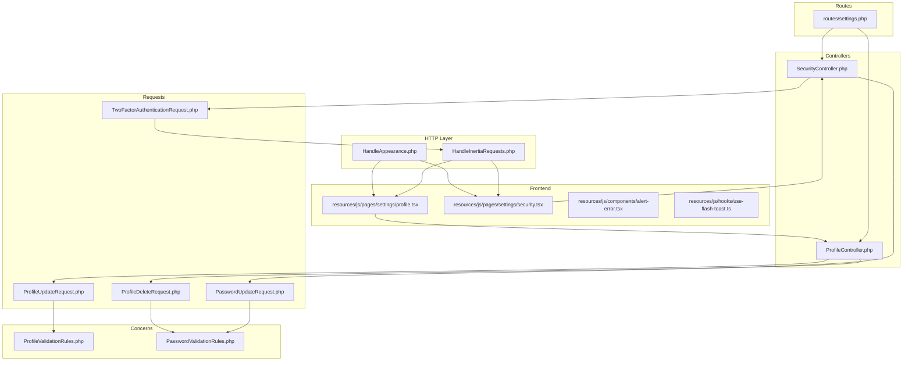
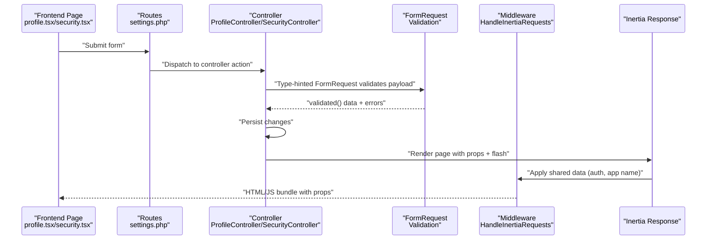
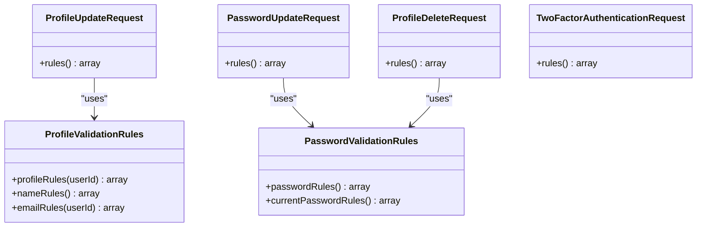
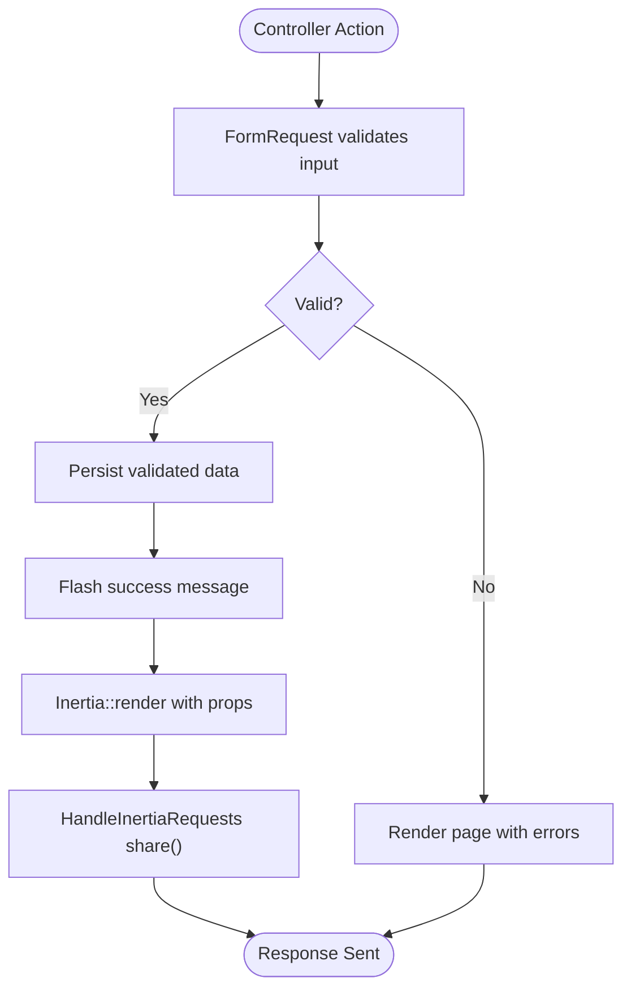
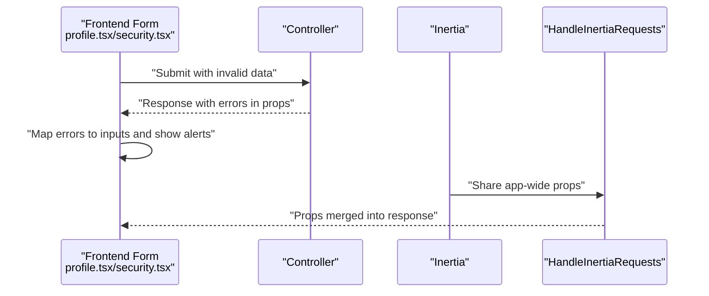
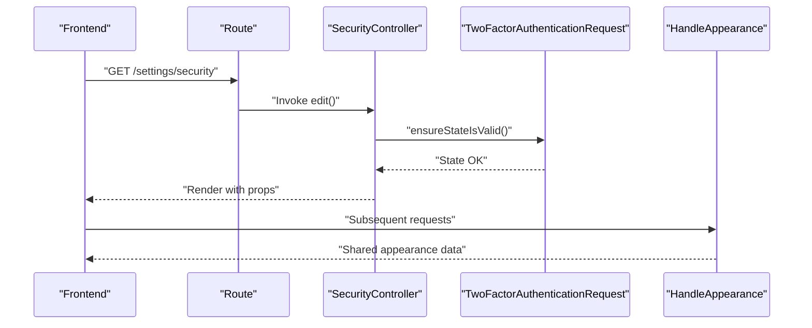
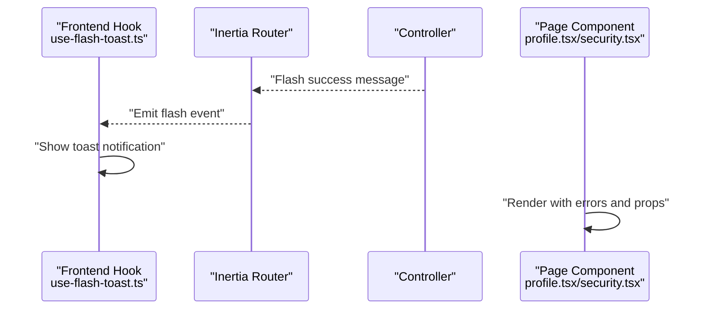
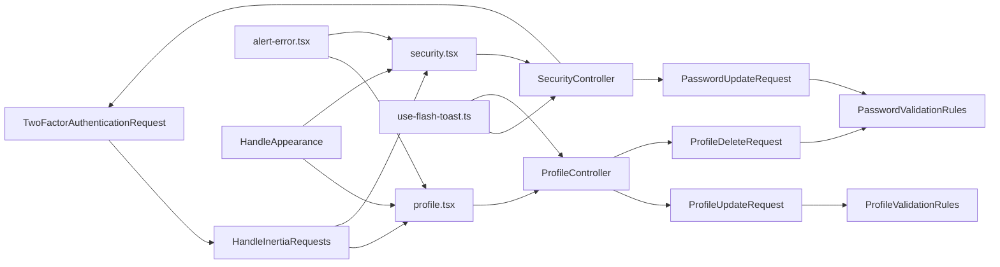

# Request & Response Handling

<cite>
**Referenced Files in This Document**
- [HandleInertiaRequests.php](file://app/Http/Middleware/HandleInertiaRequests.php)
- [HandleAppearance.php](file://app/Http/Middleware/HandleAppearance.php)
- [ProfileUpdateRequest.php](file://app/Http/Requests/Settings/ProfileUpdateRequest.php)
- [PasswordUpdateRequest.php](file://app/Http/Requests/Settings/PasswordUpdateRequest.php)
- [ProfileDeleteRequest.php](file://app/Http/Requests/Settings/ProfileDeleteRequest.php)
- [TwoFactorAuthenticationRequest.php](file://app/Http/Requests/Settings/TwoFactorAuthenticationRequest.php)
- [ProfileValidationRules.php](file://app/Concerns/ProfileValidationRules.php)
- [PasswordValidationRules.php](file://app/Concerns/PasswordValidationRules.php)
- [ProfileController.php](file://app/Http/Controllers/Settings/ProfileController.php)
- [SecurityController.php](file://app/Http/Controllers/Settings/SecurityController.php)
- [settings.php](file://routes/settings.php)
- [profile.tsx](file://resources/js/pages/settings/profile.tsx)
- [security.tsx](file://resources/js/pages/settings/security.tsx)
- [alert-error.tsx](file://resources/js/components/alert-error.tsx)
- [use-flash-toast.ts](file://resources/js/hooks/use-flash-toast.ts)
- [inertia.php](file://config/inertia.php)
</cite>

## Table of Contents
1. [Introduction](#introduction)
2. [Project Structure](#project-structure)
3. [Core Components](#core-components)
4. [Architecture Overview](#architecture-overview)
5. [Detailed Component Analysis](#detailed-component-analysis)
6. [Dependency Analysis](#dependency-analysis)
7. [Performance Considerations](#performance-considerations)
8. [Troubleshooting Guide](#troubleshooting-guide)
9. [Conclusion](#conclusion)

## Introduction
This document explains request validation and response formatting for synthesis endpoints within the settings module. It covers:
- Request validation classes and parameter validation rules
- Error response structures and frontend integration
- Response transformation pipeline, data serialization, and format standardization
- Examples of request preprocessing, validation error handling, and response caching strategies
- Integration with frontend request patterns and Inertia.js response handling

## Project Structure
The settings-related request validation and response handling spans backend request classes, controllers, middleware, and frontend pages/components. Routes define endpoint semantics and middleware stacks, while Inertia.js middleware and configuration govern shared data and SSR behavior.

**Diagram sources**
- [settings.php:1-35](file://routes/settings.php#L1-L35)
- [HandleInertiaRequests.php:1-48](file://app/Http/Middleware/HandleInertiaRequests.php#L1-L48)
- [HandleAppearance.php:1-24](file://app/Http/Middleware/HandleAppearance.php#L1-L24)
- [ProfileUpdateRequest.php:1-23](file://app/Http/Requests/Settings/ProfileUpdateRequest.php#L1-L23)
- [PasswordUpdateRequest.php:1-26](file://app/Http/Requests/Settings/PasswordUpdateRequest.php#L1-L26)
- [ProfileDeleteRequest.php:1-25](file://app/Http/Requests/Settings/ProfileDeleteRequest.php#L1-L25)
- [TwoFactorAuthenticationRequest.php:1-23](file://app/Http/Requests/Settings/TwoFactorAuthenticationRequest.php#L1-L23)
- [ProfileValidationRules.php:1-52](file://app/Concerns/ProfileValidationRules.php#L1-L52)
- [PasswordValidationRules.php:1-30](file://app/Concerns/PasswordValidationRules.php#L1-L30)
- [ProfileController.php:1-63](file://app/Http/Controllers/Settings/ProfileController.php#L1-L63)
- [SecurityController.php:1-67](file://app/Http/Controllers/Settings/SecurityController.php#L1-L67)
- [profile.tsx:1-139](file://resources/js/pages/settings/profile.tsx#L1-L139)
- [security.tsx:1-148](file://resources/js/pages/settings/security.tsx#L1-L148)
- [alert-error.tsx:1-25](file://resources/js/components/alert-error.tsx#L1-L25)
- [use-flash-toast.ts:1-20](file://resources/js/hooks/use-flash-toast.ts#L1-L20)

**Section sources**
- [settings.php:1-35](file://routes/settings.php#L1-L35)
- [HandleInertiaRequests.php:1-48](file://app/Http/Middleware/HandleInertiaRequests.php#L1-L48)
- [HandleAppearance.php:1-24](file://app/Http/Middleware/HandleAppearance.php#L1-L24)

## Core Components
- Request validation classes encapsulate parameter rules via Laravel FormRequest and reusable validation traits.
- Controllers orchestrate request preprocessing, validation, persistence, and response formatting.
- Middleware prepares shared data for Inertia.js and handles appearance preferences.
- Frontend pages bind form submissions to controller actions and render validation errors and flash messages.

Key responsibilities:
- Validation rules: enforce required fields, string constraints, email format, uniqueness, and password strength.
- Error handling: collect field-specific errors and surface them in the UI.
- Response formatting: Inertia renders pages with props and flashes success notifications.
- Frontend integration: forms submit via Inertia, preserving scroll position and resetting on success/error.

**Section sources**
- [ProfileUpdateRequest.php:1-23](file://app/Http/Requests/Settings/ProfileUpdateRequest.php#L1-L23)
- [PasswordUpdateRequest.php:1-26](file://app/Http/Requests/Settings/PasswordUpdateRequest.php#L1-L26)
- [ProfileDeleteRequest.php:1-25](file://app/Http/Requests/Settings/ProfileDeleteRequest.php#L1-L25)
- [TwoFactorAuthenticationRequest.php:1-23](file://app/Http/Requests/Settings/TwoFactorAuthenticationRequest.php#L1-L23)
- [ProfileValidationRules.php:1-52](file://app/Concerns/ProfileValidationRules.php#L1-L52)
- [PasswordValidationRules.php:1-30](file://app/Concerns/PasswordValidationRules.php#L1-L30)
- [ProfileController.php:1-63](file://app/Http/Controllers/Settings/ProfileController.php#L1-L63)
- [SecurityController.php:1-67](file://app/Http/Controllers/Settings/SecurityController.php#L1-L67)

## Architecture Overview
The request lifecycle follows a predictable flow: route dispatches to a controller action, the action receives a validated request object, the controller persists changes, and Inertia renders the response with shared props and flash messages.

**Diagram sources**
- [settings.php:1-35](file://routes/settings.php#L1-L35)
- [ProfileController.php:1-63](file://app/Http/Controllers/Settings/ProfileController.php#L1-L63)
- [SecurityController.php:1-67](file://app/Http/Controllers/Settings/SecurityController.php#L1-L67)
- [HandleInertiaRequests.php:1-48](file://app/Http/Middleware/HandleInertiaRequests.php#L1-L48)
- [profile.tsx:1-139](file://resources/js/pages/settings/profile.tsx#L1-L139)
- [security.tsx:1-148](file://resources/js/pages/settings/security.tsx#L1-L148)

## Detailed Component Analysis

### Request Validation Classes and Parameter Rules
- ProfileUpdateRequest: applies name and email rules via ProfileValidationRules.
- PasswordUpdateRequest: enforces current password and new password rules via PasswordValidationRules.
- ProfileDeleteRequest: requires current password for destructive actions.
- TwoFactorAuthenticationRequest: integrates with Laravel Fortify’s two-factor state handling.

Validation traits centralize rule definitions:
- Name: required string, max length.
- Email: required, string, email format, max length, unique constraint (ignoring current user when editing).
- Password: required, string, strong password policy, confirmed.
- Current password: required, string, matches user’s current password.

**Diagram sources**
- [ProfileUpdateRequest.php:1-23](file://app/Http/Requests/Settings/ProfileUpdateRequest.php#L1-L23)
- [PasswordUpdateRequest.php:1-26](file://app/Http/Requests/Settings/PasswordUpdateRequest.php#L1-L26)
- [ProfileDeleteRequest.php:1-25](file://app/Http/Requests/Settings/ProfileDeleteRequest.php#L1-L25)
- [TwoFactorAuthenticationRequest.php:1-23](file://app/Http/Requests/Settings/TwoFactorAuthenticationRequest.php#L1-L23)
- [ProfileValidationRules.php:1-52](file://app/Concerns/ProfileValidationRules.php#L1-L52)
- [PasswordValidationRules.php:1-30](file://app/Concerns/PasswordValidationRules.php#L1-L30)

**Section sources**
- [ProfileUpdateRequest.php:1-23](file://app/Http/Requests/Settings/ProfileUpdateRequest.php#L1-L23)
- [PasswordUpdateRequest.php:1-26](file://app/Http/Requests/Settings/PasswordUpdateRequest.php#L1-L26)
- [ProfileDeleteRequest.php:1-25](file://app/Http/Requests/Settings/ProfileDeleteRequest.php#L1-L25)
- [TwoFactorAuthenticationRequest.php:1-23](file://app/Http/Requests/Settings/TwoFactorAuthenticationRequest.php#L1-L23)
- [ProfileValidationRules.php:1-52](file://app/Concerns/ProfileValidationRules.php#L1-L52)
- [PasswordValidationRules.php:1-30](file://app/Concerns/PasswordValidationRules.php#L1-L30)

### Response Transformation Pipeline and Data Serialization
- Controllers transform validated data into model updates and render Inertia responses.
- Shared data (application name, authenticated user, sidebar state) is injected by HandleInertiaRequests.
- Flash messages propagate success notifications to the frontend via Inertia.

**Diagram sources**
- [ProfileController.php:1-63](file://app/Http/Controllers/Settings/ProfileController.php#L1-L63)
- [SecurityController.php:1-67](file://app/Http/Controllers/Settings/SecurityController.php#L1-L67)
- [HandleInertiaRequests.php:1-48](file://app/Http/Middleware/HandleInertiaRequests.php#L1-L48)

**Section sources**
- [ProfileController.php:1-63](file://app/Http/Controllers/Settings/ProfileController.php#L1-L63)
- [SecurityController.php:1-67](file://app/Http/Controllers/Settings/SecurityController.php#L1-L67)
- [HandleInertiaRequests.php:1-48](file://app/Http/Middleware/HandleInertiaRequests.php#L1-L48)

### Error Response Structures and Frontend Handling
- Field-specific validation errors are exposed to the frontend through Inertia’s props.
- Frontend pages display errors per field and focus the first invalid input on submission failure.
- A dedicated error alert component normalizes error presentation.

**Diagram sources**
- [profile.tsx:1-139](file://resources/js/pages/settings/profile.tsx#L1-L139)
- [security.tsx:1-148](file://resources/js/pages/settings/security.tsx#L1-L148)
- [alert-error.tsx:1-25](file://resources/js/components/alert-error.tsx#L1-L25)
- [HandleInertiaRequests.php:1-48](file://app/Http/Middleware/HandleInertiaRequests.php#L1-L48)

**Section sources**
- [profile.tsx:1-139](file://resources/js/pages/settings/profile.tsx#L1-L139)
- [security.tsx:1-148](file://resources/js/pages/settings/security.tsx#L1-L148)
- [alert-error.tsx:1-25](file://resources/js/components/alert-error.tsx#L1-L25)

### Request Preprocessing and Two-Factor State Handling
- TwoFactorAuthenticationRequest leverages Laravel Fortify’s state management helpers to ensure validity before rendering security settings.
- Appearance middleware shares theme preference across requests, influencing frontend rendering.

**Diagram sources**
- [settings.php:1-35](file://routes/settings.php#L1-L35)
- [SecurityController.php:1-67](file://app/Http/Controllers/Settings/SecurityController.php#L1-L67)
- [TwoFactorAuthenticationRequest.php:1-23](file://app/Http/Requests/Settings/TwoFactorAuthenticationRequest.php#L1-L23)
- [HandleAppearance.php:1-24](file://app/Http/Middleware/HandleAppearance.php#L1-L24)

**Section sources**
- [SecurityController.php:1-67](file://app/Http/Controllers/Settings/SecurityController.php#L1-L67)
- [TwoFactorAuthenticationRequest.php:1-23](file://app/Http/Requests/Settings/TwoFactorAuthenticationRequest.php#L1-L23)
- [HandleAppearance.php:1-24](file://app/Http/Middleware/HandleAppearance.php#L1-L24)

### Response Caching Strategies
- Inertia.js supports client-side caching and optimistic updates; the frontend pages leverage preserveScroll and reset behaviors to minimize redundant fetches and improve perceived performance.
- Server-side caching is not explicitly configured for these endpoints; focus remains on efficient request validation and minimal response payloads.

[No sources needed since this section provides general guidance]

### Integration with Frontend Patterns and Inertia.js
- Frontend pages bind to controller actions using Inertia forms, preserving scroll position and resetting inputs on success or error.
- Flash messages are surfaced via a React hook that listens to Inertia’s flash event and triggers toast notifications.
- Shared props (auth, app name, sidebar state) are standardized by the Inertia middleware.

**Diagram sources**
- [use-flash-toast.ts:1-20](file://resources/js/hooks/use-flash-toast.ts#L1-L20)
- [ProfileController.php:1-63](file://app/Http/Controllers/Settings/ProfileController.php#L1-L63)
- [SecurityController.php:1-67](file://app/Http/Controllers/Settings/SecurityController.php#L1-L67)
- [profile.tsx:1-139](file://resources/js/pages/settings/profile.tsx#L1-L139)
- [security.tsx:1-148](file://resources/js/pages/settings/security.tsx#L1-L148)

**Section sources**
- [profile.tsx:1-139](file://resources/js/pages/settings/profile.tsx#L1-L139)
- [security.tsx:1-148](file://resources/js/pages/settings/security.tsx#L1-L148)
- [use-flash-toast.ts:1-20](file://resources/js/hooks/use-flash-toast.ts#L1-L20)
- [HandleInertiaRequests.php:1-48](file://app/Http/Middleware/HandleInertiaRequests.php#L1-L48)
- [inertia.php:1-71](file://config/inertia.php#L1-L71)

## Dependency Analysis
The following diagram highlights key dependencies among request validation, controllers, middleware, and frontend components.

**Diagram sources**
- [ProfileUpdateRequest.php:1-23](file://app/Http/Requests/Settings/ProfileUpdateRequest.php#L1-L23)
- [PasswordUpdateRequest.php:1-26](file://app/Http/Requests/Settings/PasswordUpdateRequest.php#L1-L26)
- [ProfileDeleteRequest.php:1-25](file://app/Http/Requests/Settings/ProfileDeleteRequest.php#L1-L25)
- [TwoFactorAuthenticationRequest.php:1-23](file://app/Http/Requests/Settings/TwoFactorAuthenticationRequest.php#L1-L23)
- [ProfileValidationRules.php:1-52](file://app/Concerns/ProfileValidationRules.php#L1-L52)
- [PasswordValidationRules.php:1-30](file://app/Concerns/PasswordValidationRules.php#L1-L30)
- [ProfileController.php:1-63](file://app/Http/Controllers/Settings/ProfileController.php#L1-L63)
- [SecurityController.php:1-67](file://app/Http/Controllers/Settings/SecurityController.php#L1-L67)
- [profile.tsx:1-139](file://resources/js/pages/settings/profile.tsx#L1-L139)
- [security.tsx:1-148](file://resources/js/pages/settings/security.tsx#L1-L148)
- [alert-error.tsx:1-25](file://resources/js/components/alert-error.tsx#L1-L25)
- [use-flash-toast.ts:1-20](file://resources/js/hooks/use-flash-toast.ts#L1-L20)
- [HandleInertiaRequests.php:1-48](file://app/Http/Middleware/HandleInertiaRequests.php#L1-L48)
- [HandleAppearance.php:1-24](file://app/Http/Middleware/HandleAppearance.php#L1-L24)

**Section sources**
- [settings.php:1-35](file://routes/settings.php#L1-L35)
- [HandleInertiaRequests.php:1-48](file://app/Http/Middleware/HandleInertiaRequests.php#L1-L48)
- [HandleAppearance.php:1-24](file://app/Http/Middleware/HandleAppearance.php#L1-L24)

## Performance Considerations
- Keep validation rules concise and targeted to reduce overhead.
- Prefer client-side resets and scroll preservation to avoid unnecessary re-fetches.
- Avoid heavy transformations in middleware; keep shared data minimal and cacheable where appropriate.
- Use throttling for sensitive endpoints (as seen in the password update route) to mitigate abuse.

[No sources needed since this section provides general guidance]

## Troubleshooting Guide
Common issues and resolutions:
- Validation failures: Inspect field-specific errors propagated to the frontend and ensure the form displays them accurately.
- Missing flash notifications: Verify the controller flashes a toast and the frontend hook listens to the flash event.
- Two-factor state errors: Ensure the request invokes state validation before rendering security settings.
- Appearance mismatch: Confirm the appearance cookie is set and the middleware shares the value consistently.

**Section sources**
- [profile.tsx:1-139](file://resources/js/pages/settings/profile.tsx#L1-L139)
- [security.tsx:1-148](file://resources/js/pages/settings/security.tsx#L1-L148)
- [use-flash-toast.ts:1-20](file://resources/js/hooks/use-flash-toast.ts#L1-L20)
- [SecurityController.php:1-67](file://app/Http/Controllers/Settings/SecurityController.php#L1-L67)
- [HandleAppearance.php:1-24](file://app/Http/Middleware/HandleAppearance.php#L1-L24)

## Conclusion
The settings endpoints demonstrate a clean separation of concerns: robust request validation via FormRequest and reusable traits, predictable controller actions, and seamless Inertia.js integration for responsive UI updates. Shared middleware ensures consistent props and appearance handling, while the frontend pages provide immediate feedback through error rendering and flash notifications.