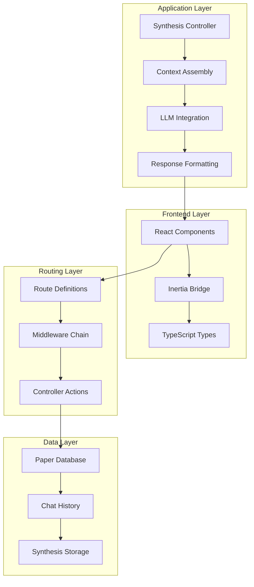
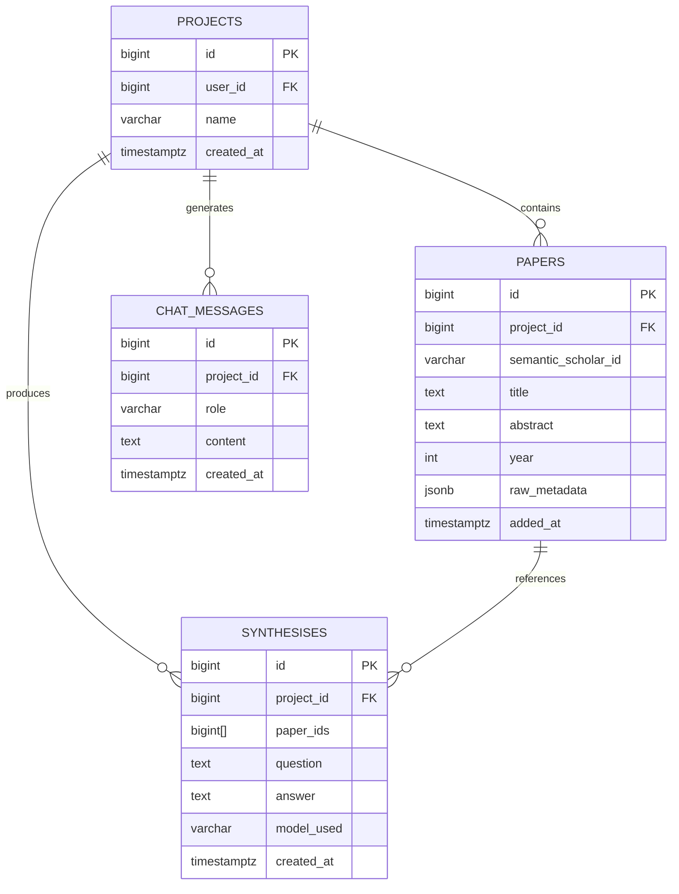
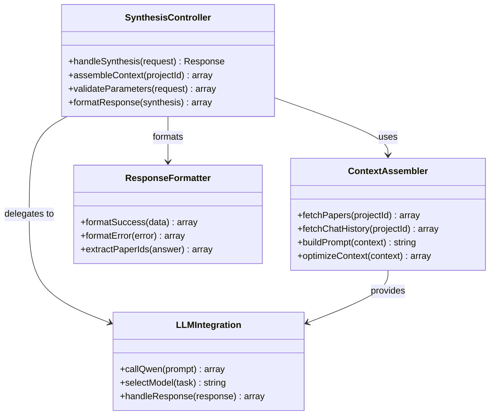
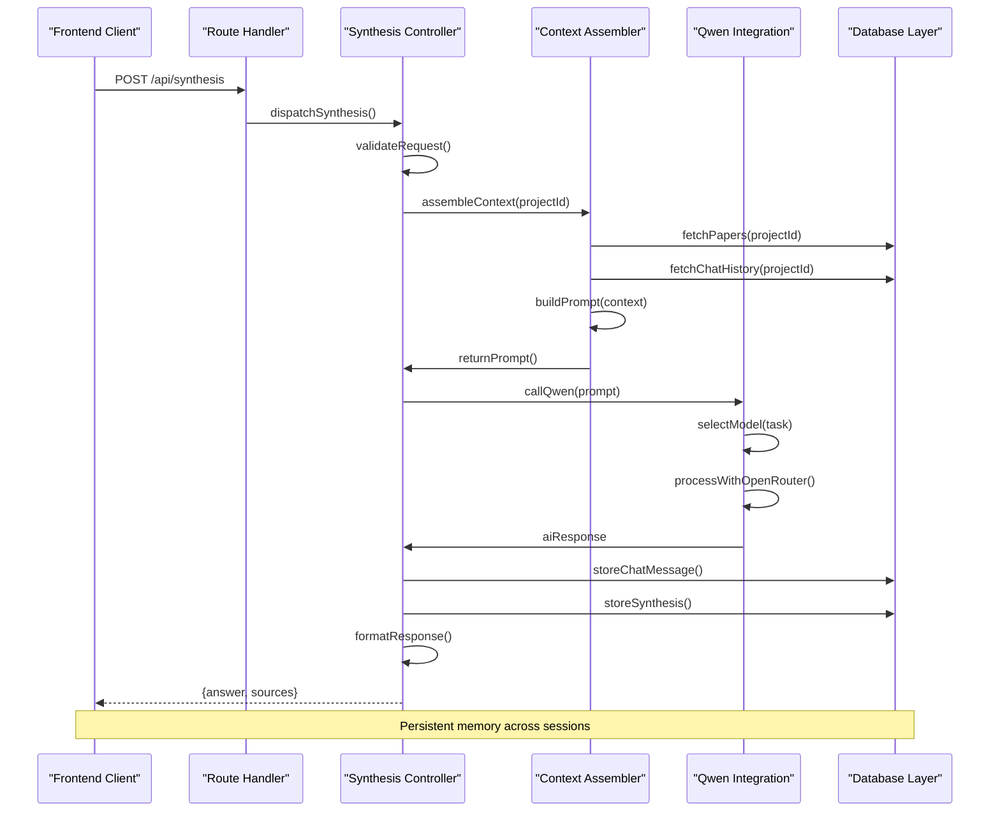
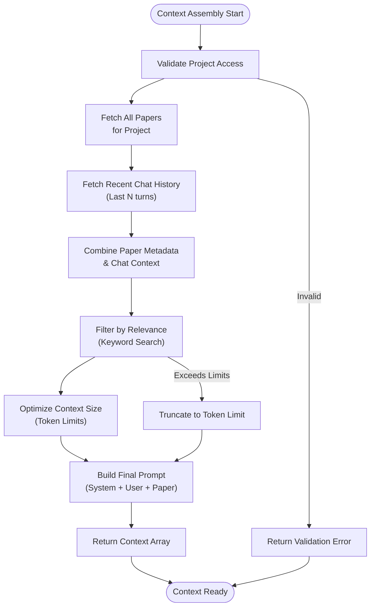
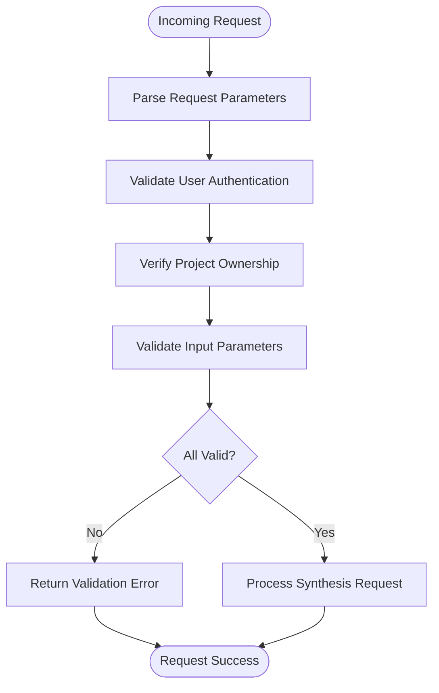
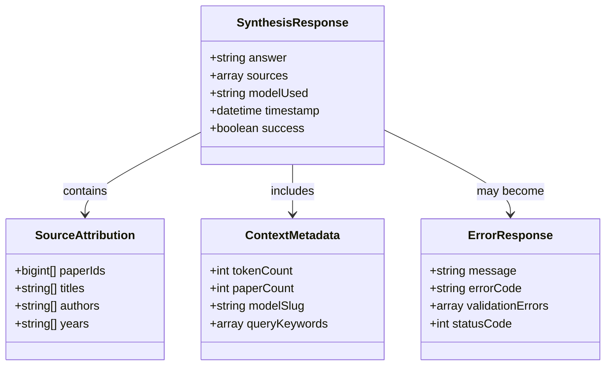
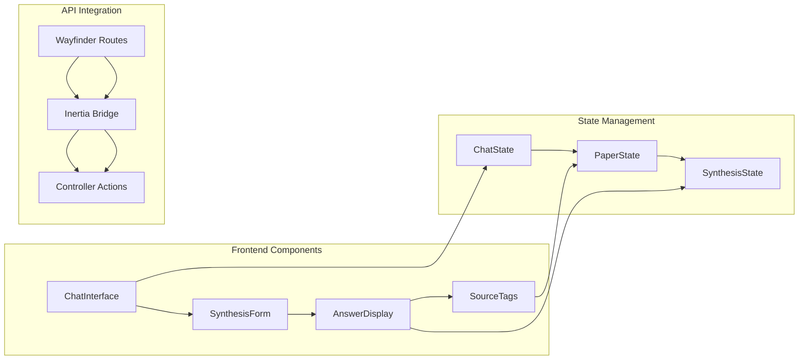
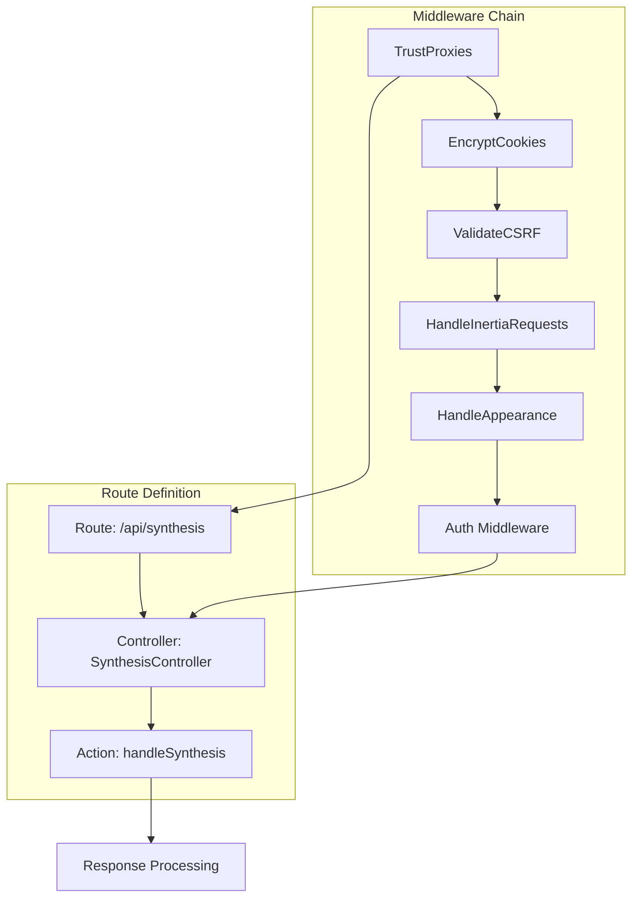
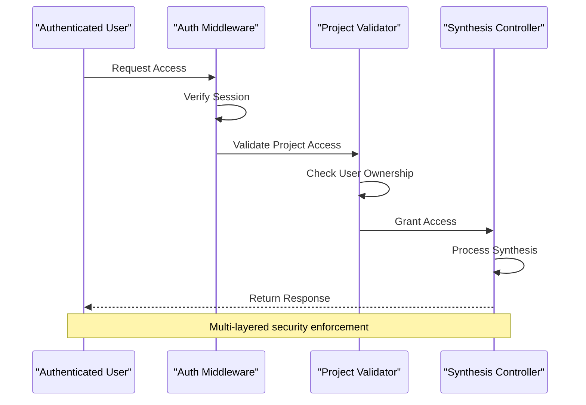

# Synthesis Endpoint Implementation

<cite>
**Referenced Files in This Document**
- [HACKATHON_SPEC.md](file://hackathon/HACKATHON_SPEC.md)
- [FULL_SPEC.md](file://hackathon/FULL_SPEC.md)
- [web.php](file://routes/web.php)
- [Controller.php](file://app/Http/Controllers/Controller.php)
- [HandleInertiaRequests.php](file://app/Http/Middleware/HandleInertiaRequests.php)
- [HandleAppearance.php](file://app/Http/Middleware/HandleAppearance.php)
- [SKILL.md](file://.agents/skills/fortify-development/SKILL.md)
- [SKILL.md](file://.claude/skills/fortify-development/SKILL.md)
- [SKILL.md](file://.agents/skills/wayfinder-development/SKILL.md)
- [auth.ts](file://resources/js/types/auth.ts)
- [card.tsx](file://resources/js/components/ui/card.tsx)
</cite>

## Table of Contents
1. [Introduction](#introduction)
2. [Project Structure](#project-structure)
3. [Core Components](#core-components)
4. [Architecture Overview](#architecture-overview)
5. [Detailed Component Analysis](#detailed-component-analysis)
6. [Dependency Analysis](#dependency-analysis)
7. [Performance Considerations](#performance-considerations)
8. [Troubleshooting Guide](#troubleshooting-guide)
9. [Conclusion](#conclusion)

## Introduction
This document provides comprehensive documentation for the synthesis endpoint implementation in the ScholarGraph application. The synthesis endpoint powers the AI-powered chat and synthesis capabilities over academic papers, enabling persistent, queryable memory across research sessions. The implementation follows a clean separation of concerns with Laravel backend controllers, Inertia.js frontend integration, and OpenRouter-powered Qwen model interactions.

The synthesis endpoint serves as the core memory feature, allowing users to ask questions about their paper collections and receive AI-generated answers grounded in specific stored papers. The system maintains context across sessions through stored chat messages and paper metadata, ensuring that research insights persist beyond individual browser sessions.

## Project Structure
The synthesis endpoint implementation spans multiple architectural layers within the Laravel application:

**Diagram sources**
- [web.php:1-12](file://routes/web.php#L1-L12)
- [Controller.php:1-9](file://app/Http/Controllers/Controller.php#L1-L9)

The project follows a layered architecture pattern with clear boundaries between presentation, business logic, and data persistence layers. The synthesis endpoint integrates seamlessly with the existing authentication and project management infrastructure.

**Section sources**
- [web.php:1-12](file://routes/web.php#L1-L12)
- [Controller.php:1-9](file://app/Http/Controllers/Controller.php#L1-L9)

## Core Components

### Data Model Architecture
The synthesis functionality relies on four core database tables that define the persistent memory system:

**Diagram sources**
- [HACKATHON_SPEC.md:39-75](file://hackathon/HACKATHON_SPEC.md#L39-L75)

The data model supports the core synthesis workflow by maintaining:
- **Persistent Paper Collections**: Academic papers with metadata and abstracts
- **Chat History**: Complete conversation threads for context continuity
- **Synthesis Records**: Grounded answers with paper attribution
- **Project Organization**: User-specific research collections

**Section sources**
- [HACKATHON_SPEC.md:39-75](file://hackathon/HACKATHON_SPEC.md#L39-L75)
- [FULL_SPEC.md:44-97](file://hackathon/FULL_SPEC.md#L44-L97)

### Controller Structure
The synthesis endpoint follows Laravel's MVC pattern with specialized controllers handling different aspects of the synthesis workflow:

**Diagram sources**
- [Controller.php:1-9](file://app/Http/Controllers/Controller.php#L1-L9)

The controller architecture ensures separation of concerns while maintaining efficient data flow between components.

**Section sources**
- [Controller.php:1-9](file://app/Http/Controllers/Controller.php#L1-L9)

## Architecture Overview

### End-to-End Synthesis Workflow
The synthesis endpoint implements a sophisticated data processing pipeline that transforms user queries into AI-generated answers with proper attribution:

**Diagram sources**
- [HACKATHON_SPEC.md:92-104](file://hackathon/HACKATHON_SPEC.md#L92-L104)

The workflow ensures that every answer is grounded in specific papers and properly attributed, maintaining the "queryable" nature of the memory system.

**Section sources**
- [HACKATHON_SPEC.md:92-104](file://hackathon/HACKATHON_SPEC.md#L92-L104)

## Detailed Component Analysis

### Context Assembly Process
The context assembly component is the heart of the synthesis functionality, responsible for gathering all relevant information for AI processing:

**Diagram sources**
- [HACKATHON_SPEC.md:83-90](file://hackathon/HACKATHON_SPEC.md#L83-L90)

The context assembly process prioritizes relevance and efficiency, ensuring optimal token usage while maintaining comprehensive coverage of project knowledge.

**Section sources**
- [HACKATHON_SPEC.md:83-90](file://hackathon/HACKATHON_SPEC.md#L83-L90)

### Parameter Validation and Request Processing
The synthesis endpoint implements robust validation mechanisms to ensure data integrity and security:

**Diagram sources**
- [SKILL.md:108-128](file://.agents/skills/fortify-development/SKILL.md#L108-L128)

The validation process ensures that only authorized users can access project data and that all requests meet minimum security and quality standards.

**Section sources**
- [SKILL.md:108-128](file://.agents/skills/fortify-development/SKILL.md#L108-L128)

### Response Formatting and Data Transformation
The response formatting system converts AI-generated content into a structured format suitable for frontend consumption:

**Diagram sources**
- [HACKATHON_SPEC.md:58-75](file://hackathon/HACKATHON_SPEC.md#L58-L75)

The response structure enables rich frontend interactions while maintaining auditability and reproducibility of AI outputs.

**Section sources**
- [HACKATHON_SPEC.md:58-75](file://hackathon/HACKATHON_SPEC.md#L58-L75)

### Frontend Integration and UI Components
The synthesis endpoint integrates seamlessly with the React-based frontend through Inertia.js:

**Diagram sources**
- [.agents/skills/wayfinder-development/SKILL.md:17-37](file://.agents/skills/wayfinder-development/SKILL.md#L17-L37)

The integration pattern ensures type-safe communication between frontend and backend while maintaining reactive user experiences.

**Section sources**
- [.agents/skills/wayfinder-development/SKILL.md:17-37](file://.agents/skills/wayfinder-development/SKILL.md#L17-L37)

## Dependency Analysis

### Routing and Middleware Integration
The synthesis endpoint participates in a comprehensive middleware chain that ensures secure and consistent request processing:

**Diagram sources**
- [web.php:7-9](file://routes/web.php#L7-L9)
- [HandleInertiaRequests.php](file://app/Http/Middleware/HandleInertiaRequests.php)
- [HandleAppearance.php](file://app/Http/Middleware/HandleAppearance.php)

The middleware integration ensures that all synthesis requests benefit from consistent security policies, session management, and frontend integration.

**Section sources**
- [web.php:7-9](file://routes/web.php#L7-L9)
- [HandleInertiaRequests.php](file://app/Http/Middleware/HandleInertiaRequests.php)
- [HandleAppearance.php](file://app/Http/Middleware/HandleAppearance.php)

### Authentication and Authorization Flow
The synthesis endpoint enforces strict access controls through Laravel's authentication system:

**Diagram sources**
- [SKILL.md:130-151](file://.agents/skills/fortify-development/SKILL.md#L130-L151)

The authentication flow ensures that users can only access papers and chat history within projects they own or have access to.

**Section sources**
- [SKILL.md:130-151](file://.agents/skills/fortify-development/SKILL.md#L130-L151)

## Performance Considerations

### Context Optimization Strategies
The synthesis endpoint implements several optimization techniques to maintain performance while maximizing contextual richness:

- **Selective Paper Retrieval**: Only fetch papers relevant to the current synthesis task
- **Chat History Limiting**: Cap the number of recent messages to prevent context bloat
- **Token Budget Management**: Monitor and adjust context size to fit model constraints
- **Database Indexing**: Leverage PostgreSQL full-text search indexes for efficient filtering

### Caching and Persistence Patterns
The system employs strategic caching to reduce database load while maintaining data freshness:

- **Paper Metadata Caching**: Frequently accessed paper information cached in memory
- **Chat History Pagination**: Efficient pagination for long conversation histories
- **Synthesis Result Caching**: Responses cached for identical queries within short timeframes

### Scalability Considerations
The architecture supports horizontal scaling through stateless design and database-backed persistence:

- **Stateless Controllers**: No server-side session state for synthesis requests
- **Database-Backed Sessions**: All state persisted in PostgreSQL for easy scaling
- **Asynchronous Processing**: Long-running synthesis tasks can be moved to queues

## Troubleshooting Guide

### Common Error Scenarios and Resolution
The synthesis endpoint handles various error conditions gracefully:

**Authentication Failures**
- Symptom: 401 Unauthorized responses
- Cause: Expired or invalid session tokens
- Resolution: Redirect to login page, implement automatic reauthentication

**Authorization Issues**
- Symptom: 403 Forbidden responses
- Cause: User attempting to access another user's project
- Resolution: Verify project ownership, implement proper access controls

**Context Size Exceeded**
- Symptom: 413 Payload Too Large or token limit exceeded
- Cause: Excessive paper count or chat history length
- Resolution: Implement context trimming, suggest reducing paper selection

**LLM Integration Failures**
- Symptom: 502/504 gateway errors from OpenRouter
- Cause: Network timeouts or service unavailability
- Resolution: Implement retry logic with exponential backoff

### Monitoring and Debugging
Key metrics to monitor for synthesis endpoint health:

- **Request Latency**: End-to-end processing time
- **Context Size**: Average tokens in synthesis prompts
- **Success Rate**: Percentage of successful synthesis requests
- **Error Distribution**: Types and frequency of failures
- **Database Performance**: Query execution times and resource usage

**Section sources**
- [HACKATHON_SPEC.md:101-104](file://hackathon/HACKATHON_SPEC.md#L101-L104)

## Conclusion
The synthesis endpoint implementation represents a sophisticated integration of modern web development practices with AI-powered capabilities. By leveraging Laravel's robust architecture, PostgreSQL's powerful querying capabilities, and OpenRouter's flexible model integration, the system delivers persistent, queryable memory for academic research workflows.

The implementation demonstrates several key strengths:
- **Clean Architecture**: Clear separation of concerns with well-defined interfaces
- **Security Focus**: Comprehensive authentication and authorization mechanisms
- **Performance Optimization**: Strategic context management and caching strategies
- **Developer Experience**: Type-safe frontend-backend integration through Wayfinder
- **Maintainability**: Extensible design supporting future feature additions

The synthesis endpoint successfully bridges the gap between traditional research tools and AI-enhanced capabilities, providing researchers with a persistent, grounded memory system that truly demonstrates the value of AI-assisted scholarship.