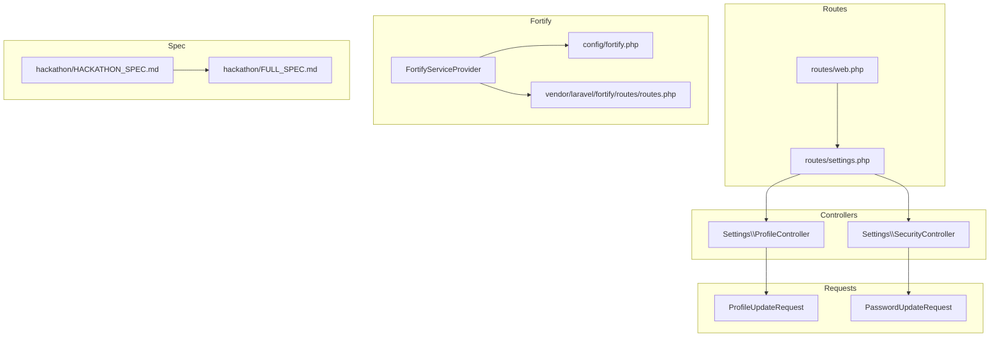
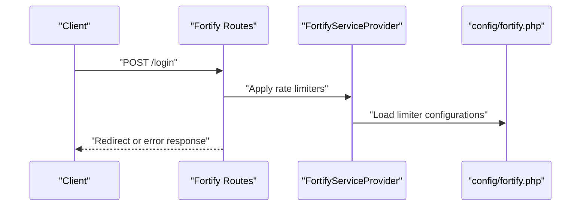
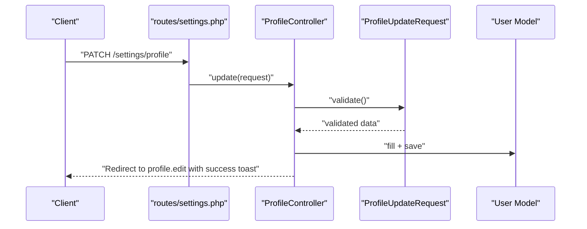
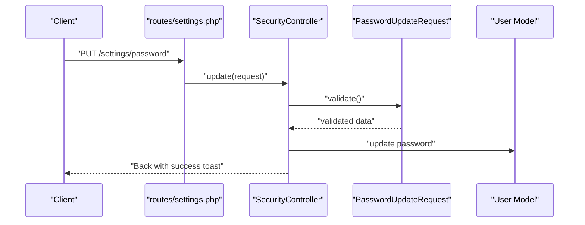
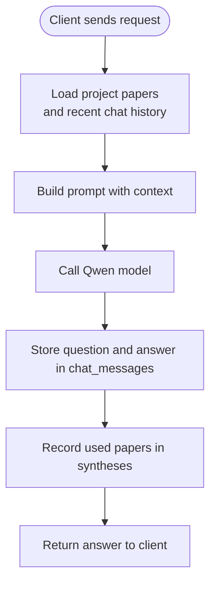
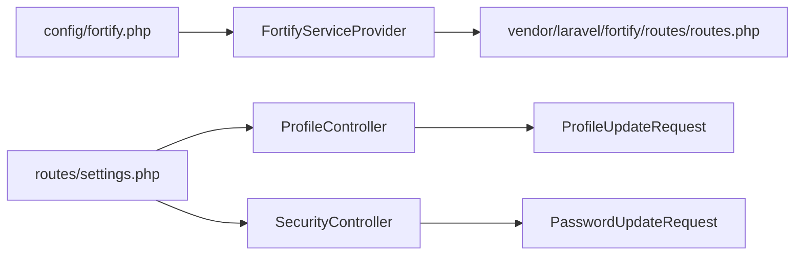

# API Reference

<cite>
**Referenced Files in This Document**
- [routes/web.php](file://routes/web.php)
- [routes/settings.php](file://routes/settings.php)
- [app/Http/Controllers/Settings/ProfileController.php](file://app/Http/Controllers/Settings/ProfileController.php)
- [app/Http/Controllers/Settings/SecurityController.php](file://app/Http/Controllers/Settings/SecurityController.php)
- [app/Http/Requests/Settings/ProfileUpdateRequest.php](file://app/Http/Requests/Settings/ProfileUpdateRequest.php)
- [app/Http/Requests/Settings/PasswordUpdateRequest.php](file://app/Http/Requests/Settings/PasswordUpdateRequest.php)
- [app/Concerns/PasswordValidationRules.php](file://app/Concerns/PasswordValidationRules.php)
- [app/Concerns/ProfileValidationRules.php](file://app/Concerns/ProfileValidationRules.php)
- [app/Providers/FortifyServiceProvider.php](file://app/Providers/FortifyServiceProvider.php)
- [config/fortify.php](file://config/fortify.php)
- [vendor/laravel/fortify/routes/routes.php](file://vendor/laravel/fortify/routes/routes.php)
- [hackathon/HACKATHON_SPEC.md](file://hackathon/HACKATHON_SPEC.md)
- [hackathon/FULL_SPEC.md](file://hackathon/FULL_SPEC.md)
</cite>

## Table of Contents
1. [Introduction](#introduction)
2. [Project Structure](#project-structure)
3. [Core Components](#core-components)
4. [Architecture Overview](#architecture-overview)
5. [Detailed Component Analysis](#detailed-component-analysis)
6. [Dependency Analysis](#dependency-analysis)
7. [Performance Considerations](#performance-considerations)
8. [Troubleshooting Guide](#troubleshooting-guide)
9. [Conclusion](#conclusion)
10. [Appendices](#appendices)

## Introduction
This document provides comprehensive API documentation for ScholarGraph’s public interfaces. It covers authentication endpoints, user settings endpoints, and outlines the synthesis and chat capabilities as defined in the project’s specification. The documentation details HTTP methods, URL patterns, request/response characteristics, authentication requirements, rate limiting, and error handling strategies. It also includes client implementation guidelines, testing strategies, and debugging approaches.

## Project Structure
The API surface is primarily composed of:
- Authentication and registration endpoints provided by Laravel Fortify
- Settings endpoints for profile and security management
- Well-known passkey endpoints for WebAuthn discovery
- Conceptual synthesis and chat endpoints described in the hackathon specification

**Diagram sources**
- [routes/web.php:1-12](file://routes/web.php#L1-L12)
- [routes/settings.php:1-35](file://routes/settings.php#L1-L35)
- [app/Http/Controllers/Settings/ProfileController.php:1-63](file://app/Http/Controllers/Settings/ProfileController.php#L1-L63)
- [app/Http/Controllers/Settings/SecurityController.php:1-67](file://app/Http/Controllers/Settings/SecurityController.php#L1-L67)
- [app/Http/Requests/Settings/ProfileUpdateRequest.php:1-23](file://app/Http/Requests/Settings/ProfileUpdateRequest.php#L1-L23)
- [app/Http/Requests/Settings/PasswordUpdateRequest.php:1-26](file://app/Http/Requests/Settings/PasswordUpdateRequest.php#L1-L26)
- [app/Providers/FortifyServiceProvider.php:1-101](file://app/Providers/FortifyServiceProvider.php#L1-L101)
- [config/fortify.php:1-178](file://config/fortify.php#L1-L178)
- [vendor/laravel/fortify/routes/routes.php](file://vendor/laravel/fortify/routes/routes.php)
- [hackathon/HACKATHON_SPEC.md:33-137](file://hackathon/HACKATHON_SPEC.md#L33-L137)
- [hackathon/FULL_SPEC.md:27-209](file://hackathon/FULL_SPEC.md#L27-L209)

**Section sources**
- [routes/web.php:1-12](file://routes/web.php#L1-L12)
- [routes/settings.php:1-35](file://routes/settings.php#L1-L35)

## Core Components
- Authentication and registration endpoints are provided by Laravel Fortify and rendered via Inertia views. These include login, logout, registration, password reset, email verification, two-factor challenge, and password confirmation.
- Settings endpoints:
  - Profile: GET/PUT profile settings; DELETE to close account.
  - Security: GET security settings (including passkeys and two-factor); PUT to update password with throttling.
  - Appearance: GET appearance settings page.
  - Well-known passkey endpoints: JSON discovery for passkey enrollment and management.

**Section sources**
- [vendor/laravel/fortify/routes/routes.php](file://vendor/laravel/fortify/routes/routes.php)
- [routes/settings.php:8-34](file://routes/settings.php#L8-L34)
- [app/Http/Controllers/Settings/ProfileController.php:15-62](file://app/Http/Controllers/Settings/ProfileController.php#L15-L62)
- [app/Http/Controllers/Settings/SecurityController.php:14-66](file://app/Http/Controllers/Settings/SecurityController.php#L14-L66)

## Architecture Overview
The API architecture integrates Fortify-provided endpoints with custom settings controllers. Fortify handles authentication flows and rate limiting. Settings endpoints operate behind authentication and optional verification middleware. The synthesis and chat endpoints are conceptual and defined in the hackathon specification.

**Diagram sources**
- [vendor/laravel/fortify/routes/routes.php](file://vendor/laravel/fortify/routes/routes.php)
- [app/Providers/FortifyServiceProvider.php:82-99](file://app/Providers/FortifyServiceProvider.php#L82-L99)
- [config/fortify.php:117-121](file://config/fortify.php#L117-L121)

## Detailed Component Analysis

### Authentication Endpoints (via Fortify)
These endpoints are provided by Laravel Fortify and rendered through Inertia views. They handle login, logout, registration, password reset, email verification, two-factor challenge, and password confirmation.

- Login
  - Method: POST
  - URL: /login
  - Authentication: None (initially)
  - Request: Form fields for credentials and remember token
  - Response: Redirect to home or dashboard; errors returned via Inertia props
  - Notes: Rate-limited by Fortify; see rate limiting section

- Logout
  - Method: POST
  - URL: /logout
  - Authentication: Required
  - Request: CSRF token
  - Response: Redirect to home

- Register
  - Method: POST
  - URL: /register
  - Authentication: None
  - Request: Name, email, password, password confirmation
  - Response: Redirect to dashboard after verification or as configured

- Forgot Password
  - Method: POST
  - URL: /forgot-password
  - Authentication: None
  - Request: Email
  - Response: Success message via Inertia props

- Reset Password
  - Method: POST
  - URL: /reset-password
  - Authentication: None
  - Request: Token, email, password, password confirmation
  - Response: Redirect to dashboard

- Verify Email
  - Method: GET
  - URL: /email/verify/{id}/{hash}
  - Authentication: None
  - Request: Signed verification link params
  - Response: Verified status via Inertia props

- Two-Factor Challenge
  - Method: GET/POST
  - URL: /user/two-factor-challenge
  - Authentication: None (during challenge)
  - Request: OTP code
  - Response: Redirect to dashboard after successful challenge

- Confirm Password
  - Method: GET/POST
  - URL: /user/confirm-password
  - Authentication: Required
  - Request: Password confirmation
  - Response: Proceed to requested action

- Password Confirmation Status
  - Method: GET
  - URL: /user/confirmed-password-status
  - Authentication: Required
  - Request: None
  - Response: Boolean status indicating confirmed password

**Section sources**
- [vendor/laravel/fortify/routes/routes.php](file://vendor/laravel/fortify/routes/routes.php)
- [app/Providers/FortifyServiceProvider.php:51-77](file://app/Providers/FortifyServiceProvider.php#L51-L77)
- [config/fortify.php:163-175](file://config/fortify.php#L163-L175)

### Settings Endpoints

#### Profile Management
- Edit Profile Page
  - Method: GET
  - URL: /settings/profile
  - Authentication: Required
  - Response: Inertia render with profile form props and email verification status

- Update Profile
  - Method: PATCH
  - URL: /settings/profile
  - Authentication: Required
  - Request: Name, email
  - Validation: Unique email per user; name constraints
  - Response: Redirect back to profile edit with success toast

- Close Account
  - Method: DELETE
  - URL: /settings/profile
  - Authentication: Required and verified
  - Request: None
  - Response: Redirect to home; session invalidated and token regenerated

**Diagram sources**
- [routes/settings.php:11-12](file://routes/settings.php#L11-L12)
- [app/Http/Controllers/Settings/ProfileController.php:31-44](file://app/Http/Controllers/Settings/ProfileController.php#L31-L44)
- [app/Http/Requests/Settings/ProfileUpdateRequest.php:18-21](file://app/Http/Requests/Settings/ProfileUpdateRequest.php#L18-L21)

**Section sources**
- [routes/settings.php:8-16](file://routes/settings.php#L8-L16)
- [app/Http/Controllers/Settings/ProfileController.php:15-62](file://app/Http/Controllers/Settings/ProfileController.php#L15-L62)
- [app/Http/Requests/Settings/ProfileUpdateRequest.php:9-22](file://app/Http/Requests/Settings/ProfileUpdateRequest.php#L9-L22)
- [app/Concerns/ProfileValidationRules.php:16-50](file://app/Concerns/ProfileValidationRules.php#L16-L50)

#### Security Management
- Security Settings Page
  - Method: GET
  - URL: /settings/security
  - Authentication: Required
  - Response: Inertia render with security options (two-factor, passkeys), passkey list, and password rules

- Update Password
  - Method: PUT
  - URL: /settings/password
  - Authentication: Required and verified
  - Throttling: 6 requests per minute
  - Request: Current password, new password, password confirmation
  - Validation: Current password must match; new password meets policy
  - Response: Redirect back with success toast

- Appearance Settings Page
  - Method: GET
  - URL: /settings/appearance
  - Authentication: Required and verified
  - Response: Inertia render for appearance preferences

**Diagram sources**
- [routes/settings.php:22-24](file://routes/settings.php#L22-L24)
- [app/Http/Controllers/Settings/SecurityController.php:56-65](file://app/Http/Controllers/Settings/SecurityController.php#L56-L65)
- [app/Http/Requests/Settings/PasswordUpdateRequest.php:18-24](file://app/Http/Requests/Settings/PasswordUpdateRequest.php#L18-L24)
- [app/Concerns/PasswordValidationRules.php:15-28](file://app/Concerns/PasswordValidationRules.php#L15-L28)

**Section sources**
- [routes/settings.php:15-27](file://routes/settings.php#L15-L27)
- [app/Http/Controllers/Settings/SecurityController.php:14-66](file://app/Http/Controllers/Settings/SecurityController.php#L14-L66)
- [app/Http/Requests/Settings/PasswordUpdateRequest.php:9-25](file://app/Http/Requests/Settings/PasswordUpdateRequest.php#L9-L25)
- [app/Concerns/PasswordValidationRules.php:8-29](file://app/Concerns/PasswordValidationRules.php#L8-L29)

#### Well-Known Passkey Endpoints
- Discovery Endpoint
  - Method: GET
  - URL: /.well-known/passkey-endpoints
  - Authentication: Optional
  - Response: JSON with enrollment and management route targets

**Section sources**
- [routes/settings.php:29-34](file://routes/settings.php#L29-L34)

### Synthesis and Chat Endpoints (Conceptual)
As defined in the hackathon specification, synthesis and chat are conceptual endpoints that:
- Accept a project’s papers (title + abstract) and chat history
- Use a single mid-size Qwen model to produce answers
- Persist both questions and answers in chat messages
- Record paper sets used for each answer in syntheses

**Diagram sources**
- [hackathon/HACKATHON_SPEC.md:92-104](file://hackathon/HACKATHON_SPEC.md#L92-L104)
- [hackathon/HACKATHON_SPEC.md:131-137](file://hackathon/HACKATHON_SPEC.md#L131-L137)

**Section sources**
- [hackathon/HACKATHON_SPEC.md:33-137](file://hackathon/HACKATHON_SPEC.md#L33-L137)
- [hackathon/FULL_SPEC.md:27-209](file://hackathon/FULL_SPEC.md#L27-L209)

## Dependency Analysis
- Fortify configuration and rate limiters are loaded via the service provider and configuration file.
- Settings routes depend on controllers and form requests for validation.
- Authentication endpoints rely on Fortify’s route definitions and middleware stack.

**Diagram sources**
- [config/fortify.php:117-121](file://config/fortify.php#L117-L121)
- [app/Providers/FortifyServiceProvider.php:82-99](file://app/Providers/FortifyServiceProvider.php#L82-L99)
- [vendor/laravel/fortify/routes/routes.php](file://vendor/laravel/fortify/routes/routes.php)
- [routes/settings.php:8-27](file://routes/settings.php#L8-L27)
- [app/Http/Controllers/Settings/ProfileController.php:15-62](file://app/Http/Controllers/Settings/ProfileController.php#L15-L62)
- [app/Http/Controllers/Settings/SecurityController.php:14-66](file://app/Http/Controllers/Settings/SecurityController.php#L14-L66)
- [app/Http/Requests/Settings/ProfileUpdateRequest.php:9-22](file://app/Http/Requests/Settings/ProfileUpdateRequest.php#L9-L22)
- [app/Http/Requests/Settings/PasswordUpdateRequest.php:9-25](file://app/Http/Requests/Settings/PasswordUpdateRequest.php#L9-L25)

**Section sources**
- [app/Providers/FortifyServiceProvider.php:30-35](file://app/Providers/FortifyServiceProvider.php#L30-L35)
- [config/fortify.php:117-121](file://config/fortify.php#L117-L121)

## Performance Considerations
- Rate limiting:
  - Login attempts are limited per email/IP combination.
  - Two-factor challenge attempts are limited per session.
  - Passkeys authentication attempts are limited per credential ID/session and IP.
- Throttling:
  - Password updates are throttled to 6 requests per minute.
- Recommendations:
  - Apply client-side exponential backoff on rate limit errors.
  - Cache non-sensitive UI data where appropriate.
  - Use pagination for lists in future expansions.

**Section sources**
- [app/Providers/FortifyServiceProvider.php:84-98](file://app/Providers/FortifyServiceProvider.php#L84-L98)
- [routes/settings.php:23](file://routes/settings.php#L23)
- [config/fortify.php:117-121](file://config/fortify.php#L117-L121)

## Troubleshooting Guide
- Authentication failures:
  - Verify credentials and ensure the correct username field is used.
  - Check rate limit errors and retry after cooldown.
- Email verification:
  - Ensure the signed verification link is used within its validity period.
- Two-factor authentication:
  - Confirm the correct OTP and ensure password confirmation is enabled if required.
- Password updates:
  - Ensure current password matches and new password complies with policy.
- Settings updates:
  - Validate request payloads against the defined rules; check for unique email violations.

**Section sources**
- [config/fortify.php:48-50](file://config/fortify.php#L48-L50)
- [app/Concerns/PasswordValidationRules.php:15-28](file://app/Concerns/PasswordValidationRules.php#L15-L28)
- [app/Concerns/ProfileValidationRules.php:39-50](file://app/Concerns/ProfileValidationRules.php#L39-L50)
- [app/Providers/FortifyServiceProvider.php:84-98](file://app/Providers/FortifyServiceProvider.php#L84-L98)

## Conclusion
ScholarGraph exposes a clear set of authentication endpoints via Fortify and settings endpoints for profile, security, and appearance. The synthesis and chat endpoints are defined conceptually in the hackathon specification and should be implemented to persist chat messages and syntheses while grounding answers in project papers. Proper use of rate limiting, validation, and secure authentication ensures robust operation.

## Appendices

### Endpoint Catalog
- Authentication
  - POST /login
  - POST /logout
  - POST /register
  - POST /forgot-password
  - POST /reset-password
  - GET /email/verify/{id}/{hash}
  - GET /user/two-factor-challenge
  - GET /user/confirm-password
  - GET /user/confirmed-password-status

- Settings
  - GET /settings/profile
  - PATCH /settings/profile
  - DELETE /settings/profile
  - GET /settings/security
  - PUT /settings/password
  - GET /settings/appearance
  - GET /.well-known/passkey-endpoints

- Synthesis and Chat (Conceptual)
  - POST /projects/{id}/synthesize
  - POST /projects/{id}/chat

**Section sources**
- [vendor/laravel/fortify/routes/routes.php](file://vendor/laravel/fortify/routes/routes.php)
- [routes/settings.php:8-34](file://routes/settings.php#L8-L34)
- [hackathon/HACKATHON_SPEC.md:92-104](file://hackathon/HACKATHON_SPEC.md#L92-L104)

### Client Implementation Guidelines
- Use HTTPS and maintain session cookies.
- Implement CSRF protection for state-changing requests.
- Respect rate limit headers and retry-after values.
- Handle Inertia-rendered responses for form submissions and redirects.
- For passkeys, follow WebAuthn standards and use the well-known endpoint for discovery.

**Section sources**
- [routes/settings.php:29-34](file://routes/settings.php#L29-L34)
- [config/fortify.php:145-150](file://config/fortify.php#L145-L150)

### Testing Strategies
- Unit test form requests for validation rules.
- Feature test authentication flows with rate limiting scenarios.
- Test settings updates with invalid data to assert error handling.
- Mock external AI model calls for synthesis/chat endpoints during tests.

**Section sources**
- [app/Http/Requests/Settings/ProfileUpdateRequest.php:18-21](file://app/Http/Requests/Settings/ProfileUpdateRequest.php#L18-L21)
- [app/Http/Requests/Settings/PasswordUpdateRequest.php:18-24](file://app/Http/Requests/Settings/PasswordUpdateRequest.php#L18-L24)
- [app/Providers/FortifyServiceProvider.php:84-98](file://app/Providers/FortifyServiceProvider.php#L84-L98)

### Debugging Approaches
- Inspect Inertia props for validation errors and status messages.
- Monitor rate limiter keys and IP-based throttling.
- Verify two-factor and passkey feature flags in configuration.
- Review Fortify views and middleware chain for unexpected behavior.

**Section sources**
- [app/Providers/FortifyServiceProvider.php:51-77](file://app/Providers/FortifyServiceProvider.php#L51-L77)
- [config/fortify.php:163-175](file://config/fortify.php#L163-L175)