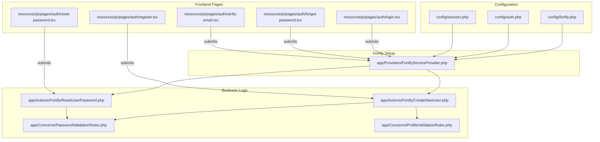
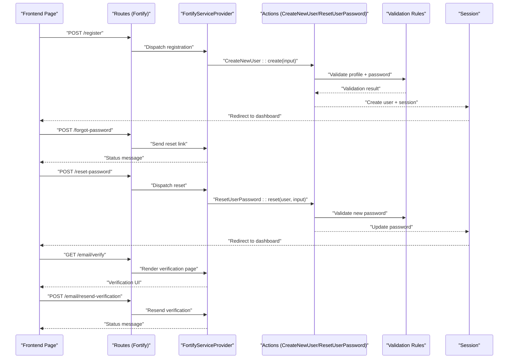
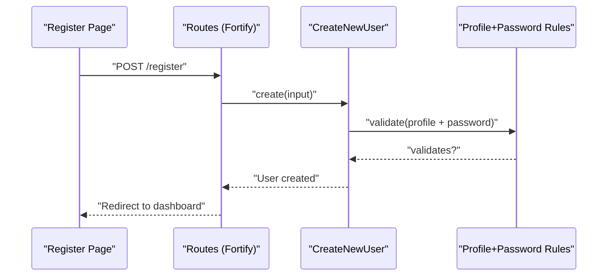
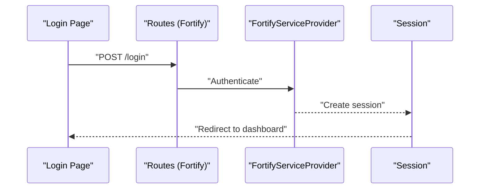
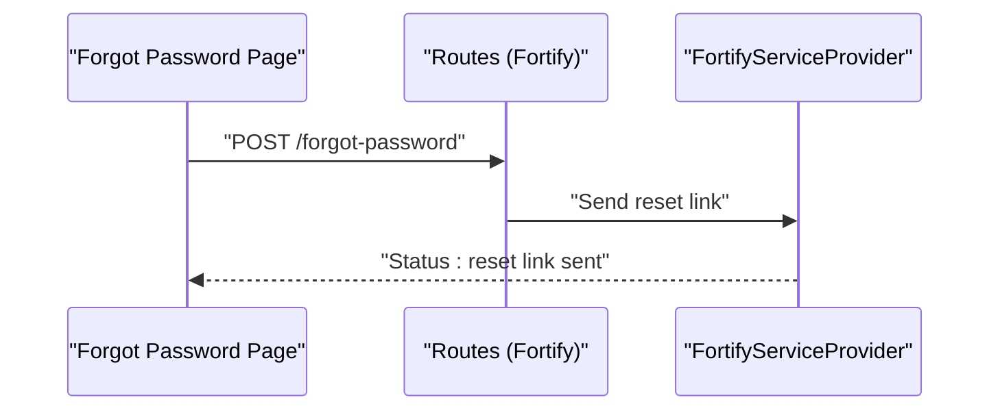
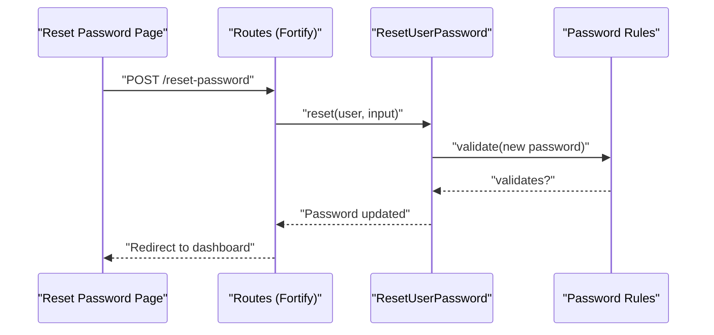
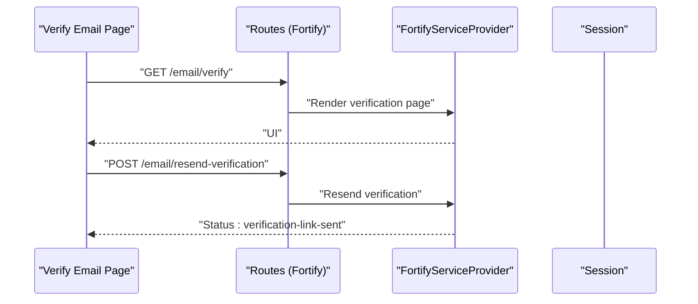
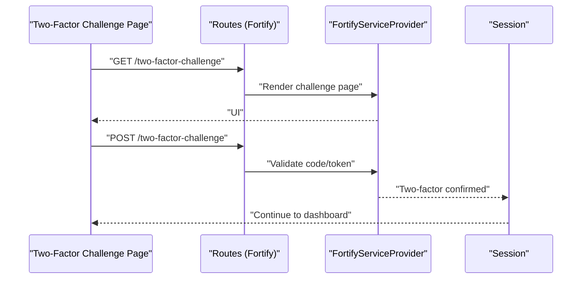
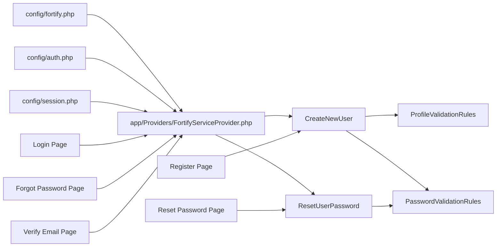

# Authentication Endpoints

<cite>
**Referenced Files in This Document**
- [config/fortify.php](file://config/fortify.php)
- [config/auth.php](file://config/auth.php)
- [config/session.php](file://config/session.php)
- [app/Providers/FortifyServiceProvider.php](file://app/Providers/FortifyServiceProvider.php)
- [app/Actions/Fortify/CreateNewUser.php](file://app/Actions/Fortify/CreateNewUser.php)
- [app/Actions/Fortify/ResetUserPassword.php](file://app/Actions/Fortify/ResetUserPassword.php)
- [app/Concerns/PasswordValidationRules.php](file://app/Concerns/PasswordValidationRules.php)
- [app/Concerns/ProfileValidationRules.php](file://app/Concerns/ProfileValidationRules.php)
- [resources/js/pages/auth/register.tsx](file://resources/js/pages/auth/register.tsx)
- [resources/js/pages/auth/login.tsx](file://resources/js/pages/auth/login.tsx)
- [resources/js/pages/auth/forgot-password.tsx](file://resources/js/pages/auth/forgot-password.tsx)
- [resources/js/pages/auth/reset-password.tsx](file://resources/js/pages/auth/reset-password.tsx)
- [resources/js/pages/auth/verify-email.tsx](file://resources/js/pages/auth/verify-email.tsx)
- [routes/web.php](file://routes/web.php)
</cite>

## Table of Contents
1. [Introduction](#introduction)
2. [Project Structure](#project-structure)
3. [Core Components](#core-components)
4. [Architecture Overview](#architecture-overview)
5. [Detailed Component Analysis](#detailed-component-analysis)
6. [Dependency Analysis](#dependency-analysis)
7. [Performance Considerations](#performance-considerations)
8. [Troubleshooting Guide](#troubleshooting-guide)
9. [Conclusion](#conclusion)

## Introduction
This document describes the authentication endpoints and flows powered by Laravel Fortify and Inertia.js. It covers registration, login, password reset, email verification, and two-factor authentication. It also documents rate limiting, session management, and security considerations derived from the repository configuration and frontend components.

## Project Structure
Authentication is primarily configured via Fortify and enforced by Inertia-driven pages. The backend configuration defines guards, password brokers, rate limiters, and enabled features. Frontend pages render forms and submit them to backend endpoints exposed by Fortify.

**Diagram sources**
- [config/fortify.php:1-178](file://config/fortify.php#L1-L178)
- [config/auth.php:1-118](file://config/auth.php#L1-L118)
- [config/session.php:1-234](file://config/session.php#L1-L234)
- [app/Providers/FortifyServiceProvider.php:1-101](file://app/Providers/FortifyServiceProvider.php#L1-L101)
- [app/Actions/Fortify/CreateNewUser.php:1-34](file://app/Actions/Fortify/CreateNewUser.php#L1-L34)
- [app/Actions/Fortify/ResetUserPassword.php:1-30](file://app/Actions/Fortify/ResetUserPassword.php#L1-L30)
- [app/Concerns/PasswordValidationRules.php:1-30](file://app/Concerns/PasswordValidationRules.php#L1-L30)
- [app/Concerns/ProfileValidationRules.php:1-52](file://app/Concerns/ProfileValidationRules.php#L1-L52)
- [resources/js/pages/auth/register.tsx:1-121](file://resources/js/pages/auth/register.tsx#L1-L121)
- [resources/js/pages/auth/login.tsx:1-118](file://resources/js/pages/auth/login.tsx#L1-L118)
- [resources/js/pages/auth/forgot-password.tsx:1-70](file://resources/js/pages/auth/forgot-password.tsx#L1-L70)
- [resources/js/pages/auth/reset-password.tsx:1-97](file://resources/js/pages/auth/reset-password.tsx#L1-L97)
- [resources/js/pages/auth/verify-email.tsx:1-47](file://resources/js/pages/auth/verify-email.tsx#L1-L47)

**Section sources**
- [config/fortify.php:1-178](file://config/fortify.php#L1-L178)
- [config/auth.php:1-118](file://config/auth.php#L1-L118)
- [config/session.php:1-234](file://config/session.php#L1-L234)
- [app/Providers/FortifyServiceProvider.php:1-101](file://app/Providers/FortifyServiceProvider.php#L1-L101)

## Core Components
- Fortify configuration enables registration, password reset, email verification, two-factor authentication, and passkeys. It sets rate limiters and middleware.
- Fortify service provider registers views for login, registration, password reset, email verification, two-factor challenge, and password confirmation, and configures rate limiters.
- Business logic actions handle user creation and password resets with validation rules.
- Frontend pages render forms and submit them to backend endpoints exposed by Fortify.

**Section sources**
- [config/fortify.php:163-175](file://config/fortify.php#L163-L175)
- [app/Providers/FortifyServiceProvider.php:49-77](file://app/Providers/FortifyServiceProvider.php#L49-L77)
- [app/Actions/Fortify/CreateNewUser.php:20-32](file://app/Actions/Fortify/CreateNewUser.php#L20-L32)
- [app/Actions/Fortify/ResetUserPassword.php:19-28](file://app/Actions/Fortify/ResetUserPassword.php#L19-L28)

## Architecture Overview
The authentication flow integrates frontend Inertia forms with Fortify endpoints. Fortify manages:
- Registration and profile validation
- Password reset initiation and completion
- Email verification
- Two-factor challenge
- Rate limiting and throttling

**Diagram sources**
- [app/Providers/FortifyServiceProvider.php:49-77](file://app/Providers/FortifyServiceProvider.php#L49-L77)
- [app/Actions/Fortify/CreateNewUser.php:20-32](file://app/Actions/Fortify/CreateNewUser.php#L20-L32)
- [app/Actions/Fortify/ResetUserPassword.php:19-28](file://app/Actions/Fortify/ResetUserPassword.php#L19-L28)
- [app/Concerns/PasswordValidationRules.php:15-28](file://app/Concerns/PasswordValidationRules.php#L15-L28)
- [app/Concerns/ProfileValidationRules.php:16-50](file://app/Concerns/ProfileValidationRules.php#L16-L50)

## Detailed Component Analysis

### Registration Endpoint
- Purpose: Create a new user account.
- Method and URL: POST to the route bound by Fortify for registration.
- Request body fields:
  - name: string, required, max length constraints
  - email: string, required, unique, email format
  - password: string, required, meets password policy, confirmed
  - password_confirmation: string, matches password
- Response: On success, redirects to the configured home path; on validation errors, returns validation errors.
- Authentication requirement: None (public endpoint).
- Validation rules:
  - Name: required, string, max length
  - Email: required, string, email, unique
  - Password: required, string, password policy, confirmed
- Security considerations:
  - Rate limiting applies to registration attempts.
  - Strong password policy is enforced.
- Example request (registration):
  - Fields: name, email, password, password_confirmation
  - Submit to the registration endpoint.

**Diagram sources**
- [resources/js/pages/auth/register.tsx:20-112](file://resources/js/pages/auth/register.tsx#L20-L112)
- [app/Actions/Fortify/CreateNewUser.php:20-32](file://app/Actions/Fortify/CreateNewUser.php#L20-L32)
- [app/Concerns/ProfileValidationRules.php:16-50](file://app/Concerns/ProfileValidationRules.php#L16-L50)
- [app/Concerns/PasswordValidationRules.php:15-18](file://app/Concerns/PasswordValidationRules.php#L15-L18)

**Section sources**
- [resources/js/pages/auth/register.tsx:16-112](file://resources/js/pages/auth/register.tsx#L16-L112)
- [app/Actions/Fortify/CreateNewUser.php:20-32](file://app/Actions/Fortify/CreateNewUser.php#L20-L32)
- [app/Concerns/ProfileValidationRules.php:16-50](file://app/Concerns/ProfileValidationRules.php#L16-L50)
- [app/Concerns/PasswordValidationRules.php:15-18](file://app/Concerns/PasswordValidationRules.php#L15-L18)
- [config/fortify.php:117-121](file://config/fortify.php#L117-L121)

### Login Endpoint
- Purpose: Authenticate existing users.
- Method and URL: POST to the route bound by Fortify for login.
- Request body fields:
  - email: string, required
  - password: string, required
  - remember: boolean (optional)
- Response: On success, creates a session and redirects to the home path; on failure, returns validation or authentication errors.
- Authentication requirement: None (public endpoint).
- Validation rules:
  - Email: required, string
  - Password: required, string
- Security considerations:
  - Rate limiting applies to login attempts per email/IP.
  - Session lifetime and cookie policies are configurable.
- Example request (login):
  - Fields: email, password, remember (optional)
  - Submit to the login endpoint.

**Diagram sources**
- [resources/js/pages/auth/login.tsx:27-93](file://resources/js/pages/auth/login.tsx#L27-L93)
- [app/Providers/FortifyServiceProvider.php:82-92](file://app/Providers/FortifyServiceProvider.php#L82-L92)
- [config/session.php:35](file://config/session.php#L35)

**Section sources**
- [resources/js/pages/auth/login.tsx:20-103](file://resources/js/pages/auth/login.tsx#L20-L103)
- [app/Providers/FortifyServiceProvider.php:82-92](file://app/Providers/FortifyServiceProvider.php#L82-L92)
- [config/session.php:35](file://config/session.php#L35)

### Password Reset Initiation Endpoint
- Purpose: Send a password reset link to the user’s email.
- Method and URL: POST to the route bound by Fortify for requesting a password reset link.
- Request body fields:
  - email: string, required
- Response: Returns a status message indicating the action was initiated.
- Authentication requirement: None (public endpoint).
- Validation rules:
  - Email: required, string, email format
- Security considerations:
  - Rate limiting applies to reset link requests.
  - Token expiry and throttle are configured in the password broker.
- Example request (forgot password):
  - Field: email
  - Submit to the forgot-password endpoint.

**Diagram sources**
- [resources/js/pages/auth/forgot-password.tsx:24-55](file://resources/js/pages/auth/forgot-password.tsx#L24-L55)
- [app/Providers/FortifyServiceProvider.php:62-64](file://app/Providers/FortifyServiceProvider.php#L62-L64)

**Section sources**
- [resources/js/pages/auth/forgot-password.tsx:12-55](file://resources/js/pages/auth/forgot-password.tsx#L12-L55)
- [app/Providers/FortifyServiceProvider.php:62-64](file://app/Providers/FortifyServiceProvider.php#L62-L64)
- [config/auth.php:95-102](file://config/auth.php#L95-L102)

### Password Reset Completion Endpoint
- Purpose: Set a new password using a reset token.
- Method and URL: POST to the route bound by Fortify for resetting the password.
- Request body fields:
  - email: string, required
  - password: string, required, meets password policy, confirmed
  - password_confirmation: string, matches password
  - token: provided via URL (not posted in body)
- Response: On success, updates the password and redirects to the home path; on validation errors, returns validation errors.
- Authentication requirement: None (public endpoint).
- Validation rules:
  - Password: required, string, password policy, confirmed
- Security considerations:
  - Token expiry and throttle are configured in the password broker.
- Example request (reset password):
  - Fields: email, password, password_confirmation
  - Submit to the reset-password endpoint.

**Diagram sources**
- [resources/js/pages/auth/reset-password.tsx:21-88](file://resources/js/pages/auth/reset-password.tsx#L21-L88)
- [app/Actions/Fortify/ResetUserPassword.php:19-28](file://app/Actions/Fortify/ResetUserPassword.php#L19-L28)
- [app/Concerns/PasswordValidationRules.php:15-18](file://app/Concerns/PasswordValidationRules.php#L15-L18)

**Section sources**
- [resources/js/pages/auth/reset-password.tsx:16-88](file://resources/js/pages/auth/reset-password.tsx#L16-L88)
- [app/Actions/Fortify/ResetUserPassword.php:19-28](file://app/Actions/Fortify/ResetUserPassword.php#L19-L28)
- [app/Concerns/PasswordValidationRules.php:15-18](file://app/Concerns/PasswordValidationRules.php#L15-L18)
- [config/auth.php:95-102](file://config/auth.php#L95-L102)

### Email Verification Endpoint
- Purpose: Allow users to verify their email address and resend verification emails.
- Methods and URLs:
  - GET /email/verify: Render verification UI
  - POST /email/resend-verification: Resend verification email
- Request body fields:
  - None for GET
  - None for POST (resend)
- Response: GET returns verification UI; POST returns a status message indicating a new link was sent.
- Authentication requirement: Requires authentication and verified email middleware.
- Security considerations:
  - Requires authenticated session; redirects to login if unauthenticated.
- Example request (resend verification):
  - Submit to the resend-verification endpoint.

**Diagram sources**
- [resources/js/pages/auth/verify-email.tsx:21-37](file://resources/js/pages/auth/verify-email.tsx#L21-L37)
- [app/Providers/FortifyServiceProvider.php:66-68](file://app/Providers/FortifyServiceProvider.php#L66-L68)
- [routes/web.php:7-9](file://routes/web.php#L7-L9)

**Section sources**
- [resources/js/pages/auth/verify-email.tsx:9-37](file://resources/js/pages/auth/verify-email.tsx#L9-L37)
- [app/Providers/FortifyServiceProvider.php:66-68](file://app/Providers/FortifyServiceProvider.php#L66-L68)
- [routes/web.php:7-9](file://routes/web.php#L7-L9)

### Two-Factor Authentication Endpoints
- Purpose: Challenge users with two-factor authentication after login.
- Methods and URLs:
  - GET /two-factor-challenge: Render two-factor challenge UI
  - POST /two-factor-challenge: Submit two-factor code/token
- Request body fields:
  - code: string or token (depending on method)
- Response: On success, confirms two-factor and continues session; on failure, returns validation or authentication errors.
- Authentication requirement: Requires authenticated session.
- Security considerations:
  - Rate limiting applies to two-factor attempts.
  - Optional password confirmation is enabled.
- Example request (two-factor challenge):
  - Submit code/token to the two-factor-challenge endpoint.

**Diagram sources**
- [app/Providers/FortifyServiceProvider.php:74](file://app/Providers/FortifyServiceProvider.php#L74)
- [config/fortify.php:167-171](file://config/fortify.php#L167-L171)
- [app/Providers/FortifyServiceProvider.php:82-86](file://app/Providers/FortifyServiceProvider.php#L82-L86)

**Section sources**
- [app/Providers/FortifyServiceProvider.php:74](file://app/Providers/FortifyServiceProvider.php#L74)
- [config/fortify.php:167-171](file://config/fortify.php#L167-L171)
- [app/Providers/FortifyServiceProvider.php:82-86](file://app/Providers/FortifyServiceProvider.php#L82-L86)

### Logout Endpoint
- Purpose: End the current session.
- Method and URL: Not explicitly defined in the provided files; typically handled by the application’s logout mechanism integrated with the session driver.
- Request body fields: None.
- Response: Redirects to the home path or login page.
- Authentication requirement: Requires authenticated session.
- Security considerations:
  - Session lifetime and cookie policies apply.
- Example request (logout):
  - Navigate to the logout route or trigger logout from the frontend.

[No sources needed since this section summarizes behavior inferred from configuration and frontend usage]

## Dependency Analysis
- Fortify configuration depends on:
  - Authentication guard and password broker from auth configuration
  - Session driver and cookie settings from session configuration
  - Rate limiters defined in Fortify service provider
- Frontend pages depend on:
  - Inertia forms bound to routes defined by Fortify
  - Validation rules from shared traits

**Diagram sources**
- [config/fortify.php:1-178](file://config/fortify.php#L1-L178)
- [config/auth.php:1-118](file://config/auth.php#L1-L118)
- [config/session.php:1-234](file://config/session.php#L1-L234)
- [app/Providers/FortifyServiceProvider.php:1-101](file://app/Providers/FortifyServiceProvider.php#L1-L101)
- [app/Actions/Fortify/CreateNewUser.php:1-34](file://app/Actions/Fortify/CreateNewUser.php#L1-L34)
- [app/Actions/Fortify/ResetUserPassword.php:1-30](file://app/Actions/Fortify/ResetUserPassword.php#L1-L30)
- [app/Concerns/PasswordValidationRules.php:1-30](file://app/Concerns/PasswordValidationRules.php#L1-L30)
- [app/Concerns/ProfileValidationRules.php:1-52](file://app/Concerns/ProfileValidationRules.php#L1-L52)
- [resources/js/pages/auth/register.tsx:1-121](file://resources/js/pages/auth/register.tsx#L1-L121)
- [resources/js/pages/auth/login.tsx:1-118](file://resources/js/pages/auth/login.tsx#L1-L118)
- [resources/js/pages/auth/forgot-password.tsx:1-70](file://resources/js/pages/auth/forgot-password.tsx#L1-L70)
- [resources/js/pages/auth/reset-password.tsx:1-97](file://resources/js/pages/auth/reset-password.tsx#L1-L97)
- [resources/js/pages/auth/verify-email.tsx:1-47](file://resources/js/pages/auth/verify-email.tsx#L1-L47)

**Section sources**
- [config/fortify.php:1-178](file://config/fortify.php#L1-L178)
- [config/auth.php:1-118](file://config/auth.php#L1-L118)
- [config/session.php:1-234](file://config/session.php#L1-L234)
- [app/Providers/FortifyServiceProvider.php:1-101](file://app/Providers/FortifyServiceProvider.php#L1-L101)

## Performance Considerations
- Rate limiting:
  - Login attempts are throttled per email/IP.
  - Two-factor challenges are throttled per session identifier.
  - Passkeys operations are throttled per credential ID or session.
- Session management:
  - Session lifetime is configurable in minutes.
  - Cookie attributes (secure, http_only, same_site) are configurable for security and compatibility.
- Recommendations:
  - Tune rate limiter limits based on traffic patterns.
  - Ensure HTTPS in production to enable secure cookies.
  - Align session lifetime with application security posture.

**Section sources**
- [app/Providers/FortifyServiceProvider.php:82-99](file://app/Providers/FortifyServiceProvider.php#L82-L99)
- [config/session.php:35](file://config/session.php#L35)
- [config/session.php:172](file://config/session.php#L172)
- [config/session.php:185](file://config/session.php#L185)
- [config/session.php:202](file://config/session.php#L202)

## Troubleshooting Guide
- Validation errors:
  - Registration: name, email, password, password confirmation must meet rules.
  - Password reset: new password must meet policy and confirmation.
- Common issues:
  - Rate limit exceeded: Reduce submission frequency or adjust limits.
  - Unverified email: Use resend verification endpoint.
  - Expired reset token: Request a new reset link.
- Where to check:
  - Validation rules in shared traits.
  - Rate limiters in Fortify service provider.
  - Session configuration for cookie and lifetime settings.

**Section sources**
- [app/Concerns/ProfileValidationRules.php:16-50](file://app/Concerns/ProfileValidationRules.php#L16-L50)
- [app/Concerns/PasswordValidationRules.php:15-18](file://app/Concerns/PasswordValidationRules.php#L15-L18)
- [app/Providers/FortifyServiceProvider.php:82-99](file://app/Providers/FortifyServiceProvider.php#L82-L99)
- [config/session.php:35](file://config/session.php#L35)

## Conclusion
The authentication system leverages Laravel Fortify and Inertia to provide robust, secure authentication flows. Configuration files define guards, password brokers, rate limiting, and session policies. Frontend pages submit forms to backend endpoints that enforce validation and security measures. Properly tuning rate limits, session settings, and ensuring HTTPS will improve both security and user experience.