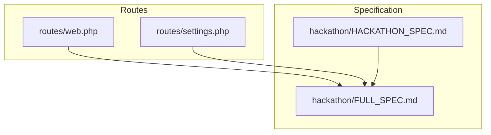
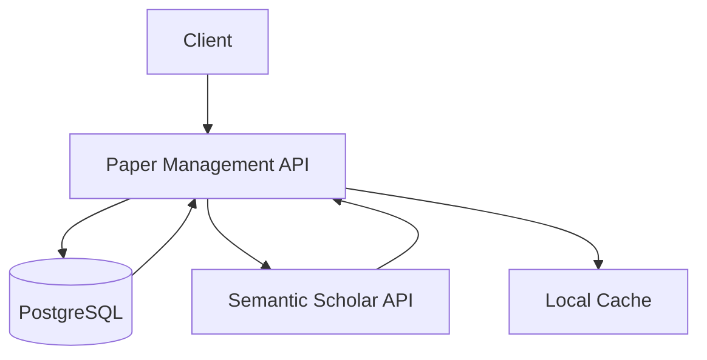
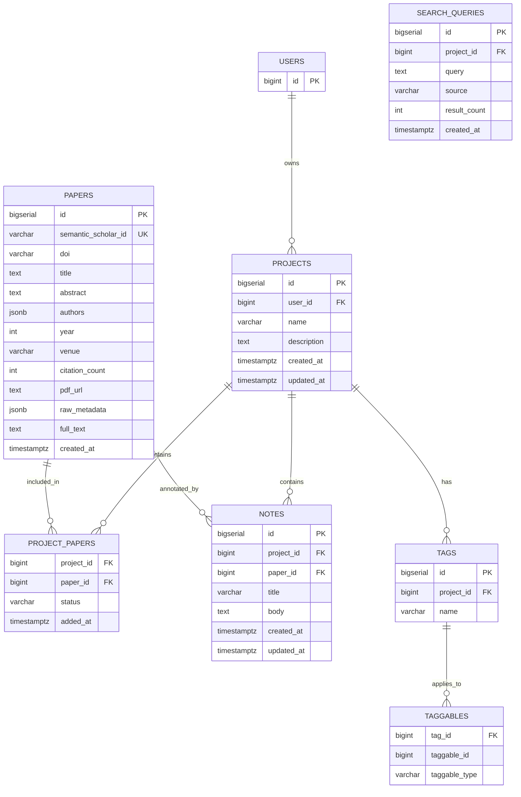
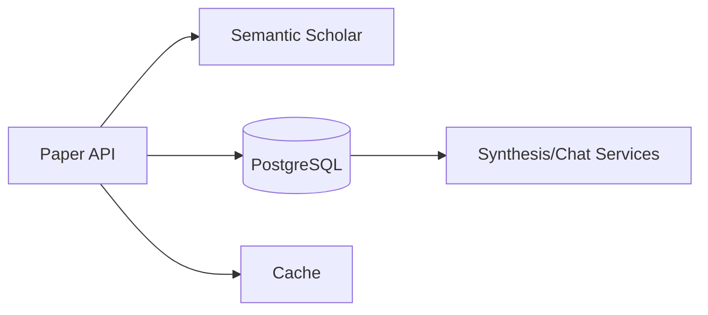

# Paper Management Endpoints

<cite>
**Referenced Files in This Document**
- [web.php](file://routes/web.php)
- [settings.php](file://routes/settings.php)
- [FULL_SPEC.md](file://hackathon/FULL_SPEC.md)
- [HACKATHON_SPEC.md](file://hackathon/HACKATHON_SPEC.md)
</cite>

## Table of Contents
1. [Introduction](#introduction)
2. [Project Structure](#project-structure)
3. [Core Components](#core-components)
4. [Architecture Overview](#architecture-overview)
5. [Detailed Component Analysis](#detailed-component-analysis)
6. [Dependency Analysis](#dependency-analysis)
7. [Performance Considerations](#performance-considerations)
8. [Troubleshooting Guide](#troubleshooting-guide)
9. [Conclusion](#conclusion)

## Introduction
This document specifies the API for paper management within the ScholarGraph application. It covers search, retrieval, creation, update, and deletion operations for papers, along with project association endpoints, semantic scholar integration, metadata management, and bulk operations. It also documents search query parameters, filtering, pagination, upload and metadata extraction, full-text processing, validation rules, error handling, and rate limiting considerations.

## Project Structure
The backend is a Laravel application with Inertia/React frontend. Routes are defined under the routes directory. The paper domain is primarily described in the hackathon specifications, which define the data model and module behavior.

**Diagram sources**
- [web.php:1-12](file://routes/web.php#L1-L12)
- [settings.php:1-35](file://routes/settings.php#L1-L35)
- [FULL_SPEC.md:1-209](file://hackathon/FULL_SPEC.md#L1-L209)
- [HACKATHON_SPEC.md:1-137](file://hackathon/HACKATHON_SPEC.md#L1-L137)

**Section sources**
- [web.php:1-12](file://routes/web.php#L1-L12)
- [settings.php:1-35](file://routes/settings.php#L1-L35)
- [FULL_SPEC.md:1-209](file://hackathon/FULL_SPEC.md#L1-L209)
- [HACKATHON_SPEC.md:1-137](file://hackathon/HACKATHON_SPEC.md#L1-L137)

## Core Components
- Papers: Core entity representing academic papers with metadata, optional full-text, and raw metadata from external APIs.
- Projects: Collections that group papers and associate synthesis and chat context.
- Project-Papers: Association table linking projects to papers with status and timestamps.
- Search Queries: Records of queries issued to external discovery services (e.g., Semantic Scholar).
- Notes and Tagging: Supporting entities for graph-based note-taking and tagging.
- Syntheses and Chat Messages: Records of AI-generated answers and persistent memory.

These components define the domain model and inform the API surface for paper management.

**Section sources**
- [FULL_SPEC.md:27-131](file://hackathon/FULL_SPEC.md#L27-L131)
- [HACKATHON_SPEC.md:33-75](file://hackathon/HACKATHON_SPEC.md#L33-L75)

## Architecture Overview
The API integrates with Semantic Scholar for discovery and caches results in the papers table. Papers are associated with projects via project_papers. AI synthesis and chat rely on paper metadata and optionally full-text content.

**Diagram sources**
- [FULL_SPEC.md:12-26](file://hackathon/FULL_SPEC.md#L12-L26)
- [FULL_SPEC.md:135-139](file://hackathon/FULL_SPEC.md#L135-L139)

## Detailed Component Analysis

### Data Model Overview
The following entities and relationships define the paper management domain:

**Diagram sources**
- [FULL_SPEC.md:27-131](file://hackathon/FULL_SPEC.md#L27-L131)

**Section sources**
- [FULL_SPEC.md:27-131](file://hackathon/FULL_SPEC.md#L27-L131)

### Semantic Scholar Integration Endpoints
- Discovery and caching of papers from Semantic Scholar’s graph search endpoint.
- Saving search results into the papers table and associating them with projects.
- Citation graph traversal using Semantic Scholar’s graph endpoints for cited-by and references.

Rate limiting considerations:
- Free tier allows approximately 100 requests per 5 minutes without an API key.

**Section sources**
- [FULL_SPEC.md:135-139](file://hackathon/FULL_SPEC.md#L135-L139)
- [FULL_SPEC.md:203-204](file://hackathon/FULL_SPEC.md#L203-L204)

### Paper Metadata Management Endpoints
- Retrieve paper details by ID.
- Update paper metadata (e.g., title, abstract, authors, year, venue, citation count, pdf_url).
- Delete paper records (with cascading effects on associations and notes).

Search and filtering:
- Full-text search on titles and abstracts using PostgreSQL GIN indexes.
- Filtering by year range, venue, author names, and tags.

Pagination:
- Cursor-based pagination recommended for large result sets to avoid deep offset scans.

Bulk operations:
- Batch save papers to a project.
- Bulk update statuses for papers in a project.

Validation rules:
- Required fields: title.
- Unique constraints: semantic_scholar_id.
- Optional fields: authors (JSON array), pdf_url, full_text, raw_metadata.

Error handling:
- Return appropriate HTTP status codes (e.g., 404 Not Found for missing paper, 400 Bad Request for invalid input, 409 Conflict for unique violations).
- Include error messages indicating validation failures or external service errors.

**Section sources**
- [FULL_SPEC.md:44-58](file://hackathon/FULL_SPEC.md#L44-L58)
- [FULL_SPEC.md](file://hackathon/FULL_SPEC.md#L59)
- [FULL_SPEC.md:109-121](file://hackathon/FULL_SPEC.md#L109-L121)

### Project Association Endpoints
- Add paper to project (save to project_papers with default status unread).
- Remove paper from project.
- Update paper status within a project (unread, reading, read, excluded).
- List papers in a project with filtering and sorting.

Bulk operations:
- Add/remove multiple papers to/from a project.
- Set status for multiple papers in a project.

Validation rules:
- Project ownership checks.
- Status enum validation.

Error handling:
- 403 Forbidden for unauthorized access.
- 404 Not Found for non-existent project or paper.

**Section sources**
- [FULL_SPEC.md:61-67](file://hackathon/FULL_SPEC.md#L61-L67)
- [FULL_SPEC.md:109-121](file://hackathon/FULL_SPEC.md#L109-L121)

### Upload, Metadata Extraction, and Full-Text Processing
- Upload PDFs for papers (when available).
- Extract metadata from uploaded PDFs and external APIs.
- Extract full-text content for synthesis and chat contexts.
- Store raw metadata for re-derivation and caching.

Validation rules:
- File type restrictions (PDF).
- Size limits.
- Metadata completeness checks.

Error handling:
- 413 Payload Too Large for oversized uploads.
- 422 Unprocessable Entity for invalid file formats.
- Propagate external extraction errors with context.

**Section sources**
- [FULL_SPEC.md:135-139](file://hackathon/FULL_SPEC.md#L135-L139)
- [FULL_SPEC.md:55-56](file://hackathon/FULL_SPEC.md#L55-L56)
- [FULL_SPEC.md:200-202](file://hackathon/FULL_SPEC.md#L200-L202)

### Search Query Parameters and Pagination
Common parameters:
- q: Text query for title and abstract.
- year_from/year_to: Year range filters.
- venue: Venue filter.
- author: Author name filter.
- tag: Tag name filter.
- status: Project paper status filter.
- sort: Sort by title, year, added_at, citation_count.
- direction: asc/desc.
- limit: Number of results per page.
- cursor: Cursor for next page.

Filtering:
- Boolean combinations for complex queries.
- Full-text search leveraging GIN indexes.

Pagination:
- Use cursor-based pagination to support large datasets efficiently.

**Section sources**
- [FULL_SPEC.md](file://hackathon/FULL_SPEC.md#L59)
- [FULL_SPEC.md:109-121](file://hackathon/FULL_SPEC.md#L109-L121)

### Request/Response Examples

#### Paper Search
- Method: GET
- Path: /api/papers/search
- Query parameters:
  - q (text): search query
  - year_from (integer): minimum publication year
  - year_to (integer): maximum publication year
  - venue (string): venue filter
  - author (string): author name filter
  - tag (string): tag name filter
  - status (string): project paper status filter
  - sort (string): title/year/added_at/citation_count
  - direction (string): asc/desc
  - limit (integer): items per page
  - cursor (string): pagination cursor
- Response: Array of paper objects with metadata and project association status.

#### Add Paper to Project
- Method: POST
- Path: /api/projects/{project_id}/papers
- Body:
  - paper_id (integer): target paper identifier
- Response: 201 Created with association details.

#### Remove Paper from Project
- Method: DELETE
- Path: /api/projects/{project_id}/papers/{paper_id}
- Response: 204 No Content.

#### Bulk Operations
- Add multiple papers to project:
  - Method: POST
  - Path: /api/projects/{project_id}/papers/bulk-add
  - Body: array of paper_id integers
  - Response: 201 Created with summary
- Remove multiple papers from project:
  - Method: POST
  - Path: /api/projects/{project_id}/papers/bulk-remove
  - Body: array of paper_id integers
  - Response: 204 No Content
- Update multiple paper statuses:
  - Method: PATCH
  - Path: /api/projects/{project_id}/papers/bulk-status
  - Body: array of {paper_id, status}
  - Response: 200 OK with summary

#### Upload Paper PDF
- Method: POST
- Path: /api/papers/{paper_id}/upload
- Form-data:
  - file (binary): PDF file
- Response: 200 OK with updated metadata and extraction status.

#### Metadata Extraction and Full-Text Processing
- Method: POST
- Path: /api/papers/{paper_id}/extract
- Response: 200 OK with extracted metadata and full_text.

**Section sources**
- [FULL_SPEC.md:44-58](file://hackathon/FULL_SPEC.md#L44-L58)
- [FULL_SPEC.md:61-67](file://hackathon/FULL_SPEC.md#L61-L67)
- [FULL_SPEC.md:109-121](file://hackathon/FULL_SPEC.md#L109-L121)

### Validation Rules
- Required: title for paper creation/update.
- Unique: semantic_scholar_id.
- Enumerations: status values (unread, reading, read, excluded).
- Numeric ranges: year, citation_count.
- JSON shapes: authors array with name and optional affiliation.

**Section sources**
- [FULL_SPEC.md:44-58](file://hackathon/FULL_SPEC.md#L44-L58)
- [FULL_SPEC.md:61-67](file://hackathon/FULL_SPEC.md#L61-L67)

### Error Handling
- 400 Bad Request: Malformed request or validation failure.
- 401 Unauthorized: Authentication required.
- 403 Forbidden: Insufficient permissions.
- 404 Not Found: Resource does not exist.
- 409 Conflict: Unique constraint violation.
- 422 Unprocessable Entity: Business rule violation (e.g., invalid status).
- 429 Too Many Requests: Rate limit exceeded.
- 500 Internal Server Error: Unexpected server error.

**Section sources**
- [settings.php](file://routes/settings.php#L23)

### Rate Limiting Considerations
- Semantic Scholar free tier: ~100 requests per 5 minutes without an API key.
- Implement client-side backoff and retry with exponential delay.
- Consider caching frequent search results locally.
- Apply application-level rate limits per user or per IP.

**Section sources**
- [FULL_SPEC.md:203-204](file://hackathon/FULL_SPEC.md#L203-L204)

## Dependency Analysis
The paper management module depends on:
- Semantic Scholar API for discovery and metadata.
- PostgreSQL for persistence with GIN indexes for full-text search.
- Local cache for reducing repeated external calls.
- AI synthesis and chat services for downstream processing.

**Diagram sources**
- [FULL_SPEC.md:12-26](file://hackathon/FULL_SPEC.md#L12-L26)
- [FULL_SPEC.md:27-131](file://hackathon/FULL_SPEC.md#L27-L131)

**Section sources**
- [FULL_SPEC.md:12-26](file://hackathon/FULL_SPEC.md#L12-L26)
- [FULL_SPEC.md:27-131](file://hackathon/FULL_SPEC.md#L27-L131)

## Performance Considerations
- Use GIN indexes on title and abstract for full-text search.
- Prefer cursor-based pagination to avoid deep offset scans.
- Batch operations for adding/removing/updating multiple papers.
- Cache frequently accessed metadata and search results.
- Asynchronous processing for PDF upload, metadata extraction, and full-text parsing.

[No sources needed since this section provides general guidance]

## Troubleshooting Guide
- If search results are empty, verify query parameters and ensure the paper exists in the cache or was fetched from Semantic Scholar.
- If updates fail, check validation rules and unique constraints.
- If rate limits are hit, implement client-side throttling and caching.
- For PDF uploads, confirm file type and size limits.

**Section sources**
- [settings.php](file://routes/settings.php#L23)
- [FULL_SPEC.md:203-204](file://hackathon/FULL_SPEC.md#L203-L204)

## Conclusion
The paper management API integrates Semantic Scholar discovery with robust project association, metadata management, and bulk operations. By adhering to the documented endpoints, validation rules, and rate limiting strategies, developers can build reliable and scalable paper handling capabilities aligned with the ScholarGraph vision.