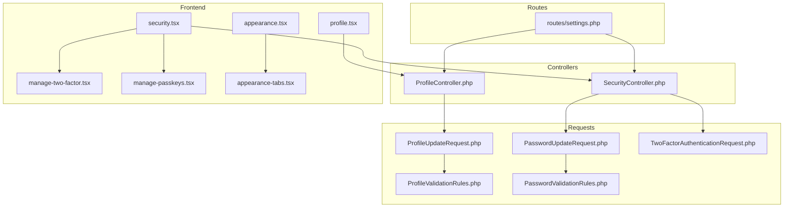
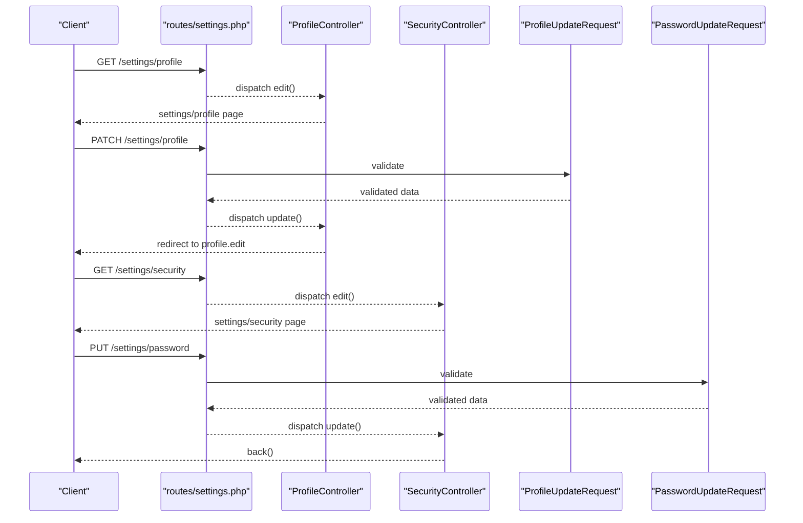
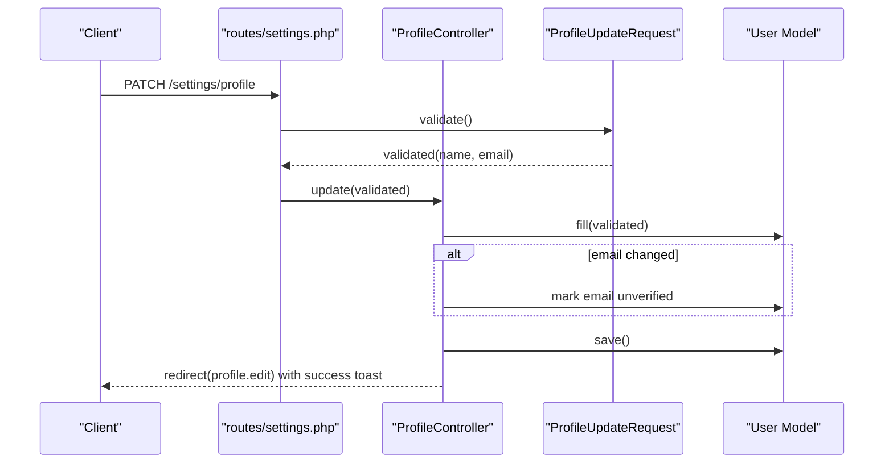
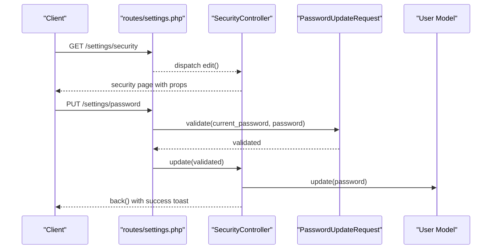
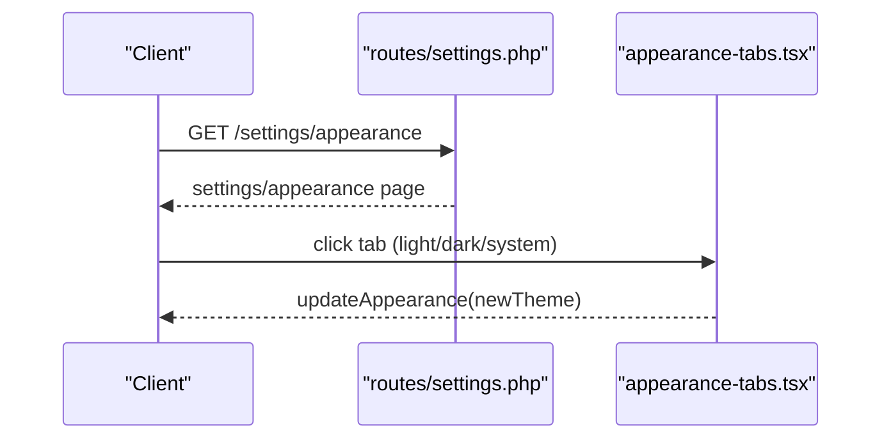
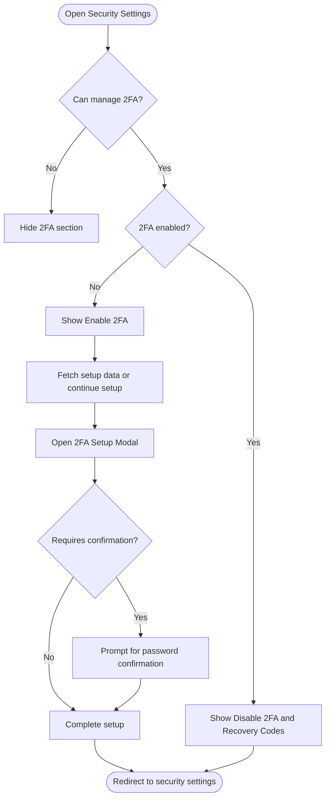
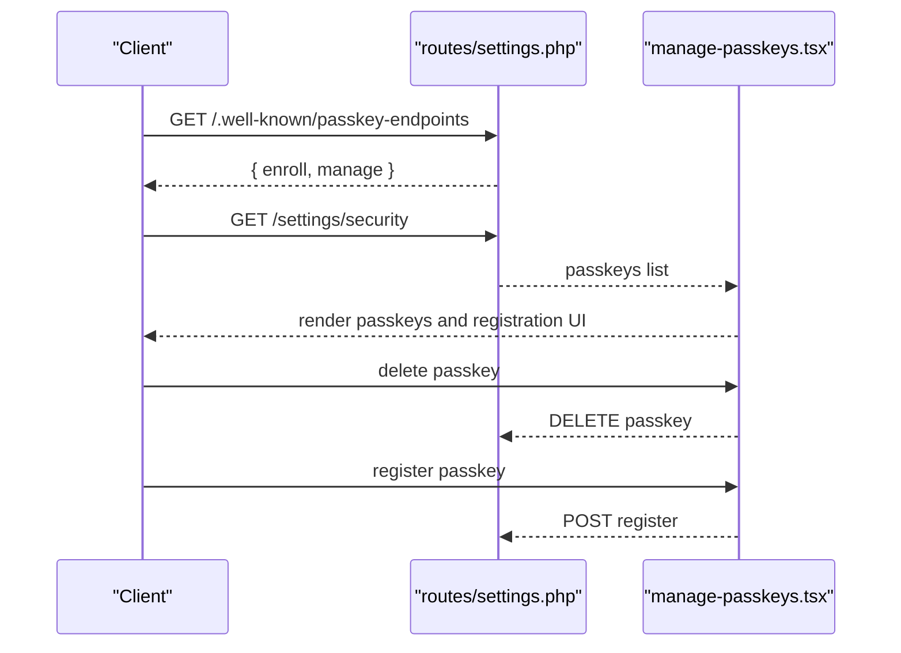
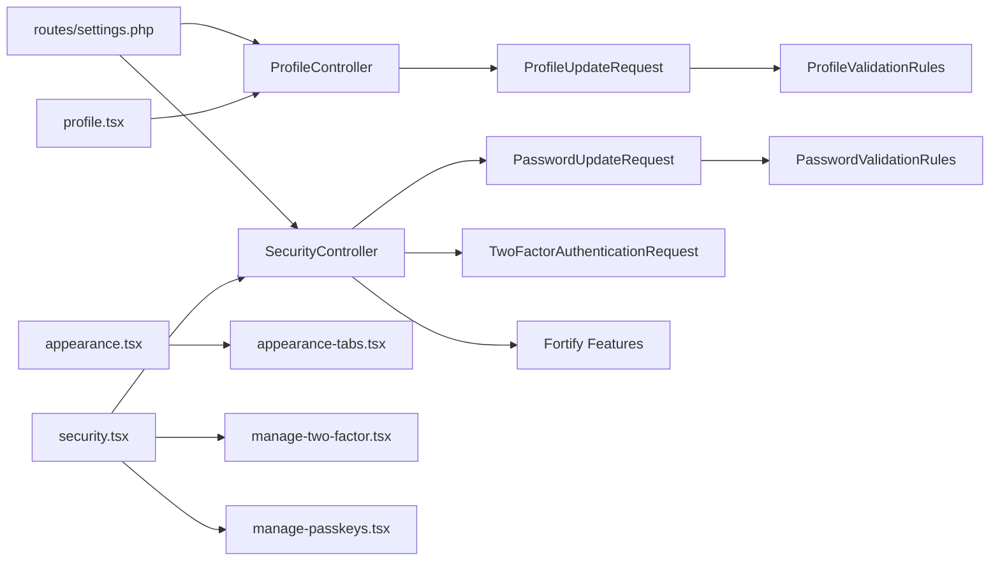

# Settings Endpoints

<cite>
**Referenced Files in This Document**
- [routes/settings.php](file://routes/settings.php)
- [ProfileController.php](file://app/Http/Controllers/Settings/ProfileController.php)
- [SecurityController.php](file://app/Http/Controllers/Settings/SecurityController.php)
- [ProfileUpdateRequest.php](file://app/Http/Requests/Settings/ProfileUpdateRequest.php)
- [PasswordUpdateRequest.php](file://app/Http/Requests/Settings/PasswordUpdateRequest.php)
- [TwoFactorAuthenticationRequest.php](file://app/Http/Requests/Settings/TwoFactorAuthenticationRequest.php)
- [ProfileValidationRules.php](file://app/Concerns/ProfileValidationRules.php)
- [PasswordValidationRules.php](file://app/Concerns/PasswordValidationRules.php)
- [profile.tsx](file://resources/js/pages/settings/profile.tsx)
- [security.tsx](file://resources/js/pages/settings/security.tsx)
- [appearance.tsx](file://resources/js/pages/settings/appearance.tsx)
- [manage-two-factor.tsx](file://resources/js/components/manage-two-factor.tsx)
- [manage-passkeys.tsx](file://resources/js/components/manage-passkeys.tsx)
- [appearance-tabs.tsx](file://resources/js/components/appearance-tabs.tsx)
- [fortify.php](file://config/fortify.php)
</cite>

## Table of Contents
1. [Introduction](#introduction)
2. [Project Structure](#project-structure)
3. [Core Components](#core-components)
4. [Architecture Overview](#architecture-overview)
5. [Detailed Component Analysis](#detailed-component-analysis)
6. [Dependency Analysis](#dependency-analysis)
7. [Performance Considerations](#performance-considerations)
8. [Troubleshooting Guide](#troubleshooting-guide)
9. [Conclusion](#conclusion)

## Introduction
This document describes the settings management API endpoints for profile updates, security settings, and appearance preferences. It covers HTTP methods, validation rules, security confirmations, and UI integrations for personal information updates, password changes, passkey management, and two-factor authentication configuration. It also documents the settings categories: personal details, authentication security, appearance customization, and account management.

## Project Structure
Settings endpoints are organized under the settings route group with dedicated controllers and form requests for validation. Frontend pages and components render the settings UI and integrate with backend controllers.

**Diagram sources**
- [routes/settings.php:1-35](file://routes/settings.php#L1-L35)
- [ProfileController.php:1-63](file://app/Http/Controllers/Settings/ProfileController.php#L1-L63)
- [SecurityController.php:1-67](file://app/Http/Controllers/Settings/SecurityController.php#L1-L67)
- [ProfileUpdateRequest.php:1-23](file://app/Http/Requests/Settings/ProfileUpdateRequest.php#L1-L23)
- [ProfileValidationRules.php:1-52](file://app/Concerns/ProfileValidationRules.php#L1-L52)
- [PasswordUpdateRequest.php:1-26](file://app/Http/Requests/Settings/PasswordUpdateRequest.php#L1-L26)
- [PasswordValidationRules.php:1-30](file://app/Concerns/PasswordValidationRules.php#L1-L30)
- [TwoFactorAuthenticationRequest.php:1-23](file://app/Http/Requests/Settings/TwoFactorAuthenticationRequest.php#L1-L23)
- [profile.tsx:1-139](file://resources/js/pages/settings/profile.tsx#L1-L139)
- [security.tsx:1-148](file://resources/js/pages/settings/security.tsx#L1-L148)
- [appearance.tsx:1-33](file://resources/js/pages/settings/appearance.tsx#L1-L33)
- [manage-two-factor.tsx:1-127](file://resources/js/components/manage-two-factor.tsx#L1-L127)
- [manage-passkeys.tsx:1-72](file://resources/js/components/manage-passkeys.tsx#L1-L72)
- [appearance-tabs.tsx:1-46](file://resources/js/components/appearance-tabs.tsx#L1-L46)

**Section sources**
- [routes/settings.php:1-35](file://routes/settings.php#L1-L35)

## Core Components
- ProfileController: Handles profile editing, updates, and deletion.
- SecurityController: Renders security settings, password updates, and manages two-factor and passkey features.
- Form Requests: Encapsulate validation rules for profile updates and password changes.
- Frontend Pages: Provide UI for profile, security, and appearance settings.

**Section sources**
- [ProfileController.php:15-62](file://app/Http/Controllers/Settings/ProfileController.php#L15-L62)
- [SecurityController.php:14-66](file://app/Http/Controllers/Settings/SecurityController.php#L14-L66)
- [ProfileUpdateRequest.php:9-22](file://app/Http/Requests/Settings/ProfileUpdateRequest.php#L9-L22)
- [PasswordUpdateRequest.php:9-25](file://app/Http/Requests/Settings/PasswordUpdateRequest.php#L9-L25)

## Architecture Overview
The settings module follows a layered architecture:
- Routes define endpoint groups with middleware for authentication and verification.
- Controllers orchestrate business logic and render Inertia pages.
- Form Requests enforce validation rules.
- Frontend pages consume controller-provided props and trigger actions.

**Diagram sources**
- [routes/settings.php:8-27](file://routes/settings.php#L8-L27)
- [ProfileController.php:20-44](file://app/Http/Controllers/Settings/ProfileController.php#L20-L44)
- [SecurityController.php:19-65](file://app/Http/Controllers/Settings/SecurityController.php#L19-L65)
- [ProfileUpdateRequest.php:18-21](file://app/Http/Requests/Settings/ProfileUpdateRequest.php#L18-L21)
- [PasswordUpdateRequest.php:18-24](file://app/Http/Requests/Settings/PasswordUpdateRequest.php#L18-L24)

## Detailed Component Analysis

### Profile Management Endpoints
- Purpose: Update personal information (name, email) and delete the account.
- Authentication: Requires authentication; deletion requires email verification.

Endpoints:
- GET /settings/profile → renders profile settings page
- PATCH /settings/profile → updates profile information
- DELETE /settings/profile → deletes the user account

Processing logic:
- Profile update validates name and email uniqueness, marks email unverified if changed, persists changes, flashes success toast, and redirects to the profile edit page.
- Profile delete logs out the user, invalidates session, regenerates CSRF token, and redirects to home.

Validation rules:
- Name: required, string, max length 255
- Email: required, string, email format, max length 255, unique to the current user

UI integration:
- Frontend page binds inputs to controller action and displays verification prompts when email is unverified.

**Diagram sources**
- [routes/settings.php:11-13](file://routes/settings.php#L11-L13)
- [ProfileController.php:31-44](file://app/Http/Controllers/Settings/ProfileController.php#L31-L44)
- [ProfileUpdateRequest.php:18-21](file://app/Http/Requests/Settings/ProfileUpdateRequest.php#L18-L21)
- [ProfileValidationRules.php:16-50](file://app/Concerns/ProfileValidationRules.php#L16-L50)

**Section sources**
- [routes/settings.php:8-16](file://routes/settings.php#L8-L16)
- [ProfileController.php:20-61](file://app/Http/Controllers/Settings/ProfileController.php#L20-L61)
- [ProfileUpdateRequest.php:18-21](file://app/Http/Requests/Settings/ProfileUpdateRequest.php#L18-L21)
- [ProfileValidationRules.php:16-50](file://app/Concerns/ProfileValidationRules.php#L16-L50)
- [profile.tsx:40-123](file://resources/js/pages/settings/profile.tsx#L40-L123)

### Security Settings Endpoints
- Purpose: Change password, manage two-factor authentication, and manage passkeys.
- Authentication: Requires authentication and verified email for destructive actions; password updates require password confirmation.

Endpoints:
- GET /settings/security → renders security settings page
- PUT /settings/password → updates user password
- GET .well-known/passkey-endpoints → discovery endpoint for passkey enrollment and management

Additional UI components:
- Two-factor management: enable/disable, QR setup, recovery codes
- Passkeys management: list, register, delete

Validation and security confirmations:
- Password updates require current password confirmation and adhere to configured password rules.
- Two-factor management may require confirmation depending on Fortify configuration.
- Passkeys rely on WebAuthn and are managed via Fortify features.

**Diagram sources**
- [routes/settings.php:18-26](file://routes/settings.php#L18-L26)
- [SecurityController.php:19-65](file://app/Http/Controllers/Settings/SecurityController.php#L19-L65)
- [PasswordUpdateRequest.php:18-24](file://app/Http/Requests/Settings/PasswordUpdateRequest.php#L18-L24)
- [PasswordValidationRules.php:15-28](file://app/Concerns/PasswordValidationRules.php#L15-L28)

**Section sources**
- [routes/settings.php:18-27](file://routes/settings.php#L18-L27)
- [SecurityController.php:19-65](file://app/Http/Controllers/Settings/SecurityController.php#L19-L65)
- [PasswordUpdateRequest.php:18-24](file://app/Http/Requests/Settings/PasswordUpdateRequest.php#L18-L24)
- [PasswordValidationRules.php:15-28](file://app/Concerns/PasswordValidationRules.php#L15-L28)
- [security.tsx:37-123](file://resources/js/pages/settings/security.tsx#L37-L123)
- [manage-two-factor.tsx:17-125](file://resources/js/components/manage-two-factor.tsx#L17-L125)
- [manage-passkeys.tsx:28-71](file://resources/js/components/manage-passkeys.tsx#L28-L71)
- [fortify.php:163-175](file://config/fortify.php#L163-L175)

### Appearance Preferences Endpoints
- Purpose: Customize appearance theme (light, dark, system).
- Authentication: Requires authentication.

Endpoint:
- INERTIA GET /settings/appearance → renders appearance settings page

Frontend behavior:
- Appearance tabs update user preference via hook and persist selection.

**Diagram sources**
- [routes/settings.php:26-26](file://routes/settings.php#L26-L26)
- [appearance.tsx:6-22](file://resources/js/pages/settings/appearance.tsx#L6-L22)
- [appearance-tabs.tsx:12-45](file://resources/js/components/appearance-tabs.tsx#L12-L45)

**Section sources**
- [routes/settings.php:26-26](file://routes/settings.php#L26-L26)
- [appearance.tsx:6-22](file://resources/js/pages/settings/appearance.tsx#L6-L22)
- [appearance-tabs.tsx:12-45](file://resources/js/components/appearance-tabs.tsx#L12-L45)

### Two-Factor Authentication Endpoints
- Purpose: Enable/disable two-factor authentication, manage recovery codes, and set up authenticator.
- Authentication: Requires authentication and verified email; may require password confirmation depending on configuration.

UI integration:
- Two-factor setup modal, QR code rendering, manual setup key, and recovery codes display.

**Diagram sources**
- [security.tsx:126-135](file://resources/js/pages/settings/security.tsx#L126-L135)
- [manage-two-factor.tsx:17-125](file://resources/js/components/manage-two-factor.tsx#L17-L125)
- [fortify.php:167-171](file://config/fortify.php#L167-L171)

**Section sources**
- [security.tsx:126-135](file://resources/js/pages/settings/security.tsx#L126-L135)
- [manage-two-factor.tsx:17-125](file://resources/js/components/manage-two-factor.tsx#L17-L125)
- [fortify.php:167-171](file://config/fortify.php#L167-L171)

### Passkey Management Endpoints
- Purpose: Register, list, and delete passkeys for passwordless authentication.
- Authentication: Requires authentication and verified email; may require password confirmation depending on configuration.

Discovery endpoint:
- GET /.well-known/passkey-endpoints → returns enrollment and management routes

Frontend behavior:
- List existing passkeys, register new ones, and delete selected passkeys.

**Diagram sources**
- [routes/settings.php:29-34](file://routes/settings.php#L29-L34)
- [security.tsx:132-135](file://resources/js/pages/settings/security.tsx#L132-L135)
- [manage-passkeys.tsx:28-71](file://resources/js/components/manage-passkeys.tsx#L28-L71)
- [fortify.php:172-174](file://config/fortify.php#L172-L174)

**Section sources**
- [routes/settings.php:29-34](file://routes/settings.php#L29-L34)
- [security.tsx:132-135](file://resources/js/pages/settings/security.tsx#L132-L135)
- [manage-passkeys.tsx:28-71](file://resources/js/components/manage-passkeys.tsx#L28-L71)
- [fortify.php:172-174](file://config/fortify.php#L172-L174)

## Dependency Analysis
- Controllers depend on form requests for validation and on Fortify features for two-factor and passkey capabilities.
- Frontend pages depend on controller-provided props and route helpers for actions.
- Routes define middleware layers: auth, email verification, and password confirmation for sensitive operations.

**Diagram sources**
- [routes/settings.php:1-35](file://routes/settings.php#L1-L35)
- [ProfileController.php:1-63](file://app/Http/Controllers/Settings/ProfileController.php#L1-L63)
- [SecurityController.php:1-67](file://app/Http/Controllers/Settings/SecurityController.php#L1-L67)
- [ProfileUpdateRequest.php:1-23](file://app/Http/Requests/Settings/ProfileUpdateRequest.php#L1-L23)
- [PasswordUpdateRequest.php:1-26](file://app/Http/Requests/Settings/PasswordUpdateRequest.php#L1-L26)
- [TwoFactorAuthenticationRequest.php:1-23](file://app/Http/Requests/Settings/TwoFactorAuthenticationRequest.php#L1-L23)
- [ProfileValidationRules.php:1-52](file://app/Concerns/ProfileValidationRules.php#L1-L52)
- [PasswordValidationRules.php:1-30](file://app/Concerns/PasswordValidationRules.php#L1-L30)
- [profile.tsx:1-139](file://resources/js/pages/settings/profile.tsx#L1-L139)
- [security.tsx:1-148](file://resources/js/pages/settings/security.tsx#L1-L148)
- [appearance.tsx:1-33](file://resources/js/pages/settings/appearance.tsx#L1-L33)
- [manage-two-factor.tsx:1-127](file://resources/js/components/manage-two-factor.tsx#L1-L127)
- [manage-passkeys.tsx:1-72](file://resources/js/components/manage-passkeys.tsx#L1-L72)
- [appearance-tabs.tsx:1-46](file://resources/js/components/appearance-tabs.tsx#L1-L46)
- [fortify.php:1-178](file://config/fortify.php#L1-L178)

**Section sources**
- [routes/settings.php:1-35](file://routes/settings.php#L1-L35)
- [ProfileController.php:1-63](file://app/Http/Controllers/Settings/ProfileController.php#L1-L63)
- [SecurityController.php:1-67](file://app/Http/Controllers/Settings/SecurityController.php#L1-L67)
- [ProfileUpdateRequest.php:1-23](file://app/Http/Requests/Settings/ProfileUpdateRequest.php#L1-L23)
- [PasswordUpdateRequest.php:1-26](file://app/Http/Requests/Settings/PasswordUpdateRequest.php#L1-L26)
- [TwoFactorAuthenticationRequest.php:1-23](file://app/Http/Requests/Settings/TwoFactorAuthenticationRequest.php#L1-L23)
- [ProfileValidationRules.php:1-52](file://app/Concerns/ProfileValidationRules.php#L1-L52)
- [PasswordValidationRules.php:1-30](file://app/Concerns/PasswordValidationRules.php#L1-L30)
- [profile.tsx:1-139](file://resources/js/pages/settings/profile.tsx#L1-L139)
- [security.tsx:1-148](file://resources/js/pages/settings/security.tsx#L1-L148)
- [appearance.tsx:1-33](file://resources/js/pages/settings/appearance.tsx#L1-L33)
- [manage-two-factor.tsx:1-127](file://resources/js/components/manage-two-factor.tsx#L1-L127)
- [manage-passkeys.tsx:1-72](file://resources/js/components/manage-passkeys.tsx#L1-L72)
- [appearance-tabs.tsx:1-46](file://resources/js/components/appearance-tabs.tsx#L1-L46)
- [fortify.php:1-178](file://config/fortify.php#L1-L178)

## Performance Considerations
- Throttling: Password updates are rate-limited to reduce brute-force attempts.
- Selective queries: Passkeys listing uses targeted selects and latest ordering to minimize overhead.
- Conditional rendering: Two-factor and passkey sections are only rendered when features are enabled.

**Section sources**
- [routes/settings.php:23-23](file://routes/settings.php#L23-L23)
- [SecurityController.php:24-39](file://app/Http/Controllers/Settings/SecurityController.php#L24-L39)

## Troubleshooting Guide
Common issues and resolutions:
- Email verification prompt appears after updating email: The system marks the email as unverified upon change; resend verification email from the profile page.
- Password update fails validation: Ensure current password matches and new password meets complexity rules; errors are focused automatically in the UI.
- Two-factor setup does not complete: Confirm password if required by configuration; check setup data availability and modal flow.
- Passkey registration or deletion errors: Verify browser support and origin configuration; retry after resolving client-side issues.

**Section sources**
- [ProfileController.php:35-37](file://app/Http/Controllers/Settings/ProfileController.php#L35-L37)
- [profile.tsx:88-111](file://resources/js/pages/settings/profile.tsx#L88-L111)
- [security.tsx:48-56](file://resources/js/pages/settings/security.tsx#L48-L56)
- [PasswordValidationRules.php:15-28](file://app/Concerns/PasswordValidationRules.php#L15-L28)
- [manage-two-factor.tsx:35-41](file://resources/js/components/manage-two-factor.tsx#L35-L41)
- [fortify.php:145-150](file://config/fortify.php#L145-L150)

## Conclusion
The settings module provides a cohesive set of endpoints for managing personal information, security preferences, and appearance choices. Validation rules, security confirmations, and feature toggles ensure robust and user-friendly operations. The frontend pages and components deliver a responsive experience aligned with backend controllers and form requests.