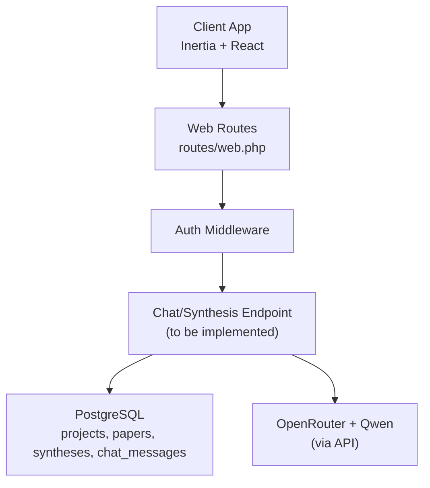
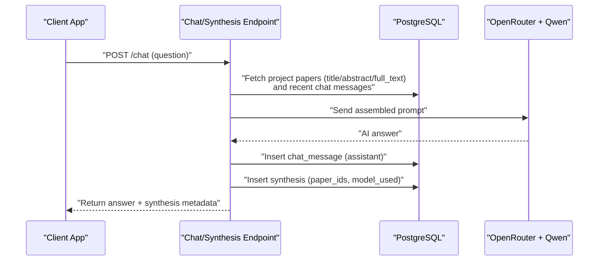
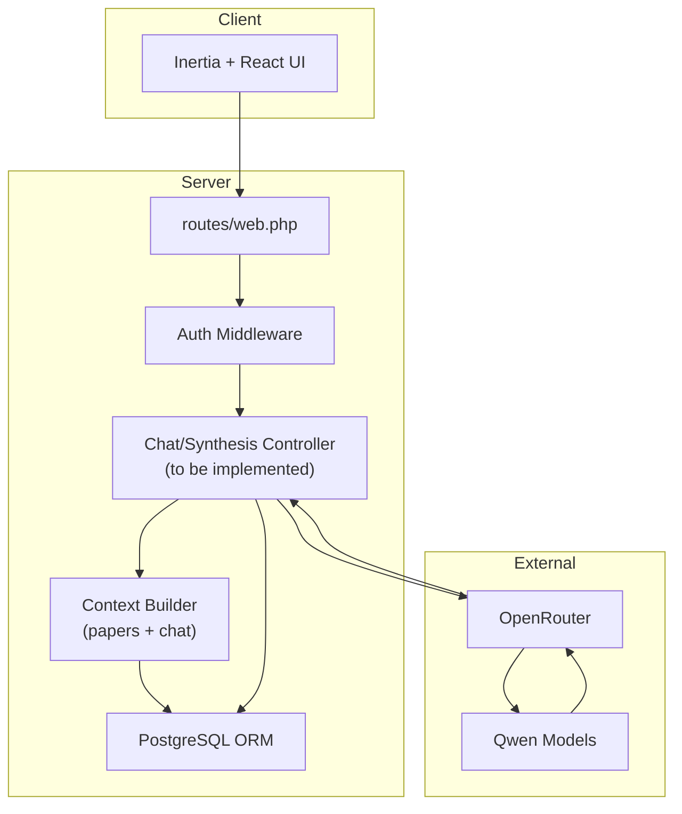
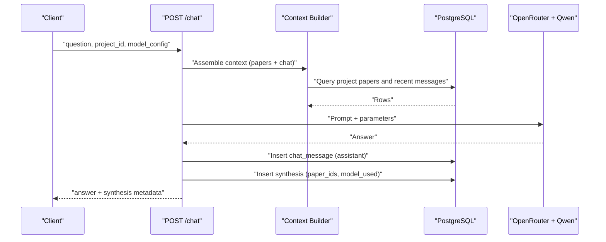
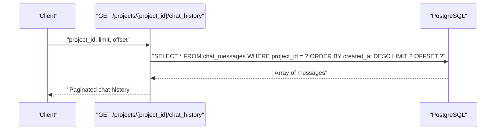
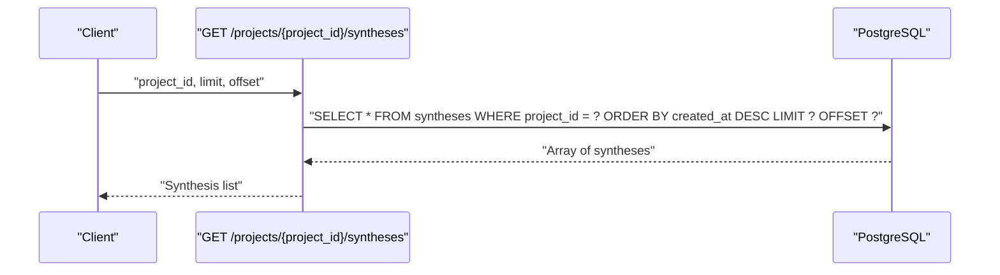
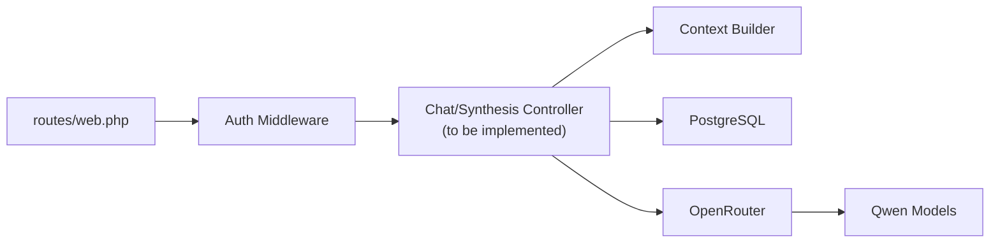

# Synthesis & Chat Endpoints

<cite>
**Referenced Files in This Document**
- [web.php](file://routes/web.php)
- [settings.php](file://routes/settings.php)
- [HACKATHON_SPEC.md](file://hackathon/HACKATHON_SPEC.md)
- [FULL_SPEC.md](file://hackathon/FULL_SPEC.md)
</cite>

## Table of Contents
1. [Introduction](#introduction)
2. [Project Structure](#project-structure)
3. [Core Components](#core-components)
4. [Architecture Overview](#architecture-overview)
5. [Detailed Component Analysis](#detailed-component-analysis)
6. [Dependency Analysis](#dependency-analysis)
7. [Performance Considerations](#performance-considerations)
8. [Troubleshooting Guide](#troubleshooting-guide)
9. [Conclusion](#conclusion)

## Introduction
This document specifies the AI synthesis and chat endpoints for ScholarGraph, focusing on persistent memory and cross-paper synthesis. It covers:
- Synthesis request submission, status polling, and result retrieval
- Chat message posting and conversation history retrieval
- Context assembly using project papers and chat history
- Real-time response handling and error handling strategies
- Model selection and parameter configuration aligned with the hackathon scope

The backend stack is Laravel with PostgreSQL, and the LLM gateway is OpenRouter with Qwen models. The frontend uses Inertia and React.

## Project Structure
The API surface relevant to synthesis and chat is primarily defined in the web routes and protected under authentication middleware. The synthesis and chat features are part of the “Memory core” module and rely on the minimum data model described in the hackathon specification.

**Diagram sources**
- [web.php:1-12](file://routes/web.php#L1-L12)
- [HACKATHON_SPEC.md:39-75](file://hackathon/HACKATHON_SPEC.md#L39-L75)
- [FULL_SPEC.md:141-148](file://hackathon/FULL_SPEC.md#L141-L148)

**Section sources**
- [web.php:1-12](file://routes/web.php#L1-L12)
- [HACKATHON_SPEC.md:39-75](file://hackathon/HACKATHON_SPEC.md#L39-L75)
- [FULL_SPEC.md:141-148](file://hackathon/FULL_SPEC.md#L141-L148)

## Core Components
- Projects: top-level container for a user’s research work.
- Papers: saved academic items with title, abstract, and optional full text.
- Syntheses: logged AI outputs with associated paper set and model used.
- Chat messages: persistent conversation history per project.

These entities form the backbone of persistent memory and cross-paper synthesis.

**Section sources**
- [HACKATHON_SPEC.md:39-75](file://hackathon/HACKATHON_SPEC.md#L39-L75)
- [FULL_SPEC.md:27-131](file://hackathon/FULL_SPEC.md#L27-L131)

## Architecture Overview
The synthesis/chat flow pulls context from the project’s papers and chat history, sends it to OpenRouter with a Qwen model, and stores the result as a synthesis and a chat message.

**Diagram sources**
- [HACKATHON_SPEC.md:77-104](file://hackathon/HACKATHON_SPEC.md#L77-L104)
- [FULL_SPEC.md:141-148](file://hackathon/FULL_SPEC.md#L141-L148)

## Detailed Component Analysis

### Synthesis and Chat Endpoints

#### Base Path and Authentication
- All synthesis and chat endpoints are protected by authentication and verified email middleware.
- The base path for these endpoints is under the application’s web routes.

**Section sources**
- [web.php:7-9](file://routes/web.php#L7-L9)

#### Endpoint Catalog (Planned)
The following endpoints are defined conceptually in the hackathon specification and should be implemented to support persistent memory and cross-paper synthesis:

- POST /chat
  - Purpose: Submit a question derived from project papers and chat history.
  - Request body:
    - project_id: integer (required)
    - question: string (required)
    - model_config: object (optional)
      - model_slug: string (optional; defaults to a mid-size Qwen)
      - max_tokens: integer (optional)
      - temperature: number (0–2, optional)
  - Response:
    - synthesis_id: integer
    - answer: string
    - used_paper_ids: array[int]
    - model_used: string
    - created_at: timestamp

- GET /projects/{project_id}/syntheses
  - Purpose: Retrieve synthesis history for a project.
  - Query parameters:
    - limit: integer (default 50)
    - offset: integer (default 0)
  - Response: array of synthesis objects with fields:
    - id, project_id, scope, paper_ids, prompt, output, model_used, created_at

- GET /projects/{project_id}/chat_history
  - Purpose: Retrieve conversation history for a project.
  - Query parameters:
    - limit: integer (default 50)
    - offset: integer (default 0)
  - Response: array of chat_message objects with fields:
    - id, project_id, role, content, created_at

- GET /projects/{project_id}/syntheses/{id}
  - Purpose: Retrieve a specific synthesis result and its context.
  - Response: synthesis object with embedded paper metadata (title/abstract) used for that synthesis.

Notes:
- Status polling is not required for the hackathon scope; responses are synchronous.
- Cross-paper synthesis is supported by selecting multiple paper_ids in the synthesis context.

**Section sources**
- [HACKATHON_SPEC.md:77-104](file://hackathon/HACKATHON_SPEC.md#L77-L104)
- [FULL_SPEC.md:141-148](file://hackathon/FULL_SPEC.md#L141-L148)

#### Request/Response Schemas

- POST /chat
  - Request body fields:
    - project_id: integer (required)
    - question: string (required)
    - model_config: object (optional)
      - model_slug: string (optional)
      - max_tokens: integer (optional)
      - temperature: number (optional)
  - Response fields:
    - synthesis_id: integer
    - answer: string
    - used_paper_ids: array[int]
    - model_used: string
    - created_at: timestamp

- GET /projects/{project_id}/syntheses
  - Response items include:
    - id: integer
    - project_id: integer
    - scope: enum ['single_paper','cross_paper','project']
    - paper_ids: array[int]
    - prompt: string
    - output: string
    - model_used: string
    - created_at: timestamp

- GET /projects/{project_id}/chat_history
  - Response items include:
    - id: integer
    - project_id: integer
    - role: enum ['user','assistant']
    - content: string
    - created_at: timestamp

- GET /projects/{project_id}/syntheses/{id}
  - Response includes:
    - id: integer
    - project_id: integer
    - scope: enum ['single_paper','cross_paper','project']
    - paper_ids: array[int]
    - prompt: string
    - output: string
    - model_used: string
    - created_at: timestamp
    - papers: array of paper metadata used

**Section sources**
- [HACKATHON_SPEC.md:58-75](file://hackathon/HACKATHON_SPEC.md#L58-L75)
- [FULL_SPEC.md:88-97](file://hackathon/FULL_SPEC.md#L88-L97)

#### Context Assembly and Retrieval
- Context sources per turn:
  - All papers in the project (title + abstract; optionally full_text if available)
  - Last N chat turns (role + content)
- Retrieval strategy (hackathon scope):
  - Pull all relevant papers and recent chat messages per request to assemble the prompt.
  - Optionally apply a keyword-relevance filter using PostgreSQL full-text search on abstracts.

**Section sources**
- [HACKATHON_SPEC.md:77-90](file://hackathon/HACKATHON_SPEC.md#L77-L90)
- [FULL_SPEC.md:135-139](file://hackathon/FULL_SPEC.md#L135-L139)

#### Real-time Response Handling
- The hackathon specification indicates synchronous responses; polling is not required.
- UI behavior should stream tokens client-side if desired, while the server returns the complete answer.

**Section sources**
- [HACKATHON_SPEC.md:106-117](file://hackathon/HACKATHON_SPEC.md#L106-L117)

#### Examples

- Synthesis request with paper references
  - Request:
    - project_id: 123
    - question: "What do these papers say about methodology?"
    - model_config: { model_slug: "qwen/qwen2-7b", temperature: 0.5 }
  - Response:
    - synthesis_id: 456
    - answer: "..."
    - used_paper_ids: [1001, 1002, 1003]
    - model_used: "qwen/qwen2-7b"

- Chat conversation with context
  - POST /chat with question and project_id
  - Response includes the answer and synthesis metadata for UI display

- Cross-paper synthesis operation
  - Select multiple paper_ids in the synthesis context; the response includes used_paper_ids and model_used

**Section sources**
- [HACKATHON_SPEC.md:96-99](file://hackathon/HACKATHON_SPEC.md#L96-L99)
- [FULL_SPEC.md:144-146](file://hackathon/FULL_SPEC.md#L144-L146)

### Persistent Memory Endpoints
- chat_messages table persists every user/assistant exchange, enabling session boundaries to be crossed without losing context.
- syntheses table logs every AI answer with the exact paper set used, supporting “queryable” memory.

**Section sources**
- [HACKATHON_SPEC.md:68-75](file://hackathon/HACKATHON_SPEC.md#L68-L75)
- [FULL_SPEC.md:88-97](file://hackathon/FULL_SPEC.md#L88-L97)

### Model Selection and Parameter Configuration
- One mid-size Qwen model is used for chat and synthesis in the hackathon scope.
- Parameters:
  - model_slug: string (selected via OpenRouter)
  - max_tokens: integer
  - temperature: number (0–2)

**Section sources**
- [HACKATHON_SPEC.md:101-104](file://hackathon/HACKATHON_SPEC.md#L101-L104)
- [FULL_SPEC.md:174-185](file://hackathon/FULL_SPEC.md#L174-L185)

## Architecture Overview

**Diagram sources**
- [web.php:1-12](file://routes/web.php#L1-L12)
- [HACKATHON_SPEC.md:77-104](file://hackathon/HACKATHON_SPEC.md#L77-L104)
- [FULL_SPEC.md:141-148](file://hackathon/FULL_SPEC.md#L141-L148)

## Detailed Component Analysis

### Chat Message Posting Flow

**Diagram sources**
- [HACKATHON_SPEC.md:77-104](file://hackathon/HACKATHON_SPEC.md#L77-L104)
- [FULL_SPEC.md:141-148](file://hackathon/FULL_SPEC.md#L141-L148)

### Conversation History Retrieval Flow

**Diagram sources**
- [HACKATHON_SPEC.md:68-75](file://hackathon/HACKATHON_SPEC.md#L68-L75)
- [FULL_SPEC.md:88-97](file://hackathon/FULL_SPEC.md#L88-L97)

### Synthesis Retrieval Flow

**Diagram sources**
- [HACKATHON_SPEC.md:58-75](file://hackathon/HACKATHON_SPEC.md#L58-L75)
- [FULL_SPEC.md:88-97](file://hackathon/FULL_SPEC.md#L88-L97)

## Dependency Analysis

**Diagram sources**
- [web.php:1-12](file://routes/web.php#L1-L12)
- [HACKATHON_SPEC.md:77-104](file://hackathon/HACKATHON_SPEC.md#L77-L104)
- [FULL_SPEC.md:141-148](file://hackathon/FULL_SPEC.md#L141-L148)

**Section sources**
- [web.php:1-12](file://routes/web.php#L1-L12)
- [HACKATHON_SPEC.md:77-104](file://hackathon/HACKATHON_SPEC.md#L77-L104)
- [FULL_SPEC.md:141-148](file://hackathon/FULL_SPEC.md#L141-L148)

## Performance Considerations
- Context size: Keep prompts concise by limiting recent chat turns and paper count; rely on PostgreSQL full-text filtering if extended retrieval is added later.
- Token limits: Configure max_tokens per model_config to avoid oversized outputs.
- Rate limits: OpenRouter and Semantic Scholar (for future search) may throttle; implement client-side retries with exponential backoff and user notifications.
- Caching: For production, cache frequent paper metadata and recent chat segments to reduce database load.

[No sources needed since this section provides general guidance]

## Troubleshooting Guide
- AI service failures
  - Symptom: Empty answer or error from OpenRouter
  - Action: Retry with exponential backoff; surface a user-friendly message; optionally fall back to a smaller model slug if configured
- Rate limiting
  - Symptom: 429 responses from OpenRouter or Semantic Scholar
  - Action: Apply throttling middleware and client-side retry with jitter; show warnings before running expensive cross-paper synthesis
- Context overflow
  - Symptom: Prompt too long
  - Action: Reduce recent chat turns or paper count; truncate or summarize where appropriate
- Session boundary issues
  - Symptom: Lost context after refresh
  - Action: Ensure chat_messages and synthesis persistence; verify project_id is passed consistently

**Section sources**
- [settings.php:22-24](file://routes/settings.php#L22-L24)
- [FULL_SPEC.md:198-209](file://hackathon/FULL_SPEC.md#L198-L209)

## Conclusion
The synthesis and chat endpoints enable persistent, queryable memory by combining a project’s papers and chat history into a single prompt, invoking a Qwen model via OpenRouter, and storing both the answer and the paper set used. The hackathon-specified data model and flow provide a solid foundation for demonstrating cross-session recall and cross-paper synthesis without unnecessary complexity.

[No sources needed since this section summarizes without analyzing specific files]