# Authentication System

<cite>
**Referenced Files in This Document**
- [User.php](file://app/Models/User.php)
- [fortify.php](file://config/fortify.php)
- [auth.php](file://config/auth.php)
- [FortifyServiceProvider.php](file://app/Providers/FortifyServiceProvider.php)
- [CreateNewUser.php](file://app/Actions/Fortify/CreateNewUser.php)
- [ResetUserPassword.php](file://app/Actions/Fortify/ResetUserPassword.php)
- [2024_01_01_000000_create_passkeys_table.php](file://database/migrations/2024_01_01_000000_create_passkeys_table.php)
- [2025_08_14_170933_add_two_factor_columns_to_users_table.php](file://database/migrations/2025_08_14_170933_add_two_factor_columns_to_users_table.php)
- [login.tsx](file://resources/js/pages/auth/login.tsx)
- [register.tsx](file://resources/js/pages/auth/register.tsx)
- [two-factor-challenge.tsx](file://resources/js/pages/auth/two-factor-challenge.tsx)
- [manage-two-factor.tsx](file://resources/js/components/manage-two-factor.tsx)
- [manage-passkeys.tsx](file://resources/js/components/manage-passkeys.tsx)
- [SecurityController.php](file://app/Http/Controllers/Settings/SecurityController.php)
- [ProfileController.php](file://app/Http/Controllers/Settings/ProfileController.php)
- [settings.php](file://routes/settings.php)
</cite>

## Table of Contents
1. [Introduction](#introduction)
2. [Project Structure](#project-structure)
3. [Core Components](#core-components)
4. [Architecture Overview](#architecture-overview)
5. [Detailed Component Analysis](#detailed-component-analysis)
6. [Dependency Analysis](#dependency-analysis)
7. [Performance Considerations](#performance-considerations)
8. [Troubleshooting Guide](#troubleshooting-guide)
9. [Conclusion](#conclusion)

## Introduction
This document describes the authentication system for ScholarGraph, built on Laravel Fortify with custom actions and extended security features. It covers user registration and login flows, password reset, email verification, passkey/WebAuthn support, two-factor authentication (2FA) with backup codes, and secure credential management. The enhanced User model integrates Fortify traits for passkey and 2FA capabilities, while frontend components integrate seamlessly with Inertia.js to deliver responsive authentication experiences.

## Project Structure
The authentication system spans backend configuration, models, controllers, migrations, and frontend pages/components. Key areas include:
- Backend configuration: Fortify and Auth configurations
- Domain model: Enhanced User model with Fortify traits
- Custom actions: User creation and password reset
- Database: Passkeys table and 2FA columns on users
- Frontend: Authentication pages and settings management components
- Routes: Authentication routes and settings endpoints

```mermaid
graph TB
subgraph "Backend"
CFG_F["config/fortify.php"]
CFG_A["config/auth.php"]
SP["app/Providers/FortifyServiceProvider.php"]
UM["app/Models/User.php"]
ACT_CU["app/Actions/Fortify/CreateNewUser.php"]
ACT_RP["app/Actions/Fortify/ResetUserPassword.php"]
SEC_CTRL["app/Http/Controllers/Settings/SecurityController.php"]
PROF_CTRL["app/Http/Controllers/Settings/ProfileController.php"]
MIG_PK["database/migrations/*_create_passkeys_table.php"]
MIG_2F["database/migrations/*_add_two_factor_columns_to_users_table.php"]
ROUTES["routes/settings.php"]
end
subgraph "Frontend"
PAGE_LOGIN["resources/js/pages/auth/login.tsx"]
PAGE_REG["resources/js/pages/auth/register.tsx"]
PAGE_2F["resources/js/pages/auth/two-factor-challenge.tsx"]
CMP_2F["resources/js/components/manage-two-factor.tsx"]
CMP_PK["resources/js/components/manage-passkeys.tsx"]
end
CFG_F --> SP
CFG_A --> SP
SP --> ACT_CU
SP --> ACT_RP
UM --> SEC_CTRL
UM --> PROF_CTRL
MIG_PK --> UM
MIG_2F --> UM
ROUTES --> SEC_CTRL
ROUTES --> PROF_CTRL
PAGE_LOGIN --> UM
PAGE_REG --> UM
PAGE_2F --> UM
CMP_2F --> SEC_CTRL
CMP_PK --> SEC_CTRL
```

**Diagram sources**
- [fortify.php:1-178](file://config/fortify.php#L1-L178)
- [auth.php:1-118](file://config/auth.php#L1-L118)
- [FortifyServiceProvider.php:1-101](file://app/Providers/FortifyServiceProvider.php#L1-L101)
- [User.php:1-51](file://app/Models/User.php#L1-L51)
- [CreateNewUser.php:1-34](file://app/Actions/Fortify/CreateNewUser.php#L1-L34)
- [ResetUserPassword.php:1-30](file://app/Actions/Fortify/ResetUserPassword.php#L1-L30)
- [SecurityController.php:1-67](file://app/Http/Controllers/Settings/SecurityController.php#L1-L67)
- [ProfileController.php:1-63](file://app/Http/Controllers/Settings/ProfileController.php#L1-L63)
- [2024_01_01_000000_create_passkeys_table.php:1-35](file://database/migrations/2024_01_01_000000_create_passkeys_table.php#L1-L35)
- [2025_08_14_170933_add_two_factor_columns_to_users_table.php:1-35](file://database/migrations/2025_08_14_170933_add_two_factor_columns_to_users_table.php#L1-L35)
- [settings.php:1-35](file://routes/settings.php#L1-L35)
- [login.tsx:1-118](file://resources/js/pages/auth/login.tsx#L1-L118)
- [register.tsx:1-121](file://resources/js/pages/auth/register.tsx#L1-L121)
- [two-factor-challenge.tsx:1-134](file://resources/js/pages/auth/two-factor-challenge.tsx#L1-L134)
- [manage-two-factor.tsx:1-127](file://resources/js/components/manage-two-factor.tsx#L1-L127)
- [manage-passkeys.tsx:1-72](file://resources/js/components/manage-passkeys.tsx#L1-L72)

**Section sources**
- [fortify.php:1-178](file://config/fortify.php#L1-L178)
- [auth.php:1-118](file://config/auth.php#L1-L118)
- [FortifyServiceProvider.php:1-101](file://app/Providers/FortifyServiceProvider.php#L1-L101)
- [User.php:1-51](file://app/Models/User.php#L1-L51)
- [CreateNewUser.php:1-34](file://app/Actions/Fortify/CreateNewUser.php#L1-L34)
- [ResetUserPassword.php:1-30](file://app/Actions/Fortify/ResetUserPassword.php#L1-L30)
- [2024_01_01_000000_create_passkeys_table.php:1-35](file://database/migrations/2024_01_01_000000_create_passkeys_table.php#L1-L35)
- [2025_08_14_170933_add_two_factor_columns_to_users_table.php:1-35](file://database/migrations/2025_08_14_170933_add_two_factor_columns_to_users_table.php#L1-L35)
- [login.tsx:1-118](file://resources/js/pages/auth/login.tsx#L1-L118)
- [register.tsx:1-121](file://resources/js/pages/auth/register.tsx#L1-L121)
- [two-factor-challenge.tsx:1-134](file://resources/js/pages/auth/two-factor-challenge.tsx#L1-L134)
- [manage-two-factor.tsx:1-127](file://resources/js/components/manage-two-factor.tsx#L1-L127)
- [manage-passkeys.tsx:1-72](file://resources/js/components/manage-passkeys.tsx#L1-L72)
- [SecurityController.php:1-67](file://app/Http/Controllers/Settings/SecurityController.php#L1-L67)
- [ProfileController.php:1-63](file://app/Http/Controllers/Settings/ProfileController.php#L1-L63)
- [settings.php:1-35](file://routes/settings.php#L1-L35)

## Core Components
- Enhanced User Model: Implements passkey and 2FA traits, defines hidden attributes and casts for secure handling.
- Fortify Configuration: Enables registration, password reset, email verification, 2FA, and passkeys with rate limits and relying party settings.
- Custom Actions: Validates and creates new users, validates and resets passwords.
- Settings Controllers: Expose security settings, passkey listing, and password updates behind appropriate middleware.
- Frontend Pages: Provide login, registration, 2FA challenge, and settings management UI integrated with Inertia.
- Database Migrations: Define passkeys table and 2FA columns on users.

**Section sources**
- [User.php:32-50](file://app/Models/User.php#L32-L50)
- [fortify.php:163-175](file://config/fortify.php#L163-L175)
- [FortifyServiceProvider.php:40-77](file://app/Providers/FortifyServiceProvider.php#L40-L77)
- [CreateNewUser.php:20-32](file://app/Actions/Fortify/CreateNewUser.php#L20-L32)
- [ResetUserPassword.php:19-28](file://app/Actions/Fortify/ResetUserPassword.php#L19-L28)
- [SecurityController.php:19-51](file://app/Http/Controllers/Settings/SecurityController.php#L19-L51)
- [login.tsx:20-112](file://resources/js/pages/auth/login.tsx#L20-L112)
- [register.tsx:16-115](file://resources/js/pages/auth/register.tsx#L16-L115)
- [two-factor-challenge.tsx:15-133](file://resources/js/pages/auth/two-factor-challenge.tsx#L15-L133)
- [manage-two-factor.tsx:17-126](file://resources/js/components/manage-two-factor.tsx#L17-L126)
- [manage-passkeys.tsx:28-71](file://resources/js/components/manage-passkeys.tsx#L28-L71)
- [2024_01_01_000000_create_passkeys_table.php:14-24](file://database/migrations/2024_01_01_000000_create_passkeys_table.php#L14-L24)
- [2025_08_14_170933_add_two_factor_columns_to_users_table.php:14-18](file://database/migrations/2025_08_14_170933_add_two_factor_columns_to_users_table.php#L14-L18)

## Architecture Overview
The authentication architecture combines Laravel Fortify for server-side flows with Inertia.js for client-side rendering. Fortify manages registration, login, password reset, email verification, 2FA, and passkeys. The User model integrates Fortify traits to support passkeys and 2FA. Frontend pages render forms and manage state transitions, while controllers and routes enforce permissions and expose settings.

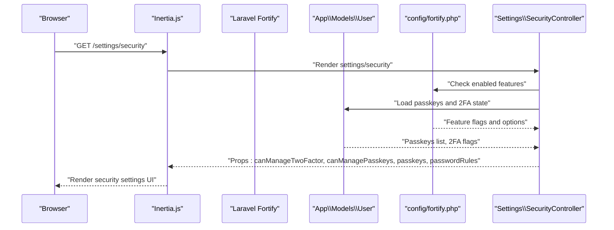

**Diagram sources**
- [SecurityController.php:19-51](file://app/Http/Controllers/Settings/SecurityController.php#L19-L51)
- [fortify.php:163-175](file://config/fortify.php#L163-L175)
- [User.php:32-50](file://app/Models/User.php#L32-L50)

## Detailed Component Analysis

### Enhanced User Model
The User model extends the base Authenticatable and implements the passkey contract. It uses Fortify traits for passkey and 2FA support, applies attribute casting for sensitive fields, and hides internal identifiers from serialization.

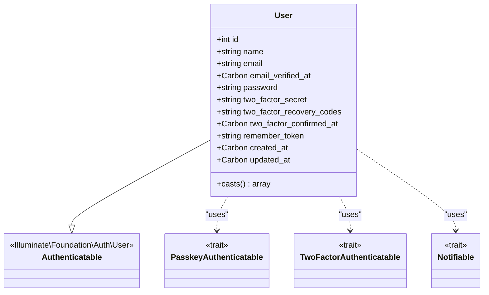

**Diagram sources**
- [User.php:32-50](file://app/Models/User.php#L32-L50)

**Section sources**
- [User.php:32-50](file://app/Models/User.php#L32-L50)

### Fortify Configuration and Custom Views
Fortify is configured to enable registration, password reset, email verification, 2FA with confirmation, and passkeys with password confirmation. Custom views are rendered via Inertia for login, registration, password reset, email verification, 2FA challenge, and password confirmation.

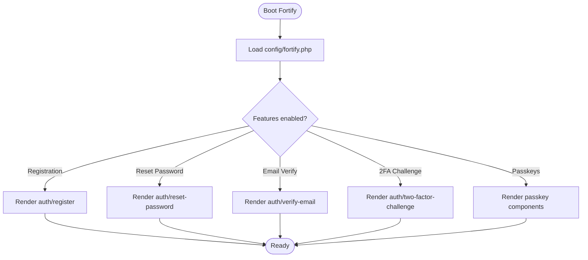

**Diagram sources**
- [fortify.php:163-175](file://config/fortify.php#L163-L175)
- [FortifyServiceProvider.php:51-77](file://app/Providers/FortifyServiceProvider.php#L51-L77)

**Section sources**
- [fortify.php:163-175](file://config/fortify.php#L163-L175)
- [FortifyServiceProvider.php:30-77](file://app/Providers/FortifyServiceProvider.php#L30-L77)

### Custom Actions: User Creation and Password Reset
- CreateNewUser validates profile and password rules, then persists a new user record.
- ResetUserPassword validates the new password against rules and forces an update.

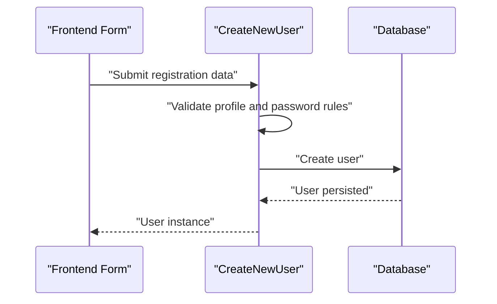

**Diagram sources**
- [CreateNewUser.php:20-32](file://app/Actions/Fortify/CreateNewUser.php#L20-L32)

**Section sources**
- [CreateNewUser.php:20-32](file://app/Actions/Fortify/CreateNewUser.php#L20-L32)
- [ResetUserPassword.php:19-28](file://app/Actions/Fortify/ResetUserPassword.php#L19-L28)

### Passkey/WebAuthn Support
- Database: A dedicated passkeys table stores credentials, indexed by user and credential ID.
- Frontend: Passkey management components allow enrollment and deletion; a well-known endpoint exposes passkey enrollment/manage routes.
- Backend: The User model implements the passkey user contract and uses the passkey authenticatable trait.

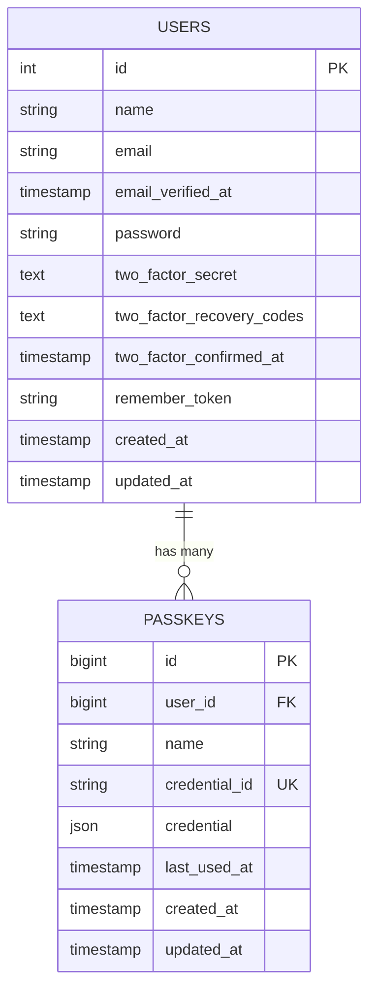

**Diagram sources**
- [2024_01_01_000000_create_passkeys_table.php:14-24](file://database/migrations/2024_01_01_000000_create_passkeys_table.php#L14-L24)
- [User.php:32-50](file://app/Models/User.php#L32-L50)

**Section sources**
- [2024_01_01_000000_create_passkeys_table.php:14-24](file://database/migrations/2024_01_01_000000_create_passkeys_table.php#L14-L24)
- [manage-passkeys.tsx:28-71](file://resources/js/components/manage-passkeys.tsx#L28-L71)
- [settings.php:29-34](file://routes/settings.php#L29-L34)
- [User.php:32-50](file://app/Models/User.php#L32-L50)

### Two-Factor Authentication (2FA) Setup and Backup Codes
- Database: Users table augmented with 2FA secret, recovery codes, and confirmation timestamp.
- Frontend: A settings component renders QR setup, manual key, and recovery codes display; supports enabling/disabling 2FA.
- Backend: Settings controller exposes 2FA state and passkey listings; routes enforce password confirmation for sensitive operations.

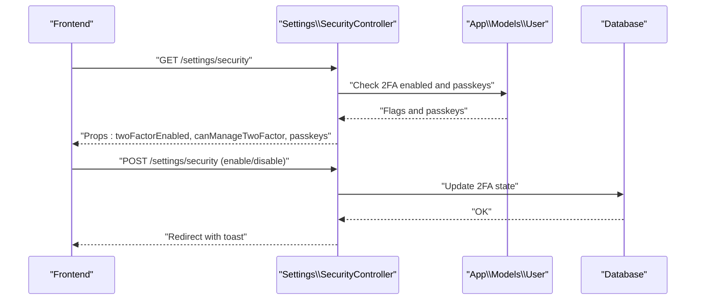

**Diagram sources**
- [SecurityController.php:19-51](file://app/Http/Controllers/Settings/SecurityController.php#L19-L51)
- [manage-two-factor.tsx:17-126](file://resources/js/components/manage-two-factor.tsx#L17-L126)
- [2025_08_14_170933_add_two_factor_columns_to_users_table.php:14-18](file://database/migrations/2025_08_14_170933_add_two_factor_columns_to_users_table.php#L14-L18)

**Section sources**
- [2025_08_14_170933_add_two_factor_columns_to_users_table.php:14-18](file://database/migrations/2025_08_14_170933_add_two_factor_columns_to_users_table.php#L14-L18)
- [manage-two-factor.tsx:17-126](file://resources/js/components/manage-two-factor.tsx#L17-L126)
- [SecurityController.php:19-51](file://app/Http/Controllers/Settings/SecurityController.php#L19-L51)

### Login and Registration Flows
- Login page integrates passkey verification and traditional email/password submission, with "remember me" and password reset links.
- Registration page enforces password rules and confirms password equality, then submits to the registration action.

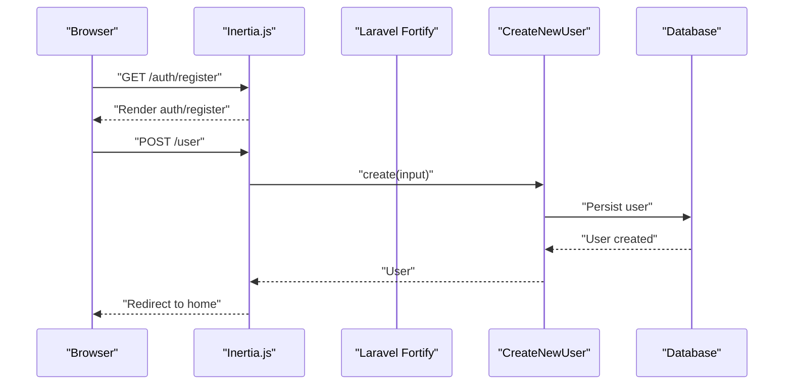

**Diagram sources**
- [register.tsx:16-115](file://resources/js/pages/auth/register.tsx#L16-L115)
- [CreateNewUser.php:20-32](file://app/Actions/Fortify/CreateNewUser.php#L20-L32)
- [FortifyServiceProvider.php:70-72](file://app/Providers/FortifyServiceProvider.php#L70-L72)

**Section sources**
- [login.tsx:20-112](file://resources/js/pages/auth/login.tsx#L20-L112)
- [register.tsx:16-115](file://resources/js/pages/auth/register.tsx#L16-L115)
- [FortifyServiceProvider.php:51-77](file://app/Providers/FortifyServiceProvider.php#L51-L77)

### Password Reset Mechanism
- Password reset view renders with token and email, enforcing password rules.
- Reset action validates the new password and updates the user's password.

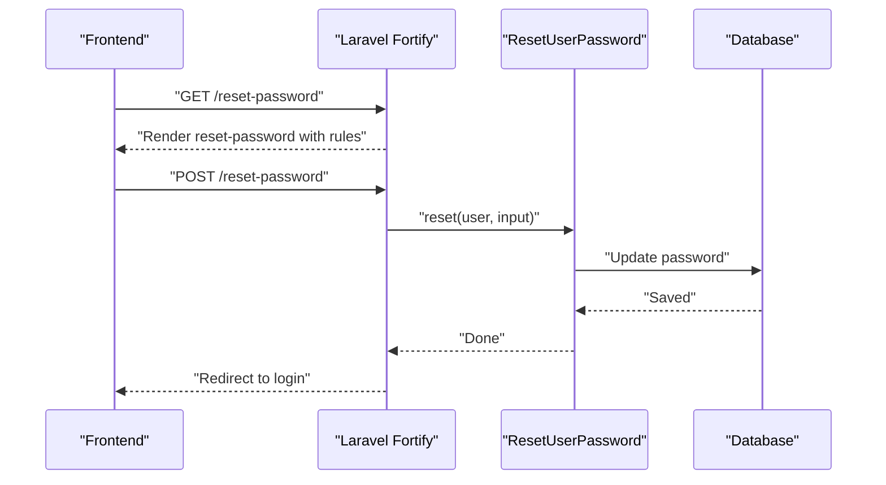

**Diagram sources**
- [FortifyServiceProvider.php:56-60](file://app/Providers/FortifyServiceProvider.php#L56-L60)
- [ResetUserPassword.php:19-28](file://app/Actions/Fortify/ResetUserPassword.php#L19-L28)

**Section sources**
- [FortifyServiceProvider.php:56-60](file://app/Providers/FortifyServiceProvider.php#L56-L60)
- [ResetUserPassword.php:19-28](file://app/Actions/Fortify/ResetUserPassword.php#L19-L28)

### Email Verification Processes
- Fortify email verification is enabled and renders a verification page with status messaging.
- Profile updates that modify email invalidate verification status to require re-verification.

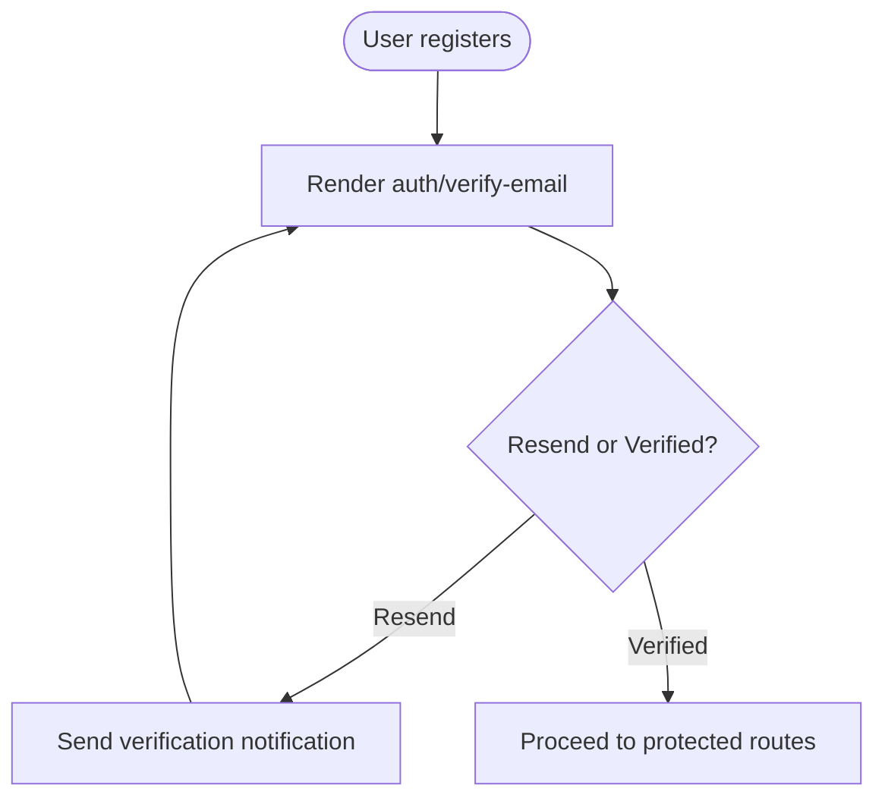

**Diagram sources**
- [FortifyServiceProvider.php:62-68](file://app/Providers/FortifyServiceProvider.php#L62-L68)
- [ProfileController.php:33-39](file://app/Http/Controllers/Settings/ProfileController.php#L33-L39)

**Section sources**
- [FortifyServiceProvider.php:62-68](file://app/Providers/FortifyServiceProvider.php#L62-L68)
- [ProfileController.php:33-39](file://app/Http/Controllers/Settings/ProfileController.php#L33-L39)

### Session Management and Security Best Practices
- Fortify rate limiters protect login, 2FA challenge, and passkey authentication attempts.
- Password confirmation timeout is configurable.
- Hidden attributes and casting reduce exposure of sensitive data.
- Settings routes enforce RequirePassword middleware for sensitive updates.

**Section sources**
- [FortifyServiceProvider.php:82-99](file://app/Providers/FortifyServiceProvider.php#L82-L99)
- [auth.php:115](file://config/auth.php#L115)
- [User.php:30-31](file://app/Models/User.php#L30-L31)
- [settings.php:19-24](file://routes/settings.php#L19-L24)

## Dependency Analysis
The authentication system exhibits clear separation of concerns:
- Fortify configuration depends on feature flags and rate limiting policies.
- Custom actions depend on validation rules and the User model.
- Controllers depend on Fortify features and user state.
- Frontend components depend on Inertia routes and controllers for data and mutations.

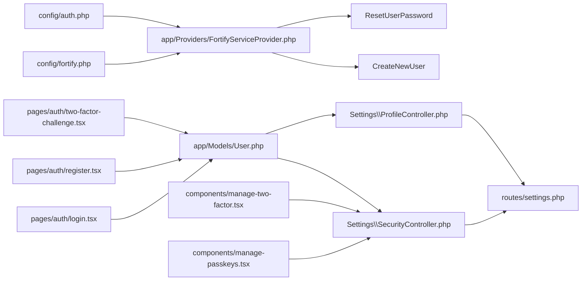

**Diagram sources**
- [fortify.php:1-178](file://config/fortify.php#L1-L178)
- [auth.php:1-118](file://config/auth.php#L1-L118)
- [FortifyServiceProvider.php:1-101](file://app/Providers/FortifyServiceProvider.php#L1-L101)
- [CreateNewUser.php:1-34](file://app/Actions/Fortify/CreateNewUser.php#L1-L34)
- [ResetUserPassword.php:1-30](file://app/Actions/Fortify/ResetUserPassword.php#L1-L30)
- [User.php:1-51](file://app/Models/User.php#L1-L51)
- [SecurityController.php:1-67](file://app/Http/Controllers/Settings/SecurityController.php#L1-L67)
- [ProfileController.php:1-63](file://app/Http/Controllers/Settings/ProfileController.php#L1-L63)
- [settings.php:1-35](file://routes/settings.php#L1-L35)
- [login.tsx:1-118](file://resources/js/pages/auth/login.tsx#L1-L118)
- [register.tsx:1-121](file://resources/js/pages/auth/register.tsx#L1-L121)
- [two-factor-challenge.tsx:1-134](file://resources/js/pages/auth/two-factor-challenge.tsx#L1-L134)
- [manage-two-factor.tsx:1-127](file://resources/js/components/manage-two-factor.tsx#L1-L127)
- [manage-passkeys.tsx:1-72](file://resources/js/components/manage-passkeys.tsx#L1-L72)

**Section sources**
- [FortifyServiceProvider.php:30-99](file://app/Providers/FortifyServiceProvider.php#L30-L99)
- [SecurityController.php:19-51](file://app/Http/Controllers/Settings/SecurityController.php#L19-L51)
- [ProfileController.php:19-44](file://app/Http/Controllers/Settings/ProfileController.php#L19-L44)

## Performance Considerations
- Rate limiting: Fortify provides per-minute limits for login, 2FA, and passkeys to mitigate brute force attacks.
- Attribute casting: Hashing of passwords and datetime casting reduces overhead and improves query performance.
- Indexes: The passkeys table includes indexes on user_id and credential_id to optimize lookups.
- Frontend: Inertia renders pages efficiently, minimizing round trips and leveraging reactive state updates.

[No sources needed since this section provides general guidance]

## Troubleshooting Guide
Common issues and resolutions:
- Login throttling: If login attempts exceed the rate limit, the system denies requests until the window passes. Adjust limits in the rate limiter configuration.
- 2FA challenges failing: Ensure the authenticator app time is synchronized and that recovery codes are used when TOTP is unavailable.
- Passkey enrollment failures: Verify the relying party ID and allowed origins match the application URL; check browser support and HTTPS requirements.
- Password reset errors: Confirm the reset token is valid and not expired; ensure the new password meets the configured rules.
- Email verification: If verification emails are not received, check mail configuration and resend the verification notification.

**Section sources**
- [FortifyServiceProvider.php:82-99](file://app/Providers/FortifyServiceProvider.php#L82-L99)
- [two-factor-challenge.tsx:15-133](file://resources/js/pages/auth/two-factor-challenge.tsx#L15-L133)
- [fortify.php:145-150](file://config/fortify.php#L145-L150)
- [auth.php:95-102](file://config/auth.php#L95-L102)

## Conclusion
ScholarGraph's authentication system leverages Laravel Fortify with custom actions and robust frontend integration to provide secure, modern authentication. The enhanced User model, passkey/WebAuthn support, and 2FA with backup codes deliver strong security while maintaining usability. The modular design ensures maintainability and extensibility for future enhancements.