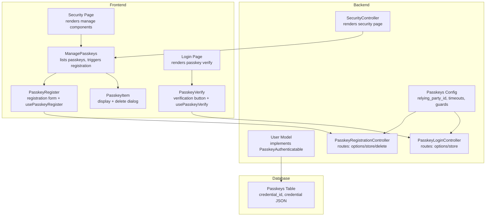
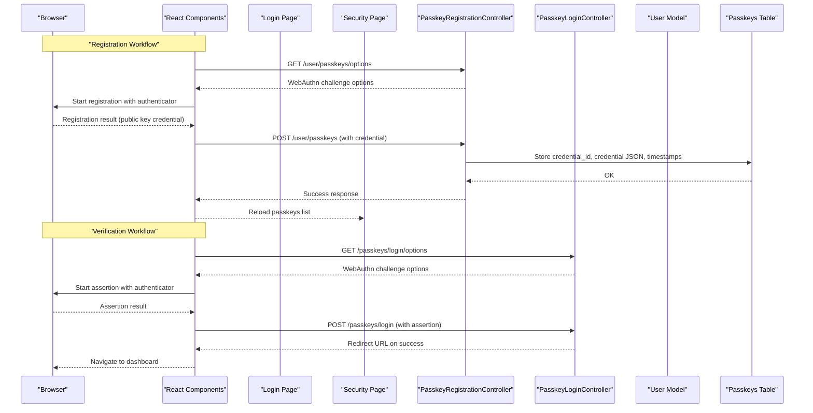
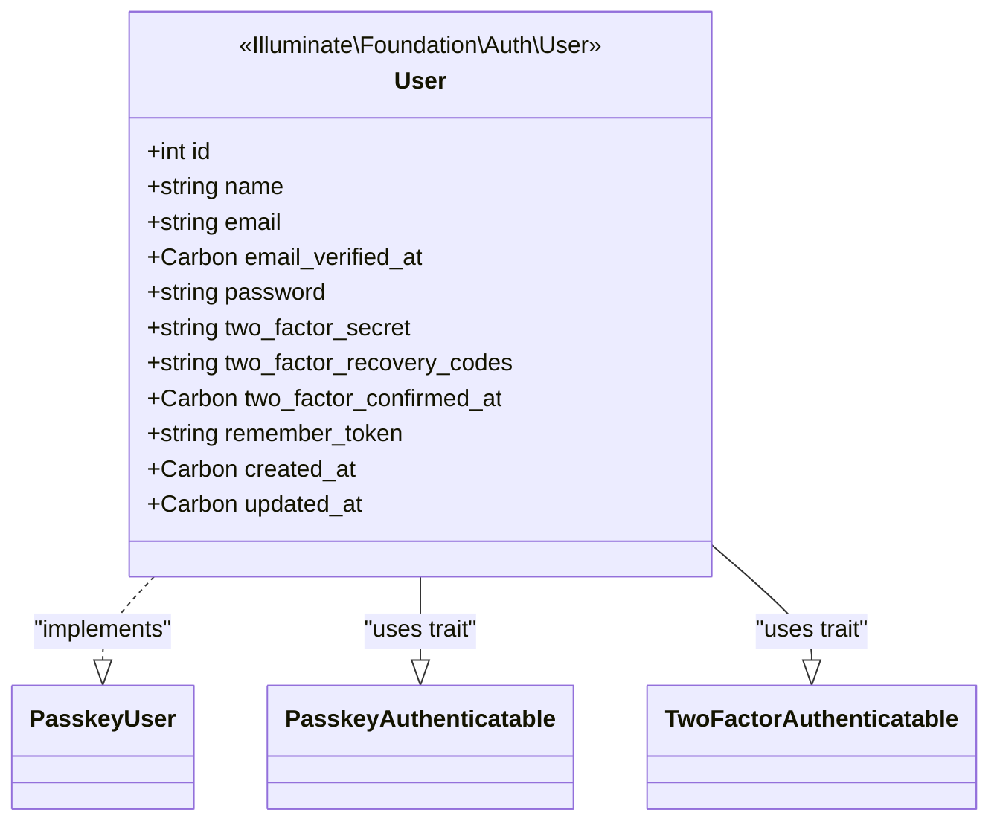
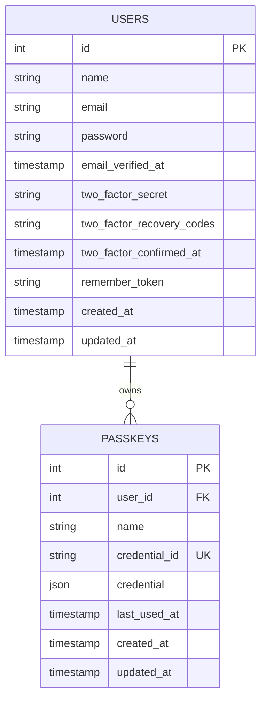
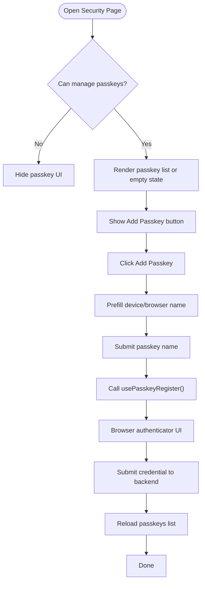
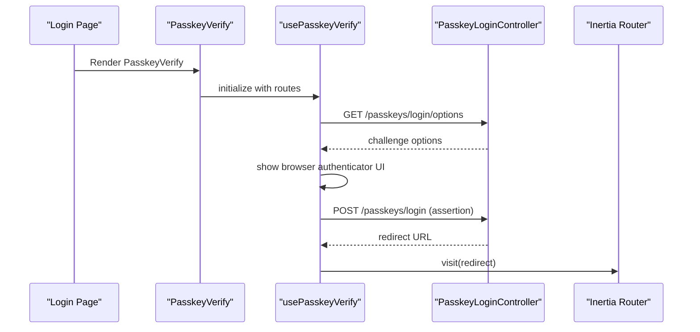
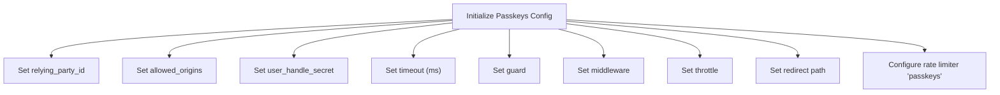
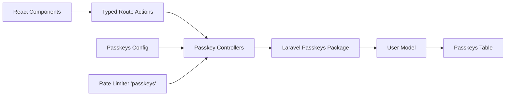

# Passkeys & WebAuthn Authentication

<cite>
**Referenced Files in This Document**
- [User.php](file://app/Models/User.php)
- [2024_01_01_000000_create_passkeys_table.php](file://database/migrations/2024_01_01_000000_create_passkeys_table.php)
- [FortifyServiceProvider.php](file://app/Providers/FortifyServiceProvider.php)
- [SecurityController.php](file://app/Http/Controllers/Settings/SecurityController.php)
- [passkeys.php](file://vendor/laravel/passkeys/config/passkeys.php)
- [manage-passkeys.tsx](file://resources/js/components/manage-passkeys.tsx)
- [passkey-register.tsx](file://resources/js/components/passkey-register.tsx)
- [passkey-verify.tsx](file://resources/js/components/passkey-verify.tsx)
- [passkey-item.tsx](file://resources/js/components/passkey-item.tsx)
- [PasskeyRegistrationController.ts](file://resources/js/actions/Laravel/Passkeys/Http/Controllers/PasskeyRegistrationController.ts)
- [PasskeyLoginController.ts](file://resources/js/actions/Laravel/Passkeys/Http/Controllers/PasskeyLoginController.ts)
- [security.tsx](file://resources/js/pages/settings/security.tsx)
- [login.tsx](file://resources/js/pages/auth/login.tsx)
- [settings.php](file://routes/settings.php)
</cite>

## Table of Contents
1. [Introduction](#introduction)
2. [Project Structure](#project-structure)
3. [Core Components](#core-components)
4. [Architecture Overview](#architecture-overview)
5. [Detailed Component Analysis](#detailed-component-analysis)
6. [Dependency Analysis](#dependency-analysis)
7. [Performance Considerations](#performance-considerations)
8. [Troubleshooting Guide](#troubleshooting-guide)
9. [Conclusion](#conclusion)

## Introduction
This document explains the passkey and WebAuthn authentication implementation in the application. It covers the PasskeyAuthenticatable trait usage, passkey registration and verification workflows, WebAuthn protocol integration, credential management, browser compatibility considerations, UI components for passkey management, security key handling, and fallback authentication methods. It also provides code example references for passkey operations, credential storage, and frontend integration patterns.

## Project Structure
The passkey implementation spans backend Eloquent models and controllers, Laravel configuration, frontend React components, and Inertia-driven pages. Key areas include:
- Backend: User model implementing PasskeyAuthenticatable, passkey management routes, and controllers
- Database: Passkeys table schema for storing credentials
- Frontend: React components for registering, verifying, listing, and removing passkeys
- Configuration: Laravel Passkeys package configuration and rate limiting



**Diagram sources**
- [User.php:32-35](file://app/Models/User.php#L32-L35)
- [SecurityController.php:19-51](file://app/Http/Controllers/Settings/SecurityController.php#L19-L51)
- [PasskeyRegistrationController.ts:1-231](file://resources/js/actions/Laravel/Passkeys/Http/Controllers/PasskeyRegistrationController.ts#L1-L231)
- [PasskeyLoginController.ts:1-141](file://resources/js/actions/Laravel/Passkeys/Http/Controllers/PasskeyLoginController.ts#L1-L141)
- [passkeys.php:16-117](file://vendor/laravel/passkeys/config/passkeys.php#L16-L117)
- [2024_01_01_000000_create_passkeys_table.php:14-24](file://database/migrations/2024_01_01_000000_create_passkeys_table.php#L14-L24)
- [manage-passkeys.tsx:28-71](file://resources/js/components/manage-passkeys.tsx#L28-L71)
- [passkey-register.tsx:12-109](file://resources/js/components/passkey-register.tsx#L12-L109)
- [passkey-verify.tsx:20-75](file://resources/js/components/passkey-verify.tsx#L20-L75)
- [passkey-item.tsx:20-94](file://resources/js/components/passkey-item.tsx#L20-L94)
- [security.tsx:20-138](file://resources/js/pages/settings/security.tsx#L20-L138)
- [login.tsx:20-112](file://resources/js/pages/auth/login.tsx#L20-L112)

**Section sources**
- [User.php:32-35](file://app/Models/User.php#L32-L35)
- [2024_01_01_000000_create_passkeys_table.php:14-24](file://database/migrations/2024_01_01_000000_create_passkeys_table.php#L14-L24)
- [FortifyServiceProvider.php:30-101](file://app/Providers/FortifyServiceProvider.php#L30-L101)
- [SecurityController.php:19-51](file://app/Http/Controllers/Settings/SecurityController.php#L19-L51)
- [passkeys.php:16-117](file://vendor/laravel/passkeys/config/passkeys.php#L16-L117)
- [manage-passkeys.tsx:28-71](file://resources/js/components/manage-passkeys.tsx#L28-L71)
- [passkey-register.tsx:12-109](file://resources/js/components/passkey-register.tsx#L12-L109)
- [passkey-verify.tsx:20-75](file://resources/js/components/passkey-verify.tsx#L20-L75)
- [passkey-item.tsx:20-94](file://resources/js/components/passkey-item.tsx#L20-L94)
- [security.tsx:20-138](file://resources/js/pages/settings/security.tsx#L20-L138)
- [login.tsx:20-112](file://resources/js/pages/auth/login.tsx#L20-L112)
- [settings.php:29-34](file://routes/settings.php#L29-L34)

## Core Components
- PasskeyAuthenticatable trait usage: The User model implements the PasskeyUser interface and uses the PasskeyAuthenticatable trait to enable passkey authentication capabilities.
- Passkeys table schema: Stores per-user passkey credentials with indexed foreign keys, unique credential identifiers, JSON credential data, and timestamps for creation and last use.
- Laravel Passkeys configuration: Defines relying party ID, allowed origins, user handle secret, operation timeout, guard, middleware, throttling, and redirect behavior.
- Frontend passkey components: Registration form with device/browser detection, verification button, passkey list item with removal dialog, and management container.
- Controllers and routes: Passkey registration endpoints (options/store/delete) and passkey login endpoints (options/store), integrated via typed route actions.

**Section sources**
- [User.php:32-35](file://app/Models/User.php#L32-L35)
- [2024_01_01_000000_create_passkeys_table.php:14-24](file://database/migrations/2024_01_01_000000_create_passkeys_table.php#L14-L24)
- [passkeys.php:16-117](file://vendor/laravel/passkeys/config/passkeys.php#L16-L117)
- [manage-passkeys.tsx:28-71](file://resources/js/components/manage-passkeys.tsx#L28-L71)
- [passkey-register.tsx:12-109](file://resources/js/components/passkey-register.tsx#L12-L109)
- [passkey-verify.tsx:20-75](file://resources/js/components/passkey-verify.tsx#L20-L75)
- [passkey-item.tsx:20-94](file://resources/js/components/passkey-item.tsx#L20-L94)
- [PasskeyRegistrationController.ts:1-231](file://resources/js/actions/Laravel/Passkeys/Http/Controllers/PasskeyRegistrationController.ts#L1-L231)
- [PasskeyLoginController.ts:1-141](file://resources/js/actions/Laravel/Passkeys/Http/Controllers/PasskeyLoginController.ts#L1-L141)

## Architecture Overview
The passkey authentication architecture integrates frontend React components with Laravel backend controllers and the Laravel Passkeys package. The flow involves:
- Registration: The frontend requests registration options from the backend, then performs the WebAuthn ceremony using the browser’s authenticator, and submits the resulting credential to be stored.
- Verification: The frontend requests verification options from the backend, performs the WebAuthn assertion, and receives a redirect response upon success.
- Credential storage: Credentials are persisted in the passkeys table with unique identifiers and JSON blobs representing authenticator data.
- Fallback authentication: Traditional email/password login remains available alongside passkey verification.



**Diagram sources**
- [PasskeyRegistrationController.ts:1-231](file://resources/js/actions/Laravel/Passkeys/Http/Controllers/PasskeyRegistrationController.ts#L1-L231)
- [PasskeyLoginController.ts:1-141](file://resources/js/actions/Laravel/Passkeys/Http/Controllers/PasskeyLoginController.ts#L1-L141)
- [2024_01_01_000000_create_passkeys_table.php:14-24](file://database/migrations/2024_01_01_000000_create_passkeys_table.php#L14-L24)
- [login.tsx:20-112](file://resources/js/pages/auth/login.tsx#L20-L112)
- [security.tsx:20-138](file://resources/js/pages/settings/security.tsx#L20-L138)

## Detailed Component Analysis

### PasskeyAuthenticatable Trait Usage
- The User model implements the PasskeyUser interface and uses the PasskeyAuthenticatable trait to enable passkey authentication features.
- This trait integrates with Laravel Fortify and the underlying WebAuthn library to support passkey registration and verification.



**Diagram sources**
- [User.php:32-35](file://app/Models/User.php#L32-L35)

**Section sources**
- [User.php:32-35](file://app/Models/User.php#L32-L35)

### Passkeys Database Schema
- The passkeys table stores per-user passkey credentials with:
  - Foreign key to users
  - Name field for human-readable identification
  - Unique credential_id for authenticator binding
  - JSON credential blob containing authenticator data
  - last_used_at timestamp
  - Indexes on user_id for efficient queries



**Diagram sources**
- [2024_01_01_000000_create_passkeys_table.php:14-24](file://database/migrations/2024_01_01_000000_create_passkeys_table.php#L14-L24)

**Section sources**
- [2024_01_01_000000_create_passkeys_table.php:14-24](file://database/migrations/2024_01_01_000000_create_passkeys_table.php#L14-L24)

### Passkey Registration UI Components
- PasskeyRegister component:
  - Detects browser and OS to prefill passkey name
  - Uses usePasskeyRegister hook to initiate WebAuthn registration
  - Submits credential to backend registration endpoint
  - Handles loading states, errors, and success callbacks
- ManagePasskeys component:
  - Renders empty state or passkey list
  - Integrates PasskeyRegister and PasskeyItem components
  - Triggers reload on successful registration
- PasskeyItem component:
  - Displays passkey metadata (name, authenticator, timestamps)
  - Provides confirmation dialog for deletion



**Diagram sources**
- [manage-passkeys.tsx:28-71](file://resources/js/components/manage-passkeys.tsx#L28-L71)
- [passkey-register.tsx:12-109](file://resources/js/components/passkey-register.tsx#L12-L109)
- [passkey-item.tsx:20-94](file://resources/js/components/passkey-item.tsx#L20-L94)

**Section sources**
- [manage-passkeys.tsx:28-71](file://resources/js/components/manage-passkeys.tsx#L28-L71)
- [passkey-register.tsx:12-109](file://resources/js/components/passkey-register.tsx#L12-L109)
- [passkey-item.tsx:20-94](file://resources/js/components/passkey-item.tsx#L20-L94)

### Passkey Verification UI Component
- PasskeyVerify component:
  - Uses usePasskeyVerify hook to request verification options and submit assertions
  - Supports custom routes for options and submit endpoints
  - Handles loading states, errors, and redirects on success
  - Conditionally renders only if passkeys are supported in the browser



**Diagram sources**
- [passkey-verify.tsx:20-75](file://resources/js/components/passkey-verify.tsx#L20-L75)
- [PasskeyLoginController.ts:1-141](file://resources/js/actions/Laravel/Passkeys/Http/Controllers/PasskeyLoginController.ts#L1-L141)
- [login.tsx:20-112](file://resources/js/pages/auth/login.tsx#L20-L112)

**Section sources**
- [passkey-verify.tsx:20-75](file://resources/js/components/passkey-verify.tsx#L20-L75)
- [PasskeyLoginController.ts:1-141](file://resources/js/actions/Laravel/Passkeys/Http/Controllers/PasskeyLoginController.ts#L1-L141)
- [login.tsx:20-112](file://resources/js/pages/auth/login.tsx#L20-L112)

### Backend Controllers and Routes
- PasskeyRegistrationController:
  - Exposes endpoints for registration options, storing passkeys, and deleting passkeys
  - Typed route definitions enable safe client-side calls
- PasskeyLoginController:
  - Exposes endpoints for login options and submitting assertions
- SecurityController:
  - Renders the security settings page with passkey management props
  - Builds passkey metadata for display (humanized timestamps, authenticator info)

```mermaid
classDiagram
class PasskeyRegistrationController {
+GET /user/passkeys/options
+POST /user/passkeys
+DELETE /user/passkeys/{passkey}
}
class PasskeyLoginController {
+GET /passkeys/login/options
+POST /passkeys/login
}
class SecurityController {
+GET /settings/security
-buildPasskeyProps()
}
SecurityController --> PasskeyRegistrationController : "uses for props"
```

**Diagram sources**
- [PasskeyRegistrationController.ts:1-231](file://resources/js/actions/Laravel/Passkeys/Http/Controllers/PasskeyRegistrationController.ts#L1-L231)
- [PasskeyLoginController.ts:1-141](file://resources/js/actions/Laravel/Passkeys/Http/Controllers/PasskeyLoginController.ts#L1-L141)
- [SecurityController.php:19-51](file://app/Http/Controllers/Settings/SecurityController.php#L19-L51)

**Section sources**
- [PasskeyRegistrationController.ts:1-231](file://resources/js/actions/Laravel/Passkeys/Http/Controllers/PasskeyRegistrationController.ts#L1-L231)
- [PasskeyLoginController.ts:1-141](file://resources/js/actions/Laravel/Passkeys/Http/Controllers/PasskeyLoginController.ts#L1-L141)
- [SecurityController.php:19-51](file://app/Http/Controllers/Settings/SecurityController.php#L19-L51)

### WebAuthn Protocol Integration and Configuration
- Relying Party ID and Allowed Origins:
  - The relying party ID defaults to the application URL host
  - Allowed origins default to the application URL
- User Handle Secret:
  - Used to derive a stable WebAuthn user handle from the user model
- Operation Timeout:
  - Default timeout for WebAuthn operations is configured in milliseconds
- Guard and Middleware:
  - Authentication guard for passkey login is configurable
  - Middleware for passkey routes and management can be customized
- Redirect Behavior:
  - Successful verification redirects to a configurable path
- Rate Limiting:
  - Dedicated rate limiter for passkeys protects against abuse



**Diagram sources**
- [passkeys.php:16-117](file://vendor/laravel/passkeys/config/passkeys.php#L16-L117)
- [FortifyServiceProvider.php:94-98](file://app/Providers/FortifyServiceProvider.php#L94-L98)

**Section sources**
- [passkeys.php:16-117](file://vendor/laravel/passkeys/config/passkeys.php#L16-L117)
- [FortifyServiceProvider.php:94-98](file://app/Providers/FortifyServiceProvider.php#L94-L98)

### Browser Compatibility and Fallback Methods
- Browser Support Detection:
  - Registration and verification components check for passkey support and render accordingly
- Fallback Authentication:
  - Traditional email/password login remains available on the login page
  - Users can still update passwords and manage other security settings

**Section sources**
- [passkey-register.tsx:59-65](file://resources/js/components/passkey-register.tsx#L59-L65)
- [passkey-verify.tsx:38-40](file://resources/js/components/passkey-verify.tsx#L38-L40)
- [login.tsx:20-112](file://resources/js/pages/auth/login.tsx#L20-L112)

### Frontend Integration Patterns
- Typed Route Actions:
  - Registration and login controllers expose strongly-typed route definitions for safe client-side usage
- Inertia Integration:
  - React components integrate with Inertia router for navigation and form submissions
- Well-Known Endpoint:
  - A .well-known endpoint exposes enrollment and management URLs for passkey discovery

**Section sources**
- [PasskeyRegistrationController.ts:1-231](file://resources/js/actions/Laravel/Passkeys/Http/Controllers/PasskeyRegistrationController.ts#L1-L231)
- [PasskeyLoginController.ts:1-141](file://resources/js/actions/Laravel/Passkeys/Http/Controllers/PasskeyLoginController.ts#L1-L141)
- [login.tsx:20-112](file://resources/js/pages/auth/login.tsx#L20-L112)
- [settings.php:29-34](file://routes/settings.php#L29-L34)

## Dependency Analysis
The passkey system exhibits clear separation of concerns:
- Frontend components depend on typed route actions and the @laravel/passkeys React hooks
- Controllers depend on the Laravel Passkeys package for WebAuthn operations
- The User model depends on the PasskeyAuthenticatable trait and TwoFactorAuthenticatable trait
- Database schema supports efficient passkey retrieval and uniqueness constraints
- Configuration governs security and operational behavior



**Diagram sources**
- [PasskeyRegistrationController.ts:1-231](file://resources/js/actions/Laravel/Passkeys/Http/Controllers/PasskeyRegistrationController.ts#L1-L231)
- [PasskeyLoginController.ts:1-141](file://resources/js/actions/Laravel/Passkeys/Http/Controllers/PasskeyLoginController.ts#L1-L141)
- [User.php:32-35](file://app/Models/User.php#L32-L35)
- [2024_01_01_000000_create_passkeys_table.php:14-24](file://database/migrations/2024_01_01_000000_create_passkeys_table.php#L14-L24)
- [passkeys.php:16-117](file://vendor/laravel/passkeys/config/passkeys.php#L16-L117)
- [FortifyServiceProvider.php:94-98](file://app/Providers/FortifyServiceProvider.php#L94-L98)

**Section sources**
- [PasskeyRegistrationController.ts:1-231](file://resources/js/actions/Laravel/Passkeys/Http/Controllers/PasskeyRegistrationController.ts#L1-L231)
- [PasskeyLoginController.ts:1-141](file://resources/js/actions/Laravel/Passkeys/Http/Controllers/PasskeyLoginController.ts#L1-L141)
- [User.php:32-35](file://app/Models/User.php#L32-L35)
- [2024_01_01_000000_create_passkeys_table.php:14-24](file://database/migrations/2024_01_01_000000_create_passkeys_table.php#L14-L24)
- [passkeys.php:16-117](file://vendor/laravel/passkeys/config/passkeys.php#L16-L117)
- [FortifyServiceProvider.php:94-98](file://app/Providers/FortifyServiceProvider.php#L94-L98)

## Performance Considerations
- Database indexing: The passkeys table includes an index on user_id to optimize passkey retrieval during verification and management operations.
- Rate limiting: Dedicated rate limiting for passkeys reduces load and prevents abuse while allowing reasonable throughput.
- Credential storage: Storing credentials as JSON minimizes overhead and leverages database-native JSON handling.

**Section sources**
- [2024_01_01_000000_create_passkeys_table.php:23](file://database/migrations/2024_01_01_000000_create_passkeys_table.php#L23-L24)
- [FortifyServiceProvider.php:94-98](file://app/Providers/FortifyServiceProvider.php#L94-L98)

## Troubleshooting Guide
- Passkey not supported:
  - Registration and verification components conditionally render only when passkeys are supported in the browser. If unsupported, a message is shown and the UI remains non-functional for passkeys.
- Registration fails:
  - Ensure the passkey name is provided and the browser authenticator completes the registration. Check for error messages returned by the usePasskeyRegister hook and review server-side registration endpoints.
- Verification fails:
  - Confirm that the relying party ID and allowed origins match the deployment environment. Review the passkeys configuration and ensure the correct guard is used.
- Credential conflicts:
  - The credential_id is unique. If duplicate registrations occur, investigate whether the same authenticator is being reused or if there are cross-domain mismatches.
- Rate limiting:
  - Excessive requests trigger rate limiting. Adjust throttle settings or reduce request frequency.

**Section sources**
- [passkey-register.tsx:59-65](file://resources/js/components/passkey-register.tsx#L59-L65)
- [passkey-verify.tsx:38-40](file://resources/js/components/passkey-verify.tsx#L38-L40)
- [passkeys.php:16-117](file://vendor/laravel/passkeys/config/passkeys.php#L16-L117)
- [FortifyServiceProvider.php:94-98](file://app/Providers/FortifyServiceProvider.php#L94-L98)

## Conclusion
The passkey and WebAuthn implementation integrates seamlessly across frontend React components, backend controllers, and Laravel configuration. The User model leverages the PasskeyAuthenticatable trait, credentials are securely stored in the passkeys table, and the frontend provides intuitive registration and verification experiences with robust fallbacks to traditional authentication. Configuration ensures strong security boundaries, while rate limiting and typed route actions improve reliability and developer experience.