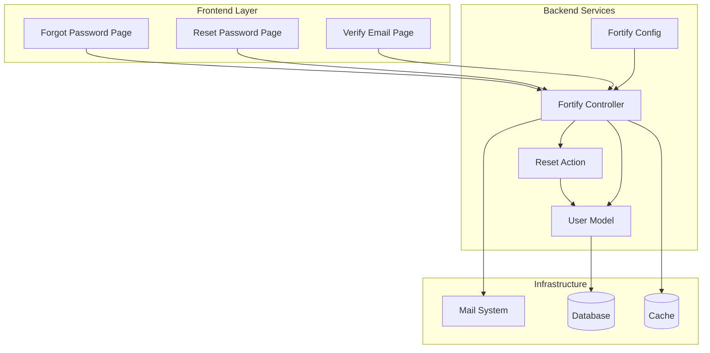
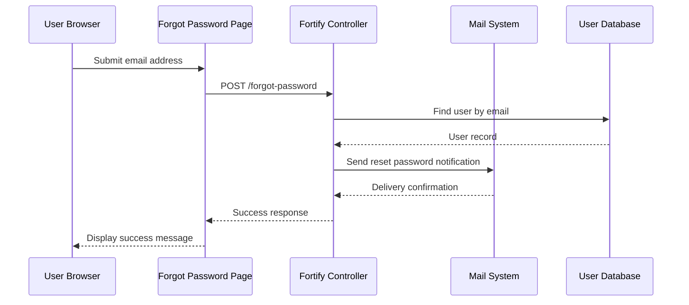
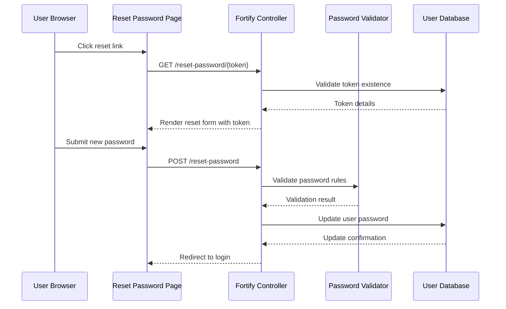
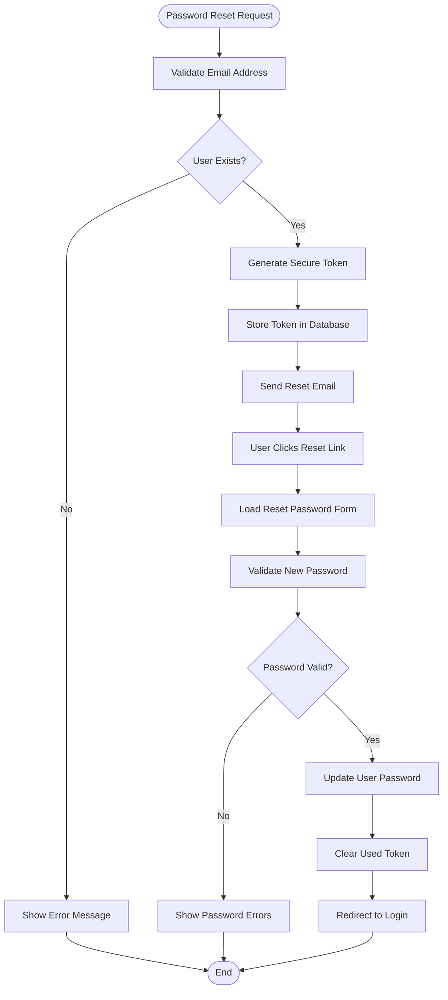
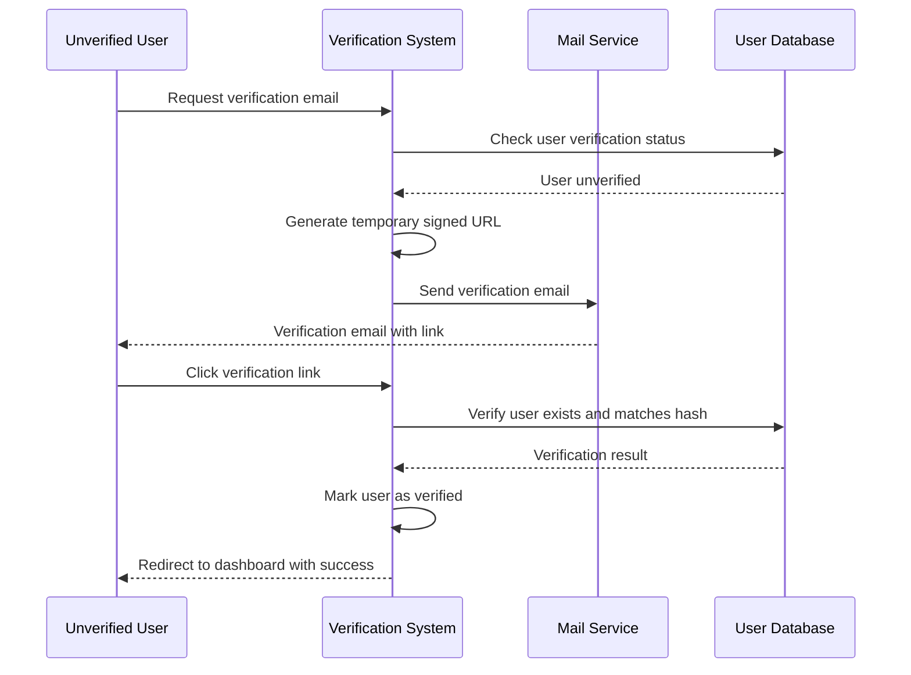
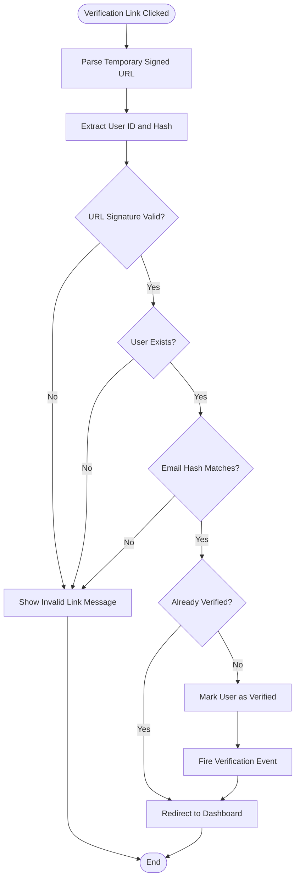

# Password Reset & Email Verification

<cite>
**Referenced Files in This Document**
- [ResetUserPassword.php](file://app/Actions/Fortify/ResetUserPassword.php)
- [PasswordValidationRules.php](file://app/Concerns/PasswordValidationRules.php)
- [User.php](file://app/Models/User.php)
- [fortify.php](file://config/fortify.php)
- [forgot-password.tsx](file://resources/js/pages/auth/forgot-password.tsx)
- [reset-password.tsx](file://resources/js/pages/auth/reset-password.tsx)
- [verify-email.tsx](file://resources/js/pages/auth/verify-email.tsx)
- [PasswordResetTest.php](file://tests/Feature/Auth/PasswordResetTest.php)
- [EmailVerificationTest.php](file://tests/Feature/Auth/EmailVerificationTest.php)
- [web.php](file://routes/web.php)
</cite>

## Table of Contents
1. [Introduction](#introduction)
2. [System Architecture](#system-architecture)
3. [Password Reset Workflow](#password-reset-workflow)
4. [Email Verification System](#email-verification-system)
5. [Security Measures](#security-measures)
6. [Frontend Implementation](#frontend-implementation)
7. [Testing Framework](#testing-framework)
8. [Configuration Management](#configuration-management)
9. [Troubleshooting Guide](#troubleshooting-guide)
10. [Best Practices](#best-practices)

## Introduction

This document provides comprehensive documentation for the password reset and email verification systems implemented in the Laravel application. The system leverages Laravel Fortify for authentication features and Inertia.js for the frontend implementation. It covers the complete workflow from token generation and email delivery to password updates and verification confirmation links.

The authentication system supports two primary security workflows:
- **Password Reset**: Allows users to reset their forgotten passwords via email tokens
- **Email Verification**: Confirms user email addresses through secure verification links

Both systems implement robust security measures including token expiration, rate limiting, and verification status tracking to ensure secure user authentication experiences.

## System Architecture

The authentication system follows a modular architecture with clear separation of concerns between backend processing, frontend presentation, and security enforcement.

**Diagram sources**
- [forgot-password.tsx:12-64](file://resources/js/pages/auth/forgot-password.tsx#L12-L64)
- [reset-password.tsx:16-91](file://resources/js/pages/auth/reset-password.tsx#L16-L91)
- [verify-email.tsx:9-40](file://resources/js/pages/auth/verify-email.tsx#L9-L40)

The architecture ensures that all authentication operations are handled through Laravel Fortify's standardized interfaces while maintaining clean separation between presentation logic and business logic.

**Section sources**
- [fortify.php:163-175](file://config/fortify.php#L163-L175)
- [User.php:32-50](file://app/Models/User.php#L32-L50)

## Password Reset Workflow

The password reset workflow consists of three main stages: password reset request, token validation, and password update.

### Stage 1: Password Reset Request

The process begins when users submit their email address on the forgot password page. The frontend component handles form submission and displays appropriate feedback messages.

**Diagram sources**
- [forgot-password.tsx:24-55](file://resources/js/pages/auth/forgot-password.tsx#L24-L55)
- [PasswordResetTest.php:18-26](file://tests/Feature/Auth/PasswordResetTest.php#L18-L26)

### Stage 2: Token Validation and Reset Link

When users click the reset link in their email, they are directed to the reset password page with embedded token and email parameters. The frontend automatically includes these parameters in the form submission.

**Diagram sources**
- [reset-password.tsx:21-88](file://resources/js/pages/auth/reset-password.tsx#L21-L88)
- [ResetUserPassword.php:19-28](file://app/Actions/Fortify/ResetUserPassword.php#L19-L28)

### Stage 3: Password Update Process

The password update process validates the new password against security rules and updates the user's credentials securely.

**Diagram sources**
- [ResetUserPassword.php:21-27](file://app/Actions/Fortify/ResetUserPassword.php#L21-L27)
- [PasswordValidationRules.php:15-18](file://app/Concerns/PasswordValidationRules.php#L15-L18)

**Section sources**
- [PasswordResetTest.php:44-65](file://tests/Feature/Auth/PasswordResetTest.php#L44-L65)
- [reset-password.tsx:16-91](file://resources/js/pages/auth/reset-password.tsx#L16-L91)

## Email Verification System

The email verification system ensures that user email addresses are confirmed before granting full access to the application. This process involves generating secure verification links and validating them upon user interaction.

### Verification Link Generation

The system generates temporary signed URLs that include user identification and email hash for security validation.

**Diagram sources**
- [verify-email.tsx:21-37](file://resources/js/pages/auth/verify-email.tsx#L21-L37)
- [EmailVerificationTest.php:26-38](file://tests/Feature/Auth/EmailVerificationTest.php#L26-L38)

### Verification Link Validation

The verification process includes multiple security checks to prevent tampering and ensure proper user authentication.

**Diagram sources**
- [EmailVerificationTest.php:40-55](file://tests/Feature/Auth/EmailVerificationTest.php#L40-L55)
- [User.php:21](file://app/Models/User.php#L21)

**Section sources**
- [EmailVerificationTest.php:21-38](file://tests/Feature/Auth/EmailVerificationTest.php#L21-L38)
- [verify-email.tsx:9-40](file://resources/js/pages/auth/verify-email.tsx#L9-L40)

## Security Measures

The authentication system implements multiple layers of security to protect user accounts and prevent unauthorized access attempts.

### Token Expiration and Management

Both password reset tokens and email verification links use temporary signed URLs with expiration times to minimize security risks.

### Rate Limiting Implementation

The system implements comprehensive rate limiting to prevent abuse and brute force attacks:

- **Login Attempts**: Throttles login attempts to prevent credential stuffing attacks
- **Password Reset Requests**: Limits password reset link generation frequency
- **Verification Emails**: Controls the rate of verification email resends

### Password Security Validation

The system enforces strong password policies through comprehensive validation rules that check for complexity, length, and common patterns.

### Email Verification Status Tracking

The User model maintains verification timestamps and status indicators to track email confirmation state throughout the user lifecycle.

**Section sources**
- [fortify.php:117-121](file://config/fortify.php#L117-L121)
- [PasswordValidationRules.php:15-28](file://app/Concerns/PasswordValidationRules.php#L15-L28)
- [User.php:44-48](file://app/Models/User.php#L44-L48)

## Frontend Implementation

The frontend components provide intuitive user interfaces for both password reset and email verification workflows, built with React and Inertia.js.

### Forgot Password Component

The forgot password page provides a clean interface for requesting password reset links with proper form validation and user feedback.

### Reset Password Component

The reset password page automatically handles token inclusion and provides comprehensive password validation with real-time feedback.

### Email Verification Component

The verification page offers a simple interface for resending verification emails and provides clear messaging about verification status.

### Form Integration Patterns

All components integrate seamlessly with the backend through Inertia.js form handling, providing smooth user experiences with proper loading states and error handling.

**Section sources**
- [forgot-password.tsx:12-70](file://resources/js/pages/auth/forgot-password.tsx#L12-L70)
- [reset-password.tsx:16-97](file://resources/js/pages/auth/reset-password.tsx#L16-L97)
- [verify-email.tsx:9-47](file://resources/js/pages/auth/verify-email.tsx#L9-L47)

## Testing Framework

The application includes comprehensive test suites that validate both password reset and email verification workflows, ensuring reliability and security.

### Password Reset Testing

Tests cover the complete password reset flow including link generation, token validation, and successful password updates while preventing invalid token usage.

### Email Verification Testing

Tests validate the verification process including proper link generation, hash validation, and redirect behavior for both verified and unverified users.

### Security Validation Tests

Automated tests ensure that security measures are properly enforced, including invalid token rejection and proper error handling.

**Section sources**
- [PasswordResetTest.php:12-78](file://tests/Feature/Auth/PasswordResetTest.php#L12-L78)
- [EmailVerificationTest.php:13-101](file://tests/Feature/Auth/EmailVerificationTest.php#L13-L101)

## Configuration Management

The authentication system relies on centralized configuration through Laravel Fortify, which provides flexible customization options for authentication features.

### Feature Configuration

The system enables specific authentication features including password reset, email verification, two-factor authentication, and passkey support through configurable feature flags.

### Security Configuration

Configuration options include rate limiting parameters, home route definitions, and feature-specific settings that can be customized based on application requirements.

### Route Protection

Application routes are protected with middleware that ensures only authenticated and verified users can access protected areas of the application.

**Section sources**
- [fortify.php:163-175](file://config/fortify.php#L163-L175)
- [web.php:7-9](file://routes/web.php#L7-L9)

## Troubleshooting Guide

Common issues and their solutions for the authentication system:

### Password Reset Issues

- **Reset link not received**: Verify email configuration and check spam folders
- **Invalid token errors**: Ensure users access links within expiration timeframe
- **Password validation failures**: Check minimum requirements and confirmation matching

### Email Verification Problems

- **Verification link invalid**: Confirm URL signature and expiration settings
- **Hash mismatch errors**: Verify email address consistency and user account status
- **Multiple verification attempts**: Check rate limiting configuration and user status

### Frontend Integration Issues

- **Form submission problems**: Verify Inertia.js integration and CSRF token handling
- **Route resolution errors**: Check route definitions and middleware configuration
- **State management issues**: Ensure proper form state handling and error display

**Section sources**
- [PasswordResetTest.php:67-78](file://tests/Feature/Auth/PasswordResetTest.php#L67-L78)
- [EmailVerificationTest.php:40-72](file://tests/Feature/Auth/EmailVerificationTest.php#L40-L72)

## Best Practices

### Security Implementation Guidelines

- Always use HTTPS for all authentication endpoints
- Implement proper input validation and sanitization
- Regularly review and update security configurations
- Monitor authentication attempts and suspicious activities
- Keep dependencies updated with security patches

### User Experience Recommendations

- Provide clear error messages and success notifications
- Implement responsive design for mobile authentication
- Offer helpful guidance for password creation
- Ensure accessibility compliance for all authentication forms
- Test authentication flows across different browsers and devices

### Performance Optimization

- Optimize database queries for user lookup operations
- Implement efficient caching for frequently accessed user data
- Minimize payload sizes for authentication responses
- Use connection pooling for database and external service calls
- Monitor authentication endpoint performance and latency