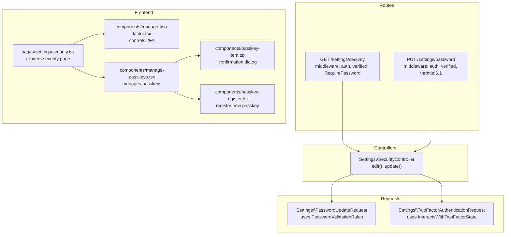
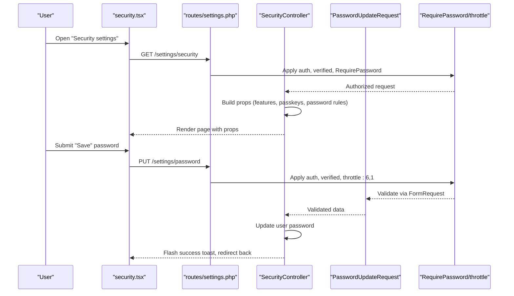
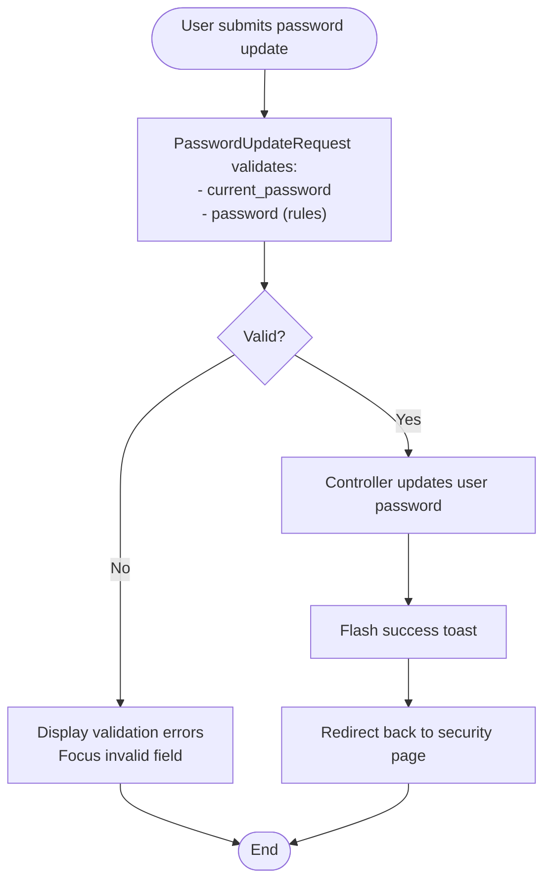
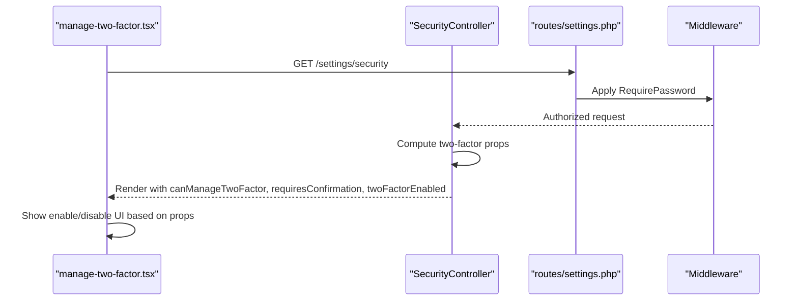
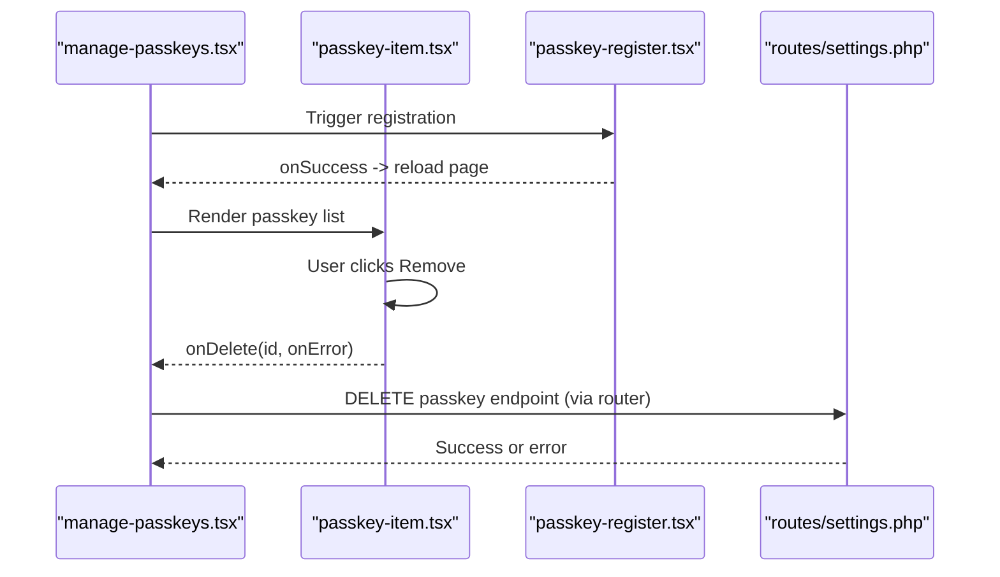
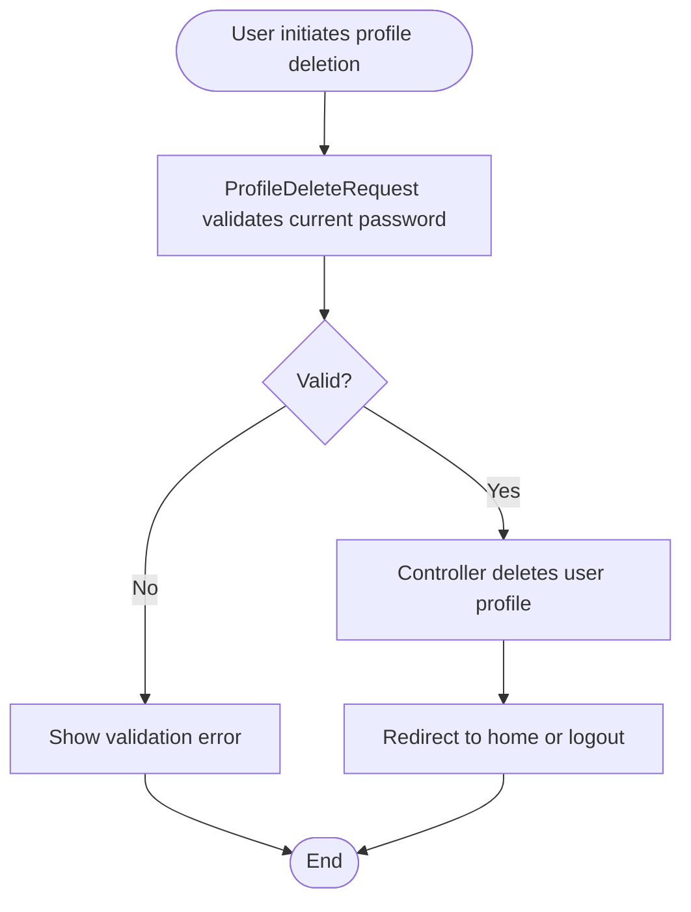
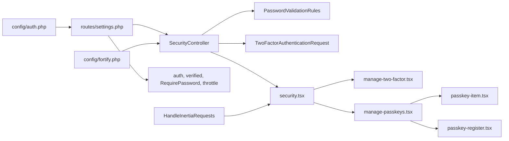

# Security Settings & Management

<cite>
**Referenced Files in This Document**
- [SecurityController.php](file://app/Http/Controllers/Settings/SecurityController.php)
- [PasswordUpdateRequest.php](file://app/Http/Requests/Settings/PasswordUpdateRequest.php)
- [TwoFactorAuthenticationRequest.php](file://app/Http/Requests/Settings/TwoFactorAuthenticationRequest.php)
- [PasswordValidationRules.php](file://app/Concerns/PasswordValidationRules.php)
- [security.tsx](file://resources/js/pages/settings/security.tsx)
- [manage-two-factor.tsx](file://resources/js/components/manage-two-factor.tsx)
- [manage-passkeys.tsx](file://resources/js/components/manage-passkeys.tsx)
- [passkey-item.tsx](file://resources/js/components/passkey-item.tsx)
- [passkey-register.tsx](file://resources/js/components/passkey-register.tsx)
- [settings.php](file://routes/settings.php)
- [HandleInertiaRequests.php](file://app/Http/Middleware/HandleInertiaRequests.php)
- [auth.php](file://config/auth.php)
- [fortify.php](file://config/fortify.php)
- [.htaccess](file://public/.htaccess)
</cite>

## Table of Contents
1. [Introduction](#introduction)
2. [Project Structure](#project-structure)
3. [Core Components](#core-components)
4. [Architecture Overview](#architecture-overview)
5. [Detailed Component Analysis](#detailed-component-analysis)
6. [Dependency Analysis](#dependency-analysis)
7. [Performance Considerations](#performance-considerations)
8. [Troubleshooting Guide](#troubleshooting-guide)
9. [Conclusion](#conclusion)

## Introduction
This document describes the security settings management interface, focusing on password updates, two-factor authentication controls, and passkey management. It explains request validation classes, security checks, confirmation dialogs, and the integration between the frontend UI and backend controllers. It also covers CSRF protection, authorization middleware, validation rules, user confirmation flows, and audit logging considerations for security events.

## Project Structure
The security settings feature spans backend controllers and request validators, and frontend pages and components. Routes are grouped under `/settings` with appropriate middleware for authentication and verification. The frontend uses Inertia.js to render the security page and integrates with reusable components for two-factor and passkey management.

**Diagram sources**
- [settings.php:18-24](file://routes/settings.php#L18-L24)
- [SecurityController.php:19-65](file://app/Http/Controllers/Settings/SecurityController.php#L19-L65)
- [PasswordUpdateRequest.php:18-24](file://app/Http/Requests/Settings/PasswordUpdateRequest.php#L18-L24)
- [TwoFactorAuthenticationRequest.php:18-21](file://app/Http/Requests/Settings/TwoFactorAuthenticationRequest.php#L18-L21)
- [security.tsx:20-138](file://resources/js/pages/settings/security.tsx#L20-L138)
- [manage-two-factor.tsx:17-126](file://resources/js/components/manage-two-factor.tsx#L17-L126)
- [manage-passkeys.tsx:28-71](file://resources/js/components/manage-passkeys.tsx#L28-L71)
- [passkey-item.tsx:20-93](file://resources/js/components/passkey-item.tsx#L20-L93)
- [passkey-register.tsx:12-108](file://resources/js/components/passkey-register.tsx#L12-L108)

**Section sources**
- [settings.php:8-27](file://routes/settings.php#L8-L27)
- [SecurityController.php:14-65](file://app/Http/Controllers/Settings/SecurityController.php#L14-L65)
- [security.tsx:20-138](file://resources/js/pages/settings/security.tsx#L20-L138)

## Core Components
- Backend controller: Handles rendering the security settings page and updating the user's password.
- Request validators: Enforce password and current password validation rules.
- Frontend page: Presents password update form and integrates two-factor and passkey management components.
- Two-factor management: Enables/disables 2FA and displays recovery codes.
- Passkey management: Lists existing passkeys, allows registration, and handles removal with confirmation.

**Section sources**
- [SecurityController.php:14-65](file://app/Http/Controllers/Settings/SecurityController.php#L14-L65)
- [PasswordUpdateRequest.php:9-25](file://app/Http/Requests/Settings/PasswordUpdateRequest.php#L9-L25)
- [PasswordValidationRules.php:8-29](file://app/Concerns/PasswordValidationRules.php#L8-L29)
- [security.tsx:20-138](file://resources/js/pages/settings/security.tsx#L20-L138)
- [manage-two-factor.tsx:17-126](file://resources/js/components/manage-two-factor.tsx#L17-L126)
- [manage-passkeys.tsx:28-71](file://resources/js/components/manage-passkeys.tsx#L28-L71)

## Architecture Overview
The security settings architecture follows a layered approach:
- Routes define entry points and apply middleware for authentication, email verification, and password confirmation.
- Controllers coordinate data fetching and rendering, and process updates.
- Request validators encapsulate validation logic and reuse password rules.
- Frontend components render UI, collect user input, and submit requests via Inertia.

**Diagram sources**
- [settings.php:18-24](file://routes/settings.php#L18-L24)
- [SecurityController.php:19-65](file://app/Http/Controllers/Settings/SecurityController.php#L19-L65)
- [PasswordUpdateRequest.php:18-24](file://app/Http/Requests/Settings/PasswordUpdateRequest.php#L18-L24)
- [security.tsx:37-123](file://resources/js/pages/settings/security.tsx#L37-L123)

## Detailed Component Analysis

### Password Update Functionality
- Backend controller:
  - Renders the security page with feature flags and passkey listings.
  - Updates the user's password upon successful validation and flashes a success toast.
- Request validation:
  - Uses a shared trait to enforce strong password rules and current password confirmation.
- Frontend:
  - Provides labeled inputs for current and new password, with confirmation.
  - Resets form fields on success and focuses on errors for improved UX.

**Diagram sources**
- [PasswordUpdateRequest.php:18-24](file://app/Http/Requests/Settings/PasswordUpdateRequest.php#L18-L24)
- [PasswordValidationRules.php:15-28](file://app/Concerns/PasswordValidationRules.php#L15-L28)
- [SecurityController.php:56-65](file://app/Http/Controllers/Settings/SecurityController.php#L56-L65)
- [security.tsx:37-123](file://resources/js/pages/settings/security.tsx#L37-L123)

**Section sources**
- [SecurityController.php:56-65](file://app/Http/Controllers/Settings/SecurityController.php#L56-L65)
- [PasswordUpdateRequest.php:18-24](file://app/Http/Requests/Settings/PasswordUpdateRequest.php#L18-L24)
- [PasswordValidationRules.php:15-28](file://app/Concerns/PasswordValidationRules.php#L15-L28)
- [security.tsx:37-123](file://resources/js/pages/settings/security.tsx#L37-L123)

### Two-Factor Authentication Controls
- Controller:
  - Ensures two-factor state is valid and exposes whether 2FA is enabled and whether confirmation is required.
- Frontend:
  - Conditionally renders enable/disable actions, shows QR setup modal, and displays recovery codes.
  - Integrates with hooks for setup data and recovery codes retrieval.

**Diagram sources**
- [SecurityController.php:19-51](file://app/Http/Controllers/Settings/SecurityController.php#L19-L51)
- [manage-two-factor.tsx:17-126](file://resources/js/components/manage-two-factor.tsx#L17-L126)
- [settings.php:18-20](file://routes/settings.php#L18-L20)

**Section sources**
- [SecurityController.php:19-51](file://app/Http/Controllers/Settings/SecurityController.php#L19-L51)
- [manage-two-factor.tsx:17-126](file://resources/js/components/manage-two-factor.tsx#L17-L126)
- [TwoFactorAuthenticationRequest.php:9-22](file://app/Http/Requests/Settings/TwoFactorAuthenticationRequest.php#L9-L22)

### Passkey Management and Confirmation Dialogs
- Listing and registration:
  - Displays existing passkeys with metadata and supports adding new passkeys.
- Removal workflow:
  - Uses a confirmation dialog to prevent accidental deletions.
  - Submits deletion via Inertia with scroll preservation and error handling.

**Diagram sources**
- [manage-passkeys.tsx:28-71](file://resources/js/components/manage-passkeys.tsx#L28-L71)
- [passkey-item.tsx:20-93](file://resources/js/components/passkey-item.tsx#L20-L93)
- [passkey-register.tsx:12-108](file://resources/js/components/passkey-register.tsx#L12-L108)

**Section sources**
- [manage-passkeys.tsx:28-71](file://resources/js/components/manage-passkeys.tsx#L28-L71)
- [passkey-item.tsx:20-93](file://resources/js/components/passkey-item.tsx#L20-L93)
- [passkey-register.tsx:12-108](file://resources/js/components/passkey-register.tsx#L12-L108)

### Account Deletion Processes
Account deletion is handled under the profile settings route group and requires both authentication and email verification. The profile deletion request validator enforces current password confirmation. While the security settings page primarily focuses on password updates, two-factor controls, and passkeys, the profile deletion flow follows similar validation and middleware patterns.

**Diagram sources**
- [ProfileDeleteRequest.php:18-23](file://app/Http/Requests/Settings/ProfileDeleteRequest.php#L18-L23)
- [settings.php:15-16](file://routes/settings.php#L15-L16)

**Section sources**
- [settings.php:15-16](file://routes/settings.php#L15-L16)
- [ProfileDeleteRequest.php:18-23](file://app/Http/Requests/Settings/ProfileDeleteRequest.php#L18-L23)

### Security Preference Updates
The security page aggregates feature flags and dynamic data:
- Feature toggles for two-factor and passkey management.
- Passkey listing with timestamps and authenticator metadata.
- Password strength rules exposed to the frontend for real-time feedback.

**Section sources**
- [SecurityController.php:21-41](file://app/Http/Controllers/Settings/SecurityController.php#L21-L41)
- [security.tsx:15-18](file://resources/js/pages/settings/security.tsx#L15-L18)

## Dependency Analysis
The security settings feature depends on:
- Laravel Fortify features for two-factor and passkey capabilities.
- Inertia middleware for shared data and root view rendering.
- Route middleware for authentication, email verification, and password confirmation.
- Frontend components that rely on hooks and router utilities for state and submission.

**Diagram sources**
- [SecurityController.php:14-65](file://app/Http/Controllers/Settings/SecurityController.php#L14-L65)
- [PasswordValidationRules.php:8-29](file://app/Concerns/PasswordValidationRules.php#L8-L29)
- [TwoFactorAuthenticationRequest.php:9-22](file://app/Http/Requests/Settings/TwoFactorAuthenticationRequest.php#L9-L22)
- [security.tsx:20-138](file://resources/js/pages/settings/security.tsx#L20-L138)
- [manage-two-factor.tsx:17-126](file://resources/js/components/manage-two-factor.tsx#L17-L126)
- [manage-passkeys.tsx:28-71](file://resources/js/components/manage-passkeys.tsx#L28-L71)
- [passkey-item.tsx:20-93](file://resources/js/components/passkey-item.tsx#L20-L93)
- [passkey-register.tsx:12-108](file://resources/js/components/passkey-register.tsx#L12-L108)
- [settings.php:8-27](file://routes/settings.php#L8-L27)
- [HandleInertiaRequests.php:36-46](file://app/Http/Middleware/HandleInertiaRequests.php#L36-L46)
- [auth.php:18-21](file://config/auth.php#L18-L21)
- [fortify.php:104-143](file://config/fortify.php#L104-L143)

**Section sources**
- [SecurityController.php:14-65](file://app/Http/Controllers/Settings/SecurityController.php#L14-L65)
- [settings.php:8-27](file://routes/settings.php#L8-L27)
- [HandleInertiaRequests.php:36-46](file://app/Http/Middleware/HandleInertiaRequests.php#L36-L46)
- [auth.php:18-21](file://config/auth.php#L18-L21)
- [fortify.php:104-143](file://config/fortify.php#L104-L143)

## Performance Considerations
- Throttling: The password update endpoint applies a throttle limit to mitigate brute-force attempts.
- Feature flags: Conditional rendering avoids unnecessary computations when two-factor or passkey features are disabled.
- Frontend focus management: Improves user experience by focusing on the first error field after validation failures.

**Section sources**
- [settings.php:22-24](file://routes/settings.php#L22-L24)
- [SecurityController.php:21-41](file://app/Http/Controllers/Settings/SecurityController.php#L21-L41)
- [security.tsx:48-56](file://resources/js/pages/settings/security.tsx#L48-L56)

## Troubleshooting Guide
Common issues and resolutions:
- Validation errors on password update:
  - Ensure the current password matches and the new password satisfies strength rules.
  - The form resets sensitive fields on error and focuses on the first invalid field.
- Two-factor state inconsistencies:
  - The controller ensures two-factor state validity before rendering.
- Passkey removal confirmation:
  - Use the confirmation dialog to prevent accidental deletions; errors preserve loading state.
- CSRF and middleware:
  - Inertia apps automatically include CSRF handling; ensure proper middleware stacks are applied.

**Section sources**
- [security.tsx:48-56](file://resources/js/pages/settings/security.tsx#L48-L56)
- [SecurityController.php:43-48](file://app/Http/Controllers/Settings/SecurityController.php#L43-L48)
- [passkey-item.tsx:70-89](file://resources/js/components/passkey-item.tsx#L70-L89)
- [.htaccess:1-25](file://public/.htaccess#L1-L25)

## Conclusion
The security settings interface combines robust backend validation with a responsive frontend experience. Password updates leverage centralized validation rules, two-factor controls integrate with Laravel Fortify features, and passkey management provides secure credential lifecycle handling with explicit user confirmation. Middleware ensures appropriate authorization and rate limiting, while the frontend maintains usability through focused error handling and state management.