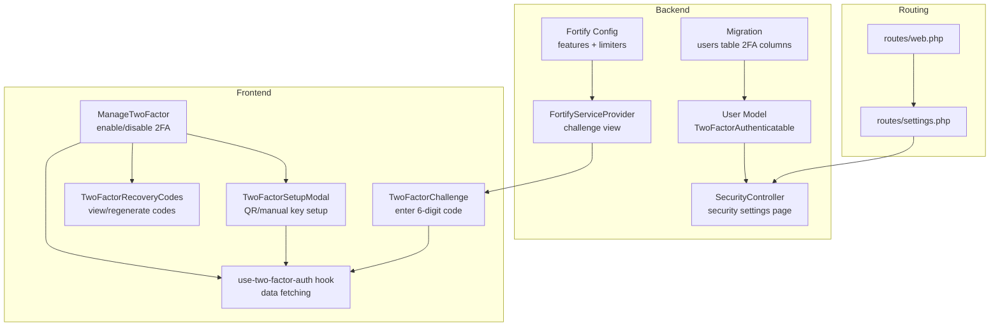
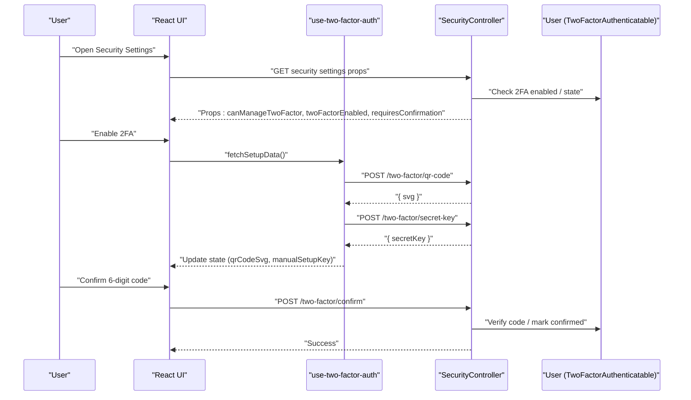
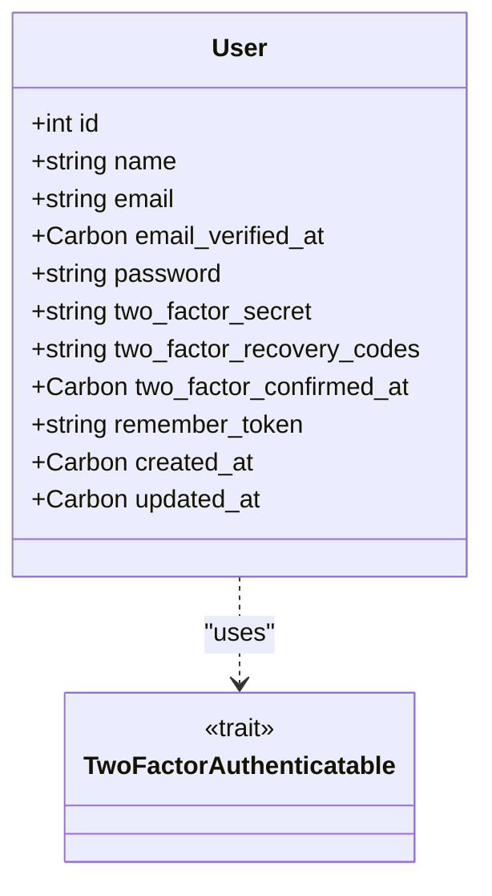
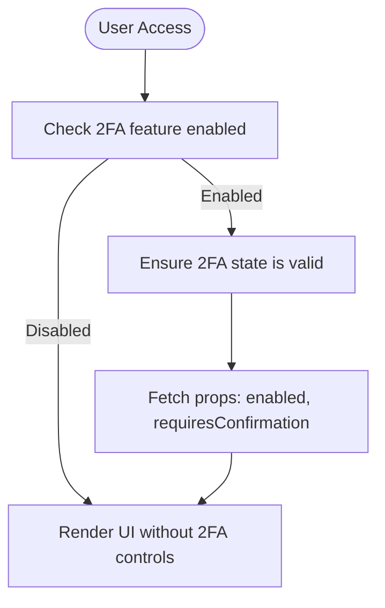
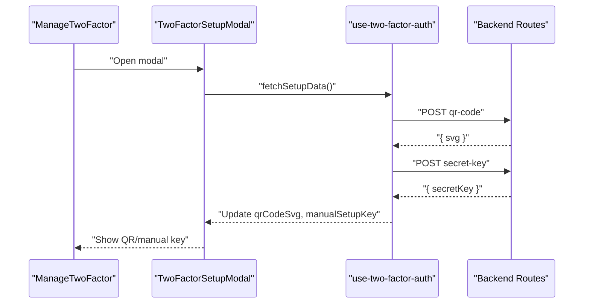
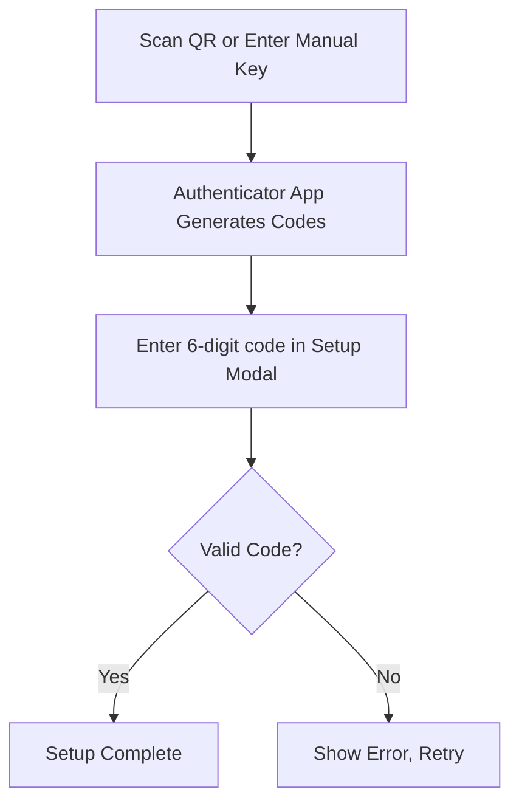
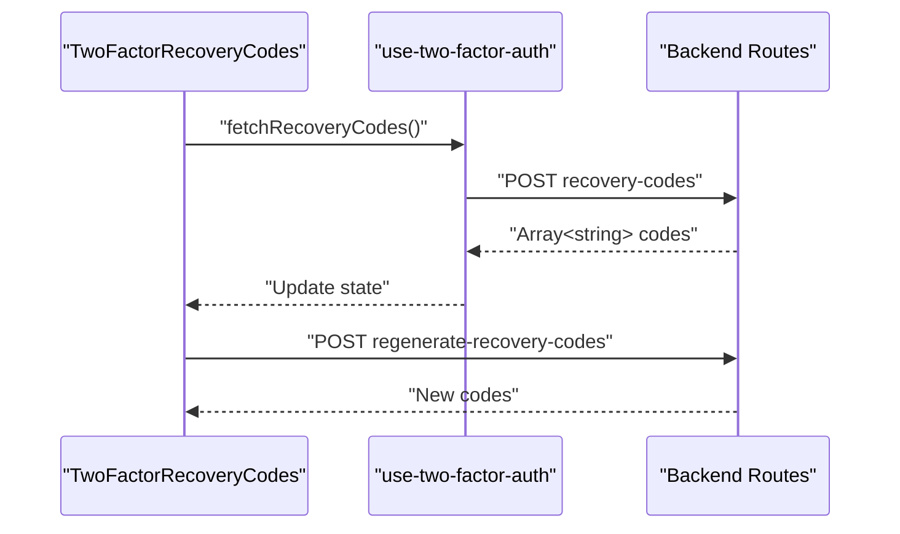
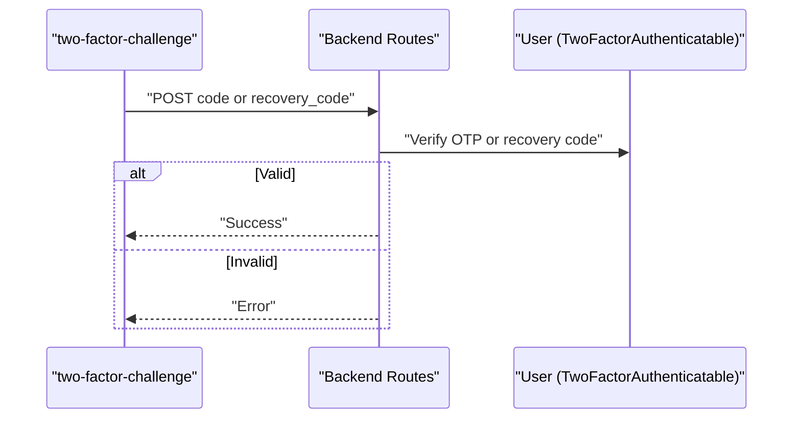
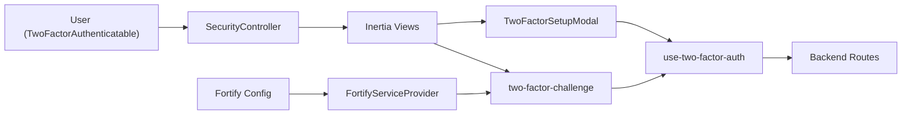

# Two-Factor Authentication (2FA)

<cite>
**Referenced Files in This Document**
- [User.php](file://app/Models/User.php)
- [2025_08_14_170933_add_two_factor_columns_to_users_table.php](file://database/migrations/2025_08_14_170933_add_two_factor_columns_to_users_table.php)
- [TwoFactorAuthenticationRequest.php](file://app/Http/Requests/Settings/TwoFactorAuthenticationRequest.php)
- [SecurityController.php](file://app/Http/Controllers/Settings/SecurityController.php)
- [FortifyServiceProvider.php](file://app/Providers/FortifyServiceProvider.php)
- [fortify.php](file://config/fortify.php)
- [web.php](file://routes/web.php)
- [settings.php](file://routes/settings.php)
- [manage-two-factor.tsx](file://resources/js/components/manage-two-factor.tsx)
- [two-factor-setup-modal.tsx](file://resources/js/components/two-factor-setup-modal.tsx)
- [two-factor-recovery-codes.tsx](file://resources/js/components/two-factor-recovery-codes.tsx)
- [two-factor-challenge.tsx](file://resources/js/pages/auth/two-factor-challenge.tsx)
- [use-two-factor-auth.ts](file://resources/js/hooks/use-two-factor-auth.ts)
</cite>

## Table of Contents
1. [Introduction](#introduction)
2. [Project Structure](#project-structure)
3. [Core Components](#core-components)
4. [Architecture Overview](#architecture-overview)
5. [Detailed Component Analysis](#detailed-component-analysis)
6. [Dependency Analysis](#dependency-analysis)
7. [Performance Considerations](#performance-considerations)
8. [Troubleshooting Guide](#troubleshooting-guide)
9. [Conclusion](#conclusion)

## Introduction
This document describes the two-factor authentication (2FA) system implemented in the project. It covers the 2FA setup process, QR code generation, and authenticator app configuration. It also documents backup recovery codes generation, storage, and regeneration. The TwoFactorAuthenticatable trait implementation, challenge-response workflows, and security considerations are explained. Examples of 2FA UI components, secret key management, and frontend integration for both mobile apps and hardware tokens are included.

## Project Structure
The 2FA implementation spans backend Laravel models and controllers, configuration, and frontend React components integrated with Inertia. Key areas:
- Backend: User model with TwoFactorAuthenticatable trait, migration for 2FA columns, controller for security settings, and Fortify configuration.
- Frontend: React components for managing 2FA, setting up 2FA via QR or manual key, viewing and regenerating recovery codes, and the 2FA challenge page.
- Routing: Settings routes and Fortify provider mapping the 2FA challenge view.

**Diagram sources**
- [User.php:32-35](file://app/Models/User.php#L32-L35)
- [2025_08_14_170933_add_two_factor_columns_to_users_table.php:14-17](file://database/migrations/2025_08_14_170933_add_two_factor_columns_to_users_table.php#L14-L17)
- [SecurityController.php:19-51](file://app/Http/Controllers/Settings/SecurityController.php#L19-L51)
- [FortifyServiceProvider.php:74](file://app/Providers/FortifyServiceProvider.php#L74)
- [fortify.php:167-171](file://config/fortify.php#L167-L171)
- [web.php:5-12](file://routes/web.php#L5-L12)
- [settings.php:18-27](file://routes/settings.php#L18-L27)
- [manage-two-factor.tsx:17-126](file://resources/js/components/manage-two-factor.tsx#L17-L126)
- [two-factor-setup-modal.tsx:244-351](file://resources/js/components/two-factor-setup-modal.tsx#L244-L351)
- [two-factor-recovery-codes.tsx:21-164](file://resources/js/components/two-factor-recovery-codes.tsx#L21-L164)
- [two-factor-challenge.tsx:15-133](file://resources/js/pages/auth/two-factor-challenge.tsx#L15-L133)
- [use-two-factor-auth.ts:22-111](file://resources/js/hooks/use-two-factor-auth.ts#L22-L111)

**Section sources**
- [User.php:32-35](file://app/Models/User.php#L32-L35)
- [2025_08_14_170933_add_two_factor_columns_to_users_table.php:14-17](file://database/migrations/2025_08_14_170933_add_two_factor_columns_to_users_table.php#L14-L17)
- [SecurityController.php:19-51](file://app/Http/Controllers/Settings/SecurityController.php#L19-L51)
- [FortifyServiceProvider.php:74](file://app/Providers/FortifyServiceProvider.php#L74)
- [fortify.php:167-171](file://config/fortify.php#L167-L171)
- [web.php:5-12](file://routes/web.php#L5-L12)
- [settings.php:18-27](file://routes/settings.php#L18-L27)
- [manage-two-factor.tsx:17-126](file://resources/js/components/manage-two-factor.tsx#L17-L126)
- [two-factor-setup-modal.tsx:244-351](file://resources/js/components/two-factor-setup-modal.tsx#L244-L351)
- [two-factor-recovery-codes.tsx:21-164](file://resources/js/components/two-factor-recovery-codes.tsx#L21-L164)
- [two-factor-challenge.tsx:15-133](file://resources/js/pages/auth/two-factor-challenge.tsx#L15-L133)
- [use-two-factor-auth.ts:22-111](file://resources/js/hooks/use-two-factor-auth.ts#L22-L111)

## Core Components
- User model with TwoFactorAuthenticatable trait and 2FA-related columns (secret, recovery codes, confirmed timestamp).
- Security settings controller that prepares props for the 2FA UI and checks feature availability and state.
- Frontend components for enabling/disabling 2FA, scanning QR codes or entering manual keys, verifying codes, viewing and regenerating recovery codes, and the 2FA challenge page.
- Hook orchestrating data fetching for QR code, manual setup key, and recovery codes.
- Fortify configuration enabling 2FA with confirmation and rate limiting.

**Section sources**
- [User.php:23-25](file://app/Models/User.php#L23-L25)
- [2025_08_14_170933_add_two_factor_columns_to_users_table.php:14-17](file://database/migrations/2025_08_14_170933_add_two_factor_columns_to_users_table.php#L14-L17)
- [SecurityController.php:43-48](file://app/Http/Controllers/Settings/SecurityController.php#L43-L48)
- [manage-two-factor.tsx:17-126](file://resources/js/components/manage-two-factor.tsx#L17-L126)
- [two-factor-setup-modal.tsx:244-351](file://resources/js/components/two-factor-setup-modal.tsx#L244-L351)
- [two-factor-recovery-codes.tsx:21-164](file://resources/js/components/two-factor-recovery-codes.tsx#L21-L164)
- [two-factor-challenge.tsx:15-133](file://resources/js/pages/auth/two-factor-challenge.tsx#L15-L133)
- [use-two-factor-auth.ts:22-111](file://resources/js/hooks/use-two-factor-auth.ts#L22-L111)
- [fortify.php:167-171](file://config/fortify.php#L167-L171)

## Architecture Overview
The 2FA architecture integrates Laravel Fortify with Inertia-powered React components. The flow:
- User navigates to the security settings page, which queries feature flags and current 2FA state.
- Enabling 2FA triggers fetching of QR code SVG and manual setup key via the hook.
- The setup modal presents QR scanning or manual key entry; verification uses a 6-digit OTP.
- Recovery codes are fetched and optionally regenerated.
- During login, the 2FA challenge page prompts for either the OTP or a recovery code.

**Diagram sources**
- [SecurityController.php:19-51](file://app/Http/Controllers/Settings/SecurityController.php#L19-L51)
- [use-two-factor-auth.ts:49-95](file://resources/js/hooks/use-two-factor-auth.ts#L49-L95)
- [two-factor-setup-modal.tsx:158-229](file://resources/js/components/two-factor-setup-modal.tsx#L158-L229)
- [User.php:32-35](file://app/Models/User.php#L32-L35)

## Detailed Component Analysis

### User Model and Database Columns
- The User model uses TwoFactorAuthenticatable and declares 2FA-related attributes: two_factor_secret, two_factor_recovery_codes, and two_factor_confirmed_at.
- The migration adds nullable text columns for secret and recovery codes and a timestamp for confirmation.

**Diagram sources**
- [User.php:23-25](file://app/Models/User.php#L23-L25)
- [User.php:32-35](file://app/Models/User.php#L32-L35)
- [2025_08_14_170933_add_two_factor_columns_to_users_table.php:14-17](file://database/migrations/2025_08_14_170933_add_two_factor_columns_to_users_table.php#L14-L17)

**Section sources**
- [User.php:23-25](file://app/Models/User.php#L23-L25)
- [2025_08_14_170933_add_two_factor_columns_to_users_table.php:14-17](file://database/migrations/2025_08_14_170933_add_two_factor_columns_to_users_table.php#L14-L17)

### TwoFactorAuthenticatable Trait Implementation
- The trait enables TOTP-based 2FA on the User model. It manages secret storage, QR code generation, and challenge verification.
- The controller checks feature availability and ensures state validity before rendering the security page.

**Diagram sources**
- [SecurityController.php:22-48](file://app/Http/Controllers/Settings/SecurityController.php#L22-L48)
- [TwoFactorAuthenticationRequest.php:11](file://app/Http/Requests/Settings/TwoFactorAuthenticationRequest.php#L11)

**Section sources**
- [SecurityController.php:22-48](file://app/Http/Controllers/Settings/SecurityController.php#L22-L48)
- [TwoFactorAuthenticationRequest.php:11](file://app/Http/Requests/Settings/TwoFactorAuthenticationRequest.php#L11)

### 2FA Setup Process: QR Code and Manual Key
- The ManageTwoFactor component conditionally renders enable/disable actions and opens the TwoFactorSetupModal.
- The modal fetches QR code SVG and manual setup key via the use-two-factor-auth hook.
- Users can scan the QR code or enter the manual key into an authenticator app supporting TOTP.

**Diagram sources**
- [manage-two-factor.tsx:17-126](file://resources/js/components/manage-two-factor.tsx#L17-L126)
- [two-factor-setup-modal.tsx:244-351](file://resources/js/components/two-factor-setup-modal.tsx#L244-L351)
- [use-two-factor-auth.ts:49-95](file://resources/js/hooks/use-two-factor-auth.ts#L49-L95)

**Section sources**
- [manage-two-factor.tsx:17-126](file://resources/js/components/manage-two-factor.tsx#L17-L126)
- [two-factor-setup-modal.tsx:244-351](file://resources/js/components/two-factor-setup-modal.tsx#L244-L351)
- [use-two-factor-auth.ts:49-95](file://resources/js/hooks/use-two-factor-auth.ts#L49-L95)

### Authenticator App Configuration
- After scanning the QR code or entering the manual key, the authenticator app generates 6-digit codes.
- The setup modal supports a verification step where the user enters the current 6-digit code to confirm the setup.

**Diagram sources**
- [two-factor-setup-modal.tsx:141-230](file://resources/js/components/two-factor-setup-modal.tsx#L141-L230)

**Section sources**
- [two-factor-setup-modal.tsx:141-230](file://resources/js/components/two-factor-setup-modal.tsx#L141-L230)

### Backup Recovery Codes: Generation, Storage, and Regeneration
- Recovery codes are stored encrypted in the two_factor_recovery_codes column.
- The TwoFactorRecoveryCodes component allows users to view and regenerate codes.
- Each code can be used once; regeneration invalidates previous codes.

**Diagram sources**
- [two-factor-recovery-codes.tsx:21-164](file://resources/js/components/two-factor-recovery-codes.tsx#L21-L164)
- [use-two-factor-auth.ts:76-85](file://resources/js/hooks/use-two-factor-auth.ts#L76-L85)

**Section sources**
- [two-factor-recovery-codes.tsx:21-164](file://resources/js/components/two-factor-recovery-codes.tsx#L21-L164)
- [use-two-factor-auth.ts:76-85](file://resources/js/hooks/use-two-factor-auth.ts#L76-L85)

### Challenge-Response Workflow
- The two-factor-challenge page presents either OTP input or recovery code input.
- On submission, Fortify validates the code or recovery code against the user's 2FA state.

**Diagram sources**
- [two-factor-challenge.tsx:15-133](file://resources/js/pages/auth/two-factor-challenge.tsx#L15-L133)

**Section sources**
- [two-factor-challenge.tsx:15-133](file://resources/js/pages/auth/two-factor-challenge.tsx#L15-L133)

### Secret Key Management
- The secret key is generated server-side and exposed via the secret-key endpoint.
- The frontend copies the key for manual setup and clears it afterward to minimize exposure.

**Section sources**
- [use-two-factor-auth.ts:63-74](file://resources/js/hooks/use-two-factor-auth.ts#L63-L74)
- [two-factor-setup-modal.tsx:111-134](file://resources/js/components/two-factor-setup-modal.tsx#L111-L134)

### Frontend Integration for Mobile Apps and Hardware Tokens
- QR code scanning is supported through the modal’s QR preview.
- Manual key entry accommodates both mobile TOTP apps and hardware tokens compatible with TOTP.
- The OTP input enforces a 6-digit pattern and auto-focus behavior.

**Section sources**
- [two-factor-setup-modal.tsx:75-139](file://resources/js/components/two-factor-setup-modal.tsx#L75-L139)
- [two-factor-setup-modal.tsx:177-225](file://resources/js/components/two-factor-setup-modal.tsx#L177-L225)
- [two-factor-challenge.tsx:79-104](file://resources/js/pages/auth/two-factor-challenge.tsx#L79-L104)

## Dependency Analysis
- The User model depends on the TwoFactorAuthenticatable trait for 2FA capabilities.
- The SecurityController depends on Fortify features and the request object to ensure state validity.
- Frontend components depend on the use-two-factor-auth hook for data fetching and state management.
- Fortify configuration enables 2FA with confirmation and sets rate limits for 2FA attempts.

**Diagram sources**
- [User.php:32-35](file://app/Models/User.php#L32-L35)
- [SecurityController.php:19-51](file://app/Http/Controllers/Settings/SecurityController.php#L19-L51)
- [two-factor-setup-modal.tsx:244-351](file://resources/js/components/two-factor-setup-modal.tsx#L244-L351)
- [two-factor-challenge.tsx:15-133](file://resources/js/pages/auth/two-factor-challenge.tsx#L15-L133)
- [use-two-factor-auth.ts:22-111](file://resources/js/hooks/use-two-factor-auth.ts#L22-L111)
- [FortifyServiceProvider.php:74](file://app/Providers/FortifyServiceProvider.php#L74)
- [fortify.php:167-171](file://config/fortify.php#L167-L171)

**Section sources**
- [User.php:32-35](file://app/Models/User.php#L32-L35)
- [SecurityController.php:19-51](file://app/Http/Controllers/Settings/SecurityController.php#L19-L51)
- [two-factor-setup-modal.tsx:244-351](file://resources/js/components/two-factor-setup-modal.tsx#L244-L351)
- [two-factor-challenge.tsx:15-133](file://resources/js/pages/auth/two-factor-challenge.tsx#L15-L133)
- [use-two-factor-auth.ts:22-111](file://resources/js/hooks/use-two-factor-auth.ts#L22-L111)
- [FortifyServiceProvider.php:74](file://app/Providers/FortifyServiceProvider.php#L74)
- [fortify.php:167-171](file://config/fortify.php#L167-L171)

## Performance Considerations
- Use concurrent data fetching for QR code and secret key to reduce perceived latency.
- Cache QR code SVG client-side until setup completes to avoid repeated network calls.
- Keep recovery codes hidden by default and lazy-load them to minimize DOM overhead.
- Apply rate limiting on 2FA attempts to prevent brute-force attacks.

## Troubleshooting Guide
Common issues and resolutions:
- QR code fails to load: Verify the endpoint returns a valid SVG and that the hook catches and surfaces errors.
- Manual key unavailable: Ensure the secret-key endpoint is reachable and the key is cleared after copying.
- Recovery codes empty: Trigger fetchRecoveryCodes on visibility toggle or initial render.
- Challenge fails: Confirm the authenticator time sync and that the 6-digit code matches the current TOTP value.

**Section sources**
- [use-two-factor-auth.ts:49-95](file://resources/js/hooks/use-two-factor-auth.ts#L49-L95)
- [two-factor-setup-modal.tsx:315-319](file://resources/js/components/two-factor-setup-modal.tsx#L315-L319)
- [two-factor-recovery-codes.tsx:30-51](file://resources/js/components/two-factor-recovery-codes.tsx#L30-L51)
- [two-factor-challenge.tsx:63-129](file://resources/js/pages/auth/two-factor-challenge.tsx#L63-L129)

## Conclusion
The 2FA system integrates Laravel Fortify with React/Inertia to deliver a secure, user-friendly two-factor authentication experience. It supports QR-based setup, manual key entry, recovery codes, and robust challenge-response flows. The modular frontend components and centralized hook simplify maintenance and extension for both mobile apps and hardware tokens.