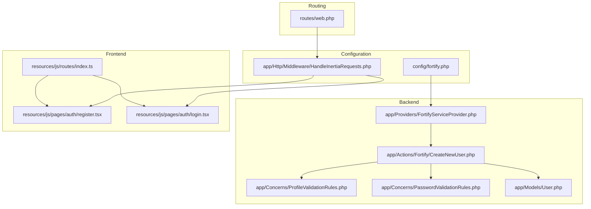
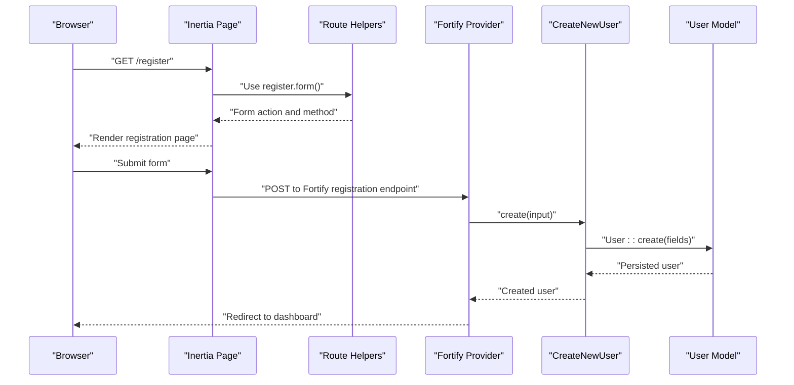
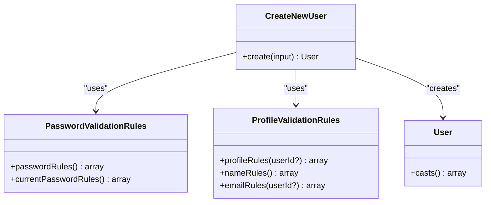
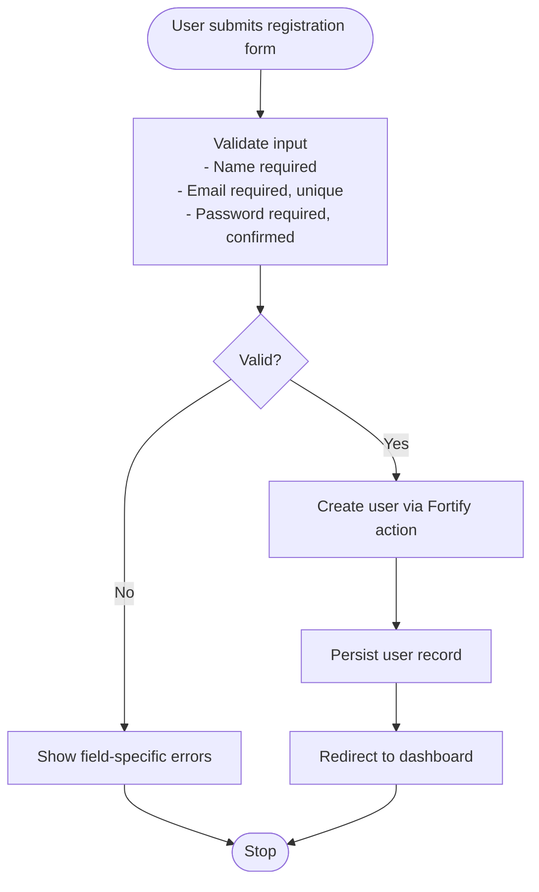
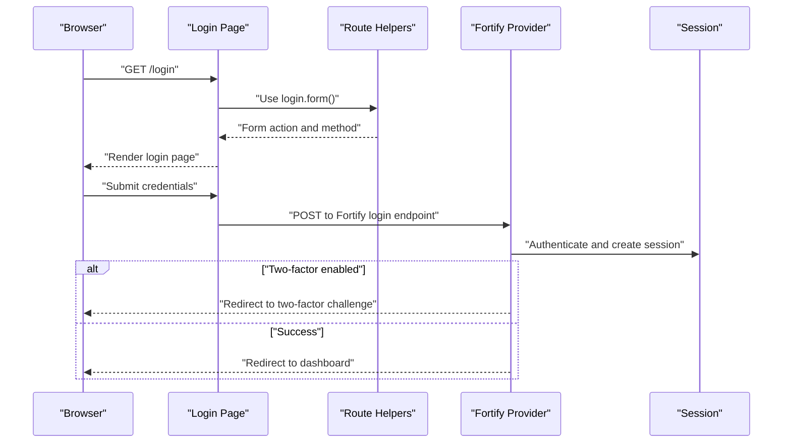
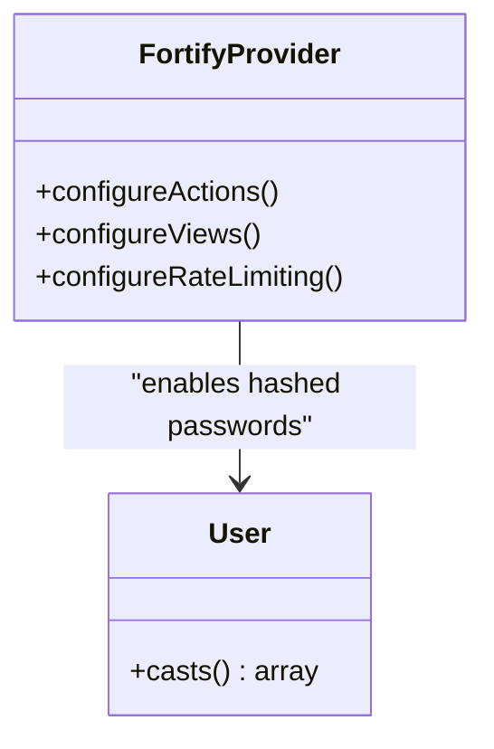
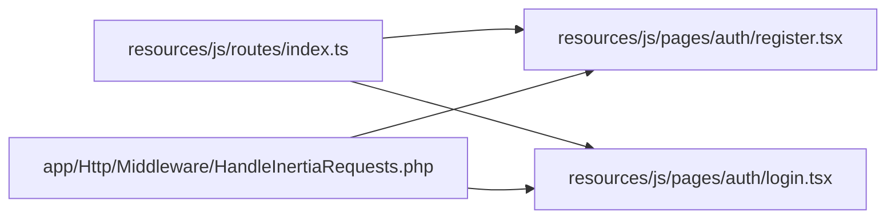
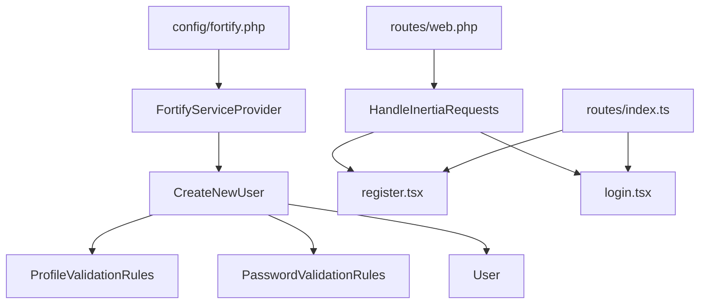

# User Registration & Login

<cite>
**Referenced Files in This Document**
- [CreateNewUser.php](file://app/Actions/Fortify/CreateNewUser.php)
- [PasswordValidationRules.php](file://app/Concerns/PasswordValidationRules.php)
- [ProfileValidationRules.php](file://app/Concerns/ProfileValidationRules.php)
- [User.php](file://app/Models/User.php)
- [FortifyServiceProvider.php](file://app/Providers/FortifyServiceProvider.php)
- [fortify.php](file://config/fortify.php)
- [HandleInertiaRequests.php](file://app/Http/Middleware/HandleInertiaRequests.php)
- [register.tsx](file://resources/js/pages/auth/register.tsx)
- [login.tsx](file://resources/js/pages/auth/login.tsx)
- [index.ts](file://resources/js/routes/index.ts)
- [web.php](file://routes/web.php)
- [RegistrationTest.php](file://tests/Feature/Auth/RegistrationTest.php)
- [AuthenticationTest.php](file://tests/Feature/Auth/AuthenticationTest.php)
</cite>

## Table of Contents
1. [Introduction](#introduction)
2. [Project Structure](#project-structure)
3. [Core Components](#core-components)
4. [Architecture Overview](#architecture-overview)
5. [Detailed Component Analysis](#detailed-component-analysis)
6. [Dependency Analysis](#dependency-analysis)
7. [Performance Considerations](#performance-considerations)
8. [Troubleshooting Guide](#troubleshooting-guide)
9. [Conclusion](#conclusion)

## Introduction
This document explains the user registration and login functionality, focusing on the CreateNewUser action class, form validation, and authentication flow. It covers how frontend forms integrate with backend authentication logic, including error handling, success redirects, password hashing, session creation, and two-factor authentication readiness. The guide also outlines the middleware integration and test coverage that validates the end-to-end behavior.

## Project Structure
The authentication system spans configuration, backend actions, models, frontend pages, and routing. Key areas include:
- Backend configuration and providers for Fortify
- Action classes implementing user creation and validation
- Model with hashed password casting and authentication traits
- Frontend pages for registration and login using Inertia
- Route helpers for form submissions
- Middleware sharing authentication state with the frontend
- Tests validating success and failure scenarios

**Diagram sources**
- [fortify.php:1-178](file://config/fortify.php#L1-L178)
- [HandleInertiaRequests.php:1-48](file://app/Http/Middleware/HandleInertiaRequests.php#L1-L48)
- [FortifyServiceProvider.php:1-101](file://app/Providers/FortifyServiceProvider.php#L1-L101)
- [CreateNewUser.php:1-34](file://app/Actions/Fortify/CreateNewUser.php#L1-L34)
- [ProfileValidationRules.php:1-52](file://app/Concerns/ProfileValidationRules.php#L1-L52)
- [PasswordValidationRules.php:1-30](file://app/Concerns/PasswordValidationRules.php#L1-L30)
- [User.php:1-51](file://app/Models/User.php#L1-L51)
- [register.tsx:1-121](file://resources/js/pages/auth/register.tsx#L1-L121)
- [login.tsx:1-118](file://resources/js/pages/auth/login.tsx#L1-L118)
- [index.ts:1-381](file://resources/js/routes/index.ts#L1-L381)
- [web.php:1-12](file://routes/web.php#L1-L12)

**Section sources**
- [fortify.php:1-178](file://config/fortify.php#L1-L178)
- [HandleInertiaRequests.php:1-48](file://app/Http/Middleware/HandleInertiaRequests.php#L1-L48)
- [FortifyServiceProvider.php:1-101](file://app/Providers/FortifyServiceProvider.php#L1-L101)
- [CreateNewUser.php:1-34](file://app/Actions/Fortify/CreateNewUser.php#L1-L34)
- [ProfileValidationRules.php:1-52](file://app/Concerns/ProfileValidationRules.php#L1-L52)
- [PasswordValidationRules.php:1-30](file://app/Concerns/PasswordValidationRules.php#L1-L30)
- [User.php:1-51](file://app/Models/User.php#L1-L51)
- [register.tsx:1-121](file://resources/js/pages/auth/register.tsx#L1-L121)
- [login.tsx:1-118](file://resources/js/pages/auth/login.tsx#L1-L118)
- [index.ts:1-381](file://resources/js/routes/index.ts#L1-L381)
- [web.php:1-12](file://routes/web.php#L1-L12)

## Core Components
- CreateNewUser action: Validates input using profile and password rules, then creates a new user record.
- Validation concerns: Provide reusable validation rules for passwords and profile fields.
- User model: Uses hashed password casting and authentication traits for session and two-factor readiness.
- Fortify provider: Registers custom user creation action and configures views and rate limiting.
- Frontend pages: Provide registration and login forms wired to backend routes via helpers.
- Middleware: Shares authentication state with the frontend for consistent UX.

**Section sources**
- [CreateNewUser.php:15-32](file://app/Actions/Fortify/CreateNewUser.php#L15-L32)
- [PasswordValidationRules.php:10-28](file://app/Concerns/PasswordValidationRules.php#L10-L28)
- [ProfileValidationRules.php:16-50](file://app/Concerns/ProfileValidationRules.php#L16-L50)
- [User.php:42-49](file://app/Models/User.php#L42-L49)
- [FortifyServiceProvider.php:40-77](file://app/Providers/FortifyServiceProvider.php#L40-L77)
- [register.tsx:16-115](file://resources/js/pages/auth/register.tsx#L16-L115)
- [login.tsx:20-112](file://resources/js/pages/auth/login.tsx#L20-L112)
- [HandleInertiaRequests.php:36-46](file://app/Http/Middleware/HandleInertiaRequests.php#L36-L46)

## Architecture Overview
The system integrates Laravel Fortify with Inertia for a seamless SPA-like experience. Fortify handles authentication routes and views, while Inertia renders React pages and manages form submissions. The Fortify provider binds the CreateNewUser action to handle registrations and sets up rate limiting and view callbacks.

**Diagram sources**
- [register.tsx:20-25](file://resources/js/pages/auth/register.tsx#L20-L25)
- [index.ts:188-218](file://resources/js/routes/index.ts#L188-L218)
- [FortifyServiceProvider.php:40-44](file://app/Providers/FortifyServiceProvider.php#L40-L44)
- [CreateNewUser.php:20-32](file://app/Actions/Fortify/CreateNewUser.php#L20-L32)
- [User.php:28-31](file://app/Models/User.php#L28-L31)

## Detailed Component Analysis

### CreateNewUser Action Class
The CreateNewUser action orchestrates validation and user creation:
- Merges profile rules and password rules for validation.
- Creates a new user with sanitized input.
- Returns the persisted user instance.

**Diagram sources**
- [CreateNewUser.php:11-32](file://app/Actions/Fortify/CreateNewUser.php#L11-L32)
- [PasswordValidationRules.php:8-29](file://app/Concerns/PasswordValidationRules.php#L8-L29)
- [ProfileValidationRules.php:9-51](file://app/Concerns/ProfileValidationRules.php#L9-L51)
- [User.php:32-49](file://app/Models/User.php#L32-L49)

**Section sources**
- [CreateNewUser.php:15-32](file://app/Actions/Fortify/CreateNewUser.php#L15-L32)
- [PasswordValidationRules.php:10-18](file://app/Concerns/PasswordValidationRules.php#L10-L18)
- [ProfileValidationRules.php:16-22](file://app/Concerns/ProfileValidationRules.php#L16-L22)

### Registration Form Validation
The registration page collects name, email, password, and password confirmation. It leverages:
- Form submission via route helpers pointing to Fortify’s registration endpoint.
- Real-time error rendering for each field.
- Automatic clearing of sensitive fields after successful submission.

**Diagram sources**
- [register.tsx:20-102](file://resources/js/pages/auth/register.tsx#L20-L102)
- [index.ts:188-218](file://resources/js/routes/index.ts#L188-L218)
- [CreateNewUser.php:22-31](file://app/Actions/Fortify/CreateNewUser.php#L22-L31)
- [ProfileValidationRules.php:16-22](file://app/Concerns/ProfileValidationRules.php#L16-L22)
- [PasswordValidationRules.php:15-18](file://app/Concerns/PasswordValidationRules.php#L15-L18)

**Section sources**
- [register.tsx:16-115](file://resources/js/pages/auth/register.tsx#L16-L115)
- [index.ts:188-218](file://resources/js/routes/index.ts#L188-L218)
- [CreateNewUser.php:20-32](file://app/Actions/Fortify/CreateNewUser.php#L20-L32)
- [ProfileValidationRules.php:16-50](file://app/Concerns/ProfileValidationRules.php#L16-L50)
- [PasswordValidationRules.php:15-28](file://app/Concerns/PasswordValidationRules.php#L15-L28)

### Login Authentication Flow
The login page supports traditional credentials and passkeys:
- Renders a form bound to Fortify’s login endpoint.
- Displays optional password reset link when enabled.
- Handles remember-me and redirects to dashboard upon success.
- Integrates with Fortify’s rate limiting and two-factor challenge flow.

**Diagram sources**
- [login.tsx:27-93](file://resources/js/pages/auth/login.tsx#L27-L93)
- [index.ts:51-81](file://resources/js/routes/index.ts#L51-L81)
- [FortifyServiceProvider.php:51-54](file://app/Providers/FortifyServiceProvider.php#L51-L54)
- [AuthenticationTest.php:13-23](file://tests/Feature/Auth/AuthenticationTest.php#L13-L23)

**Section sources**
- [login.tsx:20-112](file://resources/js/pages/auth/login.tsx#L20-L112)
- [index.ts:51-81](file://resources/js/routes/index.ts#L51-L81)
- [FortifyServiceProvider.php:51-77](file://app/Providers/FortifyServiceProvider.php#L51-L77)
- [AuthenticationTest.php:13-23](file://tests/Feature/Auth/AuthenticationTest.php#L13-L23)

### Password Hashing and Session Creation
- Password hashing: The User model casts the password attribute to be hashed automatically, ensuring secure storage.
- Session creation: Fortify manages authentication and session creation upon successful login.
- Two-factor readiness: The model includes traits enabling two-factor authentication.

**Diagram sources**
- [User.php:42-49](file://app/Models/User.php#L42-L49)
- [FortifyServiceProvider.php:40-99](file://app/Providers/FortifyServiceProvider.php#L40-L99)

**Section sources**
- [User.php:42-49](file://app/Models/User.php#L42-L49)
- [FortifyServiceProvider.php:40-99](file://app/Providers/FortifyServiceProvider.php#L40-L99)

### Frontend-Backend Integration
- Route helpers encapsulate form actions and methods for registration and login.
- Inertia pages render the UI and bind form submissions to backend endpoints.
- Shared middleware exposes authentication state to the frontend for consistent UX.

**Diagram sources**
- [index.ts:1-381](file://resources/js/routes/index.ts#L1-L381)
- [register.tsx:1-121](file://resources/js/pages/auth/register.tsx#L1-L121)
- [login.tsx:1-118](file://resources/js/pages/auth/login.tsx#L1-L118)
- [HandleInertiaRequests.php:36-46](file://app/Http/Middleware/HandleInertiaRequests.php#L36-L46)

**Section sources**
- [index.ts:1-381](file://resources/js/routes/index.ts#L1-L381)
- [register.tsx:1-121](file://resources/js/pages/auth/register.tsx#L1-L121)
- [login.tsx:1-118](file://resources/js/pages/auth/login.tsx#L1-L118)
- [HandleInertiaRequests.php:36-46](file://app/Http/Middleware/HandleInertiaRequests.php#L36-L46)

## Dependency Analysis
The authentication stack exhibits low coupling and clear separation of concerns:
- FortifyServiceProvider depends on configuration and binds actions.
- CreateNewUser depends on validation concerns and the User model.
- Frontend pages depend on route helpers and Inertia rendering.
- Middleware shares application-wide data with the frontend.

**Diagram sources**
- [fortify.php:1-178](file://config/fortify.php#L1-L178)
- [FortifyServiceProvider.php:1-101](file://app/Providers/FortifyServiceProvider.php#L1-L101)
- [CreateNewUser.php:1-34](file://app/Actions/Fortify/CreateNewUser.php#L1-L34)
- [ProfileValidationRules.php:1-52](file://app/Concerns/ProfileValidationRules.php#L1-L52)
- [PasswordValidationRules.php:1-30](file://app/Concerns/PasswordValidationRules.php#L1-L30)
- [User.php:1-51](file://app/Models/User.php#L1-L51)
- [HandleInertiaRequests.php:1-48](file://app/Http/Middleware/HandleInertiaRequests.php#L1-L48)
- [register.tsx:1-121](file://resources/js/pages/auth/register.tsx#L1-L121)
- [login.tsx:1-118](file://resources/js/pages/auth/login.tsx#L1-L118)
- [index.ts:1-381](file://resources/js/routes/index.ts#L1-L381)
- [web.php:1-12](file://routes/web.php#L1-L12)

**Section sources**
- [FortifyServiceProvider.php:30-99](file://app/Providers/FortifyServiceProvider.php#L30-L99)
- [CreateNewUser.php:1-34](file://app/Actions/Fortify/CreateNewUser.php#L1-L34)
- [HandleInertiaRequests.php:36-46](file://app/Http/Middleware/HandleInertiaRequests.php#L36-L46)
- [index.ts:1-381](file://resources/js/routes/index.ts#L1-L381)
- [web.php:7-9](file://routes/web.php#L7-L9)

## Performance Considerations
- Rate limiting: Fortify limits login attempts per username/IP combination to mitigate brute force attacks.
- Validation efficiency: Centralized validation rules reduce duplication and improve maintainability.
- Hashing cost: The model’s hashed password casting ensures secure storage without manual hashing overhead.
- Two-factor readiness: Enabling two-factor does not impact basic login performance but adds a redirect step when enabled.

[No sources needed since this section provides general guidance]

## Troubleshooting Guide
Common issues and resolutions:
- Registration fails validation: Verify that name, email, and password fields meet the defined rules. Check for unique email violations.
- Login redirects incorrectly: Ensure the home path is set and the user is authenticated. Confirm two-factor challenges when enabled.
- Rate limit exceeded: Exceeding the login limit triggers a throttling response; wait for the cooldown period.
- Session not created: Confirm the Fortify guard and middleware are correctly configured and that the session driver is functional.

**Section sources**
- [AuthenticationTest.php:66-77](file://tests/Feature/Auth/AuthenticationTest.php#L66-L77)
- [FortifyServiceProvider.php:82-99](file://app/Providers/FortifyServiceProvider.php#L82-L99)
- [RegistrationTest.php:15-25](file://tests/Feature/Auth/RegistrationTest.php#L15-L25)

## Conclusion
The registration and login system combines Laravel Fortify with Inertia to deliver a robust, secure, and user-friendly authentication experience. The CreateNewUser action centralizes validation and user creation, while the frontend pages provide intuitive forms with immediate feedback. Configuration and middleware ensure consistent behavior across views, and tests validate success and failure paths. Two-factor authentication is ready for deployment, and rate limiting protects against abuse.