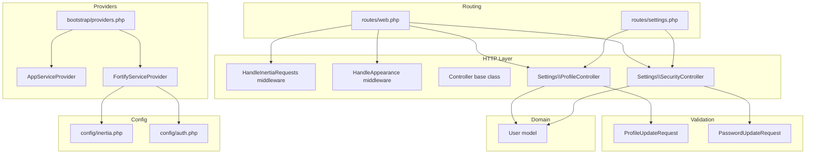
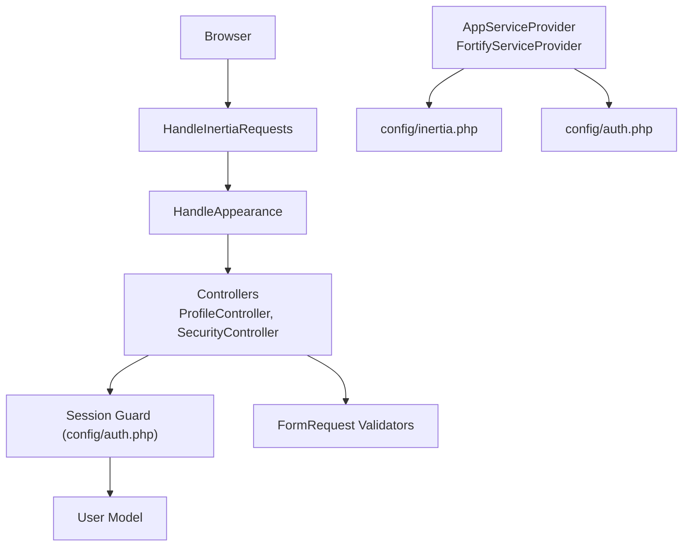
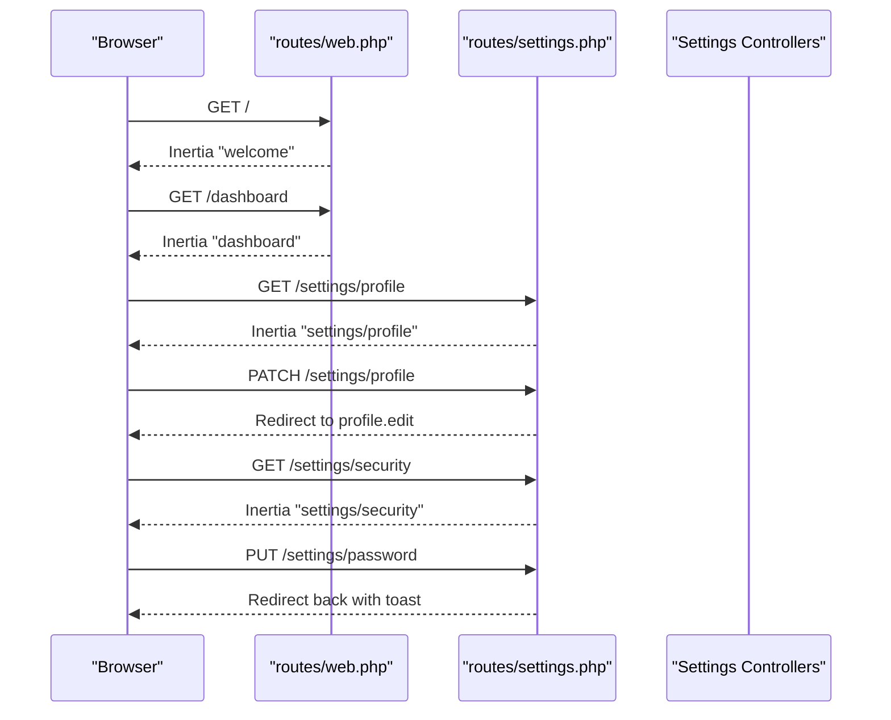
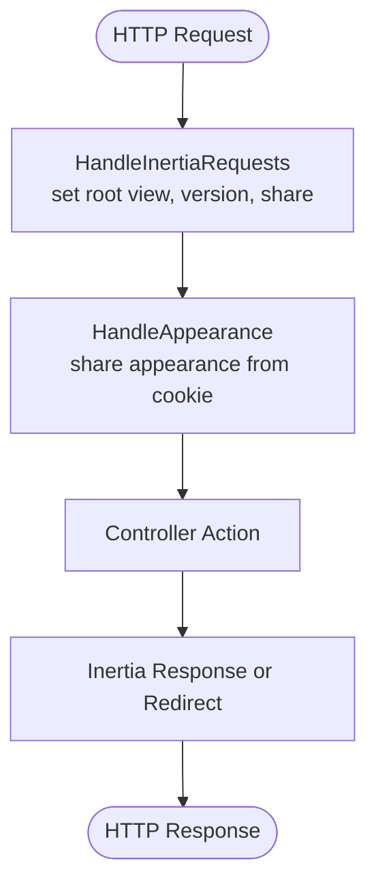
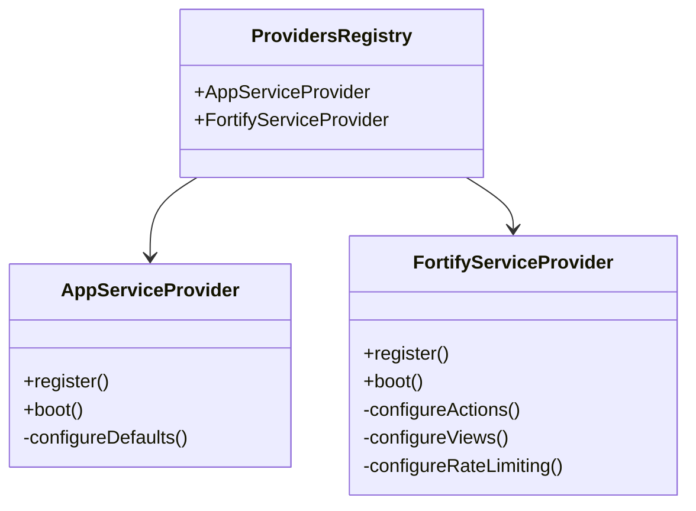
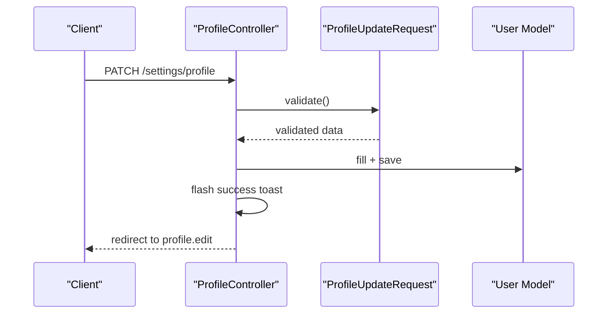
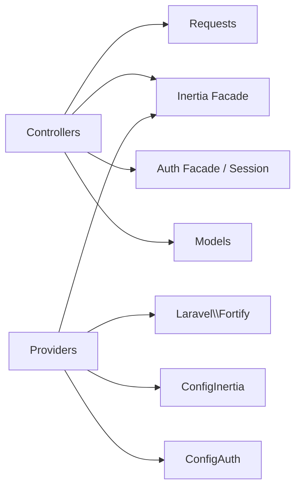

# Backend Architecture

<cite>
**Referenced Files in This Document**
- [routes/web.php](file://routes/web.php)
- [routes/settings.php](file://routes/settings.php)
- [app/Http/Controllers/Controller.php](file://app/Http/Controllers/Controller.php)
- [app/Http/Controllers/Settings/ProfileController.php](file://app/Http/Controllers/Settings/ProfileController.php)
- [app/Http/Controllers/Settings/SecurityController.php](file://app/Http/Controllers/Settings/SecurityController.php)
- [app/Http/Middleware/HandleAppearance.php](file://app/Http/Middleware/HandleAppearance.php)
- [app/Http/Middleware/HandleInertiaRequests.php](file://app/Http/Middleware/HandleInertiaRequests.php)
- [app/Http/Requests/Settings/ProfileUpdateRequest.php](file://app/Http/Requests/Settings/ProfileUpdateRequest.php)
- [app/Http/Requests/Settings/PasswordUpdateRequest.php](file://app/Http/Requests/Settings/PasswordUpdateRequest.php)
- [app/Models/User.php](file://app/Models/User.php)
- [app/Providers/AppServiceProvider.php](file://app/Providers/AppServiceProvider.php)
- [app/Providers/FortifyServiceProvider.php](file://app/Providers/FortifyServiceProvider.php)
- [bootstrap/providers.php](file://bootstrap/providers.php)
- [config/inertia.php](file://config/inertia.php)
- [config/auth.php](file://config/auth.php)
</cite>

## Table of Contents
1. [Introduction](#introduction)
2. [Project Structure](#project-structure)
3. [Core Components](#core-components)
4. [Architecture Overview](#architecture-overview)
5. [Detailed Component Analysis](#detailed-component-analysis)
6. [Dependency Analysis](#dependency-analysis)
7. [Performance Considerations](#performance-considerations)
8. [Troubleshooting Guide](#troubleshooting-guide)
9. [Conclusion](#conclusion)

## Introduction
This document describes the backend architecture of ScholarGraph’s Laravel implementation. It focuses on the Model-View-Controller (MVC) pattern, routing strategies, middleware chain, service layer design, dependency injection via service providers, request/response handling patterns, and integration with frontend components through Inertia.js. It also documents the routing system (web routes and settings-specific routes), middleware implementations for appearance handling and Inertia request processing, provider pattern for dependency injection, policy-based authorization, and event system integration.

## Project Structure
The backend follows Laravel conventions:
- Routes are defined under routes/ for web and settings-specific endpoints.
- Controllers live under app/Http/Controllers and app/Http/Controllers/Settings for settings-related pages.
- Middleware resides under app/Http/Middleware for cross-cutting concerns.
- Request validation classes are under app/Http/Requests/Settings.
- Domain models are under app/Models.
- Service providers are under app/Providers and registered in bootstrap/providers.php.
- Frontend integration is configured via config/inertia.php and config/auth.php.

**Diagram sources**
- [routes/web.php:1-12](file://routes/web.php#L1-L12)
- [routes/settings.php:1-35](file://routes/settings.php#L1-L35)
- [app/Http/Middleware/HandleInertiaRequests.php:1-48](file://app/Http/Middleware/HandleInertiaRequests.php#L1-L48)
- [app/Http/Middleware/HandleAppearance.php:1-24](file://app/Http/Middleware/HandleAppearance.php#L1-L24)
- [app/Http/Controllers/Controller.php:1-9](file://app/Http/Controllers/Controller.php#L1-L9)
- [app/Http/Controllers/Settings/ProfileController.php:1-63](file://app/Http/Controllers/Settings/ProfileController.php#L1-L63)
- [app/Http/Controllers/Settings/SecurityController.php:1-67](file://app/Http/Controllers/Settings/SecurityController.php#L1-L67)
- [app/Http/Requests/Settings/ProfileUpdateRequest.php:1-23](file://app/Http/Requests/Settings/ProfileUpdateRequest.php#L1-L23)
- [app/Http/Requests/Settings/PasswordUpdateRequest.php:1-26](file://app/Http/Requests/Settings/PasswordUpdateRequest.php#L1-L26)
- [app/Models/User.php:1-51](file://app/Models/User.php#L1-L51)
- [app/Providers/AppServiceProvider.php:1-51](file://app/Providers/AppServiceProvider.php#L1-L51)
- [app/Providers/FortifyServiceProvider.php:1-101](file://app/Providers/FortifyServiceProvider.php#L1-L101)
- [bootstrap/providers.php:1-10](file://bootstrap/providers.php#L1-L10)
- [config/inertia.php:1-71](file://config/inertia.php#L1-L71)
- [config/auth.php:1-118](file://config/auth.php#L1-L118)

**Section sources**
- [routes/web.php:1-12](file://routes/web.php#L1-L12)
- [routes/settings.php:1-35](file://routes/settings.php#L1-L35)
- [bootstrap/providers.php:1-10](file://bootstrap/providers.php#L1-L10)

## Core Components
- MVC Pattern
  - Model: User model encapsulates authentication, notifications, and Fortify integrations.
  - View: Inertia renders React pages from controllers; Blade templates are minimal wrappers.
  - Controller: Settings controllers orchestrate requests, validation, persistence, and inertia responses.
- Routing
  - Web routes define home and dashboard endpoints with Inertia rendering.
  - Settings routes define profile, security, and appearance pages with appropriate middleware.
- Middleware Chain
  - HandleInertiaRequests: sets root template, asset versioning, and shared data.
  - HandleAppearance: shares appearance preference from cookie.
- Service Providers
  - AppServiceProvider: configures defaults for dates, DB safety, and password rules.
  - FortifyServiceProvider: registers actions, views, and rate limiters for authentication flows.
- Request/Response Handling
  - FormRequest classes centralize validation rules.
  - Controllers return Inertia::render for page loads and redirects for mutations.
- Frontend Integration
  - Inertia configuration enables SSR and page discovery.
  - Authentication guard and provider configured for session-based Eloquent user retrieval.

**Section sources**
- [app/Models/User.php:1-51](file://app/Models/User.php#L1-L51)
- [app/Http/Controllers/Settings/ProfileController.php:1-63](file://app/Http/Controllers/Settings/ProfileController.php#L1-L63)
- [app/Http/Controllers/Settings/SecurityController.php:1-67](file://app/Http/Controllers/Settings/SecurityController.php#L1-L67)
- [app/Http/Middleware/HandleInertiaRequests.php:1-48](file://app/Http/Middleware/HandleInertiaRequests.php#L1-L48)
- [app/Http/Middleware/HandleAppearance.php:1-24](file://app/Http/Middleware/HandleAppearance.php#L1-L24)
- [app/Providers/AppServiceProvider.php:1-51](file://app/Providers/AppServiceProvider.php#L1-L51)
- [app/Providers/FortifyServiceProvider.php:1-101](file://app/Providers/FortifyServiceProvider.php#L1-L101)
- [config/inertia.php:1-71](file://config/inertia.php#L1-L71)
- [config/auth.php:1-118](file://config/auth.php#L1-L118)

## Architecture Overview
The backend uses a layered architecture:
- Presentation Layer: Inertia middleware and controllers render pages and manage flash messages.
- Application Layer: Controllers coordinate requests, validation, and persistence.
- Domain Layer: Eloquent model integrates authentication and Fortify features.
- Infrastructure Layer: Service providers configure application defaults and external integrations.

**Diagram sources**
- [app/Http/Middleware/HandleInertiaRequests.php:1-48](file://app/Http/Middleware/HandleInertiaRequests.php#L1-L48)
- [app/Http/Middleware/HandleAppearance.php:1-24](file://app/Http/Middleware/HandleAppearance.php#L1-L24)
- [app/Http/Controllers/Settings/ProfileController.php:1-63](file://app/Http/Controllers/Settings/ProfileController.php#L1-L63)
- [app/Http/Controllers/Settings/SecurityController.php:1-67](file://app/Http/Controllers/Settings/SecurityController.php#L1-L67)
- [app/Http/Requests/Settings/ProfileUpdateRequest.php:1-23](file://app/Http/Requests/Settings/ProfileUpdateRequest.php#L1-L23)
- [app/Http/Requests/Settings/PasswordUpdateRequest.php:1-26](file://app/Http/Requests/Settings/PasswordUpdateRequest.php#L1-L26)
- [app/Models/User.php:1-51](file://app/Models/User.php#L1-L51)
- [app/Providers/AppServiceProvider.php:1-51](file://app/Providers/AppServiceProvider.php#L1-L51)
- [app/Providers/FortifyServiceProvider.php:1-101](file://app/Providers/FortifyServiceProvider.php#L1-L101)
- [config/inertia.php:1-71](file://config/inertia.php#L1-L71)
- [config/auth.php:1-118](file://config/auth.php#L1-L118)

## Detailed Component Analysis

### Routing System
- Web routes
  - Home and dashboard are Inertia-rendered routes gated by auth and verified middlewares.
  - Settings routes are included from routes/settings.php.
- Settings routes
  - Profile: edit and update endpoints with dedicated FormRequest validation.
  - Security: edit endpoint for managing two-factor and passkeys; password update endpoint with throttling.
  - Appearance: Inertia-rendered page for appearance preferences.
  - Well-known endpoints: passkey discovery JSON route.

**Diagram sources**
- [routes/web.php:1-12](file://routes/web.php#L1-L12)
- [routes/settings.php:1-35](file://routes/settings.php#L1-L35)
- [app/Http/Controllers/Settings/ProfileController.php:1-63](file://app/Http/Controllers/Settings/ProfileController.php#L1-L63)
- [app/Http/Controllers/Settings/SecurityController.php:1-67](file://app/Http/Controllers/Settings/SecurityController.php#L1-L67)

**Section sources**
- [routes/web.php:1-12](file://routes/web.php#L1-L12)
- [routes/settings.php:1-35](file://routes/settings.php#L1-L35)

### Middleware Chain
- HandleInertiaRequests
  - Sets root template to the application layout.
  - Extends shared data with app name, authenticated user, and sidebar state derived from cookies.
- HandleAppearance
  - Shares the user’s appearance preference from the cookie, defaulting to system if not present.

**Diagram sources**
- [app/Http/Middleware/HandleInertiaRequests.php:1-48](file://app/Http/Middleware/HandleInertiaRequests.php#L1-L48)
- [app/Http/Middleware/HandleAppearance.php:1-24](file://app/Http/Middleware/HandleAppearance.php#L1-L24)

**Section sources**
- [app/Http/Middleware/HandleInertiaRequests.php:1-48](file://app/Http/Middleware/HandleInertiaRequests.php#L1-L48)
- [app/Http/Middleware/HandleAppearance.php:1-24](file://app/Http/Middleware/HandleAppearance.php#L1-L24)

### Service Providers and Dependency Injection
- AppServiceProvider
  - Bootstraps immutable date handling, production-safe destructive command prevention, and password strength defaults.
- FortifyServiceProvider
  - Registers creation and password reset actions.
  - Configures Inertia-based views for authentication pages.
  - Defines rate limiters for two-factor, login, and passkeys.
- Provider Registration
  - Providers are registered in bootstrap/providers.php.

**Diagram sources**
- [app/Providers/AppServiceProvider.php:1-51](file://app/Providers/AppServiceProvider.php#L1-L51)
- [app/Providers/FortifyServiceProvider.php:1-101](file://app/Providers/FortifyServiceProvider.php#L1-L101)
- [bootstrap/providers.php:1-10](file://bootstrap/providers.php#L1-L10)

**Section sources**
- [app/Providers/AppServiceProvider.php:1-51](file://app/Providers/AppServiceProvider.php#L1-L51)
- [app/Providers/FortifyServiceProvider.php:1-101](file://app/Providers/FortifyServiceProvider.php#L1-L101)
- [bootstrap/providers.php:1-10](file://bootstrap/providers.php#L1-L10)

### Controllers and Request Handling Patterns
- Base Controller
  - Minimal base class for settings controllers.
- ProfileController
  - edit: renders settings profile page with verification status and optional status message.
  - update: validates and persists profile changes; marks email unverified if changed; flashes success toast; redirects to edit route.
  - destroy: logs out, deletes user, invalidates session, regenerates CSRF token; redirects to home.
- SecurityController
  - edit: prepares props for security page including two-factor and passkey capabilities; maps passkey records; includes password rules; conditionally adds two-factor state.
  - update: updates password; flashes success toast; returns to previous page.

**Diagram sources**
- [app/Http/Controllers/Settings/ProfileController.php:1-63](file://app/Http/Controllers/Settings/ProfileController.php#L1-L63)
- [app/Http/Requests/Settings/ProfileUpdateRequest.php:1-23](file://app/Http/Requests/Settings/ProfileUpdateRequest.php#L1-L23)
- [app/Models/User.php:1-51](file://app/Models/User.php#L1-L51)

**Section sources**
- [app/Http/Controllers/Controller.php:1-9](file://app/Http/Controllers/Controller.php#L1-L9)
- [app/Http/Controllers/Settings/ProfileController.php:1-63](file://app/Http/Controllers/Settings/ProfileController.php#L1-L63)
- [app/Http/Controllers/Settings/SecurityController.php:1-67](file://app/Http/Controllers/Settings/SecurityController.php#L1-L67)
- [app/Http/Requests/Settings/ProfileUpdateRequest.php:1-23](file://app/Http/Requests/Settings/ProfileUpdateRequest.php#L1-L23)
- [app/Http/Requests/Settings/PasswordUpdateRequest.php:1-26](file://app/Http/Requests/Settings/PasswordUpdateRequest.php#L1-L26)

### Authorization and Policies
- Authentication Guard and Provider
  - Session-based guard with Eloquent provider using the User model.
- Password Confirmation
  - RequirePassword middleware applied to sensitive security routes.
- Policies
  - No explicit policy classes are present in the analyzed files; authorization decisions appear to rely on middleware gating and model features.

**Section sources**
- [config/auth.php:1-118](file://config/auth.php#L1-L118)
- [routes/settings.php:15-27](file://routes/settings.php#L15-L27)

### Events Integration
- No explicit event listeners or dispatcher usage was found in the analyzed files. Event-driven flows are not part of the current backend surface.

## Dependency Analysis
- Controllers depend on:
  - FormRequest validators for input sanitization and rules.
  - Inertia for rendering and flash messaging.
  - Auth facade/session for user context and logout.
- Models integrate:
  - Eloquent traits for factory, notifications, passkey, and two-factor authentication.
- Providers depend on:
  - Fortify for authentication views and actions.
  - Inertia for page rendering in authentication views.
- Configuration depends on:
  - Inertia config for SSR and page discovery.
  - Auth config for guard/provider selection.

**Diagram sources**
- [app/Http/Controllers/Settings/ProfileController.php:1-63](file://app/Http/Controllers/Settings/ProfileController.php#L1-L63)
- [app/Http/Controllers/Settings/SecurityController.php:1-67](file://app/Http/Controllers/Settings/SecurityController.php#L1-L67)
- [app/Http/Requests/Settings/ProfileUpdateRequest.php:1-23](file://app/Http/Requests/Settings/ProfileUpdateRequest.php#L1-L23)
- [app/Http/Requests/Settings/PasswordUpdateRequest.php:1-26](file://app/Http/Requests/Settings/PasswordUpdateRequest.php#L1-L26)
- [app/Models/User.php:1-51](file://app/Models/User.php#L1-L51)
- [app/Providers/FortifyServiceProvider.php:1-101](file://app/Providers/FortifyServiceProvider.php#L1-L101)
- [config/inertia.php:1-71](file://config/inertia.php#L1-L71)
- [config/auth.php:1-118](file://config/auth.php#L1-L118)

**Section sources**
- [app/Models/User.php:1-51](file://app/Models/User.php#L1-L51)
- [app/Providers/FortifyServiceProvider.php:1-101](file://app/Providers/FortifyServiceProvider.php#L1-L101)
- [config/inertia.php:1-71](file://config/inertia.php#L1-L71)
- [config/auth.php:1-118](file://config/auth.php#L1-L118)

## Performance Considerations
- Inertia SSR: Enabled in configuration; consider monitoring SSR bundle size and startup latency.
- Rate Limiting: FortifyServiceProvider configures rate limiters for login, two-factor, and passkeys; tune limits per deployment needs.
- DB Safety: AppServiceProvider prohibits destructive commands in production to prevent accidental data loss.
- Asset Versioning: HandleInertiaRequests middleware delegates asset versioning to Inertia; ensure cache-busting strategy aligns with build pipeline.

## Troubleshooting Guide
- Authentication Views Not Rendering
  - Verify FortifyServiceProvider registration and Inertia views configuration.
- Inertia Root Template Issues
  - Confirm HandleInertiaRequests root view matches the application layout.
- Appearance Preference Not Applied
  - Ensure cookie presence and HandleAppearance middleware is active.
- Password Update Failures
  - Validate PasswordUpdateRequest rules and ensure RequirePassword middleware is applied to sensitive routes.
- Session and Logout Behavior
  - ProfileController destroy action logs out, invalidates session, and regenerates CSRF; confirm middleware stack includes auth and verified.

**Section sources**
- [app/Providers/FortifyServiceProvider.php:1-101](file://app/Providers/FortifyServiceProvider.php#L1-L101)
- [app/Http/Middleware/HandleInertiaRequests.php:1-48](file://app/Http/Middleware/HandleInertiaRequests.php#L1-L48)
- [app/Http/Middleware/HandleAppearance.php:1-24](file://app/Http/Middleware/HandleAppearance.php#L1-L24)
- [app/Http/Requests/Settings/PasswordUpdateRequest.php:1-26](file://app/Http/Requests/Settings/PasswordUpdateRequest.php#L1-L26)
- [app/Http/Controllers/Settings/ProfileController.php:1-63](file://app/Http/Controllers/Settings/ProfileController.php#L1-L63)

## Conclusion
ScholarGraph’s backend leverages Laravel’s MVC pattern with Inertia for seamless frontend integration. The routing system cleanly separates public and authenticated flows, while middleware ensures consistent shared data and appearance handling. Service providers encapsulate authentication and application defaults, and controllers focus on orchestrating validation, persistence, and inertia responses. The architecture supports secure, maintainable development with clear separation of concerns and extensible provider patterns.