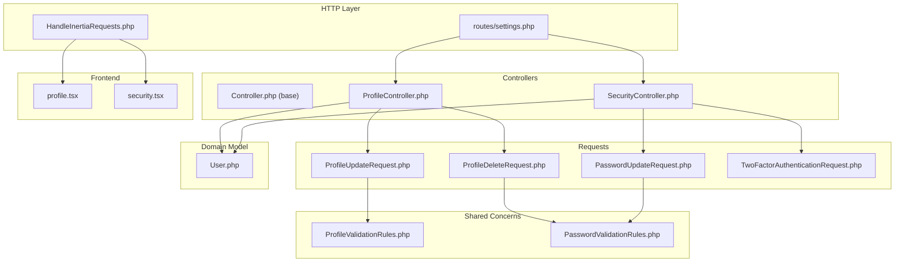
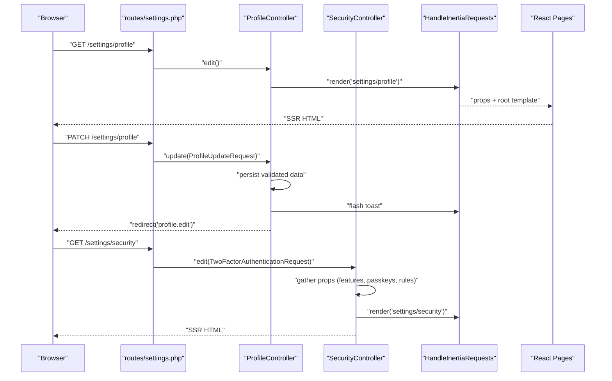
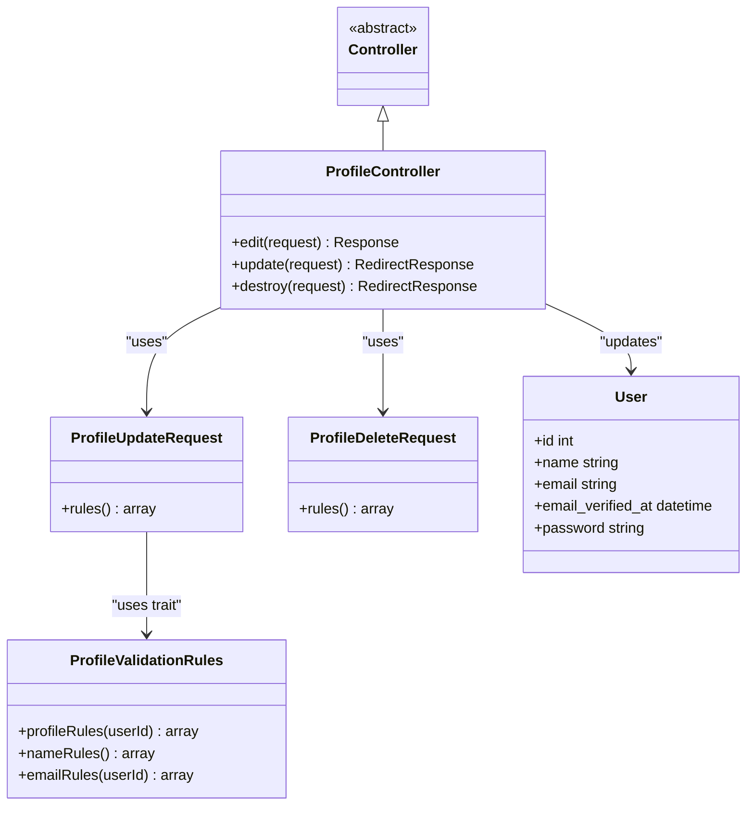
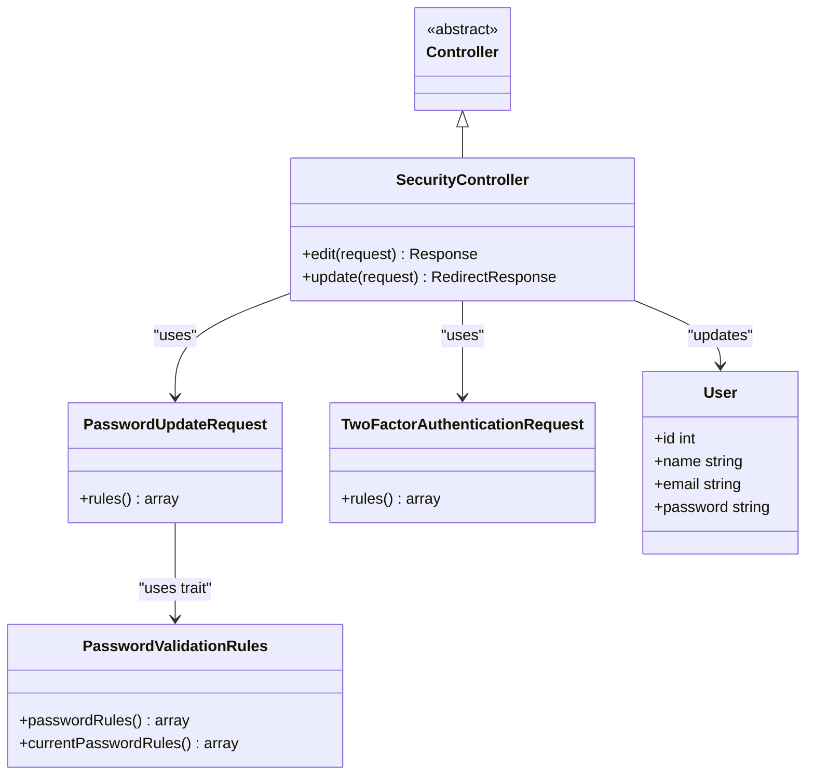
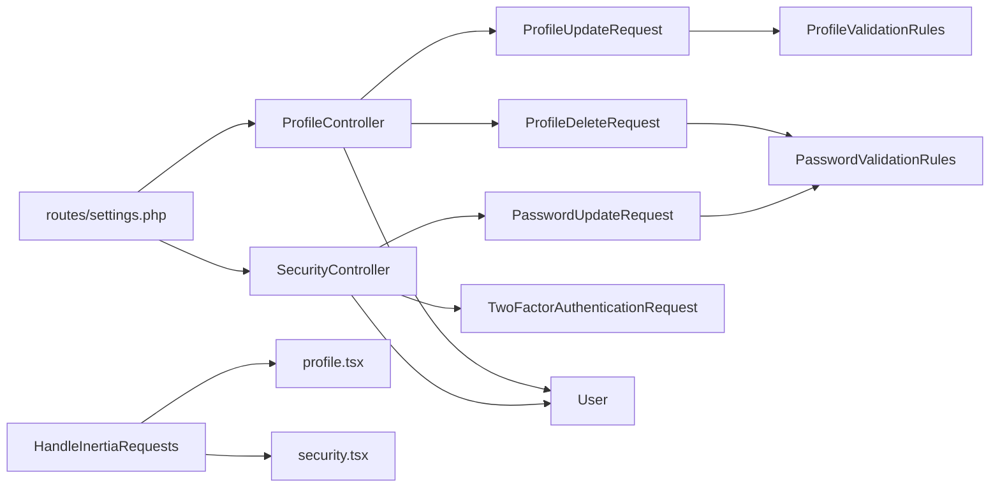

# Controllers

<cite>
**Referenced Files in This Document**
- [Controller.php](file://app/Http/Controllers/Controller.php)
- [ProfileController.php](file://app/Http/Controllers/Settings/ProfileController.php)
- [SecurityController.php](file://app/Http/Controllers/Settings/SecurityController.php)
- [ProfileUpdateRequest.php](file://app/Http/Requests/Settings/ProfileUpdateRequest.php)
- [ProfileDeleteRequest.php](file://app/Http/Requests/Settings/ProfileDeleteRequest.php)
- [PasswordUpdateRequest.php](file://app/Http/Requests/Settings/PasswordUpdateRequest.php)
- [TwoFactorAuthenticationRequest.php](file://app/Http/Requests/Settings/TwoFactorAuthenticationRequest.php)
- [ProfileValidationRules.php](file://app/Concerns/ProfileValidationRules.php)
- [PasswordValidationRules.php](file://app/Concerns/PasswordValidationRules.php)
- [HandleInertiaRequests.php](file://app/Http/Middleware/HandleInertiaRequests.php)
- [settings.php](file://routes/settings.php)
- [User.php](file://app/Models/User.php)
- [profile.tsx](file://resources/js/pages/settings/profile.tsx)
- [security.tsx](file://resources/js/pages/settings/security.tsx)
- [ProfileUpdateTest.php](file://tests/Feature/Settings/ProfileUpdateTest.php)
- [SecurityTest.php](file://tests/Feature/Settings/SecurityTest.php)
</cite>

## Table of Contents
1. [Introduction](#introduction)
2. [Project Structure](#project-structure)
3. [Core Components](#core-components)
4. [Architecture Overview](#architecture-overview)
5. [Detailed Component Analysis](#detailed-component-analysis)
6. [Dependency Analysis](#dependency-analysis)
7. [Performance Considerations](#performance-considerations)
8. [Troubleshooting Guide](#troubleshooting-guide)
9. [Conclusion](#conclusion)

## Introduction
This document describes the Laravel controller layer in ScholarGraph with a focus on the base controller class, the abstract controller pattern, and the settings-specific controllers ProfileController and SecurityController. It explains request handling, response patterns, integration with Inertia.js for frontend communication, validation strategies, controller-model relationships, and error handling approaches. The goal is to provide a clear understanding of how controllers orchestrate user-facing settings workflows while maintaining separation of concerns and leveraging Laravel’s validation and middleware layers.

## Project Structure
The controller layer follows a layered organization:
- Base controller class defines a common foundation for all controllers.
- Settings controllers handle profile and security operations under a dedicated namespace.
- Request classes encapsulate validation rules and pre-processing for controller actions.
- Middleware integrates Inertia.js for server-rendered SPA-like experiences.
- Routes define the HTTP surface for settings operations.

**Diagram sources**
- [settings.php:1-35](file://routes/settings.php#L1-L35)
- [HandleInertiaRequests.php:1-48](file://app/Http/Middleware/HandleInertiaRequests.php#L1-L48)
- [Controller.php:1-9](file://app/Http/Controllers/Controller.php#L1-L9)
- [ProfileController.php:1-63](file://app/Http/Controllers/Settings/ProfileController.php#L1-L63)
- [SecurityController.php:1-67](file://app/Http/Controllers/Settings/SecurityController.php#L1-L67)
- [ProfileUpdateRequest.php:1-23](file://app/Http/Requests/Settings/ProfileUpdateRequest.php#L1-L23)
- [ProfileDeleteRequest.php:1-25](file://app/Http/Requests/Settings/ProfileDeleteRequest.php#L1-L25)
- [PasswordUpdateRequest.php:1-26](file://app/Http/Requests/Settings/PasswordUpdateRequest.php#L1-L26)
- [TwoFactorAuthenticationRequest.php:1-23](file://app/Http/Requests/Settings/TwoFactorAuthenticationRequest.php#L1-L23)
- [ProfileValidationRules.php:1-52](file://app/Concerns/ProfileValidationRules.php#L1-L52)
- [PasswordValidationRules.php:1-30](file://app/Concerns/PasswordValidationRules.php#L1-L30)
- [User.php:1-51](file://app/Models/User.php#L1-L51)
- [profile.tsx:1-139](file://resources/js/pages/settings/profile.tsx#L1-L139)
- [security.tsx:1-148](file://resources/js/pages/settings/security.tsx#L1-L148)

**Section sources**
- [settings.php:1-35](file://routes/settings.php#L1-L35)
- [HandleInertiaRequests.php:1-48](file://app/Http/Middleware/HandleInertiaRequests.php#L1-L48)
- [Controller.php:1-9](file://app/Http/Controllers/Controller.php#L1-L9)

## Core Components
- Base controller class: An empty abstract base class that establishes a namespace and enables future shared behavior across controllers.
- Settings controllers:
  - ProfileController: Handles profile editing, updating personal details, and account deletion.
  - SecurityController: Renders security settings, manages password updates, and coordinates two-factor and passkey features via Fortify.
- Request classes: Encapsulate validation rules and preconditions for each action.
- Shared validation concerns: Reusable traits that define consistent validation rules for profile and password updates.
- Middleware: Centralizes Inertia.js integration, shared props, and asset versioning.
- Frontend pages: React/Pages consume controller-provided props and route helpers to render settings UIs.

Key characteristics:
- Strong separation of concerns: Controllers coordinate requests, models, and responses; validation is delegated to FormRequest classes.
- Inertia-driven responses: Controllers return Inertia::render for page loads and Inertia::flash for feedback; redirects for mutations.
- Feature-aware rendering: SecurityController adapts UI and props based on Fortify feature flags.

**Section sources**
- [Controller.php:1-9](file://app/Http/Controllers/Controller.php#L1-L9)
- [ProfileController.php:1-63](file://app/Http/Controllers/Settings/ProfileController.php#L1-L63)
- [SecurityController.php:1-67](file://app/Http/Controllers/Settings/SecurityController.php#L1-L67)
- [ProfileUpdateRequest.php:1-23](file://app/Http/Requests/Settings/ProfileUpdateRequest.php#L1-L23)
- [PasswordUpdateRequest.php:1-26](file://app/Http/Requests/Settings/PasswordUpdateRequest.php#L1-L26)
- [TwoFactorAuthenticationRequest.php:1-23](file://app/Http/Requests/Settings/TwoFactorAuthenticationRequest.php#L1-L23)
- [ProfileValidationRules.php:1-52](file://app/Concerns/ProfileValidationRules.php#L1-L52)
- [PasswordValidationRules.php:1-30](file://app/Concerns/PasswordValidationRules.php#L1-L30)
- [HandleInertiaRequests.php:1-48](file://app/Http/Middleware/HandleInertiaRequests.php#L1-L48)

## Architecture Overview
The controller architecture leverages:
- Route-to-controller mapping for settings endpoints.
- FormRequest classes for validation and authorization preconditions.
- Inertia middleware for shared data and root template integration.
- Eloquent model for persistence and feature flags.

**Diagram sources**
- [settings.php:8-27](file://routes/settings.php#L8-L27)
- [ProfileController.php:20-44](file://app/Http/Controllers/Settings/ProfileController.php#L20-L44)
- [SecurityController.php:19-51](file://app/Http/Controllers/Settings/SecurityController.php#L19-L51)
- [HandleInertiaRequests.php:36-46](file://app/Http/Middleware/HandleInertiaRequests.php#L36-L46)
- [profile.tsx:18-129](file://resources/js/pages/settings/profile.tsx#L18-L129)
- [security.tsx:20-138](file://resources/js/pages/settings/security.tsx#L20-L138)

## Detailed Component Analysis

### Base Controller Pattern
- Purpose: Establish a namespace and potential extension point for shared controller behavior.
- Usage: Both settings controllers extend the base Controller class, signaling a unified controller hierarchy.

Implementation highlights:
- Minimal footprint enabling future cross-cutting concerns (e.g., shared middleware binding, common response helpers).

**Section sources**
- [Controller.php:5-8](file://app/Http/Controllers/Controller.php#L5-L8)
- [ProfileController.php:15](file://app/Http/Controllers/Settings/ProfileController.php#L15)
- [SecurityController.php:14](file://app/Http/Controllers/Settings/SecurityController.php#L14)

### ProfileController
Responsibilities:
- Render the profile settings page with verification and status context.
- Update user profile details with validation and email verification reset semantics.
- Delete the user account after confirming credentials and invalidate the session.

Methods and behavior:
- edit(Request): Returns an Inertia render with mustVerifyEmail and status context.
- update(ProfileUpdateRequest): Validates input via ProfileUpdateRequest, persists changes, resets email verification if email changed, flashes a success toast, and redirects to the profile edit route.
- destroy(ProfileDeleteRequest): Requires current password confirmation, logs out the user, deletes the record, invalidates the session, regenerates CSRF token, and redirects to home.

Request handling and validation:
- ProfileUpdateRequest composes ProfileValidationRules to enforce name/email rules scoped to the current user.
- ProfileDeleteRequest enforces current password confirmation via PasswordValidationRules.

Response patterns:
- Uses Inertia::render for page loads and Inertia::flash for feedback.
- Uses redirect helpers for post-mutation navigation.

Integration with Inertia.js:
- Frontend page consumes controller props and routes to render forms and status messages.

Relationship with model:
- Operates on the authenticated user model; updates attributes and saves.

Error handling:
- Validation failures are handled by FormRequest classes; unauthorized or incorrect credentials lead to validation errors surfaced to the UI.

**Diagram sources**
- [Controller.php:5-8](file://app/Http/Controllers/Controller.php#L5-L8)
- [ProfileController.php:15-62](file://app/Http/Controllers/Settings/ProfileController.php#L15-L62)
- [ProfileUpdateRequest.php:9-22](file://app/Http/Requests/Settings/ProfileUpdateRequest.php#L9-L22)
- [ProfileDeleteRequest.php:9-24](file://app/Http/Requests/Settings/ProfileDeleteRequest.php#L9-L24)
- [ProfileValidationRules.php:9-52](file://app/Concerns/ProfileValidationRules.php#L9-L52)
- [User.php:32-50](file://app/Models/User.php#L32-L50)

**Section sources**
- [ProfileController.php:17-61](file://app/Http/Controllers/Settings/ProfileController.php#L17-L61)
- [ProfileUpdateRequest.php:18-21](file://app/Http/Requests/Settings/ProfileUpdateRequest.php#L18-L21)
- [ProfileDeleteRequest.php:18-23](file://app/Http/Requests/Settings/ProfileDeleteRequest.php#L18-L23)
- [ProfileValidationRules.php:16-50](file://app/Concerns/ProfileValidationRules.php#L16-L50)
- [profile.tsx:18-129](file://resources/js/pages/settings/profile.tsx#L18-L129)

### SecurityController
Responsibilities:
- Render the security settings page with feature-aware props (two-factor and passkeys).
- Update the user’s password after validating current and new passwords.
- Coordinate two-factor state via TwoFactorAuthenticationRequest.

Methods and behavior:
- edit(TwoFactorAuthenticationRequest): Gathers feature flags, passkey records, and password rules; conditionally validates two-factor state; returns an Inertia render.
- update(PasswordUpdateRequest): Updates the user’s password, flashes a success toast, and redirects back to the security page.

Request handling and validation:
- PasswordUpdateRequest composes PasswordValidationRules to enforce current password and new password constraints.
- TwoFactorAuthenticationRequest integrates with Fortify’s two-factor state handling.

Response patterns:
- Uses Inertia::render for page loads and Inertia::flash for feedback.
- Uses back() for post-mutation navigation.

Integration with Inertia.js:
- Frontend page consumes controller props to drive password form, two-factor management, and passkey management components.

Relationship with model:
- Operates on the authenticated user model; updates the password attribute.

Error handling:
- Validation failures are handled by FormRequest classes; missing or invalid current password leads to validation errors surfaced to the UI.

**Diagram sources**
- [Controller.php:5-8](file://app/Http/Controllers/Controller.php#L5-L8)
- [SecurityController.php:14-66](file://app/Http/Controllers/Settings/SecurityController.php#L14-L66)
- [PasswordUpdateRequest.php:9-25](file://app/Http/Requests/Settings/PasswordUpdateRequest.php#L9-L25)
- [TwoFactorAuthenticationRequest.php:9-22](file://app/Http/Requests/Settings/TwoFactorAuthenticationRequest.php#L9-L22)
- [PasswordValidationRules.php:8-29](file://app/Concerns/PasswordValidationRules.php#L8-L29)
- [User.php:32-50](file://app/Models/User.php#L32-L50)

**Section sources**
- [SecurityController.php:16-65](file://app/Http/Controllers/Settings/SecurityController.php#L16-L65)
- [PasswordUpdateRequest.php:18-24](file://app/Http/Requests/Settings/PasswordUpdateRequest.php#L18-L24)
- [TwoFactorAuthenticationRequest.php:18-21](file://app/Http/Requests/Settings/TwoFactorAuthenticationRequest.php#L18-L21)
- [PasswordValidationRules.php:15-28](file://app/Concerns/PasswordValidationRules.php#L15-L28)
- [security.tsx:20-138](file://resources/js/pages/settings/security.tsx#L20-L138)

### Validation Strategy and Naming Conventions
- Request classes:
  - ProfileUpdateRequest: Encapsulates profile update rules via ProfileValidationRules.
  - ProfileDeleteRequest: Enforces current password confirmation via PasswordValidationRules.
  - PasswordUpdateRequest: Enforces current and new password rules via PasswordValidationRules.
  - TwoFactorAuthenticationRequest: Provides two-factor state interactions.
- Validation concerns:
  - ProfileValidationRules: Centralizes name and email rules, including uniqueness constraints respecting the current user.
  - PasswordValidationRules: Centralizes password and current password rules using Laravel’s Password defaults and current_password rule.
- Method naming conventions:
  - edit/update/destroy align with RESTful conventions for show/edit, update, and delete operations.
  - Route names reflect intent (e.g., profile.edit, profile.update, security.edit, user-password.update).

**Section sources**
- [ProfileUpdateRequest.php:18-21](file://app/Http/Requests/Settings/ProfileUpdateRequest.php#L18-L21)
- [ProfileDeleteRequest.php:18-23](file://app/Http/Requests/Settings/ProfileDeleteRequest.php#L18-L23)
- [PasswordUpdateRequest.php:18-24](file://app/Http/Requests/Settings/PasswordUpdateRequest.php#L18-L24)
- [TwoFactorAuthenticationRequest.php:18-21](file://app/Http/Requests/Settings/TwoFactorAuthenticationRequest.php#L18-L21)
- [ProfileValidationRules.php:16-50](file://app/Concerns/ProfileValidationRules.php#L16-L50)
- [PasswordValidationRules.php:15-28](file://app/Concerns/PasswordValidationRules.php#L15-L28)

### Inertia.js Integration
- Middleware:
  - Root template is configured for initial page load.
  - Shared props include application name, authenticated user, and sidebar state.
- Controllers:
  - Use Inertia::render for page loads and Inertia::flash for transient notifications.
- Frontend:
  - React pages consume props and route helpers to build forms and manage state.

**Section sources**
- [HandleInertiaRequests.php:17](file://app/Http/Middleware/HandleInertiaRequests.php#L17)
- [HandleInertiaRequests.php:36-46](file://app/Http/Middleware/HandleInertiaRequests.php#L36-L46)
- [ProfileController.php:22-25](file://app/Http/Controllers/Settings/ProfileController.php#L22-L25)
- [SecurityController.php:21-50](file://app/Http/Controllers/Settings/SecurityController.php#L21-L50)
- [profile.tsx:25-129](file://resources/js/pages/settings/profile.tsx#L25-L129)
- [security.tsx:20-138](file://resources/js/pages/settings/security.tsx#L20-L138)

## Dependency Analysis
- Controllers depend on:
  - Request classes for validation and authorization preconditions.
  - Inertia middleware for shared props and SSR.
  - Eloquent User model for persistence.
- Requests depend on:
  - Validation concerns for reusable rules.
- Routes bind HTTP verbs to controller actions and apply middleware stacks.

**Diagram sources**
- [settings.php:8-27](file://routes/settings.php#L8-L27)
- [ProfileController.php:15-62](file://app/Http/Controllers/Settings/ProfileController.php#L15-L62)
- [SecurityController.php:14-66](file://app/Http/Controllers/Settings/SecurityController.php#L14-L66)
- [ProfileUpdateRequest.php:9-22](file://app/Http/Requests/Settings/ProfileUpdateRequest.php#L9-L22)
- [ProfileDeleteRequest.php:9-24](file://app/Http/Requests/Settings/ProfileDeleteRequest.php#L9-L24)
- [PasswordUpdateRequest.php:9-25](file://app/Http/Requests/Settings/PasswordUpdateRequest.php#L9-L25)
- [TwoFactorAuthenticationRequest.php:9-22](file://app/Http/Requests/Settings/TwoFactorAuthenticationRequest.php#L9-L22)
- [ProfileValidationRules.php:9-52](file://app/Concerns/ProfileValidationRules.php#L9-L52)
- [PasswordValidationRules.php:8-29](file://app/Concerns/PasswordValidationRules.php#L8-L29)
- [User.php:32-50](file://app/Models/User.php#L32-L50)
- [HandleInertiaRequests.php:36-46](file://app/Http/Middleware/HandleInertiaRequests.php#L36-L46)
- [profile.tsx:18-129](file://resources/js/pages/settings/profile.tsx#L18-L129)
- [security.tsx:20-138](file://resources/js/pages/settings/security.tsx#L20-L138)

**Section sources**
- [settings.php:8-27](file://routes/settings.php#L8-L27)
- [ProfileController.php:15-62](file://app/Http/Controllers/Settings/ProfileController.php#L15-L62)
- [SecurityController.php:14-66](file://app/Http/Controllers/Settings/SecurityController.php#L14-L66)

## Performance Considerations
- Prefer minimal queries in controllers; fetch only required fields for lists (e.g., passkeys selection in SecurityController).
- Use Eloquent model attribute casting to avoid manual conversions.
- Keep controller actions thin: delegate heavy logic to services or jobs when appropriate.
- Leverage Inertia’s preserveScroll option to reduce re-fetch overhead on client-side navigation.

## Troubleshooting Guide
Common issues and resolutions:
- Validation errors on profile update:
  - Ensure ProfileUpdateRequest rules are satisfied (name, email uniqueness).
  - Verify that changing the email triggers email verification reset behavior.
- Account deletion failures:
  - Confirm current password is provided; otherwise, validation errors will occur.
- Password update failures:
  - Ensure current password matches; new password meets strength rules and confirmation matches.
- Two-factor state:
  - When enabled, ensure password confirmation is present before accessing security settings.

Evidence from tests:
- Profile update and delete scenarios assert successful persistence and redirection.
- Password update scenario asserts successful hashing and redirect.
- Security page behavior depends on Fortify feature flags and password confirmation middleware.

**Section sources**
- [ProfileUpdateTest.php:15-68](file://tests/Feature/Settings/ProfileUpdateTest.php#L15-L68)
- [SecurityTest.php:70-104](file://tests/Feature/Settings/SecurityTest.php#L70-L104)

## Conclusion
The controller layer in ScholarGraph demonstrates a clean separation of concerns, robust validation via FormRequest classes, and seamless integration with Inertia.js for a modern frontend experience. ProfileController and SecurityController encapsulate domain-specific workflows, while shared validation concerns promote consistency. The architecture supports feature-aware rendering, strong typing via TypeScript pages, and reliable error handling through Laravel’s validation and middleware systems.