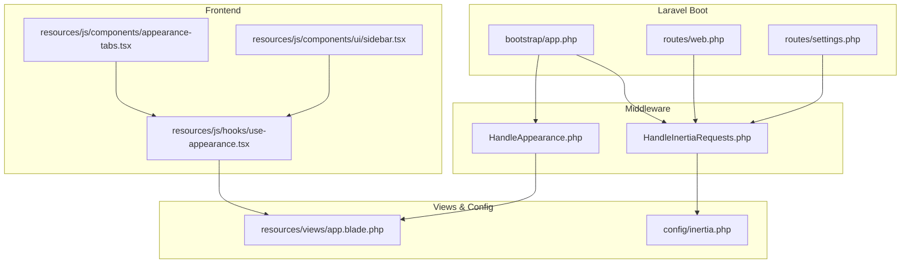
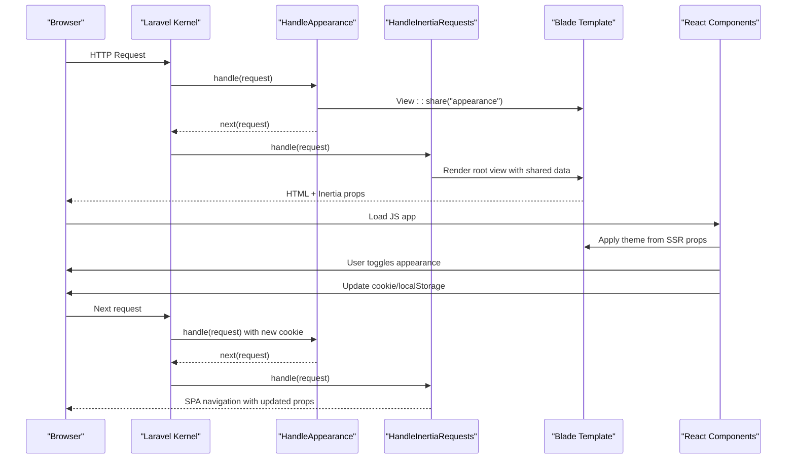
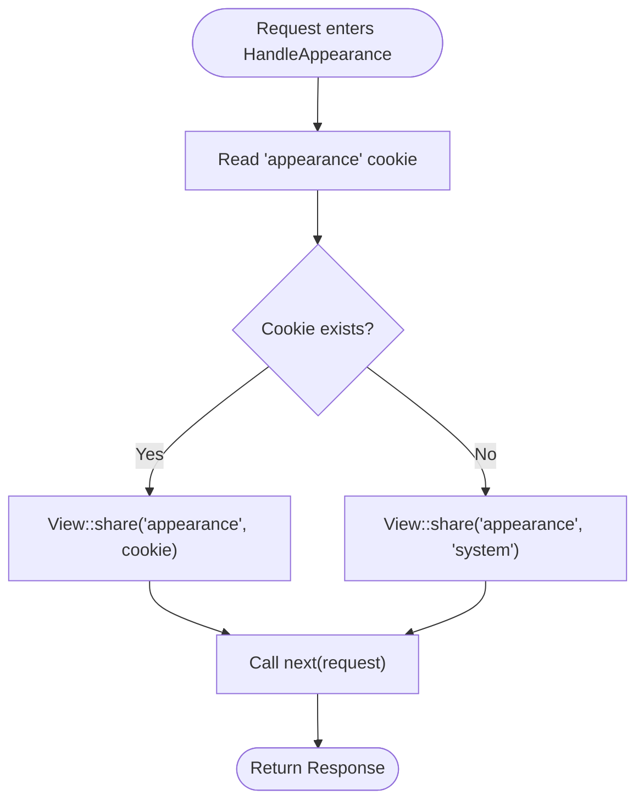
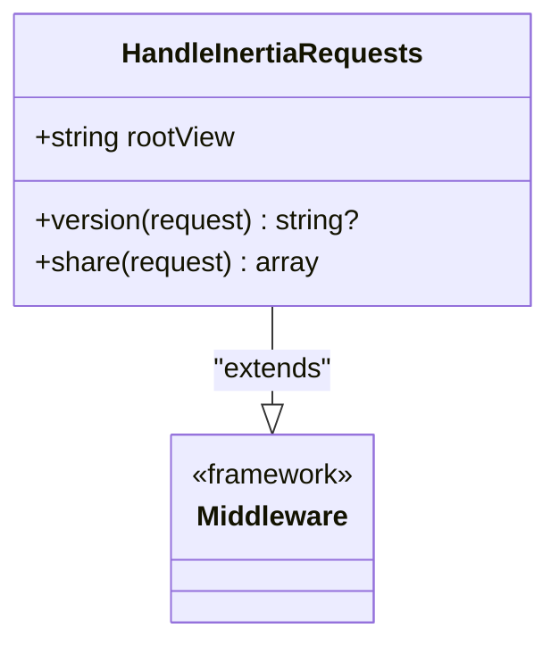
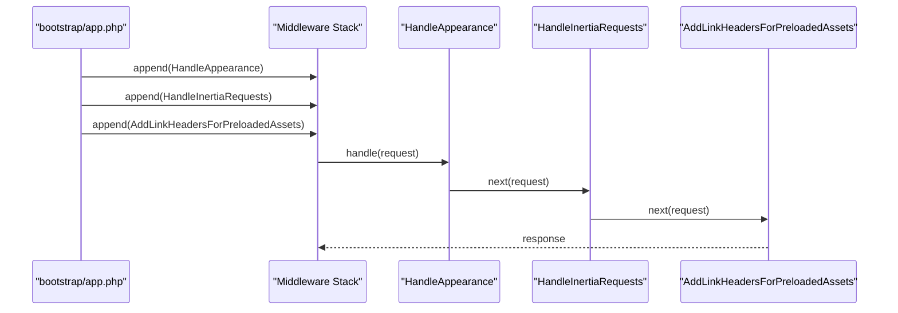
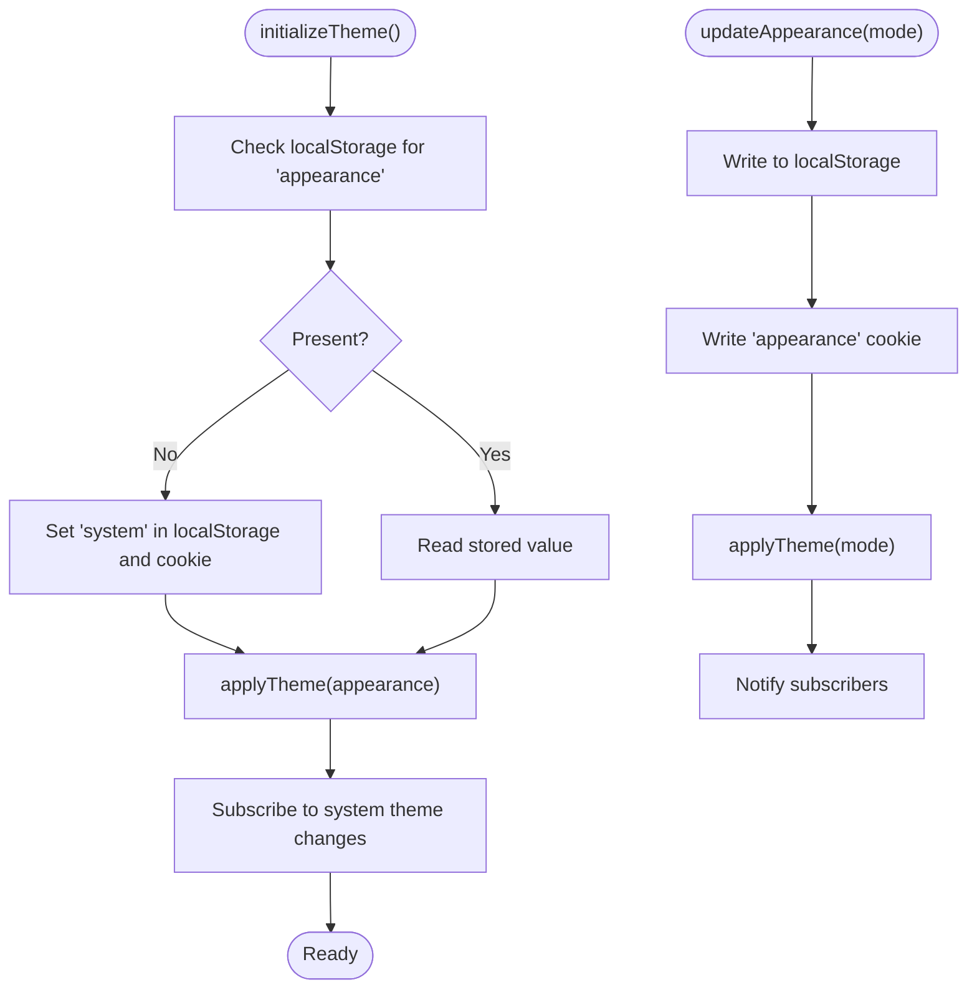
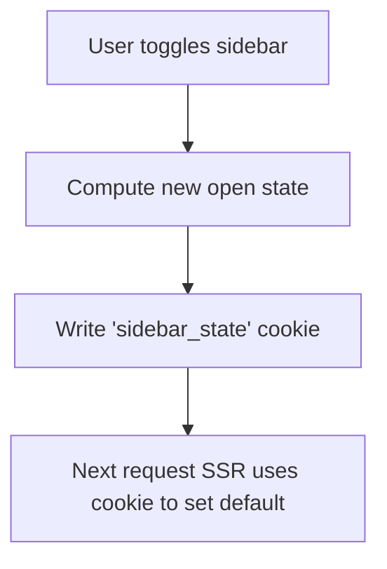
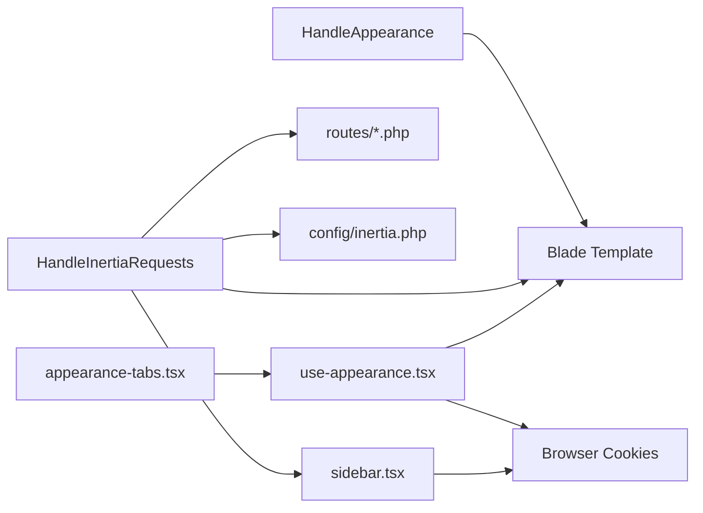

# Middleware Layer

<cite>
**Referenced Files in This Document**
- [HandleAppearance.php](file://app/Http/Middleware/HandleAppearance.php)
- [HandleInertiaRequests.php](file://app/Http/Middleware/HandleInertiaRequests.php)
- [app.php](file://bootstrap/app.php)
- [inertia.php](file://config/inertia.php)
- [web.php](file://routes/web.php)
- [settings.php](file://routes/settings.php)
- [app.blade.php](file://resources/views/app.blade.php)
- [use-appearance.tsx](file://resources/js/hooks/use-appearance.tsx)
- [appearance-tabs.tsx](file://resources/js/components/appearance-tabs.tsx)
- [sidebar.tsx](file://resources/js/components/ui/sidebar.tsx)
</cite>

## Table of Contents
1. [Introduction](#introduction)
2. [Project Structure](#project-structure)
3. [Core Components](#core-components)
4. [Architecture Overview](#architecture-overview)
5. [Detailed Component Analysis](#detailed-component-analysis)
6. [Dependency Analysis](#dependency-analysis)
7. [Performance Considerations](#performance-considerations)
8. [Troubleshooting Guide](#troubleshooting-guide)
9. [Conclusion](#conclusion)

## Introduction
This document explains ScholarGraph’s middleware layer focused on request processing for visual appearance and SPA transitions. It details:
- HandleAppearance: theme and appearance handling via cookies and Blade view sharing
- HandleInertiaRequests: seamless single-page application transitions, shared data, and asset versioning
- Middleware execution order and integration with Laravel’s middleware stack
- Frontend integration patterns for theme persistence and sidebar state
- Practical examples, debugging techniques, and optimization strategies

## Project Structure
The middleware layer spans backend middleware classes, Laravel bootstrapping, Inertia configuration, and frontend hooks/components that collaborate to deliver a smooth user experience.

**Diagram sources**
- [app.php:17-24](file://bootstrap/app.php#L17-L24)
- [HandleAppearance.php:17-22](file://app/Http/Middleware/HandleAppearance.php#L17-L22)
- [HandleInertiaRequests.php:8-46](file://app/Http/Middleware/HandleInertiaRequests.php#L8-L46)
- [web.php:5-9](file://routes/web.php#L5-L9)
- [settings.php:26](file://routes/settings.php#L26)
- [app.blade.php:1-49](file://resources/views/app.blade.php#L1-L49)
- [inertia.php:1-71](file://config/inertia.php#L1-L71)
- [use-appearance.tsx:1-116](file://resources/js/hooks/use-appearance.tsx#L1-L116)
- [appearance-tabs.tsx:1-46](file://resources/js/components/appearance-tabs.tsx#L1-L46)
- [sidebar.tsx:26-84](file://resources/js/components/ui/sidebar.tsx#L26-L84)

**Section sources**
- [app.php:17-24](file://bootstrap/app.php#L17-L24)
- [HandleAppearance.php:17-22](file://app/Http/Middleware/HandleAppearance.php#L17-L22)
- [HandleInertiaRequests.php:8-46](file://app/Http/Middleware/HandleInertiaRequests.php#L8-L46)
- [web.php:5-9](file://routes/web.php#L5-L9)
- [settings.php:26](file://routes/settings.php#L26)
- [app.blade.php:1-49](file://resources/views/app.blade.php#L1-L49)
- [inertia.php:1-71](file://config/inertia.php#L1-L71)
- [use-appearance.tsx:1-116](file://resources/js/hooks/use-appearance.tsx#L1-L116)
- [appearance-tabs.tsx:1-46](file://resources/js/components/appearance-tabs.tsx#L1-L46)
- [sidebar.tsx:26-84](file://resources/js/components/ui/sidebar.tsx#L26-L84)

## Core Components
- HandleAppearance: Reads the appearance cookie and shares it with Blade templates for initial SSR rendering and theme consistency.
- HandleInertiaRequests: Extends Inertia’s base middleware to define the root template, asset versioning, and shared data (app name, authenticated user, sidebar state).

**Section sources**
- [HandleAppearance.php:17-22](file://app/Http/Middleware/HandleAppearance.php#L17-L22)
- [HandleInertiaRequests.php:17-46](file://app/Http/Middleware/HandleInertiaRequests.php#L17-L46)

## Architecture Overview
The middleware pipeline integrates tightly with Inertia and the frontend:
- HandleAppearance runs early to expose theme preference to the root Blade template.
- HandleInertiaRequests runs next to prepare shared data and enable SPA-like navigation.
- Frontend hooks persist user choices to cookies and local storage, ensuring cross-request continuity.

**Diagram sources**
- [app.php:20-24](file://bootstrap/app.php#L20-L24)
- [HandleAppearance.php:17-22](file://app/Http/Middleware/HandleAppearance.php#L17-L22)
- [HandleInertiaRequests.php:36-46](file://app/Http/Middleware/HandleInertiaRequests.php#L36-L46)
- [app.blade.php:10-19](file://resources/views/app.blade.php#L10-L19)
- [use-appearance.tsx:73-88](file://resources/js/hooks/use-appearance.tsx#L73-L88)

## Detailed Component Analysis

### HandleAppearance Middleware
Purpose:
- Share the current appearance setting with Blade templates for immediate SSR rendering.
- Default to “system” when no cookie is present.

Processing logic:
- Reads the appearance cookie from the request.
- Shares the value globally via the View facade.
- Passes control to the next middleware.

**Diagram sources**
- [HandleAppearance.php:17-22](file://app/Http/Middleware/HandleAppearance.php#L17-L22)

**Section sources**
- [HandleAppearance.php:17-22](file://app/Http/Middleware/HandleAppearance.php#L17-L22)
- [app.blade.php:2](file://resources/views/app.blade.php#L2)

### HandleInertiaRequests Middleware
Purpose:
- Configure Inertia’s root template, asset versioning, and shared data.
- Provide default shared props for authenticated user and sidebar state.

Key behaviors:
- Root template: app.blade.php
- Asset versioning: defers to Inertia’s default mechanism
- Shared data: app name, authenticated user, sidebarOpen flag derived from cookie

**Diagram sources**
- [HandleInertiaRequests.php:8-46](file://app/Http/Middleware/HandleInertiaRequests.php#L8-L46)

**Section sources**
- [HandleInertiaRequests.php:17-46](file://app/Http/Middleware/HandleInertiaRequests.php#L17-L46)
- [app.blade.php:41-46](file://resources/views/app.blade.php#L41-L46)
- [sidebar.tsx:26-84](file://resources/js/components/ui/sidebar.tsx#L26-L84)

### Middleware Execution Order and Laravel Integration
- Cookies encryption exclusion: The appearance and sidebar_state cookies are intentionally left unencrypted to support client-side persistence and SSR compatibility.
- Web middleware stack order: HandleAppearance → HandleInertiaRequests → AddLinkHeadersForPreloadedAssets.

**Diagram sources**
- [app.php:18](file://bootstrap/app.php#L18)
- [app.php:20-24](file://bootstrap/app.php#L20-L24)

**Section sources**
- [app.php:18](file://bootstrap/app.php#L18)
- [app.php:20-24](file://bootstrap/app.php#L20-L24)

### Frontend Theme Integration
- Initialization: On first load, the hook reads localStorage and sets a default cookie if missing, then applies the theme to the document element.
- Persistence: Updating appearance writes to both localStorage and the appearance cookie.
- SSR alignment: The Blade template inspects the shared appearance variable to set initial dark mode classes.

**Diagram sources**
- [use-appearance.tsx:73-88](file://resources/js/hooks/use-appearance.tsx#L73-L88)
- [use-appearance.tsx:101-112](file://resources/js/hooks/use-appearance.tsx#L101-L112)
- [app.blade.php:10-19](file://resources/views/app.blade.php#L10-L19)

**Section sources**
- [use-appearance.tsx:1-116](file://resources/js/hooks/use-appearance.tsx#L1-L116)
- [appearance-tabs.tsx:1-46](file://resources/js/components/appearance-tabs.tsx#L1-L46)
- [app.blade.php:2](file://resources/views/app.blade.php#L2)

### Sidebar State Management
- Cookie-based persistence: The sidebar component writes the open/collapsed state to a cookie to maintain state across requests.
- SSR-aware default: The shared data determines whether the sidebar starts open based on the cookie.

**Diagram sources**
- [sidebar.tsx:83-84](file://resources/js/components/ui/sidebar.tsx#L83-L84)
- [HandleInertiaRequests.php:44](file://app/Http/Middleware/HandleInertiaRequests.php#L44)

**Section sources**
- [sidebar.tsx:26-84](file://resources/js/components/ui/sidebar.tsx#L26-L84)
- [HandleInertiaRequests.php:44](file://app/Http/Middleware/HandleInertiaRequests.php#L44)

## Dependency Analysis
- HandleAppearance depends on:
  - Request cookies for theme preference
  - Blade View facade to share data
- HandleInertiaRequests depends on:
  - Inertia base middleware
  - Laravel configuration for SSR and page discovery
  - Route definitions for Inertia pages
- Frontend hooks depend on:
  - DOM APIs for cookie and class manipulation
  - React state and subscriptions

**Diagram sources**
- [HandleAppearance.php:17-22](file://app/Http/Middleware/HandleAppearance.php#L17-L22)
- [HandleInertiaRequests.php:17-46](file://app/Http/Middleware/HandleInertiaRequests.php#L17-L46)
- [web.php:5-9](file://routes/web.php#L5-L9)
- [settings.php:26](file://routes/settings.php#L26)
- [inertia.php:1-71](file://config/inertia.php#L1-L71)
- [use-appearance.tsx:1-116](file://resources/js/hooks/use-appearance.tsx#L1-L116)
- [appearance-tabs.tsx:1-46](file://resources/js/components/appearance-tabs.tsx#L1-L46)
- [sidebar.tsx:26-84](file://resources/js/components/ui/sidebar.tsx#L26-L84)

**Section sources**
- [HandleAppearance.php:17-22](file://app/Http/Middleware/HandleAppearance.php#L17-L22)
- [HandleInertiaRequests.php:17-46](file://app/Http/Middleware/HandleInertiaRequests.php#L17-L46)
- [web.php:5-9](file://routes/web.php#L5-L9)
- [settings.php:26](file://routes/settings.php#L26)
- [inertia.php:1-71](file://config/inertia.php#L1-L71)
- [use-appearance.tsx:1-116](file://resources/js/hooks/use-appearance.tsx#L1-L116)
- [appearance-tabs.tsx:1-46](file://resources/js/components/appearance-tabs.tsx#L1-L46)
- [sidebar.tsx:26-84](file://resources/js/components/ui/sidebar.tsx#L26-L84)

## Performance Considerations
- Minimize shared data: Keep the shared payload lean; avoid heavy objects in the Inertia share closure.
- Cookie hygiene: Only exclude cookies that must be readable by the client; leave others encrypted to reduce risk.
- Asset preloading: The AddLinkHeadersForPreloadedAssets middleware helps reduce initial load latency.
- SSR rendering: Enable and tune SSR settings in the Inertia configuration to improve perceived performance for initial visits.
- Debounce UI updates: Avoid excessive re-renders when updating appearance or sidebar state in the frontend.

[No sources needed since this section provides general guidance]

## Troubleshooting Guide
Common issues and resolutions:
- Theme not applying on first load
  - Verify the appearance cookie is being set and read by the frontend initialization routine.
  - Confirm the Blade template uses the shared appearance variable to set initial classes.
- Theme change not persisted
  - Ensure the update function writes to both localStorage and the appearance cookie.
  - Check that the cookie domain/path matches the application scope.
- Sidebar state resets unexpectedly
  - Confirm the sidebar component writes the cookie on toggle and that the shared data reflects the cookie value.
- Inertia navigation loses theme
  - Ensure HandleInertiaRequests is included in the web stack and that the root template is correctly configured.

**Section sources**
- [use-appearance.tsx:73-88](file://resources/js/hooks/use-appearance.tsx#L73-L88)
- [use-appearance.tsx:101-112](file://resources/js/hooks/use-appearance.tsx#L101-L112)
- [app.blade.php:10-19](file://resources/views/app.blade.php#L10-L19)
- [sidebar.tsx:83-84](file://resources/js/components/ui/sidebar.tsx#L83-L84)
- [HandleInertiaRequests.php:17-46](file://app/Http/Middleware/HandleInertiaRequests.php#L17-L46)

## Conclusion
ScholarGraph’s middleware layer combines server-side theme propagation with client-side persistence to deliver a consistent, responsive experience. HandleAppearance prepares the SSR theme state, while HandleInertiaRequests enables seamless SPA navigation with shared data. Together with frontend hooks and cookie-based persistence, the system ensures predictable behavior across requests and devices.