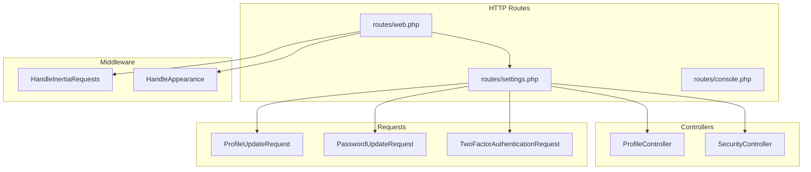
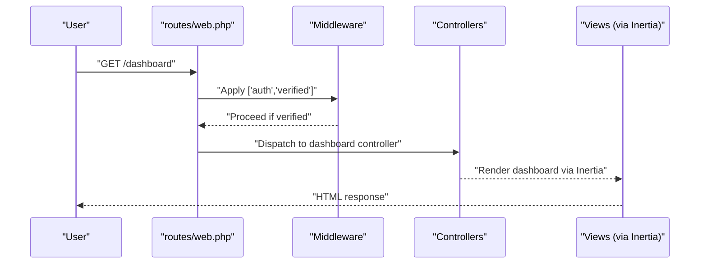
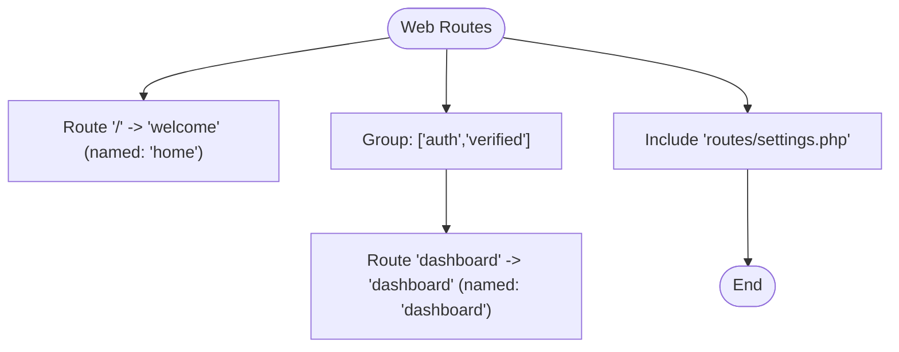
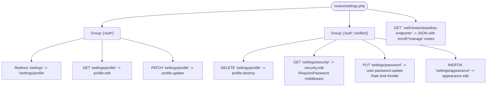
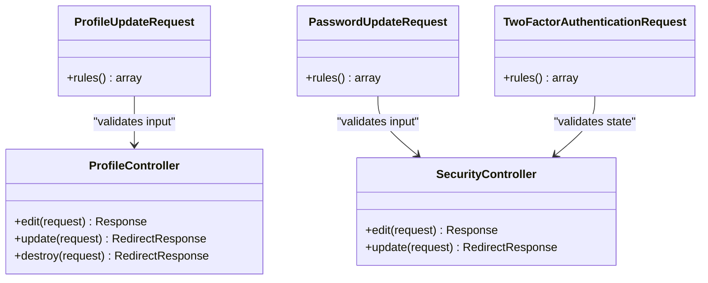
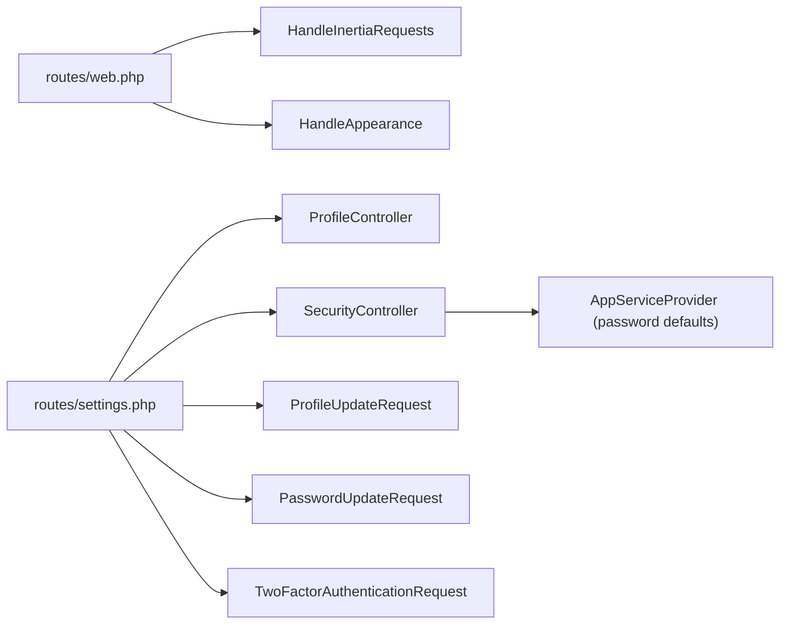

# Routing System

<cite>
**Referenced Files in This Document**
- [routes/web.php](file://routes/web.php)
- [routes/settings.php](file://routes/settings.php)
- [routes/console.php](file://routes/console.php)
- [app/Http/Middleware/HandleInertiaRequests.php](file://app/Http/Middleware/HandleInertiaRequests.php)
- [app/Http/Middleware/HandleAppearance.php](file://app/Http/Middleware/HandleAppearance.php)
- [app/Http/Controllers/Settings/ProfileController.php](file://app/Http/Controllers/Settings/ProfileController.php)
- [app/Http/Controllers/Settings/SecurityController.php](file://app/Http/Controllers/Settings/SecurityController.php)
- [app/Http/Requests/Settings/ProfileUpdateRequest.php](file://app/Http/Requests/Settings/ProfileUpdateRequest.php)
- [app/Http/Requests/Settings/PasswordUpdateRequest.php](file://app/Http/Requests/Settings/PasswordUpdateRequest.php)
- [app/Http/Requests/Settings/TwoFactorAuthenticationRequest.php](file://app/Http/Requests/Settings/TwoFactorAuthenticationRequest.php)
- [app/Concerns/ProfileValidationRules.php](file://app/Concerns/ProfileValidationRules.php)
- [app/Concerns/PasswordValidationRules.php](file://app/Concerns/PasswordValidationRules.php)
- [app/Providers/AppServiceProvider.php](file://app/Providers/AppServiceProvider.php)
</cite>

## Table of Contents
1. [Introduction](#introduction)
2. [Project Structure](#project-structure)
3. [Core Components](#core-components)
4. [Architecture Overview](#architecture-overview)
5. [Detailed Component Analysis](#detailed-component-analysis)
6. [Dependency Analysis](#dependency-analysis)
7. [Performance Considerations](#performance-considerations)
8. [Troubleshooting Guide](#troubleshooting-guide)
9. [Conclusion](#conclusion)

## Introduction
This document describes the routing system of the ScholarGraph Laravel application. It explains how web routes are organized, how settings-specific routes are separated and grouped, how middleware is applied, and how URL patterns are defined. It also covers route model binding and parameter handling, console command routing, route caching strategies, named routes, parameter validation, and security considerations integrated with access control.

## Project Structure
The routing system is split across three primary files:
- routes/web.php: Top-level web routes for home and dashboard, plus inclusion of settings routes.
- routes/settings.php: Settings routes grouped by authentication and verification requirements, including profile, security, appearance, and passkey endpoints.
- routes/console.php: Artisan console commands.

These route files define named routes and group endpoints by middleware stacks to enforce authentication and verification policies.

**Diagram sources**
- [routes/web.php:1-12](file://routes/web.php#L1-L12)
- [routes/settings.php:1-35](file://routes/settings.php#L1-L35)
- [routes/console.php:1-9](file://routes/console.php#L1-L9)
- [app/Http/Middleware/HandleInertiaRequests.php:1-48](file://app/Http/Middleware/HandleInertiaRequests.php#L1-L48)
- [app/Http/Middleware/HandleAppearance.php:1-24](file://app/Http/Middleware/HandleAppearance.php#L1-L24)
- [app/Http/Controllers/Settings/ProfileController.php:1-63](file://app/Http/Controllers/Settings/ProfileController.php#L1-L63)
- [app/Http/Controllers/Settings/SecurityController.php:1-67](file://app/Http/Controllers/Settings/SecurityController.php#L1-L67)
- [app/Http/Requests/Settings/ProfileUpdateRequest.php:1-23](file://app/Http/Requests/Settings/ProfileUpdateRequest.php#L1-L23)
- [app/Http/Requests/Settings/PasswordUpdateRequest.php:1-26](file://app/Http/Requests/Settings/PasswordUpdateRequest.php#L1-L26)
- [app/Http/Requests/Settings/TwoFactorAuthenticationRequest.php:1-23](file://app/Http/Requests/Settings/TwoFactorAuthenticationRequest.php#L1-L23)

**Section sources**
- [routes/web.php:1-12](file://routes/web.php#L1-L12)
- [routes/settings.php:1-35](file://routes/settings.php#L1-L35)
- [routes/console.php:1-9](file://routes/console.php#L1-L9)

## Core Components
- Web routes:
  - Home page with a named route.
  - Dashboard route guarded by authentication and email verification.
  - Settings routes included from a separate file.
- Settings routes:
  - Profile management (edit, update, delete) with layered middleware.
  - Security management (edit, password update) with throttling and password confirmation.
  - Appearance page rendered via Inertia.
  - Passkey discovery endpoint returning JSON with route references.
- Middleware:
  - Inertia root view and shared data.
  - Appearance cookie propagation to views.
- Controllers:
  - ProfileController: edit, update, destroy.
  - SecurityController: edit, update password.
- Form Requests:
  - ProfileUpdateRequest, PasswordUpdateRequest, TwoFactorAuthenticationRequest with validation rules.
- Provider:
  - Application defaults including password policy.

**Section sources**
- [routes/web.php:5-11](file://routes/web.php#L5-L11)
- [routes/settings.php:8-27](file://routes/settings.php#L8-L27)
- [app/Http/Middleware/HandleInertiaRequests.php:17-46](file://app/Http/Middleware/HandleInertiaRequests.php#L17-L46)
- [app/Http/Middleware/HandleAppearance.php:17-22](file://app/Http/Middleware/HandleAppearance.php#L17-L22)
- [app/Http/Controllers/Settings/ProfileController.php:20-61](file://app/Http/Controllers/Settings/ProfileController.php#L20-L61)
- [app/Http/Controllers/Settings/SecurityController.php:19-65](file://app/Http/Controllers/Settings/SecurityController.php#L19-L65)
- [app/Http/Requests/Settings/ProfileUpdateRequest.php:18-21](file://app/Http/Requests/Settings/ProfileUpdateRequest.php#L18-L21)
- [app/Http/Requests/Settings/PasswordUpdateRequest.php:18-24](file://app/Http/Requests/Settings/PasswordUpdateRequest.php#L18-L24)
- [app/Http/Requests/Settings/TwoFactorAuthenticationRequest.php:18-21](file://app/Http/Requests/Settings/TwoFactorAuthenticationRequest.php#L18-L21)
- [app/Providers/AppServiceProvider.php:40-48](file://app/Providers/AppServiceProvider.php#L40-L48)

## Architecture Overview
The routing architecture separates general application routes from settings routes. Authentication and verification middleware are applied at the route group level to ensure access control. Inertia middleware centralizes shared data and root template configuration. Settings routes leverage form requests for validation and controller actions for business logic.

**Diagram sources**
- [routes/web.php:7-9](file://routes/web.php#L7-L9)
- [app/Http/Middleware/HandleInertiaRequests.php:36-46](file://app/Http/Middleware/HandleInertiaRequests.php#L36-L46)

## Detailed Component Analysis

### Web Routes Organization
- Home route: Named route for the landing page.
- Dashboard route: Available only to authenticated and verified users.
- Settings inclusion: The settings routes file is included from the web routes file.

**Diagram sources**
- [routes/web.php:5-11](file://routes/web.php#L5-L11)

**Section sources**
- [routes/web.php:5-11](file://routes/web.php#L5-L11)

### Settings Routes Grouping and Middleware
- Unverified authenticated routes:
  - Redirect for legacy settings path.
  - Profile edit and update.
- Verified authenticated routes:
  - Profile deletion.
  - Security edit gated by password confirmation.
  - Password update with rate limiting.
  - Appearance page via Inertia.
  - Well-known passkey endpoints returning JSON with route references.

**Diagram sources**
- [routes/settings.php:8-27](file://routes/settings.php#L8-L27)
- [routes/settings.php:29-34](file://routes/settings.php#L29-L34)

**Section sources**
- [routes/settings.php:8-27](file://routes/settings.php#L8-L27)
- [routes/settings.php:29-34](file://routes/settings.php#L29-L34)

### Route Model Binding and Parameter Handling
- No explicit route model bindings are defined in the examined routes.
- Controllers accept validated parameters via Form Requests, ensuring typed and validated input.
- The application leverages implicit binding patterns commonly supported by Laravel; however, explicit binding is not present in the provided route files.

**Section sources**
- [app/Http/Controllers/Settings/ProfileController.php:31-44](file://app/Http/Controllers/Settings/ProfileController.php#L31-L44)
- [app/Http/Controllers/Settings/SecurityController.php:56-65](file://app/Http/Controllers/Settings/SecurityController.php#L56-L65)

### Named Routes and URL Patterns
- Named routes:
  - home, dashboard, profile.edit, profile.update, profile.destroy, security.edit, user-password.update, appearance.edit, well-known.passkeys.
- URL patterns:
  - Home: "/"
  - Dashboard: "dashboard"
  - Settings: "settings", "settings/profile", "settings/security", "settings/password", "settings/appearance"
  - Well-known passkey endpoints: ".well-known/passkey-endpoints"

**Section sources**
- [routes/web.php:5-11](file://routes/web.php#L5-L11)
- [routes/settings.php:9-27](file://routes/settings.php#L9-L27)
- [routes/settings.php:29-34](file://routes/settings.php#L29-L34)

### Parameter Validation and Access Control
- Profile update validation:
  - Uses ProfileUpdateRequest which applies name and email rules scoped to the current user.
- Password update validation:
  - Uses PasswordUpdateRequest which enforces current password and new password rules.
- Two-factor request:
  - Uses TwoFactorAuthenticationRequest which integrates with Fortify’s two-factor state handling.
- Access control:
  - Authentication enforced via middleware stacks.
  - Email verification required for dashboard and sensitive settings operations.
  - Password confirmation middleware for security-sensitive edits.
  - Rate limiting for password updates.

**Diagram sources**
- [app/Http/Requests/Settings/ProfileUpdateRequest.php:18-21](file://app/Http/Requests/Settings/ProfileUpdateRequest.php#L18-L21)
- [app/Http/Requests/Settings/PasswordUpdateRequest.php:18-24](file://app/Http/Requests/Settings/PasswordUpdateRequest.php#L18-L24)
- [app/Http/Requests/Settings/TwoFactorAuthenticationRequest.php:18-21](file://app/Http/Requests/Settings/TwoFactorAuthenticationRequest.php#L18-L21)
- [app/Http/Controllers/Settings/ProfileController.php:20-61](file://app/Http/Controllers/Settings/ProfileController.php#L20-L61)
- [app/Http/Controllers/Settings/SecurityController.php:19-65](file://app/Http/Controllers/Settings/SecurityController.php#L19-L65)

**Section sources**
- [app/Concerns/ProfileValidationRules.php:16-50](file://app/Concerns/ProfileValidationRules.php#L16-L50)
- [app/Concerns/PasswordValidationRules.php:15-28](file://app/Concerns/PasswordValidationRules.php#L15-L28)
- [app/Http/Controllers/Settings/ProfileController.php:31-44](file://app/Http/Controllers/Settings/ProfileController.php#L31-L44)
- [app/Http/Controllers/Settings/SecurityController.php:56-65](file://app/Http/Controllers/Settings/SecurityController.php#L56-L65)

### Console Command Routing
- A single Artisan command is registered with a purpose statement.
- This follows Laravel’s console routing pattern via Artisan facade.

**Section sources**
- [routes/console.php:6-8](file://routes/console.php#L6-L8)

### Route Caching Strategies
- Route caching is not explicitly configured in the examined files.
- To enable route caching, deploy-time steps would typically involve:
  - Pre-compiling assets and views.
  - Running the route cache command during deployment.
  - Ensuring all dynamic route generation is deterministic and idempotent.
- Considerations:
  - Keep route definitions static where possible.
  - Avoid runtime closures that capture state unless cached.
  - Validate cached routes after deployment.

[No sources needed since this section provides general guidance]

## Dependency Analysis
The routing layer depends on middleware for shared data and appearance handling, controllers for business logic, and form requests for validation. Settings routes depend on Fortify features for two-factor and passkey management.

**Diagram sources**
- [routes/web.php:5-11](file://routes/web.php#L5-L11)
- [routes/settings.php:8-27](file://routes/settings.php#L8-L27)
- [app/Http/Middleware/HandleInertiaRequests.php:17-46](file://app/Http/Middleware/HandleInertiaRequests.php#L17-L46)
- [app/Http/Middleware/HandleAppearance.php:17-22](file://app/Http/Middleware/HandleAppearance.php#L17-L22)
- [app/Http/Controllers/Settings/ProfileController.php:20-61](file://app/Http/Controllers/Settings/ProfileController.php#L20-L61)
- [app/Http/Controllers/Settings/SecurityController.php:19-65](file://app/Http/Controllers/Settings/SecurityController.php#L19-L65)
- [app/Http/Requests/Settings/ProfileUpdateRequest.php:18-21](file://app/Http/Requests/Settings/ProfileUpdateRequest.php#L18-L21)
- [app/Http/Requests/Settings/PasswordUpdateRequest.php:18-24](file://app/Http/Requests/Settings/PasswordUpdateRequest.php#L18-L24)
- [app/Http/Requests/Settings/TwoFactorAuthenticationRequest.php:18-21](file://app/Http/Requests/Settings/TwoFactorAuthenticationRequest.php#L18-L21)
- [app/Providers/AppServiceProvider.php:40-48](file://app/Providers/AppServiceProvider.php#L40-L48)

**Section sources**
- [routes/web.php:5-11](file://routes/web.php#L5-L11)
- [routes/settings.php:8-27](file://routes/settings.php#L8-L27)
- [app/Providers/AppServiceProvider.php:40-48](file://app/Providers/AppServiceProvider.php#L40-L48)

## Performance Considerations
- Prefer static route definitions for predictable performance.
- Use route model binding to reduce redundant lookups in controllers.
- Centralize shared data via middleware to avoid repeated computation.
- Apply rate limiting to sensitive endpoints (e.g., password updates) to prevent abuse.
- Consider enabling route caching in production deployments to reduce boot overhead.

[No sources needed since this section provides general guidance]

## Troubleshooting Guide
- Authentication failures:
  - Ensure the user is authenticated and email is verified for protected routes.
- Password confirmation errors:
  - Confirm that RequirePassword middleware is triggered for security edits.
- Validation failures:
  - Review Form Request rules and ensure client-side expectations align with server-side validation.
- Inertia rendering issues:
  - Verify the root template and shared data are configured in the Inertia middleware.
- Passkey endpoints:
  - Confirm the well-known endpoint returns correct route references.

**Section sources**
- [routes/settings.php:18-24](file://routes/settings.php#L18-L24)
- [app/Http/Middleware/HandleInertiaRequests.php:36-46](file://app/Http/Middleware/HandleInertiaRequests.php#L36-L46)
- [routes/settings.php:29-34](file://routes/settings.php#L29-L34)

## Conclusion
ScholarGraph’s routing system cleanly separates general application routes from settings-specific routes, applying appropriate middleware stacks to enforce authentication, verification, and security controls. Named routes and Inertia integration streamline frontend-backend communication, while form requests ensure robust parameter validation. For production, consider enabling route caching and reviewing middleware configuration to optimize performance and security.