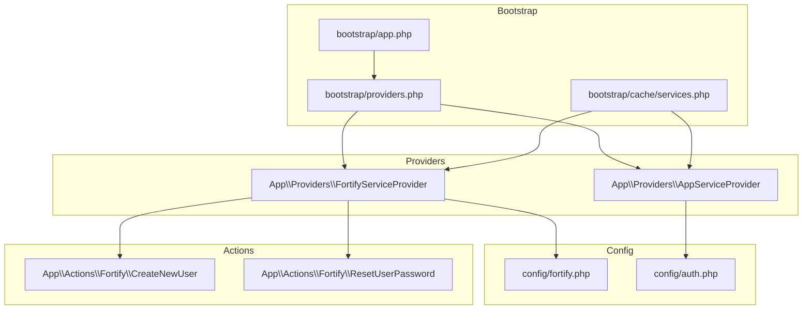
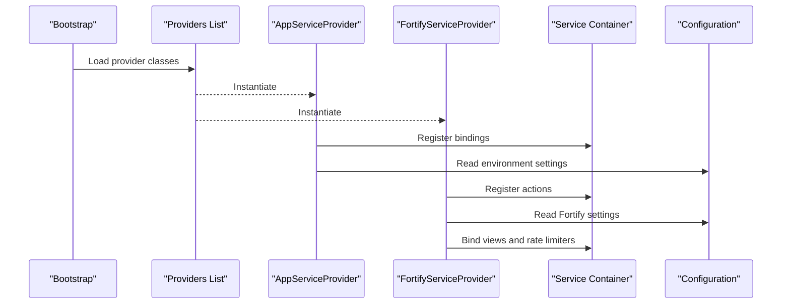
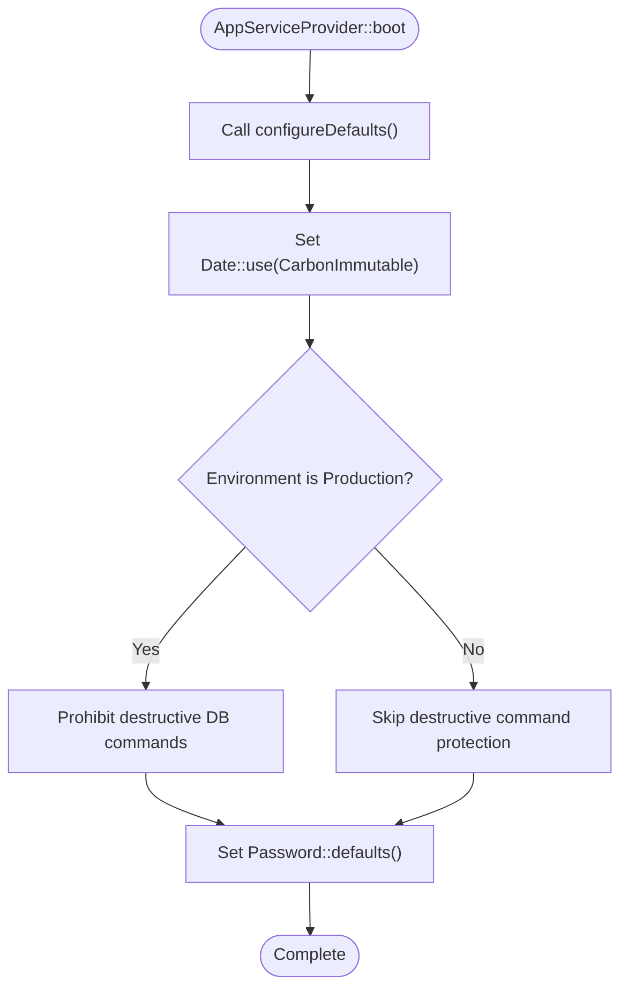
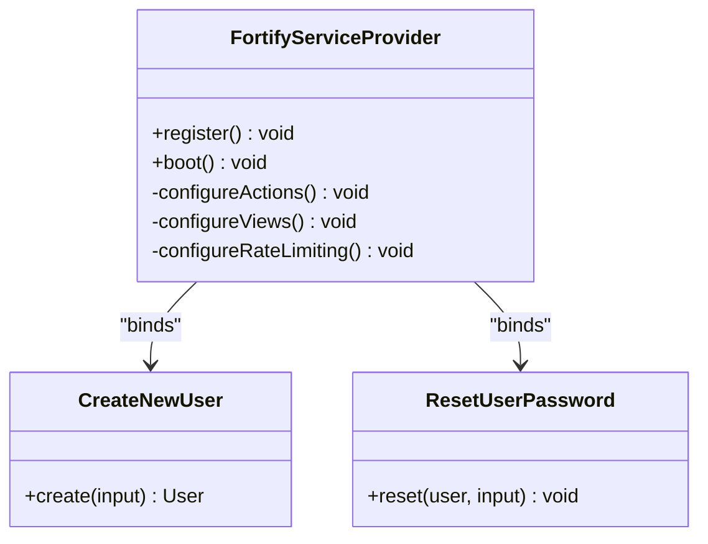
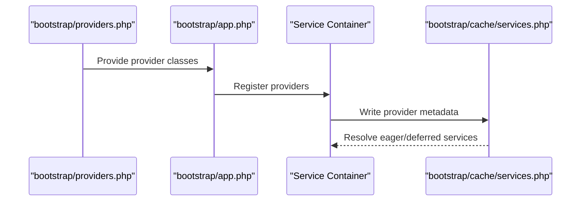
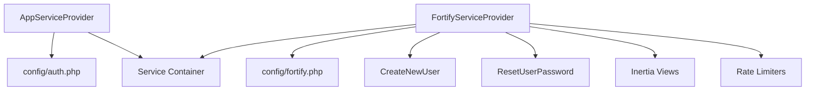

# Service Providers

<cite>
**Referenced Files in This Document**
- [AppServiceProvider.php](file://app/Providers/AppServiceProvider.php)
- [FortifyServiceProvider.php](file://app/Providers/FortifyServiceProvider.php)
- [providers.php](file://bootstrap/providers.php)
- [app.php](file://bootstrap/app.php)
- [services.php](file://bootstrap/cache/services.php)
- [fortify.php](file://config/fortify.php)
- [auth.php](file://config/auth.php)
- [CreateNewUser.php](file://app/Actions/Fortify/CreateNewUser.php)
- [ResetUserPassword.php](file://app/Actions/Fortify/ResetUserPassword.php)
- [PasswordValidationRules.php](file://app/Concerns/PasswordValidationRules.php)
- [ProfileValidationRules.php](file://app/Concerns/ProfileValidationRules.php)
</cite>

## Table of Contents
1. [Introduction](#introduction)
2. [Project Structure](#project-structure)
3. [Core Components](#core-components)
4. [Architecture Overview](#architecture-overview)
5. [Detailed Component Analysis](#detailed-component-analysis)
6. [Dependency Analysis](#dependency-analysis)
7. [Performance Considerations](#performance-considerations)
8. [Troubleshooting Guide](#troubleshooting-guide)
9. [Conclusion](#conclusion)

## Introduction
This document provides comprehensive service provider documentation for ScholarGraph's dependency injection system. It focuses on the AppServiceProvider for general application bindings and container management, and the FortifyServiceProvider for authentication service configuration, customization of Fortify actions, and extension of authentication features. The guide explains provider registration, the boot and register method usage, service binding patterns, and demonstrates how to create custom service providers, load configuration, apply environment-specific bindings, manage provider ordering, implement conditional registration, and debug provider-related issues.

## Project Structure
ScholarGraph organizes its service providers alongside the application's core functionality. Providers are registered through a centralized providers list and loaded by the framework during application bootstrap. Configuration files define Fortify behavior and authentication defaults, while action classes encapsulate authentication logic.

**Diagram sources**
- [providers.php:1-10](file://bootstrap/providers.php#L1-L10)
- [app.php:11-31](file://bootstrap/app.php#L11-L31)
- [services.php:25-76](file://bootstrap/cache/services.php#L25-L76)
- [AppServiceProvider.php:11-51](file://app/Providers/AppServiceProvider.php#L11-L51)
- [FortifyServiceProvider.php:17-101](file://app/Providers/FortifyServiceProvider.php#L17-L101)
- [fortify.php:1-178](file://config/fortify.php#L1-L178)
- [auth.php:1-118](file://config/auth.php#L1-L118)
- [CreateNewUser.php:11-34](file://app/Actions/Fortify/CreateNewUser.php#L11-L34)
- [ResetUserPassword.php:10-30](file://app/Actions/Fortify/ResetUserPassword.php#L10-L30)

**Section sources**
- [providers.php:1-10](file://bootstrap/providers.php#L1-L10)
- [app.php:11-31](file://bootstrap/app.php#L11-L31)
- [services.php:25-76](file://bootstrap/cache/services.php#L25-L76)

## Core Components
This section outlines the primary service providers and their roles in the application.

- AppServiceProvider
  - Purpose: General application bindings and container management.
  - Responsibilities:
    - Register application services in the register method.
    - Configure production-ready defaults in the boot method.
    - Apply immutable date handling, destructive command protection, and password validation defaults.

- FortifyServiceProvider
  - Purpose: Authentication service configuration and customization.
  - Responsibilities:
    - Register Fortify actions for user creation and password reset.
    - Customize authentication views for Inertia integration.
    - Configure rate limiting for login, two-factor, and passkeys.

**Section sources**
- [AppServiceProvider.php:11-51](file://app/Providers/AppServiceProvider.php#L11-L51)
- [FortifyServiceProvider.php:17-101](file://app/Providers/FortifyServiceProvider.php#L17-L101)

## Architecture Overview
The service provider architecture integrates with Laravel's container and configuration system. Providers are registered early in the bootstrap process and participate in both eager and deferred loading phases. Fortify actions and views are bound to the container and configured through provider boot logic, while configuration files define runtime behavior.

**Diagram sources**
- [providers.php:6-9](file://bootstrap/providers.php#L6-L9)
- [AppServiceProvider.php:16-27](file://app/Providers/AppServiceProvider.php#L16-L27)
- [FortifyServiceProvider.php:22-35](file://app/Providers/FortifyServiceProvider.php#L22-L35)
- [services.php:45-72](file://bootstrap/cache/services.php#L45-L72)

## Detailed Component Analysis

### AppServiceProvider
The AppServiceProvider manages general application bindings and environment-aware configurations. It ensures production-grade defaults for date handling, database safety, and password validation.

Key behaviors:
- Immutable date handling: Uses CarbonImmutable for predictable date/time operations.
- Destructive command protection: Prohibits destructive database commands in production environments.
- Password validation defaults: Enforces strict password rules in production and disables enforcement in development.

**Diagram sources**
- [AppServiceProvider.php:24-49](file://app/Providers/AppServiceProvider.php#L24-L49)

Implementation highlights:
- Date handling: Centralized through the Date facade to ensure consistent behavior across the application.
- Database safety: Conditional enforcement of destructive command prohibition based on environment detection.
- Password policy: Dynamic rule selection using environment checks to balance security and usability.

**Section sources**
- [AppServiceProvider.php:16-49](file://app/Providers/AppServiceProvider.php#L16-L49)

### FortifyServiceProvider
The FortifyServiceProvider customizes Laravel Fortify for ScholarGraph's authentication needs, integrating with Inertia for frontend rendering and applying rate limiting policies.

Key behaviors:
- Action registration: Binds custom actions for user creation and password reset.
- View customization: Provides Inertia-rendered views for login, registration, password reset, email verification, two-factor challenge, and password confirmation.
- Rate limiting: Defines limits for login attempts, two-factor challenges, and passkey operations.

**Diagram sources**
- [FortifyServiceProvider.php:17-101](file://app/Providers/FortifyServiceProvider.php#L17-L101)
- [CreateNewUser.php:11-34](file://app/Actions/Fortify/CreateNewUser.php#L11-L34)
- [ResetUserPassword.php:10-30](file://app/Actions/Fortify/ResetUserPassword.php#L10-L30)

Implementation highlights:
- Action binding: Uses Fortify::createUsersUsing and Fortify::resetUserPasswordsUsing to integrate custom actions.
- View integration: Renders Inertia pages for authentication flows, passing relevant state and configuration.
- Rate limiting: Implements per-minute limits keyed by user identity and IP to prevent abuse.

**Section sources**
- [FortifyServiceProvider.php:40-99](file://app/Providers/FortifyServiceProvider.php#L40-L99)
- [CreateNewUser.php:20-32](file://app/Actions/Fortify/CreateNewUser.php#L20-L32)
- [ResetUserPassword.php:19-28](file://app/Actions/Fortify/ResetUserPassword.php#L19-L28)

### Provider Registration and Ordering
Provider registration is handled through a centralized providers list and the application bootstrap configuration. The order of providers influences initialization sequence and availability of bindings.

- Registration process:
  - The providers list enumerates AppServiceProvider and FortifyServiceProvider.
  - The application bootstrap loads the providers list and instantiates providers.
  - The service container caches provider metadata, including eager loading and deferred services.

- Provider ordering:
  - AppServiceProvider is listed before FortifyServiceProvider, ensuring foundational services are available before authentication configuration.
  - The cached services list confirms the eager loading order, placing authentication and related providers early in the lifecycle.

**Diagram sources**
- [providers.php:6-9](file://bootstrap/providers.php#L6-L9)
- [app.php:11-31](file://bootstrap/app.php#L11-L31)
- [services.php:45-72](file://bootstrap/cache/services.php#L45-L72)

**Section sources**
- [providers.php:1-10](file://bootstrap/providers.php#L1-L10)
- [services.php:25-76](file://bootstrap/cache/services.php#L25-L76)

### Configuration Loading and Environment-Specific Bindings
Configuration files drive provider behavior and enable environment-specific bindings.

- Fortify configuration:
  - Defines guard, password broker, username/email fields, home redirect path, route prefix/domain, middleware, rate limiters, and enabled features.
  - Controls passkey settings including relying party ID, allowed origins, user handle secret, and timeout.

- Authentication configuration:
  - Sets default guard and password broker.
  - Defines user provider driver and model.
  - Configures password reset behavior including table, expiration, and throttle.

- Environment-specific bindings:
  - AppServiceProvider applies production-only protections and stricter password rules.
  - FortifyServiceProvider uses configuration values to tailor views and rate limiting.

**Section sources**
- [fortify.php:1-178](file://config/fortify.php#L1-L178)
- [auth.php:1-118](file://config/auth.php#L1-L118)
- [AppServiceProvider.php:32-49](file://app/Providers/AppServiceProvider.php#L32-L49)

### Custom Service Provider Creation
To create a custom service provider in ScholarGraph:

- Create a new provider class under app/Providers with register and boot methods.
- Implement provider registration logic in register and configuration in boot.
- Add the provider class to the providers list in bootstrap/providers.php.
- Optionally bind services to the container using $this->app->bind or singleton methods.
- Use configuration files to control environment-specific behavior.

Example patterns:
- Environment detection: Use app()->isProduction() to conditionally apply bindings.
- Configuration-driven: Read values from config files to influence provider behavior.
- Action integration: Bind custom actions to framework contracts for extensibility.

**Section sources**
- [providers.php:6-9](file://bootstrap/providers.php#L6-L9)
- [AppServiceProvider.php:16-27](file://app/Providers/AppServiceProvider.php#L16-L27)

### Conditional Registration and Debugging
Conditional registration allows providers to adapt to environment conditions and runtime state.

- Conditional registration:
  - Use environment checks to enable or disable specific bindings.
  - Leverage configuration values to toggle features or adjust behavior.
  - Apply defensive programming by protecting destructive operations in production.

- Debugging provider issues:
  - Verify provider registration in the cached services list.
  - Check configuration files for typos or missing keys.
  - Confirm that provider boot methods are executed by inspecting container bindings.
  - Use Laravel's debugging tools to trace service resolution and provider lifecycle.

**Section sources**
- [services.php:45-72](file://bootstrap/cache/services.php#L45-L72)
- [AppServiceProvider.php:36-49](file://app/Providers/AppServiceProvider.php#L36-L49)

## Dependency Analysis
This section examines the relationships between providers, configuration, and action classes.

**Diagram sources**
- [AppServiceProvider.php:32-49](file://app/Providers/AppServiceProvider.php#L32-L49)
- [FortifyServiceProvider.php:40-99](file://app/Providers/FortifyServiceProvider.php#L40-L99)
- [auth.php:18-21](file://config/auth.php#L18-L21)
- [fortify.php:17-31](file://config/fortify.php#L17-L31)
- [CreateNewUser.php:20-32](file://app/Actions/Fortify/CreateNewUser.php#L20-L32)
- [ResetUserPassword.php:19-28](file://app/Actions/Fortify/ResetUserPassword.php#L19-L28)

**Section sources**
- [AppServiceProvider.php:32-49](file://app/Providers/AppServiceProvider.php#L32-L49)
- [FortifyServiceProvider.php:40-99](file://app/Providers/FortifyServiceProvider.php#L40-L99)

## Performance Considerations
- Provider boot cost: Minimize heavy operations in provider boot methods to reduce application startup time.
- Configuration caching: Use cached configuration values to avoid repeated reads during provider initialization.
- Rate limiting: Tune rate limiter thresholds to balance security and user experience.
- Environment checks: Perform environment checks once per provider lifecycle to avoid redundant evaluations.

## Troubleshooting Guide
Common issues and resolutions:

- Provider not registering:
  - Verify the provider class is included in bootstrap/providers.php.
  - Check the cached services list for eager loading entries.

- Authentication failures:
  - Review Fortify configuration for correct guard and password broker settings.
  - Ensure custom actions implement the required contracts.

- Password validation errors:
  - Confirm environment-specific password rules align with user expectations.
  - Validate that configuration values are correctly loaded.

- Rate limiting problems:
  - Adjust rate limiter keys and thresholds in FortifyServiceProvider.
  - Verify IP and user identification logic for uniqueness.

**Section sources**
- [providers.php:6-9](file://bootstrap/providers.php#L6-L9)
- [services.php:45-72](file://bootstrap/cache/services.php#L45-L72)
- [fortify.php:117-121](file://config/fortify.php#L117-L121)

## Conclusion
ScholarGraph's service provider system provides a robust foundation for application configuration and authentication customization. The AppServiceProvider establishes environment-aware defaults, while the FortifyServiceProvider integrates authentication actions, views, and rate limiting. Proper provider registration, configuration loading, and environment-specific bindings ensure a secure and maintainable authentication experience. Following the patterns outlined here enables developers to extend the system with custom providers and tailored authentication logic.