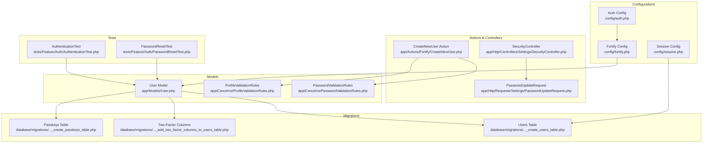
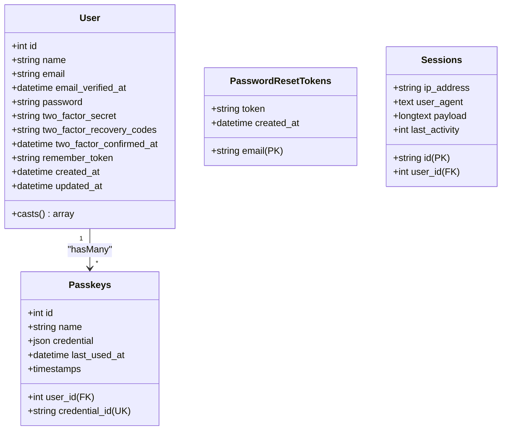
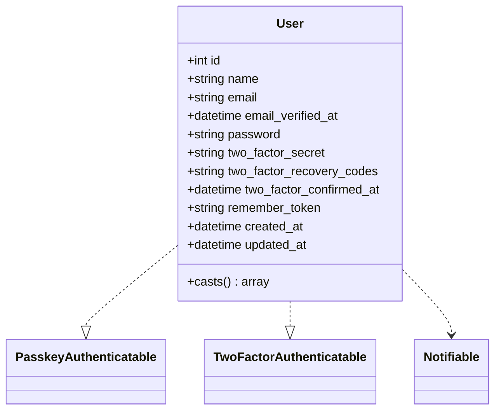
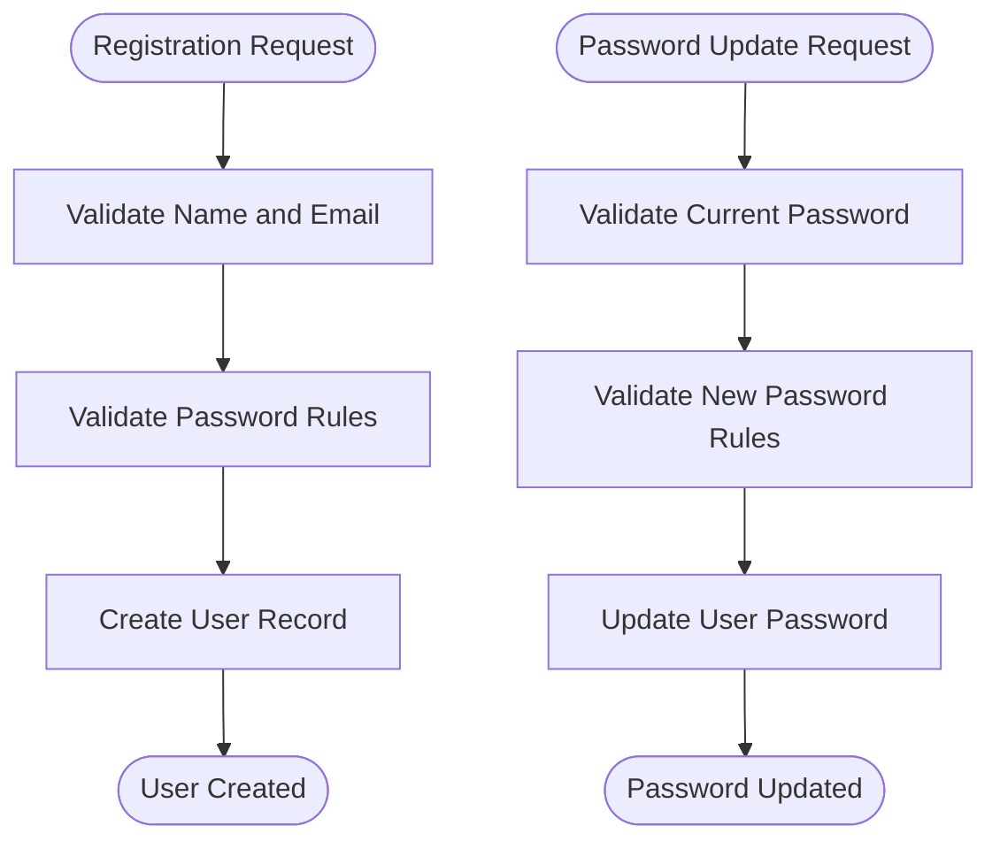
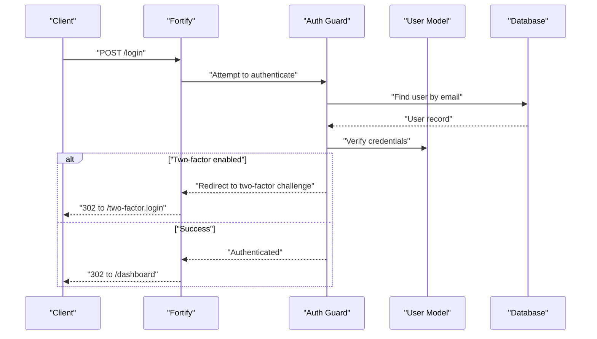
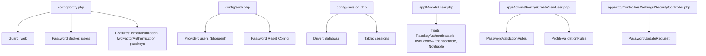

# Core Data Models

<cite>
**Referenced Files in This Document**
- [User.php](file://app/Models/User.php)
- [UserFactory.php](file://database/factories/UserFactory.php)
- [create_users_table.php](file://database/migrations/0001_01_01_000000_create_users_table.php)
- [add_two_factor_columns_to_users_table.php](file://database/migrations/2025_08_14_170933_add_two_factor_columns_to_users_table.php)
- [create_passkeys_table.php](file://database/migrations/2024_01_01_000000_create_passkeys_table.php)
- [auth.php](file://config/auth.php)
- [fortify.php](file://config/fortify.php)
- [session.php](file://config/session.php)
- [PasswordValidationRules.php](file://app/Concerns/PasswordValidationRules.php)
- [ProfileValidationRules.php](file://app/Concerns/ProfileValidationRules.php)
- [CreateNewUser.php](file://app/Actions/Fortify/CreateNewUser.php)
- [PasswordUpdateRequest.php](file://app/Http/Requests/Settings/PasswordUpdateRequest.php)
- [SecurityController.php](file://app/Http/Controllers/Settings/SecurityController.php)
- [AuthenticationTest.php](file://tests/Feature/Auth/AuthenticationTest.php)
- [PasswordResetTest.php](file://tests/Feature/Auth/PasswordResetTest.php)
</cite>

## Table of Contents
1. [Introduction](#introduction)
2. [Project Structure](#project-structure)
3. [Core Components](#core-components)
4. [Architecture Overview](#architecture-overview)
5. [Detailed Component Analysis](#detailed-component-analysis)
6. [Dependency Analysis](#dependency-analysis)
7. [Performance Considerations](#performance-considerations)
8. [Troubleshooting Guide](#troubleshooting-guide)
9. [Conclusion](#conclusion)

## Introduction
This document provides comprehensive data model documentation for ScholarGraph's core entities, focusing on the User model and related authentication infrastructure. It covers the user table schema, password reset tokens, sessions, factory patterns for testing, and security considerations. It also explains authentication flows, session management, and validation rules implemented through Laravel and Laravel Fortify.

## Project Structure
The authentication and data model components are organized across models, migrations, configurations, actions, requests, controllers, concerns, and tests. The primary focus is on:
- User model with enhanced authentication traits
- Users table with email verification and remember tokens
- Password reset tokens table for secure password recovery
- Sessions table for user session tracking
- Passkeys table for WebAuthn-based authentication
- Configuration for authentication guards, providers, and rate limiting
- Factory patterns for testing and seeding
- Validation rules and controller flows for security settings

**Diagram sources**
- [User.php:1-51](file://app/Models/User.php#L1-L51)
- [create_users_table.php:1-50](file://database/migrations/0001_01_01_000000_create_users_table.php#L1-L50)
- [add_two_factor_columns_to_users_table.php:1-35](file://database/migrations/2025_08_14_170933_add_two_factor_columns_to_users_table.php#L1-L35)
- [create_passkeys_table.php:1-35](file://database/migrations/2024_01_01_000000_create_passkeys_table.php#L1-L35)
- [auth.php:1-118](file://config/auth.php#L1-L118)
- [fortify.php:1-178](file://config/fortify.php#L1-L178)
- [session.php:1-234](file://config/session.php#L1-L234)
- [CreateNewUser.php:1-34](file://app/Actions/Fortify/CreateNewUser.php#L1-L34)
- [PasswordUpdateRequest.php:1-26](file://app/Http/Requests/Settings/PasswordUpdateRequest.php#L1-L26)
- [SecurityController.php:1-67](file://app/Http/Controllers/Settings/SecurityController.php#L1-L67)
- [AuthenticationTest.php:1-77](file://tests/Feature/Auth/AuthenticationTest.php#L1-L77)
- [PasswordResetTest.php:1-78](file://tests/Feature/Auth/PasswordResetTest.php#L1-L78)

**Section sources**
- [User.php:1-51](file://app/Models/User.php#L1-L51)
- [create_users_table.php:1-50](file://database/migrations/0001_01_01_000000_create_users_table.php#L1-L50)
- [auth.php:1-118](file://config/auth.php#L1-L118)
- [fortify.php:1-178](file://config/fortify.php#L1-L178)
- [session.php:1-234](file://config/session.php#L1-L234)

## Core Components
This section documents the core data models and related components that implement user authentication, session management, and password recovery.

- User Model
  - Purpose: Central entity representing authenticated users with enhanced authentication capabilities.
  - Traits and Interfaces: Implements authentication, notifications, passkey authentication, and two-factor authentication.
  - Fillable Fields: name, email, password.
  - Hidden Fields: password, two-factor secret, two-factor recovery codes, remember token.
  - Casts: email_verified_at, password, two_factor_confirmed_at as datetime-like types.
  - Relationships: Associated with passkeys via a foreign key relationship.

- Users Table Schema
  - Fields: id (auto-increment), name (string), email (unique string), email_verified_at (nullable timestamp), password (string), remember_token (string), timestamps (created_at, updated_at).
  - Constraints: Unique constraint on email; rememberToken() adds a standardized remember-me token column.

- Password Reset Tokens Table
  - Fields: email (primary key), token (string), created_at (nullable timestamp).
  - Purpose: Stores tokens for secure password reset workflows.

- Sessions Table
  - Fields: id (primary key), user_id (nullable foreign id, indexed), ip_address (string up to 45 chars, nullable), user_agent (text, nullable), payload (long text), last_activity (integer, indexed).
  - Purpose: Tracks user sessions when using database session driver.

- Passkeys Table
  - Fields: id (auto-increment), user_id (foreign key with cascade delete), name (string), credential_id (unique string), credential (JSON), last_used_at (nullable timestamp), timestamps.
  - Purpose: Stores WebAuthn passkey credentials linked to users.

- Two-Factor Authentication Columns
  - Added to users table: two_factor_secret (nullable text), two_factor_recovery_codes (nullable text), two_factor_confirmed_at (nullable timestamp).
  - Purpose: Enable TOTP-based two-factor authentication with recovery codes.

- Validation Rules
  - PasswordValidationRules: Provides password strength rules and current password confirmation rules.
  - ProfileValidationRules: Provides rules for validating name and email uniqueness.

- Factory Patterns
  - UserFactory: Generates default user states, supports unverified emails, and enables two-factor configurations for testing.

**Section sources**
- [User.php:17-50](file://app/Models/User.php#L17-L50)
- [create_users_table.php:14-37](file://database/migrations/0001_01_01_000000_create_users_table.php#L14-L37)
- [add_two_factor_columns_to_users_table.php:14-18](file://database/migrations/2025_08_14_170933_add_two_factor_columns_to_users_table.php#L14-L18)
- [create_passkeys_table.php:14-24](file://database/migrations/2024_01_01_000000_create_passkeys_table.php#L14-L24)
- [PasswordValidationRules.php:8-29](file://app/Concerns/PasswordValidationRules.php#L8-L29)
- [ProfileValidationRules.php:9-50](file://app/Concerns/ProfileValidationRules.php#L9-L50)
- [UserFactory.php:25-60](file://database/factories/UserFactory.php#L25-L60)

## Architecture Overview
The authentication architecture integrates Laravel's Eloquent ORM, Laravel Fortify, and database-backed session storage. The User model leverages traits for passkey and two-factor authentication, while configuration files define guards, providers, rate limiting, and password reset behavior. Tests validate authentication flows and password reset mechanisms.

**Diagram sources**
- [User.php:18-29](file://app/Models/User.php#L18-L29)
- [create_users_table.php:14-37](file://database/migrations/0001_01_01_000000_create_users_table.php#L14-L37)
- [create_passkeys_table.php:14-24](file://database/migrations/2024_01_01_000000_create_passkeys_table.php#L14-L24)

**Section sources**
- [User.php:32-50](file://app/Models/User.php#L32-L50)
- [create_users_table.php:14-37](file://database/migrations/0001_01_01_000000_create_users_table.php#L14-L37)
- [create_passkeys_table.php:14-24](file://database/migrations/2024_01_01_000000_create_passkeys_table.php#L14-L24)

## Detailed Component Analysis

### User Model
The User model extends the framework's Authenticatable class and incorporates traits for notifications, passkey authentication, and two-factor authentication. It defines fillable and hidden attributes and applies type casting for specific fields.

Key characteristics:
- Enhanced authentication: Implements PasskeyUser interface and uses PasskeyAuthenticatable and TwoFactorAuthenticatable traits.
- Data protection: Hides sensitive fields (password, two-factor secrets, recovery codes, remember token) from serialization.
- Type safety: Uses Carbon for datetime-like casts.

**Diagram sources**
- [User.php:32-50](file://app/Models/User.php#L32-L50)

**Section sources**
- [User.php:17-50](file://app/Models/User.php#L17-L50)

### Users Table Schema
The users table includes standard authentication fields and timestamps. It enforces email uniqueness and supports email verification and remember-me functionality.

Field definitions:
- id: Auto-incrementing primary key.
- name: String, required.
- email: String, unique, required.
- email_verified_at: Timestamp, nullable.
- password: String, hashed.
- remember_token: String.
- timestamps: created_at and updated_at.

Constraints and indexes:
- Unique index on email.
- Remember token support via rememberToken().
- Timestamps automatically managed by Eloquent.

**Section sources**
- [create_users_table.php:14-22](file://database/migrations/0001_01_01_000000_create_users_table.php#L14-L22)

### Password Reset Tokens Table
This table supports secure password reset workflows by associating reset tokens with user emails.

Field definitions:
- email: Primary key, string.
- token: String.
- created_at: Timestamp, nullable.

Behavior:
- Used by Laravel's password reset mechanism to validate token expiration and uniqueness per email.

**Section sources**
- [create_users_table.php:24-28](file://database/migrations/0001_01_01_000000_create_users_table.php#L24-L28)
- [auth.php:95-102](file://config/auth.php#L95-L102)

### Sessions Table
Sessions are persisted to the database when the session driver is set to database. This enables scalable session storage and cross-server compatibility.

Field definitions:
- id: Primary key, string.
- user_id: Foreign key to users, nullable, indexed.
- ip_address: String up to 45 characters, nullable.
- user_agent: Text, nullable.
- payload: Long text containing serialized session data.
- last_activity: Integer index for session sweeping.

Configuration:
- Session driver, table name, and lifetime are configurable via session.php.

**Section sources**
- [create_users_table.php:30-37](file://database/migrations/0001_01_01_000000_create_users_table.php#L30-L37)
- [session.php:21-89](file://config/session.php#L21-L89)

### Passkeys Table
Passkeys enable passwordless authentication using WebAuthn. Each passkey is associated with a user and stores credential metadata.

Field definitions:
- id: Auto-incrementing primary key.
- user_id: Foreign key to users with cascade delete.
- name: String identifier for the passkey.
- credential_id: Unique string identifier for the credential.
- credential: JSON storing WebAuthn credential data.
- last_used_at: Timestamp, nullable.
- timestamps: created_at and updated_at.

Indexes:
- Index on user_id for efficient lookups.

**Section sources**
- [create_passkeys_table.php:14-24](file://database/migrations/2024_01_01_000000_create_passkeys_table.php#L14-L24)
- [User.php:32-35](file://app/Models/User.php#L32-L35)

### Two-Factor Authentication Columns
Two-factor authentication is supported with dedicated columns on the users table.

Columns:
- two_factor_secret: Nullable text for TOTP secret.
- two_factor_recovery_codes: Nullable text for recovery codes.
- two_factor_confirmed_at: Nullable timestamp indicating confirmation.

Factory support:
- UserFactory provides a withTwoFactor() state to populate these fields for testing.

**Section sources**
- [add_two_factor_columns_to_users_table.php:14-18](file://database/migrations/2025_08_14_170933_add_two_factor_columns_to_users_table.php#L14-L18)
- [UserFactory.php:52-59](file://database/factories/UserFactory.php#L52-L59)

### Validation Rules and Requests
Password and profile validation rules are encapsulated in reusable traits and applied in form requests and creation actions.

- PasswordValidationRules: Defines strong password requirements and current password confirmation rules.
- ProfileValidationRules: Enforces name length and email format/uniqueness rules.
- PasswordUpdateRequest: Applies validation rules for updating a user's password.
- CreateNewUser: Validates registration input using combined profile and password rules.

**Diagram sources**
- [CreateNewUser.php:20-32](file://app/Actions/Fortify/CreateNewUser.php#L20-L32)
- [PasswordUpdateRequest.php:18-24](file://app/Http/Requests/Settings/PasswordUpdateRequest.php#L18-L24)
- [PasswordValidationRules.php:15-28](file://app/Concerns/PasswordValidationRules.php#L15-L28)
- [ProfileValidationRules.php:16-50](file://app/Concerns/ProfileValidationRules.php#L16-L50)

**Section sources**
- [PasswordValidationRules.php:8-29](file://app/Concerns/PasswordValidationRules.php#L8-L29)
- [ProfileValidationRules.php:9-50](file://app/Concerns/ProfileValidationRules.php#L9-L50)
- [PasswordUpdateRequest.php:9-26](file://app/Http/Requests/Settings/PasswordUpdateRequest.php#L9-L26)
- [CreateNewUser.php:11-34](file://app/Actions/Fortify/CreateNewUser.php#L11-L34)

### Authentication Flows and Security Considerations
Authentication flows leverage Laravel Fortify features and Laravel's built-in mechanisms.

- Login Flow
  - Renders login screen and authenticates users via the web guard.
  - Redirects authenticated users to the dashboard.
  - Two-factor enabled users are redirected to a two-factor challenge and session is preserved via login.id.

- Logout Flow
  - Clears the current session and redirects to home.

- Password Reset Flow
  - Renders reset link request and sends ResetPassword notification.
  - Validates token and updates user password, redirecting to login.

- Rate Limiting
  - Fortify applies rate limiting to login attempts per email/IP combination.

- Session Management
  - Database session driver persists sessions with indexes for efficient cleanup.
  - Session lifetime and cookie policies are configurable.

**Diagram sources**
- [AuthenticationTest.php:13-43](file://tests/Feature/Auth/AuthenticationTest.php#L13-L43)
- [fortify.php:117-121](file://config/fortify.php#L117-L121)
- [auth.php:40-45](file://config/auth.php#L40-L45)

**Section sources**
- [AuthenticationTest.php:13-77](file://tests/Feature/Auth/AuthenticationTest.php#L13-L77)
- [PasswordResetTest.php:12-78](file://tests/Feature/Auth/PasswordResetTest.php#L12-L78)
- [session.php:21-89](file://config/session.php#L21-L89)

### Factory Patterns for Testing and Seeding
Factories streamline testing and seeding by generating realistic user data.

- UserFactory
  - Default state includes verified email, hashed password, remember token, and null two-factor fields.
  - States:
    - unverified(): Sets email_verified_at to null.
    - withTwoFactor(): Populates two_factor_secret, two_factor_recovery_codes, and two_factor_confirmed_at.

- Seeding Strategy
  - Use factories to create users with varying states (verified, unverified, two-factor enabled) for comprehensive testing.

**Section sources**
- [UserFactory.php:25-60](file://database/factories/UserFactory.php#L25-L60)

## Dependency Analysis
The following diagram illustrates dependencies among key components involved in authentication and session management.

**Diagram sources**
- [fortify.php:18-31](file://config/fortify.php#L18-L31)
- [fortify.php:163-175](file://config/fortify.php#L163-L175)
- [auth.php:40-74](file://config/auth.php#L40-L74)
- [auth.php:95-102](file://config/auth.php#L95-L102)
- [session.php:21-89](file://config/session.php#L21-L89)
- [User.php:32-35](file://app/Models/User.php#L32-L35)
- [CreateNewUser.php:13](file://app/Actions/Fortify/CreateNewUser.php#L13)
- [SecurityController.php:6](file://app/Http/Controllers/Settings/SecurityController.php#L6)

**Section sources**
- [fortify.php:1-178](file://config/fortify.php#L1-L178)
- [auth.php:1-118](file://config/auth.php#L1-L118)
- [session.php:1-234](file://config/session.php#L1-L234)
- [User.php:32-35](file://app/Models/User.php#L32-L35)
- [CreateNewUser.php:11-34](file://app/Actions/Fortify/CreateNewUser.php#L11-L34)
- [SecurityController.php:14-67](file://app/Http/Controllers/Settings/SecurityController.php#L14-L67)

## Performance Considerations
- Session Storage: Using database sessions improves scalability across multiple servers but requires proper indexing on user_id and last_activity for efficient cleanup and retrieval.
- Indexes: Ensure indexes exist on frequently queried columns such as user_id in sessions and passkeys tables, and on email in users for authentication lookups.
- Password Hashing: Laravel hashes passwords by default; avoid unnecessary re-hashing and rely on framework defaults.
- Rate Limiting: Fortify's rate limiters protect against brute-force attacks; tune limits according to deployment needs.
- Two-Factor and Passkeys: Storing encrypted two-factor secrets and passkey credentials is acceptable; ensure backups and rotation policies are in place.

## Troubleshooting Guide
Common issues and resolutions:
- Authentication fails with invalid credentials
  - Verify email and password match records; check rate limiting thresholds.
  - Reference: [AuthenticationTest.php:45-54](file://tests/Feature/Auth/AuthenticationTest.php#L45-L54)

- Two-factor redirect loop
  - Ensure two-factor columns are present and user has confirmed two-factor; verify session preservation of login.id.
  - Reference: [AuthenticationTest.php:25-43](file://tests/Feature/Auth/AuthenticationTest.php#L25-L43)

- Password reset token invalid
  - Confirm token exists in password_reset_tokens and is not expired; ensure email matches the token recipient.
  - Reference: [PasswordResetTest.php:67-78](file://tests/Feature/Auth/PasswordResetTest.php#L67-L78)

- Session not persisting across requests
  - Confirm session driver is set to database and sessions table is migrated; verify cookie settings and lifetime.
  - Reference: [session.php:21-89](file://config/session.php#L21-L89)

- Password update validation errors
  - Ensure current password matches and new password satisfies strength rules.
  - Reference: [PasswordUpdateRequest.php:18-24](file://app/Http/Requests/Settings/PasswordUpdateRequest.php#L18-L24)

**Section sources**
- [AuthenticationTest.php:45-77](file://tests/Feature/Auth/AuthenticationTest.php#L45-L77)
- [PasswordResetTest.php:67-78](file://tests/Feature/Auth/PasswordResetTest.php#L67-L78)
- [session.php:21-89](file://config/session.php#L21-L89)
- [PasswordUpdateRequest.php:18-24](file://app/Http/Requests/Settings/PasswordUpdateRequest.php#L18-L24)

## Conclusion
ScholarGraph's authentication system is built on robust Laravel patterns with clear separation of concerns. The User model, combined with database-backed sessions, password reset tokens, and passkeys, provides a secure foundation for user management. Configuration files centralize guard, provider, and rate-limiting settings, while factories and tests ensure reliable development and maintenance. Adhering to the documented schemas, validation rules, and security considerations will help maintain a resilient and scalable authentication layer.