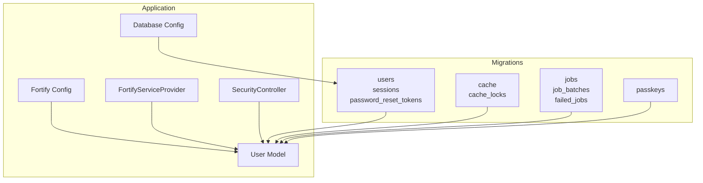
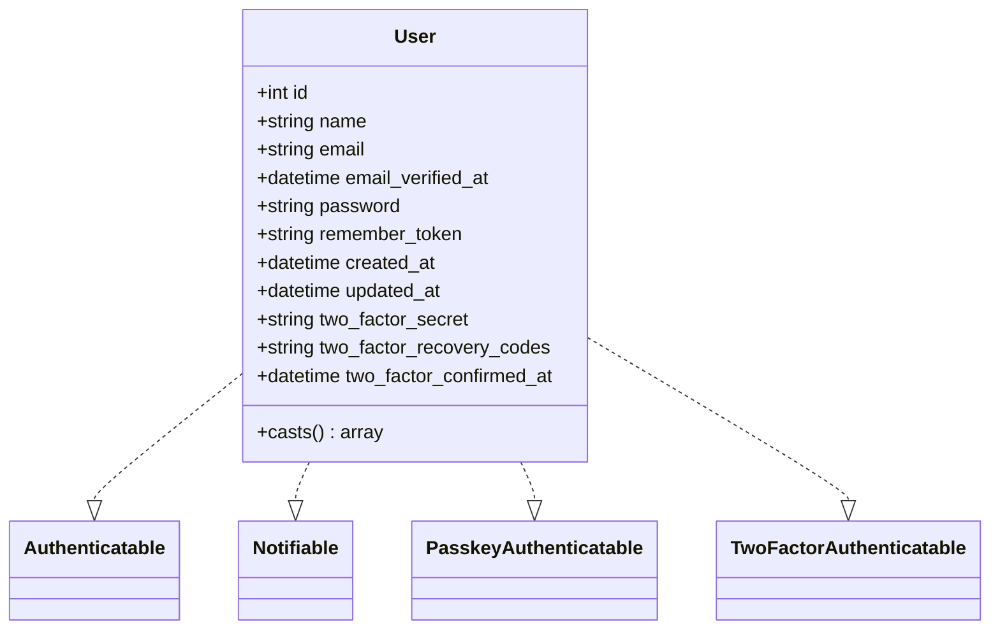
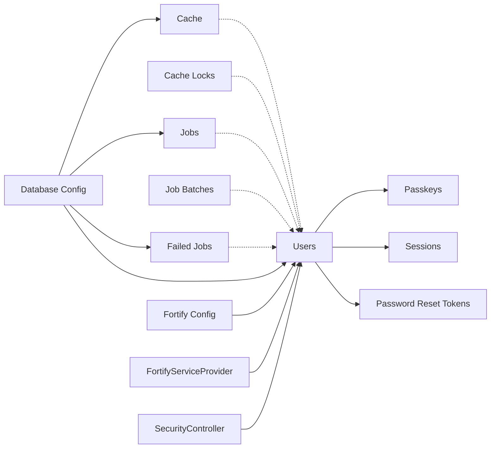

# Data Models & Database Schema

<cite>
**Referenced Files in This Document**
- [0001_01_01_000000_create_users_table.php](file://database/migrations/0001_01_01_000000_create_users_table.php)
- [2025_08_14_170933_add_two_factor_columns_to_users_table.php](file://database/migrations/2025_08_14_170933_add_two_factor_columns_to_users_table.php)
- [0001_01_01_000001_create_cache_table.php](file://database/migrations/0001_01_01_000001_create_cache_table.php)
- [0001_01_01_000002_create_jobs_table.php](file://database/migrations/0001_01_01_000002_create_jobs_table.php)
- [2024_01_01_000000_create_passkeys_table.php](file://database/migrations/2024_01_01_000000_create_passkeys_table.php)
- [User.php](file://app/Models/User.php)
- [UserFactory.php](file://database/factories/UserFactory.php)
- [database.php](file://config/database.php)
- [fortify.php](file://config/fortify.php)
- [FortifyServiceProvider.php](file://app/Providers/FortifyServiceProvider.php)
- [SecurityController.php](file://app/Http/Controllers/Settings/SecurityController.php)
- [auth.ts](file://resources/js/types/auth.ts)
</cite>

## Table of Contents
1. [Introduction](#introduction)
2. [Project Structure](#project-structure)
3. [Core Components](#core-components)
4. [Architecture Overview](#architecture-overview)
5. [Detailed Component Analysis](#detailed-component-analysis)
6. [Dependency Analysis](#dependency-analysis)
7. [Performance Considerations](#performance-considerations)
8. [Troubleshooting Guide](#troubleshooting-guide)
9. [Conclusion](#conclusion)
10. [Appendices](#appendices)

## Introduction
This document provides comprehensive data model documentation for ScholarGraph’s database schema. It focuses on the User model with enhanced authentication traits, the passkeys table supporting WebAuthn-style passkeys, and auxiliary tables for caching and job processing. It explains entity relationships, field definitions, data types, constraints, indexes, and performance considerations. It also documents data validation rules, business logic, data lifecycle management, and security and privacy controls aligned with the application’s Fortify-based authentication stack.

## Project Structure
The database schema is defined by a series of Laravel migrations and is consumed by the Eloquent User model and supporting configuration. The relevant components are organized as follows:
- Migrations define the canonical schema for users, sessions, password reset tokens, cache, cache locks, jobs, job batches, failed jobs, and passkeys.
- The User model integrates Fortify traits for two-factor authentication and passkey support, with attribute casting and hidden fields.
- Configuration files define database connections, Fortify features, and rate limiters.
- Controllers and frontend types reflect the runtime behavior and data shapes used by the application.



**Diagram sources**
- [0001_01_01_000000_create_users_table.php:14-37](file://database/migrations/0001_01_01_000000_create_users_table.php#L14-L37)
- [0001_01_01_000001_create_cache_table.php:14-24](file://database/migrations/0001_01_01_000001_create_cache_table.php#L14-L24)
- [0001_01_01_000002_create_jobs_table.php:14-47](file://database/migrations/0001_01_01_000002_create_jobs_table.php#L14-L47)
- [2024_01_01_000000_create_passkeys_table.php:14-24](file://database/migrations/2024_01_01_000000_create_passkeys_table.php#L14-L24)
- [User.php:32-35](file://app/Models/User.php#L32-L35)
- [database.php:20-115](file://config/database.php#L20-L115)
- [fortify.php:163-175](file://config/fortify.php#L163-L175)
- [FortifyServiceProvider.php:82-99](file://app/Providers/FortifyServiceProvider.php#L82-L99)
- [SecurityController.php:19-43](file://app/Http/Controllers/Settings/SecurityController.php#L19-L43)

**Section sources**
- [0001_01_01_000000_create_users_table.php:1-50](file://database/migrations/0001_01_01_000000_create_users_table.php#L1-L50)
- [0001_01_01_000001_create_cache_table.php:1-36](file://database/migrations/0001_01_01_000001_create_cache_table.php#L1-L36)
- [0001_01_01_000002_create_jobs_table.php:1-60](file://database/migrations/0001_01_01_000002_create_jobs_table.php#L1-L60)
- [2024_01_01_000000_create_passkeys_table.php:1-35](file://database/migrations/2024_01_01_000000_create_passkeys_table.php#L1-L35)
- [User.php:1-51](file://app/Models/User.php#L1-L51)
- [database.php:1-185](file://config/database.php#L1-L185)
- [fortify.php:1-178](file://config/fortify.php#L1-L178)
- [FortifyServiceProvider.php:1-100](file://app/Providers/FortifyServiceProvider.php#L1-L100)
- [SecurityController.php:1-44](file://app/Http/Controllers/Settings/SecurityController.php#L1-L44)

## Core Components
This section documents the principal data entities and their roles in the system.

- Users
  - Purpose: Stores user account credentials, profile metadata, and authentication-related state.
  - Enhanced authentication: Two-factor authentication fields and passkey associations.
  - Relationships: One-to-many with passkeys; indirectly referenced by sessions and password reset tokens.

- Passkeys
  - Purpose: Stores WebAuthn-style passkey credentials linked to a user.
  - Relationships: Belongs to users via foreign key with cascade-on-delete.

- Cache and Cache Locks
  - Purpose: Provides key-value caching and distributed locking primitives.
  - Indexes: Primary keys plus expiration index on cache; primary and owner keys on cache locks.

- Jobs, Job Batches, and Failed Jobs
  - Purpose: Asynchronous job processing infrastructure with batch tracking and failure records.
  - Indexes: Queue index on jobs; composite index on failed jobs for connection/queue/failed_at.

- Sessions and Password Reset Tokens
  - Purpose: Session management and password reset token lifecycle.
  - Indexes: user_id index on sessions; primary key on password_reset_tokens.

**Section sources**
- [0001_01_01_000000_create_users_table.php:14-37](file://database/migrations/0001_01_01_000000_create_users_table.php#L14-L37)
- [2024_01_01_000000_create_passkeys_table.php:14-24](file://database/migrations/2024_01_01_000000_create_passkeys_table.php#L14-L24)
- [0001_01_01_000001_create_cache_table.php:14-24](file://database/migrations/0001_01_01_000001_create_cache_table.php#L14-L24)
- [0001_01_01_000002_create_jobs_table.php:14-47](file://database/migrations/0001_01_01_000002_create_jobs_table.php#L14-L47)
- [User.php:32-35](file://app/Models/User.php#L32-L35)

## Architecture Overview
The data architecture centers on the User model and its associated tables. The User model integrates Fortify traits for two-factor authentication and passkey support. The schema supports session-based authentication, password resets, caching, asynchronous job processing, and WebAuthn-style passkeys.

```mermaid
erDiagram
USERS {
bigint id PK
string name
string email UK
timestamp email_verified_at
string password
string remember_token
timestamps created_at, updated_at
}
PASSKEYS {
bigint id PK
bigint user_id FK
string name
string credential_id UK
json credential
timestamp last_used_at
timestamps created_at, updated_at
}
CACHE {
string key PK
mediumtext value
big_int expiration IDX
}
CACHE_LOCKS {
string key PK
string owner
big_int expiration IDX
}
JOBS {
bigint id PK
string queue IDX
longtext payload
smalluint attempts
uint reserved_at
uint available_at
uint created_at
}
JOB_BATCHES {
string id PK
string name
int total_jobs
int pending_jobs
int failed_jobs
longtext failed_job_ids
mediumtext options
int cancelled_at
int created_at
int finished_at
}
FAILED_JOBS {
bigint id PK
string uuid UK
string connection
string queue
longtext payload
longtext exception
timestamp failed_at
}
SESSIONS {
string id PK
bigint user_id IDX
string ip_address
text user_agent
longtext payload
int last_activity IDX
}
PASSWORD_RESET_TOKENS {
string email PK
string token
timestamp created_at
}
USERS ||--o{ PASSKEYS : "has many"
USERS ||--o{ SESSIONS : "authenticates"
```

**Diagram sources**
- [0001_01_01_000000_create_users_table.php:14-37](file://database/migrations/0001_01_01_000000_create_users_table.php#L14-L37)
- [2024_01_01_000000_create_passkeys_table.php:14-24](file://database/migrations/2024_01_01_000000_create_passkeys_table.php#L14-L24)
- [0001_01_01_000001_create_cache_table.php:14-24](file://database/migrations/0001_01_01_000001_create_cache_table.php#L14-L24)
- [0001_01_01_000002_create_jobs_table.php:14-47](file://database/migrations/0001_01_01_000002_create_jobs_table.php#L14-L47)

## Detailed Component Analysis

### User Model
The User model encapsulates the core identity and authentication state of users. It integrates Fortify traits for two-factor authentication and passkey support, applies attribute casting for temporal fields, and restricts exposure of sensitive attributes.

Key characteristics:
- Traits: Authenticatable, Notifiable, PasskeyAuthenticatable, TwoFactorAuthenticatable.
- Fillable attributes: name, email, password.
- Hidden attributes: password, two-factor secrets, recovery codes, remember token.
- Attribute casts: email_verified_at, password (hashed), two_factor_confirmed_at to datetime.



**Diagram sources**
- [User.php:32-49](file://app/Models/User.php#L32-L49)

**Section sources**
- [User.php:17-50](file://app/Models/User.php#L17-L50)
- [UserFactory.php:25-60](file://database/factories/UserFactory.php#L25-L60)

### Users Table and Two-Factor Columns
The users table is created with standard identity fields and extended with two-factor authentication columns via a dedicated migration. The two-factor fields are nullable and intended to store encrypted secrets and recovery codes, with a confirmation timestamp.

Fields and constraints:
- id: auto-incrementing primary key.
- name: string.
- email: string, unique.
- email_verified_at: timestamp, nullable.
- password: string.
- remember_token: string.
- timestamps: created_at, updated_at.
- two_factor_secret: text, nullable, after password.
- two_factor_recovery_codes: text, nullable, after two_factor_secret.
- two_factor_confirmed_at: timestamp, nullable, after two_factor_recovery_codes.

Indexes:
- Standard Eloquent timestamps index behavior applies implicitly via timestamps().

Constraints:
- Unique constraint on email.
- Nullable two-factor fields to support gradual adoption.

**Section sources**
- [0001_01_01_000000_create_users_table.php:14-22](file://database/migrations/0001_01_01_000000_create_users_table.php#L14-L22)
- [2025_08_14_170933_add_two_factor_columns_to_users_table.php:14-18](file://database/migrations/2025_08_14_170933_add_two_factor_columns_to_users_table.php#L14-L18)

### Passkeys Table
The passkeys table stores WebAuthn-style passkey credentials associated with a user. It enforces uniqueness on credential_id and maintains a user_id foreign key with cascade-on-delete semantics.

Fields and constraints:
- id: auto-incrementing primary key.
- user_id: foreign key referencing users.id with cascade-on-delete.
- name: string.
- credential_id: string, unique.
- credential: JSON blob storing passkey metadata.
- last_used_at: timestamp, nullable.
- timestamps: created_at, updated_at.

Indexes:
- user_id: explicit index to optimize joins and lookups.

Relationships:
- One-to-many with User via user_id.

**Section sources**
- [2024_01_01_000000_create_passkeys_table.php:14-24](file://database/migrations/2024_01_01_000000_create_passkeys_table.php#L14-L24)

### Cache and Cache Locks Tables
The cache tables provide a key-value store with expiration and distributed locking capabilities.

Fields and constraints:
- cache:
  - key: string, primary key.
  - value: mediumtext.
  - expiration: big integer, indexed.
- cache_locks:
  - key: string, primary key.
  - owner: string.
  - expiration: big integer, indexed.

Usage patterns:
- Expiration-driven cleanup via expiration index.
- Distributed locking via owner-based lock acquisition.

**Section sources**
- [0001_01_01_000001_create_cache_table.php:14-24](file://database/migrations/0001_01_01_000001_create_cache_table.php#L14-L24)

### Jobs, Job Batches, and Failed Jobs Tables
The job processing schema supports asynchronous tasks with batch coordination and failure tracking.

Fields and constraints:
- jobs:
  - id: auto-incrementing primary key.
  - queue: string, indexed.
  - payload: longtext.
  - attempts: unsigned small integer.
  - reserved_at: unsigned integer, nullable.
  - available_at: unsigned integer.
  - created_at: unsigned integer.
- job_batches:
  - id: string, primary key.
  - name: string.
  - total_jobs/pending_jobs/failed_jobs: integers.
  - failed_job_ids: longtext.
  - options: mediumtext, nullable.
  - cancelled_at/created_at/finished_at: integers, nullable.
- failed_jobs:
  - id: auto-incrementing primary key.
  - uuid: string, unique.
  - connection/queue: strings.
  - payload/exception: longtext.
  - failed_at: timestamp with default current time.
  - Composite index: (connection, queue, failed_at).

Indexes:
- jobs.queue: queue lookup.
- failed_jobs: composite index for efficient filtering by connection/queue/time.

**Section sources**
- [0001_01_01_000002_create_jobs_table.php:14-47](file://database/migrations/0001_01_01_000002_create_jobs_table.php#L14-L47)

### Sessions and Password Reset Tokens
Sessions and password reset tokens support session-based authentication and secure password reset flows.

Fields and constraints:
- sessions:
  - id: string, primary key.
  - user_id: foreignId, nullable, indexed.
  - ip_address: string (up to 45 chars), nullable.
  - user_agent: text, nullable.
  - payload: longtext.
  - last_activity: integer, indexed.
- password_reset_tokens:
  - email: string, primary key.
  - token: string.
  - created_at: timestamp, nullable.

Indexes:
- sessions.user_id and sessions.last_activity.
- password_reset_tokens.primary_key.

**Section sources**
- [0001_01_01_000000_create_users_table.php:30-37](file://database/migrations/0001_01_01_000000_create_users_table.php#L30-L37)

### Data Validation Rules and Business Logic
- Fortify features:
  - Registration, reset passwords, email verification, two-factor authentication (with confirmation and password confirmation), and passkeys (with password confirmation).
- Rate limiting:
  - Login, two-factor, and passkeys rate limiters configured in FortifyServiceProvider.
- Attribute casting and hidden fields:
  - Password hashed casting and sensitive fields hidden from serialization in the User model.
- Factory behavior:
  - Default state sets verified email, hashed password, and null two-factor fields; optional states for unverified and two-factor enabled users.

**Section sources**
- [fortify.php:163-175](file://config/fortify.php#L163-L175)
- [FortifyServiceProvider.php:82-99](file://app/Providers/FortifyServiceProvider.php#L82-L99)
- [User.php:30-49](file://app/Models/User.php#L30-L49)
- [UserFactory.php:25-60](file://database/factories/UserFactory.php#L25-L60)

### Data Lifecycle Management
- User lifecycle:
  - Creation via factory or registration; optional two-factor enablement; passkey registration and deletion.
- Passkey lifecycle:
  - Registration creates a record with credential_id; updates last_used_at on successful authentication; cascade deletes on user removal.
- Cache lifecycle:
  - Writes with expiration; periodic cleanup based on expiration index.
- Job lifecycle:
  - Dispatching, reservation, completion or failure; batch tracking; failed job archival.
- Session lifecycle:
  - Session creation on login; activity updates; idle expiration handled by last_activity.

**Section sources**
- [2024_01_01_000000_create_passkeys_table.php:14-24](file://database/migrations/2024_01_01_000000_create_passkeys_table.php#L14-L24)
- [0001_01_01_000001_create_cache_table.php:14-24](file://database/migrations/0001_01_01_000001_create_cache_table.php#L14-L24)
- [0001_01_01_000002_create_jobs_table.php:14-47](file://database/migrations/0001_01_01_000002_create_jobs_table.php#L14-L47)
- [SecurityController.php:19-43](file://app/Http/Controllers/Settings/SecurityController.php#L19-L43)

### Data Security, Privacy, and Access Control
- Encryption and hashing:
  - Password stored as hashed via attribute casting; two-factor secrets and recovery codes stored as encrypted text; passkey credential stored as JSON.
- Exposure control:
  - Sensitive attributes hidden from serialization in the User model.
- Access control patterns:
  - Fortify guard set to web; session-based authentication; rate limiting per feature; passkey reliance party configuration and allowed origins.
- Data retention:
  - Sessions expire based on last_activity; cache entries expire based on expiration; failed jobs retained with timestamp for diagnostics.

**Section sources**
- [User.php:30-49](file://app/Models/User.php#L30-L49)
- [fortify.php:145-150](file://config/fortify.php#L145-L150)
- [FortifyServiceProvider.php:82-99](file://app/Providers/FortifyServiceProvider.php#L82-L99)

## Dependency Analysis
This section maps dependencies among database components and application configuration.



**Diagram sources**
- [0001_01_01_000000_create_users_table.php:14-37](file://database/migrations/0001_01_01_000000_create_users_table.php#L14-L37)
- [2024_01_01_000000_create_passkeys_table.php:14-24](file://database/migrations/2024_01_01_000000_create_passkeys_table.php#L14-L24)
- [0001_01_01_000001_create_cache_table.php:14-24](file://database/migrations/0001_01_01_000001_create_cache_table.php#L14-L24)
- [0001_01_01_000002_create_jobs_table.php:14-47](file://database/migrations/0001_01_01_000002_create_jobs_table.php#L14-L47)
- [database.php:20-115](file://config/database.php#L20-L115)
- [fortify.php:163-175](file://config/fortify.php#L163-L175)
- [FortifyServiceProvider.php:82-99](file://app/Providers/FortifyServiceProvider.php#L82-L99)
- [SecurityController.php:19-43](file://app/Http/Controllers/Settings/SecurityController.php#L19-L43)

**Section sources**
- [database.php:20-115](file://config/database.php#L20-L115)
- [fortify.php:163-175](file://config/fortify.php#L163-L175)
- [FortifyServiceProvider.php:82-99](file://app/Providers/FortifyServiceProvider.php#L82-L99)
- [SecurityController.php:19-43](file://app/Http/Controllers/Settings/SecurityController.php#L19-L43)

## Performance Considerations
- Indexes
  - users.email: unique index for fast lookups and deduplication.
  - sessions.user_id and sessions.last_activity: indexes for efficient join and idle session cleanup.
  - cache.expiration: index to accelerate expiration scans.
  - jobs.queue: index to distribute and locate jobs efficiently.
  - failed_jobs(connection, queue, failed_at): composite index for targeted failure reporting.
  - passkeys.user_id: index to speed up per-user passkey queries.
- Data types
  - Big integers for expiration and timestamps to accommodate large values and long lifetimes.
  - Unsigned integers for counters and timestamps to prevent negative values.
- Foreign keys
  - Cascade-on-delete for passkeys ensures data hygiene when users are removed.
- Casting and serialization
  - Hashed password casting reduces storage overhead and improves security.
  - Hidden sensitive fields minimize payload sizes and reduce risk of accidental exposure.
- Rate limiting
  - Separate limiters for login, two-factor, and passkeys mitigate abuse and protect backend resources.

[No sources needed since this section provides general guidance]

## Troubleshooting Guide
Common issues and resolutions:
- Two-factor columns missing
  - Symptom: two-factor fields absent on users table.
  - Resolution: run the two-factor migration; ensure the migration timestamp precedes any schema-dependent code.
  - Section sources
    - [2025_08_14_170933_add_two_factor_columns_to_users_table.php:12-18](file://database/migrations/2025_08_14_170933_add_two_factor_columns_to_users_table.php#L12-L18)
- Passkey credential conflicts
  - Symptom: duplicate credential_id errors.
  - Resolution: ensure credential_id uniqueness; verify passkey registration flow and ID generation.
  - Section sources
    - [2024_01_01_000000_create_passkeys_table.php:18-18](file://database/migrations/2024_01_01_000000_create_passkeys_table.php#L18-L18)
- Session cleanup anomalies
  - Symptom: stale sessions persist.
  - Resolution: verify last_activity updates and database timezone settings; confirm session driver configuration.
  - Section sources
    - [0001_01_01_000000_create_users_table.php:30-37](file://database/migrations/0001_01_01_000000_create_users_table.php#L30-L37)
- Job failures and backlog
  - Symptom: jobs stuck or failing repeatedly.
  - Resolution: inspect failed_jobs for exceptions; adjust queue workers and retry policies; monitor job_batches progress.
  - Section sources
    - [0001_01_01_000002_create_jobs_table.php:37-47](file://database/migrations/0001_01_01_000002_create_jobs_table.php#L37-L47)
- Cache misses and expired entries
  - Symptom: cache misses despite recent writes.
  - Resolution: confirm expiration values and index usage; validate cache TTLs and cleanup schedules.
  - Section sources
    - [0001_01_01_000001_create_cache_table.php:14-24](file://database/migrations/0001_01_01_000001_create_cache_table.php#L14-L24)

**Section sources**
- [2025_08_14_170933_add_two_factor_columns_to_users_table.php:12-18](file://database/migrations/2025_08_14_170933_add_two_factor_columns_to_users_table.php#L12-L18)
- [2024_01_01_000000_create_passkeys_table.php:18-18](file://database/migrations/2024_01_01_000000_create_passkeys_table.php#L18-L18)
- [0001_01_01_000000_create_users_table.php:30-37](file://database/migrations/0001_01_01_000000_create_users_table.php#L30-L37)
- [0001_01_01_000002_create_jobs_table.php:37-47](file://database/migrations/0001_01_01_000002_create_jobs_table.php#L37-L47)
- [0001_01_01_000001_create_cache_table.php:14-24](file://database/migrations/0001_01_01_000001_create_cache_table.php#L14-L24)

## Conclusion
ScholarGraph’s database schema is designed around a robust User model with integrated Fortify features for two-factor authentication and passkeys. Supporting tables provide caching, job processing, sessions, and password reset functionality. The schema emphasizes security through encryption and hashing, privacy via hidden fields, and performance through strategic indexing and data types. Configuration files define feature flags, rate limits, and connection settings that align with the application’s authentication and operational needs.

[No sources needed since this section summarizes without analyzing specific files]

## Appendices

### Sample Data Structures
- User
  - Fields: id, name, email, email_verified_at, password, remember_token, created_at, updated_at, two_factor_secret, two_factor_recovery_codes, two_factor_confirmed_at.
  - Notes: email is unique; two-factor fields are nullable; sensitive fields are hidden.
- Passkey
  - Fields: id, user_id, name, credential_id, credential, last_used_at, created_at, updated_at.
  - Notes: credential_id is unique; user_id references users with cascade-on-delete.
- Cache
  - Fields: key, value, expiration.
  - Notes: expiration index enables efficient cleanup.
- Jobs
  - Fields: id, queue, payload, attempts, reserved_at, available_at, created_at.
  - Notes: queue index supports worker distribution.
- Failed Jobs
  - Fields: id, uuid, connection, queue, payload, exception, failed_at.
  - Notes: composite index aids failure analysis.

**Section sources**
- [User.php:17-49](file://app/Models/User.php#L17-L49)
- [2024_01_01_000000_create_passkeys_table.php:14-24](file://database/migrations/2024_01_01_000000_create_passkeys_table.php#L14-L24)
- [0001_01_01_000001_create_cache_table.php:14-24](file://database/migrations/0001_01_01_000001_create_cache_table.php#L14-L24)
- [0001_01_01_000002_create_jobs_table.php:14-22](file://database/migrations/0001_01_01_000002_create_jobs_table.php#L14-L22)
- [0001_01_01_000002_create_jobs_table.php:37-47](file://database/migrations/0001_01_01_000002_create_jobs_table.php#L37-L47)