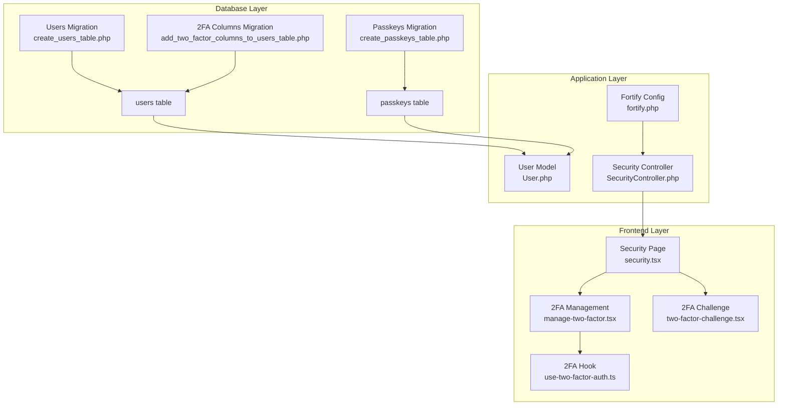
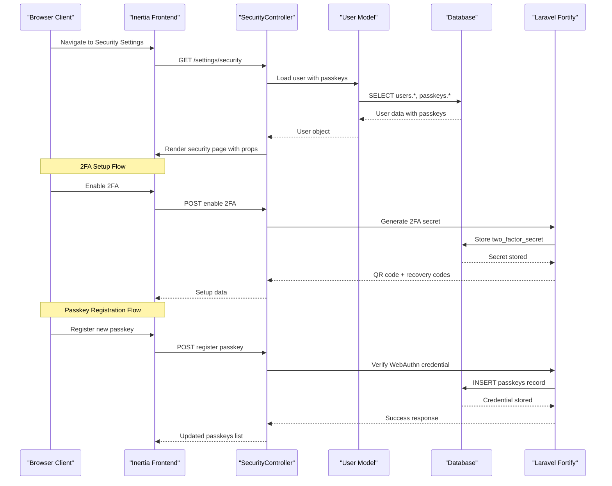
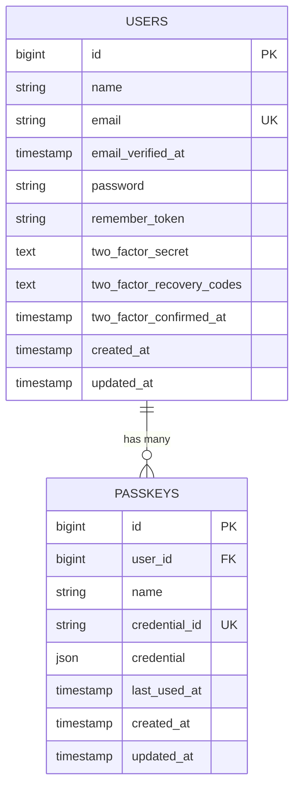
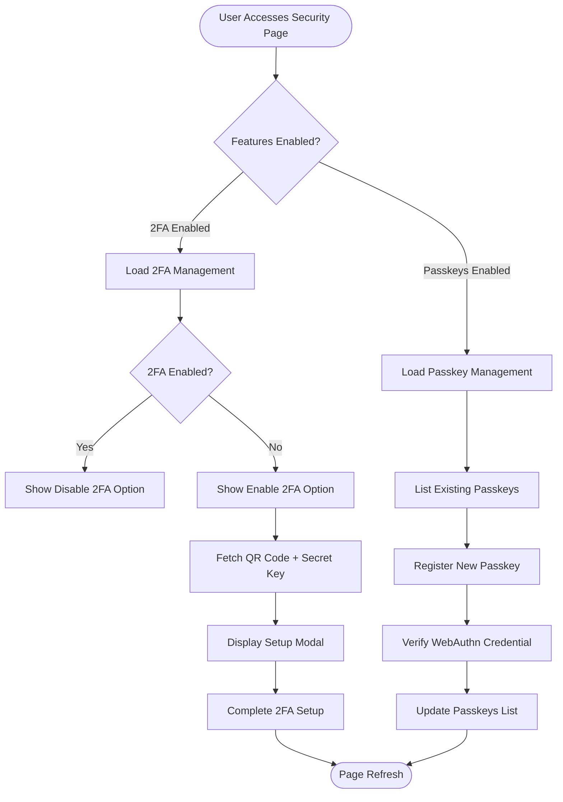
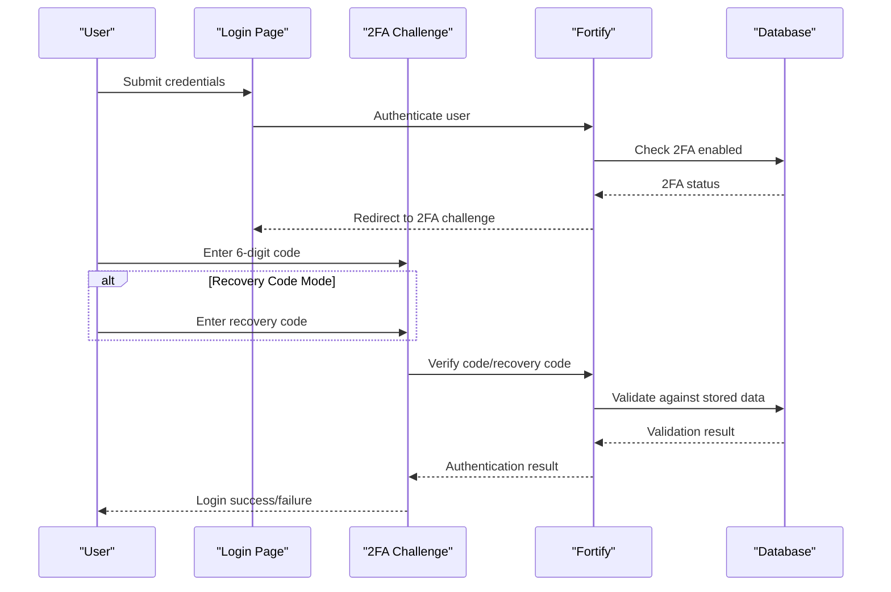
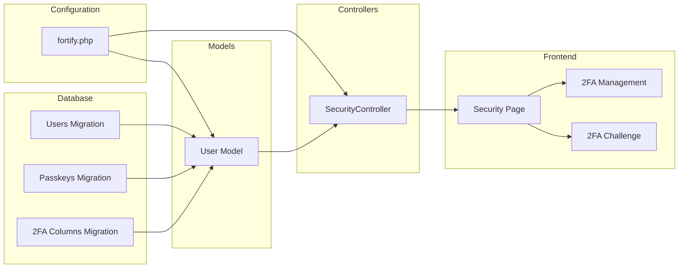

# Enhanced Authentication Tables

<cite>
**Referenced Files in This Document**
- [create_users_table.php](file://database/migrations/0001_01_01_000000_create_users_table.php)
- [add_two_factor_columns_to_users_table.php](file://database/migrations/2025_08_14_170933_add_two_factor_columns_to_users_table.php)
- [create_passkeys_table.php](file://database/migrations/2024_01_01_000000_create_passkeys_table.php)
- [User.php](file://app/Models/User.php)
- [fortify.php](file://config/fortify.php)
- [SecurityController.php](file://app/Http/Controllers/Settings/SecurityController.php)
- [TwoFactorAuthenticationRequest.php](file://app/Http/Requests/Settings/TwoFactorAuthenticationRequest.php)
- [security.tsx](file://resources/js/pages/settings/security.tsx)
- [manage-two-factor.tsx](file://resources/js/components/manage-two-factor.tsx)
- [two-factor-challenge.tsx](file://resources/js/pages/auth/two-factor-challenge.tsx)
- [use-two-factor-auth.ts](file://resources/js/hooks/use-two-factor-auth.ts)
</cite>

## Table of Contents
1. [Introduction](#introduction)
2. [Project Structure](#project-structure)
3. [Core Components](#core-components)
4. [Architecture Overview](#architecture-overview)
5. [Detailed Component Analysis](#detailed-component-analysis)
6. [Dependency Analysis](#dependency-analysis)
7. [Performance Considerations](#performance-considerations)
8. [Troubleshooting Guide](#troubleshooting-guide)
9. [Conclusion](#conclusion)

## Introduction
This document details the enhanced authentication table structures in ScholarGraph, focusing on two primary improvements:
- Users table enhancements for two-factor authentication (2FA) with dedicated columns for secrets, recovery codes, and confirmation timestamps
- Passkeys table schema supporting WebAuthn authentication with fields for credential identifiers, user handles, public keys, and usage counters

These changes enable robust multi-factor authentication and modern passwordless authentication capabilities, integrating seamlessly with Laravel Fortify and Inertia.js frontends.

## Project Structure
The authentication enhancements span database migrations, Eloquent models, configuration, controllers, and frontend components:

**Diagram sources**
- [create_users_table.php:12-22](file://database/migrations/0001_01_01_000000_create_users_table.php#L12-L22)
- [add_two_factor_columns_to_users_table.php:14-18](file://database/migrations/2025_08_14_170933_add_two_factor_columns_to_users_table.php#L14-L18)
- [create_passkeys_table.php:14-24](file://database/migrations/2024_01_01_000000_create_passkeys_table.php#L14-L24)

**Section sources**
- [create_users_table.php:12-38](file://database/migrations/0001_01_01_000000_create_users_table.php#L12-L38)
- [add_two_factor_columns_to_users_table.php:12-34](file://database/migrations/2025_08_14_170933_add_two_factor_columns_to_users_table.php#L12-L34)
- [create_passkeys_table.php:12-34](file://database/migrations/2024_01_01_000000_create_passkeys_table.php#L12-L34)

## Core Components

### Users Table Enhancements for Two-Factor Authentication
The users table has been extended with three critical 2FA columns:

- **two_factor_secret**: Stores encrypted TOTP secret keys using text type with nullable constraint
- **two_factor_recovery_codes**: Contains JSON-encoded recovery codes array with nullable constraint  
- **two_factor_confirmed_at**: Timestamp indicating when 2FA was confirmed, nullable

These columns are positioned after the password field to maintain logical grouping of authentication-related data.

**Section sources**
- [add_two_factor_columns_to_users_table.php:14-18](file://database/migrations/2025_08_14_170933_add_two_factor_columns_to_users_table.php#L14-L18)
- [User.php:23-25](file://app/Models/User.php#L23-L25)

### Passkeys Table Schema for WebAuthn Support
The passkeys table implements comprehensive WebAuthn credential storage:

- **credential_id**: Unique string identifier for the credential, enforced via unique constraint
- **user_id**: Foreign key linking to users table with cascade-on-delete
- **name**: Human-readable name for the passkey device/location
- **credential**: JSON structure containing the complete WebAuthn credential data
- **last_used_at**: Nullable timestamp tracking last authentication usage
- **Indexes**: Composite index on user_id for efficient lookups

**Section sources**
- [create_passkeys_table.php:14-24](file://database/migrations/2024_01_01_000000_create_passkeys_table.php#L14-L24)

### Model Integration and Casts
The User model integrates both authentication features through trait usage and property declarations:

- Implements PasskeyUser interface for WebAuthn support
- Uses PasskeyAuthenticatable and TwoFactorAuthenticatable traits
- Hides sensitive 2FA fields from serialization
- Includes proper casting for datetime fields

**Section sources**
- [User.php:32-35](file://app/Models/User.php#L32-L35)
- [User.php:42-49](file://app/Models/User.php#L42-L49)

## Architecture Overview

**Diagram sources**
- [SecurityController.php:19-51](file://app/Http/Controllers/Settings/SecurityController.php#L19-L51)
- [User.php:32-35](file://app/Models/User.php#L32-L35)
- [fortify.php:163-175](file://config/fortify.php#L163-L175)

## Detailed Component Analysis

### Two-Factor Authentication Implementation

#### Database Schema Details
The 2FA enhancement follows security best practices with appropriate data types and constraints:

**Diagram sources**
- [create_users_table.php:14-22](file://database/migrations/0001_01_01_000000_create_users_table.php#L14-L22)
- [add_two_factor_columns_to_users_table.php:14-18](file://database/migrations/2025_08_14_170933_add_two_factor_columns_to_users_table.php#L14-L18)
- [create_passkeys_table.php:14-24](file://database/migrations/2024_01_01_000000_create_passkeys_table.php#L14-L24)

#### Frontend Management Components
The frontend provides comprehensive 2FA management through React components:

**Diagram sources**
- [security.tsx:126-135](file://resources/js/pages/settings/security.tsx#L126-L135)
- [manage-two-factor.tsx:17-126](file://resources/js/components/manage-two-factor.tsx#L17-L126)

**Section sources**
- [security.tsx:126-135](file://resources/js/pages/settings/security.tsx#L126-L135)
- [manage-two-factor.tsx:17-126](file://resources/js/components/manage-two-factor.tsx#L17-L126)
- [use-two-factor-auth.ts:22-111](file://resources/js/hooks/use-two-factor-auth.ts#L22-L111)

### Passkeys Authentication Implementation

#### Credential Storage and Retrieval
Passkeys utilize a specialized table structure optimized for WebAuthn credentials:

- **Unique Credential ID**: Prevents duplicate credential registration
- **JSON Credential Storage**: Preserves complete credential metadata
- **User Association**: Direct foreign key relationship with users
- **Usage Tracking**: Last used timestamp for security monitoring

#### Multi-Device Authentication Support
The passkeys table enables seamless multi-device authentication through:

- Device-specific naming for clear identification
- Independent credential lifecycle per device
- Centralized user association for account management
- Separate deletion mechanisms for individual devices

**Section sources**
- [create_passkeys_table.php:14-24](file://database/migrations/2024_01_01_000000_create_passkeys_table.php#L14-L24)
- [SecurityController.php:24-39](file://app/Http/Controllers/Settings/SecurityController.php#L24-L39)

### Authentication Flow Implementations

#### Two-Factor Authentication Challenge Flow
The 2FA challenge process supports both authenticator codes and recovery codes:

**Diagram sources**
- [two-factor-challenge.tsx:15-133](file://resources/js/pages/auth/two-factor-challenge.tsx#L15-L133)

**Section sources**
- [two-factor-challenge.tsx:15-133](file://resources/js/pages/auth/two-factor-challenge.tsx#L15-L133)

## Dependency Analysis

**Diagram sources**
- [fortify.php:163-175](file://config/fortify.php#L163-L175)
- [create_users_table.php:12-22](file://database/migrations/0001_01_01_000000_create_users_table.php#L12-L22)
- [create_passkeys_table.php:12-24](file://database/migrations/2024_01_01_000000_create_passkeys_table.php#L12-L24)
- [add_two_factor_columns_to_users_table.php:12-18](file://database/migrations/2025_08_14_170933_add_two_factor_columns_to_users_table.php#L12-L18)

**Section sources**
- [fortify.php:163-175](file://config/fortify.php#L163-L175)
- [User.php:32-35](file://app/Models/User.php#L32-L35)
- [SecurityController.php:19-51](file://app/Http/Controllers/Settings/SecurityController.php#L19-L51)

## Performance Considerations
- **Indexing Strategy**: The passkeys table includes a user_id index for efficient lookups, crucial for authentication performance
- **Data Type Selection**: Text fields for 2FA secrets and JSON for passkey credentials optimize storage flexibility
- **Caching Opportunities**: 2FA recovery codes and passkey metadata can benefit from application-level caching
- **Query Patterns**: Frontend components use targeted queries limiting returned fields to reduce payload sizes

## Troubleshooting Guide

### Common Issues and Solutions

#### 2FA Setup Failures
- **Problem**: QR code generation fails during 2FA setup
- **Solution**: Verify TOTP provider configuration and network connectivity
- **Debug Steps**: Check server logs for TOTP library errors

#### Passkey Registration Errors  
- **Problem**: Browser fails to register new passkey
- **Solution**: Ensure HTTPS deployment and proper WebAuthn support
- **Debug Steps**: Verify browser compatibility and site origin configuration

#### Authentication Challenges
- **Problem**: 2FA codes rejected despite correct input
- **Solution**: Synchronize system clock and verify time zone settings
- **Debug Steps**: Check two_factor_confirmed_at timestamp validity

**Section sources**
- [TwoFactorAuthenticationRequest.php:9-22](file://app/Http/Requests/Settings/TwoFactorAuthenticationRequest.php#L9-L22)
- [fortify.php:145-150](file://config/fortify.php#L145-L150)

## Conclusion
The enhanced authentication infrastructure in ScholarGraph provides enterprise-grade security through:
- Comprehensive 2FA support with secure secret storage and recovery mechanisms
- Modern WebAuthn passkey implementation enabling passwordless authentication
- Seamless integration between backend database schemas and frontend user interfaces
- Robust error handling and performance optimization strategies

These implementations establish a solid foundation for secure user authentication while maintaining excellent user experience through intuitive management interfaces.