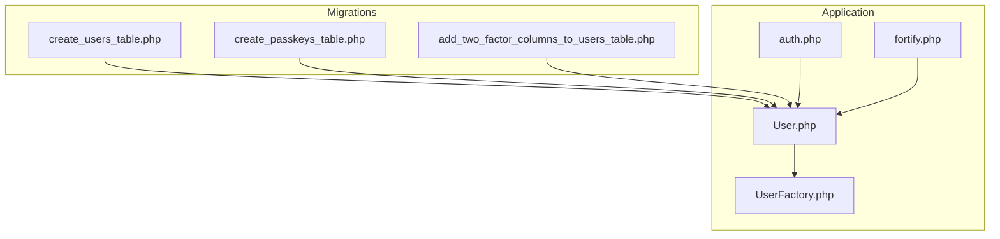
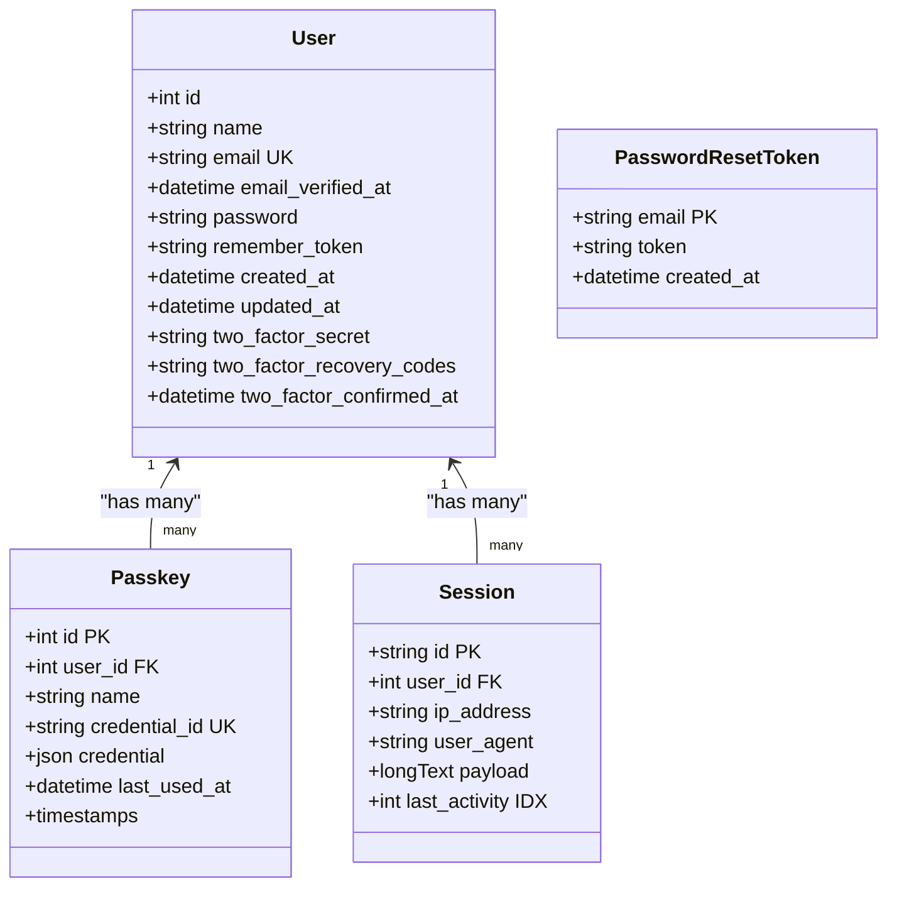
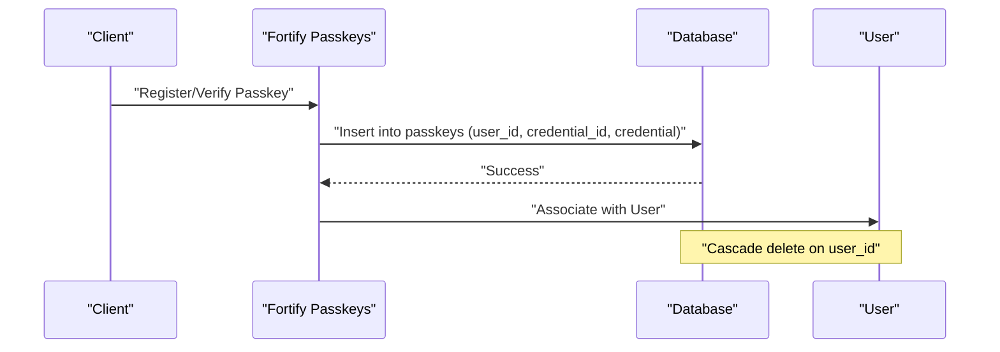
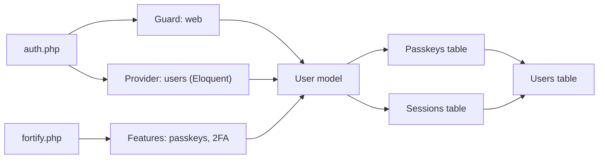

# Entity Relationships & Constraints

<cite>
**Referenced Files in This Document**
- [create_users_table.php](file://database/migrations/0001_01_01_000000_create_users_table.php)
- [create_passkeys_table.php](file://database/migrations/2024_01_01_000000_create_passkeys_table.php)
- [add_two_factor_columns_to_users_table.php](file://database/migrations/2025_08_14_170933_add_two_factor_columns_to_users_table.php)
- [User.php](file://app/Models/User.php)
- [UserFactory.php](file://database/factories/UserFactory.php)
- [fortify.php](file://config/fortify.php)
- [auth.php](file://config/auth.php)
</cite>

## Table of Contents
1. [Introduction](#introduction)
2. [Project Structure](#project-structure)
3. [Core Components](#core-components)
4. [Architecture Overview](#architecture-overview)
5. [Detailed Component Analysis](#detailed-component-analysis)
6. [Dependency Analysis](#dependency-analysis)
7. [Performance Considerations](#performance-considerations)
8. [Troubleshooting Guide](#troubleshooting-guide)
9. [Conclusion](#conclusion)

## Introduction
This document provides a comprehensive analysis of ScholarGraph’s database relationships and referential constraints. It documents primary key definitions, foreign key relationships, and constraint enforcement across all tables. It explains user authentication relationships, session-user associations, and passkey-user connections. It also details indexing strategies for performance optimization, including unique constraints on email addresses and composite indexes for common query patterns. Finally, it outlines migration patterns for adding relationships and maintaining backward compatibility during schema evolution.

## Project Structure
The database schema is primarily defined through Laravel migrations and the Eloquent User model. The relevant files include:
- Users, sessions, and password reset tokens migrations
- Passkeys migration with foreign key and unique constraints
- Users table augmentation for two-factor authentication columns
- Eloquent User model implementing authentication traits
- Factories and configuration for authentication and passkeys

**Diagram sources**
- [create_users_table.php:14-37](file://database/migrations/0001_01_01_000000_create_users_table.php#L14-L37)
- [create_passkeys_table.php:14-24](file://database/migrations/2024_01_01_000000_create_passkeys_table.php#L14-L24)
- [add_two_factor_columns_to_users_table.php:14-18](file://database/migrations/2025_08_14_170933_add_two_factor_columns_to_users_table.php#L14-L18)
- [User.php:32-35](file://app/Models/User.php#L32-L35)
- [UserFactory.php:25-36](file://database/factories/UserFactory.php#L25-L36)
- [auth.php:64-74](file://config/auth.php#L64-L74)
- [fortify.php:163-175](file://config/fortify.php#L163-L175)

**Section sources**
- [create_users_table.php:1-50](file://database/migrations/0001_01_01_000000_create_users_table.php#L1-L50)
- [create_passkeys_table.php:1-35](file://database/migrations/2024_01_01_000000_create_passkeys_table.php#L1-L35)
- [add_two_factor_columns_to_users_table.php:1-35](file://database/migrations/2025_08_14_170933_add_two_factor_columns_to_users_table.php#L1-L35)
- [User.php:1-51](file://app/Models/User.php#L1-L51)
- [UserFactory.php:1-61](file://database/factories/UserFactory.php#L1-L61)
- [auth.php:1-118](file://config/auth.php#L1-L118)
- [fortify.php:1-178](file://config/fortify.php#L1-L178)

## Core Components
- Users table
  - Primary key: auto-increment integer id
  - Unique constraint: email
  - Additional columns: name, email_verified_at, password, remember_token, timestamps
  - Augmented with two-factor columns via migration
- Sessions table
  - Primary key: string id
  - Foreign key: user_id (nullable) with index
  - Columns: ip_address, user_agent, payload, last_activity (indexed)
- Password reset tokens table
  - Primary key: email (string)
  - Columns: token, created_at
- Passkeys table
  - Primary key: auto-increment integer id
  - Foreign key: user_id referencing users.id with ON DELETE CASCADE
  - Unique constraint: credential_id
  - Index: user_id
  - Columns: name, credential (JSON), last_used_at, timestamps
- Jobs and related tables
  - Jobs: indexed by queue
  - Job batches: primary key by id
  - Failed jobs: unique index on uuid and composite index on connection, queue, failed_at
- Cache and cache locks
  - Primary keys: key (string)
  - Indexed: expiration

**Section sources**
- [create_users_table.php:14-37](file://database/migrations/0001_01_01_000000_create_users_table.php#L14-L37)
- [create_passkeys_table.php:14-24](file://database/migrations/2024_01_01_000000_create_passkeys_table.php#L14-L24)
- [add_two_factor_columns_to_users_table.php:14-18](file://database/migrations/2025_08_14_170933_add_two_factor_columns_to_users_table.php#L14-L18)
- [0001_01_01_000001_create_cache_table.php:14-24](file://database/migrations/0001_01_01_000001_create_cache_table.php#L14-L24)
- [0001_01_01_000002_create_jobs_table.php:14-47](file://database/migrations/0001_01_01_000002_create_jobs_table.php#L14-L47)

## Architecture Overview
The authentication architecture integrates Eloquent models, Laravel Fortify, and database constraints:
- Authentication guard uses the session driver with the Eloquent provider for the User model
- Password resets leverage a dedicated token table keyed by email
- Sessions associate with users via nullable foreign keys
- Passkeys are linked to users with cascading deletion
- Two-factor authentication columns are stored on the users table

**Diagram sources**
- [create_users_table.php:14-37](file://database/migrations/0001_01_01_000000_create_users_table.php#L14-L37)
- [create_passkeys_table.php:14-24](file://database/migrations/2024_01_01_000000_create_passkeys_table.php#L14-L24)
- [auth.php:64-74](file://config/auth.php#L64-L74)
- [fortify.php:163-175](file://config/fortify.php#L163-L175)

## Detailed Component Analysis

### Users Table
- Primary key: id (auto-increment integer)
- Unique constraints: email
- Nullable verification timestamp: email_verified_at
- Password hashing handled by model casting
- Two-factor augmentation via migration adds:
  - two_factor_secret (text, nullable)
  - two_factor_recovery_codes (text, nullable)
  - two_factor_confirmed_at (timestamp, nullable)
- Model traits enable authentication, passkey, and two-factor capabilities

**Section sources**
- [create_users_table.php:14-22](file://database/migrations/0001_01_01_000000_create_users_table.php#L14-L22)
- [add_two_factor_columns_to_users_table.php:14-18](file://database/migrations/2025_08_14_170933_add_two_factor_columns_to_users_table.php#L14-L18)
- [User.php:32-49](file://app/Models/User.php#L32-L49)
- [UserFactory.php:25-36](file://database/factories/UserFactory.php#L25-L36)

### Sessions Table
- Primary key: id (string)
- Foreign key: user_id (nullable) referencing users.id with index
- Indexes: last_activity
- Purpose: Laravel session storage with optional user association

**Section sources**
- [create_users_table.php:30-37](file://database/migrations/0001_01_01_000000_create_users_table.php#L30-L37)

### Password Reset Tokens Table
- Primary key: email (string)
- Used by Laravel’s password broker to store reset tokens
- Configured in auth.php to use this table

**Section sources**
- [create_users_table.php:24-28](file://database/migrations/0001_01_01_000000_create_users_table.php#L24-L28)
- [auth.php:95-102](file://config/auth.php#L95-L102)

### Passkeys Table
- Primary key: id (auto-increment integer)
- Foreign key: user_id referencing users.id with ON DELETE CASCADE
- Unique constraint: credential_id
- Index: user_id
- JSON column: credential stores passkey metadata
- Timestamps: created_at, updated_at, last_used_at

**Diagram sources**
- [create_passkeys_table.php:14-24](file://database/migrations/2024_01_01_000000_create_passkeys_table.php#L14-L24)
- [User.php:32-35](file://app/Models/User.php#L32-L35)

**Section sources**
- [create_passkeys_table.php:14-24](file://database/migrations/2024_01_01_000000_create_passkeys_table.php#L14-L24)

### Jobs and Related Tables
- jobs: indexed by queue; payload stored as longText; attempts and timestamps
- job_batches: batch tracking with counts and options
- failed_jobs: unique index on uuid; composite index on connection, queue, failed_at

**Section sources**
- [0001_01_01_000002_create_jobs_table.php:14-47](file://database/migrations/0001_01_01_000002_create_jobs_table.php#L14-L47)

### Cache and Cache Locks
- cache: key (primary), value (mediumText), expiration (indexed)
- cache_locks: key (primary), owner, expiration (indexed)

**Section sources**
- [0001_01_01_000001_create_cache_table.php:14-24](file://database/migrations/0001_01_01_000001_create_cache_table.php#L14-L24)

## Dependency Analysis
- Authentication configuration
  - Guard: session driver with Eloquent provider for User model
  - Password broker: uses password_reset_tokens table
  - Fortify features: registration, password reset, email verification, two-factor, passkeys
- Model relationships
  - User model implements authentication traits enabling passkey and two-factor integrations
  - Passkeys belong to User with cascading delete
  - Sessions optionally belong to User (nullable foreign key)
- Migration dependencies
  - Users table created first
  - Passkeys table depends on users.id existing
  - Two-factor columns added later to users table

**Diagram sources**
- [auth.php:40-74](file://config/auth.php#L40-L74)
- [fortify.php:163-175](file://config/fortify.php#L163-L175)
- [User.php:32-35](file://app/Models/User.php#L32-L35)
- [create_users_table.php:14-37](file://database/migrations/0001_01_01_000000_create_users_table.php#L14-L37)
- [create_passkeys_table.php:14-24](file://database/migrations/2024_01_01_000000_create_passkeys_table.php#L14-L24)

**Section sources**
- [auth.php:1-118](file://config/auth.php#L1-L118)
- [fortify.php:1-178](file://config/fortify.php#L1-L178)
- [User.php:1-51](file://app/Models/User.php#L1-L51)

## Performance Considerations
- Unique constraints
  - users.email ensures uniqueness and supports efficient lookups by email
  - passkeys.credential_id ensures uniqueness of credentials
- Indexes
  - sessions.user_id: enables fast lookup of sessions by user
  - sessions.last_activity: supports cleanup and activity queries
  - jobs.queue: optimizes job retrieval by queue
  - failed_jobs.connection, queue, failed_at: optimizes failure reporting and monitoring
  - cache.expiration: supports cache expiration scans
- Composite indexes
  - Consider adding composite indexes on frequently filtered pairs (e.g., users.email + users.created_at) if analytics or reporting queries require it
- Cascading deletes
  - passkeys cascade on user deletion, preventing orphaned records and simplifying cleanup

[No sources needed since this section provides general guidance]

## Troubleshooting Guide
- Duplicate email errors
  - Symptom: Integrity constraint violation on users.email
  - Cause: Attempting to insert/update a duplicate email
  - Resolution: Ensure email uniqueness before insert/update
- Passkey credential conflicts
  - Symptom: Integrity constraint violation on passkeys.credential_id
  - Cause: Duplicate credential_id insertion
  - Resolution: Enforce credential_id uniqueness at the application level before persisting
- Orphaned passkeys after user deletion
  - Symptom: Unexpected passkey rows without a matching user
  - Cause: Missing or disabled cascade behavior
  - Resolution: Verify foreign key constraint with ON DELETE CASCADE exists
- Session user association issues
  - Symptom: Session entries without a user
  - Cause: Nullable user_id allows anonymous sessions
  - Resolution: Expected behavior; ensure proper session binding when authenticating
- Two-factor column migration
  - Symptom: Missing two-factor fields in production
  - Cause: Migration not applied
  - Resolution: Run the two-factor migration and verify columns exist

**Section sources**
- [create_users_table.php:17-17](file://database/migrations/0001_01_01_000000_create_users_table.php#L17-L17)
- [create_passkeys_table.php:18-18](file://database/migrations/2024_01_01_000000_create_passkeys_table.php#L18-L18)
- [add_two_factor_columns_to_users_table.php:14-18](file://database/migrations/2025_08_14_170933_add_two_factor_columns_to_users_table.php#L14-L18)

## Conclusion
ScholarGraph’s schema establishes clear primary and foreign key relationships with enforced uniqueness and indexes optimized for typical authentication and operational workloads. The User model integrates tightly with Laravel Fortify to support modern authentication patterns, including passkeys and two-factor authentication. Migrations are structured to evolve the schema safely, with cascading deletes ensuring referential integrity. The documented constraints and indexes provide a solid foundation for performance and reliability.