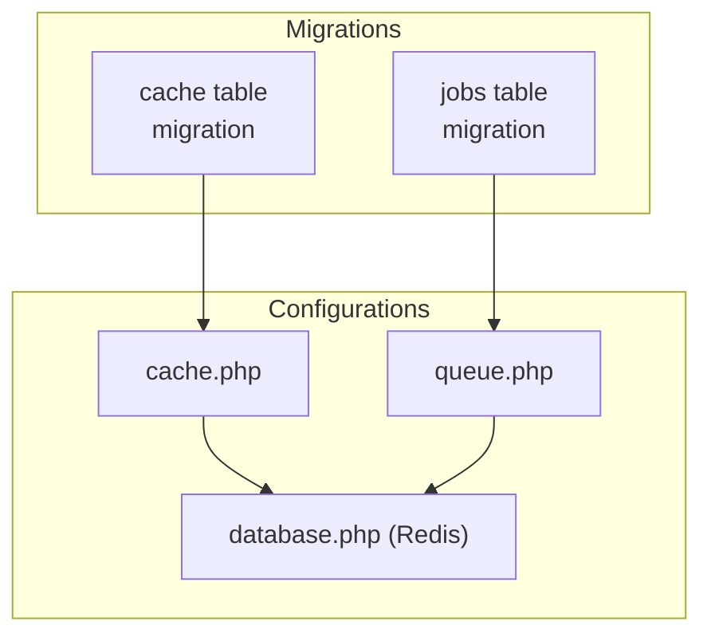
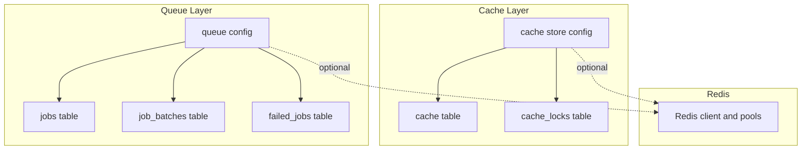
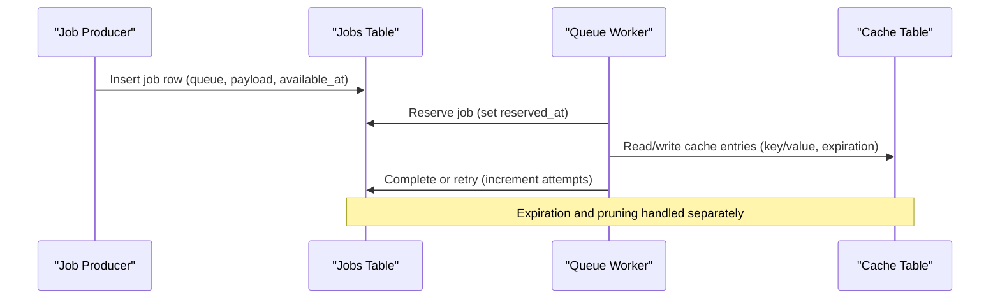
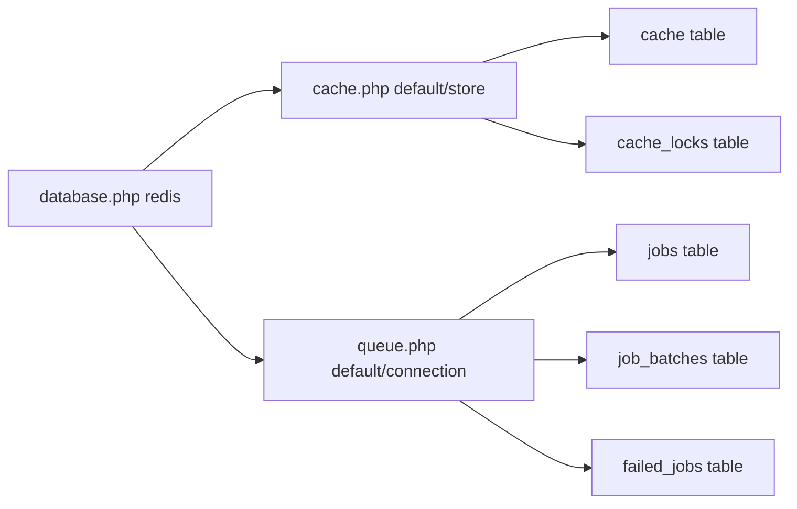

# Infrastructure Support Tables

<cite>
**Referenced Files in This Document**
- [0001_01_01_000001_create_cache_table.php](file://database/migrations/0001_01_01_000001_create_cache_table.php)
- [0001_01_01_000002_create_jobs_table.php](file://database/migrations/0001_01_01_000002_create_jobs_table.php)
- [cache.php](file://config/cache.php)
- [queue.php](file://config/queue.php)
- [database.php](file://config/database.php)
</cite>

## Table of Contents
1. [Introduction](#introduction)
2. [Project Structure](#project-structure)
3. [Core Components](#core-components)
4. [Architecture Overview](#architecture-overview)
5. [Detailed Component Analysis](#detailed-component-analysis)
6. [Dependency Analysis](#dependency-analysis)
7. [Performance Considerations](#performance-considerations)
8. [Troubleshooting Guide](#troubleshooting-guide)
9. [Conclusion](#conclusion)

## Introduction
This document describes the infrastructure support tables that power ScholarGraph’s caching and job processing systems. It focuses on:
- The cache table schema for database-backed caching and Redis-based caching, including field definitions, primary keys, and indexing strategies
- The jobs table schema for Laravel Queues, including fields for job lifecycle tracking
- How caching and job processing relate in the application
- Performance considerations, indexing patterns, and cleanup strategies
- Queue worker configurations, retry mechanisms, and monitoring approaches

## Project Structure
The relevant schema definitions are provided by database migrations, while runtime behavior is configured via cache, queue, and Redis configuration files.



**Diagram sources**
- [0001_01_01_000001_create_cache_table.php:12-25](file://database/migrations/0001_01_01_000001_create_cache_table.php#L12-L25)
- [0001_01_01_000002_create_jobs_table.php:12-48](file://database/migrations/0001_01_01_000002_create_jobs_table.php#L12-L48)
- [cache.php:18](file://config/cache.php#L18)
- [queue.php:16](file://config/queue.php#L16)
- [database.php:146](file://config/database.php#L146)

**Section sources**
- [0001_01_01_000001_create_cache_table.php:12-35](file://database/migrations/0001_01_01_000001_create_cache_table.php#L12-L35)
- [0001_01_01_000002_create_jobs_table.php:12-58](file://database/migrations/0001_01_01_000002_create_jobs_table.php#L12-L58)
- [cache.php:18](file://config/cache.php#L18)
- [queue.php:16](file://config/queue.php#L16)
- [database.php:146](file://config/database.php#L146)

## Core Components
- Cache table (database-backed): Provides durable key/value storage with expiration and advisory locking for cache operations.
- Cache locks table: Supports cache lock ownership with expiration to coordinate distributed cache updates.
- Jobs table: Stores queued jobs with queue targeting, payload, attempts, reservation timestamps, and visibility windows.
- Job batches table: Tracks batched job sets with counts and failure metadata.
- Failed jobs table: Captures failed jobs with connection, queue, payload, exception, and failure timestamp.

These components enable:
- Persistent caching with expiration-aware retrieval
- Reliable asynchronous job processing with retries and visibility control
- Batch orchestration and failure auditing

**Section sources**
- [0001_01_01_000001_create_cache_table.php:14-24](file://database/migrations/0001_01_01_000001_create_cache_table.php#L14-L24)
- [0001_01_01_000002_create_jobs_table.php:14-47](file://database/migrations/0001_01_01_000002_create_jobs_table.php#L14-L47)

## Architecture Overview
The caching and queue subsystems are configured to use database-backed stores by default, with optional Redis overrides. The following diagram maps the schema and configuration relationships.



**Diagram sources**
- [0001_01_01_000001_create_cache_table.php:14-24](file://database/migrations/0001_01_01_000001_create_cache_table.php#L14-L24)
- [0001_01_01_000002_create_jobs_table.php:14-47](file://database/migrations/0001_01_01_000002_create_jobs_table.php#L14-L47)
- [cache.php:42](file://config/cache.php#L42)
- [queue.php:38](file://config/queue.php#L38)
- [database.php:146](file://config/database.php#L146)

## Detailed Component Analysis

### Cache Table Schema (Database-backed)
- Purpose: Provide durable key/value caching with expiration and advisory locking.
- Fields:
  - key: string, primary key
  - value: mediumText, serialized cache value
  - expiration: bigInteger, indexed for TTL-based pruning
- Indexing: expiration column is indexed to efficiently purge expired entries.
- Locking: cache_locks table mirrors the schema to coordinate cache locks with owner and expiration.

```mermaid
erDiagram
CACHE {
string key PK
mediumtext value
bigint expiration IX
}
CACHE_LOCKS {
string key PK
string owner
bigint expiration IX
}
```

**Diagram sources**
- [0001_01_01_000001_create_cache_table.php:14-24](file://database/migrations/0001_01_01_000001_create_cache_table.php#L14-L24)

**Section sources**
- [0001_01_01_000001_create_cache_table.php:14-24](file://database/migrations/0001_01_01_000001_create_cache_table.php#L14-L24)
- [cache.php:42](file://config/cache.php#L42)

### Jobs Table Schema (Laravel Queues)
- Purpose: Persist jobs for asynchronous processing with queue targeting, attempts, and visibility control.
- Fields:
  - id: auto-incrementing primary key
  - queue: string, indexed for efficient queue targeting
  - payload: longText, serialized job data
  - attempts: unsignedSmallInteger, retry counter
  - reserved_at: unsignedInteger, nullable, indicates reservation window
  - available_at: unsignedInteger, job becomes visible
  - created_at: unsignedInteger, job enqueue timestamp
- Indexing: queue column is indexed to quickly locate jobs for a given queue.
- Related tables:
  - job_batches: tracks batched job sets with counts and failure metadata
  - failed_jobs: captures failed jobs with connection, queue, payload, exception, and timestamp

```mermaid
erDiagram
JOBS {
bigint id PK
string queue IX
longtext payload
smallint attempts
uint reserved_at
uint available_at
uint created_at
}
JOB_BATCHES {
string id PK
string name
int total_jobs
int pending_jobs
int failed_jobs
longtext failed_job_ids
mediumtext options
int cancelled_at
int created_at
int finished_at
}
FAILED_JOBS {
bigint id PK
string uuid UK
string connection
string queue
longtext payload
longtext exception
timestamp failed_at
}
```

**Diagram sources**
- [0001_01_01_000002_create_jobs_table.php:14-47](file://database/migrations/0001_01_01_000002_create_jobs_table.php#L14-L47)

**Section sources**
- [0001_01_01_000002_create_jobs_table.php:14-47](file://database/migrations/0001_01_01_000002_create_jobs_table.php#L14-L47)
- [queue.php:38](file://config/queue.php#L38)

### Relationship Between Caching and Job Processing
- Both systems rely on database-backed persistence by default, enabling durability and horizontal scaling with a shared relational store.
- Jobs may use caching to:
  - Memoize expensive computations during processing
  - Store intermediate results keyed by identifiers derived from job payloads
  - Coordinate distributed locks around resource-intensive operations
- Cache expiration aligns with job visibility windows; expired cache entries can be pruned to reclaim space, while jobs remain available until processed or expired.



**Diagram sources**
- [0001_01_01_000002_create_jobs_table.php:14-22](file://database/migrations/0001_01_01_000002_create_jobs_table.php#L14-L22)
- [0001_01_01_000001_create_cache_table.php:14-18](file://database/migrations/0001_01_01_000001_create_cache_table.php#L14-L18)

## Dependency Analysis
- Cache configuration references database-backed cache and Redis-backed cache stores.
- Queue configuration references database-backed queues and Redis-backed queues.
- Redis configuration defines client, cluster/prefix, and connection pools for cache and general use.



**Diagram sources**
- [cache.php:18](file://config/cache.php#L18)
- [queue.php:16](file://config/queue.php#L16)
- [database.php:146](file://config/database.php#L146)
- [0001_01_01_000001_create_cache_table.php:14-24](file://database/migrations/0001_01_01_000001_create_cache_table.php#L14-L24)
- [0001_01_01_000002_create_jobs_table.php:14-47](file://database/migrations/0001_01_01_000002_create_jobs_table.php#L14-L47)

**Section sources**
- [cache.php:18](file://config/cache.php#L18)
- [queue.php:16](file://config/queue.php#L16)
- [database.php:146](file://config/database.php#L146)

## Performance Considerations
- Cache table
  - Primary key: O(1) lookup by key
  - Expiration index: Efficient range scans for pruning expired rows
  - Value size: mediumText allows larger payloads; consider compression for large serialized data
  - Advisory locks: Owner/expiry coordination avoids contention; ensure lock expiry is reasonable relative to expected update durations
- Jobs table
  - Queue index: Efficient fan-out by queue name
  - Attempts: Enables retry without rescheduling; monitor rising attempts to detect problematic jobs
  - Visibility windows: available_at/reserved_at control concurrency and prevent premature reprocessing
  - Payload size: longText accommodates complex payloads; consider splitting large payloads into cache-backed references
- Redis tuning
  - Client selection and clustering options are configurable; tune prefix and pool sizes for throughput
  - Backoff algorithms and max retries influence resilience under transient failures

[No sources needed since this section provides general guidance]

## Troubleshooting Guide
- Cache pruning and cleanup
  - Use expiration index to periodically remove expired cache rows
  - Monitor cache_locks for stale locks; prune locks older than expected lock lifetimes
- Job visibility and retries
  - Jobs stuck in reserved state indicate worker crashes or timeouts; adjust retry_after or reserved interval
  - High attempts with repeated failures suggest payload or handler issues; inspect failed_jobs table
- Monitoring
  - Track queue length per queue name using the queue index
  - Observe job_batch progress and failure counts for batched workloads
  - Correlate cache miss rates and TTL distributions with job throughput to size capacity appropriately

**Section sources**
- [0001_01_01_000001_create_cache_table.php:17](file://database/migrations/0001_01_01_000001_create_cache_table.php#L17)
- [0001_01_01_000002_create_jobs_table.php:16](file://database/migrations/0001_01_01_000002_create_jobs_table.php#L16)
- [0001_01_01_000002_create_jobs_table.php:46](file://database/migrations/0001_01_01_000002_create_jobs_table.php#L46)

## Conclusion
ScholarGraph’s infrastructure support tables provide a robust foundation for caching and job processing:
- Database-backed cache and jobs offer simplicity and portability
- Optional Redis configuration enhances scalability and performance
- Thoughtful indexing and cleanup strategies ensure long-term reliability
- Clear separation of concerns enables independent tuning of caching and queue subsystems