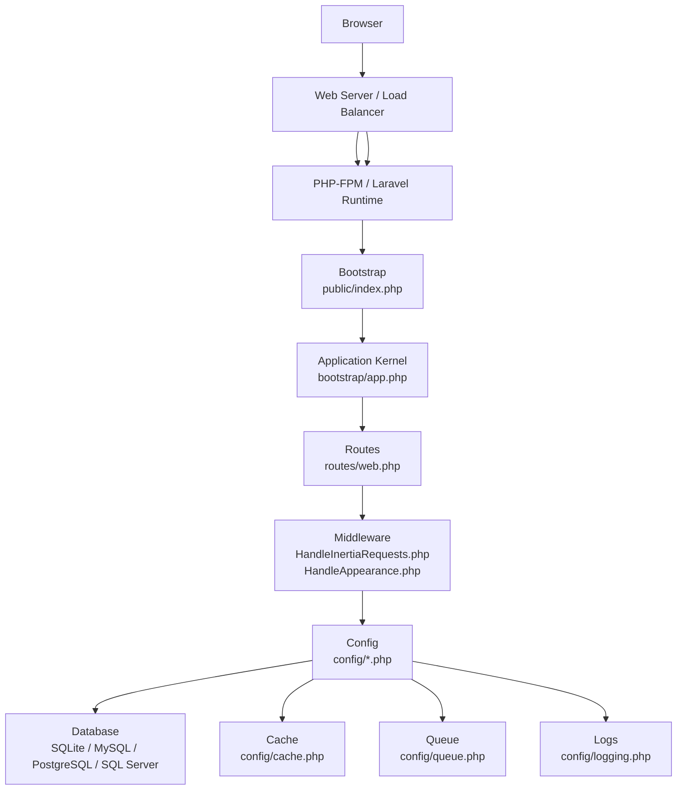
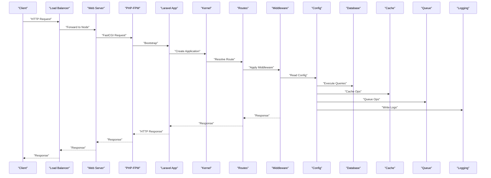
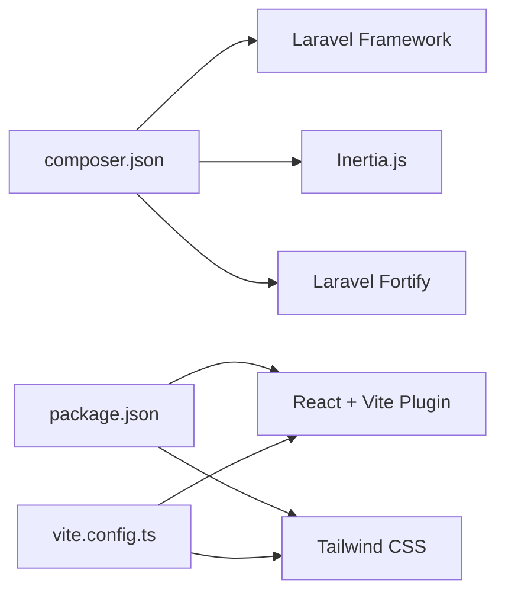

# Deployment & Operations

<cite>
**Referenced Files in This Document**
- [composer.json](file://composer.json)
- [package.json](file://package.json)
- [vite.config.ts](file://vite.config.ts)
- [public/index.php](file://public/index.php)
- [bootstrap/app.php](file://bootstrap/app.php)
- [config/app.php](file://config/app.php)
- [config/database.php](file://config/database.php)
- [config/cache.php](file://config/cache.php)
- [config/queue.php](file://config/queue.php)
- [config/logging.php](file://config/logging.php)
- [database/migrations/0001_01_01_000000_create_users_table.php](file://database/migrations/0001_01_01_000000_create_users_table.php)
- [database/migrations/0001_01_01_000001_create_cache_table.php](file://database/migrations/0001_01_01_000001_create_cache_table.php)
- [database/migrations/0001_01_01_000002_create_jobs_table.php](file://database/migrations/0001_01_01_000002_create_jobs_table.php)
- [app/Providers/AppServiceProvider.php](file://app/Providers/AppServiceProvider.php)
- [app/Http/Middleware/HandleAppearance.php](file://app/Http/Middleware/HandleAppearance.php)
- [app/Http/Middleware/HandleInertiaRequests.php](file://app/Http/Middleware/HandleInertiaRequests.php)
- [routes/web.php](file://routes/web.php)
</cite>

## Table of Contents
1. [Introduction](#introduction)
2. [Project Structure](#project-structure)
3. [Core Components](#core-components)
4. [Architecture Overview](#architecture-overview)
5. [Detailed Component Analysis](#detailed-component-analysis)
6. [Dependency Analysis](#dependency-analysis)
7. [Performance Considerations](#performance-considerations)
8. [Troubleshooting Guide](#troubleshooting-guide)
9. [Conclusion](#conclusion)
10. [Appendices](#appendices)

## Introduction
This document provides comprehensive deployment and operations guidance for ScholarGraph. It covers production deployment checklists, environment configuration, database and cache maintenance, monitoring and logging strategies, scaling and performance optimization, infrastructure requirements, application bootstrap, service configuration, operational best practices, deployment topologies, load balancing, disaster recovery, and operational troubleshooting procedures.

## Project Structure
ScholarGraph is a Laravel application with an Inertia.js frontend. The runtime entrypoint is the web server front controller, which boots the Laravel application and routes requests. Build assets are produced via Vite and served by the Laravel application.

**Diagram sources**
- [public/index.php:1-21](file://public/index.php#L1-L21)
- [bootstrap/app.php:11-30](file://bootstrap/app.php#L11-L30)
- [routes/web.php:1-12](file://routes/web.php#L1-L12)
- [app/Http/Middleware/HandleInertiaRequests.php:1-48](file://app/Http/Middleware/HandleInertiaRequests.php#L1-L48)
- [app/Http/Middleware/HandleAppearance.php:1-24](file://app/Http/Middleware/HandleAppearance.php#L1-L24)
- [config/database.php:1-185](file://config/database.php#L1-L185)
- [config/cache.php:1-137](file://config/cache.php#L1-L137)
- [config/queue.php:1-130](file://config/queue.php#L1-L130)
- [config/logging.php:1-133](file://config/logging.php#L1-L133)

**Section sources**
- [public/index.php:1-21](file://public/index.php#L1-L21)
- [bootstrap/app.php:11-30](file://bootstrap/app.php#L11-L30)
- [routes/web.php:1-12](file://routes/web.php#L1-L12)
- [vite.config.ts:1-32](file://vite.config.ts#L1-L32)

## Core Components
- Application bootstrap and routing are configured in the Laravel bootstrap file, with health checks enabled.
- Frontend build pipeline uses Vite with React and Tailwind CSS plugins.
- Environment-driven configuration for app, database, cache, queue, and logging.
- Middleware integrates Inertia.js and cookie-driven appearance preferences.
- Production defaults enforced via the application service provider.

Key operational configuration highlights:
- Application name, environment, debug, URL, timezone, locale, encryption key, and maintenance driver/store.
- Database connections for SQLite, MySQL, MariaDB, PostgreSQL, and SQL Server; Redis client and options; migration table configuration.
- Cache stores including database, file, memcached, redis, dynamodb, octane, failover, and others; key prefixing and serialization policy.
- Queue backends including sync, database, beanstalkd, SQS, and redis; batching and failed job storage.
- Logging channels including stack, single, daily, slack, syslog, stderr, papertrail, and emergency; deprecation logging.

**Section sources**
- [config/app.php:1-127](file://config/app.php#L1-L127)
- [config/database.php:1-185](file://config/database.php#L1-L185)
- [config/cache.php:1-137](file://config/cache.php#L1-L137)
- [config/queue.php:1-130](file://config/queue.php#L1-L130)
- [config/logging.php:1-133](file://config/logging.php#L1-L133)
- [app/Providers/AppServiceProvider.php:24-49](file://app/Providers/AppServiceProvider.php#L24-L49)
- [app/Http/Middleware/HandleInertiaRequests.php:1-48](file://app/Http/Middleware/HandleInertiaRequests.php#L1-L48)
- [app/Http/Middleware/HandleAppearance.php:1-24](file://app/Http/Middleware/HandleAppearance.php#L1-L24)

## Architecture Overview
The runtime architecture combines a web server front controller, PHP runtime, Laravel kernel, route resolution, middleware, and persistent stores (database, cache, queue, logs). Health checks are exposed via the configured health endpoint.

**Diagram sources**
- [public/index.php:1-21](file://public/index.php#L1-L21)
- [bootstrap/app.php:11-30](file://bootstrap/app.php#L11-L30)
- [routes/web.php:1-12](file://routes/web.php#L1-L12)
- [app/Http/Middleware/HandleInertiaRequests.php:1-48](file://app/Http/Middleware/HandleInertiaRequests.php#L1-L48)
- [config/database.php:1-185](file://config/database.php#L1-L185)
- [config/cache.php:1-137](file://config/cache.php#L1-L137)
- [config/queue.php:1-130](file://config/queue.php#L1-L130)
- [config/logging.php:1-133](file://config/logging.php#L1-L133)

## Detailed Component Analysis

### Application Bootstrap and Health Checks
- The front controller checks for maintenance mode and delegates to the Laravel bootstrap file.
- The bootstrap configures routing with a health endpoint and sets JSON rendering for API-like requests.
- Middleware encrypts cookies except specific keys and appends custom middleware for appearance and Inertia requests.

Operational implications:
- Ensure maintenance mode files are managed during deployments.
- Health checks are available at the configured endpoint for load balancers and orchestrators.
- Cookie encryption excludes appearance and sidebar state to preserve user preferences.

**Section sources**
- [public/index.php:8-11](file://public/index.php#L8-L11)
- [bootstrap/app.php:11-30](file://bootstrap/app.php#L11-L30)
- [app/Http/Middleware/HandleAppearance.php:17-22](file://app/Http/Middleware/HandleAppearance.php#L17-L22)
- [app/Http/Middleware/HandleInertiaRequests.php:24-27](file://app/Http/Middleware/HandleInertiaRequests.php#L24-L27)

### Environment Configuration and Secrets Management
- Application-level settings include name, environment, debug flag, URL, timezone, locales, cipher, encryption key, and maintenance driver/store.
- Database connections support SQLite, MySQL/MariaDB, PostgreSQL, and SQL Server with SSL/TLS options and charset/collation settings.
- Redis client, cluster, prefix, persistence, and retry/backoff policies are configurable.
- Cache and queue drivers are environment-driven; cache key prefixing prevents collisions across apps.

Best practices:
- Rotate APP_KEY and maintain previous keys during key rotations.
- Use distinct cache prefixes per environment.
- Configure SSL/TLS for MySQL/MariaDB and PostgreSQL when connecting remotely.

**Section sources**
- [config/app.php:16-124](file://config/app.php#L16-L124)
- [config/database.php:20-182](file://config/database.php#L20-L182)
- [config/cache.php:18-121](file://config/cache.php#L18-L121)

### Database Schema and Operational Scripts
- Users, password reset tokens, sessions, cache, cache locks, jobs, job batches, and failed jobs tables are defined in migrations.
- The default database connection is environment-driven; SQLite is the default in this repository.

Operational guidance:
- Apply migrations in production with caution; destructive commands are prohibited in production by default.
- For SQLite, ensure file permissions and disk space; for remote databases, verify connectivity and credentials.
- Monitor job batches and failed jobs for queue reliability.

**Section sources**
- [database/migrations/0001_01_01_000000_create_users_table.php:14-37](file://database/migrations/0001_01_01_000000_create_users_table.php#L14-L37)
- [database/migrations/0001_01_01_000001_create_cache_table.php:14-24](file://database/migrations/0001_01_01_000001_create_cache_table.php#L14-L24)
- [database/migrations/0001_01_01_000002_create_jobs_table.php:14-47](file://database/migrations/0001_01_01_000002_create_jobs_table.php#L14-L47)
- [app/Providers/AppServiceProvider.php:36-38](file://app/Providers/AppServiceProvider.php#L36-L38)

### Cache and Queue Backends
- Cache stores include database, file, memcached, redis, dynamodb, octane, and failover; key prefixing is supported.
- Queue backends include sync, database, beanstalkd, SQS, and redis; batching and failed job storage are configurable.

Scaling considerations:
- Prefer redis-backed cache and queues for horizontal scaling.
- Use failover cache and queue configurations for resilience.
- Tune retry and block timeouts for queue backends.

**Section sources**
- [config/cache.php:35-108](file://config/cache.php#L35-L108)
- [config/queue.php:32-92](file://config/queue.php#L32-L92)

### Logging and Monitoring
- Logging channels include stack, single, daily, slack, syslog, stderr, papertrail, and emergency.
- Daily rotation and retention days are configurable; deprecation logging can be enabled with optional tracing.

Monitoring recommendations:
- Ship logs to centralized systems using papertrail or syslog.
- Use daily rotation with appropriate retention.
- Integrate Slack notifications for critical events.

**Section sources**
- [config/logging.php:53-130](file://config/logging.php#L53-L130)

### Frontend Build and Asset Delivery
- Vite builds React/Tailwind assets and serves them through Laravel.
- Plugins include Inertia, React compiler, Tailwind, and Wayfinder.

Operational tips:
- Build assets in CI/CD and commit optimized bundles.
- Ensure asset versioning aligns with Inertia’s expectations.

**Section sources**
- [vite.config.ts:9-31](file://vite.config.ts#L9-L31)
- [package.json:1-77](file://package.json#L1-L77)

### Middleware and Shared Data
- Inertia middleware shares application name, authentication state, and sidebar state derived from cookies.
- Appearance preference is shared from a cookie to control UI theme.

Operational impact:
- Cookie names for appearance and sidebar state are excluded from encryption to preserve user preferences.
- Ensure cookie domains and SameSite attributes are aligned with deployment.

**Section sources**
- [app/Http/Middleware/HandleInertiaRequests.php:36-46](file://app/Http/Middleware/HandleInertiaRequests.php#L36-L46)
- [app/Http/Middleware/HandleAppearance.php:17-22](file://app/Http/Middleware/HandleAppearance.php#L17-L22)
- [bootstrap/app.php:17-24](file://bootstrap/app.php#L17-L24)

## Dependency Analysis
The application depends on Laravel core, Inertia.js, Laravel Fortify, and supporting packages. Build tooling relies on Vite, React, and Tailwind. Dependencies are declared in Composer and NPM.

**Diagram sources**
- [composer.json:11-32](file://composer.json#L11-L32)
- [package.json:31-67](file://package.json#L31-L67)
- [vite.config.ts:9-31](file://vite.config.ts#L9-L31)

**Section sources**
- [composer.json:11-32](file://composer.json#L11-L32)
- [package.json:1-77](file://package.json#L1-L77)
- [vite.config.ts:1-32](file://vite.config.ts#L1-L32)

## Performance Considerations
- Database
  - Use appropriate collations and charsets for target databases.
  - Enable foreign key constraints for SQLite when applicable.
  - For high write loads, prefer MySQL/MariaDB or PostgreSQL over SQLite.
- Cache
  - Use redis-backed cache for distributed environments.
  - Set cache key prefixes per environment to avoid collisions.
  - Consider Octane for improved throughput in supported environments.
- Queue
  - Use redis or SQS for scalable asynchronous processing.
  - Monitor failed jobs and tune retry-after values.
- Logging
  - Use daily rotation with retention limits.
  - Offload logs to external systems for cost and scalability.
- Assets
  - Build with Vite in CI and serve optimized bundles.
  - Enable long-lived cache headers for static assets.

[No sources needed since this section provides general guidance]

## Troubleshooting Guide
Common operational issues and resolutions:
- Maintenance Mode
  - Remove the maintenance file or disable maintenance driver/store to restore traffic.
  - Verify maintenance driver configuration and cache store availability.
- Database Connectivity
  - Confirm DB_CONNECTION and credentials; test remote SSL/TLS settings.
  - For SQLite, verify file path and permissions.
- Cache and Queue Failures
  - Validate redis connectivity and credentials; adjust retry/backoff settings.
  - Inspect failed jobs table for exceptions and retry policies.
- Logging
  - Check daily rotation and retention; verify external integrations (Slack, Papertrail).
- Asset Delivery
  - Rebuild assets with Vite; ensure correct public path and versioning.

**Section sources**
- [public/index.php:8-11](file://public/index.php#L8-L11)
- [config/app.php:121-124](file://config/app.php#L121-L124)
- [config/database.php:20-182](file://config/database.php#L20-L182)
- [config/cache.php:81-85](file://config/cache.php#L81-L85)
- [config/queue.php:67-74](file://config/queue.php#L67-L74)
- [config/logging.php:68-74](file://config/logging.php#L68-L74)

## Conclusion
ScholarGraph’s deployment and operations rely on environment-driven configuration, robust middleware for Inertia and appearance preferences, and flexible cache/queue backends. Production readiness requires careful attention to secrets management, database and cache tuning, queue reliability, logging hygiene, and asset delivery. The included scripts and configuration enable repeatable setups and scalable deployments.

[No sources needed since this section summarizes without analyzing specific files]

## Appendices

### Production Deployment Checklist
- Prepare environment variables for app, database, cache, queue, and logging.
- Generate and deploy APP_KEY; update previous keys safely.
- Provision database and apply migrations with caution.
- Configure cache and queue backends for production.
- Build and deploy frontend assets.
- Configure web server and PHP-FPM.
- Set up health checks and load balancer.
- Configure logging and monitoring.
- Plan and test rollback procedures.

[No sources needed since this section provides general guidance]

### Infrastructure Requirements
- Web server capable of serving PHP-FPM and static assets.
- PHP runtime matching Composer requirements.
- Database engine selected per environment (SQLite for development, MySQL/MariaDB/PostgreSQL/SQL Server for production).
- Redis instance for cache and queues (recommended).
- Optional: external logging and monitoring systems.

[No sources needed since this section provides general guidance]

### Scaling Considerations
- Horizontal scaling: Use redis-backed cache and queues; ensure sticky sessions only if required.
- Load balancing: Place a reverse proxy/load balancer in front; use health checks for node gating.
- Stateless design: Keep sessions and state in cache/database; avoid local filesystem dependencies.

[No sources needed since this section provides general guidance]

### Disaster Recovery Procedures
- Backup database and cache stores regularly.
- Maintain immutable artifacts for frontend assets.
- Document restore steps for database, cache, and logs.
- Test failover for cache and queue backends.

[No sources needed since this section provides general guidance]