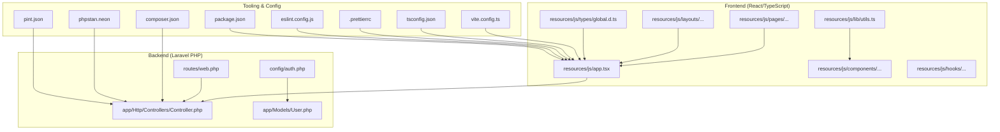
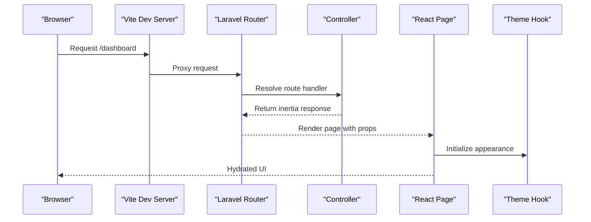
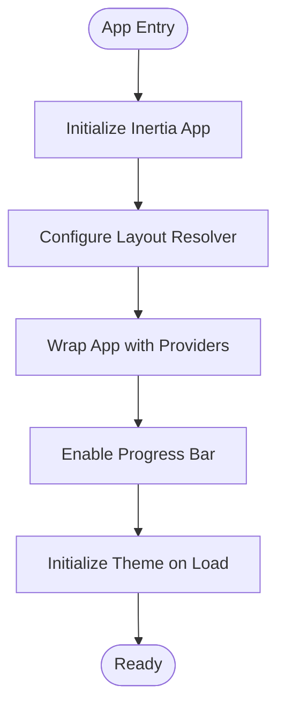
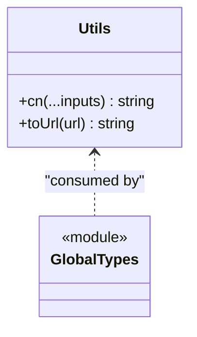
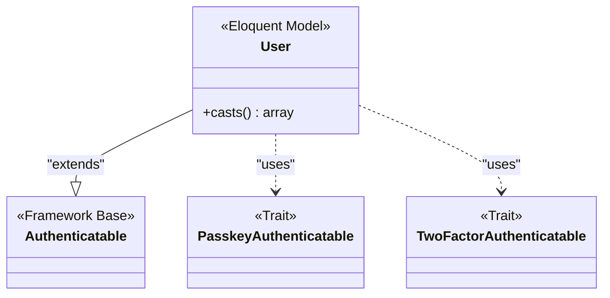
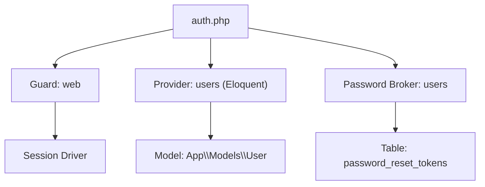
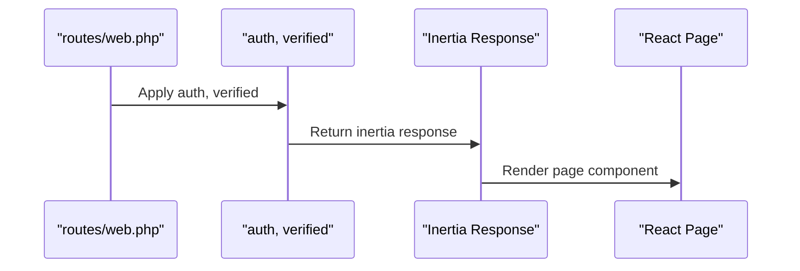
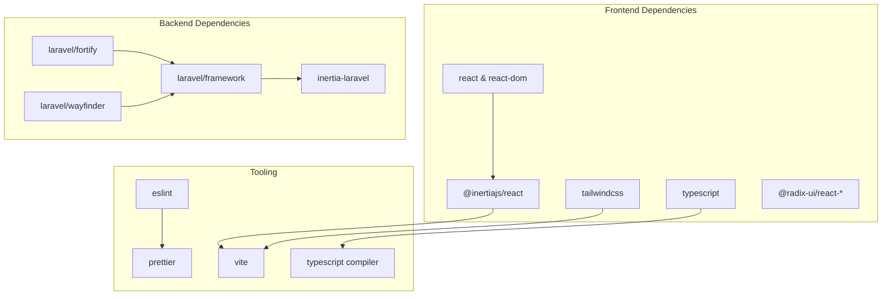

# Development Guidelines

<cite>
**Referenced Files in This Document**
- [package.json](file://package.json)
- [composer.json](file://composer.json)
- [eslint.config.js](file://eslint.config.js)
- [.prettierrc](file://.prettierrc)
- [pint.json](file://pint.json)
- [phpstan.neon](file://phpstan.neon)
- [tsconfig.json](file://tsconfig.json)
- [vite.config.ts](file://vite.config.ts)
- [app.tsx](file://resources/js/app.tsx)
- [utils.ts](file://resources/js/lib/utils.ts)
- [global.d.ts](file://resources/js/types/global.d.ts)
- [User.php](file://app/Models/User.php)
- [Controller.php](file://app/Http/Controllers/Controller.php)
- [create_users_table.php](file://database/migrations/0001_01_01_000000_create_users_table.php)
- [auth.php](file://config/auth.php)
- [web.php](file://routes/web.php)
</cite>

## Table of Contents
1. [Introduction](#introduction)
2. [Project Structure](#project-structure)
3. [Core Components](#core-components)
4. [Architecture Overview](#architecture-overview)
5. [Detailed Component Analysis](#detailed-component-analysis)
6. [Dependency Analysis](#dependency-analysis)
7. [Performance Considerations](#performance-considerations)
8. [Security Best Practices](#security-best-practices)
9. [Code Formatting and Linters](#code-formating-and-linters)
10. [Component Development Guidelines](#component-development-guidelines)
11. [Database Migration Patterns](#database-migration-patterns)
12. [Testing and Quality Assurance](#testing-and-quality-assurance)
13. [Code Review Processes](#code-review-processes)
14. [Maintainability Practices](#maintainability-practices)
15. [Troubleshooting Guide](#troubleshooting-guide)
16. [Conclusion](#conclusion)

## Introduction
This document provides comprehensive development guidelines for ScholarGraph, covering code standards and conventions for PHP, JavaScript/TypeScript, and React components. It documents component development guidelines, database migration patterns, and security best practices. It also explains the configuration for code formatting tools (Prettier, ESLint, and PHP-CS-Fixer via Laravel Pint), performance optimization guidelines, security implementation patterns, and maintainability practices. Examples of proper code organization, naming conventions, and architectural patterns are included, along with code review processes and quality assurance practices.

## Project Structure
ScholarGraph follows a modern full-stack architecture combining Laravel (PHP) on the backend and React (TypeScript) on the frontend, orchestrated by Vite and Inertia.js for seamless SPA-like routing and state management.

**Diagram sources**
- [app.tsx:1-41](file://resources/js/app.tsx#L1-L41)
- [Controller.php:1-9](file://app/Http/Controllers/Controller.php#L1-L9)
- [User.php:1-51](file://app/Models/User.php#L1-L51)
- [web.php:1-12](file://routes/web.php#L1-L12)
- [auth.php:1-118](file://config/auth.php#L1-L118)
- [vite.config.ts:1-32](file://vite.config.ts#L1-L32)
- [tsconfig.json:1-122](file://tsconfig.json#L1-L122)
- [.prettierrc:1-26](file://.prettierrc#L1-L26)
- [eslint.config.js:1-130](file://eslint.config.js#L1-L130)
- [composer.json:1-119](file://composer.json#L1-L119)
- [package.json:1-77](file://package.json#L1-L77)
- [phpstan.neon:1-14](file://phpstan.neon#L1-L14)
- [pint.json:1-4](file://pint.json#L1-L4)

**Section sources**
- [app.tsx:1-41](file://resources/js/app.tsx#L1-L41)
- [web.php:1-12](file://routes/web.php#L1-L12)
- [vite.config.ts:1-32](file://vite.config.ts#L1-L32)
- [tsconfig.json:1-122](file://tsconfig.json#L1-L122)

## Core Components
- Frontend bootstrapping and layout selection are centralized in the React entrypoint, which configures Inertia, theme initialization, and layout composition.
- Backend controllers provide foundational structure for HTTP handlers, while models encapsulate data access and security attributes.
- Routing integrates with Inertia for page rendering and middleware for authentication and verification.

Key implementation references:
- React app initialization and layout resolution: [app.tsx:11-37](file://resources/js/app.tsx#L11-L37)
- Base controller definition: [Controller.php:5-8](file://app/Http/Controllers/Controller.php#L5-L8)
- User model with fillable and hidden attributes: [User.php:30-35](file://app/Models/User.php#L30-L35)
- Authentication configuration: [auth.php:64-74](file://config/auth.php#L64-L74)
- Route registration with Inertia: [web.php:5-9](file://routes/web.php#L5-L9)

**Section sources**
- [app.tsx:11-37](file://resources/js/app.tsx#L11-L37)
- [Controller.php:5-8](file://app/Http/Controllers/Controller.php#L5-L8)
- [User.php:30-35](file://app/Models/User.php#L30-L35)
- [auth.php:64-74](file://config/auth.php#L64-L74)
- [web.php:5-9](file://routes/web.php#L5-L9)

## Architecture Overview
The application uses Inertia.js to render React pages on the server-side routed by Laravel. Tooling ensures consistent formatting and type safety across the stack.

**Diagram sources**
- [web.php:7-9](file://routes/web.php#L7-L9)
- [app.tsx:11-37](file://resources/js/app.tsx#L11-L37)
- [Controller.php:5-8](file://app/Http/Controllers/Controller.php#L5-L8)

## Detailed Component Analysis

### React Application Bootstrapping
The React application initializes Inertia, sets up layout composition, and manages theme and notifications.

**Diagram sources**
- [app.tsx:11-37](file://resources/js/app.tsx#L11-L37)

**Section sources**
- [app.tsx:11-37](file://resources/js/app.tsx#L11-L37)

### Utility Functions and Type Extensions
Utility functions consolidate Tailwind class merging and URL normalization. Global type declarations extend React and Inertia types for shared page props.

**Diagram sources**
- [utils.ts:6-12](file://resources/js/lib/utils.ts#L6-L12)
- [global.d.ts:10-19](file://resources/js/types/global.d.ts#L10-L19)

**Section sources**
- [utils.ts:6-12](file://resources/js/lib/utils.ts#L6-L12)
- [global.d.ts:10-19](file://resources/js/types/global.d.ts#L10-L19)

### User Model and Security Attributes
The User model leverages PHP attributes to declare fillable and hidden fields, ensuring secure data handling and automatic casting.

**Diagram sources**
- [User.php:32-49](file://app/Models/User.php#L32-L49)

**Section sources**
- [User.php:30-49](file://app/Models/User.php#L30-L49)

### Authentication Configuration
Authentication is configured via the auth configuration file, specifying guards, providers, and password reset policies.

**Diagram sources**
- [auth.php:40-74](file://config/auth.php#L40-L74)

**Section sources**
- [auth.php:40-102](file://config/auth.php#L40-L102)

### Routing with Inertia
Routes are registered using Inertia to render React pages with appropriate middleware.

**Diagram sources**
- [web.php:7-9](file://routes/web.php#L7-L9)

**Section sources**
- [web.php:5-9](file://routes/web.php#L5-L9)

## Dependency Analysis
The project relies on a cohesive set of dependencies for frontend and backend development, with tooling scripts orchestrating development and CI checks.

**Diagram sources**
- [package.json:31-66](file://package.json#L31-L66)
- [composer.json:11-18](file://composer.json#L11-L18)

**Section sources**
- [package.json:15-75](file://package.json#L15-L75)
- [composer.json:20-32](file://composer.json#L20-L32)

## Performance Considerations
- Prefer lazy loading and code splitting for large pages to reduce initial bundle size.
- Use React Compiler for optimized component rendering during development builds.
- Leverage Vite's built-in asset optimization and caching strategies.
- Minimize unnecessary re-renders by memoizing props and using React's built-in memoization patterns.
- Keep TypeScript strict mode enabled to catch potential performance pitfalls early.
- Use Tailwind utilities efficiently to avoid bloated CSS output.

## Security Best Practices
- Use Laravel Fortify for secure authentication, password hashing, and two-factor authentication.
- Define fillable and hidden attributes on models to prevent mass assignment vulnerabilities.
- Configure authentication guards and providers securely, as shown in the auth configuration.
- Enforce HTTPS and secure cookies in production environments.
- Sanitize and validate all user inputs on both frontend and backend.
- Regularly update dependencies and run static analysis to identify security issues.

## Code Formatting and Linters
The project enforces consistent formatting and linting across JavaScript/TypeScript and PHP:

- JavaScript/TypeScript formatting and linting:
  - Prettier configuration for consistent code style and Tailwind integration.
  - ESLint with TypeScript and React plugins, stylistic rules, and import ordering.
  - Scripts for formatting and linting checks in package.json.

- PHP formatting and linting:
  - Laravel Pint with the Laravel preset for consistent PHP code style.
  - Composer scripts for automated linting and type checking.

- Type checking:
  - TypeScript configuration with strict mode enabled and path aliases for clean imports.

Key configuration references:
- Prettier settings: [.prettierrc:1-26](file://.prettierrc#L1-L26)
- ESLint configuration: [eslint.config.js:1-130](file://eslint.config.js#L1-L130)
- Package scripts: [package.json:5-14](file://package.json#L5-L14)
- Pint configuration: [pint.json:1-4](file://pint.json#L1-L4)
- PHPStan configuration: [phpstan.neon:1-14](file://phpstan.neon#L1-L14)
- TypeScript configuration: [tsconfig.json:111-114](file://tsconfig.json#L111-L114)

**Section sources**
- [.prettierrc:1-26](file://.prettierrc#L1-L26)
- [eslint.config.js:1-130](file://eslint.config.js#L1-L130)
- [package.json:5-14](file://package.json#L5-L14)
- [pint.json:1-4](file://pint.json#L1-L4)
- [phpstan.neon:5-14](file://phpstan.neon#L5-L14)
- [tsconfig.json:111-114](file://tsconfig.json#L111-L114)

## Component Development Guidelines
- React components:
  - Use Radix UI primitives for accessible and consistent UI elements.
  - Organize components under resources/js/components with a clear hierarchy (ui/, layouts/, pages/).
  - Utilize utility functions for class merging and URL normalization.
  - Extend global types for shared props and configurations.

- Naming conventions:
  - Use PascalCase for component files and kebab-case for prop names.
  - Prefix UI primitives with "ui/" for easy identification.
  - Group related components under feature-specific directories.

- Layout composition:
  - Implement layout switching based on page names in the React entrypoint.
  - Wrap the application with necessary providers (theme, tooltips, notifications).

- Hooks and utilities:
  - Centralize reusable logic in hooks and utility modules.
  - Export typed utilities for consistent usage across components.

References:
- Component organization: [app.tsx:13-23](file://resources/js/app.tsx#L13-L23)
- Utilities: [utils.ts:6-12](file://resources/js/lib/utils.ts#L6-L12)
- Global types: [global.d.ts:10-19](file://resources/js/types/global.d.ts#L10-L19)

**Section sources**
- [app.tsx:13-23](file://resources/js/app.tsx#L13-L23)
- [utils.ts:6-12](file://resources/js/lib/utils.ts#L6-L12)
- [global.d.ts:10-19](file://resources/js/types/global.d.ts#L10-L19)

## Database Migration Patterns
- Use Laravel migrations for schema changes with explicit creation and rollback logic.
- Keep migrations idempotent and self-contained.
- Use timestamps and appropriate column types for data integrity.
- Add foreign key constraints where necessary and ensure proper indexing for performance.

Example migration reference:
- Users table creation: [create_users_table.php:14-22](file://database/migrations/0001_01_01_000000_create_users_table.php#L14-L22)

**Section sources**
- [create_users_table.php:14-22](file://database/migrations/0001_01_01_000000_create_users_table.php#L14-L22)

## Testing and Quality Assurance
- PHPUnit and Pest are configured for backend and frontend testing respectively.
- Composer scripts orchestrate linting, type checking, and test execution.
- CI checks combine frontend and backend validations for consistent quality.

References:
- Composer scripts: [composer.json:45-79](file://composer.json#L45-L79)
- Package scripts: [package.json:5-14](file://package.json#L5-L14)

**Section sources**
- [composer.json:45-79](file://composer.json#L45-L79)
- [package.json:5-14](file://package.json#L5-L14)

## Code Review Processes
- Enforce PR reviews with focus on code style, security, performance, and maintainability.
- Use automated checks (linting, formatting, type checking) to catch issues early.
- Ensure new features include appropriate tests and documentation updates.
- Conduct peer reviews for architectural decisions and complex logic implementations.

## Maintainability Practices
- Keep configuration centralized and environment-aware.
- Use consistent naming and file organization across the stack.
- Document complex logic and security measures with inline comments.
- Regularly audit dependencies and update them according to security advisories.

## Troubleshooting Guide
Common issues and resolutions:
- Build failures due to TypeScript errors: run type checking and fix reported issues.
- Formatting inconsistencies: run Prettier and ESLint fixes locally before committing.
- PHP code style violations: run Pint with fix mode to auto-correct issues.
- Authentication problems: verify guard and provider configurations and ensure middleware is applied correctly.

References:
- Type checking script: [package.json:13](file://package.json#L13)
- Linting scripts: [package.json:11-12](file://package.json#L11-L12)
- PHP linting script: [composer.json:58-63](file://composer.json#L58-L63)

**Section sources**
- [package.json:11-14](file://package.json#L11-L14)
- [composer.json:58-63](file://composer.json#L58-L63)

## Conclusion
These guidelines establish a consistent, secure, and maintainable development process for ScholarGraph. By adhering to the documented standards for PHP, JavaScript/TypeScript, React components, database migrations, and security practices—and by leveraging the configured tooling—you can ensure high-quality code, efficient collaboration, and reliable application performance.