# Custom Component Library

<cite>
**Referenced Files in This Document**
- [alert.tsx](file://resources/js/components/ui/alert.tsx)
- [avatar.tsx](file://resources/js/components/ui/avatar.tsx)
- [badge.tsx](file://resources/js/components/ui/badge.tsx)
- [button.tsx](file://resources/js/components/ui/button.tsx)
- [card.tsx](file://resources/js/components/ui/card.tsx)
- [input.tsx](file://resources/js/components/ui/input.tsx)
- [select.tsx](file://resources/js/components/ui/select.tsx)
- [checkbox.tsx](file://resources/js/components/ui/checkbox.tsx)
- [toggle.tsx](file://resources/js/components/ui/toggle.tsx)
- [dialog.tsx](file://resources/js/components/ui/dialog.tsx)
- [dropdown-menu.tsx](file://resources/js/components/ui/dropdown-menu.tsx)
- [navigation-menu.tsx](file://resources/js/components/ui/navigation-menu.tsx)
- [sheet.tsx](file://resources/js/components/ui/sheet.tsx)
- [sidebar.tsx](file://resources/js/components/ui/sidebar.tsx)
- [spinner.tsx](file://resources/js/components/ui/spinner.tsx)
- [tooltip.tsx](file://resources/js/components/ui/tooltip.tsx)
- [utils.ts](file://resources/js/lib/utils.ts)
- [app.tsx](file://resources/js/app.tsx)
</cite>

## Table of Contents
1. [Introduction](#introduction)
2. [Project Structure](#project-structure)
3. [Core Components](#core-components)
4. [Architecture Overview](#architecture-overview)
5. [Detailed Component Analysis](#detailed-component-analysis)
6. [Dependency Analysis](#dependency-analysis)
7. [Performance Considerations](#performance-considerations)
8. [Troubleshooting Guide](#troubleshooting-guide)
9. [Conclusion](#conclusion)

## Introduction
This document describes ScholarGraph’s custom React component library built on Radix UI primitives and styled with Tailwind CSS. It covers all UI components listed in the objective, including alerts, avatars, badges, buttons, cards, inputs, dialogs, dropdowns, navigation menus, sheets, sidebars, spinners, and tooltips. For each component, we explain props, customization options, styling approaches, accessibility features, composition strategies, state management integration, and responsive design considerations. Implementation patterns and integration with the overall design system are emphasized.

## Project Structure
The UI components live under resources/js/components/ui and are thin wrappers around Radix UI primitives. They consistently:
- Use data-slot attributes for testability and styling hooks
- Apply Tailwind classes via cn (a convenience wrapper)
- Export compound components (e.g., Dialog with Content, Overlay, Title)
- Support variant and size customization via class-variance-authority
- Integrate with shared utilities like cn and design tokens

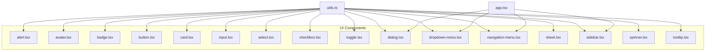

**Diagram sources**
- [alert.tsx:1-67](file://resources/js/components/ui/alert.tsx#L1-L67)
- [avatar.tsx:1-52](file://resources/js/components/ui/avatar.tsx#L1-L52)
- [badge.tsx:1-47](file://resources/js/components/ui/badge.tsx#L1-L47)
- [button.tsx:1-59](file://resources/js/components/ui/button.tsx#L1-L59)
- [card.tsx:1-69](file://resources/js/components/ui/card.tsx#L1-L69)
- [input.tsx:1-22](file://resources/js/components/ui/input.tsx#L1-L22)
- [select.tsx:1-194](file://resources/js/components/ui/select.tsx#L1-L194)
- [checkbox.tsx:1-31](file://resources/js/components/ui/checkbox.tsx#L1-L31)
- [toggle.tsx:1-46](file://resources/js/components/ui/toggle.tsx#L1-L46)
- [dialog.tsx:1-134](file://resources/js/components/ui/dialog.tsx#L1-L134)
- [dropdown-menu.tsx:1-256](file://resources/js/components/ui/dropdown-menu.tsx#L1-L256)
- [navigation-menu.tsx:1-169](file://resources/js/components/ui/navigation-menu.tsx#L1-L169)
- [sheet.tsx:1-138](file://resources/js/components/ui/sheet.tsx#L1-L138)
- [sidebar.tsx:1-720](file://resources/js/components/ui/sidebar.tsx#L1-L720)
- [spinner.tsx:1-17](file://resources/js/components/ui/spinner.tsx#L1-L17)
- [tooltip.tsx:1-56](file://resources/js/components/ui/tooltip.tsx#L1-L56)
- [utils.ts](file://resources/js/lib/utils.ts)
- [app.tsx](file://resources/js/app.tsx)

**Section sources**
- [utils.ts](file://resources/js/lib/utils.ts)
- [app.tsx](file://resources/js/app.tsx)

## Core Components
Below are concise summaries of each component family, focusing on props, variants, and customization.

- Button
  - Props: className, variant, size, asChild, plus native button attributes
  - Variants: default, destructive, outline, secondary, ghost, link
  - Sizes: default, sm, lg, icon
  - Accessibility: integrates focus-visible ring and aria-invalid states
  - Composition: supports rendering as a slot element for semantic flexibility

- Alert
  - Props: className, variant, plus native div attributes
  - Variants: default, destructive
  - Subcomponents: AlertTitle, AlertDescription
  - Accessibility: role="alert"

- Avatar
  - Props: Root, Image, Fallback accept primitive props
  - Subcomponents: Avatar, AvatarImage, AvatarFallback
  - Styling: base size, overflow-hidden, rounded-full

- Badge
  - Props: className, variant, asChild
  - Variants: default, secondary, destructive, outline
  - Composition: asChild enables semantic tag wrapping

- Card
  - Props: Card, CardHeader, CardTitle, CardDescription, CardContent, CardFooter
  - Composition: structured layout helpers for consistent card UI

- Input
  - Props: className, type, plus native input attributes
  - Accessibility: focus-visible ring and aria-invalid integration

- Select
  - Props: Trigger size, Content position/align, Item, Group, Label, Separator
  - Composition: Trigger with icon, Content with viewport and scroll buttons

- Checkbox
  - Props: Primitive root with indicator
  - Accessibility: focus-visible ring and aria-invalid integration

- Toggle
  - Props: variant, size
  - Variants: default, outline
  - Sizes: default, sm, lg

- Dialog
  - Props: Root, Trigger, Portal, Close, Overlay, Content, Header/Footer, Title, Description
  - Composition: overlay and content with animations and close button

- Dropdown Menu
  - Props: Root, Trigger, Portal, Content, Items (including checkbox/radio), Groups, Labels, Separators, Shortcuts, Submenus
  - Composition: nested menu system with indicators and icons

- Navigation Menu
  - Props: Root viewport flag, List, Item, Trigger, Content, Link, Indicator, Viewport
  - Composition: horizontal menu with animated content and indicator

- Sheet
  - Props: Root, Trigger, Close, Portal, Overlay, Content (with side), Header/Footer, Title, Description
  - Composition: slide-in panels from sides with overlay

- Sidebar
  - Props: Provider (defaultOpen, open, onOpenChange), Sidebar (side, variant, collapsible), SidebarTrigger, SidebarRail, SidebarInset, SidebarHeader/Footer/Content, SidebarInput, SidebarSeparator, SidebarMenu/Item/Button/Action/Badge/Skeleton/Sub/SubItem/SubButton
  - State: Cookie-backed persistence, keyboard shortcut, mobile off-canvas, desktop collapsible/floating/inset variants
  - Composition: integrates Button, Input, Separator, Sheet, Skeleton, Tooltip

- Spinner
  - Props: className, plus native svg attributes
  - Accessibility: role="status" and aria-label

- Tooltip
  - Props: Provider (delayDuration), Root, Trigger, Content (sideOffset)
  - Composition: Provider wraps trigger/content pair

**Section sources**
- [button.tsx:1-59](file://resources/js/components/ui/button.tsx#L1-L59)
- [alert.tsx:1-67](file://resources/js/components/ui/alert.tsx#L1-L67)
- [avatar.tsx:1-52](file://resources/js/components/ui/avatar.tsx#L1-L52)
- [badge.tsx:1-47](file://resources/js/components/ui/badge.tsx#L1-L47)
- [card.tsx:1-69](file://resources/js/components/ui/card.tsx#L1-L69)
- [input.tsx:1-22](file://resources/js/components/ui/input.tsx#L1-L22)
- [select.tsx:1-194](file://resources/js/components/ui/select.tsx#L1-L194)
- [checkbox.tsx:1-31](file://resources/js/components/ui/checkbox.tsx#L1-L31)
- [toggle.tsx:1-46](file://resources/js/components/ui/toggle.tsx#L1-L46)
- [dialog.tsx:1-134](file://resources/js/components/ui/dialog.tsx#L1-L134)
- [dropdown-menu.tsx:1-256](file://resources/js/components/ui/dropdown-menu.tsx#L1-L256)
- [navigation-menu.tsx:1-169](file://resources/js/components/ui/navigation-menu.tsx#L1-L169)
- [sheet.tsx:1-138](file://resources/js/components/ui/sheet.tsx#L1-L138)
- [sidebar.tsx:1-720](file://resources/js/components/ui/sidebar.tsx#L1-L720)
- [spinner.tsx:1-17](file://resources/js/components/ui/spinner.tsx#L1-L17)
- [tooltip.tsx:1-56](file://resources/js/components/ui/tooltip.tsx#L1-L56)

## Architecture Overview
The library follows a consistent pattern:
- Each component file exports a root component and related subcomponents
- Styling is centralized via cn and Tailwind classes
- Compound components coordinate state and animations using Radix UI
- Shared utilities (cn) ensure consistent class merging

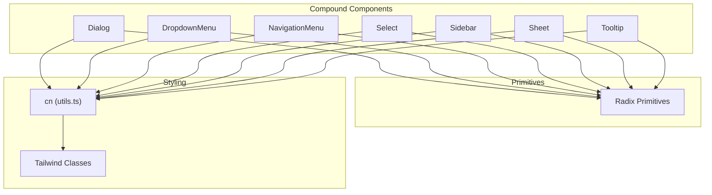

**Diagram sources**
- [dialog.tsx:1-134](file://resources/js/components/ui/dialog.tsx#L1-L134)
- [dropdown-menu.tsx:1-256](file://resources/js/components/ui/dropdown-menu.tsx#L1-L256)
- [navigation-menu.tsx:1-169](file://resources/js/components/ui/navigation-menu.tsx#L1-L169)
- [select.tsx:1-194](file://resources/js/components/ui/select.tsx#L1-L194)
- [sidebar.tsx:1-720](file://resources/js/components/ui/sidebar.tsx#L1-L720)
- [sheet.tsx:1-138](file://resources/js/components/ui/sheet.tsx#L1-L138)
- [tooltip.tsx:1-56](file://resources/js/components/ui/tooltip.tsx#L1-L56)
- [utils.ts](file://resources/js/lib/utils.ts)

## Detailed Component Analysis

### Button
- Purpose: Base interactive element with variants and sizes
- Props: className, variant, size, asChild, plus native button attributes
- Variants and sizes: defined via class-variance-authority
- Accessibility: focus-visible ring, aria-invalid integration
- Composition: asChild allows rendering as anchor or other elements

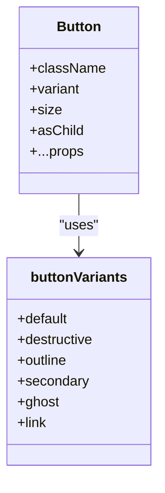

**Diagram sources**
- [button.tsx:1-59](file://resources/js/components/ui/button.tsx#L1-L59)

**Section sources**
- [button.tsx:1-59](file://resources/js/components/ui/button.tsx#L1-L59)

### Alert
- Purpose: Present contextual messages with optional title and description
- Props: className, variant, plus native div attributes
- Subcomponents: AlertTitle, AlertDescription
- Accessibility: role="alert"

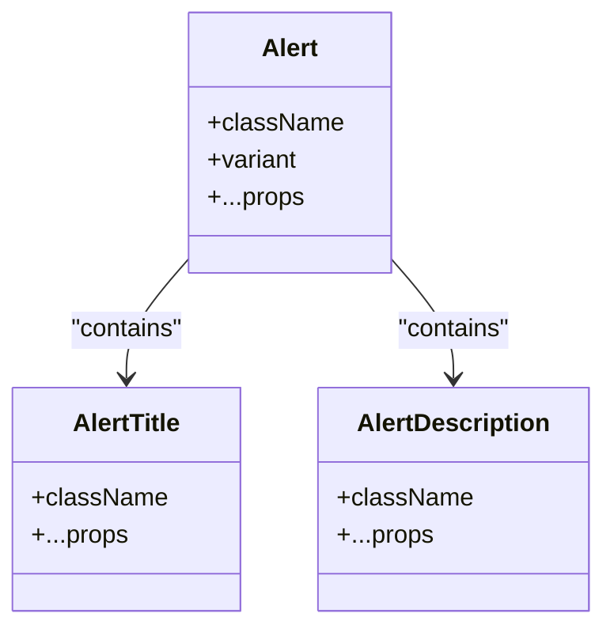

**Diagram sources**
- [alert.tsx:1-67](file://resources/js/components/ui/alert.tsx#L1-L67)

**Section sources**
- [alert.tsx:1-67](file://resources/js/components/ui/alert.tsx#L1-L67)

### Avatar
- Purpose: User identity with image fallback
- Props: Root, Image, Fallback accept primitive props
- Styling: base size, overflow-hidden, rounded-full

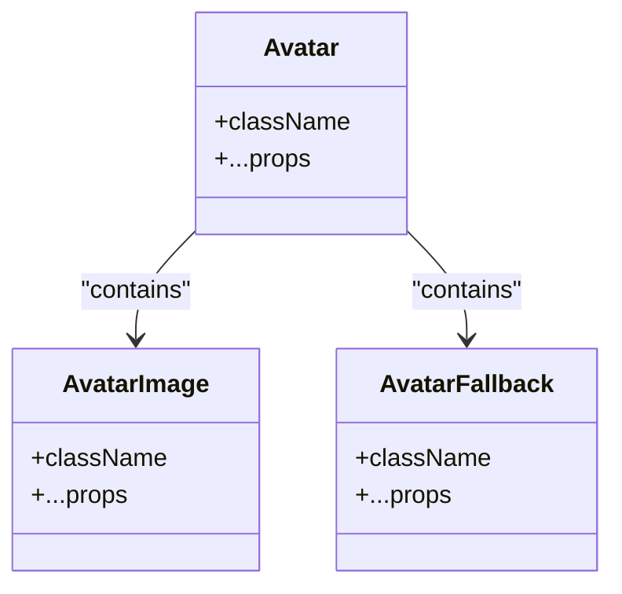

**Diagram sources**
- [avatar.tsx:1-52](file://resources/js/components/ui/avatar.tsx#L1-L52)

**Section sources**
- [avatar.tsx:1-52](file://resources/js/components/ui/avatar.tsx#L1-L52)

### Badge
- Purpose: Short labels for tags and statuses
- Props: className, variant, asChild
- Variants: default, secondary, destructive, outline

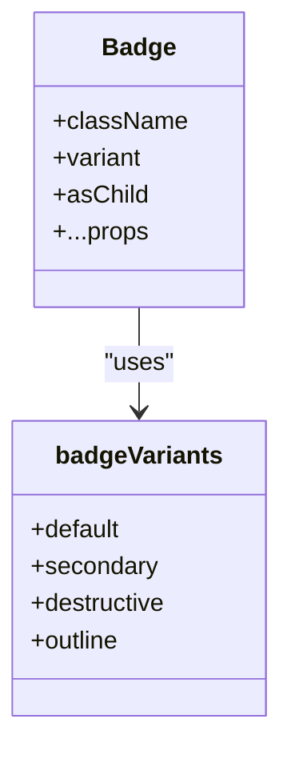

**Diagram sources**
- [badge.tsx:1-47](file://resources/js/components/ui/badge.tsx#L1-L47)

**Section sources**
- [badge.tsx:1-47](file://resources/js/components/ui/badge.tsx#L1-L47)

### Card
- Purpose: Content containers with standardized sections
- Props: Card, CardHeader, CardTitle, CardDescription, CardContent, CardFooter

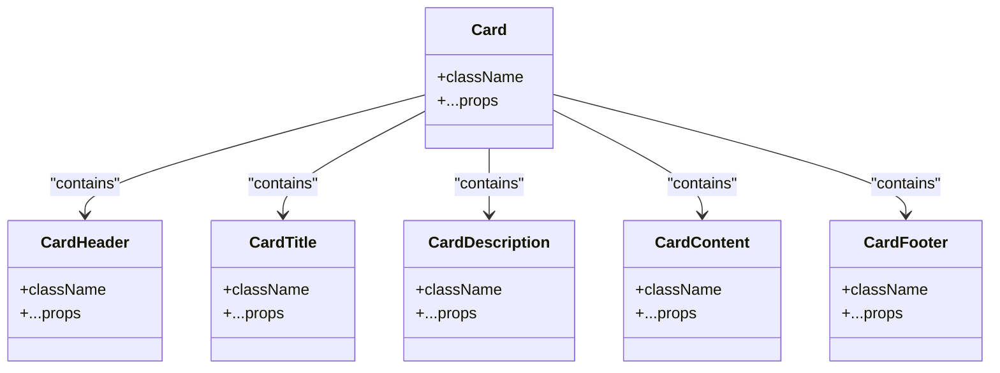

**Diagram sources**
- [card.tsx:1-69](file://resources/js/components/ui/card.tsx#L1-L69)

**Section sources**
- [card.tsx:1-69](file://resources/js/components/ui/card.tsx#L1-L69)

### Inputs and Form Controls
- Input: Native input with focus-visible ring and aria-invalid integration
- Select: Trigger with icon, Content with viewport and scroll buttons, Items with indicators
- Checkbox: Primitive with indicator and focus-visible ring
- Toggle: Primitive with variants and sizes

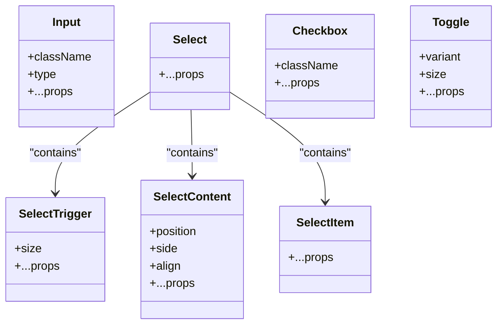

**Diagram sources**
- [input.tsx:1-22](file://resources/js/components/ui/input.tsx#L1-L22)
- [select.tsx:1-194](file://resources/js/components/ui/select.tsx#L1-L194)
- [checkbox.tsx:1-31](file://resources/js/components/ui/checkbox.tsx#L1-L31)
- [toggle.tsx:1-46](file://resources/js/components/ui/toggle.tsx#L1-L46)

**Section sources**
- [input.tsx:1-22](file://resources/js/components/ui/input.tsx#L1-L22)
- [select.tsx:1-194](file://resources/js/components/ui/select.tsx#L1-L194)
- [checkbox.tsx:1-31](file://resources/js/components/ui/checkbox.tsx#L1-L31)
- [toggle.tsx:1-46](file://resources/js/components/ui/toggle.tsx#L1-L46)

### Dialog
- Purpose: Modal overlays with header/footer, title, and description
- Props: Root, Trigger, Portal, Close, Overlay, Content, Header/Footer, Title, Description
- Behavior: Animated overlay and content; close button included

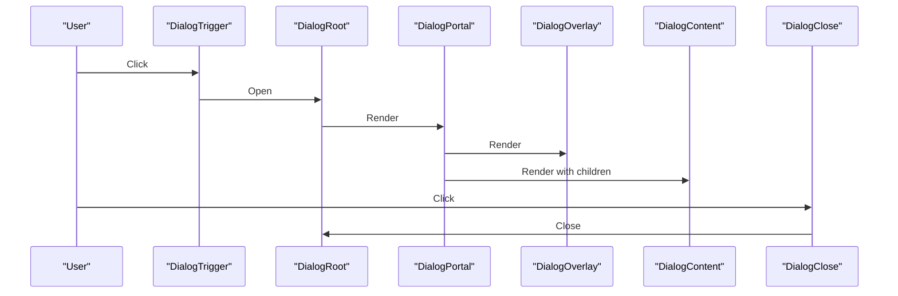

**Diagram sources**
- [dialog.tsx:1-134](file://resources/js/components/ui/dialog.tsx#L1-L134)

**Section sources**
- [dialog.tsx:1-134](file://resources/js/components/ui/dialog.tsx#L1-L134)

### Dropdown Menu
- Purpose: Contextual menus with groups, labels, checkboxes, radios, and submenus
- Props: Root, Trigger, Portal, Content, Items, Groups, Labels, Separators, Shortcuts, Submenus
- Behavior: Indicators, icons, and nested sub-content

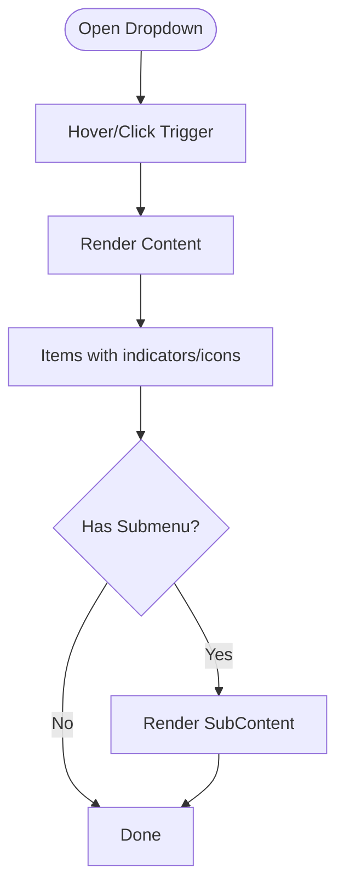

**Diagram sources**
- [dropdown-menu.tsx:1-256](file://resources/js/components/ui/dropdown-menu.tsx#L1-L256)

**Section sources**
- [dropdown-menu.tsx:1-256](file://resources/js/components/ui/dropdown-menu.tsx#L1-L256)

### Navigation Menu
- Purpose: Horizontal navigation with animated content and indicator
- Props: Root viewport flag, List, Item, Trigger, Content, Link, Indicator, Viewport
- Behavior: Animated transitions and viewport sizing

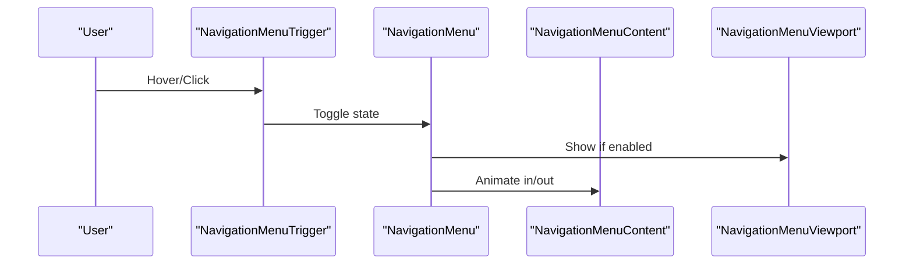

**Diagram sources**
- [navigation-menu.tsx:1-169](file://resources/js/components/ui/navigation-menu.tsx#L1-L169)

**Section sources**
- [navigation-menu.tsx:1-169](file://resources/js/components/ui/navigation-menu.tsx#L1-L169)

### Sheet
- Purpose: Slide-in panels from sides with overlay and close button
- Props: Root, Trigger, Close, Portal, Overlay, Content (with side), Header/Footer, Title, Description

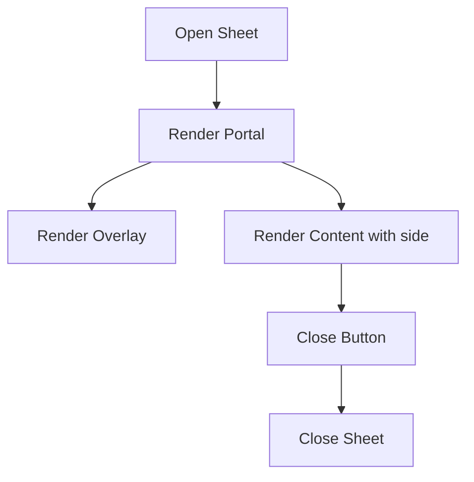

**Diagram sources**
- [sheet.tsx:1-138](file://resources/js/components/ui/sheet.tsx#L1-L138)

**Section sources**
- [sheet.tsx:1-138](file://resources/js/components/ui/sheet.tsx#L1-L138)

### Sidebar
- Purpose: Responsive sidebar with multiple variants and collapsible modes
- Props: Provider (defaultOpen, open, onOpenChange), Sidebar (side, variant, collapsible), SidebarTrigger, SidebarRail, SidebarInset, SidebarHeader/Footer/Content, SidebarInput, SidebarSeparator, SidebarMenu/Item/Button/Action/Badge/Skeleton/Sub/SubItem/SubButton
- State: Cookie-backed persistence, keyboard shortcut, mobile off-canvas, desktop collapsible/floating/inset variants
- Composition: Integrates Button, Input, Separator, Sheet, Skeleton, Tooltip

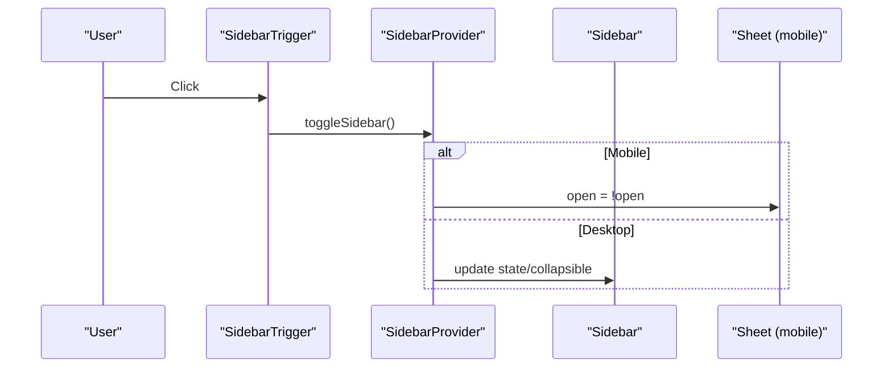

**Diagram sources**
- [sidebar.tsx:1-720](file://resources/js/components/ui/sidebar.tsx#L1-L720)

**Section sources**
- [sidebar.tsx:1-720](file://resources/js/components/ui/sidebar.tsx#L1-L720)

### Spinner
- Purpose: Loading indicator with accessible role and label
- Props: className, plus native svg attributes

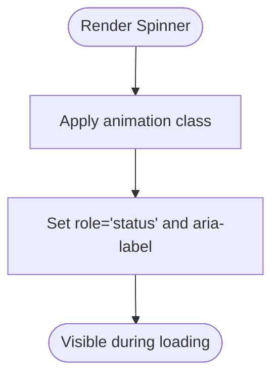

**Diagram sources**
- [spinner.tsx:1-17](file://resources/js/components/ui/spinner.tsx#L1-L17)

**Section sources**
- [spinner.tsx:1-17](file://resources/js/components/ui/spinner.tsx#L1-L17)

### Tooltip
- Purpose: Brief help text with arrow and portal rendering
- Props: Provider (delayDuration), Root, Trigger, Content (sideOffset)

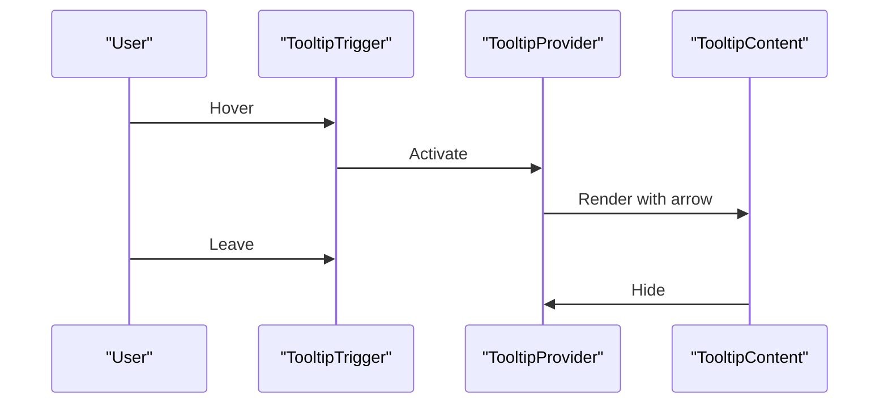

**Diagram sources**
- [tooltip.tsx:1-56](file://resources/js/components/ui/tooltip.tsx#L1-L56)

**Section sources**
- [tooltip.tsx:1-56](file://resources/js/components/ui/tooltip.tsx#L1-L56)

## Dependency Analysis
- Internal dependencies:
  - All components depend on cn from utils.ts for class merging
  - Compound components import Radix UI primitives and compose them
- External dependencies:
  - Radix UI primitives for accessible base behavior
  - Lucide icons for decorative and interactive elements
  - class-variance-authority for variant and size systems

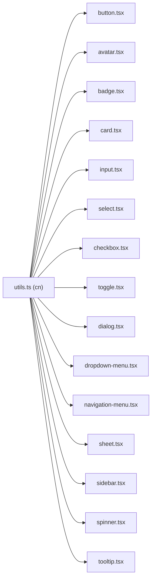

**Diagram sources**
- [utils.ts](file://resources/js/lib/utils.ts)
- [button.tsx:1-59](file://resources/js/components/ui/button.tsx#L1-L59)
- [avatar.tsx:1-52](file://resources/js/components/ui/avatar.tsx#L1-L52)
- [badge.tsx:1-47](file://resources/js/components/ui/badge.tsx#L1-L47)
- [card.tsx:1-69](file://resources/js/components/ui/card.tsx#L1-L69)
- [input.tsx:1-22](file://resources/js/components/ui/input.tsx#L1-L22)
- [select.tsx:1-194](file://resources/js/components/ui/select.tsx#L1-L194)
- [checkbox.tsx:1-31](file://resources/js/components/ui/checkbox.tsx#L1-L31)
- [toggle.tsx:1-46](file://resources/js/components/ui/toggle.tsx#L1-L46)
- [dialog.tsx:1-134](file://resources/js/components/ui/dialog.tsx#L1-L134)
- [dropdown-menu.tsx:1-256](file://resources/js/components/ui/dropdown-menu.tsx#L1-L256)
- [navigation-menu.tsx:1-169](file://resources/js/components/ui/navigation-menu.tsx#L1-L169)
- [sheet.tsx:1-138](file://resources/js/components/ui/sheet.tsx#L1-L138)
- [sidebar.tsx:1-720](file://resources/js/components/ui/sidebar.tsx#L1-L720)
- [spinner.tsx:1-17](file://resources/js/components/ui/spinner.tsx#L1-L17)
- [tooltip.tsx:1-56](file://resources/js/components/ui/tooltip.tsx#L1-L56)

**Section sources**
- [utils.ts](file://resources/js/lib/utils.ts)
- [button.tsx:1-59](file://resources/js/components/ui/button.tsx#L1-L59)
- [sidebar.tsx:1-720](file://resources/js/components/ui/sidebar.tsx#L1-L720)

## Performance Considerations
- Prefer variant and size props over ad-hoc classes to leverage class-variance-authority for minimal CSS
- Use asChild patterns to avoid unnecessary DOM nodes while preserving semantics
- Compound components render portals to minimize layout thrashing
- Cookie-backed state in Sidebar reduces server round-trips for persisted preferences
- Skeleton placeholders in Sidebar reduce perceived load during async content rendering

## Troubleshooting Guide
- Focus styles and accessibility
  - Buttons, inputs, checkboxes, toggles apply focus-visible rings and aria-invalid borders; ensure form validation updates aria-invalid appropriately
- Dialog and Sheet overlays
  - Verify Portal is rendered and Overlay animates in/out; check that Close button is reachable via keyboard
- Dropdown and Navigation menus
  - Confirm submenus render via Portals and indicators reflect checked/radio states
- Sidebar responsiveness
  - On mobile, ensure Sheet is used; on desktop, verify collapsible/floating/inset variants behave as expected
- Tooltip delays
  - Adjust provider delayDuration for rapid hover scenarios

**Section sources**
- [button.tsx:1-59](file://resources/js/components/ui/button.tsx#L1-L59)
- [input.tsx:1-22](file://resources/js/components/ui/input.tsx#L1-L22)
- [checkbox.tsx:1-31](file://resources/js/components/ui/checkbox.tsx#L1-L31)
- [toggle.tsx:1-46](file://resources/js/components/ui/toggle.tsx#L1-L46)
- [dialog.tsx:1-134](file://resources/js/components/ui/dialog.tsx#L1-L134)
- [dropdown-menu.tsx:1-256](file://resources/js/components/ui/dropdown-menu.tsx#L1-L256)
- [navigation-menu.tsx:1-169](file://resources/js/components/ui/navigation-menu.tsx#L1-L169)
- [sheet.tsx:1-138](file://resources/js/components/ui/sheet.tsx#L1-L138)
- [sidebar.tsx:1-720](file://resources/js/components/ui/sidebar.tsx#L1-L720)
- [tooltip.tsx:1-56](file://resources/js/components/ui/tooltip.tsx#L1-L56)

## Conclusion
ScholarGraph’s component library provides a cohesive, accessible, and extensible set of UI primitives built on Radix UI. By centralizing styling with cn and Tailwind, and by offering consistent variants and composition patterns, the library promotes reuse, maintainability, and a unified design language across the application.