# Custom Hooks

<cite>
**Referenced Files in This Document**
- [use-appearance.tsx](file://resources/js/hooks/use-appearance.tsx)
- [use-clipboard.ts](file://resources/js/hooks/use-clipboard.ts)
- [use-current-url.ts](file://resources/js/hooks/use-current-url.ts)
- [use-flash-toast.ts](file://resources/js/hooks/use-flash-toast.ts)
- [use-initials.tsx](file://resources/js/hooks/use-initials.tsx)
- [use-mobile-navigation.ts](file://resources/js/hooks/use-mobile-navigation.ts)
- [use-mobile.tsx](file://resources/js/hooks/use-mobile.tsx)
- [use-two-factor-auth.ts](file://resources/js/hooks/use-two-factor-auth.ts)
- [utils.ts](file://resources/js/lib/utils.ts)
- [ui.ts](file://resources/js/types/ui.ts)
- [app-header.tsx](file://resources/js/components/app-header.tsx)
- [appearance-tabs.tsx](file://resources/js/components/appearance-tabs.tsx)
- [manage-two-factor.tsx](file://resources/js/components/manage-two-factor.tsx)
- [appearance.tsx](file://resources/js/pages/settings/appearance.tsx)
</cite>

## Table of Contents
1. [Introduction](#introduction)
2. [Project Structure](#project-structure)
3. [Core Components](#core-components)
4. [Architecture Overview](#architecture-overview)
5. [Detailed Component Analysis](#detailed-component-analysis)
6. [Dependency Analysis](#dependency-analysis)
7. [Performance Considerations](#performance-considerations)
8. [Troubleshooting Guide](#troubleshooting-guide)
9. [Conclusion](#conclusion)
10. [Appendices](#appendices)

## Introduction
This document provides comprehensive documentation for ScholarGraph’s custom React hooks focused on frontend functionality. It covers:
- Appearance management with theme switching and persistence
- Clipboard operations
- URL tracking and navigation helpers
- Toast notifications integrated with server-side flash messages
- User initials generation
- Mobile detection
- Mobile navigation cleanup
- Two-factor authentication utilities

For each hook, we explain implementation patterns, dependencies, return values, and usage examples. We also include best practices for composition, performance optimization, state management integration, testing strategies, error handling, and integration with other frontend components.

## Project Structure
The hooks are located under resources/js/hooks and are consumed by components and pages under resources/js/components and resources/js/pages. Utility functions live under resources/js/lib, and shared types under resources/js/types.

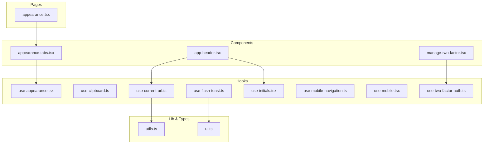

**Diagram sources**
- [use-appearance.tsx:1-116](file://resources/js/hooks/use-appearance.tsx#L1-L116)
- [use-clipboard.ts:1-33](file://resources/js/hooks/use-clipboard.ts#L1-L33)
- [use-current-url.ts:1-84](file://resources/js/hooks/use-current-url.ts#L1-L84)
- [use-flash-toast.ts:1-20](file://resources/js/hooks/use-flash-toast.ts#L1-L20)
- [use-initials.tsx:1-27](file://resources/js/hooks/use-initials.tsx#L1-L27)
- [use-mobile-navigation.ts:1-11](file://resources/js/hooks/use-mobile-navigation.ts#L1-L11)
- [use-mobile.tsx:1-37](file://resources/js/hooks/use-mobile.tsx#L1-L37)
- [use-two-factor-auth.ts:1-112](file://resources/js/hooks/use-two-factor-auth.ts#L1-L112)
- [utils.ts:1-13](file://resources/js/lib/utils.ts#L1-L13)
- [ui.ts:1-22](file://resources/js/types/ui.ts#L1-L22)
- [app-header.tsx:1-249](file://resources/js/components/app-header.tsx#L1-L249)
- [appearance-tabs.tsx:1-46](file://resources/js/components/appearance-tabs.tsx#L1-L46)
- [manage-two-factor.tsx:1-127](file://resources/js/components/manage-two-factor.tsx#L1-L127)
- [appearance.tsx:1-33](file://resources/js/pages/settings/appearance.tsx#L1-L33)

**Section sources**
- [use-appearance.tsx:1-116](file://resources/js/hooks/use-appearance.tsx#L1-L116)
- [use-current-url.ts:1-84](file://resources/js/hooks/use-current-url.ts#L1-L84)
- [use-initials.tsx:1-27](file://resources/js/hooks/use-initials.tsx#L1-L27)
- [use-mobile.tsx:1-37](file://resources/js/hooks/use-mobile.tsx#L1-L37)
- [use-two-factor-auth.ts:1-112](file://resources/js/hooks/use-two-factor-auth.ts#L1-L112)
- [use-clipboard.ts:1-33](file://resources/js/hooks/use-clipboard.ts#L1-L33)
- [use-flash-toast.ts:1-20](file://resources/js/hooks/use-flash-toast.ts#L1-L20)
- [use-mobile-navigation.ts:1-11](file://resources/js/hooks/use-mobile-navigation.ts#L1-L11)
- [utils.ts:1-13](file://resources/js/lib/utils.ts#L1-L13)
- [ui.ts:1-22](file://resources/js/types/ui.ts#L1-L22)
- [app-header.tsx:1-249](file://resources/js/components/app-header.tsx#L1-L249)
- [appearance-tabs.tsx:1-46](file://resources/js/components/appearance-tabs.tsx#L1-L46)
- [manage-two-factor.tsx:1-127](file://resources/js/components/manage-two-factor.tsx#L1-L127)
- [appearance.tsx:1-33](file://resources/js/pages/settings/appearance.tsx#L1-L33)

## Core Components
This section summarizes each hook’s purpose, return shape, and typical usage.

- useAppearance
  - Purpose: Manage light/dark/system theme, persist selection, and react to system preference changes.
  - Returns: { appearance, resolvedAppearance, updateAppearance }
  - Dependencies: localStorage, cookies, matchMedia, DOM APIs.
  - Usage: Appearance toggle UI and SSR initialization.

- useClipboard
  - Purpose: Copy text to the system clipboard with feedback.
  - Returns: [copiedText, copyFn]
  - Dependencies: navigator.clipboard.
  - Usage: Copy-to-clipboard buttons.

- useCurrentUrl
  - Purpose: Determine if a given URL matches the current route; support parent matching and conditional rendering.
  - Returns: { currentUrl, isCurrentUrl, isCurrentOrParentUrl, whenCurrentUrl }
  - Dependencies: @inertiajs/react, utils.toUrl.
  - Usage: Active link highlighting and conditional UI.

- useFlashToast
  - Purpose: Subscribe to Inertia flash events and render toast notifications via a toast library.
  - Returns: void (side-effect hook).
  - Dependencies: @inertiajs/react, sonner.
  - Usage: Page-level effect to surface server-provided flash messages.

- useInitials
  - Purpose: Generate user initials from a full name.
  - Returns: (fullName: string) => string
  - Dependencies: String and regex utilities.
  - Usage: Avatar fallback text.

- useIsMobile
  - Purpose: Detect if viewport width is below a breakpoint.
  - Returns: boolean
  - Dependencies: matchMedia via useSyncExternalStore.
  - Usage: Responsive layouts and mobile-specific UI.

- useMobileNavigation
  - Purpose: Restore pointer-events on the body after closing a mobile sheet/dialog.
  - Returns: Cleanup function
  - Dependencies: DOM manipulation.
  - Usage: After mobile sheet closes.

- useTwoFactorAuth
  - Purpose: Fetch and manage 2FA setup assets and recovery codes; expose actions and state.
  - Returns: { qrCodeSvg, manualSetupKey, recoveryCodesList, hasSetupData, errors, clear* and fetch* methods }
  - Dependencies: @inertiajs/react HTTP client, routes for 2FA endpoints.
  - Usage: 2FA enable/disable flows and recovery code display.

**Section sources**
- [use-appearance.tsx:6-115](file://resources/js/hooks/use-appearance.tsx#L6-L115)
- [use-clipboard.ts:4-32](file://resources/js/hooks/use-clipboard.ts#L4-L32)
- [use-current-url.ts:22-82](file://resources/js/hooks/use-current-url.ts#L22-L82)
- [use-flash-toast.ts:6-19](file://resources/js/hooks/use-flash-toast.ts#L6-L19)
- [use-initials.tsx:3-26](file://resources/js/hooks/use-initials.tsx#L3-L26)
- [use-mobile.tsx:30-36](file://resources/js/hooks/use-mobile.tsx#L30-L36)
- [use-mobile-navigation.ts:3-10](file://resources/js/hooks/use-mobile-navigation.ts#L3-L10)
- [use-two-factor-auth.ts:5-111](file://resources/js/hooks/use-two-factor-auth.ts#L5-L111)

## Architecture Overview
The hooks integrate with Inertia for navigation and SSR, with DOM APIs for theme and responsive behavior, and with a toast library for user feedback. Components consume these hooks to build cohesive UI experiences.

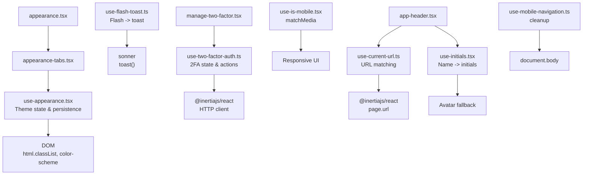

**Diagram sources**
- [use-appearance.tsx:44-53](file://resources/js/hooks/use-appearance.tsx#L44-L53)
- [use-current-url.ts:29-82](file://resources/js/hooks/use-current-url.ts#L29-L82)
- [use-flash-toast.ts:6-19](file://resources/js/hooks/use-flash-toast.ts#L6-L19)
- [use-two-factor-auth.ts:22-111](file://resources/js/hooks/use-two-factor-auth.ts#L22-L111)
- [use-initials.tsx:9-26](file://resources/js/hooks/use-initials.tsx#L9-L26)
- [use-mobile.tsx:30-36](file://resources/js/hooks/use-mobile.tsx#L30-L36)
- [use-mobile-navigation.ts:5-10](file://resources/js/hooks/use-mobile-navigation.ts#L5-L10)
- [app-header.tsx:66-248](file://resources/js/components/app-header.tsx#L66-L248)
- [appearance-tabs.tsx:8-45](file://resources/js/components/appearance-tabs.tsx#L8-L45)
- [appearance.tsx:6-32](file://resources/js/pages/settings/appearance.tsx#L6-L32)
- [manage-two-factor.tsx:17-126](file://resources/js/components/manage-two-factor.tsx#L17-L126)

## Detailed Component Analysis

### Appearance Management Hook (useAppearance)
Purpose
- Centralized theme state with three modes: light, dark, system.
- Persists user choice in localStorage and cookies for SSR compatibility.
- Applies theme to the document element and listens to system preference changes.

Implementation highlights
- Uses a subscriber pattern with a Set of callbacks and a notify mechanism.
- Uses matchMedia to detect system preference and toggles document root classes accordingly.
- Provides an initializer to set defaults and attach media query listeners.

Return values
- appearance: the stored or computed mode
- resolvedAppearance: the effective resolved mode (light or dark)
- updateAppearance(mode): updates state, persists, applies theme, notifies subscribers

Usage examples
- Toggle tab component consumes the hook to switch themes.
- Initialization routine sets up persistence and listeners.

Best practices
- Call the initializer early in the app lifecycle to ensure consistent SSR and client hydration.
- Keep the update function pure aside from side effects; avoid unnecessary re-renders by passing memoized callbacks.

Error handling
- Defensive checks guard against missing browser APIs (window, document, localStorage, matchMedia).

Performance considerations
- Subscriptions are centralized; minimize re-renders by avoiding frequent updates.
- Debounce or coalesce rapid updates if needed.

Integration tips
- Pair with a settings page and a layout wrapper that initializes the theme on mount.

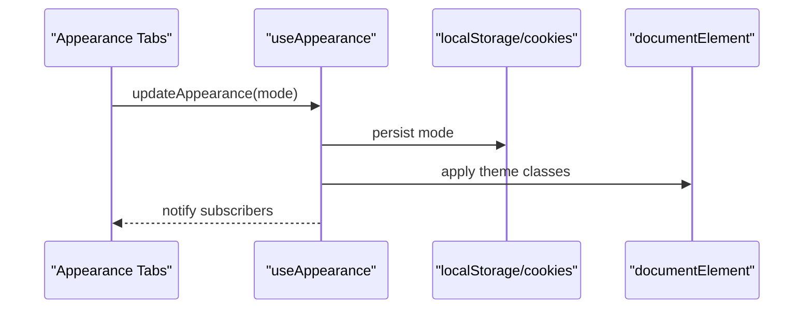

**Diagram sources**
- [appearance-tabs.tsx:12-42](file://resources/js/components/appearance-tabs.tsx#L12-L42)
- [use-appearance.tsx:101-112](file://resources/js/hooks/use-appearance.tsx#L101-L112)
- [use-appearance.tsx:23-30](file://resources/js/hooks/use-appearance.tsx#L23-L30)
- [use-appearance.tsx:44-53](file://resources/js/hooks/use-appearance.tsx#L44-L53)

**Section sources**
- [use-appearance.tsx:1-116](file://resources/js/hooks/use-appearance.tsx#L1-L116)
- [appearance-tabs.tsx:1-46](file://resources/js/components/appearance-tabs.tsx#L1-L46)
- [appearance.tsx:1-33](file://resources/js/pages/settings/appearance.tsx#L1-L33)

### Clipboard Operations Hook (useClipboard)
Purpose
- Provide a simple interface to copy text to the clipboard and track the last copied value.

Implementation highlights
- Uses navigator.clipboard with graceful fallbacks and warnings on unsupported environments.
- Returns a tuple with the current copied text and an async copy function.

Return values
- [copiedText, copy(text)] where copy returns a Promise<boolean> indicating success.

Usage examples
- Copy-to-clipboard buttons in forms or lists.

Best practices
- Always check the returned boolean to conditionally show feedback.
- Avoid copying sensitive data without user confirmation.

Error handling
- Logs warnings and clears state on failures.

Performance considerations
- Minimal overhead; avoid calling copy repeatedly in tight loops.

Testing strategies
- Mock navigator.clipboard and test both success and failure branches.

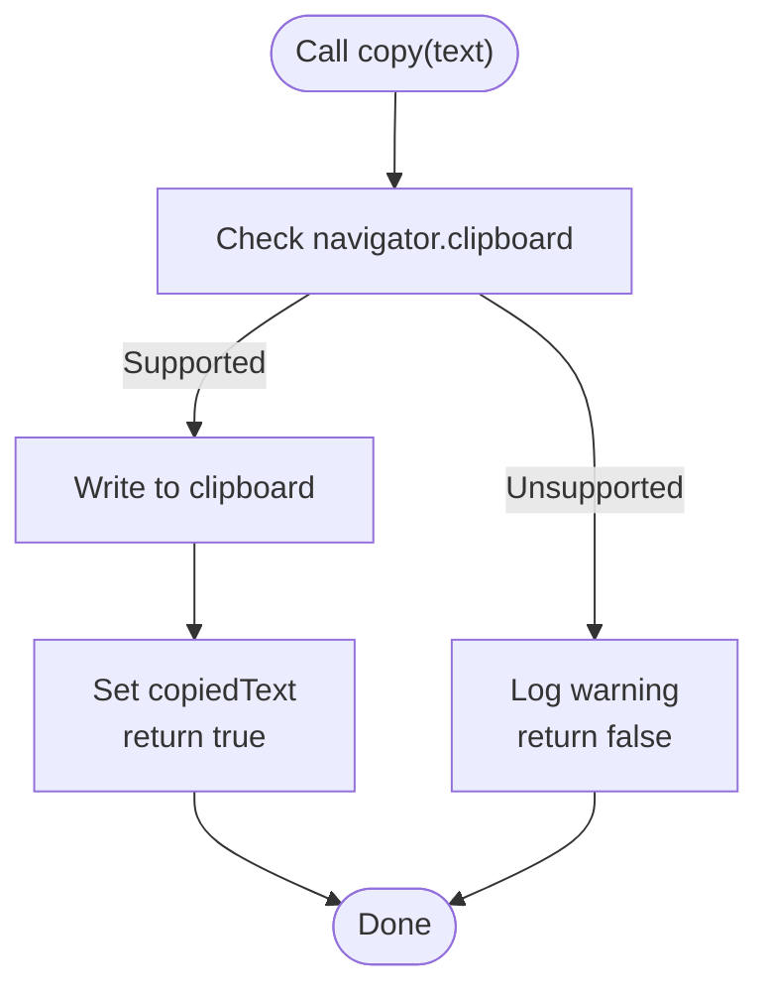

**Diagram sources**
- [use-clipboard.ts:11-29](file://resources/js/hooks/use-clipboard.ts#L11-L29)

**Section sources**
- [use-clipboard.ts:1-33](file://resources/js/hooks/use-clipboard.ts#L1-L33)

### URL Tracking and Navigation Helpers (useCurrentUrl)
Purpose
- Determine if a given URL matches the current location, optionally as a parent path.
- Provide a typed conditional renderer to simplify active-state UI.

Implementation highlights
- Builds a normalized pathname from Inertia’s page.url and window origin.
- Converts href props to strings using a utility and supports absolute URLs.
- Exposes helpers for equality, parent-path inclusion, and conditional returns.

Return values
- { currentUrl, isCurrentUrl, isCurrentOrParentUrl, whenCurrentUrl }

Usage examples
- Highlight active navigation items and render tooltips or badges conditionally.

Best practices
- Prefer whenCurrentUrl for concise conditional rendering.
- Normalize external URLs before comparison.

Error handling
- Gracefully handles malformed absolute URLs by returning false.

Performance considerations
- Keep comparisons lightweight; avoid heavy computations inside repeated renders.

Testing strategies
- Test with relative paths, absolute URLs, and edge cases like trailing slashes.

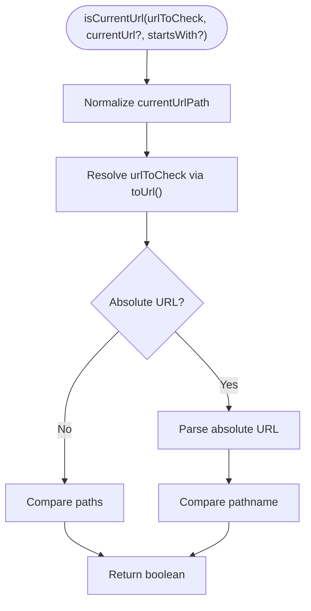

**Diagram sources**
- [use-current-url.ts:38-60](file://resources/js/hooks/use-current-url.ts#L38-L60)
- [utils.ts:10-12](file://resources/js/lib/utils.ts#L10-L12)

**Section sources**
- [use-current-url.ts:1-84](file://resources/js/hooks/use-current-url.ts#L1-L84)
- [utils.ts:1-13](file://resources/js/lib/utils.ts#L1-L13)
- [app-header.tsx:154-176](file://resources/js/components/app-header.tsx#L154-L176)

### Toast Notifications from Flash Messages (useFlashToast)
Purpose
- Bridge server-side flash messages to client-side toasts.

Implementation highlights
- Subscribes to Inertia’s flash event and extracts a typed FlashToast payload.
- Renders toasts using a toast library.

Return values
- None (side-effect hook)

Usage examples
- Place at the root layout/page to globally surface flash messages.

Best practices
- Ensure FlashToast conforms to the expected shape to avoid runtime errors.
- Keep messages concise and actionable.

Error handling
- Safely guards against missing or malformed flash data.

Performance considerations
- One-time subscription; minimal overhead.

Testing strategies
- Emit Inertia flash events in tests and assert toast library calls.

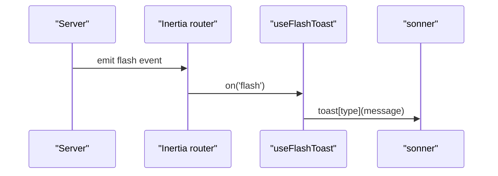

**Diagram sources**
- [use-flash-toast.ts:6-19](file://resources/js/hooks/use-flash-toast.ts#L6-L19)
- [ui.ts:11-14](file://resources/js/types/ui.ts#L11-L14)

**Section sources**
- [use-flash-toast.ts:1-20](file://resources/js/hooks/use-flash-toast.ts#L1-L20)
- [ui.ts:1-22](file://resources/js/types/ui.ts#L1-L22)

### User Initials Generation (useInitials)
Purpose
- Convert a full name into initials, handling single and multi-part names.

Implementation highlights
- Trims and splits by whitespace, filters empty parts, and selects first and last parts.
- Returns uppercase initials or empty string for invalid inputs.

Return values
- (fullName: string) => string

Usage examples
- Avatar fallback text in user menus.

Best practices
- Normalize input (trim, collapse whitespace) before calling.
- Consider locale-specific name parsing if needed.

Performance considerations
- Pure function; negligible cost.

Testing strategies
- Test empty, single, and multi-name inputs.

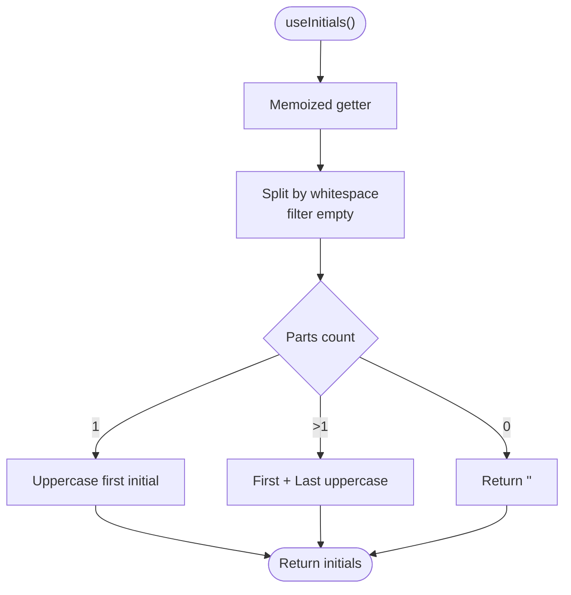

**Diagram sources**
- [use-initials.tsx:9-26](file://resources/js/hooks/use-initials.tsx#L9-L26)

**Section sources**
- [use-initials.tsx:1-27](file://resources/js/hooks/use-initials.tsx#L1-L27)
- [app-header.tsx:224-226](file://resources/js/components/app-header.tsx#L224-L226)

### Mobile Detection Hook (useIsMobile)
Purpose
- Detect if the viewport width is below a predefined breakpoint.

Implementation highlights
- Uses matchMedia via useSyncExternalStore to subscribe to media query changes.
- Provides a server snapshot to avoid hydration mismatches.

Return values
- boolean

Usage examples
- Conditionally render mobile navigation or adjust layout.

Best practices
- Use for responsive UI decisions; avoid heavy logic in render based on this hook.

Performance considerations
- Efficient; relies on native media queries.

Testing strategies
- Mock matchMedia in tests.

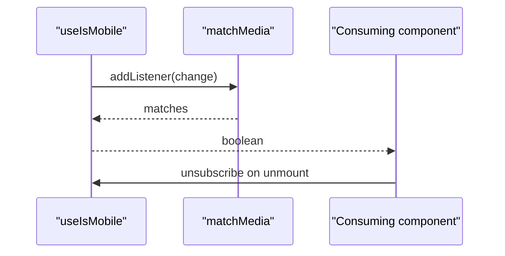

**Diagram sources**
- [use-mobile.tsx:30-36](file://resources/js/hooks/use-mobile.tsx#L30-L36)
- [use-mobile.tsx:5-20](file://resources/js/hooks/use-mobile.tsx#L5-L20)

**Section sources**
- [use-mobile.tsx:1-37](file://resources/js/hooks/use-mobile.tsx#L1-L37)

### Mobile Navigation Cleanup (useMobileNavigation)
Purpose
- Restore pointer-events on the document body after closing a mobile sheet.

Implementation highlights
- Returns a cleanup function that removes the inline style.

Return values
- Cleanup function

Usage examples
- Call in an effect after a mobile sheet closes.

Best practices
- Ensure cleanup runs reliably (e.g., in a cleanup effect).

Performance considerations
- Minimal overhead.

Testing strategies
- Verify that pointer-events are restored after invoking the cleanup.

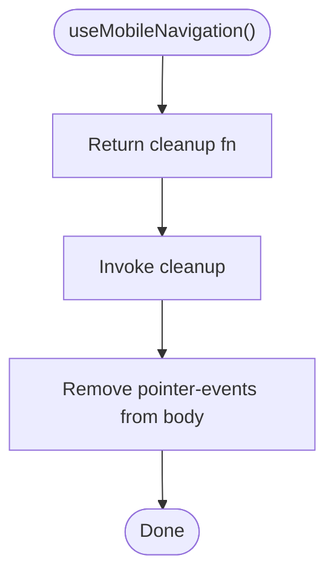

**Diagram sources**
- [use-mobile-navigation.ts:5-10](file://resources/js/hooks/use-mobile-navigation.ts#L5-L10)

**Section sources**
- [use-mobile-navigation.ts:1-11](file://resources/js/hooks/use-mobile-navigation.ts#L1-L11)

### Two-Factor Authentication Utilities (useTwoFactorAuth)
Purpose
- Manage QR code SVG, manual setup key, and recovery codes for 2FA setup and management.

Implementation highlights
- Uses an HTTP client to fetch assets and recovery codes.
- Maintains internal state and exposes actions to clear and refresh data.
- Aggregates errors and exposes a convenience flag for setup presence.

Return values
- { qrCodeSvg, manualSetupKey, recoveryCodesList, hasSetupData, errors, clear* and fetch* methods }

Usage examples
- Enable 2FA flow, display QR code, enter setup key, and show recovery codes.

Best practices
- Clear partial setup data when disabling 2FA.
- Use Promise.all to fetch related assets concurrently.

Error handling
- Catches failures and appends user-friendly error messages.

Performance considerations
- Avoid redundant fetches; cache where appropriate.
- Debounce user-triggered actions if needed.

Testing strategies
- Mock HTTP responses for success and failure scenarios.
- Verify state transitions and error accumulation.

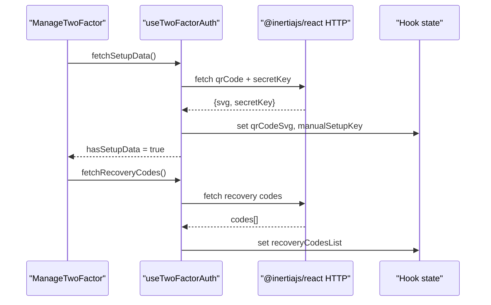

**Diagram sources**
- [use-two-factor-auth.ts:87-95](file://resources/js/hooks/use-two-factor-auth.ts#L87-L95)
- [use-two-factor-auth.ts:76-85](file://resources/js/hooks/use-two-factor-auth.ts#L76-L85)
- [manage-two-factor.tsx:31-41](file://resources/js/components/manage-two-factor.tsx#L31-L41)

**Section sources**
- [use-two-factor-auth.ts:1-112](file://resources/js/hooks/use-two-factor-auth.ts#L1-L112)
- [manage-two-factor.tsx:1-127](file://resources/js/components/manage-two-factor.tsx#L1-L127)

## Dependency Analysis
- InertiaJS: used for URL tracking, HTTP requests, and flash events.
- DOM APIs: matchMedia, localStorage, cookies, documentElement.classList.
- Third-party toast library: used for flash notifications.
- Tailwind merge and clsx: utility for class merging.

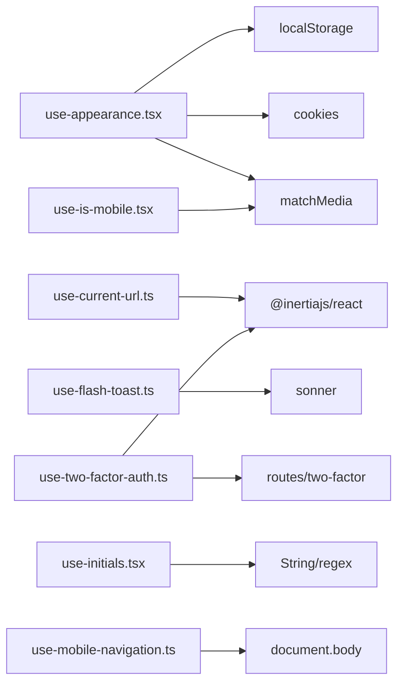

**Diagram sources**
- [use-appearance.tsx:23-30](file://resources/js/hooks/use-appearance.tsx#L23-L30)
- [use-current-url.ts:1-3](file://resources/js/hooks/use-current-url.ts#L1-L3)
- [use-flash-toast.ts:1-4](file://resources/js/hooks/use-flash-toast.ts#L1-L4)
- [use-two-factor-auth.ts:1-4](file://resources/js/hooks/use-two-factor-auth.ts#L1-L4)
- [use-initials.tsx:1-1](file://resources/js/hooks/use-initials.tsx#L1-L1)
- [use-mobile.tsx:1-1](file://resources/js/hooks/use-mobile.tsx#L1-L1)
- [use-mobile-navigation.ts:1-1](file://resources/js/hooks/use-mobile-navigation.ts#L1-L1)

**Section sources**
- [use-appearance.tsx:1-116](file://resources/js/hooks/use-appearance.tsx#L1-L116)
- [use-current-url.ts:1-84](file://resources/js/hooks/use-current-url.ts#L1-L84)
- [use-flash-toast.ts:1-20](file://resources/js/hooks/use-flash-toast.ts#L1-L20)
- [use-two-factor-auth.ts:1-112](file://resources/js/hooks/use-two-factor-auth.ts#L1-L112)
- [use-initials.tsx:1-27](file://resources/js/hooks/use-initials.tsx#L1-L27)
- [use-mobile.tsx:1-37](file://resources/js/hooks/use-mobile.tsx#L1-L37)
- [use-mobile-navigation.ts:1-11](file://resources/js/hooks/use-mobile-navigation.ts#L1-L11)

## Performance Considerations
- Minimize re-renders by memoizing callbacks and values returned by hooks.
- Use useSyncExternalStore for subscriptions to ensure efficient updates.
- Defer expensive computations off the render path.
- Avoid redundant network calls; cache and deduplicate requests.
- Keep DOM mutations localized and scoped to dedicated hooks.

## Troubleshooting Guide
- Clipboard not supported
  - Symptom: Copy attempts log warnings and return false.
  - Resolution: Provide a fallback UX (e.g., select-all text) and inform the user.
  - Section sources
    - [use-clipboard.ts:12-16](file://resources/js/hooks/use-clipboard.ts#L12-L16)

- Theme not applying on SSR
  - Symptom: Initial theme mismatch between server and client.
  - Resolution: Initialize theme early and ensure cookie/localStorage sync.
  - Section sources
    - [use-appearance.tsx:73-88](file://resources/js/hooks/use-appearance.tsx#L73-L88)

- Flash toast not appearing
  - Symptom: No toast despite server flash messages.
  - Resolution: Confirm the flash event emission and that the hook is mounted.
  - Section sources
    - [use-flash-toast.ts:6-19](file://resources/js/hooks/use-flash-toast.ts#L6-L19)

- 2FA fetch failures
  - Symptom: Errors accumulate and state resets.
  - Resolution: Inspect network responses and endpoint availability.
  - Section sources
    - [use-two-factor-auth.ts:49-61](file://resources/js/hooks/use-two-factor-auth.ts#L49-L61)
    - [use-two-factor-auth.ts:63-74](file://resources/js/hooks/use-two-factor-auth.ts#L63-L74)
    - [use-two-factor-auth.ts:76-85](file://resources/js/hooks/use-two-factor-auth.ts#L76-L85)

## Conclusion
These hooks encapsulate common frontend concerns—theme management, clipboard operations, URL awareness, toast notifications, user initials, responsive behavior, mobile navigation cleanup, and 2FA workflows—into reusable, composable primitives. By following the best practices outlined here, teams can maintain predictable behavior, strong error handling, and excellent user experience across the application.

## Appendices
- Testing strategies summary
  - useClipboard: mock navigator.clipboard, assert returned boolean and state changes.
  - useCurrentUrl: test relative/absolute URLs, parent matching, and normalization.
  - useFlashToast: simulate Inertia flash events and assert toast invocations.
  - useTwoFactorAuth: mock HTTP responses, verify state transitions and error accumulation.
  - useAppearance: verify persistence, DOM class toggling, and media query handling.
  - useIsMobile: mock matchMedia and assert boolean transitions.
  - useMobileNavigation: verify pointer-events restoration.
  - useInitials: test various name formats and edge cases.