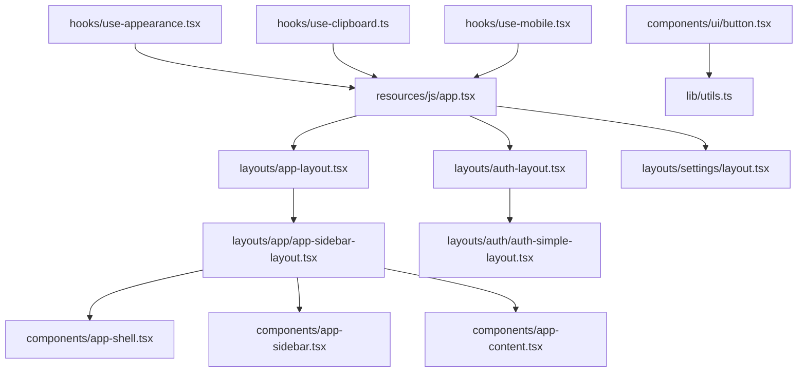
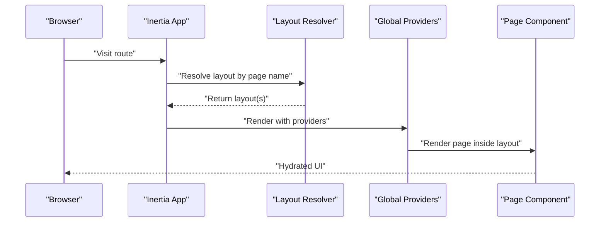
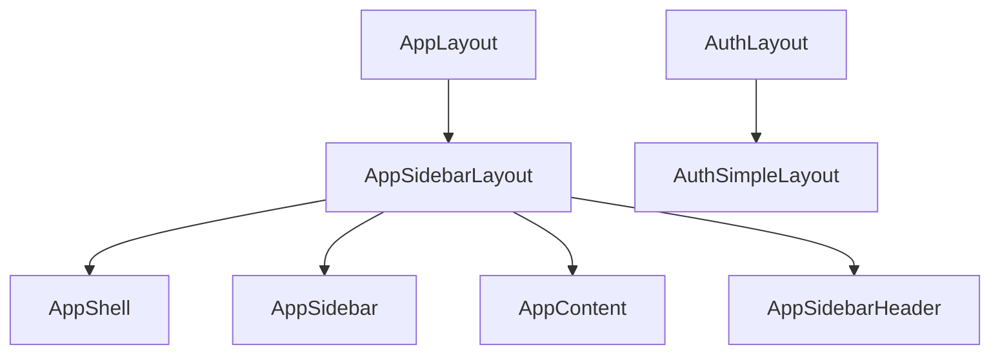
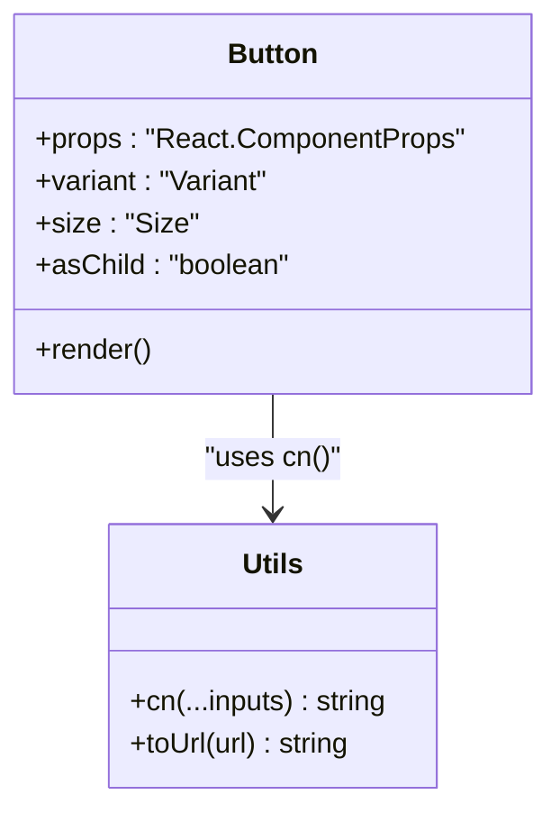
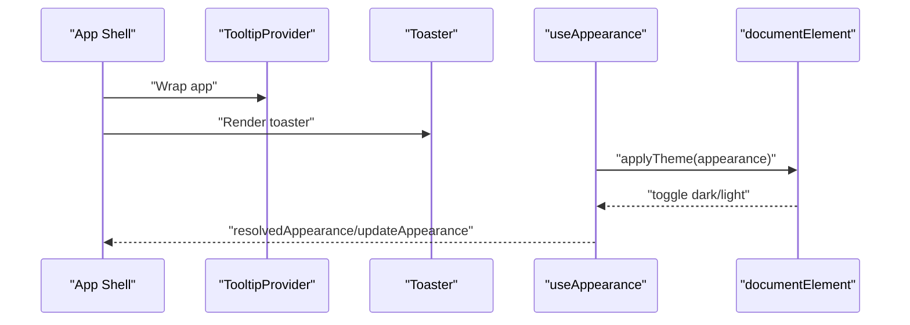
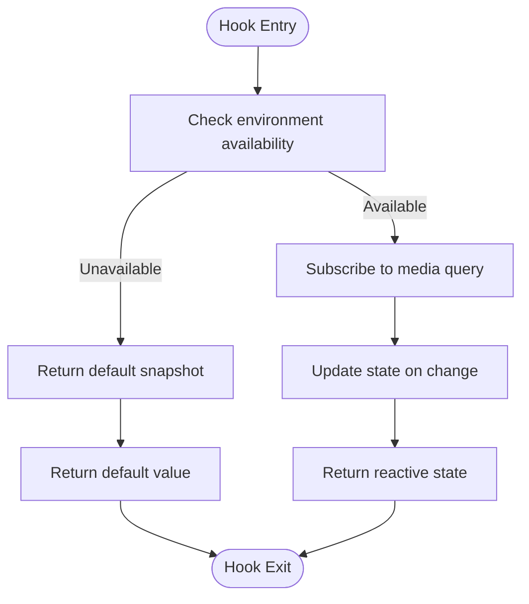
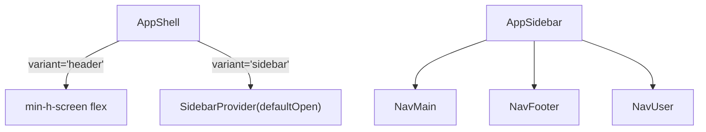
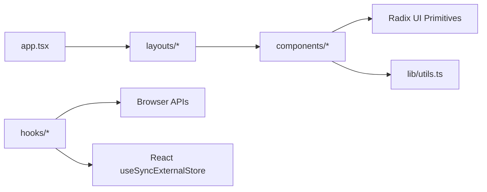

# Frontend Architecture

<cite>
**Referenced Files in This Document**
- [app.tsx](file://resources/js/app.tsx)
- [utils.ts](file://resources/js/lib/utils.ts)
- [index.ts](file://resources/js/types/index.ts)
- [ui.ts](file://resources/js/types/ui.ts)
- [app-layout.tsx](file://resources/js/layouts/app-layout.tsx)
- [auth-layout.tsx](file://resources/js/layouts/auth-layout.tsx)
- [app-sidebar-layout.tsx](file://resources/js/layouts/app/app-sidebar-layout.tsx)
- [auth-simple-layout.tsx](file://resources/js/layouts/auth/auth-simple-layout.tsx)
- [app-shell.tsx](file://resources/js/components/app-shell.tsx)
- [app-sidebar.tsx](file://resources/js/components/app-sidebar.tsx)
- [button.tsx](file://resources/js/components/ui/button.tsx)
- [use-appearance.tsx](file://resources/js/hooks/use-appearance.tsx)
- [use-clipboard.ts](file://resources/js/hooks/use-clipboard.ts)
- [use-mobile.tsx](file://resources/js/hooks/use-mobile.tsx)
</cite>

## Table of Contents
1. [Introduction](#introduction)
2. [Project Structure](#project-structure)
3. [Core Components](#core-components)
4. [Architecture Overview](#architecture-overview)
5. [Detailed Component Analysis](#detailed-component-analysis)
6. [Dependency Analysis](#dependency-analysis)
7. [Performance Considerations](#performance-considerations)
8. [Troubleshooting Guide](#troubleshooting-guide)
9. [Conclusion](#conclusion)

## Introduction
This document describes the frontend architecture of ScholarGraph’s React/TypeScript implementation. It focuses on the component-based design, Inertia.js integration, a custom UI library built on Radix UI primitives, and state management strategies. It also documents the layout system (app, auth, and settings), component hierarchy, prop interfaces, reusability patterns, and key hooks for appearance, clipboard, mobile detection, and two-factor authentication. Backend integration patterns and TypeScript typing are covered to help developers build and extend the interface effectively.

## Project Structure
The frontend is organized around a clear separation of concerns:
- app.tsx: Application entry point configuring Inertia.js, layout selection, and global providers.
- layouts/: Page-level layout wrappers for app, auth, and settings contexts.
- components/: Reusable UI components and page-specific building blocks.
- hooks/: Custom React hooks encapsulating cross-cutting concerns.
- types/: Centralized TypeScript type exports and shared interfaces.
- lib/utils.ts: Shared utility functions for class merging and URL normalization.

**Diagram sources**
- [app.tsx:11-37](file://resources/js/app.tsx#L11-L37)
- [app-layout.tsx:1-17](file://resources/js/layouts/app-layout.tsx#L1-L17)
- [auth-layout.tsx:1-18](file://resources/js/layouts/auth-layout.tsx#L1-L18)
- [app-sidebar-layout.tsx:1-21](file://resources/js/layouts/app/app-sidebar-layout.tsx#L1-L21)
- [auth-simple-layout.tsx:1-39](file://resources/js/layouts/auth/auth-simple-layout.tsx#L1-L39)
- [app-shell.tsx:1-22](file://resources/js/components/app-shell.tsx#L1-L22)
- [app-sidebar.tsx:1-66](file://resources/js/components/app-sidebar.tsx#L1-L66)
- [button.tsx:1-59](file://resources/js/components/ui/button.tsx#L1-L59)
- [utils.ts:1-13](file://resources/js/lib/utils.ts#L1-L13)
- [use-appearance.tsx:1-116](file://resources/js/hooks/use-appearance.tsx#L1-L116)
- [use-clipboard.ts:1-33](file://resources/js/hooks/use-clipboard.ts#L1-L33)
- [use-mobile.tsx:1-37](file://resources/js/hooks/use-mobile.tsx#L1-L37)

**Section sources**
- [app.tsx:1-41](file://resources/js/app.tsx#L1-L41)
- [index.ts:1-4](file://resources/js/types/index.ts#L1-L4)
- [ui.ts:1-22](file://resources/js/types/ui.ts#L1-L22)

## Core Components
- Inertia.js bootstrapper: Configures page titles, layout resolution, global providers, and progress bar.
- Layouts:
  - AppLayout: Thin wrapper delegating to an app layout template.
  - AuthLayout: Thin wrapper delegating to an auth layout template.
  - Settings layout: Combined with AppLayout for settings pages.
- Layout templates:
  - AppSidebarLayout: Composes AppShell, AppSidebar, AppContent, and AppSidebarHeader.
  - AuthSimpleLayout: Provides a centered card layout with optional title/description.
- Shell and navigation:
  - AppShell: Switches between header-only and sidebar-enabled shells based on variant and server-provided open state.
  - AppSidebar: Renders logo, main navigation, footer links, and user menu via nested components.

Key prop interfaces:
- AppLayoutProps: Accepts children and optional breadcrumbs.
- AuthLayoutProps: Accepts optional name/title/description plus children.

**Section sources**
- [app.tsx:11-37](file://resources/js/app.tsx#L11-L37)
- [app-layout.tsx:1-17](file://resources/js/layouts/app-layout.tsx#L1-L17)
- [auth-layout.tsx:1-18](file://resources/js/layouts/auth-layout.tsx#L1-L18)
- [app-sidebar-layout.tsx:1-21](file://resources/js/layouts/app/app-sidebar-layout.tsx#L1-L21)
- [auth-simple-layout.tsx:1-39](file://resources/js/layouts/auth/auth-simple-layout.tsx#L1-L39)
- [app-shell.tsx:1-22](file://resources/js/components/app-shell.tsx#L1-L22)
- [app-sidebar.tsx:1-66](file://resources/js/components/app-sidebar.tsx#L1-L66)
- [ui.ts:4-22](file://resources/js/types/ui.ts#L4-L22)

## Architecture Overview
The frontend uses Inertia.js to render React pages on the Laravel backend. The app selects layouts per route pattern and wraps the page content with global providers. The UI library is built on Radix UI primitives with Tailwind-based variants and a shared cn() utility for class merging.

**Diagram sources**
- [app.tsx:11-37](file://resources/js/app.tsx#L11-L37)

## Detailed Component Analysis

### Layout System
- AppLayout: Delegates to AppSidebarLayout, passing breadcrumbs.
- AppSidebarLayout: Uses AppShell (variant=sidebar), AppSidebar, AppContent, and AppSidebarHeader.
- AuthLayout: Delegates to AuthSimpleLayout, passing title/description.
- AuthSimpleLayout: Centers content in a card with a logo link, optional title/description, and children.

**Diagram sources**
- [app-layout.tsx:1-17](file://resources/js/layouts/app-layout.tsx#L1-L17)
- [app-sidebar-layout.tsx:1-21](file://resources/js/layouts/app/app-sidebar-layout.tsx#L1-L21)
- [auth-layout.tsx:1-18](file://resources/js/layouts/auth-layout.tsx#L1-L18)
- [auth-simple-layout.tsx:1-39](file://resources/js/layouts/auth/auth-simple-layout.tsx#L1-L39)
- [app-shell.tsx:1-22](file://resources/js/components/app-shell.tsx#L1-L22)
- [app-sidebar.tsx:1-66](file://resources/js/components/app-sidebar.tsx#L1-L66)

**Section sources**
- [app-layout.tsx:1-17](file://resources/js/layouts/app-layout.tsx#L1-L17)
- [auth-layout.tsx:1-18](file://resources/js/layouts/auth-layout.tsx#L1-L18)
- [app-sidebar-layout.tsx:1-21](file://resources/js/layouts/app/app-sidebar-layout.tsx#L1-L21)
- [auth-simple-layout.tsx:1-39](file://resources/js/layouts/auth/auth-simple-layout.tsx#L1-L39)
- [app-shell.tsx:1-22](file://resources/js/components/app-shell.tsx#L1-L22)
- [app-sidebar.tsx:1-66](file://resources/js/components/app-sidebar.tsx#L1-L66)

### UI Component Library (Radix UI + Tailwind Variants)
The UI library leverages Radix UI primitives with class-variance-authority for variants and a shared cn() utility for merging Tailwind classes. Examples:
- Button: Supports variants (default, destructive, outline, secondary, ghost, link) and sizes (default, sm, lg, icon), with asChild support via Radix Slot.

**Diagram sources**
- [button.tsx:1-59](file://resources/js/components/ui/button.tsx#L1-L59)
- [utils.ts:1-13](file://resources/js/lib/utils.ts#L1-L13)

**Section sources**
- [button.tsx:1-59](file://resources/js/components/ui/button.tsx#L1-L59)
- [utils.ts:1-13](file://resources/js/lib/utils.ts#L1-L13)

### State Management Approaches
- Global providers in the Inertia app shell wrap the application with TooltipProvider and Toaster, enabling toast notifications and tooltips across the app.
- Appearance management uses a custom hook with useSyncExternalStore to synchronize theme state across client and server, persisting preferences in localStorage and cookies.
- Mobile detection uses a similar pattern with media queries and useSyncExternalStore for responsive behavior.

**Diagram sources**
- [app.tsx:26-32](file://resources/js/app.tsx#L26-L32)
- [use-appearance.tsx:44-53](file://resources/js/hooks/use-appearance.tsx#L44-L53)
- [use-appearance.tsx:90-115](file://resources/js/hooks/use-appearance.tsx#L90-L115)

**Section sources**
- [app.tsx:26-32](file://resources/js/app.tsx#L26-L32)
- [use-appearance.tsx:1-116](file://resources/js/hooks/use-appearance.tsx#L1-L116)

### Hooks: Appearance, Clipboard, Mobile Detection
- useAppearance: Manages theme mode (light/dark/system), persists to localStorage and cookies, applies classes to documentElement, and notifies subscribers on change.
- useClipboard: Encapsulates navigator.clipboard with safe fallbacks and returns copied text and copy function.
- useIsMobile: Detects viewport width below a breakpoint using media queries and useSyncExternalStore.

**Diagram sources**
- [use-appearance.tsx:55-88](file://resources/js/hooks/use-appearance.tsx#L55-L88)
- [use-mobile.tsx:30-36](file://resources/js/hooks/use-mobile.tsx#L30-L36)

**Section sources**
- [use-appearance.tsx:1-116](file://resources/js/hooks/use-appearance.tsx#L1-L116)
- [use-clipboard.ts:1-33](file://resources/js/hooks/use-clipboard.ts#L1-L33)
- [use-mobile.tsx:1-37](file://resources/js/hooks/use-mobile.tsx#L1-L37)

### Component Composition Patterns
- Layout delegation: AppLayout/AuthLayout forward props to their respective templates, keeping wrappers thin and reusable.
- Shell switching: AppShell conditionally renders either a flex container (header variant) or a SidebarProvider (sidebar variant) based on props and server state.
- Navigation composition: AppSidebar composes smaller navigation components (NavMain, NavFooter, NavUser) and integrates icons and links.

**Diagram sources**
- [app-shell.tsx:11-21](file://resources/js/components/app-shell.tsx#L11-L21)
- [app-sidebar.tsx:40-66](file://resources/js/components/app-sidebar.tsx#L40-L66)

**Section sources**
- [app-shell.tsx:1-22](file://resources/js/components/app-shell.tsx#L1-L22)
- [app-sidebar.tsx:1-66](file://resources/js/components/app-sidebar.tsx#L1-L66)

### TypeScript Type System and Interfaces
- Centralized exports in types/index.ts re-export auth, navigation, and ui types for convenience.
- ui.ts defines:
  - AppLayoutProps: children and optional breadcrumbs.
  - AppVariant: union of header and sidebar variants.
  - FlashToast: toast payload shape.
  - AuthLayoutProps: optional name/title/description plus children.
- Utilities:
  - cn(): merges Tailwind classes safely.
  - toUrl(): normalizes Inertia link href to string.

**Section sources**
- [index.ts:1-4](file://resources/js/types/index.ts#L1-L4)
- [ui.ts:1-22](file://resources/js/types/ui.ts#L1-L22)
- [utils.ts:6-12](file://resources/js/lib/utils.ts#L6-L12)

### Backend Integration Patterns
- Inertia.js integration:
  - Title customization and layout resolution based on page name.
  - Global providers injected around the app.
  - Progress bar configuration.
- Server-to-client state:
  - AppShell reads sidebarOpen from usePage().props to initialize SidebarProvider state.
  - Appearance initialization sets theme on load and subscribes to system preference changes.

**Section sources**
- [app.tsx:11-37](file://resources/js/app.tsx#L11-L37)
- [app-shell.tsx:12](file://resources/js/components/app-shell.tsx#L12)
- [use-appearance.tsx:73-88](file://resources/js/hooks/use-appearance.tsx#L73-L88)

## Dependency Analysis
- app.tsx depends on:
  - Layouts for routing-based selection.
  - Global providers for UI behavior.
  - Appearance initialization for theme.
- Layouts depend on:
  - Template layouts for composition.
  - Types for prop contracts.
- Components depend on:
  - Radix UI primitives and Tailwind classes.
  - utils.ts for class merging and URL helpers.
- Hooks depend on:
  - Browser APIs (localStorage, cookies, matchMedia).
  - React’s useSyncExternalStore for subscriptions.

**Diagram sources**
- [app.tsx:11-37](file://resources/js/app.tsx#L11-L37)
- [button.tsx:1-59](file://resources/js/components/ui/button.tsx#L1-L59)
- [utils.ts:1-13](file://resources/js/lib/utils.ts#L1-L13)
- [use-appearance.tsx:1-116](file://resources/js/hooks/use-appearance.tsx#L1-L116)
- [use-mobile.tsx:1-37](file://resources/js/hooks/use-mobile.tsx#L1-L37)

**Section sources**
- [app.tsx:1-41](file://resources/js/app.tsx#L1-L41)
- [button.tsx:1-59](file://resources/js/components/ui/button.tsx#L1-L59)
- [utils.ts:1-13](file://resources/js/lib/utils.ts#L1-L13)
- [use-appearance.tsx:1-116](file://resources/js/hooks/use-appearance.tsx#L1-L116)
- [use-mobile.tsx:1-37](file://resources/js/hooks/use-mobile.tsx#L1-L37)

## Performance Considerations
- Prefer variant-based rendering in components (e.g., AppShell) to avoid unnecessary re-renders.
- Use cn() to minimize class conflicts and reduce Tailwind’s generated CSS footprint.
- Initialize theme early (as done in app.tsx) to prevent FOUC.
- Debounce or coalesce frequent media query updates in hooks if extended further.

## Troubleshooting Guide
- Theme not applying:
  - Verify initializeTheme is called during app bootstrap.
  - Confirm localStorage and cookie values for appearance.
  - Ensure documentElement toggles for dark mode are executed.
- Layout not rendering:
  - Check page name patterns in the layout resolver.
  - Confirm the correct layout is exported and imported.
- Clipboard errors:
  - Ensure navigator.clipboard is available and permissions are granted.
  - Use returned boolean from copy() to handle failures gracefully.
- Mobile detection issues:
  - Confirm media query listeners are attached and cleaned up.
  - Validate breakpoint constants and snapshots.

**Section sources**
- [app.tsx:39-40](file://resources/js/app.tsx#L39-L40)
- [use-appearance.tsx:73-88](file://resources/js/hooks/use-appearance.tsx#L73-L88)
- [use-clipboard.ts:11-29](file://resources/js/hooks/use-clipboard.ts#L11-L29)
- [use-mobile.tsx:30-36](file://resources/js/hooks/use-mobile.tsx#L30-L36)

## Conclusion
ScholarGraph’s frontend combines Inertia.js with a modular React/TypeScript architecture. The layout system cleanly separates app, auth, and settings contexts, while the UI library built on Radix UI and Tailwind enables consistent, accessible components. Custom hooks centralize cross-cutting concerns like appearance, clipboard, and mobile detection. The type system and utilities promote maintainability and reusability. Together, these patterns form a scalable foundation for building and extending the user interface.