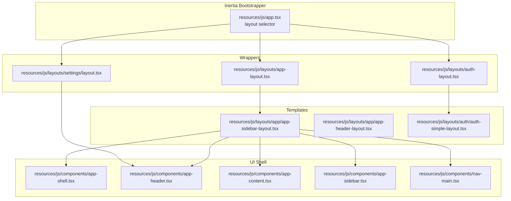
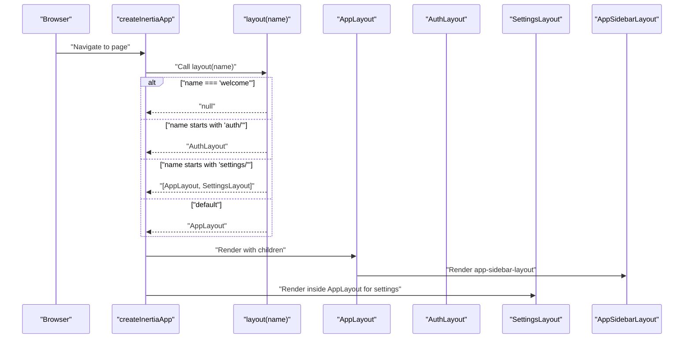
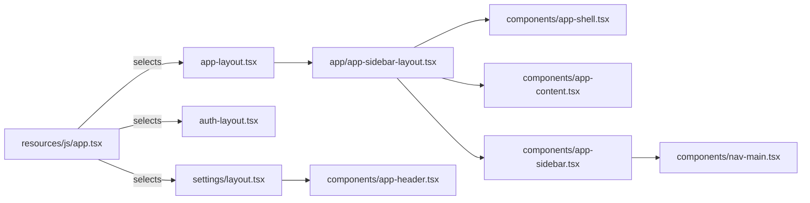

# Layout System

<cite>
**Referenced Files in This Document**
- [app.tsx](file://resources/js/app.tsx)
- [app-layout.tsx](file://resources/js/layouts/app-layout.tsx)
- [auth-layout.tsx](file://resources/js/layouts/auth-layout.tsx)
- [settings/layout.tsx](file://resources/js/layouts/settings/layout.tsx)
- [app/app-sidebar-layout.tsx](file://resources/js/layouts/app/app-sidebar-layout.tsx)
- [app/app-header-layout.tsx](file://resources/js/layouts/app/app-header-layout.tsx)
- [auth/auth-simple-layout.tsx](file://resources/js/layouts/auth/auth-simple-layout.tsx)
- [components/app-shell.tsx](file://resources/js/components/app-shell.tsx)
- [components/app-header.tsx](file://resources/js/components/app-header.tsx)
- [components/app-content.tsx](file://resources/js/components/app-content.tsx)
- [components/app-sidebar.tsx](file://resources/js/components/app-sidebar.tsx)
- [components/nav-main.tsx](file://resources/js/components/nav-main.tsx)
- [types/navigation.ts](file://resources/js/types/navigation.ts)
- [lib/utils.ts](file://resources/js/lib/utils.ts)
</cite>

## Table of Contents
1. [Introduction](#introduction)
2. [Project Structure](#project-structure)
3. [Core Components](#core-components)
4. [Architecture Overview](#architecture-overview)
5. [Detailed Component Analysis](#detailed-component-analysis)
6. [Dependency Analysis](#dependency-analysis)
7. [Performance Considerations](#performance-considerations)
8. [Troubleshooting Guide](#troubleshooting-guide)
9. [Conclusion](#conclusion)

## Introduction
This document describes ScholarGraph's layout system architecture, focusing on how pages are wrapped with appropriate layouts using Inertia.js. It covers the main layout components (app-layout, auth-layout, and settings-layout), their roles and configurations, nested layout composition (AppLayout wrapping SettingsLayout for settings pages), layout switching logic in the Inertia bootstrapper, conditional rendering based on page names, and responsive design patterns integrated with Tailwind CSS and UI primitives.

## Project Structure
The layout system is organized around three primary layout wrappers and supporting templates:
- Application layouts: app-layout wrapper and app-sidebar-layout template
- Authentication layouts: auth-layout wrapper and auth-simple-layout template
- Settings layouts: settings/layout template with a sidebar navigation pattern

**Diagram sources**
- [app.tsx:11-24](file://resources/js/app.tsx#L11-L24)
- [app-layout.tsx:4-16](file://resources/js/layouts/app-layout.tsx#L4-L16)
- [auth-layout.tsx:3-17](file://resources/js/layouts/auth-layout.tsx#L3-L17)
- [settings/layout.tsx:31](file://resources/js/layouts/settings/layout.tsx#L31)
- [app/app-sidebar-layout.tsx:7-20](file://resources/js/layouts/app/app-sidebar-layout.tsx#L7-L20)
- [app/app-header-layout.tsx:6-16](file://resources/js/layouts/app/app-header-layout.tsx#L6-L16)
- [auth/auth-simple-layout.tsx:6-38](file://resources/js/layouts/auth/auth-simple-layout.tsx#L6-L38)
- [components/app-shell.tsx:11-21](file://resources/js/components/app-shell.tsx#L11-L21)
- [components/app-header.tsx:66-248](file://resources/js/components/app-header.tsx#L66-L248)
- [components/app-content.tsx:9-22](file://resources/js/components/app-content.tsx#L9-L22)
- [components/app-sidebar.tsx:40-65](file://resources/js/components/app-sidebar.tsx#L40-L65)
- [components/nav-main.tsx:12-36](file://resources/js/components/nav-main.tsx#L12-L36)

**Section sources**
- [app.tsx:11-24](file://resources/js/app.tsx#L11-L24)
- [app-layout.tsx:4-16](file://resources/js/layouts/app-layout.tsx#L4-L16)
- [auth-layout.tsx:3-17](file://resources/js/layouts/auth-layout.tsx#L3-L17)
- [settings/layout.tsx:31](file://resources/js/layouts/settings/layout.tsx#L31)

## Core Components
- AppLayout wrapper: Provides a breadcrumbs-aware wrapper around the app-sidebar-layout template. It forwards children and accepts optional breadcrumbs.
- AuthLayout wrapper: Provides a simple wrapper around the auth-simple-layout template, forwarding title, description, and children.
- SettingsLayout: Implements a responsive two-column settings interface with a static sidebar navigation and a content area. It uses route helpers and a current-url hook to highlight active links.

Key responsibilities:
- AppLayout: breadcrumb injection and delegation to app-sidebar-layout.
- AuthLayout: minimal authentication-focused framing with title and description.
- SettingsLayout: structured settings navigation with responsive breakpoints and active-state highlighting.

**Section sources**
- [app-layout.tsx:4-16](file://resources/js/layouts/app-layout.tsx#L4-L16)
- [auth-layout.tsx:3-17](file://resources/js/layouts/auth-layout.tsx#L3-L17)
- [settings/layout.tsx:31-79](file://resources/js/layouts/settings/layout.tsx#L31-L79)

## Architecture Overview
The layout selection and composition pipeline is driven by the Inertia bootstrapper. It switches layouts based on the page name and composes nested layouts for settings pages.

**Diagram sources**
- [app.tsx:13-24](file://resources/js/app.tsx#L13-L24)
- [app-layout.tsx:4-16](file://resources/js/layouts/app-layout.tsx#L4-L16)
- [auth-layout.tsx:3-17](file://resources/js/layouts/auth-layout.tsx#L3-L17)
- [settings/layout.tsx:31](file://resources/js/layouts/settings/layout.tsx#L31)
- [app/app-sidebar-layout.tsx:7-20](file://resources/js/layouts/app/app-sidebar-layout.tsx#L7-L20)

## Detailed Component Analysis

### AppLayout Wrapper
Purpose:
- Wraps page content with a breadcrumbs-enabled app-sidebar-layout template.
- Accepts optional breadcrumbs and forwards children.

Composition:
- Delegates to app-sidebar-layout template, passing breadcrumbs and children.

Responsive behavior:
- Inherits responsive layout from app-sidebar-layout via AppShell and AppContent.

Styling approach:
- Uses Tailwind classes for spacing and layout within the wrapper.

Integration with Inertia:
- Selected by the layout selector for most non-auth, non-welcome pages.

**Section sources**
- [app-layout.tsx:4-16](file://resources/js/layouts/app-layout.tsx#L4-L16)
- [app/app-sidebar-layout.tsx:7-20](file://resources/js/layouts/app/app-sidebar-layout.tsx#L7-L20)

### AuthLayout Wrapper
Purpose:
- Provides a simple authentication-focused layout with optional title and description.

Composition:
- Delegates to auth-simple-layout template, forwarding title, description, and children.

Responsive behavior:
- Centered card layout with vertical stacking on small screens.

Styling approach:
- Uses Tailwind utilities for centering, padding, and typography.

Integration with Inertia:
- Selected by the layout selector for pages under the 'auth/' namespace.

**Section sources**
- [auth-layout.tsx:3-17](file://resources/js/layouts/auth-layout.tsx#L3-L17)
- [auth/auth-simple-layout.tsx:6-38](file://resources/js/layouts/auth/auth-simple-layout.tsx#L6-L38)

### SettingsLayout
Purpose:
- Implements a two-column settings interface with a static navigation sidebar and content area.

Navigation integration:
- Defines a static list of navigation items for Profile, Security, and Appearance.
- Uses route helpers to construct URLs and highlights active items based on current URL.

Responsive behavior:
- On small screens: stacked layout with a horizontal separator.
- On large screens: sidebar becomes a fixed column with the content area filling remaining width.

Mobile-responsive design:
- Uses flexbox and responsive breakpoints (md, lg) to adapt layout.
- Hides separators on small screens and stacks navigation vertically.

Styling approach:
- Uses Tailwind utilities for spacing, alignment, and responsive variants.
- Highlights active navigation items conditionally.

**Section sources**
- [settings/layout.tsx:31-79](file://resources/js/layouts/settings/layout.tsx#L31-L79)
- [lib/utils.ts:6-12](file://resources/js/lib/utils.ts#L6-L12)

### AppSidebarLayout Template
Purpose:
- Provides the foundational shell for application pages with a collapsible sidebar and header breadcrumbs.

Composition:
- Renders AppShell with variant 'sidebar'.
- Includes AppSidebar, AppContent, and AppSidebarHeader.
- Passes breadcrumbs to AppSidebarHeader.

Responsive behavior:
- Uses SidebarProvider to manage open/closed state and content inset.
- Content area adapts via AppContent's variant.

Styling approach:
- Uses UI primitives and Tailwind classes for layout and spacing.

**Section sources**
- [app/app-sidebar-layout.tsx:7-20](file://resources/js/layouts/app/app-sidebar-layout.tsx#L7-L20)
- [components/app-shell.tsx:11-21](file://resources/js/components/app-shell.tsx#L11-L21)
- [components/app-content.tsx:9-22](file://resources/js/components/app-content.tsx#L9-L22)
- [components/app-sidebar.tsx:40-65](file://resources/js/components/app-sidebar.tsx#L40-L65)

### AppHeaderLayout Template
Purpose:
- Alternative header-based layout variant for pages that prefer a top navigation bar.

Composition:
- Renders AppShell with variant 'header'.
- Includes AppHeader and AppContent with variant 'header'.

Responsive behavior:
- Header-based layout without sidebar inset.

Styling approach:
- Uses Tailwind classes for header and content areas.

**Section sources**
- [app/app-header-layout.tsx:6-16](file://resources/js/layouts/app/app-header-layout.tsx#L6-L16)
- [components/app-shell.tsx:11-21](file://resources/js/components/app-shell.tsx#L11-L21)
- [components/app-header.tsx:66-248](file://resources/js/components/app-header.tsx#L66-L248)

### AppShell Component
Purpose:
- Centralizes layout variant selection and sidebar provider initialization.

Behavior:
- Variant 'header': renders a simple flex container.
- Variant 'sidebar': wraps children in SidebarProvider with defaultOpen state derived from props.

**Section sources**
- [components/app-shell.tsx:11-21](file://resources/js/components/app-shell.tsx#L11-L21)

### AppHeader Component
Purpose:
- Implements the top navigation bar with responsive mobile menu, breadcrumbs, and user menu.

Responsive behavior:
- Mobile: Sheet-based drawer with main and external links.
- Desktop: Navigation menu with active state indicators.
- Breadcrumbs: Optional second row when breadcrumbs length > 1.

Styling approach:
- Uses Tailwind utilities for responsive breakpoints and interactive states.

**Section sources**
- [components/app-header.tsx:66-248](file://resources/js/components/app-header.tsx#L66-L248)

### AppSidebar Component
Purpose:
- Provides the left sidebar with logo, main navigation, footer links, and user info.

Navigation integration:
- Uses NavMain for platform navigation items.
- Integrates with NavFooter and NavUser components.

**Section sources**
- [components/app-sidebar.tsx:40-65](file://resources/js/components/app-sidebar.tsx#L40-L65)
- [components/nav-main.tsx:12-36](file://resources/js/components/nav-main.tsx#L12-L36)

### Types and Utilities
- BreadcrumbItem and NavItem types define navigation structures used across layouts.
- cn and toUrl utilities support conditional class merging and URL normalization.

**Section sources**
- [types/navigation.ts:4-14](file://resources/js/types/navigation.ts#L4-L14)
- [lib/utils.ts:6-12](file://resources/js/lib/utils.ts#L6-L12)

## Dependency Analysis
The layout system exhibits clear separation of concerns:
- app.tsx controls layout selection and composes nested layouts for settings.
- Wrappers (AppLayout, AuthLayout) forward props to templates.
- Templates (app-sidebar-layout, app-header-layout, auth-simple-layout) render UI shells and navigation.
- UI components (AppShell, AppHeader, AppContent, AppSidebar, NavMain) encapsulate responsive behavior.

**Diagram sources**
- [app.tsx:13-24](file://resources/js/app.tsx#L13-L24)
- [app-layout.tsx:4-16](file://resources/js/layouts/app-layout.tsx#L4-L16)
- [auth-layout.tsx:3-17](file://resources/js/layouts/auth-layout.tsx#L3-L17)
- [settings/layout.tsx:31](file://resources/js/layouts/settings/layout.tsx#L31)
- [app/app-sidebar-layout.tsx:7-20](file://resources/js/layouts/app/app-sidebar-layout.tsx#L7-L20)
- [components/app-shell.tsx:11-21](file://resources/js/components/app-shell.tsx#L11-L21)
- [components/app-content.tsx:9-22](file://resources/js/components/app-content.tsx#L9-L22)
- [components/app-sidebar.tsx:40-65](file://resources/js/components/app-sidebar.tsx#L40-L65)
- [components/nav-main.tsx:12-36](file://resources/js/components/nav-main.tsx#L12-L36)

**Section sources**
- [app.tsx:13-24](file://resources/js/app.tsx#L13-L24)

## Performance Considerations
- Layout switching occurs at the Inertia bootstrapper level; keep layout components lightweight to minimize render overhead.
- Use responsive variants judiciously to avoid excessive reflows on small screens.
- Leverage memoization and stable prop shapes for navigation items to prevent unnecessary rerenders in NavMain and SettingsLayout.

## Troubleshooting Guide
Common issues and resolutions:
- Wrong layout applied: Verify page names match the selector conditions in the Inertia bootstrapper. Ensure settings pages use namespaced routes that start with 'settings/'.
- Settings navigation not highlighting: Confirm current URL detection logic and that route helpers resolve to expected URLs.
- Sidebar not opening/closing: Check SidebarProvider defaultOpen state and AppShell variant selection.
- Responsive layout glitches: Review Tailwind breakpoint classes and ensure lg/md variants are correctly applied.

**Section sources**
- [app.tsx:13-24](file://resources/js/app.tsx#L13-L24)
- [settings/layout.tsx:32-55](file://resources/js/layouts/settings/layout.tsx#L32-L55)
- [components/app-shell.tsx:11-21](file://resources/js/components/app-shell.tsx#L11-L21)

## Conclusion
ScholarGraph's layout system leverages Inertia.js to dynamically select and compose layouts per page. AppLayout and AuthLayout serve as thin wrappers delegating to robust templates that integrate responsive UI primitives. SettingsLayout introduces a structured, mobile-friendly settings experience with active navigation highlighting. The architecture balances flexibility and maintainability while ensuring consistent navigation and responsive behavior across device sizes.