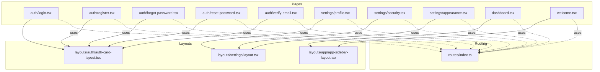
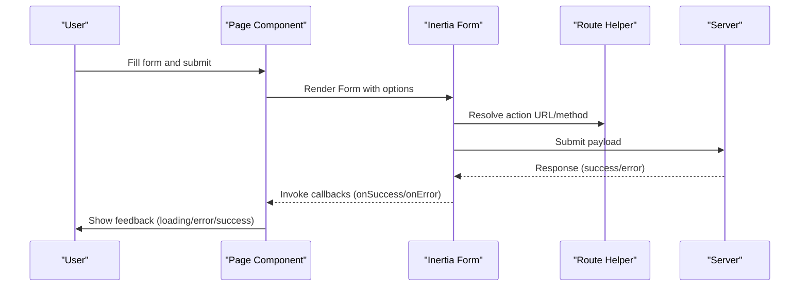
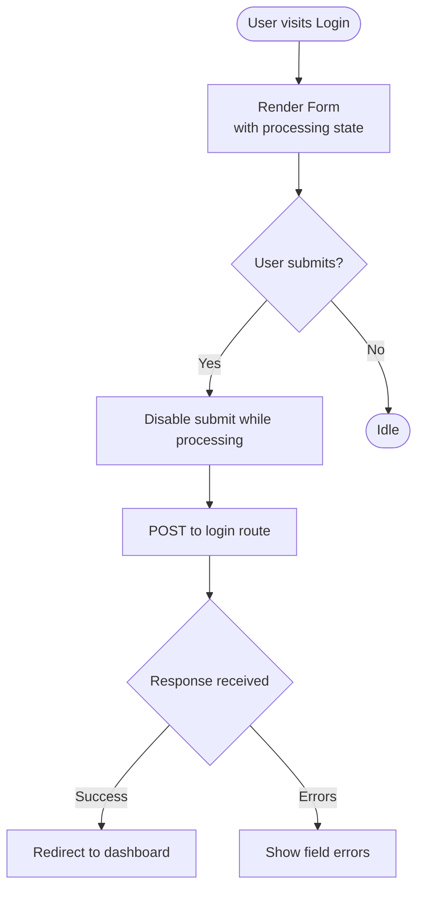
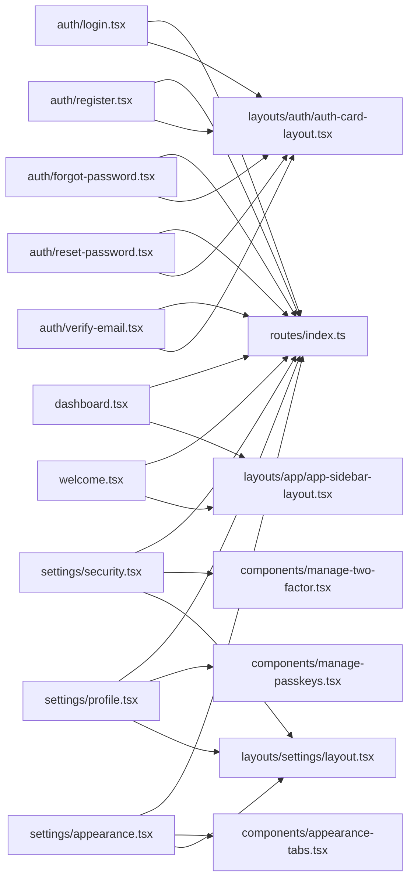

# Page Components

<cite>
**Referenced Files in This Document**
- [login.tsx](file://resources/js/pages/auth/login.tsx)
- [register.tsx](file://resources/js/pages/auth/register.tsx)
- [forgot-password.tsx](file://resources/js/pages/auth/forgot-password.tsx)
- [reset-password.tsx](file://resources/js/pages/auth/reset-password.tsx)
- [verify-email.tsx](file://resources/js/pages/auth/verify-email.tsx)
- [profile.tsx](file://resources/js/pages/settings/profile.tsx)
- [security.tsx](file://resources/js/pages/settings/security.tsx)
- [appearance.tsx](file://resources/js/pages/settings/appearance.tsx)
- [dashboard.tsx](file://resources/js/pages/dashboard.tsx)
- [welcome.tsx](file://resources/js/pages/welcome.tsx)
- [auth-card-layout.tsx](file://resources/js/layouts/auth/auth-card-layout.tsx)
- [app-sidebar-layout.tsx](file://resources/js/layouts/app/app-sidebar-layout.tsx)
- [settings-layout.tsx](file://resources/js/layouts/settings/layout.tsx)
- [index.ts](file://resources/js/routes/index.ts)
- [manage-passkeys.tsx](file://resources/js/components/manage-passkeys.tsx)
- [manage-two-factor.tsx](file://resources/js/components/manage-two-factor.tsx)
- [appearance-tabs.tsx](file://resources/js/components/appearance-tabs.tsx)
</cite>

## Table of Contents
1. [Introduction](#introduction)
2. [Project Structure](#project-structure)
3. [Core Components](#core-components)
4. [Architecture Overview](#architecture-overview)
5. [Detailed Component Analysis](#detailed-component-analysis)
6. [Dependency Analysis](#dependency-analysis)
7. [Performance Considerations](#performance-considerations)
8. [Troubleshooting Guide](#troubleshooting-guide)
9. [Conclusion](#conclusion)

## Introduction
This document provides a comprehensive guide to ScholarGraph’s page-level React components organized by feature areas. It covers authentication pages (login, register, password reset, email verification), settings pages (profile, security, appearance), dashboard components, and the welcome page. The focus is on component structure, data fetching patterns via Inertia forms, form handling, user interaction flows, state management, validation patterns, backend API integration, lifecycle considerations, error handling, loading states, user feedback mechanisms, routing integration, navigation patterns, and responsive design implementation.

## Project Structure
ScholarGraph organizes page components under resources/js/pages, grouped by feature area:
- Authentication pages: login, register, forgot-password, reset-password, verify-email
- Settings pages: profile, security, appearance
- Application pages: dashboard, welcome
Layouts are located under resources/js/layouts and are applied per page via a static layout property.

**Diagram sources**
- [login.tsx:114-118](file://resources/js/pages/auth/login.tsx#L114-L118)
- [register.tsx:117-121](file://resources/js/pages/auth/register.tsx#L117-L121)
- [forgot-password.tsx:66-70](file://resources/js/pages/auth/forgot-password.tsx#L66-L70)
- [reset-password.tsx:93-97](file://resources/js/pages/auth/reset-password.tsx#L93-L97)
- [verify-email.tsx:42-47](file://resources/js/pages/auth/verify-email.tsx#L42-L47)
- [profile.tsx:131-139](file://resources/js/pages/settings/profile.tsx#L131-L139)
- [security.tsx:140-148](file://resources/js/pages/settings/security.tsx#L140-L148)
- [appearance.tsx:25-33](file://resources/js/pages/settings/appearance.tsx#L25-L33)
- [dashboard.tsx:29-37](file://resources/js/pages/dashboard.tsx#L29-L37)
- [welcome.tsx:1-390](file://resources/js/pages/welcome.tsx#L1-L390)
- [auth-card-layout.tsx:1-49](file://resources/js/layouts/auth/auth-card-layout.tsx#L1-L49)
- [app-sidebar-layout.tsx:1-21](file://resources/js/layouts/app/app-sidebar-layout.tsx#L1-L21)
- [settings-layout.tsx:1-79](file://resources/js/layouts/settings/layout.tsx#L1-L79)
- [index.ts:1-381](file://resources/js/routes/index.ts#L1-L381)

**Section sources**
- [login.tsx:1-118](file://resources/js/pages/auth/login.tsx#L1-L118)
- [register.tsx:1-121](file://resources/js/pages/auth/register.tsx#L1-L121)
- [forgot-password.tsx:1-70](file://resources/js/pages/auth/forgot-password.tsx#L1-L70)
- [reset-password.tsx:1-97](file://resources/js/pages/auth/reset-password.tsx#L1-L97)
- [verify-email.tsx:1-47](file://resources/js/pages/auth/verify-email.tsx#L1-L47)
- [profile.tsx:1-139](file://resources/js/pages/settings/profile.tsx#L1-L139)
- [security.tsx:1-148](file://resources/js/pages/settings/security.tsx#L1-L148)
- [appearance.tsx:1-33](file://resources/js/pages/settings/appearance.tsx#L1-L33)
- [dashboard.tsx:1-37](file://resources/js/pages/dashboard.tsx#L1-L37)
- [welcome.tsx:1-390](file://resources/js/pages/welcome.tsx#L1-L390)
- [auth-card-layout.tsx:1-49](file://resources/js/layouts/auth/auth-card-layout.tsx#L1-L49)
- [app-sidebar-layout.tsx:1-21](file://resources/js/layouts/app/app-sidebar-layout.tsx#L1-L21)
- [settings-layout.tsx:1-79](file://resources/js/layouts/settings/layout.tsx#L1-L79)
- [index.ts:1-381](file://resources/js/routes/index.ts#L1-L381)

## Core Components
This section outlines the primary page components and their roles:
- Authentication pages: Provide form-based login, registration, password reset initiation, password reset completion, and email verification flows.
- Settings pages: Allow updating profile details, managing security (password, 2FA, passkeys), and appearance preferences.
- Dashboard: Displays overview content with placeholders.
- Welcome: Marketing-style landing page with navigation and onboarding links.

Each page leverages Inertia forms for submission, integrates with route helpers for navigation, and applies appropriate layouts.

**Section sources**
- [login.tsx:1-118](file://resources/js/pages/auth/login.tsx#L1-L118)
- [register.tsx:1-121](file://resources/js/pages/auth/register.tsx#L1-L121)
- [forgot-password.tsx:1-70](file://resources/js/pages/auth/forgot-password.tsx#L1-L70)
- [reset-password.tsx:1-97](file://resources/js/pages/auth/reset-password.tsx#L1-L97)
- [verify-email.tsx:1-47](file://resources/js/pages/auth/verify-email.tsx#L1-L47)
- [profile.tsx:1-139](file://resources/js/pages/settings/profile.tsx#L1-L139)
- [security.tsx:1-148](file://resources/js/pages/settings/security.tsx#L1-L148)
- [appearance.tsx:1-33](file://resources/js/pages/settings/appearance.tsx#L1-L33)
- [dashboard.tsx:1-37](file://resources/js/pages/dashboard.tsx#L1-L37)
- [welcome.tsx:1-390](file://resources/js/pages/welcome.tsx#L1-L390)

## Architecture Overview
The page components follow a consistent pattern:
- Layout assignment via a static layout property on each page.
- Inertia Form components driving submissions and handling processing states.
- Route helpers encapsulating backend endpoints.
- Shared UI components and hooks for common behaviors (e.g., two-factor, passkeys, appearance).

**Diagram sources**
- [login.tsx:27-103](file://resources/js/pages/auth/login.tsx#L27-L103)
- [register.tsx:20-112](file://resources/js/pages/auth/register.tsx#L20-L112)
- [index.ts:1-381](file://resources/js/routes/index.ts#L1-L381)

## Detailed Component Analysis

### Authentication Pages

#### Login Page
- Purpose: Authenticate users with email/password; supports “remember me” and password reset link.
- Data fetching pattern: Uses an Inertia Form bound to a login route definition; includes processing state and server-provided status messages.
- Form handling: Controlled inputs with labels and error rendering; submit button disabled during processing.
- Validation patterns: Displays field-level errors returned by the backend.
- Backend integration: Submits to the login endpoint via a route helper.
- User feedback: Status banner for successful actions; spinner during processing.
- Routing integration: Links to register and password reset routes; layout applied via a card layout.

**Diagram sources**
- [login.tsx:20-112](file://resources/js/pages/auth/login.tsx#L20-L112)
- [auth-card-layout.tsx:13-48](file://resources/js/layouts/auth/auth-card-layout.tsx#L13-L48)
- [index.ts:1-381](file://resources/js/routes/index.ts#L1-L381)

**Section sources**
- [login.tsx:1-118](file://resources/js/pages/auth/login.tsx#L1-L118)
- [auth-card-layout.tsx:1-49](file://resources/js/layouts/auth/auth-card-layout.tsx#L1-L49)

#### Registration Page
- Purpose: Create new user accounts with name, email, and password confirmation.
- Data fetching pattern: Inertia Form with resetOnSuccess for sensitive fields; disableWhileProcessing.
- Form handling: Controlled inputs with labels and error rendering; includes password rules prop.
- Validation patterns: Displays field-level errors; password confirmation enforced client-side via form semantics.
- Backend integration: Submits to the register endpoint via a route helper.
- User feedback: Spinner during processing; success redirects handled by the framework.

**Section sources**
- [register.tsx:1-121](file://resources/js/pages/auth/register.tsx#L1-L121)
- [auth-card-layout.tsx:1-49](file://resources/js/layouts/auth/auth-card-layout.tsx#L1-L49)

#### Forgot Password Page
- Purpose: Initiates password reset by sending a reset link to the provided email.
- Data fetching pattern: Inertia Form bound to an email route; shows status banner after submission.
- Form handling: Single email input with label and error rendering.
- Backend integration: Submits to the password reset email endpoint.
- User feedback: Loading indicator and success banner; link back to login.

**Section sources**
- [forgot-password.tsx:1-70](file://resources/js/pages/auth/forgot-password.tsx#L1-L70)
- [auth-card-layout.tsx:1-49](file://resources/js/layouts/auth/auth-card-layout.tsx#L1-L49)

#### Reset Password Page
- Purpose: Allows users to set a new password using a token and email provided in the URL.
- Data fetching pattern: Inertia Form with transform to attach token and email; resetOnSuccess for password fields.
- Form handling: Email read-only, password and confirmation inputs with rules.
- Backend integration: Submits to the password update endpoint with transformed data.
- User feedback: Spinner during processing; success handled by the framework.

**Section sources**
- [reset-password.tsx:1-97](file://resources/js/pages/auth/reset-password.tsx#L1-L97)
- [auth-card-layout.tsx:1-49](file://resources/js/layouts/auth/auth-card-layout.tsx#L1-L49)

#### Verify Email Page
- Purpose: Resends verification email and allows logout.
- Data fetching pattern: Inertia Form bound to a verification resend route; shows status banner.
- Backend integration: Submits to the verification resend endpoint; includes logout route.
- User feedback: Loading indicator and success banner; link to logout.

**Section sources**
- [verify-email.tsx:1-47](file://resources/js/pages/auth/verify-email.tsx#L1-L47)
- [auth-card-layout.tsx:1-49](file://resources/js/layouts/auth/auth-card-layout.tsx#L1-L49)

### Settings Pages

#### Profile Settings Page
- Purpose: Update user name and email; handles email verification prompts.
- Data fetching pattern: Uses a controller-backed form with preserveScroll to maintain scroll position on updates.
- Form handling: Controlled inputs with labels and error rendering; displays verification prompt and status.
- Backend integration: Submits to a profile update endpoint; includes verification resend route.
- User feedback: Save button disabled during processing; success messaging and verification prompts.

**Section sources**
- [profile.tsx:1-139](file://resources/js/pages/settings/profile.tsx#L1-L139)
- [settings-layout.tsx:1-79](file://resources/js/layouts/settings/layout.tsx#L1-L79)

#### Security Settings Page
- Purpose: Change password, manage two-factor authentication, and manage passkeys.
- Data fetching pattern: Uses a controller-backed form with resetOnError for password fields; preserves scroll.
- Form handling: Current password, new password, and confirmation inputs with rules; focuses on error fields.
- Backend integration: Submits to a security update endpoint; integrates two-factor and passkey management components.
- User feedback: Save button disabled during processing; success messaging; modal-driven 2FA setup flow.

**Section sources**
- [security.tsx:1-148](file://resources/js/pages/settings/security.tsx#L1-L148)
- [manage-two-factor.tsx:1-127](file://resources/js/components/manage-two-factor.tsx#L1-L127)
- [manage-passkeys.tsx:1-72](file://resources/js/components/manage-passkeys.tsx#L1-L72)
- [settings-layout.tsx:1-79](file://resources/js/layouts/settings/layout.tsx#L1-L79)

#### Appearance Settings Page
- Purpose: Adjust theme preference (light, dark, system).
- Data fetching pattern: Renders appearance tabs that update the user’s appearance preference.
- Backend integration: Uses appearance route helpers; integrates with a shared appearance hook.
- User feedback: Immediate visual feedback when switching themes.

**Section sources**
- [appearance.tsx:1-33](file://resources/js/pages/settings/appearance.tsx#L1-L33)
- [appearance-tabs.tsx:1-46](file://resources/js/components/appearance-tabs.tsx#L1-L46)
- [settings-layout.tsx:1-79](file://resources/js/layouts/settings/layout.tsx#L1-L79)

### Dashboard Page
- Purpose: Provides a dashboard view with placeholder content.
- Data fetching pattern: Uses route helpers for navigation; renders placeholder patterns.
- Backend integration: Navigates to dashboard route; content is client-rendered placeholders.
- User feedback: Responsive grid layout with placeholder visuals.

**Section sources**
- [dashboard.tsx:1-37](file://resources/js/pages/dashboard.tsx#L1-L37)
- [app-sidebar-layout.tsx:1-21](file://resources/js/layouts/app/app-sidebar-layout.tsx#L1-L21)

### Welcome Page
- Purpose: Marketing-style landing page with navigation and onboarding links.
- Data fetching pattern: Uses route helpers for navigation; conditionally renders dashboard link when authenticated.
- Backend integration: Links to login/register routes; navigates to dashboard when authenticated.
- User feedback: Animated content and clear call-to-action links.

**Section sources**
- [welcome.tsx:1-390](file://resources/js/pages/welcome.tsx#L1-L390)

## Dependency Analysis
The pages rely on:
- Route helpers for navigation and form actions.
- Layout components for consistent presentation.
- Shared UI components and hooks for common behaviors.

**Diagram sources**
- [login.tsx:1-118](file://resources/js/pages/auth/login.tsx#L1-L118)
- [register.tsx:1-121](file://resources/js/pages/auth/register.tsx#L1-L121)
- [forgot-password.tsx:1-70](file://resources/js/pages/auth/forgot-password.tsx#L1-L70)
- [reset-password.tsx:1-97](file://resources/js/pages/auth/reset-password.tsx#L1-L97)
- [verify-email.tsx:1-47](file://resources/js/pages/auth/verify-email.tsx#L1-L47)
- [profile.tsx:1-139](file://resources/js/pages/settings/profile.tsx#L1-L139)
- [security.tsx:1-148](file://resources/js/pages/settings/security.tsx#L1-L148)
- [appearance.tsx:1-33](file://resources/js/pages/settings/appearance.tsx#L1-L33)
- [dashboard.tsx:1-37](file://resources/js/pages/dashboard.tsx#L1-L37)
- [welcome.tsx:1-390](file://resources/js/pages/welcome.tsx#L1-L390)
- [index.ts:1-381](file://resources/js/routes/index.ts#L1-L381)
- [manage-passkeys.tsx:1-72](file://resources/js/components/manage-passkeys.tsx#L1-L72)
- [manage-two-factor.tsx:1-127](file://resources/js/components/manage-two-factor.tsx#L1-L127)
- [appearance-tabs.tsx:1-46](file://resources/js/components/appearance-tabs.tsx#L1-L46)
- [auth-card-layout.tsx:1-49](file://resources/js/layouts/auth/auth-card-layout.tsx#L1-L49)
- [settings-layout.tsx:1-79](file://resources/js/layouts/settings/layout.tsx#L1-L79)
- [app-sidebar-layout.tsx:1-21](file://resources/js/layouts/app/app-sidebar-layout.tsx#L1-L21)

**Section sources**
- [index.ts:1-381](file://resources/js/routes/index.ts#L1-L381)

## Performance Considerations
- Prefer disableWhileProcessing and processing flags to prevent duplicate submissions and improve perceived responsiveness.
- Use preserveScroll on forms to avoid jank during updates.
- Keep forms minimal and focused; defer heavy computations to the server or background hooks.
- Leverage route helpers to avoid hardcoded URLs and reduce runtime parsing overhead.

## Troubleshooting Guide
Common issues and resolutions:
- Duplicate submissions: Ensure processing flags are respected and forms are disabled during submission.
- Field focus on errors: Use onError handlers to focus on the first invalid field.
- Scroll restoration: Use preserveScroll on forms to keep the user’s place after updates.
- Navigation: Verify route helpers resolve to the correct endpoints and methods.
- Layout alignment: Confirm each page sets the appropriate layout and breadcrumbs.

**Section sources**
- [security.tsx:48-56](file://resources/js/pages/settings/security.tsx#L48-L56)
- [profile.tsx:42-44](file://resources/js/pages/settings/profile.tsx#L42-L44)

## Conclusion
ScholarGraph’s page components consistently apply Inertia forms, route helpers, and shared layouts to deliver a cohesive user experience across authentication, settings, dashboard, and welcome flows. The design emphasizes clear feedback, robust error handling, and responsive navigation, enabling reliable interactions with backend APIs while maintaining a consistent UI.