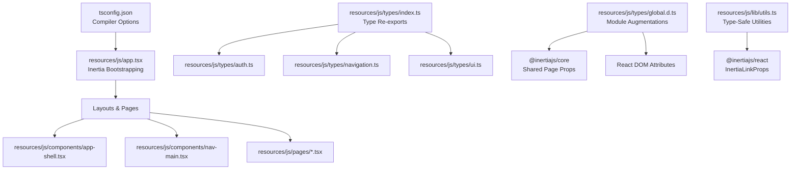
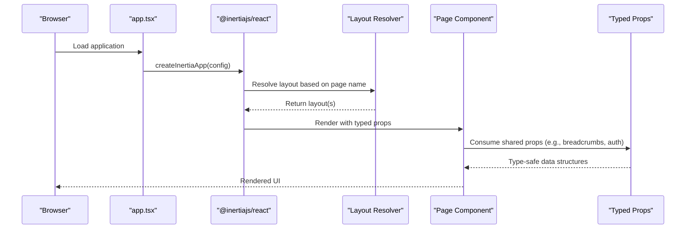
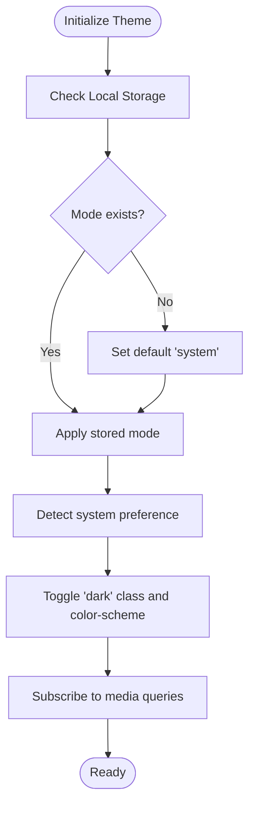
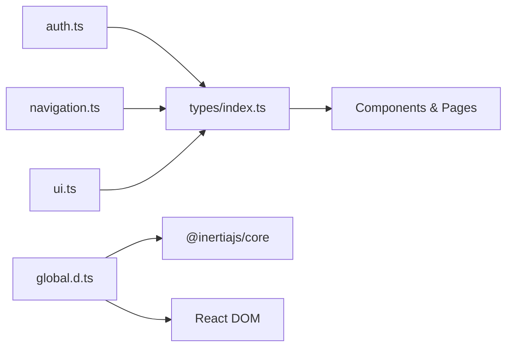

# TypeScript Integration

<cite>
**Referenced Files in This Document**
- [tsconfig.json](file://tsconfig.json)
- [resources/js/types/index.ts](file://resources/js/types/index.ts)
- [resources/js/types/auth.ts](file://resources/js/types/auth.ts)
- [resources/js/types/navigation.ts](file://resources/js/types/navigation.ts)
- [resources/js/types/ui.ts](file://resources/js/types/ui.ts)
- [resources/js/types/global.d.ts](file://resources/js/types/global.d.ts)
- [resources/js/types/vite-env.d.ts](file://resources/js/types/vite-env.d.ts)
- [resources/js/lib/utils.ts](file://resources/js/lib/utils.ts)
- [resources/js/app.tsx](file://resources/js/app.tsx)
- [resources/js/components/app-shell.tsx](file://resources/js/components/app-shell.tsx)
- [resources/js/layouts/app-layout.tsx](file://resources/js/layouts/app-layout.tsx)
- [resources/js/pages/dashboard.tsx](file://resources/js/pages/dashboard.tsx)
- [resources/js/hooks/use-appearance.tsx](file://resources/js/hooks/use-appearance.tsx)
- [resources/js/components/ui/button.tsx](file://resources/js/components/ui/button.tsx)
- [resources/js/components/ui/input.tsx](file://resources/js/components/ui/input.tsx)
- [resources/js/components/nav-main.tsx](file://resources/js/components/nav-main.tsx)
</cite>

## Table of Contents
1. [Introduction](#introduction)
2. [Project Structure](#project-structure)
3. [Core Components](#core-components)
4. [Architecture Overview](#architecture-overview)
5. [Detailed Component Analysis](#detailed-component-analysis)
6. [Dependency Analysis](#dependency-analysis)
7. [Performance Considerations](#performance-considerations)
8. [Troubleshooting Guide](#troubleshooting-guide)
9. [Conclusion](#conclusion)
10. [Appendices](#appendices)

## Introduction
This document explains ScholarGraph’s TypeScript integration and type system across the frontend. It covers custom type definitions for authentication, navigation, UI components, and global application types; demonstrates type safety patterns, interface implementations, and generic usage; and documents configuration, compilation settings, and development workflow integration. Practical examples are provided via file references to real code locations.

## Project Structure
The TypeScript configuration and type system are centered around:
- Strict compiler options for robust type checking
- Centralized type exports for reuse across components
- Global module augmentations for Inertia and React integrations
- Utility functions leveraging type inference for safe transformations
- Layouts and pages that consume typed props and shared page props



**Diagram sources**
- [tsconfig.json:1-122](file://tsconfig.json#L1-L122)
- [resources/js/types/index.ts:1-4](file://resources/js/types/index.ts#L1-L4)
- [resources/js/types/auth.ts:1-35](file://resources/js/types/auth.ts#L1-L35)
- [resources/js/types/navigation.ts:1-15](file://resources/js/types/navigation.ts#L1-L15)
- [resources/js/types/ui.ts:1-22](file://resources/js/types/ui.ts#L1-L22)
- [resources/js/types/global.d.ts:1-20](file://resources/js/types/global.d.ts#L1-L20)
- [resources/js/lib/utils.ts:1-13](file://resources/js/lib/utils.ts#L1-L13)
- [resources/js/app.tsx:1-41](file://resources/js/app.tsx#L1-L41)
- [resources/js/components/app-shell.tsx:1-22](file://resources/js/components/app-shell.tsx#L1-L22)
- [resources/js/components/nav-main.tsx:1-37](file://resources/js/components/nav-main.tsx#L1-L37)
- [resources/js/pages/dashboard.tsx:1-37](file://resources/js/pages/dashboard.tsx#L1-L37)

**Section sources**
- [tsconfig.json:1-122](file://tsconfig.json#L1-L122)
- [resources/js/types/index.ts:1-4](file://resources/js/types/index.ts#L1-L4)
- [resources/js/types/global.d.ts:1-20](file://resources/js/types/global.d.ts#L1-L20)
- [resources/js/lib/utils.ts:1-13](file://resources/js/lib/utils.ts#L1-L13)
- [resources/js/app.tsx:1-41](file://resources/js/app.tsx#L1-L41)

## Core Components
- Authentication types define the shape of the authenticated user and related passkey and two-factor data structures.
- Navigation types standardize breadcrumb and navigation item shapes, integrating with Inertia link props.
- UI types define layout props and flash toast types, enabling consistent component contracts.
- Global type declarations augment React DOM attributes and Inertia shared page props to include application-specific typed data.
- Utility functions demonstrate type-safe transformations using inferred types from Inertia link props.

Key type definitions and their roles:
- Authentication: [User, Auth, Passkey, TwoFactorSetupData, TwoFactorSecretKey:1-35](file://resources/js/types/auth.ts#L1-L35)
- Navigation: [BreadcrumbItem, NavItem:1-15](file://resources/js/types/navigation.ts#L1-L15)
- UI: [AppLayoutProps, AppVariant, FlashToast, AuthLayoutProps:1-22](file://resources/js/types/ui.ts#L1-L22)
- Shared page props augmentation: [InertiaConfig.sharedPageProps:10-19](file://resources/js/types/global.d.ts#L10-L19)
- Type re-exports: [index.ts:1-4](file://resources/js/types/index.ts#L1-L4)

**Section sources**
- [resources/js/types/auth.ts:1-35](file://resources/js/types/auth.ts#L1-L35)
- [resources/js/types/navigation.ts:1-15](file://resources/js/types/navigation.ts#L1-L15)
- [resources/js/types/ui.ts:1-22](file://resources/js/types/ui.ts#L1-L22)
- [resources/js/types/global.d.ts:1-20](file://resources/js/types/global.d.ts#L1-L20)
- [resources/js/types/index.ts:1-4](file://resources/js/types/index.ts#L1-L4)

## Architecture Overview
ScholarGraph’s frontend integrates TypeScript with Inertia and React to enforce type safety across requests, layouts, and UI components. The bootstrapper configures Inertia with a layout resolver and shared page props. Module augmentations ensure that shared props include typed authentication and UI state. Components consume these types to maintain consistency and prevent runtime errors.



**Diagram sources**
- [resources/js/app.tsx:11-37](file://resources/js/app.tsx#L11-L37)
- [resources/js/layouts/app-layout.tsx:1-17](file://resources/js/layouts/app-layout.tsx#L1-L17)
- [resources/js/pages/dashboard.tsx:29-37](file://resources/js/pages/dashboard.tsx#L29-L37)
- [resources/js/types/global.d.ts:10-19](file://resources/js/types/global.d.ts#L10-L19)

**Section sources**
- [resources/js/app.tsx:1-41](file://resources/js/app.tsx#L1-L41)
- [resources/js/layouts/app-layout.tsx:1-17](file://resources/js/layouts/app-layout.tsx#L1-L17)
- [resources/js/pages/dashboard.tsx:1-37](file://resources/js/pages/dashboard.tsx#L1-L37)
- [resources/js/types/global.d.ts:1-20](file://resources/js/types/global.d.ts#L1-L20)

## Detailed Component Analysis

### Authentication Types
- User: Defines the authenticated user shape, including optional avatar and two-factor flags, plus timestamps.
- Auth: Wraps the current user object for top-level access.
- Passkey: Represents WebAuthn passkey entries with timestamps and device info.
- TwoFactorSetupData and TwoFactorSecretKey: Encapsulate two-factor provisioning data.

Usage patterns:
- Shared page props include an Auth object, enabling pages to access user data with full type safety.
- Components can narrow or extend these types locally while preserving upstream contracts.

**Section sources**
- [resources/js/types/auth.ts:1-35](file://resources/js/types/auth.ts#L1-L35)
- [resources/js/types/global.d.ts:12-17](file://resources/js/types/global.d.ts#L12-L17)

### Navigation Types
- BreadcrumbItem: Ensures breadcrumb links have a non-null href compatible with Inertia.
- NavItem: Standardizes menu items with optional icons and active-state hints.

Integration:
- Components like NavMain consume NavItem arrays to render navigation consistently.
- Inertia’s Link component receives href values typed to guarantee navigational correctness.

**Section sources**
- [resources/js/types/navigation.ts:1-15](file://resources/js/types/navigation.ts#L1-L15)
- [resources/js/components/nav-main.tsx:12-37](file://resources/js/components/nav-main.tsx#L12-L37)

### UI Types
- AppLayoutProps: Enforces children as ReactNode and optionally accepts breadcrumbs.
- AppVariant: Union type restricting layout variants to header or sidebar.
- FlashToast: Strongly-typed toast messages with severity and content.
- AuthLayoutProps: Describes authentication layout children and metadata.

Practical usage:
- AppShell consumes AppVariant to conditionally render layouts.
- Layouts accept typed props to ensure consistent composition.

**Section sources**
- [resources/js/types/ui.ts:1-22](file://resources/js/types/ui.ts#L1-L22)
- [resources/js/components/app-shell.tsx:6-22](file://resources/js/components/app-shell.tsx#L6-L22)
- [resources/js/layouts/app-layout.tsx:4-17](file://resources/js/layouts/app-layout.tsx#L4-L17)

### Global Type Declarations
- React DOM attributes: Extends input attributes with a passwordrules attribute for form validation hints.
- Inertia shared page props: Augments InertiaConfig to require a typed auth object and sidebarOpen flag alongside arbitrary props.

These augmentations ensure that:
- Forms and inputs benefit from explicit attribute typing.
- Shared props across pages carry consistent, typed data.

**Section sources**
- [resources/js/types/global.d.ts:3-8](file://resources/js/types/global.d.ts#L3-L8)
- [resources/js/types/global.d.ts:10-19](file://resources/js/types/global.d.ts#L10-L19)

### Utility Types and Inference
- cn: Utility for merging Tailwind classes safely; leverages ClassValue inputs for type-safe concatenation.
- toUrl: Converts InertiaLinkProps href to a string, using NonNullable inference to avoid undefined handling pitfalls.

Best practices demonstrated:
- Using NonNullable to eliminate accidental undefined values.
- Leveraging union types and generics from external libraries (e.g., VariantProps) to keep component APIs consistent.

**Section sources**
- [resources/js/lib/utils.ts:6-13](file://resources/js/lib/utils.ts#L6-L13)
- [resources/js/components/ui/button.tsx:43-46](file://resources/js/components/ui/button.tsx#L43-L46)

### Type-Safe Component Props and Layout Composition
- AppShell: Accepts children and an AppVariant with a default, ensuring layout variants are enforced at compile time.
- AppLayout: Accepts typed breadcrumbs and children, forwarding them to the underlying template.
- Dashboard: Uses static layout metadata with typed breadcrumbs, ensuring compile-time verification of link targets.

```mermaid
classDiagram
class AppShell {
+children : ReactNode
+variant : AppVariant
+render()
}
class AppLayout {
+breadcrumbs : BreadcrumbItem[]
+children : ReactNode
+render()
}
class Dashboard {
+layoutMeta : { breadcrumbs : BreadcrumbItem[] }
+render()
}
AppShell --> AppVariant : "consumes"
AppLayout --> BreadcrumbItem : "consumes"
Dashboard --> BreadcrumbItem : "defines"
```

**Diagram sources**
- [resources/js/components/app-shell.tsx:6-22](file://resources/js/components/app-shell.tsx#L6-L22)
- [resources/js/layouts/app-layout.tsx:4-17](file://resources/js/layouts/app-layout.tsx#L4-L17)
- [resources/js/pages/dashboard.tsx:29-37](file://resources/js/pages/dashboard.tsx#L29-L37)

**Section sources**
- [resources/js/components/app-shell.tsx:1-22](file://resources/js/components/app-shell.tsx#L1-L22)
- [resources/js/layouts/app-layout.tsx:1-17](file://resources/js/layouts/app-layout.tsx#L1-L17)
- [resources/js/pages/dashboard.tsx:1-37](file://resources/js/pages/dashboard.tsx#L1-L37)

### Appearance Hook Types
- ResolvedAppearance and Appearance unions model theme modes.
- UseAppearanceReturn enforces the hook’s returned shape, including getters and setters.
- The hook encapsulates system preference detection, persistence, and DOM updates with type-safe operations.



**Diagram sources**
- [resources/js/hooks/use-appearance.tsx:73-88](file://resources/js/hooks/use-appearance.tsx#L73-L88)
- [resources/js/hooks/use-appearance.tsx:90-116](file://resources/js/hooks/use-appearance.tsx#L90-L116)

**Section sources**
- [resources/js/hooks/use-appearance.tsx:1-116](file://resources/js/hooks/use-appearance.tsx#L1-L116)

### UI Component Type Patterns
- Button: Uses React.ComponentProps<"button"> combined with VariantProps to ensure variant and size props align with design system tokens.
- Input: Inherits native input props while enforcing consistent styling and focus states.

These patterns ensure:
- Components remain flexible yet strongly typed.
- Design system variants are validated at compile time.

**Section sources**
- [resources/js/components/ui/button.tsx:37-59](file://resources/js/components/ui/button.tsx#L37-L59)
- [resources/js/components/ui/input.tsx:5-22](file://resources/js/components/ui/input.tsx#L5-L22)

## Dependency Analysis
The type system relies on centralized exports and module augmentations to propagate types across the app. Components import from '@/types' to access unified type definitions, reducing duplication and ensuring consistency.



**Diagram sources**
- [resources/js/types/index.ts:1-4](file://resources/js/types/index.ts#L1-L4)
- [resources/js/types/auth.ts:1-35](file://resources/js/types/auth.ts#L1-L35)
- [resources/js/types/navigation.ts:1-15](file://resources/js/types/navigation.ts#L1-L15)
- [resources/js/types/ui.ts:1-22](file://resources/js/types/ui.ts#L1-L22)
- [resources/js/types/global.d.ts:1-20](file://resources/js/types/global.d.ts#L1-L20)

**Section sources**
- [resources/js/types/index.ts:1-4](file://resources/js/types/index.ts#L1-L4)
- [resources/js/types/global.d.ts:1-20](file://resources/js/types/global.d.ts#L1-L20)

## Performance Considerations
- Strict mode and exhaustive checks reduce runtime errors and improve reliability.
- Avoid unnecessary any types; leverage inferred types from utility functions and component props.
- Keep shared props minimal and typed to reduce prop drilling and improve render performance indirectly.

## Troubleshooting Guide
Common issues and resolutions:
- Incompatible href types: Ensure navigation items use NonNullable InertiaLinkProps href values to satisfy BreadcrumbItem and NavItem contracts.
- Missing shared page props: Verify InertiaConfig.sharedPageProps includes the required auth and sidebarOpen fields.
- Utility conversion errors: Use toUrl to normalize href values to strings, preventing runtime failures when mixing route helpers and raw URLs.

**Section sources**
- [resources/js/types/navigation.ts:4-14](file://resources/js/types/navigation.ts#L4-L14)
- [resources/js/types/global.d.ts:10-19](file://resources/js/types/global.d.ts#L10-L19)
- [resources/js/lib/utils.ts:10-13](file://resources/js/lib/utils.ts#L10-L13)

## Conclusion
ScholarGraph’s TypeScript integration establishes a robust, scalable type system that spans authentication, navigation, UI components, and global application types. Through strict compiler options, centralized exports, and module augmentations, the codebase maintains strong guarantees across layouts, pages, and components. Utility functions and design-system-aware component props further reinforce type safety and developer productivity.

## Appendices

### TypeScript Configuration Highlights
- Language and Environment: ESNext target and JSX emit for React.
- Modules: ESNext module with bundler resolution and path mapping for '@/'.
- JavaScript Support: Allows JS with type checking disabled by default.
- Emit: No emit for type checks; isolated modules enabled for Vite.
- Type Checking: Strict mode with explicit null checks and unused locals disabled for flexibility.
- Completeness: Skips library checks for faster builds; includes TS/TSX sources under resources/js.

**Section sources**
- [tsconfig.json:14-115](file://tsconfig.json#L14-L115)