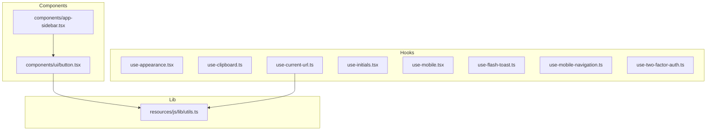
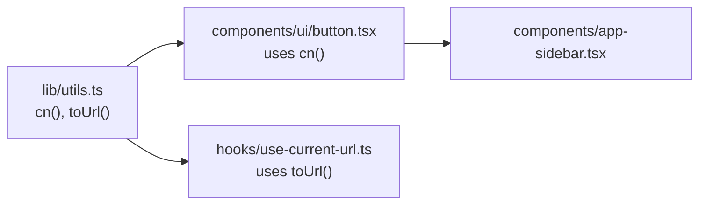
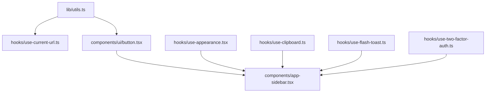

# Utility Functions

<cite>
**Referenced Files in This Document**
- [utils.ts](file://resources/js/lib/utils.ts)
- [use-appearance.tsx](file://resources/js/hooks/use-appearance.tsx)
- [use-clipboard.ts](file://resources/js/hooks/use-clipboard.ts)
- [use-current-url.ts](file://resources/js/hooks/use-current-url.ts)
- [use-initials.tsx](file://resources/js/hooks/use-initials.tsx)
- [use-mobile.tsx](file://resources/js/hooks/use-mobile.tsx)
- [use-flash-toast.ts](file://resources/js/hooks/use-flash-toast.ts)
- [use-mobile-navigation.ts](file://resources/js/hooks/use-mobile-navigation.ts)
- [use-two-factor-auth.ts](file://resources/js/hooks/use-two-factor-auth.ts)
- [button.tsx](file://resources/js/components/ui/button.tsx)
- [app-sidebar.tsx](file://resources/js/components/app-sidebar.tsx)
</cite>

## Table of Contents
1. [Introduction](#introduction)
2. [Project Structure](#project-structure)
3. [Core Components](#core-components)
4. [Architecture Overview](#architecture-overview)
5. [Detailed Component Analysis](#detailed-component-analysis)
6. [Dependency Analysis](#dependency-analysis)
7. [Performance Considerations](#performance-considerations)
8. [Troubleshooting Guide](#troubleshooting-guide)
9. [Conclusion](#conclusion)

## Introduction
This document describes ScholarGraph’s utility function library and helper modules focused on frontend operations. It covers string manipulation utilities, formatting helpers, validation-like checks, and common React integrations. The guide explains how utilities are organized, exported, composed, and integrated across components, forms, and data processing flows. It also addresses performance characteristics, testing strategies, cross-platform compatibility, browser API usage, and external library integration.

## Project Structure
Utilities and helpers are primarily located under:
- resources/js/lib/utils.ts: Shared utility functions used across the app.
- resources/js/hooks/: React hooks encapsulating DOM/browser APIs and stateful behaviors.
- resources/js/components/ui/: Reusable UI primitives that consume shared utilities.

**Diagram sources**
- [utils.ts:1-13](file://resources/js/lib/utils.ts#L1-L13)
- [use-current-url.ts:1-84](file://resources/js/hooks/use-current-url.ts#L1-L84)
- [button.tsx:1-59](file://resources/js/components/ui/button.tsx#L1-L59)
- [app-sidebar.tsx:1-66](file://resources/js/components/app-sidebar.tsx#L1-L66)

**Section sources**
- [utils.ts:1-13](file://resources/js/lib/utils.ts#L1-L13)
- [use-current-url.ts:1-84](file://resources/js/hooks/use-current-url.ts#L1-L84)
- [button.tsx:1-59](file://resources/js/components/ui/button.tsx#L1-L59)
- [app-sidebar.tsx:1-66](file://resources/js/components/app-sidebar.tsx#L1-L66)

## Core Components
- Shared utilities:
  - Class merging and Tailwind integration via a single exported function.
  - URL normalization helper for Inertia link props.
- Hook-based helpers:
  - Appearance management with system preference, persistence, and SSR support.
  - Clipboard copy with graceful fallbacks.
  - Current URL detection and parent-path matching.
  - Initials extraction from full names.
  - Mobile viewport detection using media queries.
  - Flash message toast integration with Inertia router events.
  - Mobile navigation cleanup.
  - Two-factor authentication data fetching and state management.

These utilities are designed to be small, composable, and safe for both client and server environments.

**Section sources**
- [utils.ts:1-13](file://resources/js/lib/utils.ts#L1-L13)
- [use-appearance.tsx:1-116](file://resources/js/hooks/use-appearance.tsx#L1-L116)
- [use-clipboard.ts:1-33](file://resources/js/hooks/use-clipboard.ts#L1-L33)
- [use-current-url.ts:1-84](file://resources/js/hooks/use-current-url.ts#L1-L84)
- [use-initials.tsx:1-27](file://resources/js/hooks/use-initials.tsx#L1-L27)
- [use-mobile.tsx:1-37](file://resources/js/hooks/use-mobile.tsx#L1-L37)
- [use-flash-toast.ts:1-20](file://resources/js/hooks/use-flash-toast.ts#L1-L20)
- [use-mobile-navigation.ts:1-11](file://resources/js/hooks/use-mobile-navigation.ts#L1-L11)
- [use-two-factor-auth.ts:1-112](file://resources/js/hooks/use-two-factor-auth.ts#L1-L112)

## Architecture Overview
The utility layer follows a layered pattern:
- Low-level utilities in lib/utils.ts provide pure, cross-platform helpers.
- Hooks encapsulate browser/DOM concerns and expose typed return values.
- UI components import shared utilities to keep styling and behavior consistent.

**Diagram sources**
- [utils.ts:1-13](file://resources/js/lib/utils.ts#L1-L13)
- [button.tsx:1-59](file://resources/js/components/ui/button.tsx#L1-L59)
- [use-current-url.ts:1-84](file://resources/js/hooks/use-current-url.ts#L1-L84)
- [app-sidebar.tsx:1-66](file://resources/js/components/app-sidebar.tsx#L1-L66)

## Detailed Component Analysis

### Shared Utilities Library
- Purpose: Provide lightweight, reusable helpers for class merging and URL normalization.
- Exports:
  - cn(...inputs: ClassValue[]): string — merges Tailwind classes safely.
  - toUrl(url: InertiaLinkProps['href']): string — normalizes href to string.

Usage patterns:
- Components import cn to compose variants and sizes consistently.
- Hooks import toUrl to normalize URLs before comparison.

Integration examples:
- UI components call cn to merge computed variants with incoming className.
- URL hooks convert InertiaLinkProps href into a normalized pathname for matching.

**Section sources**
- [utils.ts:1-13](file://resources/js/lib/utils.ts#L1-L13)
- [button.tsx:1-59](file://resources/js/components/ui/button.tsx#L1-L59)
- [use-current-url.ts:1-84](file://resources/js/hooks/use-current-url.ts#L1-L84)

### Appearance Management Hook
- Purpose: Manage light/dark/system appearance with persistence and SSR awareness.
- Key behaviors:
  - Reads/writes localStorage and cookies for persistence.
  - Applies theme to document element and color-scheme.
  - Subscribes to system theme changes and updates accordingly.
  - Provides a syncable store for React components.

Cross-platform compatibility:
- Guarded access to window/document/localStorage to avoid SSR errors.

Integration examples:
- Initialize theme during app bootstrapping.
- Consume resolved appearance in components to adjust visuals.

**Section sources**
- [use-appearance.tsx:1-116](file://resources/js/hooks/use-appearance.tsx#L1-L116)

### Clipboard Hook
- Purpose: Provide a typed copy-to-clipboard function with error handling.
- Key behaviors:
  - Uses navigator.clipboard with guarded fallbacks.
  - Returns a tuple of [copiedText, copyFn].
  - Logs warnings on unsupported or failing copy attempts.

Integration examples:
- Buttons or inputs trigger copy with feedback.
- Combine with toast notifications for user feedback.

**Section sources**
- [use-clipboard.ts:1-33](file://resources/js/hooks/use-clipboard.ts#L1-L33)

### Current URL Detection Hook
- Purpose: Determine if a given link matches the current route, optionally as a parent path.
- Key behaviors:
  - Normalizes URLs via toUrl.
  - Supports absolute and relative URLs.
  - Offers helpers for equality and “startsWith” semantics.
  - Provides a whenCurrentUrl helper to conditionally render content.

Integration examples:
- Navigation menus highlight active or parent items.
- Conditional rendering of content blocks based on route.

**Section sources**
- [use-current-url.ts:1-84](file://resources/js/hooks/use-current-url.ts#L1-L84)
- [utils.ts:1-13](file://resources/js/lib/utils.ts#L1-L13)

### Initials Extraction Hook
- Purpose: Compute initials from a full name string.
- Key behaviors:
  - Splits on whitespace and filters empty tokens.
  - Returns first initial for single names, first and last initials otherwise.
  - Uppercases the result deterministically.

Integration examples:
- Avatar placeholders in user menus or comments.
- Gravatars or fallback icons when images are unavailable.

**Section sources**
- [use-initials.tsx:1-27](file://resources/js/hooks/use-initials.tsx#L1-L27)

### Mobile Viewport Detection Hook
- Purpose: Detect if the viewport is below a mobile breakpoint.
- Key behaviors:
  - Uses matchMedia with a stable breakpoint constant.
  - Exposes a syncable boolean via useSyncExternalStore.

Integration examples:
- Responsive layouts and navigation toggles.
- Conditional rendering of mobile-specific UI.

**Section sources**
- [use-mobile.tsx:1-37](file://resources/js/hooks/use-mobile.tsx#L1-L37)

### Flash Toast Hook
- Purpose: Subscribe to Inertia router flash events and show toast notifications.
- Key behaviors:
  - Listens to a custom router event for flash data.
  - Renders toasts using a toast library with type and message.

Integration examples:
- Server-side flashed messages appear as user-friendly toasts after navigation.

**Section sources**
- [use-flash-toast.ts:1-20](file://resources/js/hooks/use-flash-toast.ts#L1-L20)

### Mobile Navigation Cleanup Hook
- Purpose: Restore pointer-events on the document body after mobile navigation.
- Key behaviors:
- Returns a cleanup function that removes inline styles.

Integration examples:
- After closing a mobile drawer or menu overlay.

**Section sources**
- [use-mobile-navigation.ts:1-11](file://resources/js/hooks/use-mobile-navigation.ts#L1-L11)

### Two-Factor Authentication Hook
- Purpose: Fetch and manage 2FA assets and state.
- Key behaviors:
  - Uses an HTTP client to submit requests for QR code SVG, manual setup key, and recovery codes.
  - Maintains local state for fetched data and errors.
  - Provides clear functions to reset state.

Integration examples:
- Setup flows for enabling 2FA in user settings.
- Recovery code display and regeneration.

**Section sources**
- [use-two-factor-auth.ts:1-112](file://resources/js/hooks/use-two-factor-auth.ts#L1-L112)

### UI Component Integration Examples
- Button component:
  - Uses cn to merge variants and sizes with incoming className.
  - Demonstrates consistent class composition across the app.

- App sidebar:
  - Integrates UI primitives and links, showcasing how components rely on shared utilities indirectly through styled primitives.

**Section sources**
- [button.tsx:1-59](file://resources/js/components/ui/button.tsx#L1-L59)
- [app-sidebar.tsx:1-66](file://resources/js/components/app-sidebar.tsx#L1-L66)

## Dependency Analysis
- Internal dependencies:
  - use-current-url depends on toUrl from lib/utils.
  - UI components depend on cn from lib/utils.
- External dependencies:
  - Appearance hook interacts with DOM APIs and cookies.
  - Clipboard hook relies on navigator.clipboard.
  - Toast hook integrates with Inertia router and a toast library.
  - Two-factor hook integrates with route endpoints and an HTTP client.

**Diagram sources**
- [utils.ts:1-13](file://resources/js/lib/utils.ts#L1-L13)
- [use-current-url.ts:1-84](file://resources/js/hooks/use-current-url.ts#L1-L84)
- [button.tsx:1-59](file://resources/js/components/ui/button.tsx#L1-L59)
- [app-sidebar.tsx:1-66](file://resources/js/components/app-sidebar.tsx#L1-L66)
- [use-appearance.tsx:1-116](file://resources/js/hooks/use-appearance.tsx#L1-L116)
- [use-clipboard.ts:1-33](file://resources/js/hooks/use-clipboard.ts#L1-L33)
- [use-flash-toast.ts:1-20](file://resources/js/hooks/use-flash-toast.ts#L1-L20)
- [use-two-factor-auth.ts:1-112](file://resources/js/hooks/use-two-factor-auth.ts#L1-L112)

**Section sources**
- [utils.ts:1-13](file://resources/js/lib/utils.ts#L1-L13)
- [use-current-url.ts:1-84](file://resources/js/hooks/use-current-url.ts#L1-L84)
- [button.tsx:1-59](file://resources/js/components/ui/button.tsx#L1-L59)
- [app-sidebar.tsx:1-66](file://resources/js/components/app-sidebar.tsx#L1-L66)
- [use-appearance.tsx:1-116](file://resources/js/hooks/use-appearance.tsx#L1-L116)
- [use-clipboard.ts:1-33](file://resources/js/hooks/use-clipboard.ts#L1-L33)
- [use-flash-toast.ts:1-20](file://resources/js/hooks/use-flash-toast.ts#L1-L20)
- [use-two-factor-auth.ts:1-112](file://resources/js/hooks/use-two-factor-auth.ts#L1-L112)

## Performance Considerations
- Memoization:
  - Several hooks wrap callbacks with memoization to prevent unnecessary re-renders (e.g., initials extraction, two-factor actions).
- Minimal DOM work:
  - Appearance and mobile detection hooks rely on efficient matchMedia listeners and minimal DOM writes.
- Lazy initialization:
  - Clipboard and toast hooks defer work until invoked, avoiding overhead when unused.
- Class merging:
  - Using a single cn function reduces repeated string concatenation and ensures deterministic class ordering.

[No sources needed since this section provides general guidance]

## Troubleshooting Guide
- Clipboard not supported:
  - The clipboard hook logs a warning and returns false when navigator.clipboard is unavailable. Verify browser support and permissions.
- URL comparison failures:
  - Absolute URLs must be parseable; invalid URLs will fail comparisons. Prefer relative URLs or ensure absolute URLs are valid.
- Theme not applying:
  - Appearance hook requires DOM availability. Initialize theme after mount and ensure cookies/localStorage are writable.
- Toast not appearing:
  - Flash toast hook listens to a specific router event; ensure server emits flash data with the expected shape.
- Two-factor fetch errors:
  - Network or endpoint errors are caught and surfaced as errors; check network connectivity and endpoint responses.

**Section sources**
- [use-clipboard.ts:1-33](file://resources/js/hooks/use-clipboard.ts#L1-L33)
- [use-current-url.ts:1-84](file://resources/js/hooks/use-current-url.ts#L1-L84)
- [use-appearance.tsx:1-116](file://resources/js/hooks/use-appearance.tsx#L1-L116)
- [use-flash-toast.ts:1-20](file://resources/js/hooks/use-flash-toast.ts#L1-L20)
- [use-two-factor-auth.ts:1-112](file://resources/js/hooks/use-two-factor-auth.ts#L1-L112)

## Conclusion
ScholarGraph’s utility layer emphasizes simplicity, composability, and safety across client and server contexts. Shared utilities provide consistent class composition and URL normalization, while hooks encapsulate browser APIs and stateful behaviors. These modules integrate seamlessly with UI components and form flows, enabling predictable behavior and maintainable code. Following the documented patterns and testing strategies ensures reliable cross-platform operation and smooth integration with external libraries.