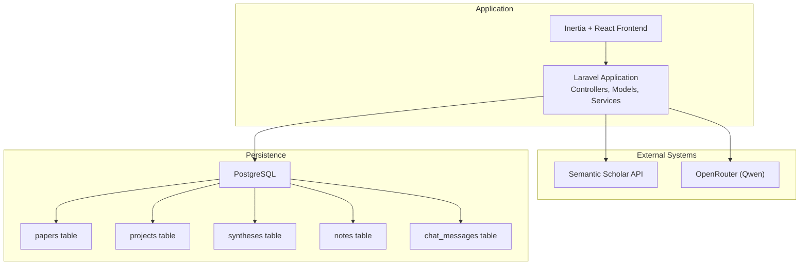
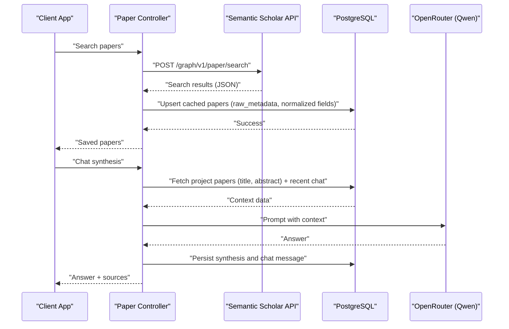
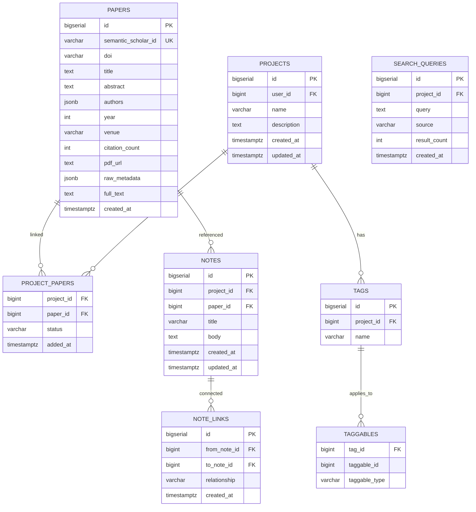
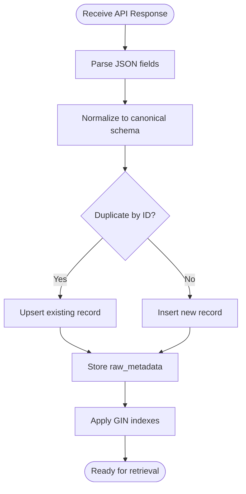
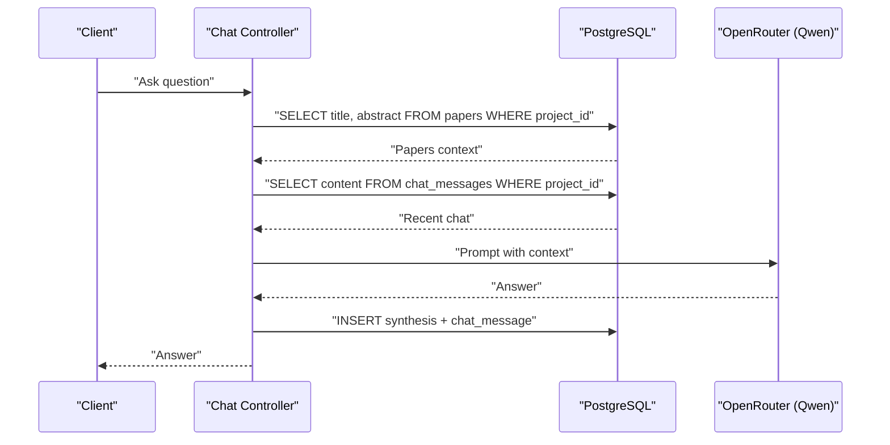
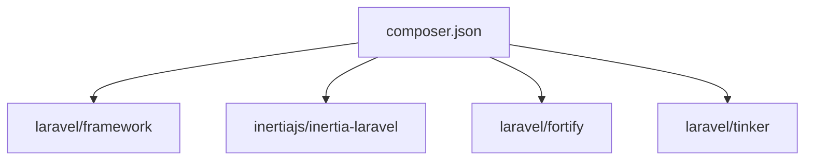

# Metadata Extraction and Processing

<cite>
**Referenced Files in This Document**
- [FULL_SPEC.md](file://hackathon/FULL_SPEC.md)
- [HACKATHON_SPEC.md](file://hackathon/HACKATHON_SPEC.md)
- [composer.json](file://composer.json)
- [User.php](file://app/Models/User.php)
- [Controller.php](file://app/Http/Controllers/Controller.php)
</cite>

## Table of Contents
1. [Introduction](#introduction)
2. [Project Structure](#project-structure)
3. [Core Components](#core-components)
4. [Architecture Overview](#architecture-overview)
5. [Detailed Component Analysis](#detailed-component-analysis)
6. [Dependency Analysis](#dependency-analysis)
7. [Performance Considerations](#performance-considerations)
8. [Troubleshooting Guide](#troubleshooting-guide)
9. [Conclusion](#conclusion)
10. [Appendices](#appendices)

## Introduction
This document explains the paper metadata extraction and processing capabilities implemented in the repository. It focuses on the metadata structure (title, abstract, publication year, Semantic Scholar identifiers), the transformation pipeline from external API responses to internal storage, validation and normalization techniques, enrichment strategies, and operational guidance for scaling and extensibility. The specification defines a PostgreSQL-centric design with JSONB fields for flexible metadata and GIN indexes for efficient full-text search.

## Project Structure
The repository follows a Laravel application layout with a focus on backend services, frontend integration via Inertia, and a PostgreSQL-backed persistence model. The metadata lifecycle is primarily defined in the data model specifications and the integration with Semantic Scholar for discovery and caching.

**Diagram sources**
- [FULL_SPEC.md:27-131](file://hackathon/FULL_SPEC.md#L27-L131)
- [HACKATHON_SPEC.md:33-81](file://hackathon/HACKATHON_SPEC.md#L33-L81)

**Section sources**
- [composer.json:1-119](file://composer.json#L1-L119)
- [User.php:1-51](file://app/Models/User.php#L1-L51)
- [Controller.php:1-9](file://app/Http/Controllers/Controller.php#L1-L9)

## Core Components
- Data model: The PostgreSQL schema defines core entities and their relationships, including the papers table with fields for Semantic Scholar identifiers, title, abstract, publication year, authors, venue, citation count, PDF URL, raw metadata, and full text. Additional tables support projects, notes, syntheses, and chat messages.
- Full-text search: GIN indexes are defined on title and body fields to enable efficient keyword-based retrieval.
- Semantic Scholar integration: The system queries Semantic Scholar’s graph search endpoint and caches results in the papers table, preserving the raw payload for reprocessing.
- Retrieval for chat: The chat and synthesis endpoints retrieve project context (papers’ titles and abstracts, plus recent chat messages) to ground model responses.

Key metadata fields and their roles:
- semantic_scholar_id: Unique identifier for deduplication and external linkage.
- title and abstract: Primary content for retrieval and synthesis.
- year: Publication year for chronological filtering and analysis.
- authors: JSONB array enabling flexible author metadata.
- raw_metadata: Complete Semantic Scholar response for reprocessing and provenance.
- full_text: Extracted body text for richer context when available.

**Section sources**
- [FULL_SPEC.md:27-131](file://hackathon/FULL_SPEC.md#L27-L131)
- [HACKATHON_SPEC.md:33-81](file://hackathon/HACKATHON_SPEC.md#L33-L81)

## Architecture Overview
The metadata processing architecture integrates external API consumption, internal storage, and downstream AI synthesis.

**Diagram sources**
- [FULL_SPEC.md:135-149](file://hackathon/FULL_SPEC.md#L135-L149)
- [FULL_SPEC.md:174-185](file://hackathon/FULL_SPEC.md#L174-L185)
- [HACKATHON_SPEC.md:83-117](file://hackathon/HACKATHON_SPEC.md#L83-L117)

## Detailed Component Analysis

### Data Model and Metadata Fields
The papers table captures essential metadata and flexible fields for enrichment. The schema supports:
- Unique identifiers and normalized fields (title, abstract, year)
- Structured arrays (authors) and scalar fields (venue, citation_count, pdf_url)
- Raw payload retention (raw_metadata) for reproducibility
- Optional full-text extraction (full_text) for synthesis

**Diagram sources**
- [FULL_SPEC.md:27-131](file://hackathon/FULL_SPEC.md#L27-L131)

**Section sources**
- [FULL_SPEC.md:27-131](file://hackathon/FULL_SPEC.md#L27-L131)

### Metadata Extraction Pipeline
The pipeline transforms external API responses into normalized internal records:
- API ingestion: Query Semantic Scholar’s search endpoint and parse the response.
- Deduplication: Use semantic_scholar_id to avoid duplicates.
- Normalization: Map fields to canonical schema columns (title, abstract, year, authors, venue, citation_count, pdf_url).
- Caching: Persist raw payload (raw_metadata) for future reprocessing.
- Indexing: Maintain GIN indexes on searchable fields (title, notes body) for fast retrieval.

**Diagram sources**
- [FULL_SPEC.md:135-139](file://hackathon/FULL_SPEC.md#L135-L139)
- [FULL_SPEC.md:59](file://hackathon/FULL_SPEC.md#L59)
- [FULL_SPEC.md:78](file://hackathon/FULL_SPEC.md#L78)

**Section sources**
- [FULL_SPEC.md:135-139](file://hackathon/FULL_SPEC.md#L135-L139)
- [FULL_SPEC.md:59](file://hackathon/FULL_SPEC.md#L59)
- [FULL_SPEC.md:78](file://hackathon/FULL_SPEC.md#L78)

### Validation, Normalization, and Enrichment
Validation and normalization strategies:
- Presence checks: Ensure required fields (title) are present before insertion.
- Type coercion: Convert year to integer; normalize authors to JSONB array.
- Sanitization: Trim whitespace, enforce max lengths for identifiers and titles.
- Enrichment: Derive citation_count and venue from raw metadata when missing; extract full_text when available.

Normalization rules:
- Title: Required, non-empty, trimmed.
- Abstract: Optional, sanitized.
- Year: Integer; validated range (e.g., reasonable publication years).
- Authors: Array of objects with name, optional affiliation and semantic_scholar_id.
- Venue and citation_count: Populate from raw_metadata if absent.
- PDF URL: Normalize URLs and validate scheme.

Enrichment techniques:
- Cross-field reconciliation: Use raw_metadata to fill gaps in normalized fields.
- Full-text extraction: Store extracted body text for richer context windows.
- Confidence scoring: For downstream tasks, maintain confidence flags for extracted facts.

**Section sources**
- [FULL_SPEC.md:44-58](file://hackathon/FULL_SPEC.md#L44-L58)
- [FULL_SPEC.md:150-157](file://hackathon/FULL_SPEC.md#L150-L157)

### Retrieval and Chat Context
Retrieval strategy for persistent memory:
- Pull project papers’ titles and abstracts.
- Append recent chat messages to provide session continuity.
- Ground model responses in stored context rather than server memory.

**Diagram sources**
- [HACKATHON_SPEC.md:77-80](file://hackathon/HACKATHON_SPEC.md#L77-L80)
- [HACKATHON_SPEC.md:83-90](file://hackathon/HACKATHON_SPEC.md#L83-L90)

**Section sources**
- [HACKATHON_SPEC.md:77-80](file://hackathon/HACKATHON_SPEC.md#L77-L80)
- [HACKATHON_SPEC.md:83-90](file://hackathon/HACKATHON_SPEC.md#L83-L90)

### Storage Optimization and Indexing
Storage optimization strategies:
- JSONB fields: Use raw_metadata to avoid schema drift while retaining flexibility.
- GIN indexes: Enable efficient full-text search on title and body fields.
- Partitioning: Consider range-partitioning by year or created_at for very large datasets.
- Compression: Enable row-level compression for less frequently accessed columns.

Indexing strategies:
- papers.title: GIN index with to_tsvector for English text.
- notes.body: GIN index for full-text search across notes.
- Composite indexes: Consider indexes on (project_id, status) for project_papers for faster filtering.

**Section sources**
- [FULL_SPEC.md:59](file://hackathon/FULL_SPEC.md#L59)
- [FULL_SPEC.md:78](file://hackathon/FULL_SPEC.md#L78)
- [FULL_SPEC.md:61-67](file://hackathon/FULL_SPEC.md#L61-L67)

### Data Migration Patterns
Migration patterns for evolving metadata schemas:
- Immutable migrations: Treat deployed migrations as immutable; introduce new migrations for schema changes.
- Backfill strategies: Use batched updates to populate new columns (e.g., full_text) from raw_metadata.
- Rollback-safe changes: Implement reversible down() methods where possible.
- Zero-downtime: Prefer online schema changes and shadow mode backfills for large datasets.

**Section sources**
- [.agents/skills/laravel-best-practices/rules/migrations.md:29-45](file://.agents/skills/laravel-best-practices/rules/migrations.md#L29-L45)
- [.agents/skills/laravel-best-practices/rules/migrations.md:86-97](file://.agents/skills/laravel-best-practices/rules/migrations.md#L86-L97)

### Extending Metadata Processing
Extensibility guidelines:
- Define new fields in the papers table with appropriate JSONB structures for flexible metadata.
- Add GIN indexes for new searchable fields.
- Introduce validation rules in the ingestion pipeline for new required fields.
- Provide enrichment jobs to derive new computed fields from raw_metadata.
- Maintain raw_metadata to support future reprocessing with updated transformations.

Best practices:
- Keep normalization deterministic and idempotent.
- Version raw_metadata to support backward-compatible parsing.
- Add unit tests for transformation logic and edge cases.

**Section sources**
- [FULL_SPEC.md:44-58](file://hackathon/FULL_SPEC.md#L44-L58)
- [FULL_SPEC.md:55](file://hackathon/FULL_SPEC.md#L55)

## Dependency Analysis
The application stack and runtime dependencies influence metadata processing throughput and reliability.

**Diagram sources**
- [composer.json:11-19](file://composer.json#L11-L19)

**Section sources**
- [composer.json:11-19](file://composer.json#L11-L19)

## Performance Considerations
- API rate limiting: Semantic Scholar’s free tier imposes constraints; implement caching and exponential backoff.
- Batch processing: Use bulk upserts for ingestion to reduce round trips.
- Query optimization: Leverage GIN indexes and limit returned columns to those needed for retrieval.
- Memory footprint: Avoid loading entire documents into server memory; stream or paginate where possible.
- Cost control: Select appropriate model tiers for tasks; monitor synthesis costs and apply caps.

[No sources needed since this section provides general guidance]

## Troubleshooting Guide
Common issues and recovery mechanisms:
- Duplicate entries: Use semantic_scholar_id for conflict resolution during upserts.
- Missing fields: Fall back to raw_metadata enrichment; log discrepancies for manual review.
- API failures: Implement retry with jitter and circuit breaker; cache partial results.
- Index contention: Monitor slow queries and adjust composite indexes; consider partitioning.
- Data quality: Enforce validation rules and surface warnings for malformed metadata.

**Section sources**
- [FULL_SPEC.md:135-139](file://hackathon/FULL_SPEC.md#L135-L139)
- [FULL_SPEC.md:150-157](file://hackathon/FULL_SPEC.md#L150-L157)

## Conclusion
The repository defines a robust metadata pipeline centered on PostgreSQL, JSONB flexibility, and Semantic Scholar integration. By normalizing, validating, enriching, and indexing metadata, the system supports persistent, queryable memory for synthesis and chat. The provided schema, indexing strategies, and migration patterns offer a scalable foundation for handling large datasets and evolving requirements.

[No sources needed since this section summarizes without analyzing specific files]

## Appendices
- Example scenarios:
  - Adding a paper: Query Semantic Scholar, normalize fields, upsert into papers, cache raw_metadata.
  - Chat synthesis: Retrieve project context, ground answer, persist synthesis and chat message.
  - Systematic review: Extract structured fields from papers using confidence flags for quality control.

[No sources needed since this section provides general guidance]