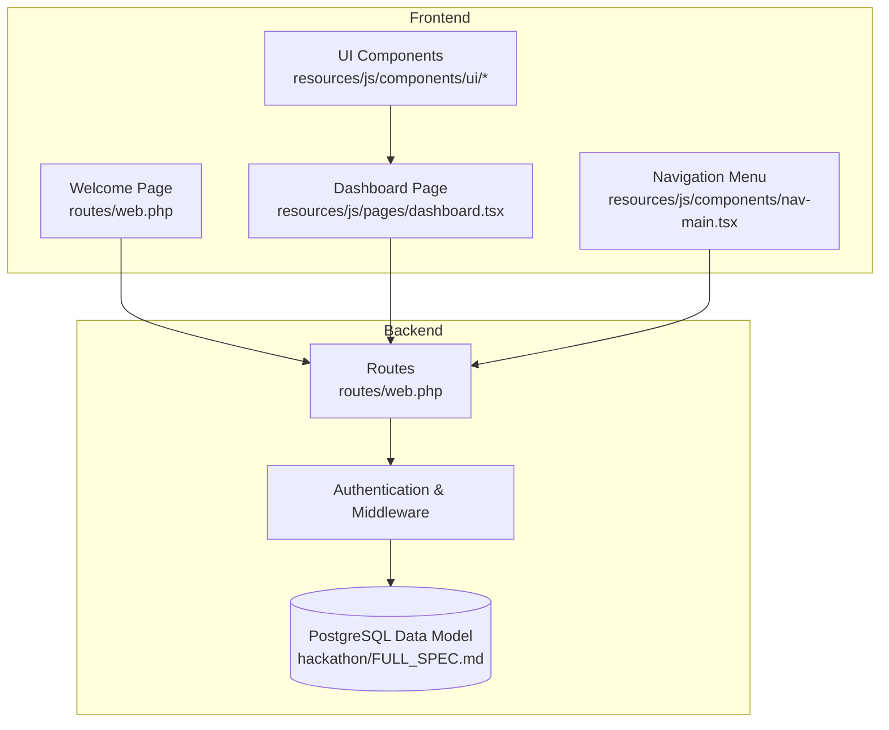
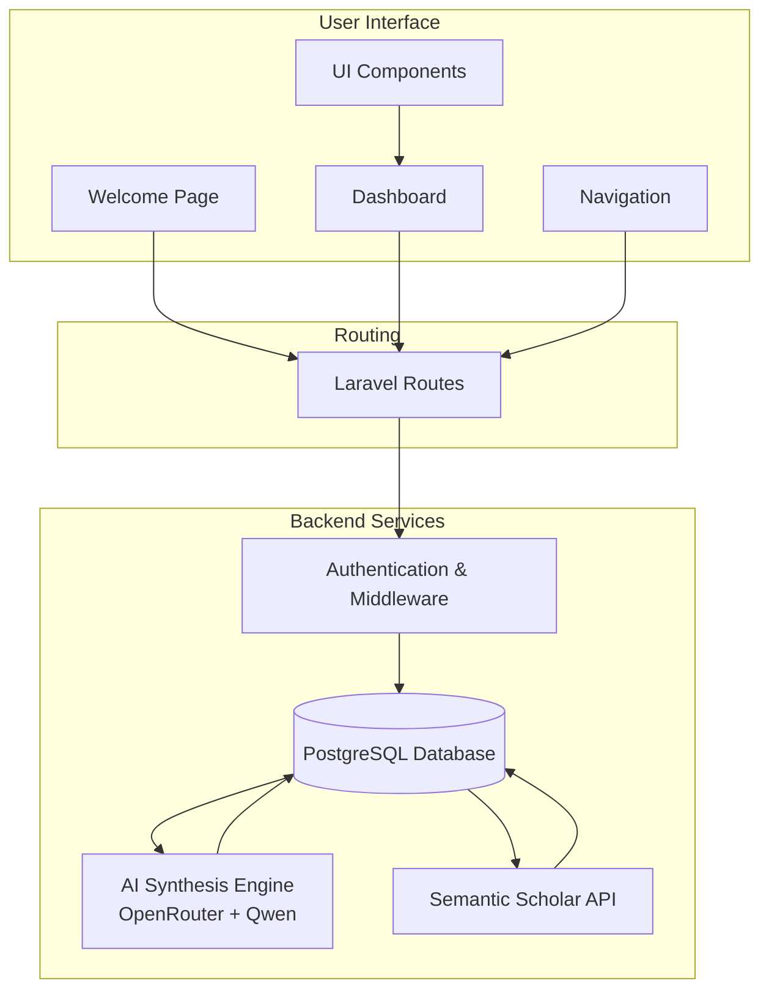
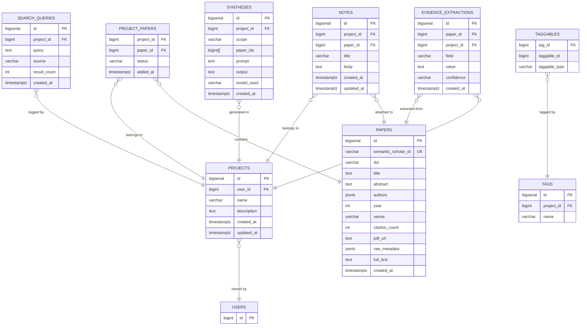
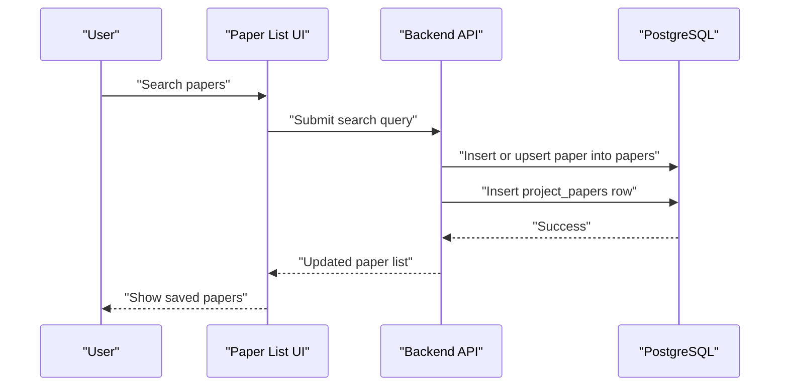
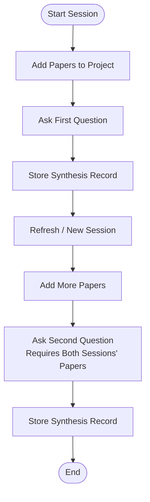
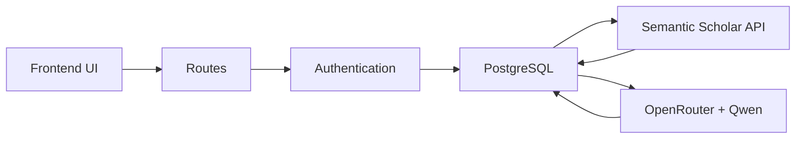

# Paper Management System

<cite>
**Referenced Files in This Document**
- [FULL_SPEC.md](file://hackathon/FULL_SPEC.md)
- [HACKATHON_SPEC.md](file://hackathon/HACKATHON_SPEC.md)
- [web.php](file://routes/web.php)
- [dashboard.tsx](file://resources/js/pages/dashboard.tsx)
- [welcome.tsx](file://resources/js/pages/welcome.tsx)
- [nav-main.tsx](file://resources/js/components/nav-main.tsx)
- [input.tsx](file://resources/js/components/ui/input.tsx)
- [card.tsx](file://resources/js/components/ui/card.tsx)
</cite>

## Table of Contents
1. [Introduction](#introduction)
2. [Project Structure](#project-structure)
3. [Core Components](#core-components)
4. [Architecture Overview](#architecture-overview)
5. [Detailed Component Analysis](#detailed-component-analysis)
6. [Dependency Analysis](#dependency-analysis)
7. [Performance Considerations](#performance-considerations)
8. [Troubleshooting Guide](#troubleshooting-guide)
9. [Conclusion](#conclusion)
10. [Appendices](#appendices)

## Introduction
This document describes the paper management system for ScholarGraph, focusing on Semantic Scholar API integration, paper search and discovery, metadata extraction and processing, project-based organization, and the user interface for managing papers. It also outlines paper storage, full-text processing, project-paper relationships, and integration with the AI synthesis engine. The specification is derived from the full product specification and the hackathon scope, ensuring alignment with both the long-term vision and the minimal viable implementation.

## Project Structure
The ScholarGraph application follows a Laravel backend with an Inertia/React frontend. The routes define basic navigation, while the frontend pages and components provide the user interface for paper management. The data model is defined in PostgreSQL with JSONB fields for flexible metadata and GIN indexes for full-text search.

**Diagram sources**
- [web.php:1-12](file://routes/web.php#L1-L12)
- [dashboard.tsx:1-37](file://resources/js/pages/dashboard.tsx#L1-L37)
- [nav-main.tsx:1-36](file://resources/js/components/nav-main.tsx#L1-L36)
- [input.tsx:1-21](file://resources/js/components/ui/input.tsx#L1-L21)
- [card.tsx:1-68](file://resources/js/components/ui/card.tsx#L1-L68)
- [FULL_SPEC.md:27-131](file://hackathon/FULL_SPEC.md#L27-L131)

**Section sources**
- [web.php:1-12](file://routes/web.php#L1-L12)
- [dashboard.tsx:1-37](file://resources/js/pages/dashboard.tsx#L1-L37)
- [nav-main.tsx:1-36](file://resources/js/components/nav-main.tsx#L1-L36)
- [input.tsx:1-21](file://resources/js/components/ui/input.tsx#L1-L21)
- [card.tsx:1-68](file://resources/js/components/ui/card.tsx#L1-L68)
- [FULL_SPEC.md:27-131](file://hackathon/FULL_SPEC.md#L27-L131)

## Core Components
- Semantic Scholar API integration: Discovery and caching of papers via the `/graph/v1/paper/search` endpoint, with results stored in the `papers` table and associated with projects via `project_papers`.
- Metadata extraction and processing: Papers include flexible metadata fields (authors, year, venue, citation count, pdf_url) and raw metadata JSONB for re-derivation. Full-text extraction is optional and stored in `full_text` for synthesis.
- Project-based organization: Projects group papers with statuses (unread, reading, read, excluded) and support notes and tags for deeper organization.
- AI synthesis engine integration: Qwen models via OpenRouter power single-paper chat, cross-paper synthesis, and evidence extraction. Syntheses record the model used and the set of papers involved.
- User interface: Pages for dashboard and welcome, with navigation and reusable UI components. The dashboard currently uses placeholders; the paper management UI is under development.

**Section sources**
- [FULL_SPEC.md:135-149](file://hackathon/FULL_SPEC.md#L135-L149)
- [FULL_SPEC.md:174-187](file://hackathon/FULL_SPEC.md#L174-L187)
- [HACKATHON_SPEC.md:106-129](file://hackathon/HACKATHON_SPEC.md#L106-L129)

## Architecture Overview
The system architecture integrates frontend UI with backend services and external APIs. The frontend renders pages and components, while the backend manages authentication, data persistence, and AI synthesis orchestration. Semantic Scholar provides discovery, and OpenRouter provides Qwen model access.

**Diagram sources**
- [web.php:1-12](file://routes/web.php#L1-L12)
- [welcome.tsx:1-390](file://resources/js/pages/welcome.tsx#L1-L390)
- [dashboard.tsx:1-37](file://resources/js/pages/dashboard.tsx#L1-L37)
- [nav-main.tsx:1-36](file://resources/js/components/nav-main.tsx#L1-L36)
- [FULL_SPEC.md:12-26](file://hackathon/FULL_SPEC.md#L12-L26)

## Detailed Component Analysis

### Data Model and Relationships
The data model defines core entities and their relationships, enabling persistent paper memory and project-based organization.

**Diagram sources**
- [FULL_SPEC.md:27-131](file://hackathon/FULL_SPEC.md#L27-L131)

**Section sources**
- [FULL_SPEC.md:27-131](file://hackathon/FULL_SPEC.md#L27-L131)

### Semantic Scholar API Integration
- Discovery: Query Semantic Scholar’s `/graph/v1/paper/search` endpoint and cache results in the `papers` table.
- Save-to-project: Associate discovered papers with a project via `project_papers`, enabling project-based organization.
- Citation graph traversal: Use Semantic Scholar’s graph endpoints to discover cited-by and references relationships.

Implementation highlights:
- Endpoint: `/graph/v1/paper/search`
- Storage: Papers cached in `papers` with `raw_metadata` preserved for re-derivation.
- Association: Project-paper linkage via `project_papers` with status tracking.

**Section sources**
- [FULL_SPEC.md:135-139](file://hackathon/FULL_SPEC.md#L135-L139)
- [FULL_SPEC.md:44-67](file://hackathon/FULL_SPEC.md#L44-L67)

### Paper Search and Discovery Mechanisms
- Keyword search: Full-text indexing on paper titles enables efficient search.
- Retrieval strategy: For the hackathon scope, retrieval pulls every paper’s title and abstract plus recent chat messages to construct context.
- Optional filtering: Full-text search on abstracts can constrain context growth.

Key elements:
- Indexes: GIN indexes on `papers.title` and `notes.body`.
- Context construction: Project papers’ titles/abstracts + chat history.

**Section sources**
- [FULL_SPEC.md:59](file://hackathon/FULL_SPEC.md#L59)
- [FULL_SPEC.md:78](file://hackathon/FULL_SPEC.md#L78)
- [HACKATHON_SPEC.md:83-90](file://hackathon/HACKATHON_SPEC.md#L83-L90)

### Metadata Extraction and Processing
- Flexible metadata: Authors array, publication year, venue, citation count, and PDF URL.
- Raw metadata preservation: `raw_metadata` stores the complete Semantic Scholar payload for future reprocessing.
- Full-text extraction: Optional extraction of body text into `full_text` for synthesis and chat.

Processing considerations:
- Abstract-only fallback: For paywalled papers, synthesis can rely on abstracts and metadata.
- Confidence scoring: Evidence extraction records model confidence (high/medium/low).

**Section sources**
- [FULL_SPEC.md:44-57](file://hackathon/FULL_SPEC.md#L44-L57)
- [FULL_SPEC.md:99-107](file://hackathon/FULL_SPEC.md#L99-L107)

### Project-Based Organization System
- Projects: Contain papers with status tracking and optional descriptions.
- Tags: Project-scoped tags applied to papers and notes via `taggables`.
- Notes: Attachable to papers or standalone, supporting a graph-like knowledge structure.

Relationships:
- One-to-many between projects and papers via `project_papers`.
- Tagging via `tags` and `taggables`.

**Section sources**
- [FULL_SPEC.md:35-42](file://hackathon/FULL_SPEC.md#L35-L42)
- [FULL_SPEC.md:61-67](file://hackathon/FULL_SPEC.md#L61-L67)
- [FULL_SPEC.md:109-121](file://hackathon/FULL_SPEC.md#L109-L121)

### Paper Storage Capabilities and Full-Text Processing
- Storage: Papers persisted in `papers` with deduplication by `semantic_scholar_id`.
- Full-text: Optional extraction into `full_text` for synthesis and chat contexts.
- Export: Citation formatting and export handled server-side from stored metadata.

**Section sources**
- [FULL_SPEC.md:44-57](file://hackathon/FULL_SPEC.md#L44-L57)
- [FULL_SPEC.md:158-160](file://hackathon/FULL_SPEC.md#L158-L160)

### Project-Paper Relationship Management
- Status tracking: Papers can be marked unread, reading, read, or excluded per project.
- Added timestamps: Track when papers were added to a project.
- Synthesis linkage: Syntheses record which papers contributed to answers.

**Section sources**
- [FULL_SPEC.md:61-67](file://hackathon/FULL_SPEC.md#L61-L67)
- [FULL_SPEC.md:88-97](file://hackathon/FULL_SPEC.md#L88-L97)

### AI Synthesis Engine Integration
- Single-paper chat: Uses paper full text (if available) or abstract + metadata as context.
- Cross-paper synthesis: Select N papers in a project to answer comparative questions; results stored with model and paper set.
- Evidence extraction: Structured extraction of fields (e.g., sample size, method, finding, limitation) with confidence flags.
- Model assignment: Different Qwen tiers selected per task type via OpenRouter.

**Section sources**
- [FULL_SPEC.md:141-149](file://hackathon/FULL_SPEC.md#L141-L149)
- [FULL_SPEC.md:174-187](file://hackathon/FULL_SPEC.md#L174-L187)
- [HACKATHON_SPEC.md:92-99](file://hackathon/HACKATHON_SPEC.md#L92-L99)

### User Interface for Paper Management
- Pages: Welcome and Dashboard pages provide entry points and initial layouts.
- Navigation: Sidebar navigation supports platform items and active-state highlighting.
- Components: Reusable UI components (inputs, cards) support form and content presentation.

Current state:
- Dashboard uses placeholders; UI for paper lists, search, and synthesis is under development.

**Section sources**
- [welcome.tsx:1-390](file://resources/js/pages/welcome.tsx#L1-L390)
- [dashboard.tsx:1-37](file://resources/js/pages/dashboard.tsx#L1-L37)
- [nav-main.tsx:1-36](file://resources/js/components/nav-main.tsx#L1-L36)
- [input.tsx:1-21](file://resources/js/components/ui/input.tsx#L1-L21)
- [card.tsx:1-68](file://resources/js/components/ui/card.tsx#L1-L68)

### Implementation Details: Paper Addition to Projects
- Discovery: Search Semantic Scholar and cache results in `papers`.
- Save-to-project: Insert into `project_papers` with default status `unread`.
- Status updates: Allow users to update status (reading/read/excluded) as they progress.

**Diagram sources**
- [FULL_SPEC.md:135-139](file://hackathon/FULL_SPEC.md#L135-L139)
- [FULL_SPEC.md:61-67](file://hackathon/FULL_SPEC.md#L61-L67)

**Section sources**
- [FULL_SPEC.md:135-139](file://hackathon/FULL_SPEC.md#L135-L139)
- [FULL_SPEC.md:61-67](file://hackathon/FULL_SPEC.md#L61-L67)

### Implementation Details: Metadata Handling
- Storage: Authors, year, venue, citation count, PDF URL, and raw metadata stored in `papers`.
- Processing: Extract and normalize metadata; preserve raw payload for reprocessing.
- Full-text: Optional extraction into `full_text` for synthesis.

**Section sources**
- [FULL_SPEC.md:44-57](file://hackathon/FULL_SPEC.md#L44-L57)

### Implementation Details: Integration with AI Synthesis Engine
- Context assembly: Pull project papers (title/abstract) and recent chat messages.
- Model selection: Choose appropriate Qwen model per task type.
- Results logging: Store syntheses with model used and paper set for reproducibility.

**Section sources**
- [FULL_SPEC.md:141-149](file://hackathon/FULL_SPEC.md#L141-L149)
- [FULL_SPEC.md:174-187](file://hackathon/FULL_SPEC.md#L174-L187)
- [HACKATHON_SPEC.md:92-99](file://hackathon/HACKATHON_SPEC.md#L92-L99)

### Examples of Paper Workflow and Management Patterns
- Persistent memory demonstration: Add papers to a project, ask a question, refresh, add more papers, and ask a question that requires both old and new papers. The chat history and paper abstracts are retrieved fresh from the database each session.
- Cross-paper synthesis: Select multiple papers in a project to compare findings, with results logged in `syntheses` including the model used and the paper set.
- Evidence extraction: Run structured extraction across papers to produce a sortable matrix of findings, limitations, and methodologies.

**Diagram sources**
- [HACKATHON_SPEC.md:14-18](file://hackathon/HACKATHON_SPEC.md#L14-L18)
- [HACKATHON_SPEC.md:119-129](file://hackathon/HACKATHON_SPEC.md#L119-L129)
- [FULL_SPEC.md:88-97](file://hackathon/FULL_SPEC.md#L88-L97)

**Section sources**
- [HACKATHON_SPEC.md:14-18](file://hackathon/HACKATHON_SPEC.md#L14-L18)
- [HACKATHON_SPEC.md:119-129](file://hackathon/HACKATHON_SPEC.md#L119-L129)
- [FULL_SPEC.md:88-97](file://hackathon/FULL_SPEC.md#L88-L97)

## Dependency Analysis
The system exhibits clear separation of concerns:
- Frontend depends on routing and UI components.
- Backend depends on authentication, database, and external service integrations.
- Data model defines explicit relationships among entities.

**Diagram sources**
- [web.php:1-12](file://routes/web.php#L1-L12)
- [FULL_SPEC.md:12-26](file://hackathon/FULL_SPEC.md#L12-L26)

**Section sources**
- [web.php:1-12](file://routes/web.php#L1-L12)
- [FULL_SPEC.md:12-26](file://hackathon/FULL_SPEC.md#L12-L26)

## Performance Considerations
- Full-text search: GIN indexes on titles and note bodies enable fast retrieval.
- Context size: Limit context growth by filtering with full-text search on abstracts when scaling beyond a handful of papers.
- Rate limits: Semantic Scholar free tier allows 100 requests per 5 minutes; consider caching or API keys for production.
- Cost control: Cross-paper synthesis with larger models is expensive; implement caps or warnings for large paper sets.

**Section sources**
- [FULL_SPEC.md:59](file://hackathon/FULL_SPEC.md#L59)
- [FULL_SPEC.md:78](file://hackathon/FULL_SPEC.md#L78)
- [FULL_SPEC.md:203-209](file://hackathon/FULL_SPEC.md#L203-L209)

## Troubleshooting Guide
- Authentication barriers: Ensure routes are protected and verified users can access the dashboard.
- Data inconsistencies: Verify unique constraints on `semantic_scholar_id` and proper foreign keys in `project_papers`.
- API rate limits: Monitor Semantic Scholar rate limits and implement caching or backoff strategies.
- Model availability: Confirm OpenRouter model listings and handle fallbacks gracefully.

**Section sources**
- [web.php:7-9](file://routes/web.php#L7-L9)
- [FULL_SPEC.md:46](file://hackathon/FULL_SPEC.md#L46)
- [FULL_SPEC.md:203](file://hackathon/FULL_SPEC.md#L203)

## Conclusion
ScholarGraph’s paper management system integrates Semantic Scholar discovery with a robust PostgreSQL data model, project-based organization, and AI synthesis powered by OpenRouter/Qwen. The architecture supports persistent memory across sessions, scalable search via full-text indexing, and extensible organization through tags and notes. The UI foundation is established, with paper management features under development. Adhering to the outlined data model and integration patterns ensures reliable paper storage, metadata handling, and synthesis workflows.

## Appendices
- Minimal data model for hackathon scope includes projects, papers, syntheses, and chat messages.
- Build order prioritizes authentication, project CRUD, Semantic Scholar search, and chat synthesis.

**Section sources**
- [HACKATHON_SPEC.md:33-75](file://hackathon/HACKATHON_SPEC.md#L33-L75)
- [HACKATHON_SPEC.md:106-118](file://hackathon/HACKATHON_SPEC.md#L106-L118)