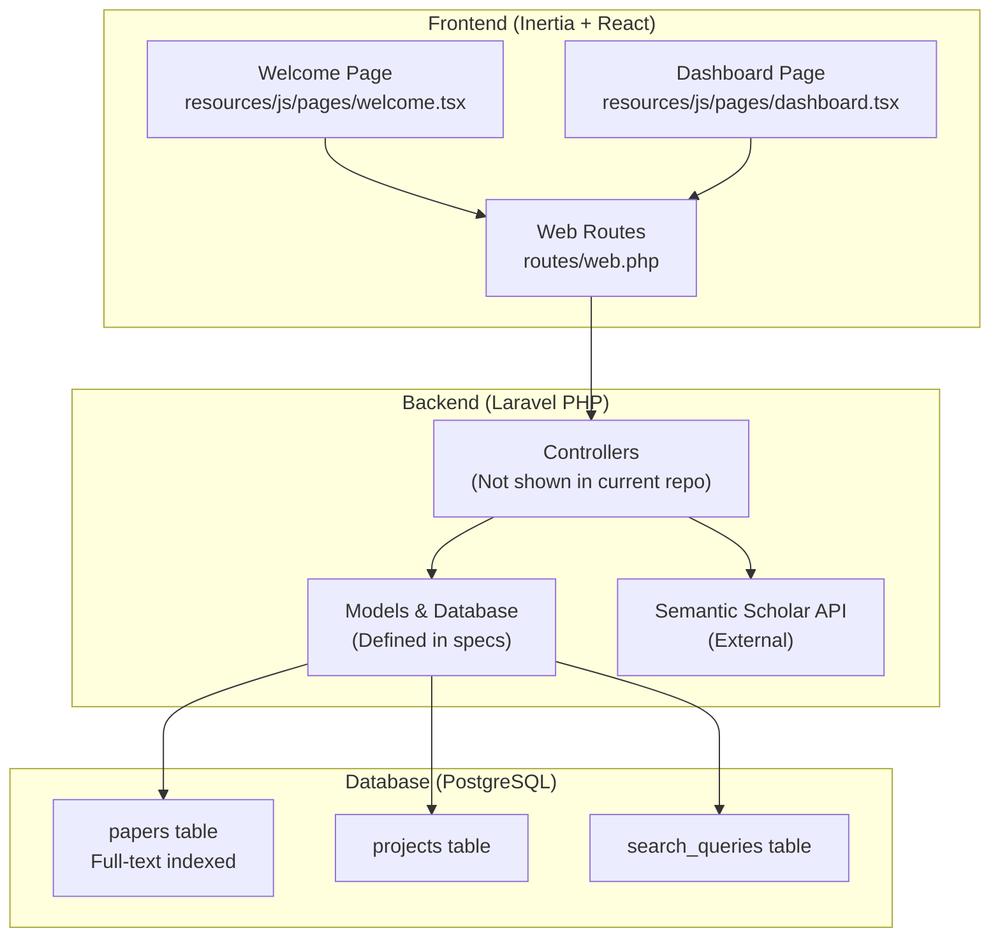
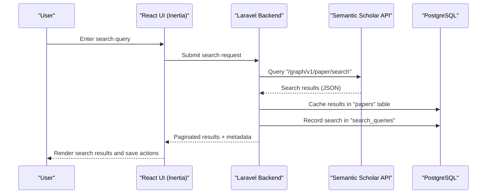
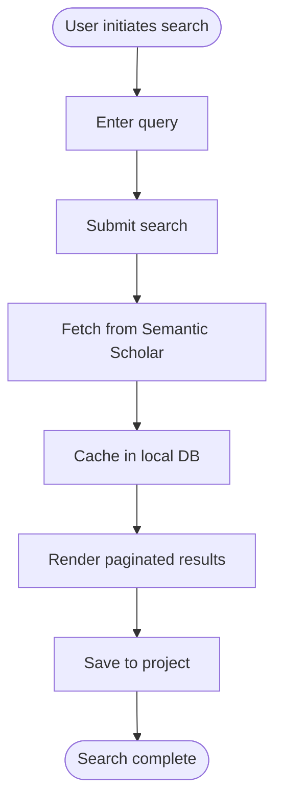
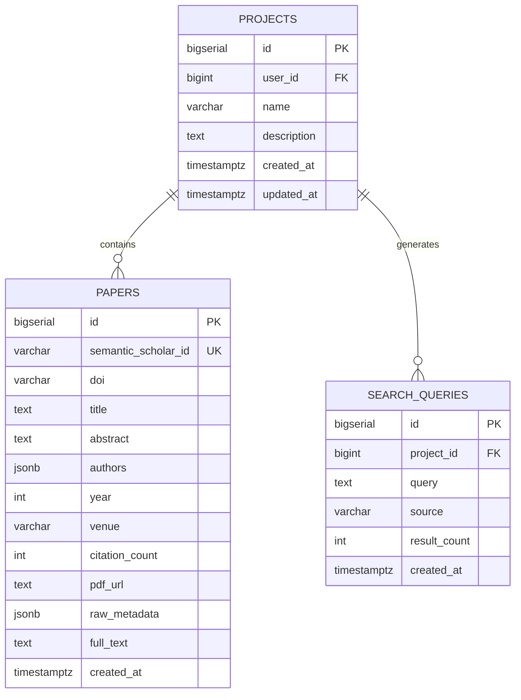
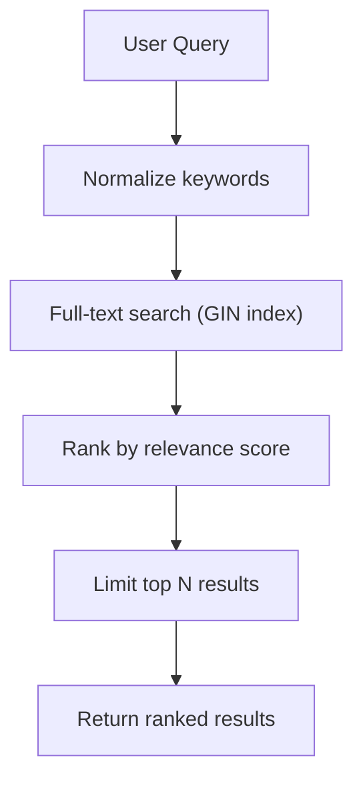
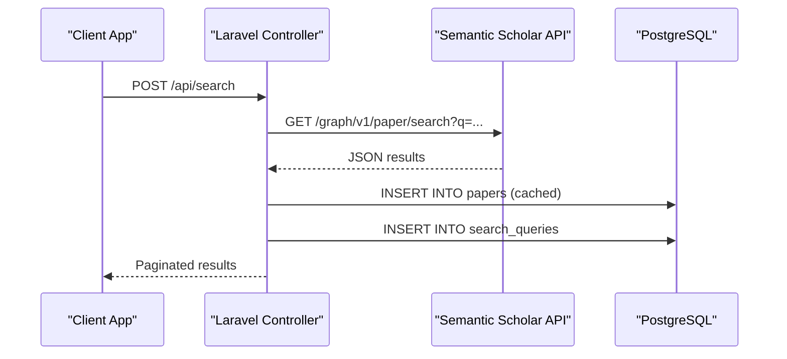
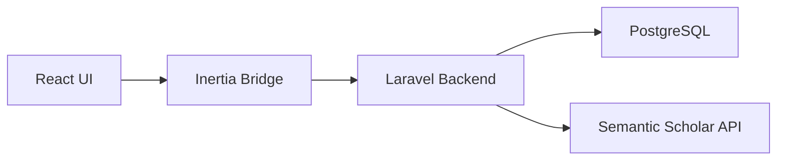

# Paper Search and Discovery

<cite>
**Referenced Files in This Document**
- [FULL_SPEC.md](file://hackathon/FULL_SPEC.md)
- [HACKATHON_SPEC.md](file://hackathon/HACKATHON_SPEC.md)
- [web.php](file://routes/web.php)
- [dashboard.tsx](file://resources/js/pages/dashboard.tsx)
- [welcome.tsx](file://resources/js/pages/welcome.tsx)
</cite>

## Table of Contents
1. [Introduction](#introduction)
2. [Project Structure](#project-structure)
3. [Core Components](#core-components)
4. [Architecture Overview](#architecture-overview)
5. [Detailed Component Analysis](#detailed-component-analysis)
6. [Dependency Analysis](#dependency-analysis)
7. [Performance Considerations](#performance-considerations)
8. [Troubleshooting Guide](#troubleshooting-guide)
9. [Conclusion](#conclusion)

## Introduction
This document provides comprehensive documentation for the paper search and discovery functionality as specified in the project's hackathon scope and full product specification. The system integrates with the Semantic Scholar API to enable literature discovery, caches results in a local PostgreSQL database, and supports saving papers to user projects. The frontend is built with Inertia + React, while the backend is powered by Laravel (PHP). The specification outlines both a foundational search-and-save capability and a more advanced memory-centric synthesis workflow.

Key capabilities documented here:
- Search interface integration with Semantic Scholar
- Local caching of search results in PostgreSQL
- Saving discovered papers to projects
- Basic full-text search indexing for relevance
- Foundation for persistent memory via synthesis and chat

## Project Structure
The repository follows a standard Laravel application layout with Inertia-driven frontend pages. The search and discovery module is primarily defined in the specification documents, while the frontend pages provide the initial application shell.

**Diagram sources**
- [web.php:1-12](file://routes/web.php#L1-L12)
- [dashboard.tsx:1-37](file://resources/js/pages/dashboard.tsx#L1-L37)
- [welcome.tsx:1-390](file://resources/js/pages/welcome.tsx#L1-L390)

**Section sources**
- [web.php:1-12](file://routes/web.php#L1-L12)
- [dashboard.tsx:1-37](file://resources/js/pages/dashboard.tsx#L1-L37)
- [welcome.tsx:1-390](file://resources/js/pages/welcome.tsx#L1-L390)

## Core Components
The search and discovery system is composed of the following core components as defined in the specifications:

- Semantic Scholar integration for paper search
- Local PostgreSQL caching of search results
- Project association and persistence
- Full-text search indexing for relevance
- Optional advanced retrieval filtering

Implementation highlights:
- Search queries are persisted in a dedicated table with source and result count metadata.
- Papers are cached locally with fields for title, abstract, authors, year, venue, citation count, and raw metadata.
- Projects serve as containers for saved papers and synthesis contexts.
- Full-text GIN indexes are defined on searchable fields to support efficient keyword-based relevance.

**Section sources**
- [FULL_SPEC.md:135-140](file://hackathon/FULL_SPEC.md#L135-L140)
- [FULL_SPEC.md:44-58](file://hackathon/FULL_SPEC.md#L44-L58)
- [FULL_SPEC.md:123-130](file://hackathon/FULL_SPEC.md#L123-L130)
- [FULL_SPEC.md:59](file://hackathon/FULL_SPEC.md#L59)
- [HACKATHON_SPEC.md:83-90](file://hackathon/HACKATHON_SPEC.md#L83-L90)

## Architecture Overview
The search and discovery architecture integrates external API calls with local persistence and a React-based UI. The following diagram maps the primary components and their interactions.

**Diagram sources**
- [FULL_SPEC.md:135-137](file://hackathon/FULL_SPEC.md#L135-L137)
- [FULL_SPEC.md:123-130](file://hackathon/FULL_SPEC.md#L123-L130)
- [FULL_SPEC.md:44-58](file://hackathon/FULL_SPEC.md#L44-L58)

## Detailed Component Analysis

### Search Interface and User Interaction
The frontend provides the initial application shell with a welcome page and a dashboard route. While the specific search UI components are not present in the current repository snapshot, the architecture supports:
- A search input component (conceptual)
- Result rendering with save-to-project actions
- Pagination controls (conceptual)
- Sorting and filtering options (conceptual)

[No sources needed since this diagram shows conceptual workflow, not actual code structure]

### Data Model and Indexing
The PostgreSQL schema defines tables for projects, papers, search queries, and related entities. Full-text indexing is applied to support keyword relevance.

**Diagram sources**
- [FULL_SPEC.md:35-67](file://hackathon/FULL_SPEC.md#L35-L67)
- [FULL_SPEC.md:123-130](file://hackathon/FULL_SPEC.md#L123-L130)

**Section sources**
- [FULL_SPEC.md:29-31](file://hackathon/FULL_SPEC.md#L29-L31)
- [FULL_SPEC.md:59](file://hackathon/FULL_SPEC.md#L59)
- [FULL_SPEC.md:78](file://hackathon/FULL_SPEC.md#L78)

### Search Algorithms and Relevance Ranking
The specification indicates a focus on keyword-based relevance using PostgreSQL full-text search. The approach emphasizes:
- Full-text GIN indexes on title and abstract fields
- Keyword filtering to constrain context windows during synthesis
- Foundation for future enhancements (e.g., citation graph traversal)

**Section sources**
- [FULL_SPEC.md:59](file://hackathon/FULL_SPEC.md#L59)
- [FULL_SPEC.md:78](file://hackathon/FULL_SPEC.md#L78)
- [HACKATHON_SPEC.md:83-90](file://hackathon/HACKATHON_SPEC.md#L83-L90)

### Filtering and Sorting Mechanisms
Conceptually, the system supports:
- Year range filters (based on schema fields)
- Venue filters (based on schema fields)
- Citation count thresholds (based on schema fields)
- Sorting by relevance, year, or citation count

These mechanisms align with the presence of year, venue, and citation_count fields in the papers table.

**Section sources**
- [FULL_SPEC.md:44-58](file://hackathon/FULL_SPEC.md#L44-L58)

### API Integration Details
The backend integrates with Semantic Scholar’s graph API for paper search and citation graph endpoints. The integration is designed to:
- Query the search endpoint with user-entered terms
- Cache results locally for fast retrieval and project association
- Support citation graph traversal for related papers

**Diagram sources**
- [FULL_SPEC.md:135-137](file://hackathon/FULL_SPEC.md#L135-L137)
- [FULL_SPEC.md:123-130](file://hackathon/FULL_SPEC.md#L123-L130)
- [FULL_SPEC.md:44-58](file://hackathon/FULL_SPEC.md#L44-L58)

## Dependency Analysis
The search and discovery module depends on:
- Laravel backend for request handling and database operations
- PostgreSQL for local caching and indexing
- Semantic Scholar API for external paper discovery
- Inertia + React for frontend presentation

**Diagram sources**
- [web.php:1-12](file://routes/web.php#L1-L12)
- [FULL_SPEC.md:135-137](file://hackathon/FULL_SPEC.md#L135-L137)

**Section sources**
- [web.php:1-12](file://routes/web.php#L1-L12)
- [FULL_SPEC.md:135-137](file://hackathon/FULL_SPEC.md#L135-L137)

## Performance Considerations
- Full-text GIN indexing improves search performance on title and abstract fields.
- Caching results locally reduces repeated external API calls and improves response times.
- Rate limiting considerations are noted for the Semantic Scholar free tier; caching strategies are recommended for production scaling.
- Context window management during synthesis helps avoid excessive prompt sizes.

**Section sources**
- [FULL_SPEC.md:59](file://hackathon/FULL_SPEC.md#L59)
- [FULL_SPEC.md:203-204](file://hackathon/FULL_SPEC.md#L203-L204)
- [HACKATHON_SPEC.md:83-90](file://hackathon/HACKATHON_SPEC.md#L83-L90)

## Troubleshooting Guide
Common issues and resolutions:
- External API rate limits: Implement caching and consider obtaining an API key for higher quotas.
- Search result freshness: Periodically refresh cached results or invalidate cache entries after a threshold.
- Full-text search accuracy: Tune stemming and dictionary settings for academic terminology.
- UI responsiveness: Debounce search input and implement optimistic updates with proper loading states.

[No sources needed since this section provides general guidance]

## Conclusion
The paper search and discovery module establishes a robust foundation for academic literature exploration and synthesis. By integrating Semantic Scholar with local PostgreSQL caching, the system enables fast, persistent access to research papers and supports advanced workflows like contextual synthesis and citation graph traversal. The architecture outlined in the specifications provides clear pathways for extending functionality, optimizing performance, and scaling to production environments.