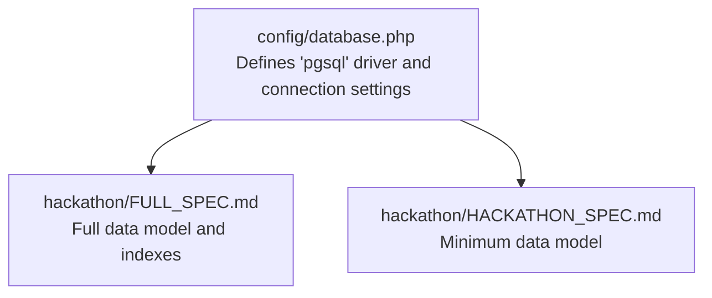
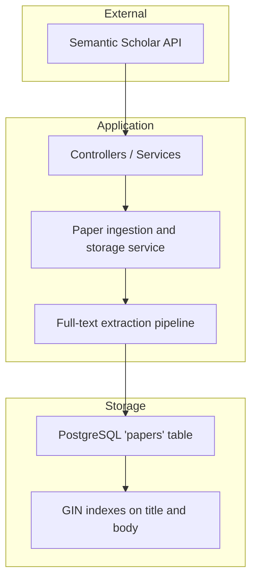
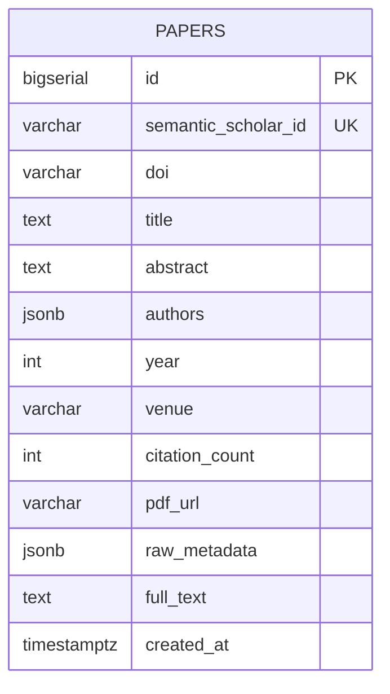
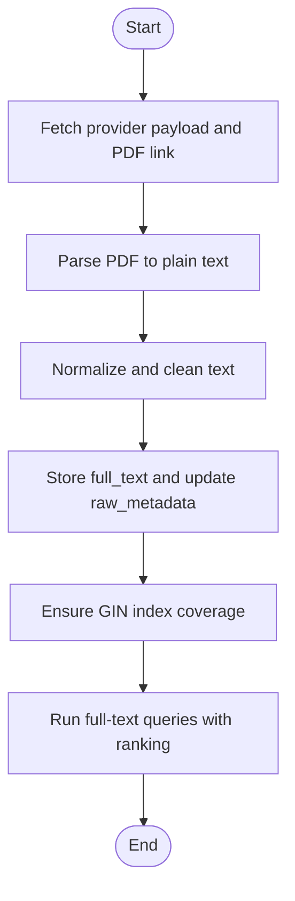
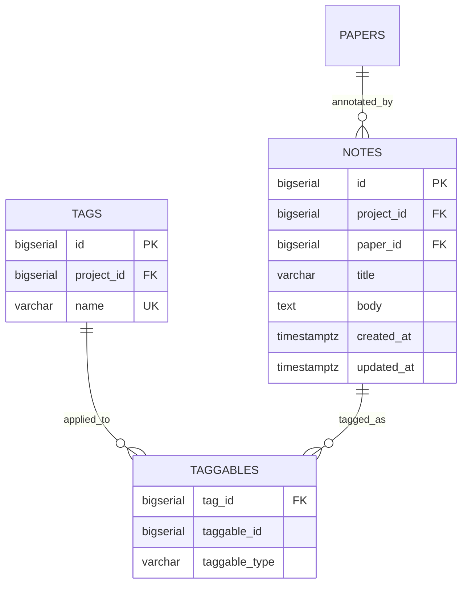
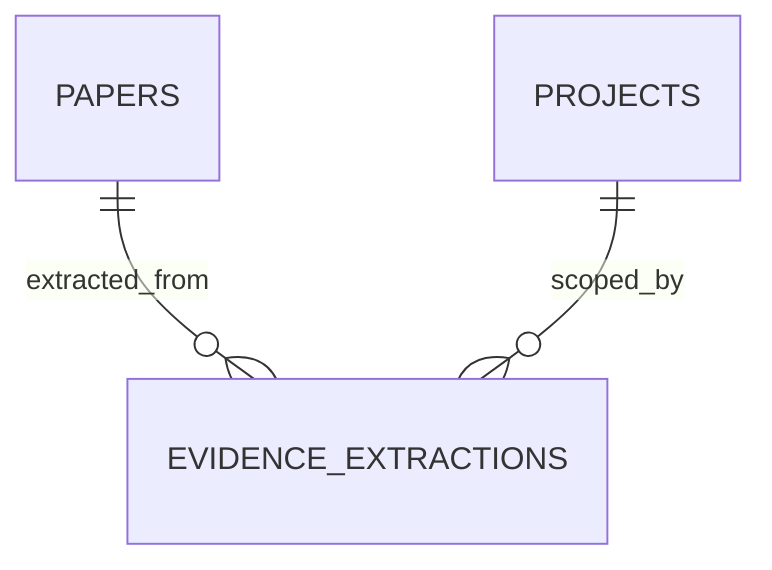
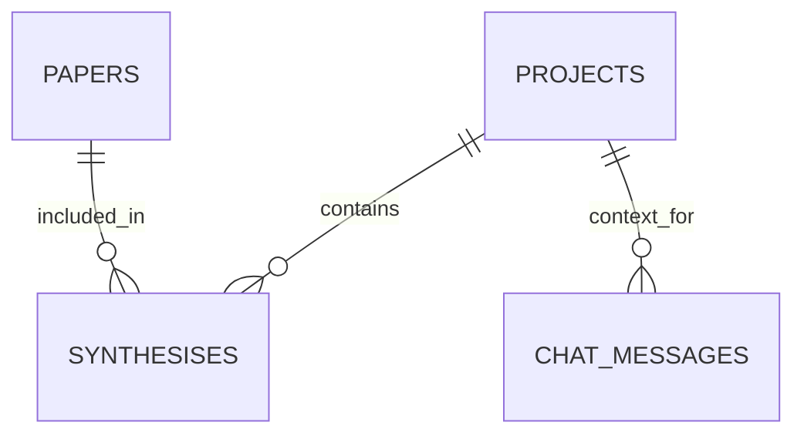
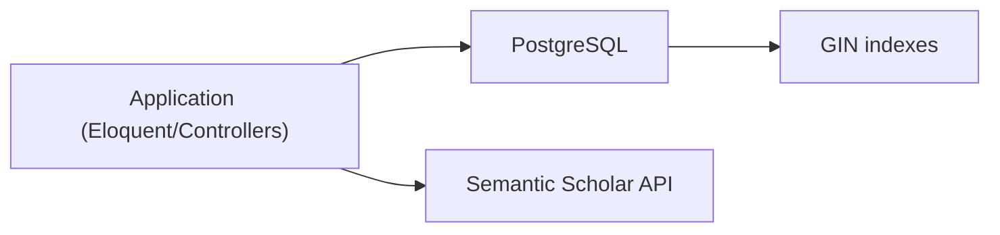

# Paper Storage and Full-Text Processing

<cite>
**Referenced Files in This Document**
- [FULL_SPEC.md](file://hackathon/FULL_SPEC.md)
- [HACKATHON_SPEC.md](file://hackathon/HACKATHON_SPEC.md)
- [database.php](file://config/database.php)
- [0001_01_01_000000_create_users_table.php](file://database/migrations/0001_01_01_000000_create_users_table.php)
- [2025_08_14_170933_add_two_factor_columns_to_users_table.php](file://database/migrations/2025_08_14_170933_add_two_factor_columns_to_users_table.php)
</cite>

## Table of Contents
1. [Introduction](#introduction)
2. [Project Structure](#project-structure)
3. [Core Components](#core-components)
4. [Architecture Overview](#architecture-overview)
5. [Detailed Component Analysis](#detailed-component-analysis)
6. [Dependency Analysis](#dependency-analysis)
7. [Performance Considerations](#performance-considerations)
8. [Troubleshooting Guide](#troubleshooting-guide)
9. [Conclusion](#conclusion)
10. [Appendices](#appendices)

## Introduction
This document explains the paper storage mechanisms and full-text processing capabilities designed for the project. It covers the PostgreSQL schema for storing papers, including JSONB fields for raw metadata and structured data, indexing strategies for full-text search, and query performance considerations. It also documents the full-text processing pipeline, from ingestion to storage and retrieval, and outlines operational aspects such as scalability, backups, and archival policies. Guidance is provided for extending storage capabilities and adding advanced text processing features.

## Project Structure
The repository defines the data model and full-text indexing strategy in the hackathon specification documents. The application’s database configuration supports PostgreSQL, which is required for PostgreSQL-specific features such as GIN indexes and full-text search operators.

**Diagram sources**
- [database.php:87-100](file://config/database.php#L87-L100)
- [FULL_SPEC.md:27-131](file://hackathon/FULL_SPEC.md#L27-L131)
- [HACKATHON_SPEC.md:33-81](file://hackathon/HACKATHON_SPEC.md#L33-L81)

**Section sources**
- [database.php:87-100](file://config/database.php#L87-L100)
- [FULL_SPEC.md:27-131](file://hackathon/FULL_SPEC.md#L27-L131)
- [HACKATHON_SPEC.md:33-81](file://hackathon/HACKATHON_SPEC.md#L33-L81)

## Core Components
- Papers table: central entity for storing paper metadata, optional full-text, and raw provider payload. Supports full-text search on title and abstract.
- Projects table: organizes papers into user-scoped groups.
- Project-Papers linkage: tracks paper membership and reading status.
- Notes and note links: optional graph-style annotations linked to papers or standalone.
- Evidence extractions: structured fields extracted per paper for systematic review.
- Tags and taggables: lightweight categorization for papers and notes.
- Search queries: audit trail of search terms and sources.

Key schema highlights:
- JSONB fields for flexible metadata and raw provider payloads.
- GIN indexes on text-searchable columns for efficient full-text queries.
- Arrays for multi-valued identifiers (e.g., paper_ids in syntheses).
- Timestamps for auditability and temporal queries.

**Section sources**
- [FULL_SPEC.md:44-131](file://hackathon/FULL_SPEC.md#L44-L131)
- [HACKATHON_SPEC.md:39-75](file://hackathon/HACKATHON_SPEC.md#L39-L75)

## Architecture Overview
The system integrates external literature search (Semantic Scholar) with local storage and full-text search. Papers are cached with raw metadata and optionally full text. Retrieval for chat and synthesis pulls from stored data, ensuring persistent, queryable memory.

**Diagram sources**
- [FULL_SPEC.md:135-149](file://hackathon/FULL_SPEC.md#L135-L149)
- [FULL_SPEC.md:44-58](file://hackathon/FULL_SPEC.md#L44-L58)
- [FULL_SPEC.md:59](file://hackathon/FULL_SPEC.md#L59)
- [FULL_SPEC.md:78](file://hackathon/FULL_SPEC.md#L78)

## Detailed Component Analysis

### Papers Table Schema and JSONB Design
- Fields:
  - Identifiers: primary key, optional semantic_scholar_id, DOI.
  - Metadata: title, abstract, authors (JSONB), year, venue, citation_count, pdf_url.
  - Content: raw_metadata (JSONB), full_text (TEXT).
  - Audit: created_at.
- Indexes:
  - GIN on to_tsvector('english', title) for efficient title search.
  - Optional GIN on full_text or abstract for broader full-text search.
- Rationale:
  - JSONB enables flexible schema evolution while preserving provider payloads for reprocessing.
  - Separating raw_metadata from structured fields allows controlled querying and updates.

**Diagram sources**
- [FULL_SPEC.md:44-58](file://hackathon/FULL_SPEC.md#L44-L58)

**Section sources**
- [FULL_SPEC.md:44-58](file://hackathon/FULL_SPEC.md#L44-L58)
- [FULL_SPEC.md:59](file://hackathon/FULL_SPEC.md#L59)

### Full-Text Processing Pipeline
- Extraction:
  - Retrieve PDF URLs or provider links; parse PDFs to plain text bodies.
  - Normalize whitespace and strip non-text artifacts.
- Preprocessing:
  - Lowercase, remove extra whitespace, optional stopword removal and stemming depending on downstream needs.
  - Optionally split into chunks for chunk-based retrieval.
- Storage:
  - Store cleaned full_text in the papers.full_text column.
  - Keep raw_metadata JSONB for reproducibility and future reprocessing.
- Retrieval:
  - Use GIN indexes with to_tsvector('english', ...) for ranking and filtering.
  - Combine with project membership and status filters for context-aware chat and synthesis.

**Diagram sources**
- [FULL_SPEC.md:135-149](file://hackathon/FULL_SPEC.md#L135-L149)
- [FULL_SPEC.md:55](file://hackathon/FULL_SPEC.md#L55)
- [FULL_SPEC.md:59](file://hackathon/FULL_SPEC.md#L59)

**Section sources**
- [FULL_SPEC.md:135-149](file://hackathon/FULL_SPEC.md#L135-L149)
- [FULL_SPEC.md:55-56](file://hackathon/FULL_SPEC.md#L55-L56)
- [FULL_SPEC.md:59](file://hackathon/FULL_SPEC.md#L59)

### Notes and Tagging for Enhanced Organization
- Notes table supports graph-style annotations with full-text body and relationships.
- Tagging via taggables associates tags with papers and notes, enabling filtering and grouping.

**Diagram sources**
- [FULL_SPEC.md:69-78](file://hackathon/FULL_SPEC.md#L69-L78)
- [FULL_SPEC.md:109-121](file://hackathon/FULL_SPEC.md#L109-L121)

**Section sources**
- [FULL_SPEC.md:69-78](file://hackathon/FULL_SPEC.md#L69-L78)
- [FULL_SPEC.md:109-121](file://hackathon/FULL_SPEC.md#L109-L121)

### Evidence Extractions for Systematic Review
Structured extraction stores field-value pairs with confidence ratings, enabling tabular views and filtering.

**Diagram sources**
- [FULL_SPEC.md:99-107](file://hackathon/FULL_SPEC.md#L99-L107)

**Section sources**
- [FULL_SPEC.md:99-107](file://hackathon/FULL_SPEC.md#L99-L107)

### Syntheses and Chat Memory
Syntheses record model-used, prompt, and included paper set for reproducibility. Chat messages provide persistent context combining project history and paper abstracts.

**Diagram sources**
- [FULL_SPEC.md:88-97](file://hackathon/FULL_SPEC.md#L88-L97)
- [HACKATHON_SPEC.md:58-75](file://hackathon/HACKATHON_SPEC.md#L58-L75)

**Section sources**
- [FULL_SPEC.md:88-97](file://hackathon/FULL_SPEC.md#L88-L97)
- [HACKATHON_SPEC.md:58-75](file://hackathon/HACKATHON_SPEC.md#L58-L75)

## Dependency Analysis
- Database driver: PostgreSQL is required for GIN indexes and full-text operators.
- Application models and controllers depend on the schema to support search, tagging, and synthesis.
- External integration depends on Semantic Scholar endpoints for initial ingestion.

**Diagram sources**
- [database.php:87-100](file://config/database.php#L87-L100)
- [FULL_SPEC.md:59](file://hackathon/FULL_SPEC.md#L59)
- [FULL_SPEC.md:135-139](file://hackathon/FULL_SPEC.md#L135-L139)

**Section sources**
- [database.php:87-100](file://config/database.php#L87-L100)
- [FULL_SPEC.md:59](file://hackathon/FULL_SPEC.md#L59)
- [FULL_SPEC.md:135-139](file://hackathon/FULL_SPEC.md#L135-L139)

## Performance Considerations
- Full-text indexing:
  - Use GIN indexes on to_tsvector('english', title) and consider similar indexes on abstract/full_text for broad search.
  - Maintain separate indexes for title and body to optimize different query patterns.
- Query patterns:
  - Prefer exact-match filters (semantic_scholar_id, project_id) combined with full-text ranking.
  - Use array operators for paper_ids in syntheses to efficiently filter by included papers.
- Storage optimization:
  - Store raw_metadata JSONB for reprocessing without re-querying providers.
  - Compress large PDFs externally and store only extracted full_text in the database.
- Scalability:
  - Partition large tables by time or user/project for improved maintenance and query performance.
  - Use materialized views for frequently accessed aggregates (e.g., counts by year/venue).
- Operational:
  - Monitor GIN index bloat and periodically rebuild during low-traffic windows.
  - Use connection pooling and read replicas for heavy read workloads.

**Section sources**
- [FULL_SPEC.md:59](file://hackathon/FULL_SPEC.md#L59)
- [FULL_SPEC.md:78](file://hackathon/FULL_SPEC.md#L78)
- [FULL_SPEC.md:88-97](file://hackathon/FULL_SPEC.md#L88-L97)

## Troubleshooting Guide
- Full-text search returns unexpected results:
  - Verify GIN indexes exist and are built on the correct columns.
  - Confirm to_tsvector usage matches the configured language.
- JSONB field queries fail:
  - Ensure JSONB operators are used for nested access and filtering.
  - Validate JSONB shape consistency across records.
- Performance regressions:
  - Check for missing indexes on high-volume search/filter columns.
  - Analyze query plans and consider rewriting correlated subqueries to use whereIn with subqueries.
- Data integrity:
  - Use migrations to evolve schema safely; avoid modifying deployed migrations.
  - Mirror database defaults in model attributes to prevent inconsistent defaults.

**Section sources**
- [FULL_SPEC.md:59](file://hackathon/FULL_SPEC.md#L59)
- [FULL_SPEC.md:44-58](file://hackathon/FULL_SPEC.md#L44-L58)
- [0001_01_01_000000_create_users_table.php:14-22](file://database/migrations/0001_01_01_000000_create_users_table.php#L14-L22)
- [2025_08_14_170933_add_two_factor_columns_to_users_table.php:14-18](file://database/migrations/2025_08_14_170933_add_two_factor_columns_to_users_table.php#L14-L18)

## Conclusion
The schema and indexing strategy enable robust paper storage with flexible metadata and efficient full-text search. By extracting and normalizing text, maintaining raw provider payloads, and leveraging PostgreSQL’s GIN indexes, the system supports persistent, queryable memory for chat and synthesis. Extending capabilities involves adding new JSONB fields, refining preprocessing, and introducing advanced indexing or partitioning strategies as usage scales.

## Appendices

### Implementation Guidance for Storage Operations
- Insert/update paper:
  - Populate identifiers, metadata, authors, and raw_metadata.
  - Optionally set full_text after extraction.
- Search:
  - Use GIN-indexed to_tsvector('english', title) for ranking.
  - Combine with project membership and status filters.
- Retrieve context for synthesis:
  - Join papers with project_papers and include abstract/full_text as needed.

**Section sources**
- [FULL_SPEC.md:44-58](file://hackathon/FULL_SPEC.md#L44-L58)
- [FULL_SPEC.md:59](file://hackathon/FULL_SPEC.md#L59)
- [FULL_SPEC.md:61-67](file://hackathon/FULL_SPEC.md#L61-L67)

### Backup and Archival Policies
- Backups:
  - Schedule regular logical backups of PostgreSQL, including schema and data.
  - Test restore procedures periodically.
- Archival:
  - Archive old projects or papers with minimal activity to cold storage.
  - Retain raw_metadata for long-term reproducibility even if derived fields are pruned.
- Compliance:
  - Apply data retention and deletion policies aligned with provider terms and research ethics.

[No sources needed since this section provides general guidance]

### Extending Text Processing Features
- Advanced NLP:
  - Introduce embeddings for semantic similarity and hybrid search.
  - Add sentence-level chunking and metadata enrichment.
- Structured extraction:
  - Expand evidence_extractions with richer confidence modeling and provenance.
- Export and formatting:
  - Extend citation exports and formatting to additional styles using stored metadata.

[No sources needed since this section provides general guidance]