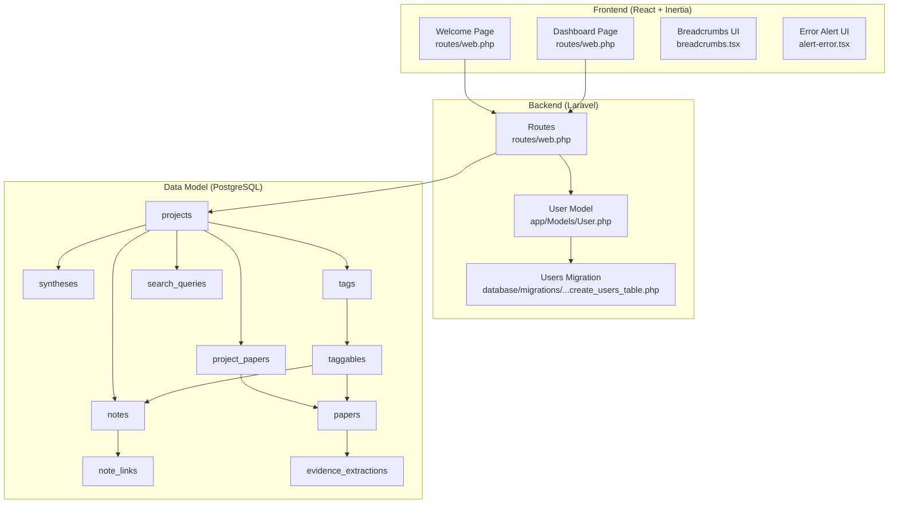
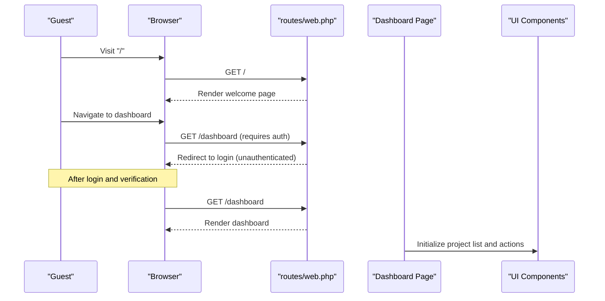
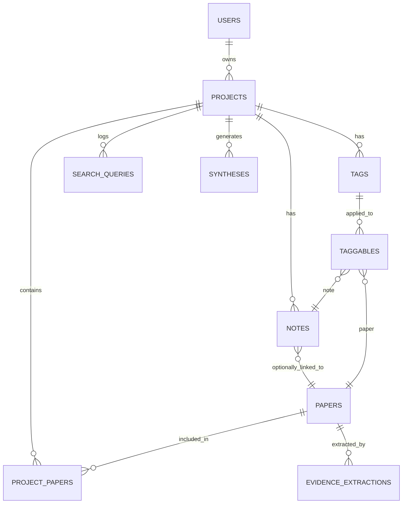
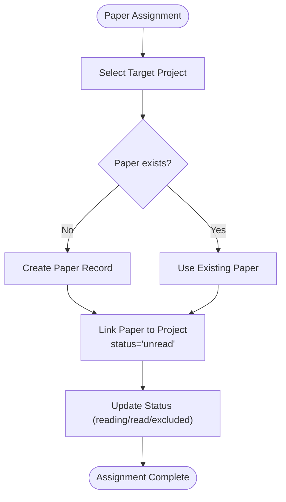
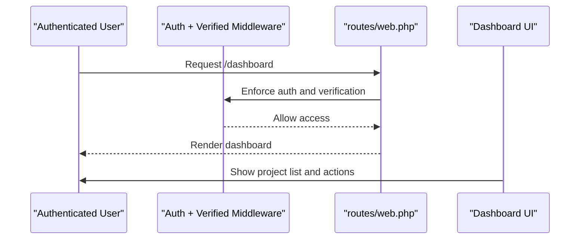
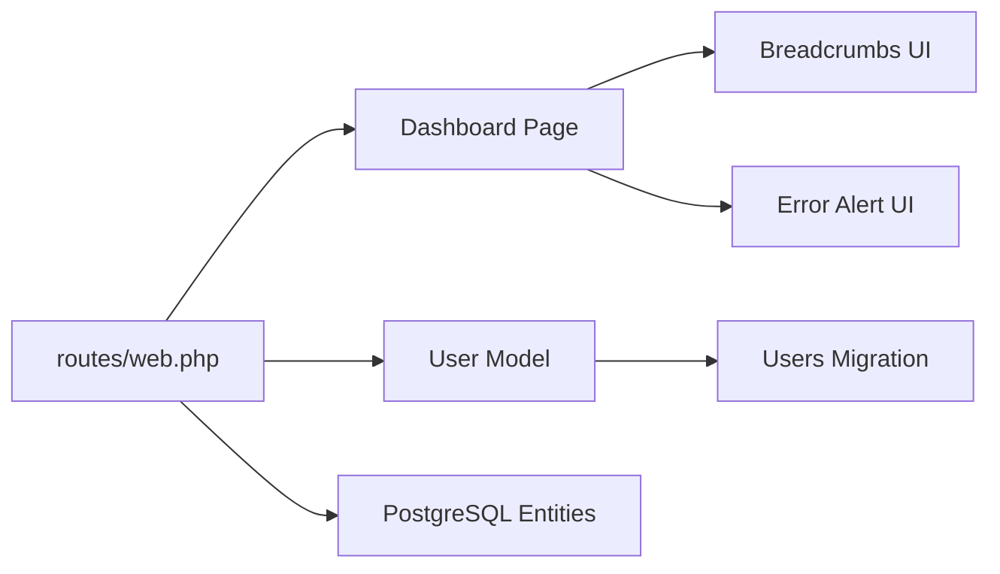
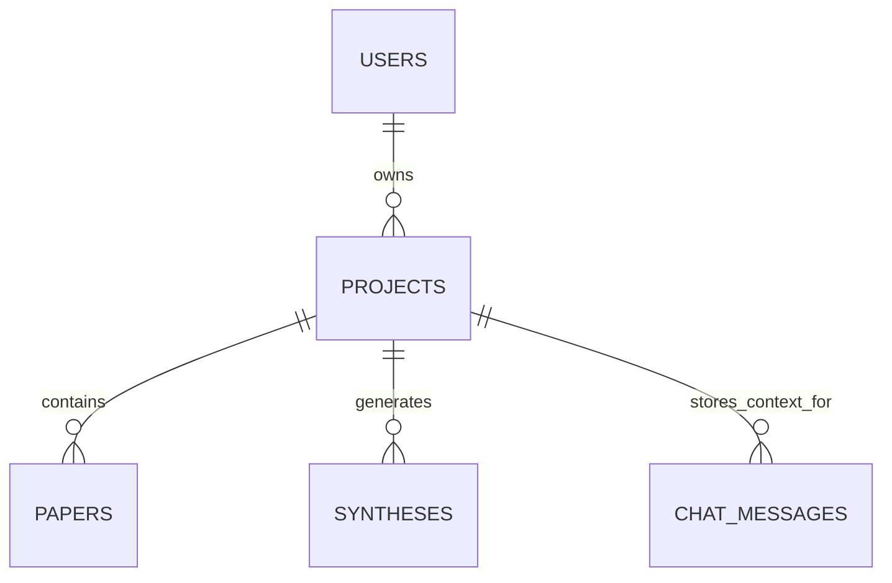

# Project-Based Organization

<cite>
**Referenced Files in This Document**
- [FULL_SPEC.md](file://hackathon/FULL_SPEC.md)
- [HACKATHON_SPEC.md](file://hackathon/HACKATHON_SPEC.md)
- [web.php](file://routes/web.php)
- [User.php](file://app/Models/User.php)
- [0001_01_01_000000_create_users_table.php](file://database/migrations/0001_01_01_000000_create_users_table.php)
- [dashboard.tsx](file://resources/js/pages/dashboard.tsx)
- [welcome.tsx](file://resources/js/pages/welcome.tsx)
- [alert-error.tsx](file://resources/js/components/alert-error.tsx)
- [breadcrumbs.tsx](file://resources/js/components/breadcrumbs.tsx)
- [SKILL.md](file://.agents/skills/wayfinder-development/SKILL.md)
</cite>

## Table of Contents
1. [Introduction](#introduction)
2. [Project Structure](#project-structure)
3. [Core Components](#core-components)
4. [Architecture Overview](#architecture-overview)
5. [Detailed Component Analysis](#detailed-component-analysis)
6. [Dependency Analysis](#dependency-analysis)
7. [Performance Considerations](#performance-considerations)
8. [Troubleshooting Guide](#troubleshooting-guide)
9. [Conclusion](#conclusion)
10. [Appendices](#appendices)

## Introduction
This document describes a project-based paper organization system designed around persistent, queryable memory across sessions. Projects serve as isolated containers for papers, notes, and derived artifacts. The system supports:
- Project creation and management with user ownership
- Paper association and movement within projects
- Status tracking and organization within project contexts
- Metadata-first design with PostgreSQL-backed persistence
- Access control via user ownership and middleware
- Optional collaborative extensions (sharing, permissions) for future development

The specification defines core entities and relationships that enable robust literature search, AI-driven synthesis, systematic review support, and citation management.

## Project Structure
The repository follows a Laravel + Inertia stack with React frontend. The backend defines routes guarded by authentication and verification middleware, while the frontend provides dashboards and settings pages. The data model is defined in the hackathon specification documents.



**Diagram sources**
- [web.php:1-12](file://routes/web.php#L1-L12)
- [User.php:1-51](file://app/Models/User.php#L1-L51)
- [0001_01_01_000000_create_users_table.php:1-50](file://database/migrations/0001_01_01_000000_create_users_table.php#L1-L50)
- [FULL_SPEC.md:35-131](file://hackathon/FULL_SPEC.md#L35-L131)

**Section sources**
- [web.php:1-12](file://routes/web.php#L1-L12)
- [User.php:1-51](file://app/Models/User.php#L1-L51)
- [0001_01_01_000000_create_users_table.php:1-50](file://database/migrations/0001_01_01_000000_create_users_table.php#L1-L50)
- [FULL_SPEC.md:35-131](file://hackathon/FULL_SPEC.md#L35-L131)

## Core Components
- Projects: Top-level containers owned by users, storing name and optional description.
- Papers: Bibliographic records with identifiers, metadata, and optional full text.
- Project-Paper Association: Junction table linking projects and papers with status and timestamps.
- Notes: Project-scoped notes, optionally linked to specific papers.
- Syntheses: AI-generated answers scoped to a project and recorded paper sets.
- Evidence Extractions: Structured fields extracted per paper within a project.
- Tags and Taggables: Project-scoped taxonomy applied to papers and notes.
- Search Queries: Logged queries scoped to projects.

Access control is enforced by:
- User ownership: Projects reference a user ID.
- Middleware: Routes are protected by authentication and email verification.
- UI breadcrumbs: Navigation indicates current context for clarity.

**Section sources**
- [FULL_SPEC.md:35-131](file://hackathon/FULL_SPEC.md#L35-L131)
- [web.php:7-9](file://routes/web.php#L7-L9)
- [breadcrumbs.tsx:1-50](file://resources/js/components/breadcrumbs.tsx#L1-L50)

## Architecture Overview
The system architecture couples a React frontend (Inertia) with a Laravel backend and PostgreSQL persistence. Authentication and verification middleware protect routes. The data model enforces project isolation and enables cross-session memory via stored chat/synthesis context.

```mermaid
graph TB
Client["Browser"]
Inertia["Inertia Bridge"]
Controller["Laravel Controllers"]
DB["PostgreSQL"]
Client <- --> Inertia
Inertia --> Controller
Controller --> DB
subgraph "Entities"
projects["projects"]
papers["papers"]
project_papers["project_papers"]
notes["notes"]
syntheses["syntheses"]
evidence_extractions["evidence_extractions"]
tags["tags"]
taggables["taggables"]
search_queries["search_queries"]
end
Controller --> projects
Controller --> papers
Controller --> project_papers
Controller --> notes
Controller --> syntheses
Controller --> evidence_extractions
Controller --> tags
Controller --> taggables
Controller --> search_queries
```

**Diagram sources**
- [FULL_SPEC.md:35-131](file://hackathon/FULL_SPEC.md#L35-L131)
- [web.php:1-12](file://routes/web.php#L1-L12)

## Detailed Component Analysis

### Project Creation and Management Workflow
Projects are owned by users and created via application flows. The frontend dashboard is accessible only to authenticated and verified users. Project metadata includes name and description.



**Diagram sources**
- [web.php:5-9](file://routes/web.php#L5-L9)
- [welcome.tsx:1-30](file://resources/js/pages/welcome.tsx#L1-L30)
- [dashboard.tsx:29-36](file://resources/js/pages/dashboard.tsx#L29-L36)

**Section sources**
- [web.php:5-9](file://routes/web.php#L5-L9)
- [dashboard.tsx:29-36](file://resources/js/pages/dashboard.tsx#L29-L36)
- [welcome.tsx:1-30](file://resources/js/pages/welcome.tsx#L1-L30)

### Project-Paper Relationship Model
Papers are associated with projects through a junction table that tracks status and addition timestamps. This enables per-project organization and status tracking.



**Diagram sources**
- [FULL_SPEC.md:35-131](file://hackathon/FULL_SPEC.md#L35-L131)

**Section sources**
- [FULL_SPEC.md:35-131](file://hackathon/FULL_SPEC.md#L35-L131)

### Paper Assignment and Movement Within Projects
Papers can be added to projects and their status tracked. Movement between projects is achieved by removing a paper from one project’s collection and adding it to another. The junction table stores per-project status and timestamps.



**Diagram sources**
- [FULL_SPEC.md:61-67](file://hackathon/FULL_SPEC.md#L61-L67)

**Section sources**
- [FULL_SPEC.md:61-67](file://hackathon/FULL_SPEC.md#L61-L67)

### Access Controls and Project Isolation
- Ownership: Projects reference a user ID, ensuring isolation between users.
- Middleware: Dashboard and other protected routes require authentication and verified email.
- UI breadcrumbs: Help users understand current project context.



**Diagram sources**
- [web.php:7-9](file://routes/web.php#L7-L9)
- [breadcrumbs.tsx:1-50](file://resources/js/components/breadcrumbs.tsx#L1-L50)

**Section sources**
- [web.php:7-9](file://routes/web.php#L7-L9)
- [breadcrumbs.tsx:1-50](file://resources/js/components/breadcrumbs.tsx#L1-L50)

### Project CRUD Operations
- Create: Owned by the current user; name required; optional description.
- Read: List projects; view project details and contained papers/notes.
- Update: Modify name/description; maintain ownership.
- Delete: Remove project and cascading dependent records (as defined by foreign keys).

Implementation guidance:
- Backend: Define project resource routes and controller actions.
- Frontend: Provide forms for create/update; render project lists with actions.
- Validation: Enforce uniqueness of project name per user if desired.

**Section sources**
- [FULL_SPEC.md:35-42](file://hackathon/FULL_SPEC.md#L35-L42)
- [web.php:7-9](file://routes/web.php#L7-L9)

### Paper Assignment Workflows
- Discovery: Search papers and save to a project.
- Association: Insert into project_papers with initial status.
- Organization: Update status and apply tags/notes.
- Movement: Remove from one project and add to another.

**Section sources**
- [FULL_SPEC.md:135-140](file://hackathon/FULL_SPEC.md#L135-L140)
- [FULL_SPEC.md:61-67](file://hackathon/FULL_SPEC.md#L61-L67)

### Project Sharing Mechanisms
The current specification focuses on user-owned projects. To add sharing:
- Add a project_shares table referencing projects and users.
- Introduce permission levels (view/edit/admin).
- Extend middleware to enforce share permissions.
- Update UI to display shared projects and manage collaborators.

[No sources needed since this section proposes future extension]

### Project Metadata Management
- Name: Required, unique per user (recommended).
- Description: Optional free-form text.
- Timestamps: Created/updated automatically.

Naming conventions:
- Use kebab-case for route names and slugs.
- Keep names concise but descriptive.

Best practices:
- Index frequently filtered fields (e.g., name).
- Normalize metadata to reduce duplication.

**Section sources**
- [FULL_SPEC.md:35-42](file://hackathon/FULL_SPEC.md#L35-L42)

### Implementation Guidance for Extending Functionality
- Collaborative features: Add shares and permissions; update access checks.
- Advanced tagging: Support hierarchical tags and tag inheritance.
- Export capabilities: Add project/tag-scoped exports for citations and synthesis records.
- Audit trails: Track who added/removed papers and when.

**Section sources**
- [FULL_SPEC.md:158-160](file://hackathon/FULL_SPEC.md#L158-L160)

## Dependency Analysis
The frontend depends on Inertia for seamless navigation, while the backend depends on Laravel’s routing and middleware stack. The data model defines explicit relationships among entities.



**Diagram sources**
- [web.php:1-12](file://routes/web.php#L1-L12)
- [dashboard.tsx:29-36](file://resources/js/pages/dashboard.tsx#L29-L36)
- [breadcrumbs.tsx:1-50](file://resources/js/components/breadcrumbs.tsx#L1-L50)
- [alert-error.tsx:1-24](file://resources/js/components/alert-error.tsx#L1-L24)
- [User.php:1-51](file://app/Models/User.php#L1-L51)
- [0001_01_01_000000_create_users_table.php:1-50](file://database/migrations/0001_01_01_000000_create_users_table.php#L1-L50)

**Section sources**
- [web.php:1-12](file://routes/web.php#L1-L12)
- [dashboard.tsx:29-36](file://resources/js/pages/dashboard.tsx#L29-L36)
- [breadcrumbs.tsx:1-50](file://resources/js/components/breadcrumbs.tsx#L1-L50)
- [alert-error.tsx:1-24](file://resources/js/components/alert-error.tsx#L1-L24)
- [User.php:1-51](file://app/Models/User.php#L1-L51)
- [0001_01_01_000000_create_users_table.php:1-50](file://database/migrations/0001_01_01_000000_create_users_table.php#L1-L50)

## Performance Considerations
- Full-text search: GIN indexes on title and body improve search performance.
- JSONB fields: Store flexible metadata efficiently; avoid overuse of JSONB for high-cardinality filtering.
- Foreign keys: Enforce referential integrity; consider cascade policies for cleanup.
- Pagination: Implement pagination for large project lists and paper sets.
- Caching: Cache frequent queries (e.g., recent projects) to reduce database load.

[No sources needed since this section provides general guidance]

## Troubleshooting Guide
Common issues and resolutions:
- Unauthorized access: Ensure authentication and email verification middleware are applied to protected routes.
- Duplicate projects: Enforce unique project names per user if needed.
- UI breadcrumbs: Confirm breadcrumb generation aligns with current project context.
- Error rendering: Use the error alert component to surface validation or server errors.

**Section sources**
- [web.php:7-9](file://routes/web.php#L7-L9)
- [breadcrumbs.tsx:1-50](file://resources/js/components/breadcrumbs.tsx#L1-L50)
- [alert-error.tsx:1-24](file://resources/js/components/alert-error.tsx#L1-L24)

## Conclusion
The project-based paper organization system centers on strong isolation via user ownership, explicit project-paper associations, and a metadata-rich data model. The architecture supports persistent, queryable memory across sessions and provides a foundation for collaboration, advanced tagging, and export capabilities. By following the outlined workflows and best practices, teams can build scalable, maintainable systems for research knowledge management.

[No sources needed since this section summarizes without analyzing specific files]

## Appendices

### Appendix A: Minimal Data Model (Hackathon Scope)
The minimal model captures essential entities for persistent memory and synthesis.



**Diagram sources**
- [HACKATHON_SPEC.md:40-75](file://hackathon/HACKATHON_SPEC.md#L40-L75)

**Section sources**
- [HACKATHON_SPEC.md:40-75](file://hackathon/HACKATHON_SPEC.md#L40-L75)

### Appendix B: Route and UI Integration Notes
- Use route helpers and form components to ensure type-safe navigation and submissions.
- Leverage Wayfinder for generating route objects and forms.

**Section sources**
- [.agents/skills/wayfinder-development/SKILL.md:35-80](file://.agents/skills/wayfinder-development/SKILL.md#L35-L80)