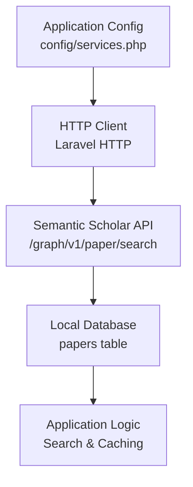
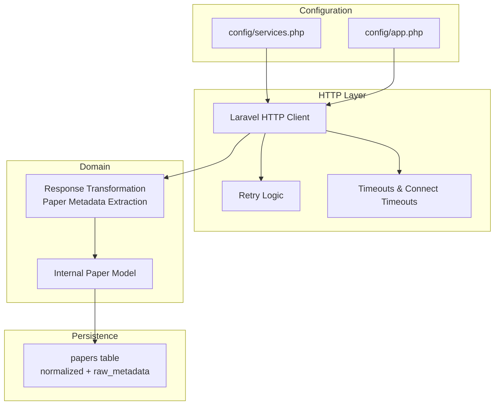
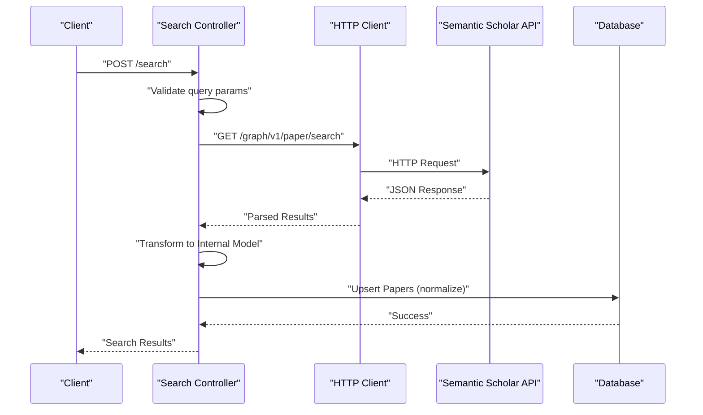
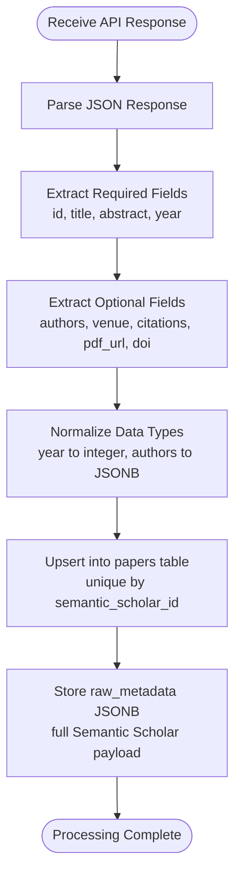
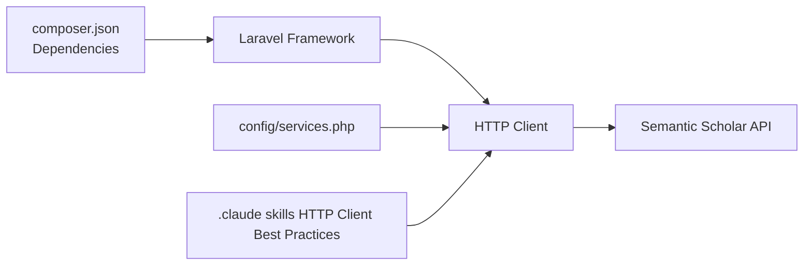

# Semantic Scholar API Integration

<cite>
**Referenced Files in This Document**
- [FULL_SPEC.md](file://hackathon/FULL_SPEC.md)
- [HACKATHON_SPEC.md](file://hackathon/HACKATHON_SPEC.md)
- [services.php](file://config/services.php)
- [app.php](file://config/app.php)
- [http-client.md](file://.claude/skills/laravel-best-practices/rules/http-client.md)
- [http-client.md](file://.agents/skills/laravel-best-practices/rules/http-client.md)
- [composer.json](file://composer.json)
</cite>

## Table of Contents
1. [Introduction](#introduction)
2. [Project Structure](#project-structure)
3. [Core Components](#core-components)
4. [Architecture Overview](#architecture-overview)
5. [Detailed Component Analysis](#detailed-component-analysis)
6. [Dependency Analysis](#dependency-analysis)
7. [Performance Considerations](#performance-considerations)
8. [Troubleshooting Guide](#troubleshooting-guide)
9. [Conclusion](#conclusion)

## Introduction
This document details the Semantic Scholar API integration for ScholarGraph, focusing on API connection setup, search query implementation, and response processing. According to the project specifications, ScholarGraph integrates with Semantic Scholar's `/graph/v1/paper/search` endpoint to discover academic papers, cache results in the local database, and support subsequent AI synthesis and chat capabilities. The integration leverages Laravel's HTTP client with best practices for timeouts, retries, and error handling, while adhering to Semantic Scholar's free tier rate limits.

## Project Structure
The integration spans configuration, HTTP client usage, and data modeling as defined in the project specifications:
- API endpoint: `/graph/v1/paper/search` for paper search
- Data model: `papers` table stores normalized metadata and raw Semantic Scholar payload
- Configuration: HTTP client best practices for timeouts and retries
- Rate limiting: free tier constraint of 100 requests per 5 minutes

**Diagram sources**
- [services.php:1-39](file://config/services.php#L1-L39)
- [FULL_SPEC.md:135-139](file://hackathon/FULL_SPEC.md#L135-L139)
- [FULL_SPEC.md:44-58](file://hackathon/FULL_SPEC.md#L44-L58)

**Section sources**
- [FULL_SPEC.md:135-139](file://hackathon/FULL_SPEC.md#L135-L139)
- [FULL_SPEC.md:44-58](file://hackathon/FULL_SPEC.md#L44-L58)
- [services.php:1-39](file://config/services.php#L1-L39)

## Core Components
- HTTP Client Configuration: Uses Laravel's HTTP client with explicit timeouts and retry logic for robust external API integration.
- Search Endpoint: Queries Semantic Scholar's `/graph/v1/paper/search` endpoint with appropriate parameters.
- Response Processing: Extracts and normalizes paper metadata into the internal `papers` table, preserving the raw Semantic Scholar payload for reprocessing.
- Rate Limiting: Implements free tier constraints (100 requests per 5 minutes) via careful request pacing and caching strategies.

Key implementation patterns:
- Explicit timeouts and connect timeouts to prevent slow or hanging requests
- Retry with exponential backoff for transient failures
- Graceful error handling for non-successful responses
- Request pooling for concurrent operations where applicable

**Section sources**
- [http-client.md:1-161](file://.claude/skills/laravel-best-practices/rules/http-client.md#L1-L161)
- [http-client.md:1-161](file://.agents/skills/laravel-best-practices/rules/http-client.md#L1-L161)

## Architecture Overview
The Semantic Scholar integration follows a clean architecture pattern:
- Configuration layer defines base URLs and credentials
- HTTP client layer handles transport, timeouts, retries, and error handling
- Domain layer transforms external API responses into internal models
- Persistence layer stores normalized metadata and raw payloads

**Diagram sources**
- [services.php:1-39](file://config/services.php#L1-L39)
- [app.php:1-127](file://config/app.php#L1-L127)
- [http-client.md:1-161](file://.claude/skills/laravel-best-practices/rules/http-client.md#L1-L161)
- [FULL_SPEC.md:44-58](file://hackathon/FULL_SPEC.md#L44-L58)

## Detailed Component Analysis

### API Connection Setup
- Base URL: Semantic Scholar Graph API base URL
- Authentication: No API key required for free tier
- Rate Limits: 100 requests per 5 minutes
- Timeouts: Explicit connect and request timeouts configured per best practices
- Retries: Retry logic with backoff for transient failures

Implementation considerations:
- Configure base URL in HTTP client macro or centralized service
- Enforce rate limiting through request pacing and caching
- Apply timeouts and retries consistently across all API calls

**Section sources**
- [FULL_SPEC.md:20](file://hackathon/FULL_SPEC.md#L20)
- [FULL_SPEC.md:203-204](file://hackathon/FULL_SPEC.md#L203-L204)
- [http-client.md:32-60](file://.claude/skills/laravel-best-practices/rules/http-client.md#L32-L60)
- [http-client.md:19-30](file://.claude/skills/laravel-best-practices/rules/http-client.md#L19-L30)

### Search Query Implementation
- Endpoint: `/graph/v1/paper/search`
- Parameters: Query string, limit, sort order, and filters as needed
- Request Pattern: Use HTTP client with timeouts and retries
- Response Handling: Parse JSON response and extract relevant fields

**Diagram sources**
- [FULL_SPEC.md:135-139](file://hackathon/FULL_SPEC.md#L135-L139)
- [http-client.md:61-94](file://.claude/skills/laravel-best-practices/rules/http-client.md#L61-L94)

### Response Processing Mechanisms
Metadata extraction from Semantic Scholar responses:
- Required Fields: semantic_scholar_id, title, abstract, year
- Optional Fields: authors, venue, citation_count, pdf_url, doi
- Storage Strategy: Normalize into internal model; preserve raw payload in raw_metadata JSONB

**Diagram sources**
- [FULL_SPEC.md:44-58](file://hackathon/FULL_SPEC.md#L44-L58)
- [FULL_SPEC.md:123-130](file://hackathon/FULL_SPEC.md#L123-L130)

**Section sources**
- [FULL_SPEC.md:44-58](file://hackathon/FULL_SPEC.md#L44-L58)
- [FULL_SPEC.md:123-130](file://hackathon/FULL_SPEC.md#L123-L130)

### Identifier Mapping
- Primary Identifier: semantic_scholar_id (unique constraint)
- Alternative Identifiers: doi (stored but not unique)
- Mapping Strategy: Use semantic_scholar_id as primary key; maintain doi for cross-reference

**Section sources**
- [FULL_SPEC.md:46](file://hackathon/FULL_SPEC.md#L46)
- [FULL_SPEC.md:47](file://hackathon/FULL_SPEC.md#L47)

### Integration Patterns for Discovery and Search
- Paper Discovery: Search endpoint returns ranked results; cache in papers table
- Save-to-Project: Associate discovered papers with user projects
- Citation Graph: Use Semantic Scholar graph endpoints for cited-by and references exploration

**Section sources**
- [FULL_SPEC.md:135-139](file://hackathon/FULL_SPEC.md#L135-L139)

### Examples of API Requests and Response Handling
Example request pattern:
- Endpoint: `/graph/v1/paper/search`
- Headers: None required for free tier
- Query Parameters: q (query string), limit (result count), year range, etc.
- Response: JSON array of paper objects with metadata fields

Example response handling:
- Validate response structure
- Extract metadata fields
- Transform and normalize data
- Persist to database with upsert semantics

**Section sources**
- [FULL_SPEC.md:135-139](file://hackathon/FULL_SPEC.md#L135-L139)
- [http-client.md:61-94](file://.claude/skills/laravel-best-practices/rules/http-client.md#L61-L94)

### Error Management
Recommended error handling patterns:
- Explicit status checking with throw() for non-successful responses
- Graceful degradation for missing or malformed fields
- Retry logic for transient network errors and server errors
- Comprehensive logging for debugging and monitoring

**Section sources**
- [http-client.md:61-94](file://.claude/skills/laravel-best-practices/rules/http-client.md#L61-L94)
- [http-client.md:32-60](file://.claude/skills/laravel-best-practices/rules/http-client.md#L32-L60)

## Dependency Analysis
The integration relies on Laravel's HTTP client ecosystem and follows best practices for external API consumption.

**Diagram sources**
- [composer.json:11-19](file://composer.json#L11-L19)
- [services.php:1-39](file://config/services.php#L1-L39)
- [http-client.md:1-30](file://.claude/skills/laravel-best-practices/rules/http-client.md#L1-L30)

**Section sources**
- [composer.json:11-19](file://composer.json#L11-L19)
- [services.php:1-39](file://config/services.php#L1-L39)

## Performance Considerations
- Rate Limiting: Implement strict request pacing to stay within 100 requests per 5 minutes
- Caching: Cache frequent search queries and paper details to reduce API calls
- Concurrency: Use request pooling for batch operations where appropriate
- Timeouts: Set aggressive timeouts to prevent slow API calls from blocking the application
- Retry Strategy: Apply exponential backoff for transient failures

## Troubleshooting Guide
Common issues and resolutions:
- Timeout Errors: Increase connectTimeout and timeout values appropriately
- Rate Limit Exceeded: Implement request throttling and caching strategies
- Network Failures: Use retry logic with backoff for transient errors
- Malformed Responses: Validate response structure and handle missing fields gracefully
- Authentication Issues: Verify API key requirements (currently none for free tier)

**Section sources**
- [http-client.md:32-60](file://.claude/skills/laravel-best-practices/rules/http-client.md#L32-L60)
- [http-client.md:61-94](file://.claude/skills/laravel-best-practices/rules/http-client.md#L61-L94)
- [FULL_SPEC.md:203-204](file://hackathon/FULL_SPEC.md#L203-L204)

## Conclusion
The Semantic Scholar API integration in ScholarGraph follows established Laravel patterns for external API consumption, emphasizing reliability through explicit timeouts, retries, and comprehensive error handling. The integration aligns with the project's data model by normalizing external metadata into the internal `papers` table while preserving raw payloads for future reprocessing. By adhering to Semantic Scholar's free tier constraints and implementing caching and request pacing, the system maintains performance and reliability for academic paper discovery and subsequent AI-powered synthesis workflows.