# Core Features & Capabilities

<cite>
**Referenced Files in This Document**
- [User.php](file://app/Models/User.php)
- [auth.php](file://config/auth.php)
- [fortify.php](file://config/fortify.php)
- [ProfileController.php](file://app/Http/Controllers/Settings/ProfileController.php)
- [SecurityController.php](file://app/Http/Controllers/Settings/SecurityController.php)
- [profile.tsx](file://resources/js/pages/settings/profile.tsx)
- [security.tsx](file://resources/js/pages/settings/security.tsx)
- [welcome.tsx](file://resources/js/pages/welcome.tsx)
- [dashboard.tsx](file://resources/js/pages/dashboard.tsx)
- [HACKATHON_SPEC.md](file://hackathon/HACKATHON_SPEC.md)
- [FULL_SPEC.md](file://hackathon/FULL_SPEC.md)
</cite>

## Table of Contents
1. [Introduction](#introduction)
2. [Project Structure](#project-structure)
3. [Core Components](#core-components)
4. [Architecture Overview](#architecture-overview)
5. [Detailed Component Analysis](#detailed-component-analysis)
6. [Dependency Analysis](#dependency-analysis)
7. [Performance Considerations](#performance-considerations)
8. [Troubleshooting Guide](#troubleshooting-guide)
9. [Conclusion](#conclusion)
10. [Appendices](#appendices)

## Introduction
This document explains ScholarGraph’s core features and capabilities as implemented in the repository. It focuses on:
- Persistent memory across research sessions using a project-centric chat and synthesis log
- AI-powered paper synthesis with transparent evidence attribution
- Cross-paper analysis and synthesis
- Project-based paper organization
- Chat interface with persistent context retention
- Advanced authentication including passkeys and two-factor authentication
- Settings management for profile and security configuration

These features are grounded in the hackathon scope and the full specification, ensuring clarity on what is implemented versus future phases.

## Project Structure
The application follows a layered Laravel architecture with Inertia.js for the frontend. Authentication is powered by Laravel Fortify with passkeys and two-factor authentication enabled. The frontend is organized into pages and components for settings, authentication, and dashboards.

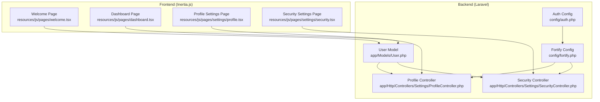

**Diagram sources**
- [User.php:1-51](file://app/Models/User.php#L1-L51)
- [auth.php:1-118](file://config/auth.php#L1-L118)
- [fortify.php:1-178](file://config/fortify.php#L1-L178)
- [ProfileController.php:1-63](file://app/Http/Controllers/Settings/ProfileController.php#L1-L63)
- [SecurityController.php:1-67](file://app/Http/Controllers/Settings/SecurityController.php#L1-L67)
- [welcome.tsx:1-390](file://resources/js/pages/welcome.tsx#L1-L390)
- [dashboard.tsx:1-37](file://resources/js/pages/dashboard.tsx#L1-L37)
- [profile.tsx:1-139](file://resources/js/pages/settings/profile.tsx#L1-L139)
- [security.tsx:1-148](file://resources/js/pages/settings/security.tsx#L1-L148)

**Section sources**
- [User.php:1-51](file://app/Models/User.php#L1-L51)
- [auth.php:1-118](file://config/auth.php#L1-L118)
- [fortify.php:1-178](file://config/fortify.php#L1-L178)
- [ProfileController.php:1-63](file://app/Http/Controllers/Settings/ProfileController.php#L1-L63)
- [SecurityController.php:1-67](file://app/Http/Controllers/Settings/SecurityController.php#L1-L67)
- [welcome.tsx:1-390](file://resources/js/pages/welcome.tsx#L1-L390)
- [dashboard.tsx:1-37](file://resources/js/pages/dashboard.tsx#L1-L37)
- [profile.tsx:1-139](file://resources/js/pages/settings/profile.tsx#L1-L139)
- [security.tsx:1-148](file://resources/js/pages/settings/security.tsx#L1-L148)

## Core Components
- Persistent memory system: Projects, papers, chat messages, and syntheses form a durable, queryable memory for each user session.
- AI synthesis engine: Qwen-powered synthesis with explicit attribution to source papers.
- Cross-paper synthesis: Aggregated across selected papers within a project.
- Project-based organization: Papers belong to projects; syntheses record which papers were used.
- Chat with persistent context: Each turn pulls the project's chat history and paper abstracts.
- Customizable system prompts: Global and per-project prompts with negative prompts and suggested templates for fine-tuning AI responses.
- Advanced authentication: Passkeys and two-factor authentication integrated via Laravel Fortify.
- Settings management: Profile updates, password changes, passkeys, and two-factor controls.

**Section sources**
- [HACKATHON_SPEC.md:39-75](file://hackathon/HACKATHON_SPEC.md#L39-L75)
- [FULL_SPEC.md:88-97](file://hackathon/FULL_SPEC.md#L88-L97)
- [User.php:32-35](file://app/Models/User.php#L32-L35)
- [fortify.php:163-175](file://config/fortify.php#L163-L175)

## Architecture Overview
The system integrates backend authentication and data persistence with a frontend that renders settings and dashboards. Authentication is handled centrally by Fortify and the application’s User model. The frontend pages consume backend controllers and render settings and dashboards.

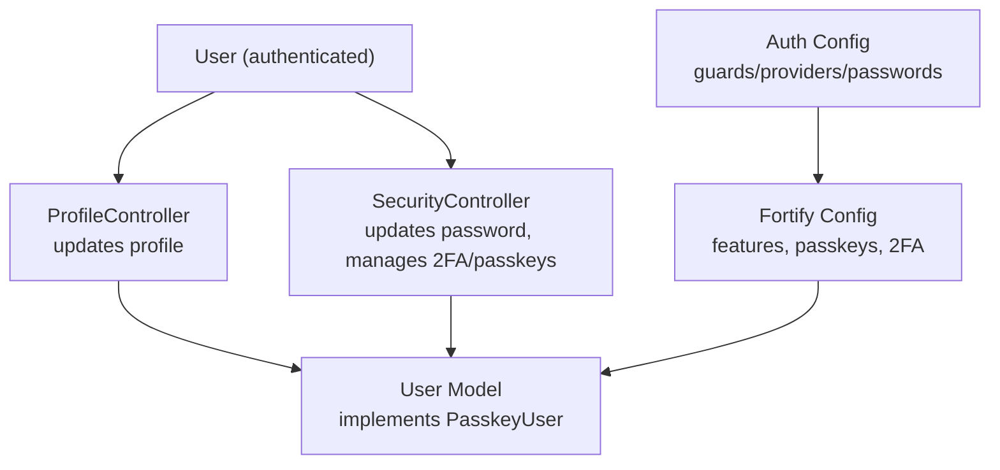

**Diagram sources**
- [ProfileController.php:15-63](file://app/Http/Controllers/Settings/ProfileController.php#L15-L63)
- [SecurityController.php:14-67](file://app/Http/Controllers/Settings/SecurityController.php#L14-L67)
- [User.php:32-35](file://app/Models/User.php#L32-L35)
- [auth.php:40-76](file://config/auth.php#L40-L76)
- [fortify.php:18-31](file://config/fortify.php#L18-L31)

**Section sources**
- [ProfileController.php:15-63](file://app/Http/Controllers/Settings/ProfileController.php#L15-L63)
- [SecurityController.php:14-67](file://app/Http/Controllers/Settings/SecurityController.php#L14-L67)
- [User.php:32-35](file://app/Models/User.php#L32-L35)
- [auth.php:40-76](file://config/auth.php#L40-L76)
- [fortify.php:18-31](file://config/fortify.php#L18-L31)

## Detailed Component Analysis

### Persistent Memory System (Projects, Papers, Chat, Syntheses)
- Data model: Projects, Papers, Syntheses, and Chat Messages enable persistent, queryable memory across sessions.
- Retrieval strategy: For each synthesis/chat turn, the system pulls the project’s papers (title + abstract) and recent chat history from the database to construct the context window.
- Evidence attribution: Syntheses record the exact set of paper IDs used to produce an answer, enabling transparent attribution.

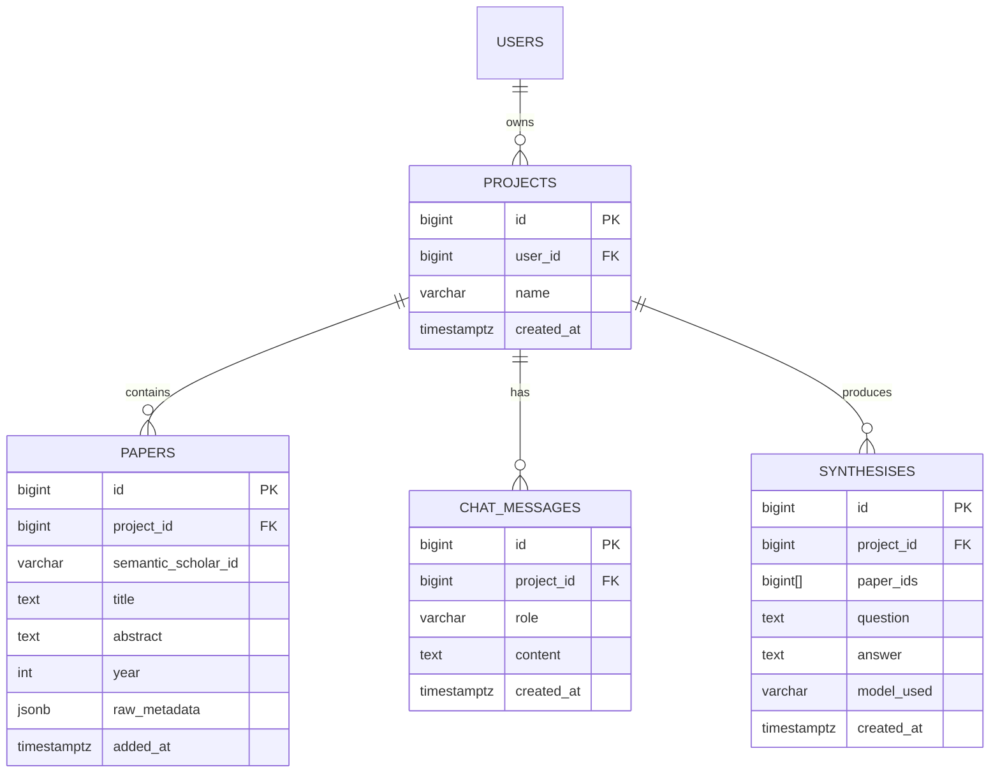

**Diagram sources**
- [HACKATHON_SPEC.md:39-75](file://hackathon/HACKATHON_SPEC.md#L39-L75)

**Section sources**
- [HACKATHON_SPEC.md:77-81](file://hackathon/HACKATHON_SPEC.md#L77-L81)
- [HACKATHON_SPEC.md:83-91](file://hackathon/HACKATHON_SPEC.md#L83-L91)
- [HACKATHON_SPEC.md:92-104](file://hackathon/HACKATHON_SPEC.md#L92-L104)

### AI-Powered Paper Synthesis Engine with Transparent Attribution
- Task pattern: One model (Qwen) is used consistently for synthesis tasks.
- Inputs: Project papers (title + abstract) + chat history + new question.
- Outputs: Answer stored in chat messages; if specific papers were used, the synthesis records the paper IDs for transparency.
- Model selection: The full specification assigns different model tiers to tasks; the hackathon scope uses a single mid-size model for simplicity.

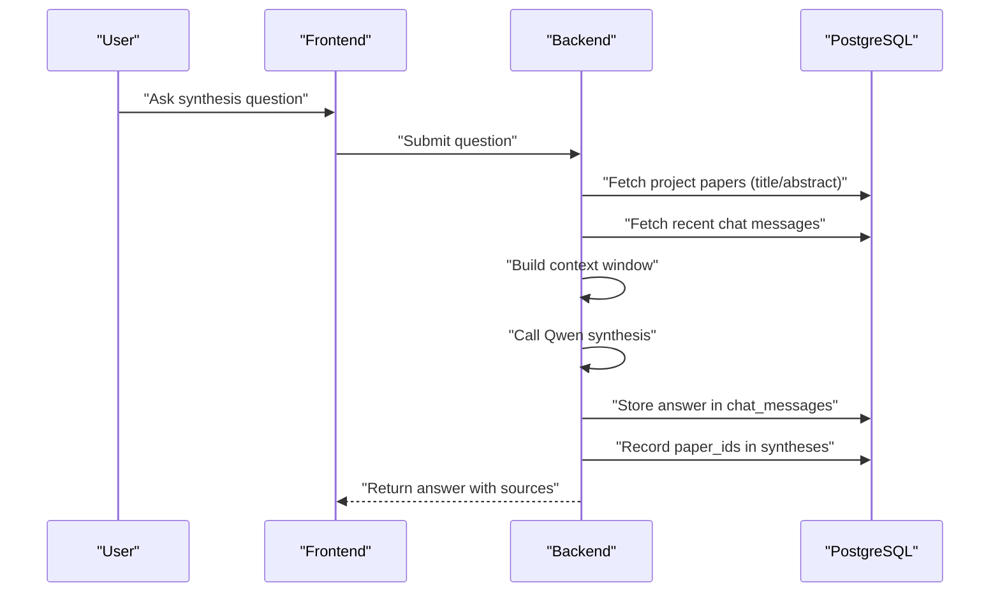

**Diagram sources**
- [HACKATHON_SPEC.md:96-99](file://hackathon/HACKATHON_SPEC.md#L96-L99)
- [HACKATHON_SPEC.md:68-74](file://hackathon/HACKATHON_SPEC.md#L68-L74)
- [HACKATHON_SPEC.md:58-66](file://hackathon/HACKATHON_SPEC.md#L58-L66)

**Section sources**
- [HACKATHON_SPEC.md:92-104](file://hackathon/HACKATHON_SPEC.md#L92-L104)
- [FULL_SPEC.md:141-148](file://hackathon/FULL_SPEC.md#L141-L148)

### Cross-Paper Analysis and Synthesis
- Scope: Cross-paper synthesis aggregates insights across multiple papers within a project.
- Output: Stored in syntheses with the exact paper set and model used, enabling reproducibility and auditability.

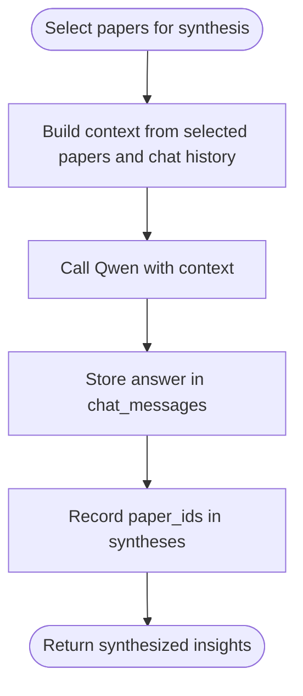

**Diagram sources**
- [FULL_SPEC.md:144-148](file://hackathon/FULL_SPEC.md#L144-L148)
- [HACKATHON_SPEC.md:58-66](file://hackathon/HACKATHON_SPEC.md#L58-L66)

**Section sources**
- [FULL_SPEC.md:144-148](file://hackathon/FULL_SPEC.md#L144-L148)
- [HACKATHON_SPEC.md:58-66](file://hackathon/HACKATHON_SPEC.md#L58-L66)

### Project-Based Paper Organization
- Projects group papers and maintain associated chat and synthesis history.
- Papers are linked to projects and can be added via search; the hackathon scope emphasizes adding papers to a project as the first step in the memory demonstration.

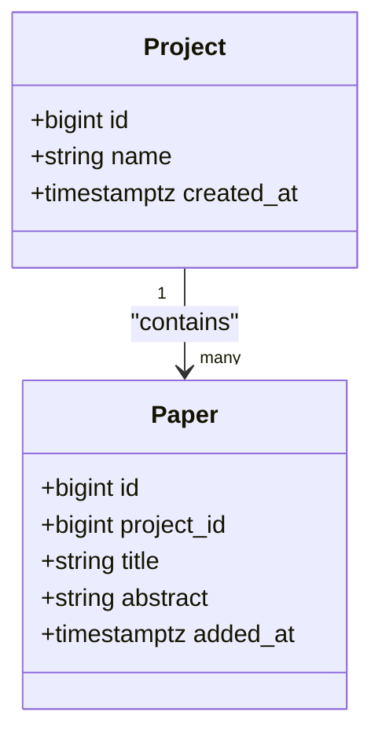

**Diagram sources**
- [HACKATHON_SPEC.md:40-56](file://hackathon/HACKATHON_SPEC.md#L40-L56)

**Section sources**
- [HACKATHON_SPEC.md:40-56](file://hackathon/HACKATHON_SPEC.md#L40-L56)

### Chat Interface with Persistent Context Retention
- The chat interface persists context across sessions by pulling the project’s chat history and paper abstracts on each turn.
- The dashboard and welcome pages provide entry points to the research workflow.

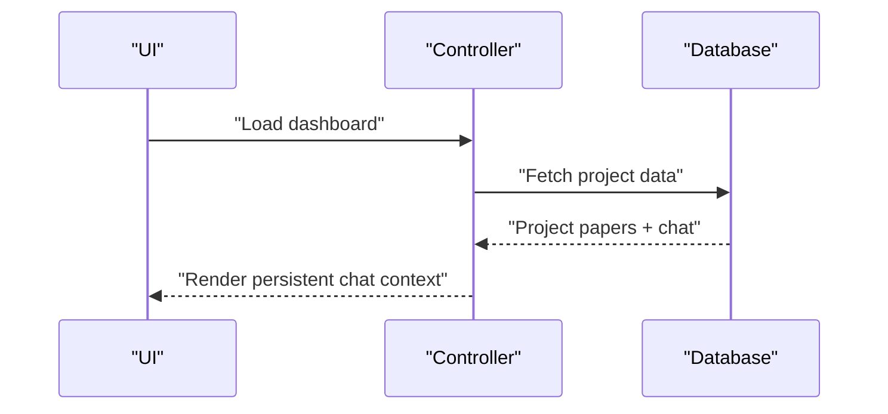

**Diagram sources**
- [dashboard.tsx:5-26](file://resources/js/pages/dashboard.tsx#L5-L26)
- [welcome.tsx:5-38](file://resources/js/pages/welcome.tsx#L5-L38)

**Section sources**
- [dashboard.tsx:5-26](file://resources/js/pages/dashboard.tsx#L5-L26)
- [welcome.tsx:5-38](file://resources/js/pages/welcome.tsx#L5-L38)

### Customizable System Prompts with Negative Prompts and Suggestions
- Global prompts: Users can set a global system prompt in Settings that applies across all projects when enabled.
- Per-project prompts: Each project can have its own system prompt, which is composed with the global prompt when both are enabled.
- Negative prompts: Both global and project-level negative prompts allow users to specify what the AI should NOT do (e.g., "Do not use bullet points", "Do not hedge").
- Suggested prompts: The prompt drawer includes clickable suggestion chips for common prompt patterns (Concise Scholar, Critical Analyst, No Hedging, etc.) that append to the current prompt.
- Prompt resolution: The system composes global + project prompts together, then appends negative prompts as a "Do NOT" section.

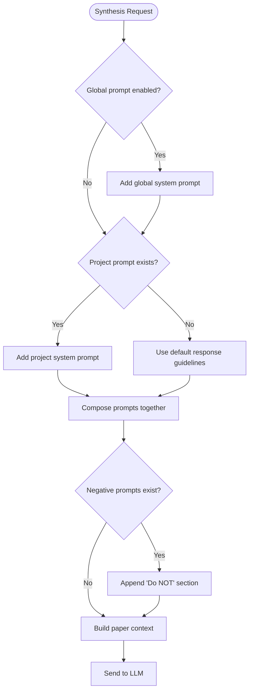

**Diagram sources**
- [SynthesisService.php:105-165](file://app/Services/SynthesisService.php#L105-L165)
- [prompt-drawer.tsx:1-265](file://resources/js/components/prompt-drawer.tsx#L1-L265)
- [prompt-suggestions.ts:1-72](file://resources/js/lib/prompt-suggestions.ts#L1-L72)

**Section sources**
- [SynthesisService.php:105-165](file://app/Services/SynthesisService.php#L105-L165)
- [PromptController.php:1-32](file://app/Http/Controllers/PromptController.php#L1-L32)
- [PromptSettingsController.php:1-43](file://app/Http/Controllers/Settings/PromptSettingsController.php#L1-L43)
- [prompt-drawer.tsx:1-265](file://resources/js/components/prompt-drawer.tsx#L1-L265)
- [prompt-suggestions.ts:1-72](file://resources/js/lib/prompt-suggestions.ts#L1-L72)

### Advanced Authentication System (Passkeys and 2FA)
- Passkeys: Enabled via Fortify with relying party configuration and allowed origins derived from the application URL.
- Two-Factor Authentication: Enabled with optional password confirmation and management features.
- User model: Implements passkey and two-factor traits for seamless integration.

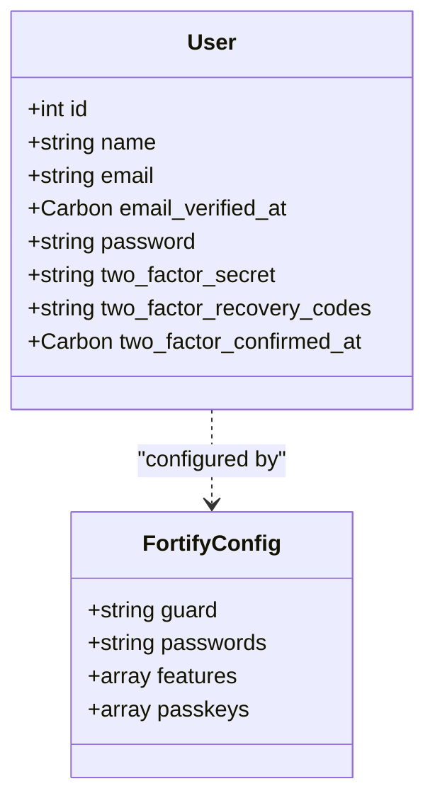

**Diagram sources**
- [User.php:32-35](file://app/Models/User.php#L32-L35)
- [fortify.php:145-150](file://config/fortify.php#L145-L150)
- [fortify.php:163-175](file://config/fortify.php#L163-L175)

**Section sources**
- [User.php:32-35](file://app/Models/User.php#L32-L35)
- [fortify.php:145-150](file://config/fortify.php#L145-L150)
- [fortify.php:163-175](file://config/fortify.php#L163-L175)

### Settings Management Interface (Profile and Security)
- Profile settings: Update name and email; resend verification if needed.
- Security settings: Change password, manage passkeys, and configure two-factor authentication.

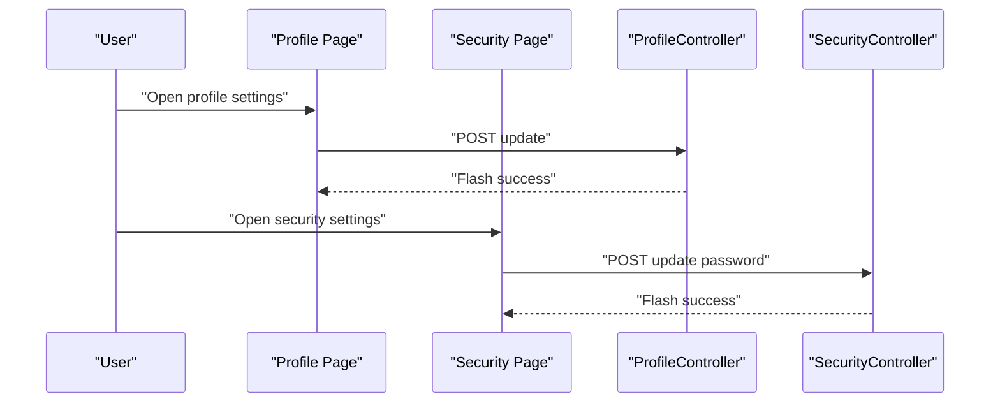

**Diagram sources**
- [profile.tsx:40-123](file://resources/js/pages/settings/profile.tsx#L40-L123)
- [security.tsx:37-123](file://resources/js/pages/settings/security.tsx#L37-L123)
- [ProfileController.php:31-44](file://app/Http/Controllers/Settings/ProfileController.php#L31-L44)
- [SecurityController.php:56-65](file://app/Http/Controllers/Settings/SecurityController.php#L56-L65)

**Section sources**
- [profile.tsx:40-123](file://resources/js/pages/settings/profile.tsx#L40-L123)
- [security.tsx:37-123](file://resources/js/pages/settings/security.tsx#L37-L123)
- [ProfileController.php:31-44](file://app/Http/Controllers/Settings/ProfileController.php#L31-L44)
- [SecurityController.php:56-65](file://app/Http/Controllers/Settings/SecurityController.php#L56-L65)

## Dependency Analysis
- Authentication dependencies: Fortify configuration drives guard, provider, and feature toggles. The User model integrates passkey and two-factor traits.
- Settings dependencies: Profile and Security controllers depend on Laravel Fortify features and Inertia rendering.
- Data dependencies: The persistent memory relies on PostgreSQL tables defined in the hackathon scope.

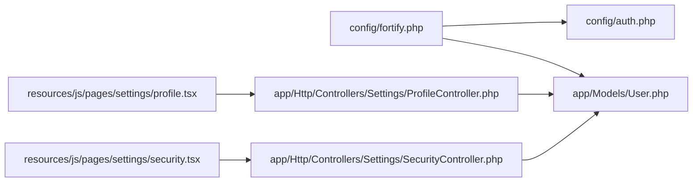

**Diagram sources**
- [fortify.php:18-31](file://config/fortify.php#L18-L31)
- [auth.php:40-76](file://config/auth.php#L40-L76)
- [User.php:32-35](file://app/Models/User.php#L32-L35)
- [ProfileController.php:15-63](file://app/Http/Controllers/Settings/ProfileController.php#L15-L63)
- [SecurityController.php:14-67](file://app/Http/Controllers/Settings/SecurityController.php#L14-L67)
- [profile.tsx:1-139](file://resources/js/pages/settings/profile.tsx#L1-L139)
- [security.tsx:1-148](file://resources/js/pages/settings/security.tsx#L1-L148)

**Section sources**
- [fortify.php:18-31](file://config/fortify.php#L18-L31)
- [auth.php:40-76](file://config/auth.php#L40-L76)
- [User.php:32-35](file://app/Models/User.php#L32-L35)
- [ProfileController.php:15-63](file://app/Http/Controllers/Settings/ProfileController.php#L15-L63)
- [SecurityController.php:14-67](file://app/Http/Controllers/Settings/SecurityController.php#L14-L67)
- [profile.tsx:1-139](file://resources/js/pages/settings/profile.tsx#L1-L139)
- [security.tsx:1-148](file://resources/js/pages/settings/security.tsx#L1-L148)

## Performance Considerations
- Retrieval simplicity: For a hackathon-scale dataset, fetching all relevant paper abstracts and recent chat messages avoids the overhead of a vector store and reduces latency.
- Indexing: The full specification includes GIN indexes for full-text search on titles and notes; consider applying similar indexes for production workloads.
- Cost control: The full specification highlights the need for cost ceilings for larger models; the hackathon scope uses a single mid-size model to minimize cost and complexity.

[No sources needed since this section provides general guidance]

## Troubleshooting Guide
- Authentication issues: Verify Fortify guard and provider configuration, and ensure passkeys rely on the correct host and allowed origins.
- Session continuity: Confirm that chat and synthesis endpoints pull from the project-scoped tables to maintain persistent context across sessions.
- Settings updates: Use the profile and security controllers to validate form submissions and flash feedback.

**Section sources**
- [fortify.php:18-31](file://config/fortify.php#L18-L31)
- [HACKATHON_SPEC.md:77-81](file://hackathon/HACKATHON_SPEC.md#L77-L81)
- [ProfileController.php:31-44](file://app/Http/Controllers/Settings/ProfileController.php#L31-L44)
- [SecurityController.php:56-65](file://app/Http/Controllers/Settings/SecurityController.php#L56-L65)

## Conclusion
ScholarGraph’s core is a persistent, queryable memory anchored in projects, papers, chat, and syntheses. The AI synthesis engine provides transparent attribution by recording the exact papers used in each answer. The advanced authentication stack (passkeys and 2FA) and settings interfaces ensure secure and configurable user experiences. Together, these features form a practical foundation for academic research productivity.

[No sources needed since this section summarizes without analyzing specific files]

## Appendices

### User Workflows and Feature Demonstrations
- Memory demonstration (hackathon scope):
  - Add papers to a project.
  - Ask a synthesis question; observe the answer and its storage.
  - Refresh the page (simulate a new session).
  - Add a new paper and ask a question that requires combining prior knowledge with the new paper—confirm the answer draws on both.
- Authentication workflow:
  - Enable passkeys and two-factor authentication via the security settings page.
  - Use passkeys for passwordless login; verify two-factor backup codes if enabled.
- Settings workflow:
  - Update profile information and resend email verification if needed.
  - Change passwords and manage passkeys from the security settings page.

**Section sources**
- [HACKATHON_SPEC.md:106-117](file://hackathon/HACKATHON_SPEC.md#L106-L117)
- [security.tsx:126-135](file://resources/js/pages/settings/security.tsx#L126-L135)
- [profile.tsx:88-111](file://resources/js/pages/settings/profile.tsx#L88-L111)