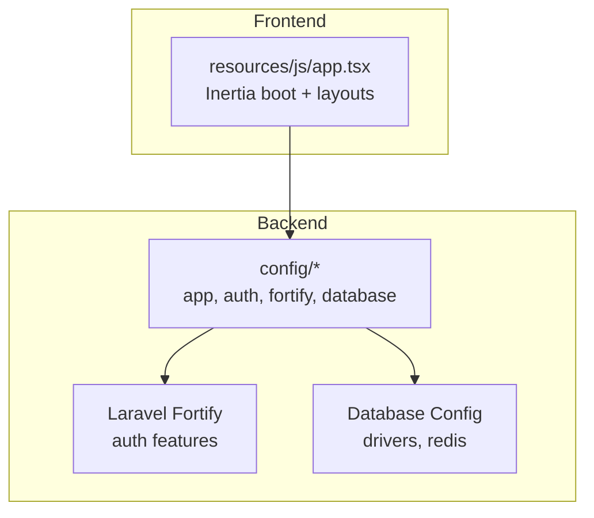
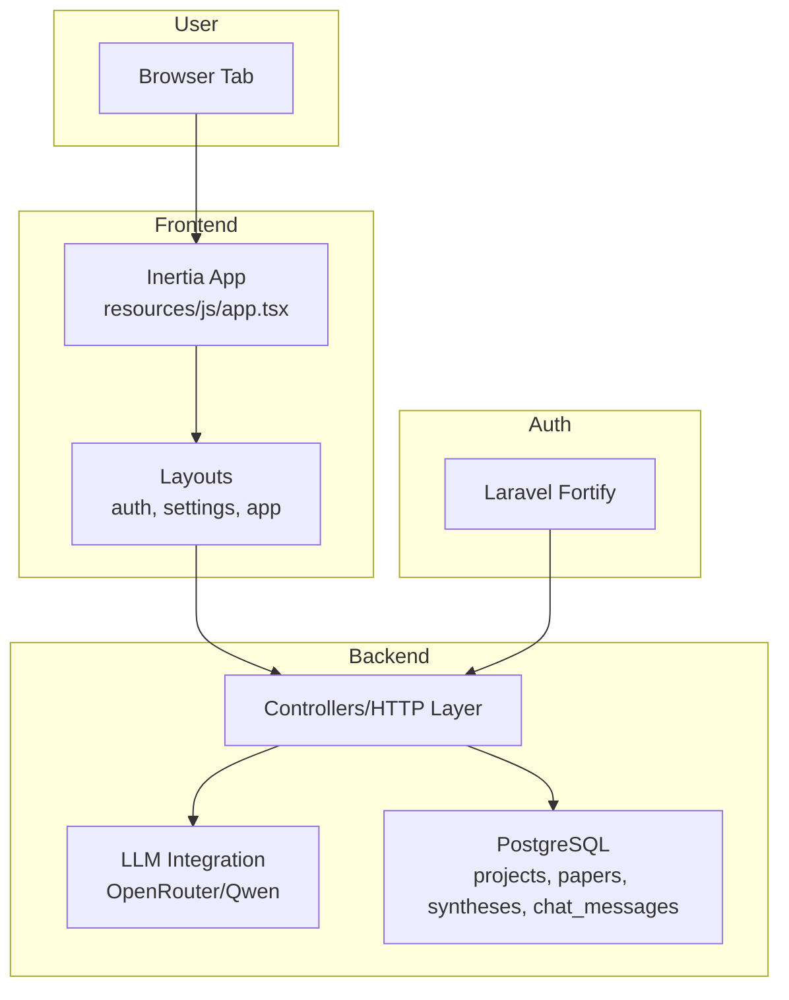
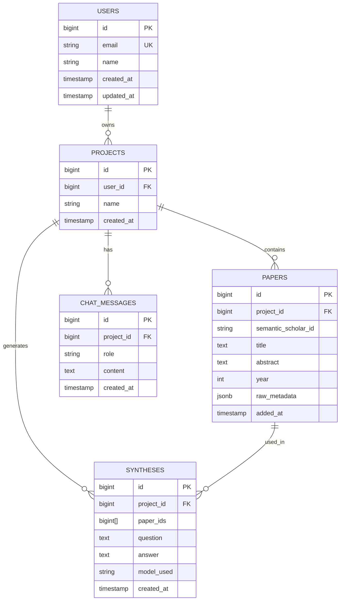
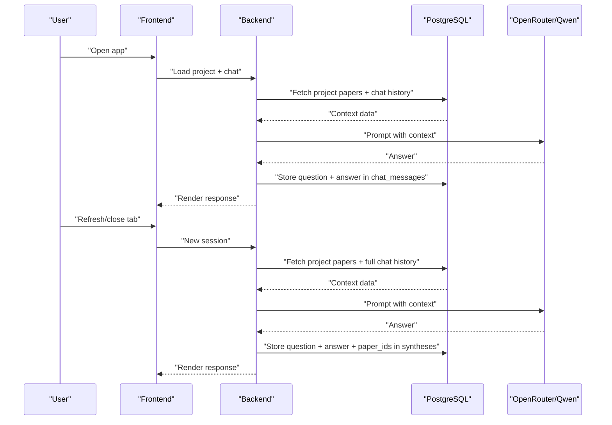
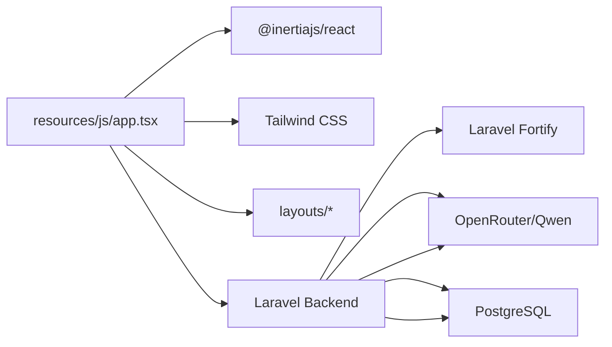

# Hackathon Competition Context

<cite>
**Referenced Files in This Document**
- [HACKATHON_SPEC.md](file://hackathon/HACKATHON_SPEC.md)
- [RULES.md](file://hackathon/RULES.md)
- [FULL_SPEC.md](file://hackathon/FULL_SPEC.md)
- [AGENTS.md](file://AGENTS.md)
- [CLAUDE.md](file://CLAUDE.md)
- [app.tsx](file://resources/js/app.tsx)
- [app.php](file://config/app.php)
- [auth.php](file://config/auth.php)
- [fortify.php](file://config/fortify.php)
- [database.php](file://config/database.php)
- [create_users_table.php](file://database/migrations/0001_01_01_000000_create_users_table.php)
- [add_two_factor_columns_to_users_table.php](file://database/migrations/2025_08_14_170933_add_two_factor_columns_to_users_table.php)
</cite>

## Table of Contents
1. [Introduction](#introduction)
2. [Project Structure](#project-structure)
3. [Core Components](#core-components)
4. [Architecture Overview](#architecture-overview)
5. [Detailed Component Analysis](#detailed-component-analysis)
6. [Dependency Analysis](#dependency-analysis)
7. [Performance Considerations](#performance-considerations)
8. [Troubleshooting Guide](#troubleshooting-guide)
9. [Conclusion](#conclusion)
10. [Appendices](#appendices)

## Introduction
This document provides comprehensive guidance for the ScholarGraph hackathon competition, focusing on Track 1: MemoryAgent. It consolidates competition rules, evaluation criteria, submission requirements, and the hackathon timeline. It also outlines the specific challenges and constraints for building a persistent, queryable memory agent that synthesizes across sessions, and offers practical advice for approaching the competition while maintaining code quality and innovation standards.

## Project Structure
The repository is a Laravel application with an Inertia + React frontend. Authentication is handled via Laravel Fortify, and the frontend bootstrapping is configured in the Inertia app entry. The database configuration supports multiple drivers, including PostgreSQL, which aligns with the hackathon specification’s data model.

**Diagram sources**
- [app.tsx:11-37](file://resources/js/app.tsx#L11-L37)
- [app.php:16-126](file://config/app.php#L16-L126)
- [auth.php:18-117](file://config/auth.php#L18-L117)
- [fortify.php:18-177](file://config/fortify.php#L18-L177)
- [database.php:20-184](file://config/database.php#L20-L184)

**Section sources**
- [app.tsx:1-41](file://resources/js/app.tsx#L1-L41)
- [app.php:1-127](file://config/app.php#L1-L127)
- [auth.php:1-118](file://config/auth.php#L1-L118)
- [fortify.php:1-178](file://config/fortify.php#L1-L178)
- [database.php:1-185](file://config/database.php#L1-L185)

## Core Components
- Track 1 scope: Build a research assistant that remembers every paper it has read and synthesizes across sessions. The demo must visibly demonstrate persistent memory and cross-session recall.
- Minimal data model: Projects, Papers, Syntheses, and Chat Messages. The chat history plus paper abstracts forms the agent’s context each turn, ensuring persistence across sessions.
- Retrieval approach: Keep it simple for a hackathon. Pull project papers (title + abstract) and the last N chat turns into the prompt. Optionally add a lightweight keyword filter later.
- LLM usage: Use a single mid-size Qwen model via OpenRouter for synthesis/chat. Log both question and answer in chat messages and record which papers informed the answer in syntheses.

Key constraints and priorities:
- Focus on end-to-end proof of persistent memory before adding polish.
- Demonstrate step 3 of the three-step arc: add papers, close tab/refresh, add new papers, ask a question requiring both old and new context.
- UI pass: paper list, chat thread, and optionally “sources used” indicators.

**Section sources**
- [HACKATHON_SPEC.md:7-21](file://hackathon/HACKATHON_SPEC.md#L7-L21)
- [HACKATHON_SPEC.md:33-82](file://hackathon/HACKATHON_SPEC.md#L33-L82)
- [HACKATHON_SPEC.md:83-118](file://hackathon/HACKATHON_SPEC.md#L83-L118)

## Architecture Overview
The system architecture centers on a Laravel backend, an Inertia/React frontend, and PostgreSQL for persistent memory. Authentication is provided by Laravel Fortify. The agent’s memory is queryable because context is reconstructed from stored chat messages and paper metadata on each request.

**Diagram sources**
- [app.tsx:11-37](file://resources/js/app.tsx#L11-L37)
- [HACKATHON_SPEC.md:39-82](file://hackathon/HACKATHON_SPEC.md#L39-L82)
- [fortify.php:18-177](file://config/fortify.php#L18-L177)

## Detailed Component Analysis

### Persistent Memory Data Model
The minimal schema ensures the agent can reconstruct context across sessions:
- Projects: user-scoped containers for organizing research.
- Papers: saved academic items with metadata and abstracts.
- Syntheses: logged Q&A with the set of papers used to inform the answer.
- Chat Messages: full conversation history enabling cross-session recall.

**Diagram sources**
- [HACKATHON_SPEC.md:39-82](file://hackathon/HACKATHON_SPEC.md#L39-L82)

**Section sources**
- [HACKATHON_SPEC.md:33-82](file://hackathon/HACKATHON_SPEC.md#L33-L82)

### End-to-End Demo Flow
The demo script validates persistent memory across sessions and demonstrates queryable recall.

**Diagram sources**
- [HACKATHON_SPEC.md:14-20](file://hackathon/HACKATHON_SPEC.md#L14-L20)
- [HACKATHON_SPEC.md:96-104](file://hackathon/HACKATHON_SPEC.md#L96-L104)

**Section sources**
- [HACKATHON_SPEC.md:14-20](file://hackathon/HACKATHON_SPEC.md#L14-L20)
- [HACKATHON_SPEC.md:96-104](file://hackathon/HACKATHON_SPEC.md#L96-L104)

### Build Order and Timeline
- Build order (time-boxed): Auth + project CRUD, Semantic Scholar search → save paper, chat endpoint, checkpoint, seed second session, UI pass, optional keyword filtering or minimal notes.
- Timeline:
  - Submission Period: May 26, 2026 (8:00 am PT) – July 9, 2026 (2:00 pm PT)
  - Judging Period: July 10, 2026 (8:00 am PT) – July 31, 2026 (2:00 pm PT)
  - Winners Announced: Around August 7, 2026 (2:00 pm PT)

Approach tips:
- Complete the three-step arc (add papers → refresh → add new papers → cross-session synthesis) before adding polish.
- Keep retrieval simple initially; add keyword filtering only if time remains.
- Ensure the demo is runnable and reproducible within the submission period.

**Section sources**
- [HACKATHON_SPEC.md:106-118](file://hackathon/HACKATHON_SPEC.md#L106-L118)
- [RULES.md:7-13](file://hackathon/RULES.md#L7-L13)

### Evaluation Criteria and Scoring
Each submission is evaluated by a panel using the following equally weighted criteria:
- Innovation & AI Creativity (30%): Sophisticated use of Qwen Cloud APIs, novel engineering/algorithmic approaches, performance optimization.
- Technical Depth & Engineering (30%): Architecture quality, engineering excellence, tech stack sophistication.
- Problem Value & Impact (25%): Real-world relevance, scalability potential.
- Presentation & Documentation (15%): Clarity of demo, clear documentation.

Tie-breaking follows the listed criteria in order.

**Section sources**
- [RULES.md:169-216](file://hackathon/RULES.md#L169-L216)

### Submission Requirements
- Project built with required developer tools and meeting the track scope.
- Public code repository with open-source license visible at the top of the repository page.
- Text description of features and functionality.
- Proof of Alibaba Cloud deployment (link to a code file demonstrating Alibaba Cloud service/API usage).
- Architecture diagram showing how Qwen Cloud connects to backend, database, and frontend.
- Demonstration video ≤3 minutes, publicly accessible on YouTube, Vimeo, or Youku, showing the project functioning on the intended platform.
- Identify the track (MemoryAgent).
- Optional blog post for Blog Post Prize (see Rules).

Testing:
- Provide a working demo or test build link; if private, include login credentials.
- Judges may evaluate based on provided materials; they are not required to test.

**Section sources**
- [RULES.md:101-146](file://hackathon/RULES.md#L101-L146)
- [RULES.md:137-146](file://hackathon/RULES.md#L137-L146)

### Intellectual Property and Collaboration
- Submissions must be original and solely owned by the Entrant(s), not violating third-party IP rights.
- Open-source components must comply with applicable licenses; enhancements must be clearly marked.
- Team/Organization entries require a Representative who meets eligibility requirements.
- By entering, you grant non-exclusive license to the Sponsor for judging and promotion; names/images may be used for promotion during and after the period.

**Section sources**
- [RULES.md:147-158](file://hackathon/RULES.md#L147-L158)
- [RULES.md:217-221](file://hackathon/RULES.md#L217-L221)

### Common Questions and Guidance
- Scope limitations: Focus on the three-step arc and persistent memory. Avoid building features outside the track unless time allows as stretch goals.
- Feature prioritization: End-to-end proof of cross-session recall is mandatory; UI polish and optional retrieval improvements are secondary.
- Demonstration requirements: The video must be under 3 minutes and clearly show the project functioning on the intended platform. Include a link on the submission form.

**Section sources**
- [HACKATHON_SPEC.md:14-20](file://hackathon/HACKATHON_SPEC.md#L14-L20)
- [HACKATHON_SPEC.md:119-130](file://hackathon/HACKATHON_SPEC.md#L119-L130)
- [RULES.md:115-124](file://hackathon/RULES.md#L115-L124)

## Dependency Analysis
The frontend relies on Inertia for SPA behavior and Tailwind for styling. Authentication is handled by Laravel Fortify. The backend stores persistent memory in PostgreSQL and integrates with OpenRouter for LLM inference.

**Diagram sources**
- [app.tsx:1-41](file://resources/js/app.tsx#L1-L41)
- [AGENTS.md:26-31](file://AGENTS.md#L26-L31)
- [fortify.php:18-177](file://config/fortify.php#L18-L177)
- [database.php:87-100](file://config/database.php#L87-L100)

**Section sources**
- [app.tsx:1-41](file://resources/js/app.tsx#L1-L41)
- [AGENTS.md:26-31](file://AGENTS.md#L26-L31)
- [fortify.php:18-177](file://config/fortify.php#L18-L177)
- [database.php:87-100](file://config/database.php#L87-L100)

## Performance Considerations
- Keep retrieval simple for a hackathon: pull project papers (title + abstract) and recent chat turns into the prompt. Avoid building a vector store initially.
- If time remains, consider a lightweight keyword filter (e.g., PostgreSQL full-text search) to cap context growth.
- Optimize prompts and model selection via OpenRouter to balance cost and quality.

**Section sources**
- [HACKATHON_SPEC.md:83-118](file://hackathon/HACKATHON_SPEC.md#L83-L118)

## Troubleshooting Guide
- Authentication and session issues:
  - Verify Fortify configuration and home path.
  - Ensure sessions are persisted and cookies are accepted.
- Database connectivity:
  - Confirm the default connection and driver alignment with the schema.
  - Check migrations for users and sessions.
- Frontend not reflecting changes:
  - Rebuild or run dev/build as needed; ensure Vite manifest is up to date.
- Demo video and submission:
  - Ensure the video is hosted on YouTube, Vimeo, or Youku and the link is provided on the submission form.
  - Include a public repository with an open-source license and clear instructions for testing.

**Section sources**
- [fortify.php:76](file://config/fortify.php#L76)
- [database.php:20](file://config/database.php#L20)
- [create_users_table.php:14-38](file://database/migrations/0001_01_01_000000_create_users_table.php#L14-L38)
- [add_two_factor_columns_to_users_table.php:14-18](file://database/migrations/2025_08_14_170933_add_two_factor_columns_to_users_table.php#L14-L18)
- [AGENTS.md:175-178](file://AGENTS.md#L175-L178)
- [RULES.md:115-124](file://hackathon/RULES.md#L115-L124)

## Conclusion
For Track 1: MemoryAgent, the competition rewards a clear, end-to-end demonstration of persistent, queryable memory across sessions. Prioritize completing the three-step arc, keep retrieval simple, and ensure a polished demo and documentation. Adhere to submission requirements and evaluation criteria to maximize your chances of success.

## Appendices

### Appendix A: Full Product Spec Overview
While the hackathon focuses on a minimal subset, the full product spec provides broader context for the system’s intended evolution, including advanced modules and data modeling.

**Section sources**
- [FULL_SPEC.md:1-209](file://hackathon/FULL_SPEC.md#L1-L209)

### Appendix B: Laravel and Frontend Guidelines
Follow Laravel Boost guidelines for structure, testing, and tooling to maintain consistency and quality.

**Section sources**
- [AGENTS.md:1-208](file://AGENTS.md#L1-L208)
- [CLAUDE.md:1-208](file://CLAUDE.md#L1-L208)