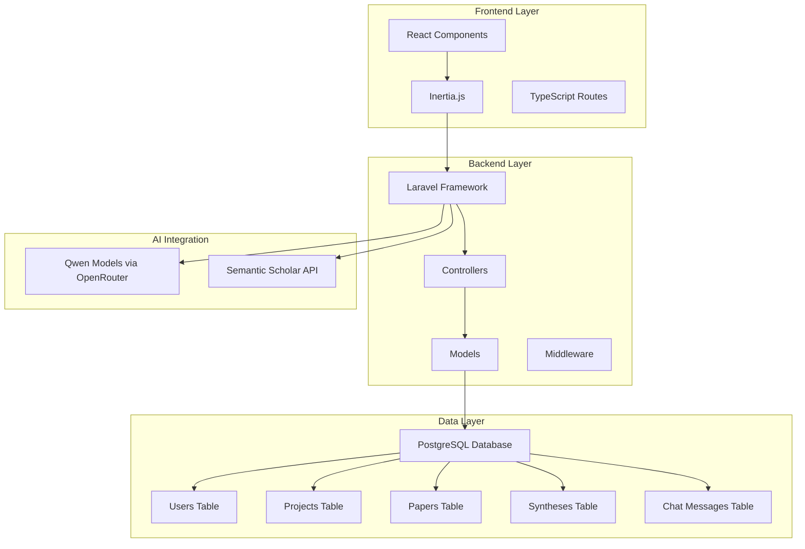
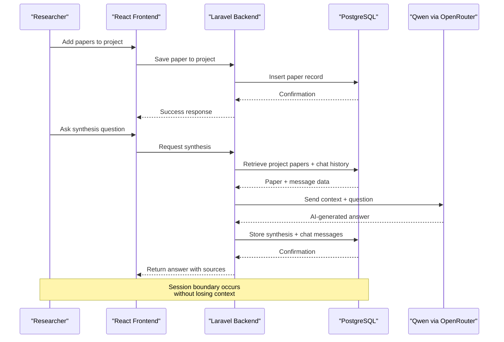
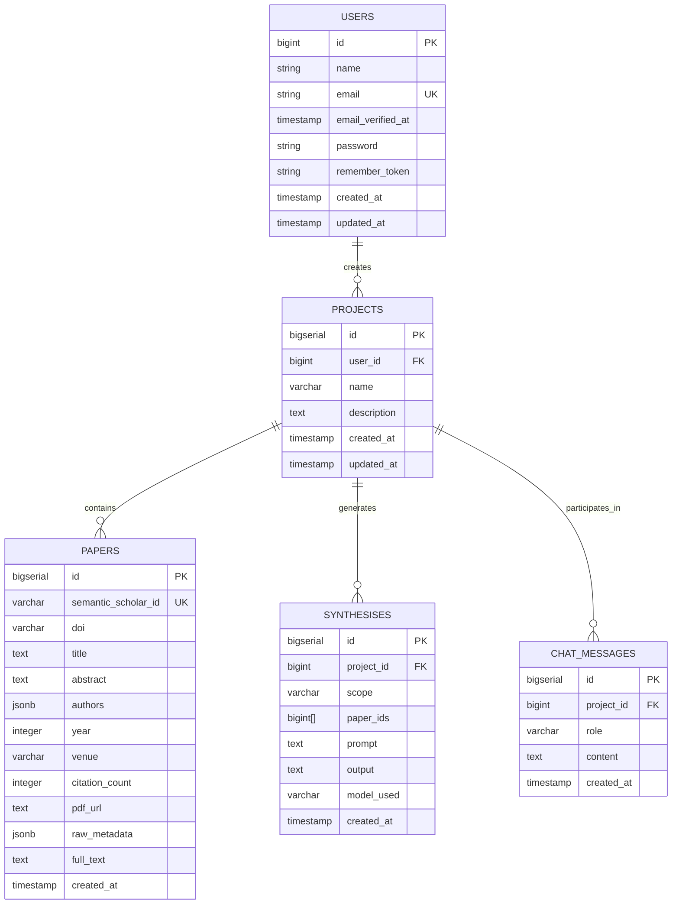
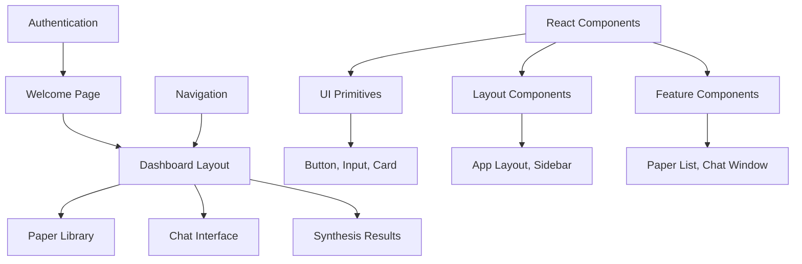
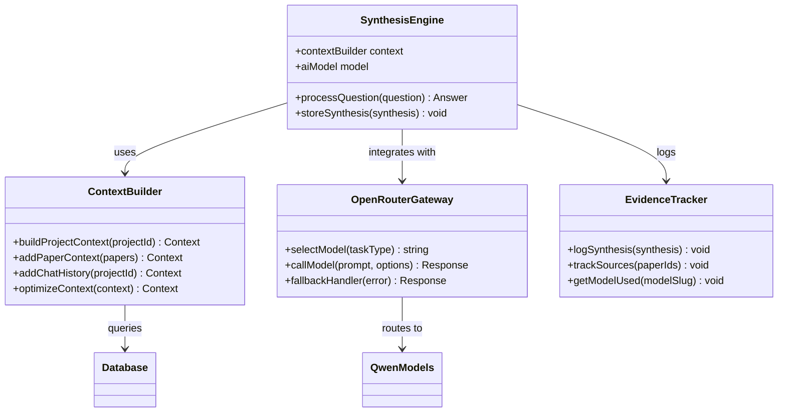
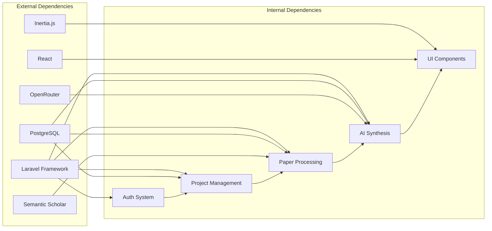

# Project Overview

<cite>
**Referenced Files in This Document**
- [FULL_SPEC.md](file://hackathon/FULL_SPEC.md)
- [HACKATHON_SPEC.md](file://hackathon/HACKATHON_SPEC.md)
- [RULES.md](file://hackathon/RULES.md)
- [database.php](file://config/database.php)
- [0001_01_01_000000_create_users_table.php](file://database/migrations/0001_01_01_000000_create_users_table.php)
- [app.tsx](file://resources/js/app.tsx)
- [welcome.tsx](file://resources/js/pages/welcome.tsx)
- [dashboard.tsx](file://resources/js/pages/dashboard.tsx)
- [app-layout.tsx](file://resources/js/layouts/app-layout.tsx)
- [index.ts](file://resources/js/routes/index.ts)
</cite>

## Table of Contents
1. [Introduction](#introduction)
2. [Project Structure](#project-structure)
3. [Core Components](#core-components)
4. [Architecture Overview](#architecture-overview)
5. [Detailed Component Analysis](#detailed-component-analysis)
6. [Dependency Analysis](#dependency-analysis)
7. [Performance Considerations](#performance-considerations)
8. [Troubleshooting Guide](#troubleshooting-guide)
9. [Conclusion](#conclusion)

## Introduction
ScholarGraph is a persistent memory research assistant designed to maintain contextual awareness across multiple research sessions. Its mission is to revolutionize academic research by integrating AI to provide transparent, evidence-based synthesis of academic papers. The system ensures that researchers do not re-read, re-search, and re-derive connections between previously processed papers because nothing persists their understanding of the literature across sessions.

Key capabilities include:
- Persistent memory: Retains and recalls information across sessions using a queryable memory mechanism
- Cross-paper synthesis: AI-powered synthesis that draws on multiple papers within a project
- Evidence-based responses: Every answer is tied to specific stored papers with transparent attribution
- Academic-focused workflow: Designed for MSc/PhD research workloads and later productizable as SaaS

The project emerged from a hackathon competition track focused on MemoryAgent, where the goal was to demonstrate a research assistant that remembers every paper it's read and synthesizes across sessions. This capability distinguishes ScholarGraph from generic memory chatbots by grounding every answer in specific stored papers rather than vague chat history.

## Project Structure
The ScholarGraph project follows a modern Laravel application architecture with a React frontend using Inertia.js for seamless server-side rendering. The structure emphasizes separation of concerns while maintaining simplicity for the hackathon scope.

**Diagram sources**
- [app.tsx:1-41](file://resources/js/app.tsx#L1-L41)
- [database.php:33-100](file://config/database.php#L33-L100)
- [FULL_SPEC.md:35-97](file://hackathon/FULL_SPEC.md#L35-L97)

The frontend architecture uses Inertia.js to bridge React components with Laravel backend routes, enabling server-side rendering while maintaining a modern single-page application experience. The backend leverages Laravel's robust MVC pattern with Eloquent ORM for database operations.

**Section sources**
- [app.tsx:1-41](file://resources/js/app.tsx#L1-L41)
- [database.php:33-100](file://config/database.php#L33-L100)
- [welcome.tsx:1-390](file://resources/js/pages/welcome.tsx#L1-L390)

## Core Components
ScholarGraph consists of several interconnected components that work together to provide persistent memory research assistance:

### Persistent Memory System
The core innovation lies in the persistent memory mechanism that stores research context across sessions. This system uses PostgreSQL tables to maintain:
- Project context with user ownership and metadata
- Paper library with semantic scholar integration
- Synthesis history with transparent attribution
- Chat message history for contextual grounding

### AI Synthesis Engine
The system integrates Qwen models via OpenRouter to provide:
- Single-paper chat capabilities with grounded responses
- Cross-paper synthesis for comparative analysis
- Evidence extraction for systematic review workflows
- Transparent model attribution for research reproducibility

### Research Workflow Management
The application manages academic research workflows through:
- Project-based organization with user permissions
- Paper library with semantic scholar integration
- Tagging and categorization systems
- Citation management and export capabilities

**Section sources**
- [HACKATHON_SPEC.md:39-75](file://hackathon/HACKATHON_SPEC.md#L39-L75)
- [FULL_SPEC.md:141-148](file://hackathon/FULL_SPEC.md#L141-L148)

## Architecture Overview
The ScholarGraph architecture implements a clean separation between frontend presentation and backend processing, with AI services integrated through standardized APIs.

**Diagram sources**
- [HACKATHON_SPEC.md:77-81](file://hackathon/HACKATHON_SPEC.md#L77-L81)
- [FULL_SPEC.md:141-148](file://hackathon/FULL_SPEC.md#L141-L148)

The architecture ensures that the AI synthesis engine receives fresh context from the database on each request, maintaining persistence across browser refreshes and session boundaries. This design prevents the common issue where AI assistants lose context after page reloads.

**Section sources**
- [HACKATHON_SPEC.md:77-81](file://hackathon/HACKATHON_SPEC.md#L77-L81)
- [FULL_SPEC.md:141-148](file://hackathon/FULL_SPEC.md#L141-L148)

## Detailed Component Analysis

### Data Model Architecture
The database schema supports the persistent memory functionality through carefully designed relationships:

**Diagram sources**
- [FULL_SPEC.md:35-97](file://hackathon/FULL_SPEC.md#L35-L97)
- [0001_01_01_000000_create_users_table.php:14-37](file://database/migrations/0001_01_01_000000_create_users_table.php#L14-L37)

The data model supports the hackathon's persistent memory requirement through the chat_messages table, which serves as the primary context store for AI interactions. Every project maintains a complete conversation history that the AI can reference regardless of session boundaries.

**Section sources**
- [FULL_SPEC.md:35-97](file://hackathon/FULL_SPEC.md#L35-L97)
- [HACKATHON_SPEC.md:68-74](file://hackathon/HACKATHON_SPEC.md#L68-L74)

### Frontend Architecture
The frontend implementation uses React with Inertia.js to create a seamless user experience:

**Diagram sources**
- [welcome.tsx:5-37](file://resources/js/pages/welcome.tsx#L5-L37)
- [dashboard.tsx:5-27](file://resources/js/pages/dashboard.tsx#L5-L27)
- [app-layout.tsx:4-16](file://resources/js/layouts/app-layout.tsx#L4-L16)

The frontend architecture emphasizes modularity with reusable UI components and clear separation between layout and content components. The Inertia.js integration allows for server-side rendering while maintaining responsive client-side interactions.

**Section sources**
- [welcome.tsx:1-390](file://resources/js/pages/welcome.tsx#L1-L390)
- [dashboard.tsx:1-37](file://resources/js/pages/dashboard.tsx#L1-L37)
- [app-layout.tsx:1-17](file://resources/js/layouts/app-layout.tsx#L1-L17)

### AI Integration Pattern
The system integrates with Qwen models through OpenRouter, providing flexibility for model selection and fallback scenarios:

**Diagram sources**
- [HACKATHON_SPEC.md:92-104](file://hackathon/HACKATHON_SPEC.md#L92-L104)
- [FULL_SPEC.md:174-182](file://hackathon/FULL_SPEC.md#L174-L182)

The AI integration pattern ensures that each synthesis operation builds context from scratch using database queries, guaranteeing persistence across sessions. The evidence tracking system maintains transparency by recording which papers contributed to each answer and which model produced it.

**Section sources**
- [HACKATHON_SPEC.md:92-104](file://hackathon/HACKATHON_SPEC.md#L92-L104)
- [FULL_SPEC.md:174-182](file://hackathon/FULL_SPEC.md#L174-L182)

## Dependency Analysis
The project maintains clear dependency relationships that support both hackathon constraints and long-term scalability:

**Diagram sources**
- [database.php:87-100](file://config/database.php#L87-L100)
- [FULL_SPEC.md:12-21](file://hackathon/FULL_SPEC.md#L12-L21)

The dependency structure prioritizes simplicity for the hackathon scope while maintaining extensibility for future phases. The OpenRouter integration provides abstraction over Qwen model variations, supporting easy model switching without code changes.

**Section sources**
- [database.php:87-100](file://config/database.php#L87-L100)
- [FULL_SPEC.md:12-21](file://hackathon/FULL_SPEC.md#L12-L21)

## Performance Considerations
The system is designed with performance in mind for both development and production scenarios:

- **Database Optimization**: PostgreSQL indexes on frequently queried fields (titles, bodies) enable efficient full-text search operations
- **Context Limiting**: The hackathon specification intentionally limits context size to prevent unbounded growth, focusing on quality over quantity
- **Model Selection**: Different Qwen tiers are assigned to different tasks based on computational requirements and cost considerations
- **Caching Strategy**: Semantic Scholar API responses are cached locally to reduce external dependency overhead

## Troubleshooting Guide
Common issues and their solutions:

### Authentication Issues
- Verify user registration and login flows
- Check session management and cookie configuration
- Ensure proper CSRF protection for form submissions

### Database Connection Problems
- Verify PostgreSQL service is running
- Check connection credentials in environment variables
- Ensure required extensions are enabled

### AI Integration Challenges
- Monitor OpenRouter API quotas and rate limits
- Implement proper error handling for model failures
- Verify API keys and authentication tokens

### Frontend Rendering Issues
- Check Inertia.js configuration and route definitions
- Verify React component compilation and bundling
- Ensure proper asset loading and caching

**Section sources**
- [database.php:20-100](file://config/database.php#L20-L100)
- [RULES.md:61-63](file://hackathon/RULES.md#L61-L63)

## Conclusion
ScholarGraph represents a significant advancement in academic research assistance through its innovative persistent memory system. By combining PostgreSQL-backed context storage with Qwen AI models, the system achieves true continuity across research sessions while maintaining transparency and reproducibility.

The hackathon-focused implementation demonstrates the core concept of "persistent, queryable memory" that distinguishes ScholarGraph from generic AI assistants. The transparent evidence attribution system ensures that every research insight can be traced back to its source materials, supporting rigorous academic standards.

Looking forward, the project's modular architecture and clear separation of concerns position it well for expansion into a comprehensive research management platform, with potential applications ranging from individual researcher assistance to collaborative team environments.