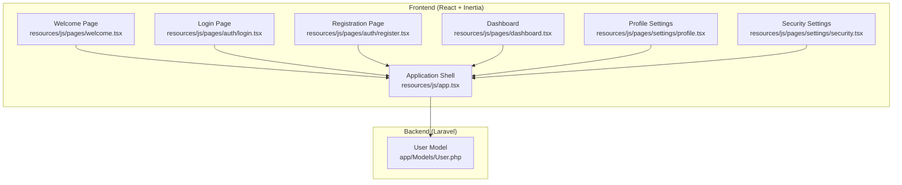
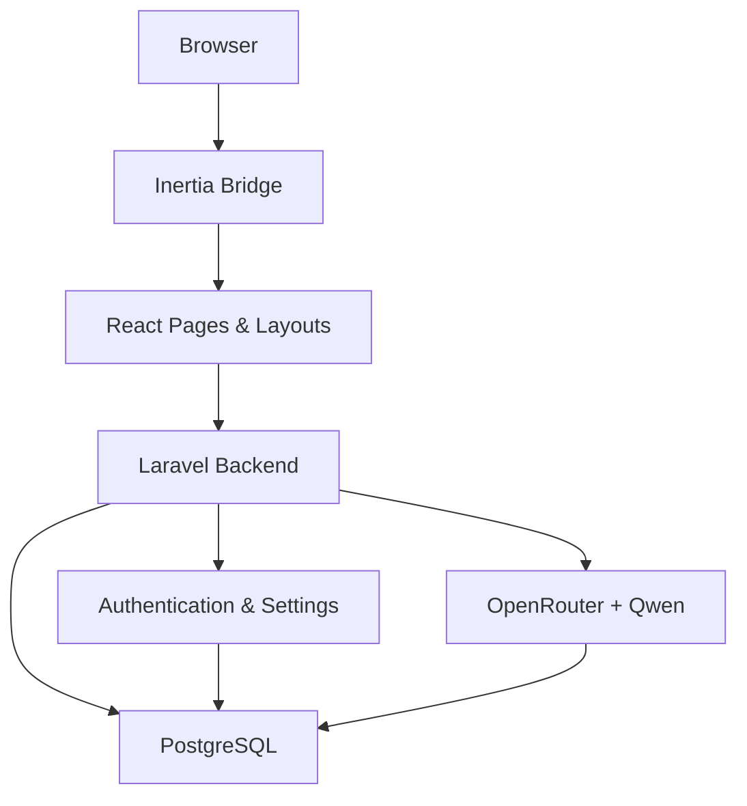
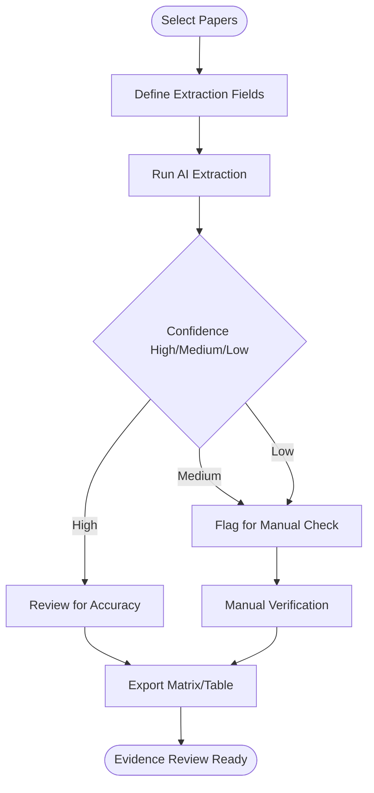
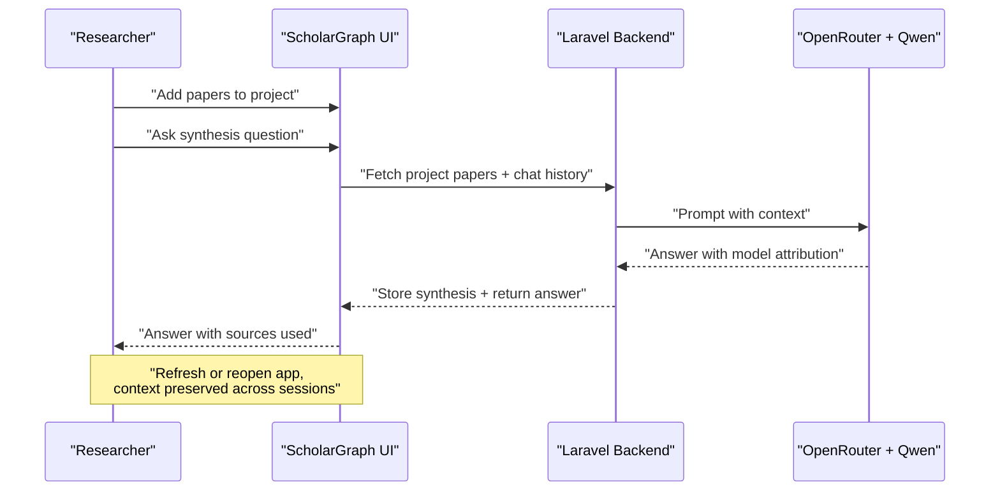
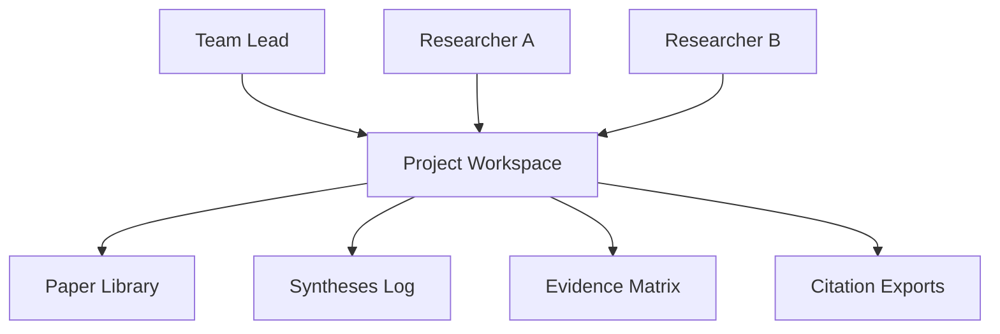
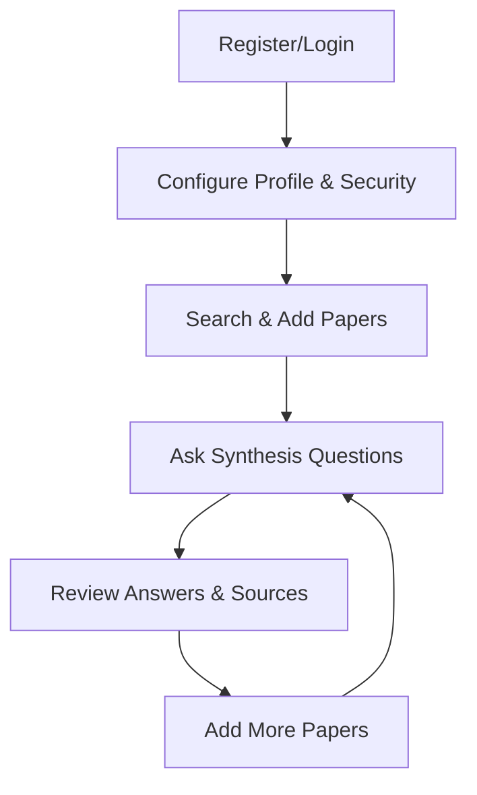
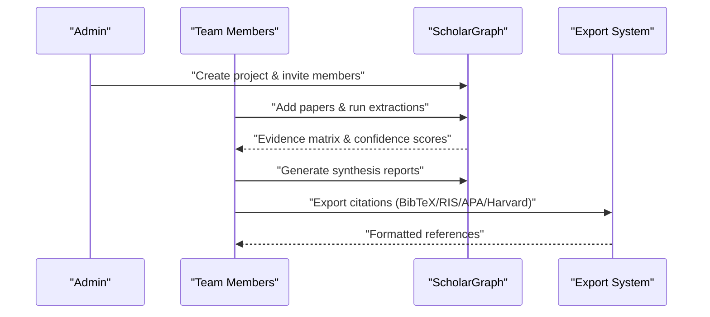
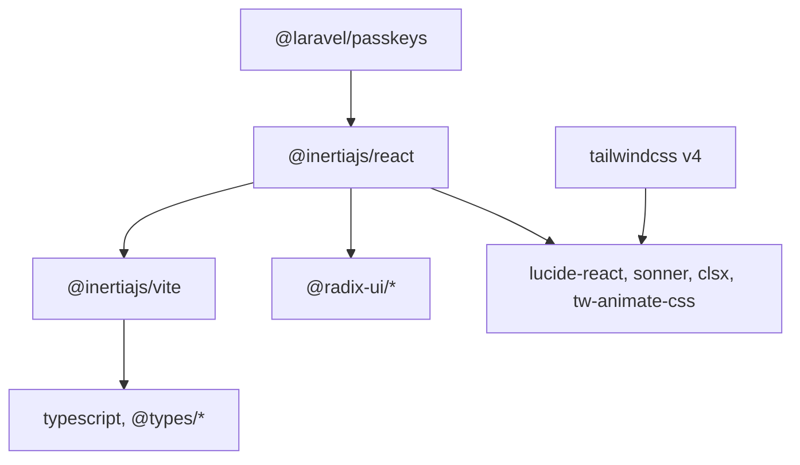

# Target Audience & Use Cases

<cite>
**Referenced Files in This Document**
- [FULL_SPEC.md](file://hackathon/FULL_SPEC.md)
- [HACKATHON_SPEC.md](file://hackathon/HACKATHON_SPEC.md)
- [package.json](file://package.json)
- [app.tsx](file://resources/js/app.tsx)
- [welcome.tsx](file://resources/js/pages/welcome.tsx)
- [login.tsx](file://resources/js/pages/auth/login.tsx)
- [register.tsx](file://resources/js/pages/auth/register.tsx)
- [profile.tsx](file://resources/js/pages/settings/profile.tsx)
- [security.tsx](file://resources/js/pages/settings/security.tsx)
- [dashboard.tsx](file://resources/js/pages/dashboard.tsx)
- [User.php](file://app/Models/User.php)
</cite>

## Table of Contents
1. [Introduction](#introduction)
2. [Project Structure](#project-structure)
3. [Core Components](#core-components)
4. [Architecture Overview](#architecture-overview)
5. [Detailed Component Analysis](#detailed-component-analysis)
6. [Dependency Analysis](#dependency-analysis)
7. [Performance Considerations](#performance-considerations)
8. [Troubleshooting Guide](#troubleshooting-guide)
9. [Conclusion](#conclusion)

## Introduction
ScholarGraph is an academic research and literature synthesis tool designed to solve the persistent problem of researchers re-reading, re-searching, and re-deriving connections between papers they've already processed. The application maintains a queryable, synthesized memory of everything a user has read, enabling seamless continuation of research across sessions. It serves both individual researchers and institutional teams, with a foundation that supports personal research assistance and a roadmap toward SaaS productization.

Primary user groups include:
- Graduate students conducting literature reviews and research synthesis
- Researchers and academics building systematic reviews and evidence matrices
- Research professionals managing collaborative projects and institutional repositories
- Teams requiring citation management, export, and writing assistance grounded in extracted evidence

Value propositions:
- Eliminate literature review fatigue by preserving understanding across sessions
- Reduce context switching through integrated paper libraries, notes, and synthesis
- Enhance evidence management with structured extraction, confidence scoring, and reproducible outputs
- Support both individual productivity and team collaboration with project scoping and export capabilities

## Project Structure
The application follows a Laravel backend with an Inertia + React frontend, PostgreSQL for persistence, and OpenRouter-powered Qwen models for AI synthesis. The frontend is organized around pages, layouts, components, and typed route generation, while the backend provides authentication, settings, and foundational models.

**Diagram sources**
- [welcome.tsx:1-390](file://resources/js/pages/welcome.tsx#L1-L390)
- [login.tsx:1-118](file://resources/js/pages/auth/login.tsx#L1-L118)
- [register.tsx:1-121](file://resources/js/pages/auth/register.tsx#L1-L121)
- [dashboard.tsx:1-37](file://resources/js/pages/dashboard.tsx#L1-L37)
- [profile.tsx:1-139](file://resources/js/pages/settings/profile.tsx#L1-L139)
- [security.tsx:1-148](file://resources/js/pages/settings/security.tsx#L1-L148)
- [app.tsx:1-41](file://resources/js/app.tsx#L1-L41)
- [User.php:1-51](file://app/Models/User.php#L1-L51)

**Section sources**
- [package.json:1-77](file://package.json#L1-L77)
- [app.tsx:1-41](file://resources/js/app.tsx#L1-L41)
- [welcome.tsx:1-390](file://resources/js/pages/welcome.tsx#L1-L390)
- [User.php:1-51](file://app/Models/User.php#L1-L51)

## Core Components
- Authentication and user lifecycle: registration, login, passkey verification, and two-factor authentication support
- Personal dashboard and project/workspace scaffolding
- Settings for profile and security (password updates, passkeys, two-factor)
- Foundation for research memory: projects, paper libraries, and synthesis/chat history

Key capabilities derived from the specification:
- Persistent, queryable memory across sessions via stored synthesis and chat messages
- AI synthesis and chat over papers with model attribution and reproducibility
- Evidence extraction with confidence scoring for systematic review workflows
- Citation export and formatting for academic writing

**Section sources**
- [FULL_SPEC.md:1-209](file://hackathon/FULL_SPEC.md#L1-L209)
- [HACKATHON_SPEC.md:1-137](file://hackathon/HACKATHON_SPEC.md#L1-L137)
- [login.tsx:1-118](file://resources/js/pages/auth/login.tsx#L1-L118)
- [register.tsx:1-121](file://resources/js/pages/auth/register.tsx#L1-L121)
- [profile.tsx:1-139](file://resources/js/pages/settings/profile.tsx#L1-L139)
- [security.tsx:1-148](file://resources/js/pages/settings/security.tsx#L1-L148)
- [dashboard.tsx:1-37](file://resources/js/pages/dashboard.tsx#L1-L37)

## Architecture Overview
The system architecture integrates a Laravel backend with an Inertia-driven React frontend, PostgreSQL for data persistence, and OpenRouter/Qwen for AI synthesis. The frontend bootstraps layouts and theme handling, while the backend manages authentication, user profiles, and settings.

**Diagram sources**
- [app.tsx:1-41](file://resources/js/app.tsx#L1-L41)
- [login.tsx:1-118](file://resources/js/pages/auth/login.tsx#L1-L118)
- [register.tsx:1-121](file://resources/js/pages/auth/register.tsx#L1-L121)
- [profile.tsx:1-139](file://resources/js/pages/settings/profile.tsx#L1-L139)
- [security.tsx:1-148](file://resources/js/pages/settings/security.tsx#L1-L148)
- [User.php:1-51](file://app/Models/User.php#L1-L51)
- [FULL_SPEC.md:12-26](file://hackathon/FULL_SPEC.md#L12-L26)

## Detailed Component Analysis

### User Personas and Value Propositions
- Graduate student: Reduces repetitive reading and improves synthesis continuity across study sessions
- Academic researcher: Accelerates systematic review workflows with structured extraction and reproducible outputs
- Research professional: Streamlines collaborative evidence management and citation export for team projects
- Institutional team: Supports scalable project scoping, multi-user contexts, and standardized citation formats

Value outcomes:
- Reduced cognitive load and time spent re-establishing context
- Enhanced reproducibility through model attribution and stored synthesis logs
- Improved quality control via confidence scoring and grounding checks
- Seamless collaboration through project-scoped exports and shared synthesis

**Section sources**
- [FULL_SPEC.md:3-11](file://hackathon/FULL_SPEC.md#L3-L11)
- [HACKATHON_SPEC.md:7-21](file://hackathon/HACKATHON_SPEC.md#L7-L21)

### Use Case: Systematic Reviews and Evidence Extraction
ScholarGraph enables researchers to define extraction fields (e.g., method, sample size, finding, limitation), run AI over selected papers, and surface results in a sortable, filterable table. Confidence flags help prioritize manual verification.

**Diagram sources**
- [FULL_SPEC.md:150-157](file://hackathon/FULL_SPEC.md#L150-L157)

**Section sources**
- [FULL_SPEC.md:150-157](file://hackathon/FULL_SPEC.md#L150-L157)

### Use Case: Literature Surveys and Ongoing Synthesis
Researchers can continuously add papers to a project, ask synthesis questions, and observe how answers evolve with new inputs. Session boundaries do not erase prior understanding thanks to stored synthesis and chat history.

**Diagram sources**
- [HACKATHON_SPEC.md:77-81](file://hackathon/HACKATHON_SPEC.md#L77-L81)
- [FULL_SPEC.md:141-149](file://hackathon/FULL_SPEC.md#L141-L149)

**Section sources**
- [HACKATHON_SPEC.md:13-21](file://hackathon/HACKATHON_SPEC.md#L13-L21)
- [HACKATHON_SPEC.md:77-82](file://hackathon/HACKATHON_SPEC.md#L77-L82)

### Use Case: Collaborative Research Projects
Projects serve as scoped workspaces for team collaboration. Features supporting collaboration include:
- Project-scoped paper libraries and synthesis
- Evidence extraction matrices for shared review
- Citation export and formatting for institutional standards

**Diagram sources**
- [FULL_SPEC.md:189-196](file://hackathon/FULL_SPEC.md#L189-L196)

**Section sources**
- [FULL_SPEC.md:189-196](file://hackathon/FULL_SPEC.md#L189-L196)

### User Workflows

#### Individual Researcher Workflow
- Onboarding: Register and verify email
- Setup: Configure profile and security (passkeys/two-factor)
- Discovery: Search and add papers to a project
- Synthesis: Ask questions and review answers with source attribution
- Review: Iterate with new papers and updated synthesis

**Diagram sources**
- [register.tsx:1-121](file://resources/js/pages/auth/register.tsx#L1-L121)
- [login.tsx:1-118](file://resources/js/pages/auth/login.tsx#L1-L118)
- [profile.tsx:1-139](file://resources/js/pages/settings/profile.tsx#L1-L139)
- [security.tsx:1-148](file://resources/js/pages/settings/security.tsx#L1-L148)
- [dashboard.tsx:1-37](file://resources/js/pages/dashboard.tsx#L1-L37)

**Section sources**
- [register.tsx:1-121](file://resources/js/pages/auth/register.tsx#L1-L121)
- [login.tsx:1-118](file://resources/js/pages/auth/login.tsx#L1-L118)
- [profile.tsx:1-139](file://resources/js/pages/settings/profile.tsx#L1-L139)
- [security.tsx:1-148](file://resources/js/pages/settings/security.tsx#L1-L148)
- [dashboard.tsx:1-37](file://resources/js/pages/dashboard.tsx#L1-L37)

#### Institutional Team Workflow
- Project creation and scoping
- Multi-user access and permissions
- Shared evidence extraction and synthesis
- Export citations and formatting for submission

**Diagram sources**
- [FULL_SPEC.md:158-167](file://hackathon/FULL_SPEC.md#L158-L167)
- [FULL_SPEC.md:189-196](file://hackathon/FULL_SPEC.md#L189-L196)

**Section sources**
- [FULL_SPEC.md:158-167](file://hackathon/FULL_SPEC.md#L158-L167)
- [FULL_SPEC.md:189-196](file://hackathon/FULL_SPEC.md#L189-L196)

## Dependency Analysis
Frontend dependencies emphasize React, Inertia, Radix UI primitives, Tailwind CSS v4, and TypeScript tooling. The application leverages Inertia for seamless client-server integration and a cohesive single-page experience.

**Diagram sources**
- [package.json:31-67](file://package.json#L31-L67)

**Section sources**
- [package.json:1-77](file://package.json#L1-L77)

## Performance Considerations
- AI synthesis cost control: Use smaller models for bulk tasks and larger models for cross-paper synthesis; implement per-project caps or cost-aware warnings
- Retrieval simplicity: For small-scale demos, rely on full-text search and recent chat history rather than vector stores
- Scalability: Plan for API key usage and caching strategies as Semantic Scholar free-tier limits may constrain growth

[No sources needed since this section provides general guidance]

## Troubleshooting Guide
Common areas to verify:
- Authentication: Ensure passkey verification and two-factor flows are functioning; confirm email verification steps
- Settings: Validate password update flows and passkey/two-factor management
- Frontend bundling: If UI changes are not reflected, rebuild assets or run development server

**Section sources**
- [security.tsx:1-148](file://resources/js/pages/settings/security.tsx#L1-L148)
- [profile.tsx:1-139](file://resources/js/pages/settings/profile.tsx#L1-L139)
- [login.tsx:1-118](file://resources/js/pages/auth/login.tsx#L1-L118)
- [register.tsx:1-121](file://resources/js/pages/auth/register.tsx#L1-L121)
- [AGENTS.md:175-178](file://AGENTS.md#L175-L178)

## Conclusion
ScholarGraph addresses core research pain points by anchoring understanding in persistent, queryable synthesis and chat history. Its modular roadmap—from personal research assistant to multi-user, productized platform—aligns with the needs of graduate students, researchers, academics, and institutional teams. By reducing literature review fatigue, minimizing context switching, and strengthening evidence management, ScholarGraph enhances both individual productivity and collaborative research quality.